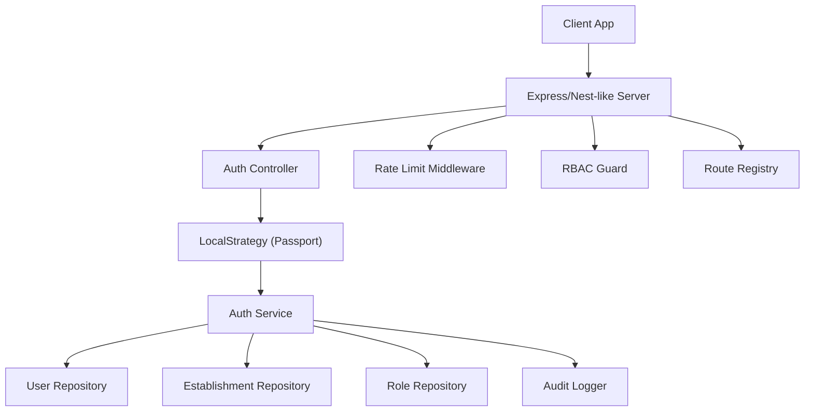
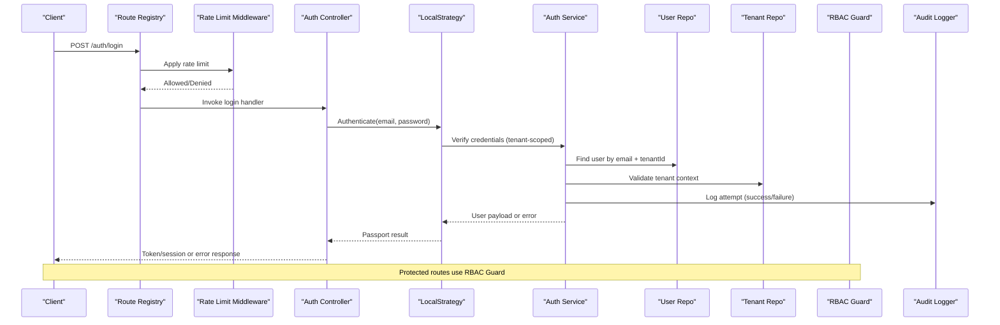
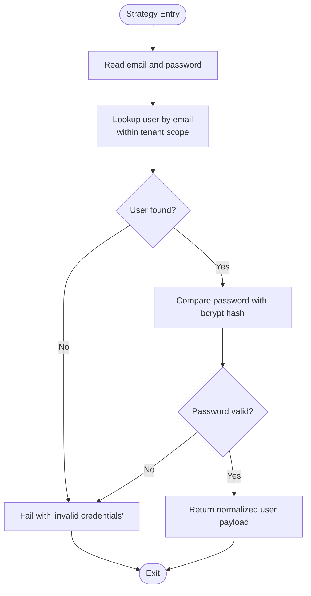
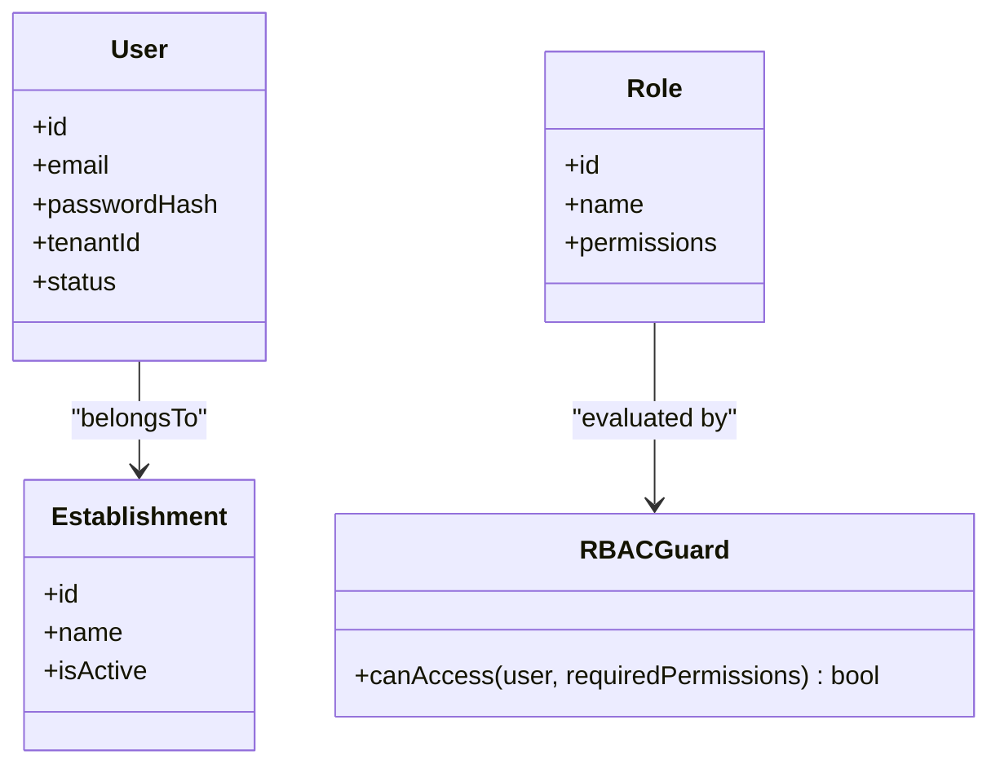
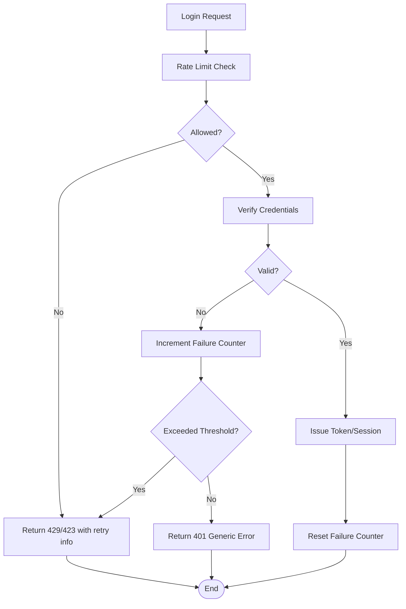
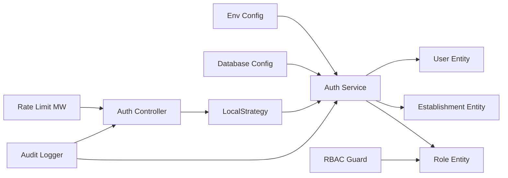

# Email/Password Authentication Strategy

<cite>
**Referenced Files in This Document**
- [auth.ts](file://backend/src/modules/auth/auth.ts)
- [local.strategy.ts](file://backend/src/modules/auth/local.strategy.ts)
- [auth.controller.ts](file://backend/src/modules/auth/controllers/auth.controller.ts)
- [auth.service.ts](file://backend/src/modules/auth/services/auth.service.ts)
- [user.entity.ts](file://backend/src/modules/utilisateurs/entities/user.entity.ts)
- [etablissement.entity.ts](file://backend/src/modules/etablissement/entities/etablissement.entity.ts)
- [role.entity.ts](file://backend/src/modules/rbac/entities/role.entity.ts)
- [rbac.guard.ts](file://backend/src/modules/rbac/guards/rbac.guard.ts)
- [rate.limit.middleware.ts](file://backend/src/common/middlewares/rate.limit.middleware.ts)
- [audit.logger.ts](file://backend/src/common/services/audit.logger.ts)
- [env.config.ts](file://backend/src/config/env.config.ts)
- [database.config.ts](file://backend/src/config/database.config.ts)
- [app.ts](file://backend/src/app.ts)
- [index.ts](file://backend/src/index.ts)
- [route-registry.ts](file://backend/src/routes/route-registry.ts)
- [027-auth-multi-mode.sql](file://backend/database/migrations/027-auth-multi-mode.sql)
- [IMPLÉMENTATION-AUTH-COMPLETE.md](file://docs/implementations/IMPLÉMENTATION-AUTH-COMPLETE.md)
- [GUIDE-AUTHENTIFICATION.md](file://docs/guides/GUIDE-AUTHENTIFICATION.md)
- [ANALYSE-ROUTE-LOGIN.md](file://docs/analyses/ANALYSE-ROUTE-LOGIN.md)
- [SYSTEME-BLOCAGE-AUTH-DEUX-NIVEAUX.md](file://docs/SYSTEME-BLOCAGE-AUTH-DEUX-NIVEAUX.md)
</cite>

## Table of Contents
1. [Introduction](#introduction)
2. [Project Structure](#project-structure)
3. [Core Components](#core-components)
4. [Architecture Overview](#architecture-overview)
5. [Detailed Component Analysis](#detailed-component-analysis)
6. [Dependency Analysis](#dependency-analysis)
7. [Performance Considerations](#performance-considerations)
8. [Troubleshooting Guide](#troubleshooting-guide)
9. [Conclusion](#conclusion)
10. [Appendices](#appendices)

## Introduction
This document explains the email/password authentication strategy implemented with Passport.js LocalStrategy, including password hashing with bcrypt, user lookup by email, and credential verification. It covers integration with multi-tenant context (tenant-specific validation), role-based access control after successful authentication, login request handling, error responses for invalid credentials, account lockout mechanisms, password reset workflows, and security measures such as rate limiting, brute force protection, and audit logging.

## Project Structure
The authentication implementation is organized under the auth module and integrates with RBAC, tenant isolation, middleware for rate limiting, and audit logging. Key files include:
- Strategy configuration and controller wiring
- Service layer for business logic
- Entities for users, establishments (tenants), and roles
- Guards for authorization
- Middleware for rate limiting and audit logging
- Configuration for environment and database
- Route registration for endpoints

**Diagram sources**
- [auth.ts](file://backend/src/modules/auth/auth.ts)
- [local.strategy.ts](file://backend/src/modules/auth/local.strategy.ts)
- [auth.controller.ts](file://backend/src/modules/auth/controllers/auth.controller.ts)
- [auth.service.ts](file://backend/src/modules/auth/services/auth.service.ts)
- [user.entity.ts](file://backend/src/modules/utilisateurs/entities/user.entity.ts)
- [etablissement.entity.ts](file://backend/src/modules/etablissement/entities/etablissement.entity.ts)
- [role.entity.ts](file://backend/src/modules/rbac/entities/role.entity.ts)
- [rbac.guard.ts](file://backend/src/modules/rbac/guards/rbac.guard.ts)
- [rate.limit.middleware.ts](file://backend/src/common/middlewares/rate.limit.middleware.ts)
- [audit.logger.ts](file://backend/src/common/services/audit.logger.ts)
- [route-registry.ts](file://backend/src/routes/route-registry.ts)

**Section sources**
- [auth.ts](file://backend/src/modules/auth/auth.ts)
- [local.strategy.ts](file://backend/src/modules/auth/local.strategy.ts)
- [auth.controller.ts](file://backend/src/modules/auth/controllers/auth.controller.ts)
- [auth.service.ts](file://backend/src/modules/auth/services/auth.service.ts)
- [user.entity.ts](file://backend/src/modules/utilisateurs/entities/user.entity.ts)
- [etablissement.entity.ts](file://backend/src/modules/etablissement/entities/etablissement.entity.ts)
- [role.entity.ts](file://backend/src/modules/rbac/entities/role.entity.ts)
- [rbac.guard.ts](file://backend/src/modules/rbac/guards/rbac.guard.ts)
- [rate.limit.middleware.ts](file://backend/src/common/middlewares/rate.limit.middleware.ts)
- [audit.logger.ts](file://backend/src/common/services/audit.logger.ts)
- [route-registry.ts](file://backend/src/routes/route-registry.ts)

## Core Components
- LocalStrategy: Validates email/password using bcrypt, enforces tenant scoping, and returns a normalized user payload.
- Auth Controller: Exposes login endpoint(s), handles request/response mapping, and triggers audit events.
- Auth Service: Orchestrates user lookup, password comparison, lockout checks, session creation, and token issuance.
- RBAC Guard: Enforces permissions/roles post-authentication on protected routes.
- Rate Limit Middleware: Protects against brute-force by throttling login attempts per IP or identity.
- Audit Logger: Records authentication attempts and outcomes for compliance and monitoring.

Key responsibilities and interactions are detailed in the following sections.

**Section sources**
- [local.strategy.ts](file://backend/src/modules/auth/local.strategy.ts)
- [auth.controller.ts](file://backend/src/modules/auth/controllers/auth.controller.ts)
- [auth.service.ts](file://backend/src/modules/auth/services/auth.service.ts)
- [rbac.guard.ts](file://backend/src/modules/rbac/guards/rbac.guard.ts)
- [rate.limit.middleware.ts](file://backend/src/common/middlewares/rate.limit.middleware.ts)
- [audit.logger.ts](file://backend/src/common/services/audit.logger.ts)

## Architecture Overview
The authentication flow combines HTTP routing, strategy-based credential verification, service-layer business rules, and authorization guards. Multi-tenant context ensures that user lookups and validations are scoped to the correct establishment.

**Diagram sources**
- [route-registry.ts](file://backend/src/routes/route-registry.ts)
- [rate.limit.middleware.ts](file://backend/src/common/middlewares/rate.limit.middleware.ts)
- [auth.controller.ts](file://backend/src/modules/auth/controllers/auth.controller.ts)
- [local.strategy.ts](file://backend/src/modules/auth/local.strategy.ts)
- [auth.service.ts](file://backend/src/modules/auth/services/auth.service.ts)
- [user.entity.ts](file://backend/src/modules/utilisateurs/entities/user.entity.ts)
- [etablissement.entity.ts](file://backend/src/modules/etablissement/entities/etablissement.entity.ts)
- [rbac.guard.ts](file://backend/src/modules/rbac/guards/rbac.guard.ts)
- [audit.logger.ts](file://backend/src/common/services/audit.logger.ts)

## Detailed Component Analysis

### LocalStrategy Configuration (Email/Password)
- Accepts email and password from request body.
- Looks up user by email within the active tenant context.
- Compares provided password with stored hash using bcrypt.
- Returns a normalized user object upon success; otherwise, fails with an appropriate message.
- Integrates with audit logger to record attempts.

**Diagram sources**
- [local.strategy.ts](file://backend/src/modules/auth/local.strategy.ts)
- [auth.service.ts](file://backend/src/modules/auth/services/auth.service.ts)
- [user.entity.ts](file://backend/src/modules/utilisateurs/entities/user.entity.ts)
- [audit.logger.ts](file://backend/src/common/services/audit.logger.ts)

**Section sources**
- [local.strategy.ts](file://backend/src/modules/auth/local.strategy.ts)
- [auth.service.ts](file://backend/src/modules/auth/services/auth.service.ts)
- [user.entity.ts](file://backend/src/modules/utilisateurs/entities/user.entity.ts)
- [audit.logger.ts](file://backend/src/common/services/audit.logger.ts)

### Password Hashing with bcrypt
- Passwords are hashed during user creation/update using bcrypt with a configured cost factor.
- Verification uses bcrypt.compare to avoid timing attacks and ensure constant-time comparison.
- The strategy delegates hashing and comparison to the service layer for consistency.

Security considerations:
- Use a strong cost factor suitable for your environment.
- Rotate hashing parameters only when re-hashing existing passwords at login time.

**Section sources**
- [auth.service.ts](file://backend/src/modules/auth/services/auth.service.ts)
- [user.entity.ts](file://backend/src/modules/utilisateurs/entities/user.entity.ts)

### User Lookup by Email and Tenant Scoping
- User lookup filters by email and the current tenant identifier (establishment).
- Ensures multi-tenant isolation so users cannot authenticate across tenants unintentionally.
- If no matching user exists in the tenant, authentication fails securely without revealing existence.

Multi-tenant context:
- Derived from route context or request headers, validated via tenant repository.
- Migration artifacts define schema supporting multi-tenant authentication modes.

**Section sources**
- [auth.service.ts](file://backend/src/modules/auth/services/auth.service.ts)
- [etablissement.entity.ts](file://backend/src/modules/etablissement/entities/etablissement.entity.ts)
- [027-auth-multi-mode.sql](file://backend/database/migrations/027-auth-multi-mode.sql)

### Credential Verification Process
- After finding the user, the service compares the provided password with the stored hash.
- On success, it may check additional flags (e.g., account status) and then return a normalized payload.
- On failure, it logs the attempt and returns a generic error to prevent enumeration.

**Section sources**
- [auth.service.ts](file://backend/src/modules/auth/services/auth.service.ts)
- [audit.logger.ts](file://backend/src/common/services/audit.logger.ts)

### Integration with Multi-Tenant Context
- The strategy relies on a resolved tenant ID before querying users.
- Tenant validation ensures the user belongs to the requested establishment.
- Post-auth, subsequent requests can be scoped to the same tenant context.

**Section sources**
- [auth.service.ts](file://backend/src/modules/auth/services/auth.service.ts)
- [etablissement.entity.ts](file://backend/src/modules/etablissement/entities/etablissement.entity.ts)

### Role-Based Access Control After Authentication
- Upon successful authentication, protected routes enforce RBAC via a guard.
- Roles and permissions are loaded from RBAC entities and evaluated per request.
- Unauthorized access results in a 403 response.

**Diagram sources**
- [user.entity.ts](file://backend/src/modules/utilisateurs/entities/user.entity.ts)
- [etablissement.entity.ts](file://backend/src/modules/etablissement/entities/etablissement.entity.ts)
- [role.entity.ts](file://backend/src/modules/rbac/entities/role.entity.ts)
- [rbac.guard.ts](file://backend/src/modules/rbac/guards/rbac.guard.ts)

**Section sources**
- [rbac.guard.ts](file://backend/src/modules/rbac/guards/rbac.guard.ts)
- [role.entity.ts](file://backend/src/modules/rbac/entities/role.entity.ts)

### Login Request Handling and Error Responses
- The controller maps incoming requests to the strategy/service and formats responses.
- Invalid credentials return a consistent error code/message to avoid leaking information.
- Account lockout returns a specific error indicating temporary block duration.

Practical examples:
- Successful login returns a token/session and minimal user profile.
- Invalid credentials returns a 401 with a generic message.
- Locked account returns a 423 or 429 with retry-after guidance.

**Section sources**
- [auth.controller.ts](file://backend/src/modules/auth/controllers/auth.controller.ts)
- [auth.service.ts](file://backend/src/modules/auth/services/auth.service.ts)

### Account Lockout Mechanisms
- Tracks failed attempts per identity/IP and enforces a cooldown window.
- Uses Redis or persistent storage to persist counters and timestamps.
- Resets counters on successful login.

Operational notes:
- Configurable thresholds and durations via environment variables.
- Audit log entries for each blocked attempt.

**Section sources**
- [auth.service.ts](file://backend/src/modules/auth/services/auth.service.ts)
- [rate.limit.middleware.ts](file://backend/src/common/middlewares/rate.limit.middleware.ts)
- [SYSTEME-BLOCAGE-AUTH-DEUX-NIVEAUX.md](file://docs/SYSTEME-BLOCAGE-AUTH-DEUX-NIVEAUX.md)

### Password Reset Workflow
- Initiate reset by submitting the registered email within the tenant context.
- System generates a secure, time-bound token and stores it securely.
- User receives a reset link; server validates token and updates password.
- Invalidate previous sessions/tokens upon successful reset.

Security considerations:
- Tokens must be random, short-lived, and single-use.
- Do not reveal whether an email exists in the system.

**Section sources**
- [auth.service.ts](file://backend/src/modules/auth/services/auth.service.ts)
- [auth.controller.ts](file://backend/src/modules/auth/controllers/auth.controller.ts)

### Security Measures
- Rate Limiting: Throttles login attempts per IP/identity to mitigate brute-force attacks.
- Brute Force Protection: Combines rate limiting with account lockout and exponential backoff.
- Audit Logging: Records all authentication attempts, successes, failures, and lockouts.
- Secure Defaults: Environment-driven configuration for secrets, timeouts, and limits.

**Diagram sources**
- [rate.limit.middleware.ts](file://backend/src/common/middlewares/rate.limit.middleware.ts)
- [auth.service.ts](file://backend/src/modules/auth/services/auth.service.ts)
- [audit.logger.ts](file://backend/src/common/services/audit.logger.ts)

**Section sources**
- [rate.limit.middleware.ts](file://backend/src/common/middlewares/rate.limit.middleware.ts)
- [audit.logger.ts](file://backend/src/common/services/audit.logger.ts)
- [env.config.ts](file://backend/src/config/env.config.ts)

## Dependency Analysis
Authentication components depend on configuration, database, and shared services. The diagram shows key relationships and external integrations.

**Diagram sources**
- [env.config.ts](file://backend/src/config/env.config.ts)
- [database.config.ts](file://backend/src/config/database.config.ts)
- [auth.service.ts](file://backend/src/modules/auth/services/auth.service.ts)
- [user.entity.ts](file://backend/src/modules/utilisateurs/entities/user.entity.ts)
- [etablissement.entity.ts](file://backend/src/modules/etablissement/entities/etablissement.entity.ts)
- [role.entity.ts](file://backend/src/modules/rbac/entities/role.entity.ts)
- [local.strategy.ts](file://backend/src/modules/auth/local.strategy.ts)
- [auth.controller.ts](file://backend/src/modules/auth/controllers/auth.controller.ts)
- [rbac.guard.ts](file://backend/src/modules/rbac/guards/rbac.guard.ts)
- [rate.limit.middleware.ts](file://backend/src/common/middlewares/rate.limit.middleware.ts)
- [audit.logger.ts](file://backend/src/common/services/audit.logger.ts)

**Section sources**
- [env.config.ts](file://backend/src/config/env.config.ts)
- [database.config.ts](file://backend/src/config/database.config.ts)
- [auth.service.ts](file://backend/src/modules/auth/services/auth.service.ts)
- [local.strategy.ts](file://backend/src/modules/auth/local.strategy.ts)
- [auth.controller.ts](file://backend/src/modules/auth/controllers/auth.controller.ts)
- [rbac.guard.ts](file://backend/src/modules/rbac/guards/rbac.guard.ts)
- [rate.limit.middleware.ts](file://backend/src/common/middlewares/rate.limit.middleware.ts)
- [audit.logger.ts](file://backend/src/common/services/audit.logger.ts)

## Performance Considerations
- Prefer indexed queries for user lookup by email and tenantId to minimize latency.
- Cache frequently accessed role/permission sets where appropriate.
- Tune bcrypt cost factor based on CPU capacity and expected throughput.
- Use connection pooling and query optimization for high concurrency.
- Monitor and alert on lockout spikes and rate limit hits.

[No sources needed since this section provides general guidance]

## Troubleshooting Guide
Common issues and resolutions:
- Invalid credentials: Ensure email and password are correct; verify tenant context and user status.
- Account locked: Wait for cooldown or contact admin; review lockout thresholds.
- Rate limited: Reduce request frequency; check client retry policies.
- Audit discrepancies: Confirm audit logger configuration and persistence.

Useful references:
- Authentication guide and login route analysis
- Two-level blocking system documentation

**Section sources**
- [auth.controller.ts](file://backend/src/modules/auth/controllers/auth.controller.ts)
- [auth.service.ts](file://backend/src/modules/auth/services/auth.service.ts)
- [ANALYSE-ROUTE-LOGIN.md](file://docs/analyses/ANALYSE-ROUTE-LOGIN.md)
- [SYSTEME-BLOCAGE-AUTH-DEUX-NIVEAUX.md](file://docs/SYSTEME-BLOCAGE-AUTH-DEUX-NIVEAUX.md)

## Conclusion
The email/password authentication strategy leverages Passport.js LocalStrategy with bcrypt hashing, tenant-scoped user lookup, and RBAC enforcement. Robust security controls include rate limiting, brute force protection, and comprehensive audit logging. The design supports multi-tenant isolation and scalable performance through proper indexing and caching strategies.

[No sources needed since this section summarizes without analyzing specific files]

## Appendices

### Practical Examples
- Login request handling: See controller and strategy integration points.
- Error responses: Invalid credentials and locked account scenarios.
- Password reset: Initiation, token validation, and password update steps.

References:
- Implementation overview and guides

**Section sources**
- [auth.controller.ts](file://backend/src/modules/auth/controllers/auth.controller.ts)
- [local.strategy.ts](file://backend/src/modules/auth/local.strategy.ts)
- [auth.service.ts](file://backend/src/modules/auth/services/auth.service.ts)
- [IMPLÉMENTATION-AUTH-COMPLETE.md](file://docs/implementations/IMPLÉMENTATION-AUTH-COMPLETE.md)
- [GUIDE-AUTHENTIFICATION.md](file://docs/guides/GUIDE-AUTHENTIFICATION.md)