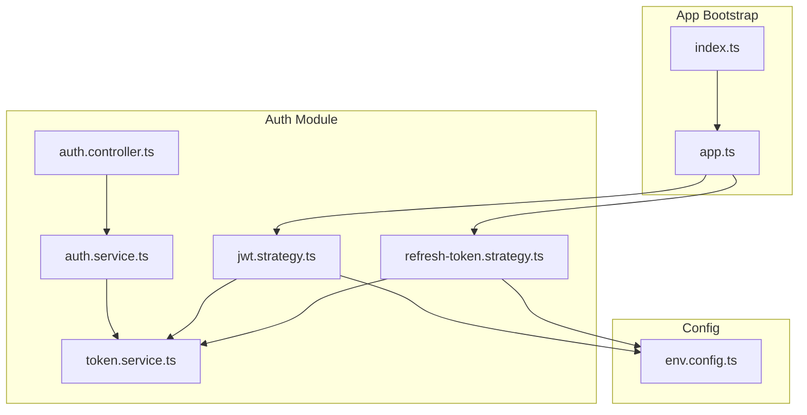
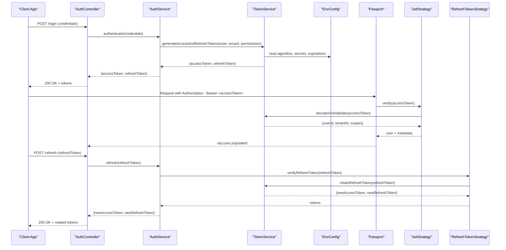
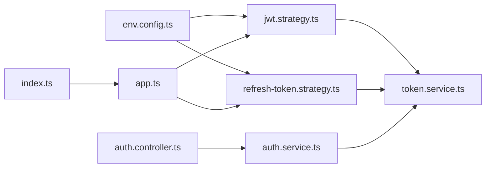

# JWT Token Validation Strategy

<cite>
**Referenced Files in This Document**
- [auth.strategy.ts](file://backend/src/modules/auth/strategies/auth.strategy.ts)
- [jwt.strategy.ts](file://backend/src/modules/auth/strategies/jwt.strategy.ts)
- [refresh-token.strategy.ts](file://backend/src/modules/auth/strategies/refresh-token.strategy.ts)
- [auth.controller.ts](file://backend/src/modules/auth/controllers/auth.controller.ts)
- [auth.service.ts](file://backend/src/modules/auth/services/auth.service.ts)
- [token.service.ts](file://backend/src/modules/auth/services/token.service.ts)
- [env.config.ts](file://backend/src/config/env.config.ts)
- [app.ts](file://backend/src/app.ts)
- [index.ts](file://backend/src/index.ts)
</cite>

## Table of Contents
1. [Introduction](#introduction)
2. [Project Structure](#project-structure)
3. [Core Components](#core-components)
4. [Architecture Overview](#architecture-overview)
5. [Detailed Component Analysis](#detailed-component-analysis)
6. [Dependency Analysis](#dependency-analysis)
7. [Performance Considerations](#performance-considerations)
8. [Troubleshooting Guide](#troubleshooting-guide)
9. [Conclusion](#conclusion)

## Introduction
This document explains the JWT token validation strategy implementation, focusing on Passport.js JwtStrategy configuration for access and refresh tokens. It covers secret key management, token expiration handling, payload extraction (user information, tenant context, and permission scopes), refresh token mechanism, rotation strategies, secure storage practices, practical examples for login and automatic refresh, and security considerations including signing algorithms, secret rotation, and protection against tampering and replay attacks.

## Project Structure
The authentication subsystem is organized under the auth module with clear separation between controllers, services, and Passport strategies:
- Controllers handle HTTP endpoints for login and token refresh.
- Services implement business logic for token generation, verification, and session management.
- Strategies configure Passport to validate access and refresh tokens using JWT.
- Configuration centralizes environment variables such as secrets, algorithm, and expiration settings.

**Diagram sources**
- [auth.controller.ts](file://backend/src/modules/auth/controllers/auth.controller.ts)
- [auth.service.ts](file://backend/src/modules/auth/services/auth.service.ts)
- [token.service.ts](file://backend/src/modules/auth/services/token.service.ts)
- [jwt.strategy.ts](file://backend/src/modules/auth/strategies/jwt.strategy.ts)
- [refresh-token.strategy.ts](file://backend/src/modules/auth/strategies/refresh-token.strategy.ts)
- [env.config.ts](file://backend/src/config/env.config.ts)
- [app.ts](file://backend/src/app.ts)
- [index.ts](file://backend/src/index.ts)

**Section sources**
- [auth.controller.ts](file://backend/src/modules/auth/controllers/auth.controller.ts)
- [auth.service.ts](file://backend/src/modules/auth/services/auth.service.ts)
- [token.service.ts](file://backend/src/modules/auth/services/token.service.ts)
- [jwt.strategy.ts](file://backend/src/modules/auth/strategies/jwt.strategy.ts)
- [refresh-token.strategy.ts](file://backend/src/modules/auth/strategies/refresh-token.strategy.ts)
- [env.config.ts](file://backend/src/config/env.config.ts)
- [app.ts](file://backend/src/app.ts)
- [index.ts](file://backend/src/index.ts)

## Core Components
- Access Token Strategy (Passport JwtStrategy): Validates access tokens, extracts user identity, tenant context, and permission scopes from the payload, and attaches them to the request object for downstream authorization.
- Refresh Token Strategy (Passport LocalStrategy or custom): Verifies refresh tokens, enforces rotation policies, and issues new access tokens while invalidating old refresh tokens.
- Token Service: Encapsulates token creation, signing, decoding, and rotation logic; coordinates with configuration for algorithm and expiration settings.
- Auth Controller: Exposes login and refresh endpoints, orchestrates service calls, and returns tokens to clients.
- Environment Configuration: Centralizes secrets, algorithms, and expiration durations.

Key responsibilities:
- Secret key management via environment variables.
- Token expiration handling and renewal flows.
- Payload structure containing user info, tenant context, and scopes.
- Secure storage guidance for clients.

**Section sources**
- [jwt.strategy.ts](file://backend/src/modules/auth/strategies/jwt.strategy.ts)
- [refresh-token.strategy.ts](file://backend/src/modules/auth/strategies/refresh-token.strategy.ts)
- [token.service.ts](file://backend/src/modules/auth/services/token.service.ts)
- [auth.controller.ts](file://backend/src/modules/auth/controllers/auth.controller.ts)
- [env.config.ts](file://backend/src/config/env.config.ts)

## Architecture Overview
The system uses a dual-token approach: short-lived access tokens for API authorization and longer-lived refresh tokens for seamless renewal without re-authentication. Passport strategies are registered at application bootstrap to intercept protected routes.

**Diagram sources**
- [auth.controller.ts](file://backend/src/modules/auth/controllers/auth.controller.ts)
- [auth.service.ts](file://backend/src/modules/auth/services/auth.service.ts)
- [token.service.ts](file://backend/src/modules/auth/services/token.service.ts)
- [env.config.ts](file://backend/src/config/env.config.ts)
- [jwt.strategy.ts](file://backend/src/modules/auth/strategies/jwt.strategy.ts)
- [refresh-token.strategy.ts](file://backend/src/modules/auth/strategies/refresh-token.strategy.ts)

## Detailed Component Analysis

### Access Token Strategy (Passport JwtStrategy)
Responsibilities:
- Extracts the bearer token from the Authorization header.
- Validates signature using configured algorithm and secret(s).
- Decodes payload to obtain user identity, tenant context, and permission scopes.
- Attaches decoded claims to the request object for middleware and route handlers.

Configuration highlights:
- Algorithm selection (e.g., RS256 or HS256) from environment.
- Secret key source (symmetric secret or public key set).
- Expiration enforcement and error mapping.
- Optional audience/issuer checks if applicable.

Payload structure:
- User information: unique identifier and minimal profile fields.
- Tenant context: tenant identifier for multi-tenant scoping.
- Permission scopes: list of granted scopes or roles used by RBAC.

Error handling:
- Invalid signature or expired token triggers 401 responses.
- Malformed tokens return descriptive errors for client retry behavior.

**Section sources**
- [jwt.strategy.ts](file://backend/src/modules/auth/strategies/jwt.strategy.ts)
- [env.config.ts](file://backend/src/config/env.config.ts)

### Refresh Token Strategy and Rotation
Responsibilities:
- Accepts refresh tokens from clients.
- Verifies token integrity and checks revocation status.
- Implements rotation: invalidates old refresh token and issues new ones.
- Returns new access and refresh tokens to maintain session continuity.

Rotation strategy:
- One-time use policy for refresh tokens.
- Short TTL for access tokens; longer TTL for refresh tokens.
- Optional sliding window to extend sessions safely.

Secure storage practices:
- Clients should store refresh tokens securely (e.g., httpOnly cookies or secure OS keystores).
- Avoid storing sensitive tokens in localStorage when possible.

**Section sources**
- [refresh-token.strategy.ts](file://backend/src/modules/auth/strategies/refresh-token.strategy.ts)
- [token.service.ts](file://backend/src/modules/auth/services/token.service.ts)
- [env.config.ts](file://backend/src/config/env.config.ts)

### Token Service
Responsibilities:
- Generates signed access and refresh tokens with appropriate payloads.
- Manages rotation state for refresh tokens (e.g., Redis-backed store).
- Provides utilities to decode and validate tokens without full cryptographic verification where needed.
- Reads configuration for algorithm, secrets, and expiration durations.

Data structures:
- Access token payload: user id, tenant id, scopes, issued-at, expires-at.
- Refresh token payload: token id, user id, tenant id, device/session fingerprint, expires-at.

Complexity:
- Token generation and verification are O(1) operations relative to payload size.
- Rotation lookup/insertion depends on storage backend (Redis typically O(1)).

**Section sources**
- [token.service.ts](file://backend/src/modules/auth/services/token.service.ts)
- [env.config.ts](file://backend/src/config/env.config.ts)

### Auth Controller
Responsibilities:
- Login endpoint: validates credentials, delegates to service, returns tokens.
- Refresh endpoint: accepts refresh token, delegates to strategy/service, returns rotated tokens.
- Ensures proper error responses for invalid inputs and authentication failures.

Integration points:
- Uses Passport strategies for token verification on protected routes.
- Coordinates with services for business logic and persistence.

**Section sources**
- [auth.controller.ts](file://backend/src/modules/auth/controllers/auth.controller.ts)
- [auth.service.ts](file://backend/src/modules/auth/services/auth.service.ts)

### Application Bootstrap and Strategy Registration
Responsibilities:
- Registers Passport strategies during app initialization.
- Applies global guards/middlewares for authentication and authorization.
- Loads environment configuration for secrets and algorithms.

**Section sources**
- [app.ts](file://backend/src/app.ts)
- [index.ts](file://backend/src/index.ts)
- [env.config.ts](file://backend/src/config/env.config.ts)

## Dependency Analysis
The following diagram shows how components depend on each other and on configuration:

**Diagram sources**
- [env.config.ts](file://backend/src/config/env.config.ts)
- [jwt.strategy.ts](file://backend/src/modules/auth/strategies/jwt.strategy.ts)
- [refresh-token.strategy.ts](file://backend/src/modules/auth/strategies/refresh-token.strategy.ts)
- [token.service.ts](file://backend/src/modules/auth/services/token.service.ts)
- [auth.controller.ts](file://backend/src/modules/auth/controllers/auth.controller.ts)
- [auth.service.ts](file://backend/src/modules/auth/services/auth.service.ts)
- [app.ts](file://backend/src/app.ts)
- [index.ts](file://backend/src/index.ts)

**Section sources**
- [env.config.ts](file://backend/src/config/env.config.ts)
- [jwt.strategy.ts](file://backend/src/modules/auth/strategies/jwt.strategy.ts)
- [refresh-token.strategy.ts](file://backend/src/modules/auth/strategies/refresh-token.strategy.ts)
- [token.service.ts](file://backend/src/modules/auth/services/token.service.ts)
- [auth.controller.ts](file://backend/src/modules/auth/controllers/auth.controller.ts)
- [auth.service.ts](file://backend/src/modules/auth/services/auth.service.ts)
- [app.ts](file://backend/src/app.ts)
- [index.ts](file://backend/src/index.ts)

## Performance Considerations
- Prefer short-lived access tokens to minimize impact of compromise.
- Use efficient storage for refresh token rotation (e.g., Redis) to avoid database bottlenecks.
- Cache public keys if using asymmetric algorithms to reduce I/O overhead.
- Batch token validations only when necessary; rely on Passport’s built-in caching where available.
- Monitor token issuance and refresh rates to detect anomalies early.

[No sources needed since this section provides general guidance]

## Troubleshooting Guide
Common issues and resolutions:
- 401 Unauthorized due to expired access token:
  - Implement automatic refresh before calling protected APIs.
  - Ensure client sends refreshed tokens promptly after receiving new tokens.
- Invalid signature errors:
  - Verify algorithm and secret/public key configuration matches token issuer.
  - Check for secret rotation mismatches across services.
- Replay attacks:
  - Enforce one-time use refresh tokens and track revocation.
  - Include nonce or jti claims for critical operations if required.
- Multi-tenant scope mismatch:
  - Confirm tenant context is present and consistent in access tokens.
  - Validate tenant-specific permissions in downstream services.

Operational tips:
- Log token validation failures with sanitized details for diagnostics.
- Provide clear error messages to clients indicating whether to refresh or re-authenticate.

**Section sources**
- [jwt.strategy.ts](file://backend/src/modules/auth/strategies/jwt.strategy.ts)
- [refresh-token.strategy.ts](file://backend/src/modules/auth/strategies/refresh-token.strategy.ts)
- [token.service.ts](file://backend/src/modules/auth/services/token.service.ts)

## Conclusion
The JWT-based authentication strategy leverages Passport.js to validate access tokens and a robust refresh token mechanism to maintain secure, long-lived sessions. By centralizing configuration, enforcing strict token lifetimes, and implementing rotation with secure storage, the system balances usability and security. Following the recommended practices for secret management, algorithm selection, and client-side storage ensures resilience against tampering and replay attacks while supporting multi-tenant contexts and fine-grained permissions.