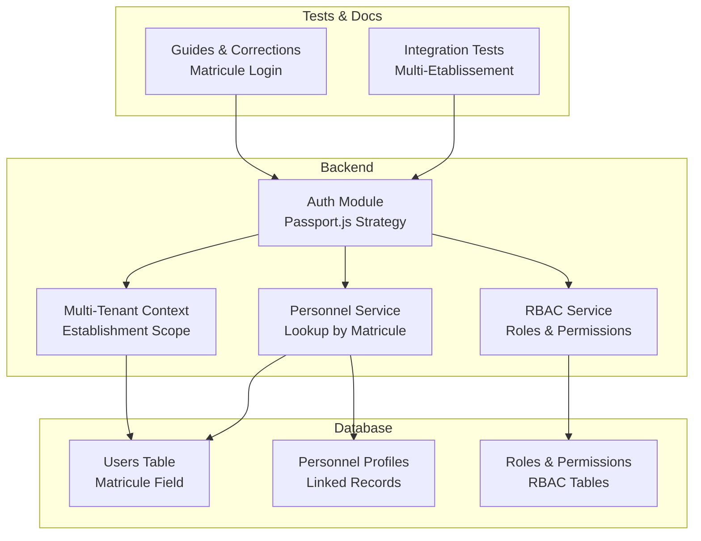
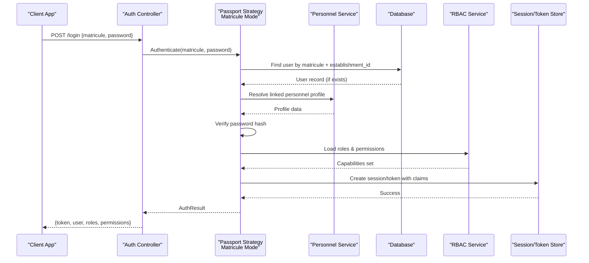
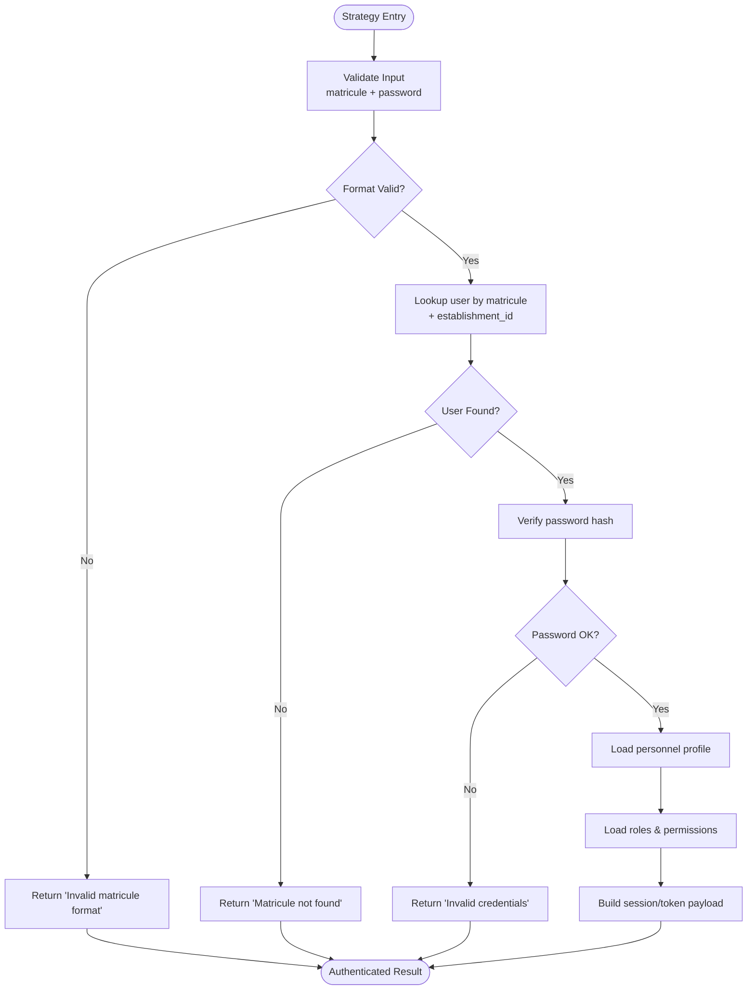
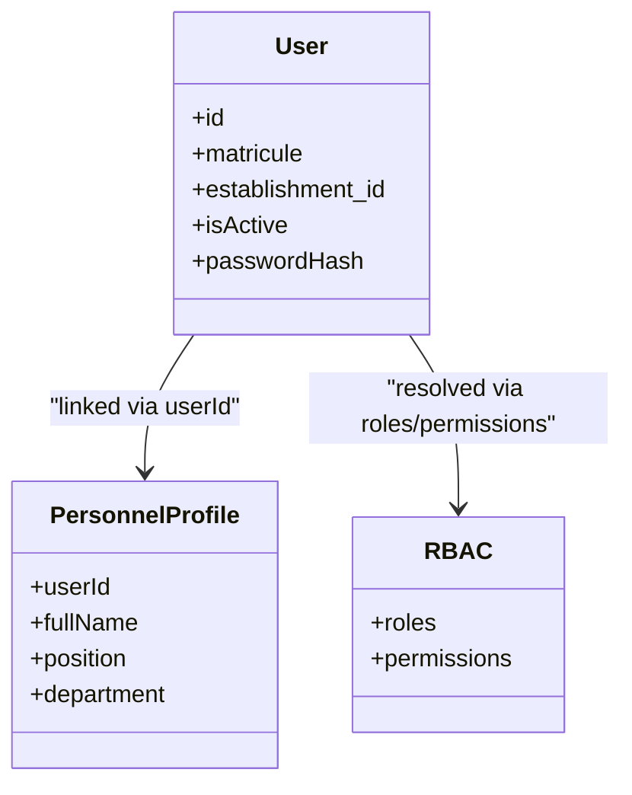
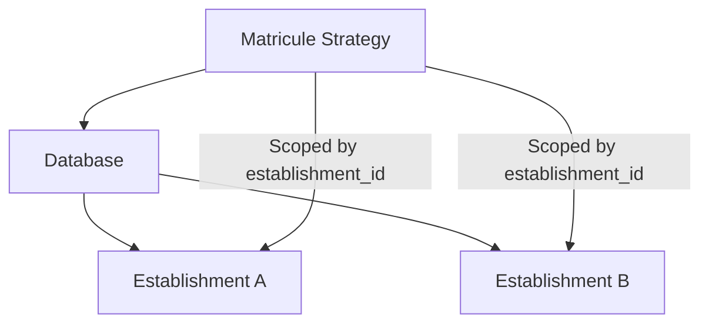
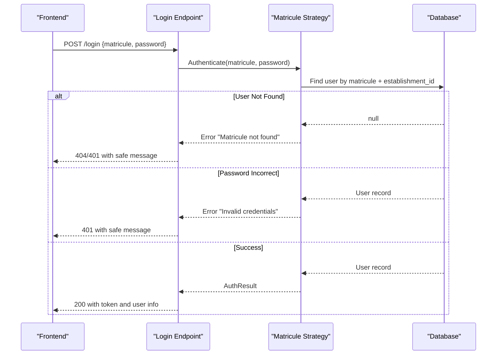
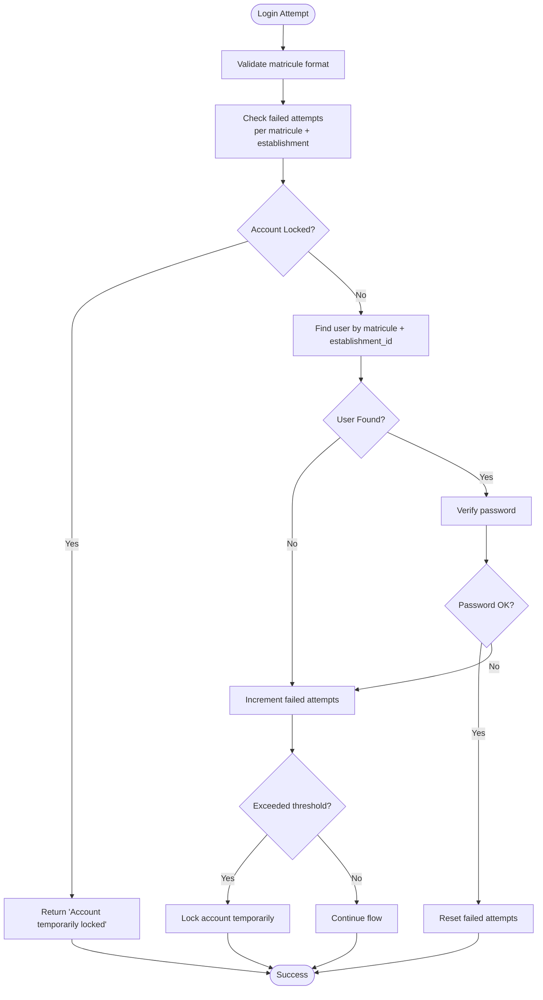
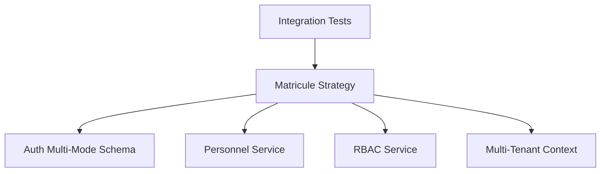

# Matricule-based Authentication Strategy

<cite>
**Referenced Files in This Document**
- [auth-multi-etablissement.spec.ts](file://backend/test/integration/auth-multi-etablissement.spec.ts)
- [CORRECTION-CONNEXION-MATRICULE.md](file://docs/corrections/CORRECTION-CONNEXION-MATRICULE.md)
- [GUIDE-TEST-CONNEXION-MATRICULE.md](file://docs/guides/GUIDE-TEST-CONNEXION-MATRICULE.md)
- [027-auth-multi-mode.sql](file://backend/database/migrations/027-auth-multi-mode.sql)
- [IMPLÉMENTATION-AUTH-COMPLETE.md](file://docs/implementations/IMPLÉMENTATION-AUTH-COMPLETE.md)
- [ANALYSE-ROUTE-LOGIN.md](file://docs/analyses/ANALYSE-ROUTE-LOGIN.md)
- [SYSTEME-BLOCAGE-AUTH-DEUX-NIVEAUX.md](file://docs/SYSTEME-BLOCAGE-AUTH-DEUX-NIVEAUX.md)
- [AMÉLIORATIONS-SECURITE-AUTHENTIFICATION.md](file://docs/ameliorations/AMÉLIORATIONS-SECURITE-AUTHENTIFICATION.md)
</cite>

## Table of Contents
1. [Introduction](#introduction)
2. [Project Structure](#project-structure)
3. [Core Components](#core-components)
4. [Architecture Overview](#architecture-overview)
5. [Detailed Component Analysis](#detailed-component-analysis)
6. [Dependency Analysis](#dependency-analysis)
7. [Performance Considerations](#performance-considerations)
8. [Troubleshooting Guide](#troubleshooting-guide)
9. [Conclusion](#conclusion)

## Introduction
This document explains the matricule-based authentication strategy designed for African educational contexts, where staff members authenticate using a unique personnel identifier (matricule) instead of an email address. It covers how the system validates the matricule against the database, resolves the associated personnel record, integrates with roles and permissions, and operates within a multi-tenant environment across institutions. It also provides practical examples of login flows, error handling for non-existent matricules, synchronization with personnel profiles, and security considerations such as format validation, attempt tracking, and isolation between institutions.

## Project Structure
The matricule-based authentication is implemented across backend modules and supporting documentation:
- Backend integration tests validate multi-establishment behavior for matricule login.
- Documentation details the correction and testing procedures for matricule-based login.
- Database migrations introduce multi-mode authentication to support both traditional and matricule-based strategies.
- Implementation guides describe end-to-end authentication flows and security enhancements.

[No sources needed since this diagram shows conceptual workflow, not actual code structure]

## Core Components
- Passport.js Strategy for Staff Authentication
  - Accepts a matricule and password from the login request.
  - Validates the matricule format and existence within the current establishment context.
  - Resolves the user record and verifies credentials.
  - Builds a session or token payload including role and permission information.
- Personnel Record Lookup
  - Queries the users table by matricule and establishment scope.
  - Ensures the account is active and linked to a valid personnel profile.
- Role and Permission Integration
  - Loads RBAC roles and permissions for the authenticated user.
  - Enforces access control based on resolved capabilities.
- Multi-Tenant Isolation
  - Scopes all queries by establishment ID to prevent cross-institution data leakage.
  - Maintains separate sessions per institution when applicable.

**Section sources**
- [auth-multi-etablissement.spec.ts:1-200](file://backend/test/integration/auth-multi-etablissement.spec.ts#L1-L200)
- [027-auth-multi-mode.sql:1-120](file://backend/database/migrations/027-auth-multi-mode.sql#L1-L120)
- [IMPLÉMENTATION-AUTH-COMPLETE.md:1-150](file://docs/implementations/IMPLÉMENTATION-AUTH-COMPLETE.md#L1-L150)

## Architecture Overview
The matricule-based authentication flow integrates the Passport.js strategy with personnel lookup, RBAC resolution, and multi-tenant scoping. The sequence below maps the typical login process from client request to authorized response.

**Diagram sources**
- [auth-multi-etablissement.spec.ts:1-200](file://backend/test/integration/auth-multi-etablissement.spec.ts#L1-L200)
- [027-auth-multi-mode.sql:1-120](file://backend/database/migrations/027-auth-multi-mode.sql#L1-L120)
- [IMPLÉMENTATION-AUTH-COMPLETE.md:1-150](file://docs/implementations/IMPLÉMENTATION-AUTH-COMPLETE.md#L1-L150)

## Detailed Component Analysis

### Passport.js Strategy: Matricule Mode
- Purpose: Provide a Passport.js strategy that authenticates staff using a matricule instead of an email.
- Inputs: matricule string, password string, optional establishment context.
- Processing:
  - Validate matricule format (non-empty, expected pattern).
  - Query users table scoped by establishment_id.
  - If found, verify password hash.
  - Fetch linked personnel profile and RBAC roles/permissions.
  - Build session/token payload with user identity and capabilities.
- Outputs:
  - On success: authenticated user object with roles and permissions.
  - On failure: standardized error indicating invalid credentials or missing matricule.

**Diagram sources**
- [IMPLÉMENTATION-AUTH-COMPLETE.md:1-150](file://docs/implementations/IMPLÉMENTATION-AUTH-COMPLETE.md#L1-L150)
- [027-auth-multi-mode.sql:1-120](file://backend/database/migrations/027-auth-multi-mode.sql#L1-L120)

**Section sources**
- [IMPLÉMENTATION-AUTH-COMPLETE.md:1-150](file://docs/implementations/IMPLÉMENTATION-AUTH-COMPLETE.md#L1-L150)
- [027-auth-multi-mode.sql:1-120](file://backend/database/migrations/027-auth-multi-mode.sql#L1-L120)

### Personnel Record Lookup and Synchronization
- Lookup:
  - Uses the matricule to find the corresponding user record within the current establishment.
  - Ensures the user is active and has a linked personnel profile.
- Synchronization:
  - After successful authentication, synchronizes any pending updates from the personnel profile into the session payload.
  - Keeps role and permission sets consistent with the latest RBAC configuration.

**Diagram sources**
- [027-auth-multi-mode.sql:1-120](file://backend/database/migrations/027-auth-multi-mode.sql#L1-L120)
- [IMPLÉMENTATION-AUTH-COMPLETE.md:1-150](file://docs/implementations/IMPLÉMENTATION-AUTH-COMPLETE.md#L1-L150)

**Section sources**
- [027-auth-multi-mode.sql:1-120](file://backend/database/migrations/027-auth-multi-mode.sql#L1-L120)
- [IMPLÉMENTATION-AUTH-COMPLETE.md:1-150](file://docs/implementations/IMPLÉMENTATION-AUTH-COMPLETE.md#L1-L150)

### Multi-Tenant Integration
- Establishment Scoping:
  - All lookups are filtered by establishment_id to ensure strict isolation between institutions.
- Cross-Institution Safety:
  - Prevents a matricule from one institution being used to access another institution’s resources.
- Testing:
  - Integration tests validate that matricule login behaves correctly across multiple establishments.

**Diagram sources**
- [auth-multi-etablissement.spec.ts:1-200](file://backend/test/integration/auth-multi-etablissement.spec.ts#L1-L200)
- [027-auth-multi-mode.sql:1-120](file://backend/database/migrations/027-auth-multi-mode.sql#L1-L120)

**Section sources**
- [auth-multi-etablissement.spec.ts:1-200](file://backend/test/integration/auth-multi-etablissement.spec.ts#L1-L200)
- [027-auth-multi-mode.sql:1-120](file://backend/database/migrations/027-auth-multi-mode.sql#L1-L120)

### Practical Examples: Matricule Login Flows
- Successful Login:
  - Client sends matricule and password.
  - Strategy validates format, finds user within establishment, verifies password, loads roles/permissions, returns token.
- Non-Existent Matricule:
  - Strategy returns a clear error indicating the matricule was not found in the specified establishment.
- Invalid Credentials:
  - Strategy returns a generic “invalid credentials” message to avoid leaking whether the matricule exists.

**Diagram sources**
- [GUIDE-TEST-CONNEXION-MATRICULE.md:1-120](file://docs/guides/GUIDE-TEST-CONNEXION-MATRICULE.md#L1-L120)
- [ANALYSE-ROUTE-LOGIN.md:1-120](file://docs/analyses/ANALYSE-ROUTE-LOGIN.md#L1-L120)

**Section sources**
- [GUIDE-TEST-CONNEXION-MATRICULE.md:1-120](file://docs/guides/GUIDE-TEST-CONNEXION-MATRICULE.md#L1-L120)
- [ANALYSE-ROUTE-LOGIN.md:1-120](file://docs/analyses/ANALYSE-ROUTE-LOGIN.md#L1-L120)

### Security Considerations
- Matricule Format Validation:
  - Enforce non-empty and expected pattern constraints before database queries.
- Attempt Tracking and Lockout:
  - Track failed attempts per matricule and establishment; apply temporary lockouts after threshold breaches.
- Safe Error Messages:
  - Avoid revealing whether a matricule exists; use generic messages for invalid credentials.
- Multi-Tenant Isolation:
  - Always scope queries by establishment_id to prevent cross-institution access.
- Password Hashing:
  - Ensure strong hashing algorithms and salted storage for passwords.

**Diagram sources**
- [SYSTEME-BLOCAGE-AUTH-DEUX-NIVEAUX.md:1-120](file://docs/SYSTEME-BLOCAGE-AUTH-DEUX-NIVEAUX.md#L1-L120)
- [AMÉLIORATIONS-SECURITE-AUTHENTIFICATION.md:1-120](file://docs/ameliorations/AMÉLIORATIONS-SECURITE-AUTHENTIFICATION.md#L1-L120)

**Section sources**
- [SYSTEME-BLOCAGE-AUTH-DEUX-NIVEAUX.md:1-120](file://docs/SYSTEME-BLOCAGE-AUTH-DEUX-NIVEAUX.md#L1-L120)
- [AMÉLIORATIONS-SECURITE-AUTHENTIFICATION.md:1-120](file://docs/ameliorations/AMÉLIORATIONS-SECURITE-AUTHENTIFICATION.md#L1-L120)

## Dependency Analysis
The matricule-based authentication depends on:
- Database schema changes enabling multi-mode authentication and matricule fields.
- Personnel service for profile resolution.
- RBAC service for roles and permissions.
- Multi-tenant context to enforce establishment scoping.
- Integration tests validating cross-establishment behavior.

**Diagram sources**
- [027-auth-multi-mode.sql:1-120](file://backend/database/migrations/027-auth-multi-mode.sql#L1-L120)
- [auth-multi-etablissement.spec.ts:1-200](file://backend/test/integration/auth-multi-etablissement.spec.ts#L1-L200)

**Section sources**
- [027-auth-multi-mode.sql:1-120](file://backend/database/migrations/027-auth-multi-mode.sql#L1-L120)
- [auth-multi-etablissement.spec.ts:1-200](file://backend/test/integration/auth-multi-etablissement.spec.ts#L1-L200)

## Performance Considerations
- Indexing:
  - Ensure indexes on matricule and establishment_id columns for fast lookups.
- Caching:
  - Cache RBAC roles and permissions per user and establishment to reduce repeated queries.
- Batch Operations:
  - Minimize N+1 queries by joining necessary tables during authentication.
- Monitoring:
  - Track authentication latency and failure rates to detect performance regressions.

[No sources needed since this section provides general guidance]

## Troubleshooting Guide
- Common Issues:
  - Matricule not found: Verify the matricule exists in the correct establishment and is active.
  - Invalid credentials: Confirm password correctness; avoid exposing whether the matricule exists.
  - Account locked: Check attempt tracking thresholds and unlock policies.
- Diagnostic Steps:
  - Review integration tests for multi-establishment scenarios.
  - Consult correction and guide documents for step-by-step troubleshooting.

**Section sources**
- [CORRECTION-CONNEXION-MATRICULE.md:1-120](file://docs/corrections/CORRECTION-CONNEXION-MATRICULE.md#L1-L120)
- [GUIDE-TEST-CONNEXION-MATRICULE.md:1-120](file://docs/guides/GUIDE-TEST-CONNEXION-MATRICULE.md#L1-L120)

## Conclusion
The matricule-based authentication strategy provides a robust, secure, and culturally appropriate login mechanism for African educational institutions. By validating matricules, resolving personnel profiles, integrating RBAC, and enforcing multi-tenant isolation, the system ensures accurate access control while maintaining safety and performance. Proper error handling, attempt tracking, and comprehensive testing further strengthen reliability across diverse institutional contexts.