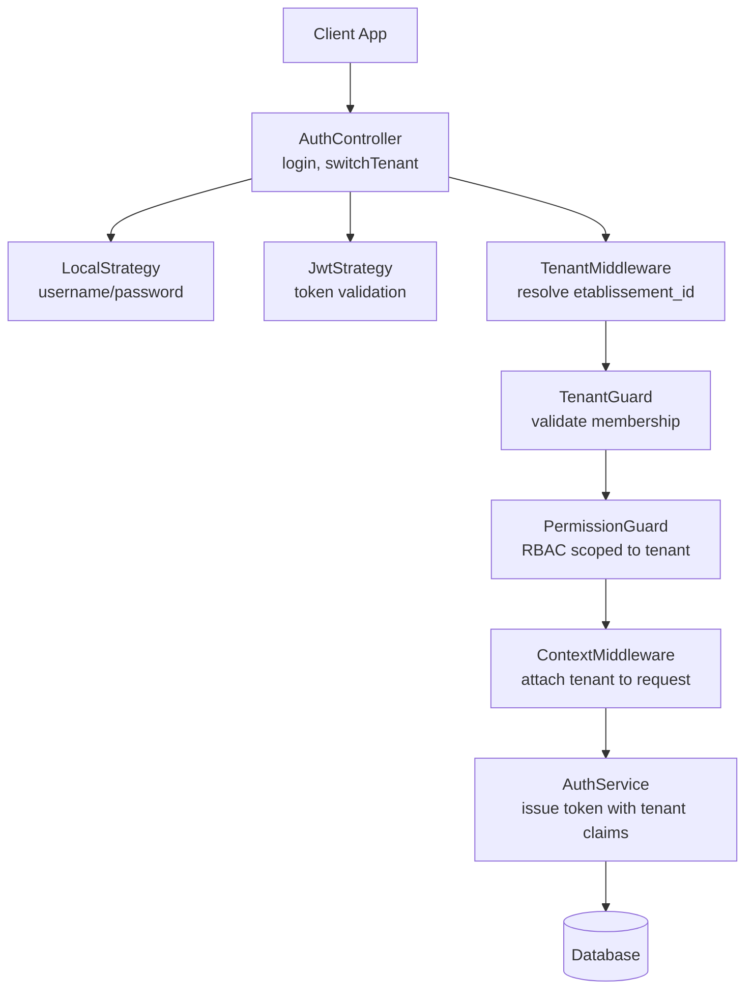
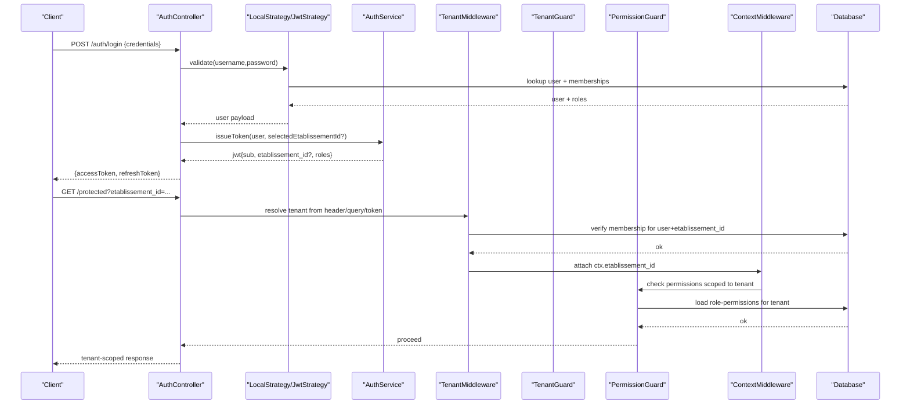
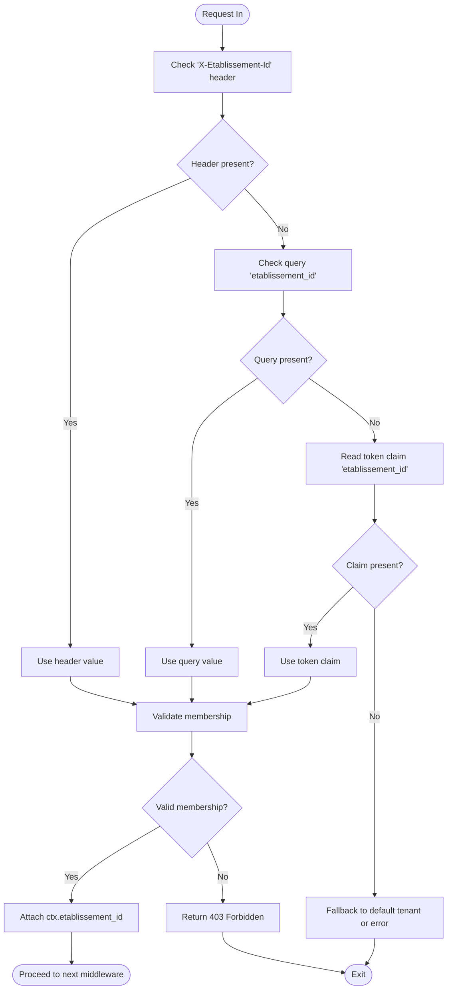
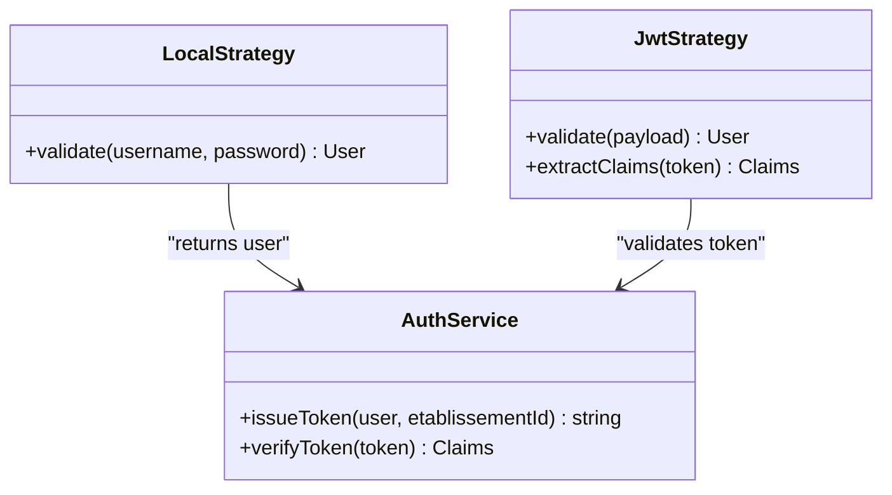
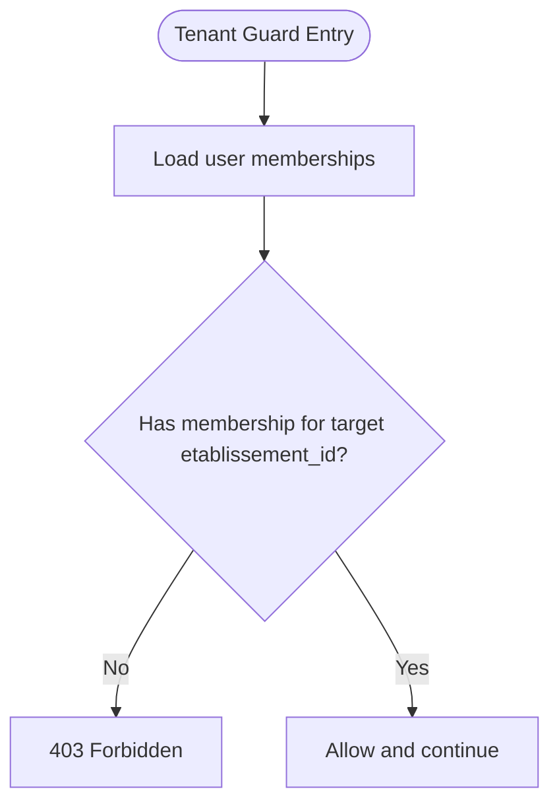
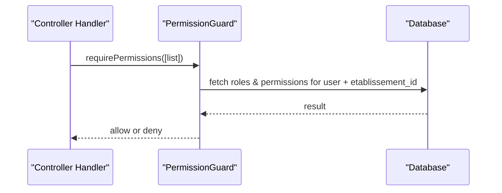
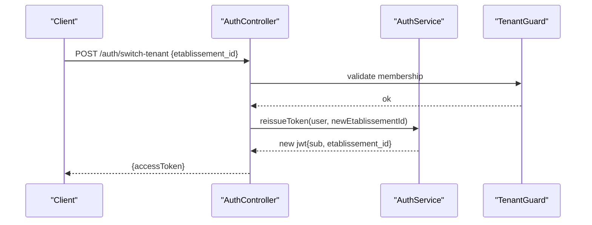
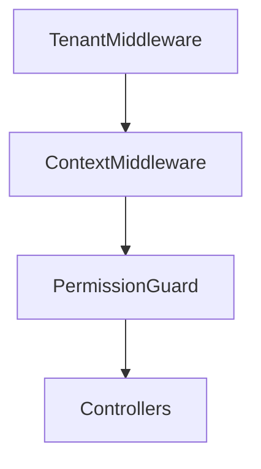
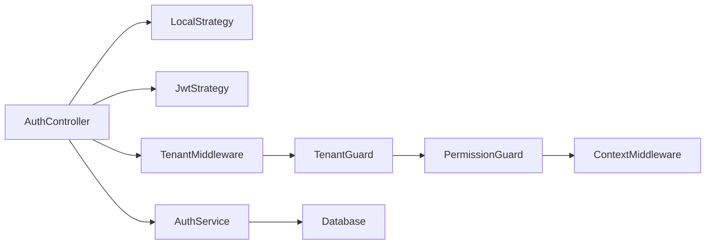

# Multi-Tenant Authentication Strategy

<cite>
**Referenced Files in This Document**
- [backend/src/modules/auth/guards/tenant.guard.ts](file://backend/src/modules/auth/guards/tenant.guard.ts)
- [backend/src/modules/auth/middlewares/tenant.middleware.ts](file://backend/src/modules/auth/middlewares/tenant.middleware.ts)
- [backend/src/modules/auth/services/auth.service.ts](file://backend/src/modules/auth/services/auth.service.ts)
- [backend/src/modules/auth/controllers/auth.controller.ts](file://backend/src/modules/auth/controllers/auth.controller.ts)
- [backend/src/modules/auth/dto/login.dto.ts](file://backend/src/modules/auth/dto/login.dto.ts)
- [backend/src/modules/auth/dto/switch-tenant.dto.ts](file://backend/src/modules/auth/dto/switch-tenant.dto.ts)
- [backend/src/modules/auth/strategies/jwt.strategy.ts](file://backend/src/modules/auth/strategies/jwt.strategy.ts)
- [backend/src/modules/auth/strategies/local.strategy.ts](file://backend/src/modules/auth/strategies/local.strategy.ts)
- [backend/src/modules/utilisateurs/entities/utilisateur.entity.ts](file://backend/src/modules/utilisateurs/entities/utilisateur.entity.ts)
- [backend/src/modules/etablissement/entities/etablissement.entity.ts](file://backend/src/modules/etablissement/entities/etablissement.entity.ts)
- [backend/src/modules/rbac/guards/permission.guard.ts](file://backend/src/modules/rbac/guards/permission.guard.ts)
- [backend/src/common/middlewares/context.middleware.ts](file://backend/src/common/middlewares/context.middleware.ts)
- [backend/src/config/env.config.ts](file://backend/src/config/env.config.ts)
- [backend/test/integration/auth-multi-etablissement.spec.ts](file://backend/test/integration/auth-multi-etablissement.spec.ts)
- [backend/test/multi-tenant-isolation.test.ts](file://backend/test/multi-tenant-isolation.test.ts)
</cite>

## Table of Contents
1. [Introduction](#introduction)
2. [Project Structure](#project-structure)
3. [Core Components](#core-components)
4. [Architecture Overview](#architecture-overview)
5. [Detailed Component Analysis](#detailed-component-analysis)
6. [Dependency Analysis](#dependency-analysis)
7. [Performance Considerations](#performance-considerations)
8. [Troubleshooting Guide](#troubleshooting-guide)
9. [Conclusion](#conclusion)

## Introduction
This document explains the multi-tenant authentication strategy that enforces institution-specific access across the application. It covers how tenant context is established and propagated, how etablissement_id is resolved from tokens or headers, cross-tenant scenarios, isolation enforcement, permission scoping by institutional boundaries, session state management during tenant switches, integration with middleware, data isolation patterns, and performance optimizations for multi-tenant checks.

## Project Structure
The multi-tenant authentication strategy spans several modules:
- Authentication strategies (JWT and local)
- Guards and middlewares for tenant resolution and validation
- Controllers and DTOs for login and tenant switching
- RBAC guards for permission scoping within a tenant
- Entities for users and institutions
- Common context propagation middleware
- Configuration for environment variables
- Integration tests validating multi-tenant behavior

**Diagram sources**
- [backend/src/modules/auth/controllers/auth.controller.ts](file://backend/src/modules/auth/controllers/auth.controller.ts)
- [backend/src/modules/auth/strategies/local.strategy.ts](file://backend/src/modules/auth/strategies/local.strategy.ts)
- [backend/src/modules/auth/strategies/jwt.strategy.ts](file://backend/src/modules/auth/strategies/jwt.strategy.ts)
- [backend/src/modules/auth/middlewares/tenant.middleware.ts](file://backend/src/modules/auth/middlewares/tenant.middleware.ts)
- [backend/src/modules/auth/guards/tenant.guard.ts](file://backend/src/modules/auth/guards/tenant.guard.ts)
- [backend/src/modules/rbac/guards/permission.guard.ts](file://backend/src/modules/rbac/guards/permission.guard.ts)
- [backend/src/common/middlewares/context.middleware.ts](file://backend/src/common/middlewares/context.middleware.ts)
- [backend/src/modules/auth/services/auth.service.ts](file://backend/src/modules/auth/services/auth.service.ts)

**Section sources**
- [backend/src/modules/auth/controllers/auth.controller.ts](file://backend/src/modules/auth/controllers/auth.controller.ts)
- [backend/src/modules/auth/strategies/jwt.strategy.ts](file://backend/src/modules/auth/strategies/jwt.strategy.ts)
- [backend/src/modules/auth/strategies/local.strategy.ts](file://backend/src/modules/auth/strategies/local.strategy.ts)
- [backend/src/modules/auth/middlewares/tenant.middleware.ts](file://backend/src/modules/auth/middlewares/tenant.middleware.ts)
- [backend/src/modules/auth/guards/tenant.guard.ts](file://backend/src/modules/auth/guards/tenant.guard.ts)
- [backend/src/modules/rbac/guards/permission.guard.ts](file://backend/src/modules/rbac/guards/permission.guard.ts)
- [backend/src/common/middlewares/context.middleware.ts](file://backend/src/common/middlewares/context.middleware.ts)
- [backend/src/modules/auth/services/auth.service.ts](file://backend/src/modules/auth/services/auth.service.ts)

## Core Components
- JWT and Local strategies validate credentials and produce tokens enriched with tenant claims when applicable.
- Tenant middleware resolves etablissement_id from multiple sources (headers, query params, or token).
- Tenant guard ensures the user has an active membership in the target institution before proceeding.
- Permission guard scopes RBAC checks to the current tenant context.
- Context middleware attaches tenant information to the request object for downstream services.
- Auth service issues tokens containing user identity and selected tenant scope.
- DTOs define input contracts for login and tenant switching.

Key responsibilities:
- Resolve tenant early in the pipeline
- Validate membership and permissions per tenant
- Propagate tenant context consistently
- Enforce isolation at controller/service layers

**Section sources**
- [backend/src/modules/auth/strategies/jwt.strategy.ts](file://backend/src/modules/auth/strategies/jwt.strategy.ts)
- [backend/src/modules/auth/strategies/local.strategy.ts](file://backend/src/modules/auth/strategies/local.strategy.ts)
- [backend/src/modules/auth/middlewares/tenant.middleware.ts](file://backend/src/modules/auth/middlewares/tenant.middleware.ts)
- [backend/src/modules/auth/guards/tenant.guard.ts](file://backend/src/modules/auth/guards/tenant.guard.ts)
- [backend/src/modules/rbac/guards/permission.guard.ts](file://backend/src/modules/rbac/guards/permission.guard.ts)
- [backend/src/common/middlewares/context.middleware.ts](file://backend/src/common/middlewares/context.middleware.ts)
- [backend/src/modules/auth/services/auth.service.ts](file://backend/src/modules/auth/services/auth.service.ts)
- [backend/src/modules/auth/dto/login.dto.ts](file://backend/src/modules/auth/dto/login.dto.ts)
- [backend/src/modules/auth/dto/switch-tenant.dto.ts](file://backend/src/modules/auth/dto/switch-tenant.dto.ts)

## Architecture Overview
The authentication flow establishes a tenant-scoped session and propagates it through the request lifecycle.

**Diagram sources**
- [backend/src/modules/auth/controllers/auth.controller.ts](file://backend/src/modules/auth/controllers/auth.controller.ts)
- [backend/src/modules/auth/strategies/local.strategy.ts](file://backend/src/modules/auth/strategies/local.strategy.ts)
- [backend/src/modules/auth/strategies/jwt.strategy.ts](file://backend/src/modules/auth/strategies/jwt.strategy.ts)
- [backend/src/modules/auth/services/auth.service.ts](file://backend/src/modules/auth/services/auth.service.ts)
- [backend/src/modules/auth/middlewares/tenant.middleware.ts](file://backend/src/modules/auth/middlewares/tenant.middleware.ts)
- [backend/src/modules/auth/guards/tenant.guard.ts](file://backend/src/modules/auth/guards/tenant.guard.ts)
- [backend/src/modules/rbac/guards/permission.guard.ts](file://backend/src/modules/rbac/guards/permission.guard.ts)
- [backend/src/common/middlewares/context.middleware.ts](file://backend/src/common/middlewares/context.middleware.ts)

## Detailed Component Analysis

### Tenant Resolution and Propagation
- Sources for etablissement_id:
  - Request header (e.g., X-Etablissement-Id)
  - Query parameter (e.g., ?etablissement_id=...)
  - Token claim (if present and consistent)
- Resolution order: explicit header > query param > token claim > default policy
- Validation: ensure user has an active membership in the specified institution
- Propagation: set on request context for all downstream handlers

**Diagram sources**
- [backend/src/modules/auth/middlewares/tenant.middleware.ts](file://backend/src/modules/auth/middlewares/tenant.middleware.ts)
- [backend/src/modules/auth/guards/tenant.guard.ts](file://backend/src/modules/auth/guards/tenant.guard.ts)
- [backend/src/common/middlewares/context.middleware.ts](file://backend/src/common/middlewares/context.middleware.ts)

**Section sources**
- [backend/src/modules/auth/middlewares/tenant.middleware.ts](file://backend/src/modules/auth/middlewares/tenant.middleware.ts)
- [backend/src/modules/auth/guards/tenant.guard.ts](file://backend/src/modules/auth/guards/tenant.guard.ts)
- [backend/src/common/middlewares/context.middleware.ts](file://backend/src/common/middlewares/context.middleware.ts)

### Authentication Strategies and Token Claims
- Local strategy authenticates username/password and returns user payload.
- JWT strategy validates tokens and extracts claims including sub and optional etablissement_id.
- Tokens include:
  - User identifier (sub)
  - Selected tenant scope (etablissement_id) when issued for a specific institution
  - Roles/permissions required for authorization

**Diagram sources**
- [backend/src/modules/auth/strategies/local.strategy.ts](file://backend/src/modules/auth/strategies/local.strategy.ts)
- [backend/src/modules/auth/strategies/jwt.strategy.ts](file://backend/src/modules/auth/strategies/jwt.strategy.ts)
- [backend/src/modules/auth/services/auth.service.ts](file://backend/src/modules/auth/services/auth.service.ts)

**Section sources**
- [backend/src/modules/auth/strategies/local.strategy.ts](file://backend/src/modules/auth/strategies/local.strategy.ts)
- [backend/src/modules/auth/strategies/jwt.strategy.ts](file://backend/src/modules/auth/strategies/jwt.strategy.ts)
- [backend/src/modules/auth/services/auth.service.ts](file://backend/src/modules/auth/services/auth.service.ts)

### Tenant Guard and Membership Validation
- Ensures the authenticated user belongs to the requested institution.
- Rejects requests if membership is missing, inactive, or revoked.
- Works alongside RBAC to scope permissions to the tenant.

**Diagram sources**
- [backend/src/modules/auth/guards/tenant.guard.ts](file://backend/src/modules/auth/guards/tenant.guard.ts)

**Section sources**
- [backend/src/modules/auth/guards/tenant.guard.ts](file://backend/src/modules/auth/guards/tenant.guard.ts)

### Permission Scoping and RBAC Integration
- Permission guard evaluates roles/permissions within the current tenant context.
- Prevents cross-tenant privilege escalation by binding permissions to etablissement_id.
- Uses cached or indexed lookups to minimize database overhead.

**Diagram sources**
- [backend/src/modules/rbac/guards/permission.guard.ts](file://backend/src/modules/rbac/guards/permission.guard.ts)

**Section sources**
- [backend/src/modules/rbac/guards/permission.guard.ts](file://backend/src/modules/rbac/guards/permission.guard.ts)

### Data Isolation Patterns
- All queries must include the tenant context (ctx.etablissement_id) to enforce isolation.
- Prefer indexes on foreign keys involving etablissement_id for performance.
- Avoid global queries without tenant filters; use repository helpers that inject tenant context automatically.

[No sources needed since this section provides general guidance]

### Practical Examples

#### Switching Between Tenants
- After login, client can call a tenant-switch endpoint with the desired etablissement_id.
- Backend validates membership and issues a new token scoped to the selected institution.
- Client updates stored token and continues requests with the new tenant context.

**Diagram sources**
- [backend/src/modules/auth/controllers/auth.controller.ts](file://backend/src/modules/auth/controllers/auth.controller.ts)
- [backend/src/modules/auth/services/auth.service.ts](file://backend/src/modules/auth/services/auth.service.ts)
- [backend/src/modules/auth/guards/tenant.guard.ts](file://backend/src/modules/auth/guards/tenant.guard.ts)
- [backend/src/modules/auth/dto/switch-tenant.dto.ts](file://backend/src/modules/auth/dto/switch-tenant.dto.ts)

**Section sources**
- [backend/src/modules/auth/controllers/auth.controller.ts](file://backend/src/modules/auth/controllers/auth.controller.ts)
- [backend/src/modules/auth/services/auth.service.ts](file://backend/src/modules/auth/services/auth.service.ts)
- [backend/src/modules/auth/guards/tenant.guard.ts](file://backend/src/modules/auth/guards/tenant.guard.ts)
- [backend/src/modules/auth/dto/switch-tenant.dto.ts](file://backend/src/modules/auth/dto/switch-tenant.dto.ts)

#### Handling Users With Multiple Institution Memberships
- Login may optionally accept a preferred etablissement_id to scope the initial token.
- If not provided, backend can return available tenants for selection.
- Subsequent requests should explicitly set the tenant via header or query to avoid ambiguity.

**Section sources**
- [backend/src/modules/auth/dto/login.dto.ts](file://backend/src/modules/auth/dto/login.dto.ts)
- [backend/src/modules/auth/controllers/auth.controller.ts](file://backend/src/modules/auth/controllers/auth.controller.ts)

#### Maintaining Session State Across Tenant Switches
- Store the latest accessToken and associated etablissement_id in secure storage.
- On each request, include the tenant header to maintain consistency.
- Refresh tokens remain valid but are reissued with updated tenant scope after switch.

**Section sources**
- [backend/src/modules/auth/services/auth.service.ts](file://backend/src/modules/auth/services/auth.service.ts)
- [backend/src/modules/auth/strategies/jwt.strategy.ts](file://backend/src/modules/auth/strategies/jwt.strategy.ts)

### Integration With Tenant Middleware
- Register tenant middleware early in the pipeline to resolve and validate tenant context.
- Combine with context middleware to attach tenant to request for controllers and services.
- Ensure RBAC guard runs after tenant context is attached.

**Diagram sources**
- [backend/src/modules/auth/middlewares/tenant.middleware.ts](file://backend/src/modules/auth/middlewares/tenant.middleware.ts)
- [backend/src/common/middlewares/context.middleware.ts](file://backend/src/common/middlewares/context.middleware.ts)
- [backend/src/modules/rbac/guards/permission.guard.ts](file://backend/src/modules/rbac/guards/permission.guard.ts)

**Section sources**
- [backend/src/modules/auth/middlewares/tenant.middleware.ts](file://backend/src/modules/auth/middlewares/tenant.middleware.ts)
- [backend/src/common/middlewares/context.middleware.ts](file://backend/src/common/middlewares/context.middleware.ts)
- [backend/src/modules/rbac/guards/permission.guard.ts](file://backend/src/modules/rbac/guards/permission.guard.ts)

## Dependency Analysis
The following diagram shows key dependencies among authentication and tenant components.

**Diagram sources**
- [backend/src/modules/auth/controllers/auth.controller.ts](file://backend/src/modules/auth/controllers/auth.controller.ts)
- [backend/src/modules/auth/strategies/local.strategy.ts](file://backend/src/modules/auth/strategies/local.strategy.ts)
- [backend/src/modules/auth/strategies/jwt.strategy.ts](file://backend/src/modules/auth/strategies/jwt.strategy.ts)
- [backend/src/modules/auth/middlewares/tenant.middleware.ts](file://backend/src/modules/auth/middlewares/tenant.middleware.ts)
- [backend/src/modules/auth/guards/tenant.guard.ts](file://backend/src/modules/auth/guards/tenant.guard.ts)
- [backend/src/modules/rbac/guards/permission.guard.ts](file://backend/src/modules/rbac/guards/permission.guard.ts)
- [backend/src/common/middlewares/context.middleware.ts](file://backend/src/common/middlewares/context.middleware.ts)
- [backend/src/modules/auth/services/auth.service.ts](file://backend/src/modules/auth/services/auth.service.ts)

**Section sources**
- [backend/src/modules/auth/controllers/auth.controller.ts](file://backend/src/modules/auth/controllers/auth.controller.ts)
- [backend/src/modules/auth/strategies/jwt.strategy.ts](file://backend/src/modules/auth/strategies/jwt.strategy.ts)
- [backend/src/modules/auth/strategies/local.strategy.ts](file://backend/src/modules/auth/strategies/local.strategy.ts)
- [backend/src/modules/auth/middlewares/tenant.middleware.ts](file://backend/src/modules/auth/middlewares/tenant.middleware.ts)
- [backend/src/modules/auth/guards/tenant.guard.ts](file://backend/src/modules/auth/guards/tenant.guard.ts)
- [backend/src/modules/rbac/guards/permission.guard.ts](file://backend/src/modules/rbac/guards/permission.guard.ts)
- [backend/src/common/middlewares/context.middleware.ts](file://backend/src/common/middlewares/context.middleware.ts)
- [backend/src/modules/auth/services/auth.service.ts](file://backend/src/modules/auth/services/auth.service.ts)

## Performance Considerations
- Cache user memberships and role-permission mappings keyed by (user_id, etablissement_id) to reduce repeated DB calls.
- Add composite indexes on (etablissement_id, user_id) and (etablissement_id, role_id) for fast membership and permission checks.
- Minimize token size by including only necessary claims; avoid embedding large datasets.
- Use short-lived access tokens with refresh flows to limit exposure and improve cache invalidation.
- Preload frequently accessed tenant metadata (name, settings) into a read-through cache.

[No sources needed since this section provides general guidance]

## Troubleshooting Guide
Common issues and resolutions:
- Missing or mismatched etablissement_id:
  - Ensure header or query includes a valid institution ID.
  - Verify user membership exists and is active for the target tenant.
- Cross-tenant access attempts:
  - Confirm RBAC guard is enabled and runs after tenant context is attached.
  - Review permission definitions scoped to the correct institution.
- Token inconsistencies:
  - Reissue tokens after tenant switch to reflect new scope.
  - Validate token claims match the requested tenant.
- Performance regressions:
  - Check indexes on tenant-related columns.
  - Inspect cache hit rates for membership and permission lookups.

Validation references:
- Integration test covering multi-tenant authentication flows
- Isolation test ensuring tenant-scoped responses

**Section sources**
- [backend/test/integration/auth-multi-etablissement.spec.ts](file://backend/test/integration/auth-multi-etablissement.spec.ts)
- [backend/test/multi-tenant-isolation.test.ts](file://backend/test/multi-tenant-isolation.test.ts)

## Conclusion
The multi-tenant authentication strategy enforces strict institutional boundaries by resolving and validating etablissement_id early in the request pipeline, propagating tenant context throughout the system, and scoping permissions accordingly. Proper middleware ordering, robust membership validation, and careful token design ensure secure and efficient cross-tenant operations. Following the recommended isolation patterns and performance optimizations will help maintain scalability and security as the number of institutions grows.