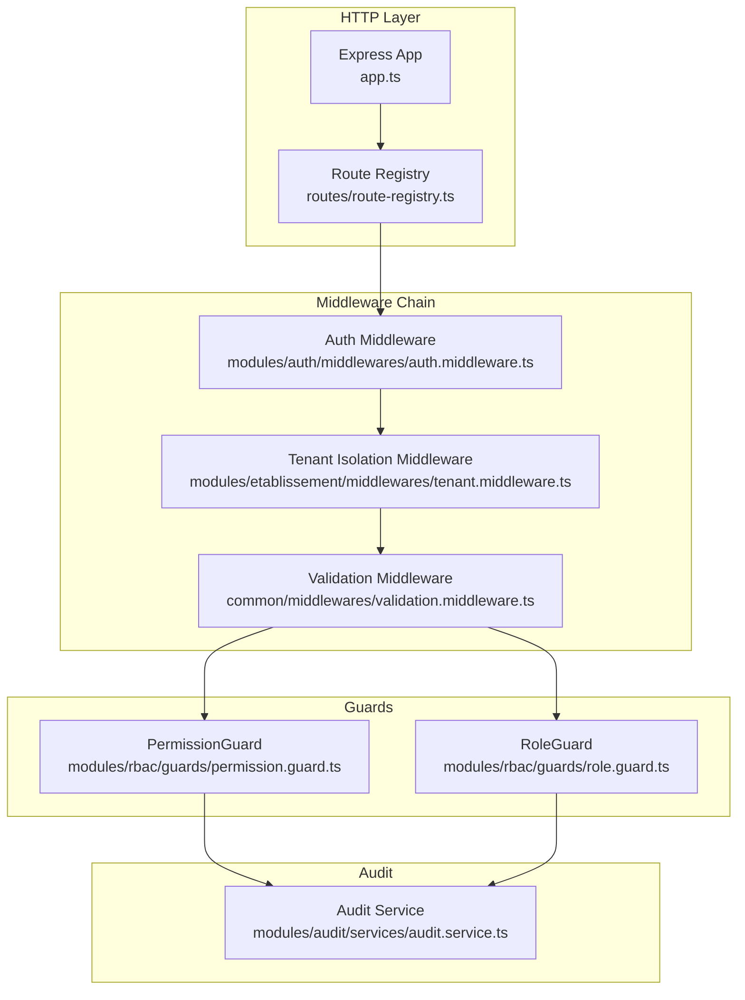
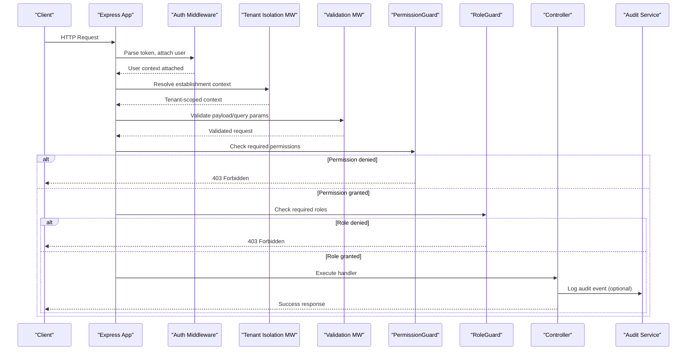
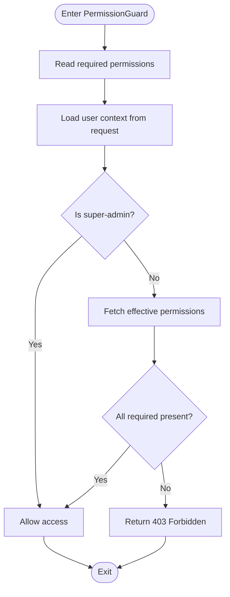
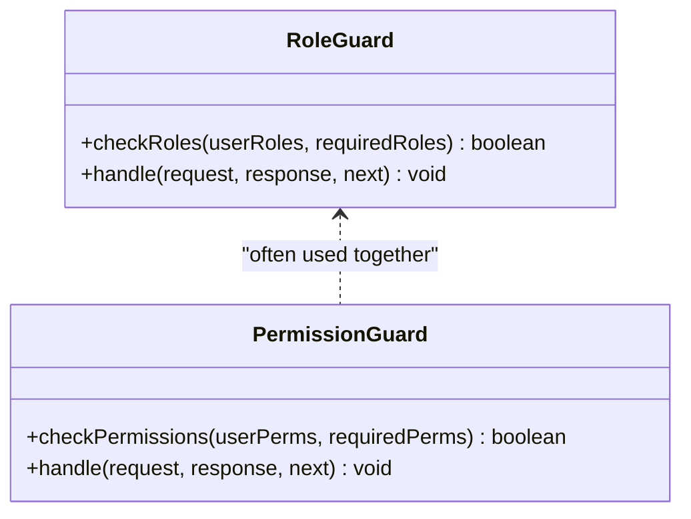
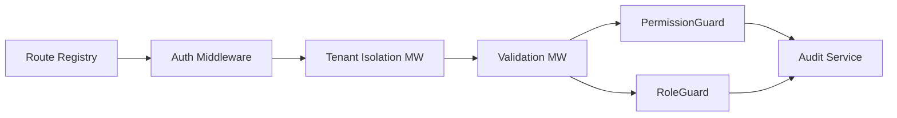

# Guards & Security Middleware

<cite>
**Referenced Files in This Document**
- [app.ts](file://backend/src/app.ts)
- [index.ts](file://backend/src/index.ts)
- [route-registry.ts](file://backend/src/routes/route-registry.ts)
- [auth.middleware.ts](file://backend/src/modules/auth/middlewares/auth.middleware.ts)
- [tenant.middleware.ts](file://backend/src/modules/etablissement/middlewares/tenant.middleware.ts)
- [validation.middleware.ts](file://backend/src/common/middlewares/validation.middleware.ts)
- [permission.guard.ts](file://backend/src/modules/rbac/guards/permission.guard.ts)
- [role.guard.ts](file://backend/src/modules/rbac/guards/role.guard.ts)
- [audit.service.ts](file://backend/src/modules/audit/services/audit.service.ts)
- [rbac-system.md](file://docs/rbac-system.md)
- [RBAC_COMPLETION.md](file://docs/RBAC_COMPLETION.md)
- [GUIDE-TEST-SECURITE.md](file://docs/guides/GUIDE-TEST-SECURITE.md)
</cite>

## Table of Contents
1. [Introduction](#introduction)
2. [Project Structure](#project-structure)
3. [Core Components](#core-components)
4. [Architecture Overview](#architecture-overview)
5. [Detailed Component Analysis](#detailed-component-analysis)
6. [Dependency Analysis](#dependency-analysis)
7. [Performance Considerations](#performance-considerations)
8. [Troubleshooting Guide](#troubleshooting-guide)
9. [Conclusion](#conclusion)
10. [Appendices](#appendices)

## Introduction
This document explains eLISAschool’s guard and middleware security layer, focusing on:
- PermissionGuard for route-level authorization
- RoleGuard for role-based access control
- Custom guards for business-specific authorization logic
- The middleware chain (authentication, tenant isolation, request validation)
- Execution order, error handling patterns, performance considerations
- Practical examples for creating custom guards, implementing middleware for cross-cutting concerns, and integrating with the audit trail system
- Guard decorator patterns, middleware composition, and testing strategies

The goal is to provide both a conceptual overview and code-mapped guidance so that developers can implement secure routes consistently and extend the system safely.

## Project Structure
Security-related components are organized under modules and shared directories:
- Authentication and RBAC live under modules/auth and modules/rbac
- Tenant isolation is implemented within the etablissement module
- Common middlewares reside under common/middlewares
- Route registration centralizes guard and middleware application
- Documentation and tests provide usage and verification references

**Diagram sources**
- [app.ts](file://backend/src/app.ts)
- [route-registry.ts](file://backend/src/routes/route-registry.ts)
- [auth.middleware.ts](file://backend/src/modules/auth/middlewares/auth.middleware.ts)
- [tenant.middleware.ts](file://backend/src/modules/etablissement/middlewares/tenant.middleware.ts)
- [validation.middleware.ts](file://backend/src/common/middlewares/validation.middleware.ts)
- [permission.guard.ts](file://backend/src/modules/rbac/guards/permission.guard.ts)
- [role.guard.ts](file://backend/src/modules/rbac/guards/role.guard.ts)
- [audit.service.ts](file://backend/src/modules/audit/services/audit.service.ts)

**Section sources**
- [app.ts](file://backend/src/app.ts)
- [index.ts](file://backend/src/index.ts)
- [route-registry.ts](file://backend/src/routes/route-registry.ts)

## Core Components
- PermissionGuard: Enforces fine-grained permissions at the route level by checking the authenticated user’s permission set against required permissions. It integrates with RBAC data and supports short-circuiting when super-admin or explicit allow rules apply.
- RoleGuard: Validates that the current user holds one or more required roles before allowing access. It complements PermissionGuard by providing coarse-grained checks where appropriate.
- Auth Middleware: Parses and validates authentication tokens, attaches user context to the request, and ensures subsequent layers have identity information.
- Tenant Isolation Middleware: Resolves the active tenant (establishment) from headers or session context and enforces scoping constraints to prevent cross-tenant data leakage.
- Validation Middleware: Applies schema-based validation to incoming requests, ensuring payloads conform to expected structures before reaching controllers or guards.

These components work together to form a layered security model: authenticate first, isolate tenant scope, validate inputs, then authorize via guards.

**Section sources**
- [auth.middleware.ts](file://backend/src/modules/auth/middlewares/auth.middleware.ts)
- [tenant.middleware.ts](file://backend/src/modules/etablissement/middlewares/tenant.middleware.ts)
- [validation.middleware.ts](file://backend/src/common/middlewares/validation.middleware.ts)
- [permission.guard.ts](file://backend/src/modules/rbac/guards/permission.guard.ts)
- [role.guard.ts](file://backend/src/modules/rbac/guards/role.guard.ts)

## Architecture Overview
The request lifecycle flows through a well-defined sequence:
1. Express app initializes and registers routes
2. Request enters middleware chain: auth → tenant isolation → validation
3. Controllers may be protected by guards: PermissionGuard and/or RoleGuard
4. On success, business logic executes; on failure, standardized errors are returned
5. Audit events are recorded for sensitive operations

**Diagram sources**
- [app.ts](file://backend/src/app.ts)
- [auth.middleware.ts](file://backend/src/modules/auth/middlewares/auth.middleware.ts)
- [tenant.middleware.ts](file://backend/src/modules/etablissement/middlewares/tenant.middleware.ts)
- [validation.middleware.ts](file://backend/src/common/middlewares/validation.middleware.ts)
- [permission.guard.ts](file://backend/src/modules/rbac/guards/permission.guard.ts)
- [role.guard.ts](file://backend/src/modules/rbac/guards/role.guard.ts)
- [audit.service.ts](file://backend/src/modules/audit/services/audit.service.ts)

## Detailed Component Analysis

### PermissionGuard
Purpose:
- Enforce resource-level permissions based on RBAC configuration
- Short-circuit for privileged users (e.g., super-admin) when applicable
- Provide consistent error responses for unauthorized access

Key behaviors:
- Reads required permissions from route metadata or guard parameters
- Fetches user’s effective permissions (including group-based grants)
- Compares sets and decides allow/deny
- Optionally logs audit events for denied attempts

**Diagram sources**
- [permission.guard.ts](file://backend/src/modules/rbac/guards/permission.guard.ts)

**Section sources**
- [permission.guard.ts](file://backend/src/modules/rbac/guards/permission.guard.ts)
- [rbac-system.md](file://docs/rbac-system.md)
- [RBAC_COMPLETION.md](file://docs/RBAC_COMPLETION.md)

### RoleGuard
Purpose:
- Enforce role-based access control at route boundaries
- Support single or multiple required roles
- Complement PermissionGuard for scenarios where coarse-grained checks suffice

Key behaviors:
- Inspects required roles from guard parameters or route config
- Verifies user’s assigned roles against requirements
- Returns standardized denial when mismatch occurs

**Diagram sources**
- [role.guard.ts](file://backend/src/modules/rbac/guards/role.guard.ts)
- [permission.guard.ts](file://backend/src/modules/rbac/guards/permission.guard.ts)

**Section sources**
- [role.guard.ts](file://backend/src/modules/rbac/guards/role.guard.ts)
- [rbac-system.md](file://docs/rbac-system.md)

### Authentication Middleware
Responsibilities:
- Extract and validate JWT/session tokens
- Attach user identity and basic profile to request context
- Reject invalid/expired tokens early in the pipeline

Error handling:
- Return 401 Unauthorized with clear messages
- Avoid leaking internal details in error responses

**Section sources**
- [auth.middleware.ts](file://backend/src/modules/auth/middlewares/auth.middleware.ts)

### Tenant Isolation Middleware
Responsibilities:
- Determine the active establishment (tenant) from headers or session
- Inject tenant context into request for downstream scoping
- Prevent cross-tenant access by enforcing tenant filters

Error handling:
- Return 400 Bad Request if tenant context is missing or invalid
- Ensure all DB queries use tenant-scoped filters

**Section sources**
- [tenant.middleware.ts](file://backend/src/modules/etablissement/middlewares/tenant.middleware.ts)

### Validation Middleware
Responsibilities:
- Apply schema-based validation to request bodies, query parameters, and path variables
- Normalize input types and coerce values where safe
- Fail fast with descriptive errors when validation fails

Integration:
- Works before guards to ensure only valid requests reach authorization logic
- Reduces unnecessary RBAC checks on malformed requests

**Section sources**
- [validation.middleware.ts](file://backend/src/common/middlewares/validation.middleware.ts)

### Creating Custom Guards
Guidelines:
- Implement a guard interface compatible with the framework’s guard execution model
- Accept guard parameters (e.g., required permissions or roles)
- Access user context from the request object
- Return standardized allow/deny decisions
- Integrate with audit service for sensitive denials

Example pattern:
- Define a decorator that attaches required criteria to route metadata
- Create a guard that reads metadata and performs checks
- Compose with existing PermissionGuard/RoleGuard as needed

**Section sources**
- [permission.guard.ts](file://backend/src/modules/rbac/guards/permission.guard.ts)
- [role.guard.ts](file://backend/src/modules/rbac/guards/role.guard.ts)

### Implementing Middleware for Cross-Cutting Concerns
Guidelines:
- Keep middleware focused and small (single responsibility)
- Use next() to pass control down the chain
- Handle errors locally and return consistent HTTP status codes
- Avoid heavy I/O in middleware; prefer async patterns with timeouts

Common concerns:
- Rate limiting
- Request tracing/correlation IDs
- Feature flags toggles
- Logging and metrics collection

**Section sources**
- [auth.middleware.ts](file://backend/src/modules/auth/middlewares/auth.middleware.ts)
- [tenant.middleware.ts](file://backend/src/modules/etablissement/middlewares/tenant.middleware.ts)
- [validation.middleware.ts](file://backend/src/common/middlewares/validation.middleware.ts)

### Integrating with the Audit Trail System
Patterns:
- Record audit events for successful and denied authorization decisions
- Include contextual data: user ID, tenant ID, action, resource, outcome
- Use asynchronous logging to avoid blocking request paths

Best practices:
- Separate audit writes from critical paths using queues or background jobs
- Ensure idempotency and deduplication for repeated actions
- Mask sensitive fields in audit records

**Section sources**
- [audit.service.ts](file://backend/src/modules/audit/services/audit.service.ts)
- [RBAC_COMPLETION.md](file://docs/RBAC_COMPLETION.md)

## Dependency Analysis
High-level dependencies among security components:
- Route registry applies middleware and guards to endpoints
- Auth middleware depends on token providers and user services
- Tenant middleware depends on establishment resolution logic
- Validation middleware depends on schema definitions
- Guards depend on RBAC services and user context
- Audit service is invoked by guards/controllers for logging

**Diagram sources**
- [route-registry.ts](file://backend/src/routes/route-registry.ts)
- [auth.middleware.ts](file://backend/src/modules/auth/middlewares/auth.middleware.ts)
- [tenant.middleware.ts](file://backend/src/modules/etablissement/middlewares/tenant.middleware.ts)
- [validation.middleware.ts](file://backend/src/common/middlewares/validation.middleware.ts)
- [permission.guard.ts](file://backend/src/modules/rbac/guards/permission.guard.ts)
- [role.guard.ts](file://backend/src/modules/rbac/guards/role.guard.ts)
- [audit.service.ts](file://backend/src/modules/audit/services/audit.service.ts)

**Section sources**
- [route-registry.ts](file://backend/src/routes/route-registry.ts)

## Performance Considerations
- Minimize database calls in middleware and guards; cache user permissions and roles where safe
- Use short-circuit logic for privileged users to avoid expensive checks
- Prefer schema validation libraries optimized for speed and reuse compiled schemas
- Batch audit writes and decouple from request flow to reduce latency
- Add timeouts and circuit breakers for external dependencies (token introspection, RBAC services)
- Scope DB queries strictly by tenant to leverage indexes and reduce scan costs

[No sources needed since this section provides general guidance]

## Troubleshooting Guide
Common issues and resolutions:
- 401 Unauthorized: Verify token presence, expiration, and signature; check auth middleware configuration
- 403 Forbidden: Confirm user has required permissions/roles; review guard parameters and RBAC assignments
- Tenant context missing: Ensure tenant header or session is provided; verify tenant middleware ordering
- Validation failures: Inspect request payload against schema; correct field names and types
- Audit gaps: Check audit service connectivity and queue processing; ensure events are emitted for key actions

Testing strategies:
- Unit test guards with mocked user contexts and RBAC data
- Integration test middleware chains with sample requests covering edge cases
- Use dedicated test accounts for different roles and tenants
- Assert HTTP status codes and error messages for deny scenarios
- Validate audit entries for sensitive operations

**Section sources**
- [GUIDE-TEST-SECURITE.md](file://docs/guides/GUIDE-TEST-SECURITE.md)

## Conclusion
eLISAschool’s security layer combines robust middleware and guards to enforce authentication, tenant isolation, input validation, and authorization. By following the documented patterns for custom guards and middleware, integrating with the audit trail, and applying performance best practices, teams can maintain a secure, scalable, and maintainable backend.

[No sources needed since this section summarizes without analyzing specific files]

## Appendices
- References to RBAC documentation and completion reports for deeper understanding of permission and role models
- Testing guide for security components to ensure correctness across scenarios

**Section sources**
- [rbac-system.md](file://docs/rbac-system.md)
- [RBAC_COMPLETION.md](file://docs/RBAC_COMPLETION.md)
- [GUIDE-TEST-SECURITE.md](file://docs/guides/GUIDE-TEST-SECURITE.md)