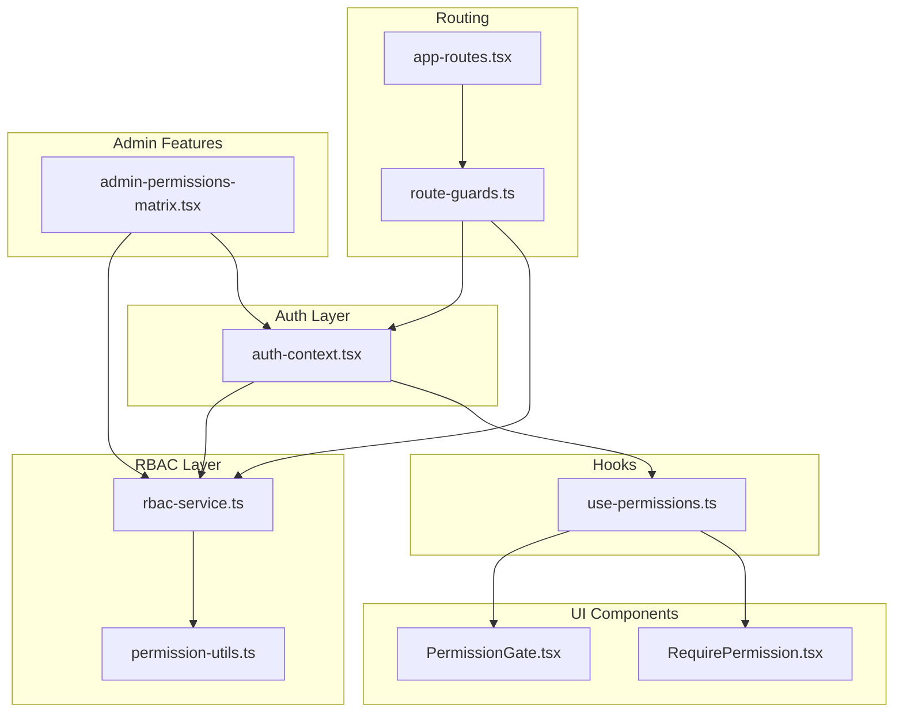
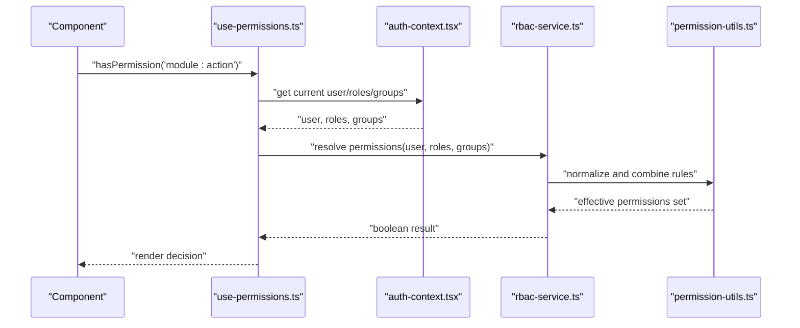
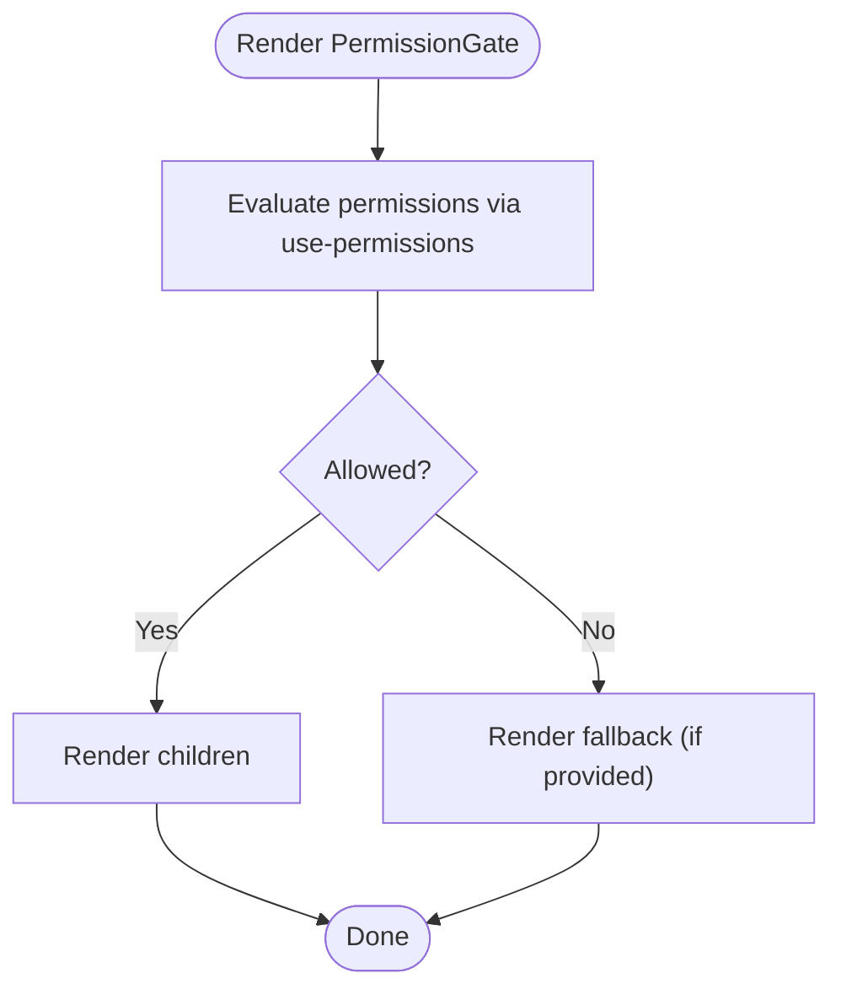
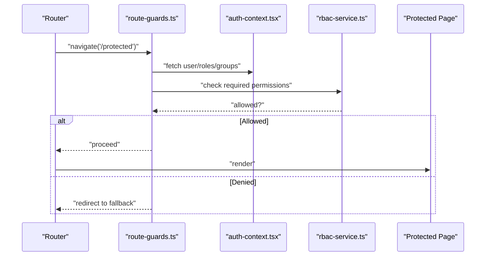
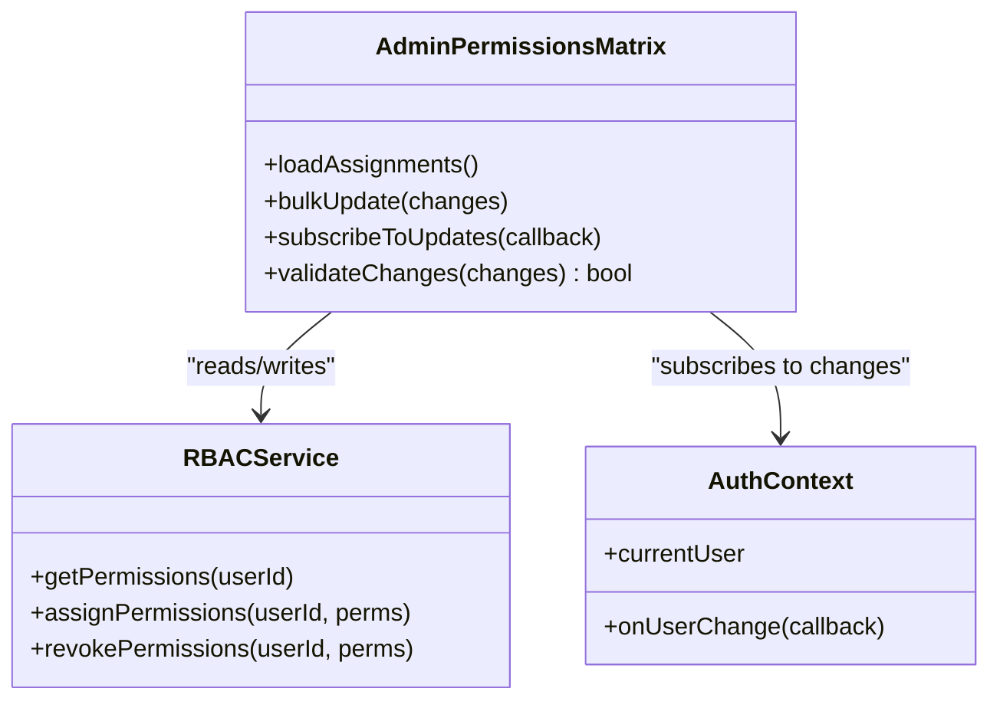
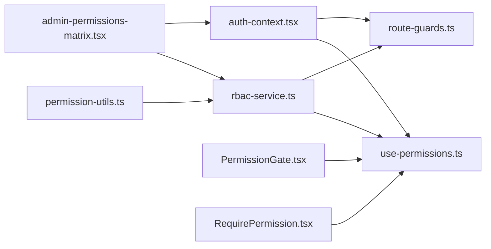

# Frontend Permission Integration

<cite>
**Referenced Files in This Document**
- [use-permissions.ts](file://frontend/src/hooks/use-permissions.ts)
- [PermissionGate.tsx](file://frontend/src/components/common/PermissionGate.tsx)
- [RequirePermission.tsx](file://frontend/src/components/common/RequirePermission.tsx)
- [auth-context.tsx](file://frontend/src/lib/auth-context.tsx)
- [rbac-service.ts](file://frontend/src/lib/rbac-service.ts)
- [permission-utils.ts](file://frontend/src/lib/permission-utils.ts)
- [admin-permissions-matrix.tsx](file://frontend/src/features/admin/permissions/AdminPermissionsMatrix.tsx)
- [route-guards.ts](file://frontend/src/lib/route-guards.ts)
- [app-routes.tsx](file://frontend/src/routes/app-routes.tsx)
- [dashboard-page.tsx](file://frontend/src/features/dashboard/DashboardPage.tsx)
- [settings-page.tsx](file://frontend/src/features/settings/SettingsPage.tsx)
- [user-management.tsx](file://frontend/src/features/user-management/UserManagement.tsx)
</cite>

## Table of Contents
1. [Introduction](#introduction)
2. [Project Structure](#project-structure)
3. [Core Components](#core-components)
4. [Architecture Overview](#architecture-overview)
5. [Detailed Component Analysis](#detailed-component-analysis)
6. [Dependency Analysis](#dependency-analysis)
7. [Performance Considerations](#performance-considerations)
8. [Troubleshooting Guide](#troubleshooting-guide)
9. [Conclusion](#conclusion)
10. [Appendices](#appendices)

## Introduction
This document explains how eLISAschool implements frontend permission integration for React applications. It covers the use-permissions hook, PermissionGate and RequirePermission components, route-level protection, component-level access control, and the admin permissions matrix interface. You will learn how to conditionally render UI based on user permissions, protect routes, implement permission-aware forms and buttons, and handle dynamic permission changes efficiently.

## Project Structure
The frontend permission system is organized around a small set of reusable primitives:
- A central authentication context that exposes current user and role information
- An RBAC service layer that resolves permissions from roles and groups
- A use-permissions hook that provides convenient permission checks
- Reusable UI components (PermissionGate, RequirePermission) for declarative access control
- Route guards for protecting entire pages or sections
- An admin permissions matrix for visual management and bulk operations

**Diagram sources**
- [auth-context.tsx](file://frontend/src/lib/auth-context.tsx)
- [rbac-service.ts](file://frontend/src/lib/rbac-service.ts)
- [permission-utils.ts](file://frontend/src/lib/permission-utils.ts)
- [use-permissions.ts](file://frontend/src/hooks/use-permissions.ts)
- [PermissionGate.tsx](file://frontend/src/components/common/PermissionGate.tsx)
- [RequirePermission.tsx](file://frontend/src/components/common/RequirePermission.tsx)
- [route-guards.ts](file://frontend/src/lib/route-guards.ts)
- [app-routes.tsx](file://frontend/src/routes/app-routes.tsx)
- [admin-permissions-matrix.tsx](file://frontend/src/features/admin/permissions/AdminPermissionsMatrix.tsx)

**Section sources**
- [auth-context.tsx](file://frontend/src/lib/auth-context.tsx)
- [rbac-service.ts](file://frontend/src/lib/rbac-service.ts)
- [permission-utils.ts](file://frontend/src/lib/permission-utils.ts)
- [use-permissions.ts](file://frontend/src/hooks/use-permissions.ts)
- [PermissionGate.tsx](file://frontend/src/components/common/PermissionGate.tsx)
- [RequirePermission.tsx](file://frontend/src/components/common/RequirePermission.tsx)
- [route-guards.ts](file://frontend/src/lib/route-guards.ts)
- [app-routes.tsx](file://frontend/src/routes/app-routes.tsx)
- [admin-permissions-matrix.tsx](file://frontend/src/features/admin/permissions/AdminPermissionsMatrix.tsx)

## Core Components
- use-permissions hook: Provides functions to check single permissions, multiple permissions, and group-based permissions. It integrates with the auth context and RBAC service to compute results reactively.
- PermissionGate component: Declaratively renders children only if the current user has required permissions; supports fallback rendering when access is denied.
- RequirePermission decorator: Higher-order component wrapper that enforces access at the component level by redirecting or rendering an alternative view when permissions are missing.

These primitives enable consistent, testable, and maintainable permission logic across the application.

**Section sources**
- [use-permissions.ts](file://frontend/src/hooks/use-permissions.ts)
- [PermissionGate.tsx](file://frontend/src/components/common/PermissionGate.tsx)
- [RequirePermission.tsx](file://frontend/src/components/common/RequirePermission.tsx)

## Architecture Overview
The permission architecture follows a layered approach:
- Auth Context holds the authenticated user, roles, and groups, and emits updates when they change.
- RBAC Service computes effective permissions by combining role-based and group-based rules.
- use-permissions hook exposes simple APIs for checking permissions and triggers re-renders when underlying data changes.
- PermissionGate and RequirePermission consume the hook to enforce access declaratively.
- Route Guards protect routes using the same permission logic before rendering page components.
- Admin Permissions Matrix allows administrators to visualize and update permissions in real time.

**Diagram sources**
- [use-permissions.ts](file://frontend/src/hooks/use-permissions.ts)
- [auth-context.tsx](file://frontend/src/lib/auth-context.tsx)
- [rbac-service.ts](file://frontend/src/lib/rbac-service.ts)
- [permission-utils.ts](file://frontend/src/lib/permission-utils.ts)

## Detailed Component Analysis

### use-permissions Hook
Responsibilities:
- Expose hasPermission(permission), hasAnyPermission(permissions[]), hasAllPermissions(permissions[])
- Provide getEffectivePermissions() for bulk checks and caching
- Subscribe to auth context changes to trigger re-renders when permissions change
- Integrate with RBAC service to resolve permissions from roles and groups

Implementation patterns:
- Memoized permission resolution to avoid recomputation
- Fallbacks for unauthenticated users
- Clear error handling for missing context or invalid inputs

Usage examples:
- Conditional rendering inside components
- Guarding API calls within effects
- Driving form field visibility and button states

**Section sources**
- [use-permissions.ts](file://frontend/src/hooks/use-permissions.ts)
- [auth-context.tsx](file://frontend/src/lib/auth-context.tsx)
- [rbac-service.ts](file://frontend/src/lib/rbac-service.ts)
- [permission-utils.ts](file://frontend/src/lib/permission-utils.ts)

### PermissionGate Component
Responsibilities:
- Accept required permissions as props
- Render children if allowed, otherwise render optional fallback
- Support granular checks (single permission, any/all combinations)

Props:
- permissions: string | string[]
- mode: 'any' | 'all'
- fallback: ReactNode

Behavior:
- Uses use-permissions internally to evaluate access
- Avoids unnecessary re-renders by memoizing permission checks

**Diagram sources**
- [PermissionGate.tsx](file://frontend/src/components/common/PermissionGate.tsx)
- [use-permissions.ts](file://frontend/src/hooks/use-permissions.ts)

**Section sources**
- [PermissionGate.tsx](file://frontend/src/components/common/PermissionGate.tsx)
- [use-permissions.ts](file://frontend/src/hooks/use-permissions.ts)

### RequirePermission Decorator
Responsibilities:
- Wrap components to enforce access at the component level
- Redirect to a default route or render an alternate component when access is denied
- Useful for feature modules that should be hidden entirely without permissions

Usage:
- Wrap sensitive components or feature containers
- Combine with route guards for defense-in-depth

**Section sources**
- [RequirePermission.tsx](file://frontend/src/components/common/RequirePermission.tsx)
- [use-permissions.ts](file://frontend/src/hooks/use-permissions.ts)

### Route-Level Protection
Route guards integrate with the router to prevent navigation to protected routes unless the user has required permissions. They can:
- Check permissions before rendering a route
- Redirect to a safe fallback or login page
- Display a minimal “access denied” state

Integration points:
- app-routes.tsx defines protected routes and applies guards
- dashboard-page.tsx and settings-page.tsx demonstrate guarded features
- user-management.tsx shows admin-only routes

**Diagram sources**
- [route-guards.ts](file://frontend/src/lib/route-guards.ts)
- [auth-context.tsx](file://frontend/src/lib/auth-context.tsx)
- [rbac-service.ts](file://frontend/src/lib/rbac-service.ts)
- [app-routes.tsx](file://frontend/src/routes/app-routes.tsx)
- [dashboard-page.tsx](file://frontend/src/features/dashboard/DashboardPage.tsx)
- [settings-page.tsx](file://frontend/src/features/settings/SettingsPage.tsx)
- [user-management.tsx](file://frontend/src/features/user-management/UserManagement.tsx)

**Section sources**
- [route-guards.ts](file://frontend/src/lib/route-guards.ts)
- [app-routes.tsx](file://frontend/src/routes/app-routes.tsx)
- [dashboard-page.tsx](file://frontend/src/features/dashboard/DashboardPage.tsx)
- [settings-page.tsx](file://frontend/src/features/settings/SettingsPage.tsx)
- [user-management.tsx](file://frontend/src/features/user-management/UserManagement.tsx)

### Admin Permissions Matrix Interface
The admin permissions matrix provides:
- Visual grid of modules/actions vs. roles/users
- Bulk operations to assign or revoke permissions
- Real-time updates when permissions change
- Validation and conflict resolution hints

Key behaviors:
- Loads current permission assignments
- Allows batch edits with confirmation
- Persists changes through RBAC service
- Emits events to refresh dependent UI

**Diagram sources**
- [admin-permissions-matrix.tsx](file://frontend/src/features/admin/permissions/AdminPermissionsMatrix.tsx)
- [rbac-service.ts](file://frontend/src/lib/rbac-service.ts)
- [auth-context.tsx](file://frontend/src/lib/auth-context.tsx)

**Section sources**
- [admin-permissions-matrix.tsx](file://frontend/src/features/admin/permissions/AdminPermissionsMatrix.tsx)
- [rbac-service.ts](file://frontend/src/lib/rbac-service.ts)
- [auth-context.tsx](file://frontend/src/lib/auth-context.tsx)

## Dependency Analysis
The permission subsystem exhibits clear separation of concerns:
- Auth context owns identity and role/group state
- RBAC service encapsulates permission resolution logic
- Hooks provide reactive access to permission checks
- UI components and route guards depend on hooks and guards for enforcement
- Admin matrix depends on RBAC service and auth context for live updates

**Diagram sources**
- [auth-context.tsx](file://frontend/src/lib/auth-context.tsx)
- [use-permissions.ts](file://frontend/src/hooks/use-permissions.ts)
- [rbac-service.ts](file://frontend/src/lib/rbac-service.ts)
- [permission-utils.ts](file://frontend/src/lib/permission-utils.ts)
- [PermissionGate.tsx](file://frontend/src/components/common/PermissionGate.tsx)
- [RequirePermission.tsx](file://frontend/src/components/common/RequirePermission.tsx)
- [route-guards.ts](file://frontend/src/lib/route-guards.ts)
- [admin-permissions-matrix.tsx](file://frontend/src/features/admin/permissions/AdminPermissionsMatrix.tsx)

**Section sources**
- [auth-context.tsx](file://frontend/src/lib/auth-context.tsx)
- [use-permissions.ts](file://frontend/src/hooks/use-permissions.ts)
- [rbac-service.ts](file://frontend/src/lib/rbac-service.ts)
- [permission-utils.ts](file://frontend/src/lib/permission-utils.ts)
- [PermissionGate.tsx](file://frontend/src/components/common/PermissionGate.tsx)
- [RequirePermission.tsx](file://frontend/src/components/common/RequirePermission.tsx)
- [route-guards.ts](file://frontend/src/lib/route-guards.ts)
- [admin-permissions-matrix.tsx](file://frontend/src/features/admin/permissions/AdminPermissionsMatrix.tsx)

## Performance Considerations
- Memoization: Cache permission resolutions per user/role/group combination to avoid repeated computations.
- Batching: Use bulk permission checks where possible to reduce re-renders.
- Lazy evaluation: Defer heavy permission calculations until needed.
- Minimal re-renders: Prefer stable references for permission checks and avoid unnecessary prop updates.
- Route-level gating: Prevent rendering of large components behind guards to reduce initial load cost.
- Admin matrix updates: Debounce bulk changes and coalesce updates to minimize network requests.

[No sources needed since this section provides general guidance]

## Troubleshooting Guide
Common issues and resolutions:
- Missing auth context: Ensure the app wraps routes with the auth provider so hooks can read user/roles/groups.
- Incorrect permission strings: Validate permission names against the canonical list used by RBAC service.
- Stale permissions: Verify that permission updates propagate via auth context subscriptions and that components subscribe correctly.
- Route loops: Confirm guards do not redirect to themselves; use explicit fallback routes.
- Network errors: Handle failures gracefully by falling back to deny-by-default behavior and surfacing actionable messages.

**Section sources**
- [auth-context.tsx](file://frontend/src/lib/auth-context.tsx)
- [rbac-service.ts](file://frontend/src/lib/rbac-service.ts)
- [route-guards.ts](file://frontend/src/lib/route-guards.ts)

## Conclusion
eLISAschool’s frontend permission system combines a robust RBAC service with intuitive React primitives. The use-permissions hook simplifies permission checks, while PermissionGate and RequirePermission enable declarative access control. Route guards ensure secure navigation, and the admin permissions matrix offers efficient, real-time management. Following the patterns and performance recommendations here will help you build secure, responsive, and maintainable permission-aware interfaces.

[No sources needed since this section summarizes without analyzing specific files]

## Appendices

### Practical Examples

- Protecting routes
  - Apply route guards to sensitive paths in app-routes.tsx
  - Redirect unauthorized users to a safe fallback

- Hiding/showing UI elements
  - Use PermissionGate to wrap conditional sections
  - Provide meaningful fallback content for denied access

- Permission-aware forms and buttons
  - Disable or hide submit buttons when required permissions are missing
  - Gate form fields using PermissionGate with appropriate modes

- Handling permission changes dynamically
  - Subscribe to auth context updates to refresh UI
  - Invalidate caches and recompute permission sets when roles/groups change

[No sources needed since this section provides general guidance]