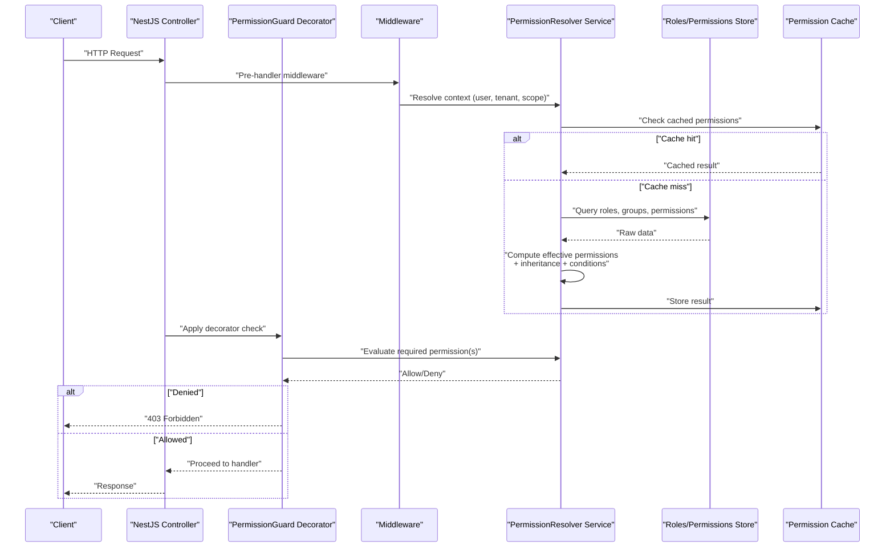
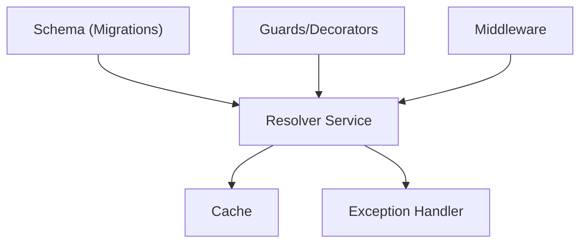
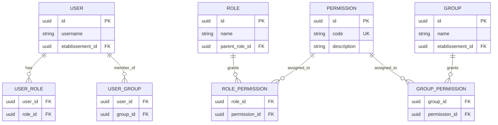

# Permission Evaluation & Guards

<cite>
**Referenced Files in This Document**
- [rbac-system.md](file://docs/rbac-system.md)
- [RBAC_COMPLETION.md](file://docs/RBAC_COMPLETION.md)
- [RBAC_FINAL_SESSION.md](file://docs/RBAC_FINAL_SESSION.md)
- [RAPPORT-FINAL-RBAC-v3.md](file://docs/rapports/RAPPORT-FINAL-RBAC-v3.md)
- [RAPPORT-OPTIMISATION-PERFORMANCE-RBAC.md](file://docs/guides/GUIDE-MONITORING-PERFORMANCE-RBAC.md)
- [CONVENTIONS-PERMISSIONS.md](file://docs/CONVENTIONS-PERMISSIONS.md)
- [EXEMPLE-INTEGRATION-PERMISSIONS.md](file://docs/EXEMPLE-INTEGRATION-PERMISSIONS.md)
- [GUIDE-TEST-MULTI-ROLES.md](file://docs/guides/GUIDE-TEST-MULTI-ROLES.md)
- [CORRECTION-PERMISSIONS-SUPER-ADMIN.md](file://docs/corrections/CORRECTION-PERMISSIONS-SUPER-ADMIN.md)
- [PERMISSIONS-BASE-DONNEES.md](file://docs/PERMISSIONS-BASE-DONNEES.md)
- [guards-exemples-implémentation.ts](file://docs/guards-exemples-implémentation.ts)
- [guide-implémentation-permissions.ts](file://docs/guide-implémentation-permissions.ts)
- [migrate-rbac-v3.sql](file://backend/database/migrations/migrate-rbac-v3.sql)
- [076-permissions-groupes-etablissements.sql](file://backend/database/migrations/076-permissions-groupes-etablissements.sql)
- [077-update-permissions-groupes.sql](file://backend/database/migrations/077-update-permissions-groupes.sql)
- [079-add-roleId-utilisateur-etablissements.sql](file://backend/database/migrations/079-add-roleId-utilisateur-etablissements.sql)
- [079-correction-permissions-groupes.sql](file://backend/database/migrations/079-correction-permissions-groupes.sql)
- [080-preferences-utilisateur-multi-tenant.sql](file://backend/database/migrations/080-preferences-utilisateur-multi-tenant.sql)
- [043-permissions-critiques-manquantes.sql](file://backend/database/migrations/043-permissions-critiques-manquantes.sql)
- [069-fix-super-admin-permissions.sql](file://backend/database/migrations/069-fix-super-admin-permissions.sql)
- [070-fix-super-admin-all-permission.sql](file://backend/database/migrations/070-fix-super-admin-all-permission.sql)
- [ANALYSE-PERMISSIONS-CONFIGURATION-AUDIT.md](file://docs/analyses/ANALYSE-PERMISSIONS-CONFIGURATION-AUDIT.md)
- [ANALYSE-PERMISSIONS-SYNTHESE.md](file://docs/analyses/ANALYSE-PERMISSIONS-SYNTHESE.md)
- [RAPPORT-FINAL-SESSION.md](file://docs/rapports/RAPPORT-FINAL-SESSION.md)
</cite>

## Table of Contents
1. [Introduction](#introduction)
2. [Project Structure](#project-structure)
3. [Core Components](#core-components)
4. [Architecture Overview](#architecture-overview)
5. [Detailed Component Analysis](#detailed-component-analysis)
6. [Dependency Analysis](#dependency-analysis)
7. [Performance Considerations](#performance-considerations)
8. [Troubleshooting Guide](#troubleshooting-guide)
9. [Conclusion](#conclusion)
10. [Appendices](#appendices)

## Introduction
This document explains eLISAschool’s permission evaluation engine and guard implementations with a focus on:
- PermissionGuard decorator usage
- Middleware-based permission checking
- Runtime permission resolution
- The permission evaluation pipeline (context-aware checks, dynamic calculation, inheritance resolution)
- Practical examples for custom guards and resource-specific decorators
- Graceful handling of permission failures
- Integration with NestJS framework guards and custom exception handling
- Performance optimization through caching
- Advanced scenarios: conditional permissions, permission composition, and testing strategies

The content synthesizes the RBAC system design, migrations, conventions, and implementation guides to provide both conceptual clarity and actionable guidance.

## Project Structure
At a high level, the permission system spans documentation, database schema, and backend modules:
- Documentation and guides define the RBAC model, conventions, and integration patterns
- Database migrations implement roles, permissions, role-permission mappings, group-scoped permissions, and multi-tenant preferences
- Backend modules integrate guards, middleware, and services to enforce permissions at runtime

```mermaid
graph TB
subgraph "Documentation"
D1["RBAC System Design<br/>rbac-system.md"]
D2["RBAC Completion Report<br/>RBAC_COMPLETION.md"]
D3["Conventions<br/>CONVENTIONS-PERMISSIONS.md"]
D4["Integration Examples<br/>EXEMPLE-INTEGRATION-PERMISSIONS.md"]
D5["Implementation Guides<br/>guard-exemples-implémentation.ts<br/>guide-implémentation-permissions.ts"]
end
subgraph "Database Migrations"
M1["RBAC v3 Migration<br/>migrate-rbac-v3.sql"]
M2["Group-Etablissement Permissions<br/>076-permissions-groupes-etablissements.sql"]
M3["Update Group Permissions<br/>077-update-permissions-groupes.sql"]
M4["Role ID on User-Etablissement<br/>079-add-roleId-utilisateur-etablissements.sql"]
M5["Fix Group Permissions<br/>079-correction-permissions-groupes.sql"]
M6["Multi-Tenant Preferences<br/>080-preferences-utilisateur-multi-tenant.sql"]
M7["Critical Missing Permissions<br/>043-permissions-critiques-manquantes.sql"]
M8["Super Admin Fixes<br/>069-fix-super-admin-permissions.sql<br/>070-fix-super-admin-all-permission.sql"]
end
subgraph "Backend Modules"
B1["Auth Module"]
B2["RBAC Module"]
B3["Common Guards/Middleware"]
end
D1 --> B2
D3 --> B3
D4 --> B3
D5 --> B3
M1 --> B2
M2 --> B2
M3 --> B2
M4 --> B2
M5 --> B2
M6 --> B2
M7 --> B2
M8 --> B2
B2 --> B3
```

[No sources needed since this diagram shows conceptual structure, not specific code files]

## Core Components
- Permission Guard Decorator: A decorator that marks controllers or methods requiring specific permissions. It integrates with NestJS execution context to trigger evaluation before handler invocation.
- Middleware-Based Permission Checking: Global or route-scoped middleware that inspects request context (user, tenant, scope) and enforces policy decisions early in the pipeline.
- Runtime Permission Resolution: Service-layer logic that computes effective permissions by combining user roles, explicit grants, group memberships, and inheritance rules. Contextual factors (e.g., establishment, module flags) influence outcomes.
- Exception Handling: Centralized filters/handlers translate authorization failures into consistent HTTP responses (e.g., 403 Forbidden).
- Caching Layer: Optional cache for computed permissions or policy results to reduce repeated evaluations under load.

Key responsibilities:
- Evaluate permissions against current request context
- Support dynamic and conditional checks
- Provide clear error messages and audit trails
- Maintain performance via caching and efficient queries

**Section sources**
- [rbac-system.md](file://docs/rbac-system.md)
- [RBAC_COMPLETION.md](file://docs/RBAC_COMPLETION.md)
- [CONVENTIONS-PERMISSIONS.md](file://docs/CONVENTIONS-PERMISSIONS.md)
- [EXEMPLE-INTEGRATION-PERMISSIONS.md](file://docs/EXEMPLE-INTEGRATION-PERMISSIONS.md)
- [guides-exemples-implémentation.ts](file://docs/guards-exemples-implémentation.ts)
- [guide-implémentation-permissions.ts](file://docs/guide-implémentation-permissions.ts)

## Architecture Overview
The permission evaluation pipeline combines decorator-driven entry points, middleware enforcement, and service-level resolution.

**Diagram sources**
- [rbac-system.md](file://docs/rbac-system.md)
- [RBAC_COMPLETION.md](file://docs/RBAC_COMPLETION.md)
- [CONVENTIONS-PERMISSIONS.md](file://docs/CONVENTIONS-PERMISSIONS.md)
- [EXEMPLE-INTEGRATION-PERMISSIONS.md](file://docs/EXEMPLE-INTEGRATION-PERMISSIONS.md)

## Detailed Component Analysis

### PermissionGuard Decorator Usage
- Purpose: Annotate controller methods or classes to require one or more permissions.
- Behavior: On invocation, the decorator triggers the permission resolver using the active request context. If denied, it short-circuits the handler and returns an unauthorized response.
- Composition: Supports multiple permissions with logical AND/OR semantics depending on configuration.
- NestJS Integration: Works alongside NestJS CanActivate-style guards; can be combined with other decorators like roles or scopes.

Practical usage patterns:
- Method-level decoration for fine-grained control
- Class-level decoration for broad protection
- Parameter injection for dynamic permission names derived from route parameters or payload

**Section sources**
- [EXEMPLE-INTEGRATION-PERMISSIONS.md](file://docs/EXEMPLE-INTEGRATION-PERMISSIONS.md)
- [guides-exemples-implémentation.ts](file://docs/guards-exemples-implémentation.ts)
- [guide-implémentation-permissions.ts](file://docs/guide-implémentation-permissions.ts)

### Middleware-Based Permission Checking
- Scope: Global or route-scoped middleware inspects requests before they reach controllers.
- Responsibilities:
  - Extract identity and tenant context
  - Validate basic access prerequisites (e.g., authenticated session, valid tenant)
  - Perform coarse-grained permission checks where appropriate
  - Enforce module activation flags and multi-tenant isolation
- Benefits: Early rejection reduces unnecessary processing; centralizes cross-cutting concerns.

Typical flow:
- Parse headers and cookies for authentication tokens
- Resolve user and establishment context
- Check module enablement and baseline permissions
- Attach enriched context for downstream guards/services

**Section sources**
- [rbac-system.md](file://docs/rbac-system.md)
- [RBAC_COMPLETION.md](file://docs/RBAC_COMPLETION.md)
- [CONVENTIONS-PERMISSIONS.md](file://docs/CONVENTIONS-PERMISSIONS.md)

### Runtime Permission Resolution
- Inputs:
  - User identity and roles
  - Group memberships and group-scoped permissions
  - Establishment context and module flags
  - Conditional policies (e.g., time windows, ownership)
- Process:
  - Load base permissions from roles
  - Apply group overrides and additions
  - Resolve inheritance across role hierarchies
  - Evaluate contextual conditions and dynamic rules
- Outputs:
  - Boolean decision per requested permission
  - Cached result keyed by context fingerprint

Complexity considerations:
- Minimize database round-trips by batching queries
- Use deterministic keys for cache entries
- Avoid deep recursion in inheritance graphs

**Section sources**
- [rbac-system.md](file://docs/rbac-system.md)
- [RBAC_COMPLETION.md](file://docs/RBAC_COMPLETION.md)
- [CONVENTIONS-PERMISSIONS.md](file://docs/CONVENTIONS-PERMISSIONS.md)

### Permission Inheritance Resolution
- Role hierarchy: Roles may inherit permissions from parent roles.
- Group permissions: Groups grant additional permissions scoped to establishments or modules.
- Overrides: Explicit denies take precedence over inherited allows when defined.
- Multi-tenant scoping: Permissions may be restricted to specific establishments or global.

Resolution steps:
- Collect all applicable roles and groups
- Aggregate permissions with precedence rules
- Apply establishment/module scoping
- Finalize effective set for the current context

**Section sources**
- [migrate-rbac-v3.sql](file://backend/database/migrations/migrate-rbac-v3.sql)
- [076-permissions-groupes-etablissements.sql](file://backend/database/migrations/076-permissions-groupes-etablissements.sql)
- [077-update-permissions-groupes.sql](file://backend/database/migrations/077-update-permissions-groupes.sql)
- [079-add-roleId-utilisateur-etablissements.sql](file://backend/database/migrations/079-add-roleId-utilisateur-etablissements.sql)
- [079-correction-permissions-groupes.sql](file://backend/database/migrations/079-correction-permissions-groupes.sql)
- [080-preferences-utilisateur-multi-tenant.sql](file://backend/database/migrations/080-preferences-utilisateur-multi-tenant.sql)

### Custom Guards and Resource-Specific Decorators
- Custom Guards: Implement NestJS-compatible guards to encapsulate complex logic (e.g., ownership checks, workflow state gates).
- Resource-Specific Decorators: Create decorators tailored to domain resources (e.g., student records, financial transactions) that map to underlying permission strings.
- Best Practices:
  - Keep decorators declarative; delegate logic to services
  - Compose guards for layered checks
  - Provide descriptive error messages and correlation IDs

Examples:
- @RequirePermission('student.read')
- @RequireResourceAccess('finance.invoice', 'write')
- @ConditionalPermission('isOwnerOrAdmin')

**Section sources**
- [EXEMPLE-INTEGRATION-PERMISSIONS.md](file://docs/EXEMPLE-INTEGRATION-PERMISSIONS.md)
- [guides-exemples-implémentation.ts](file://docs/guards-exemples-implémentation.ts)
- [guide-implémentation-permissions.ts](file://docs/guide-implémentation-permissions.ts)

### Handling Permission Failures Gracefully
- Response Format: Consistent 403 responses with structured error payloads including message and optional hint.
- Filters: Centralized exception filters convert authorization errors into standardized HTTP responses.
- Audit Trail: Log denied attempts with user, resource, and reason for compliance and debugging.
- UX Guidance: Frontend should adapt UI based on permission outcomes (hide actions, show upgrade prompts).

**Section sources**
- [RBAC_COMPLETION.md](file://docs/RBAC_COMPLETION.md)
- [CONVENTIONS-PERMISSIONS.md](file://docs/CONVENTIONS-PERMISSIONS.md)

### Integration with NestJS Framework Guards
- Compatibility: PermissionGuard integrates with NestJS CanActivate interface and lifecycle hooks.
- Ordering: Place middleware before guards to ensure context is available.
- Composition: Combine with existing guards (e.g., JWT validation) to build robust pipelines.

**Section sources**
- [rbac-system.md](file://docs/rbac-system.md)
- [RBAC_COMPLETION.md](file://docs/RBAC_COMPLETION.md)

### Testing Permission Logic
- Unit Tests: Mock PermissionResolver and verify decision outcomes for various contexts.
- Integration Tests: End-to-end flows asserting allowed/denied behaviors across endpoints.
- Multi-Role Scenarios: Validate inheritance, group overrides, and establishment scoping.
- Assertions: Confirm correct HTTP status codes, error payloads, and audit logs.

**Section sources**
- [GUIDE-TEST-MULTI-ROLES.md](file://docs/guides/GUIDE-TEST-MULTI-ROLES.md)
- [RBAC_COMPLETION.md](file://docs/RBAC_COMPLETION.md)

## Dependency Analysis
The permission system depends on:
- Database schema for roles, permissions, role-permission mappings, and group-scoped grants
- Services for resolving effective permissions and evaluating conditions
- Middleware and guards for enforcing decisions at request boundaries
- Caching layer for performance optimization

**Diagram sources**
- [migrate-rbac-v3.sql](file://backend/database/migrations/migrate-rbac-v3.sql)
- [076-permissions-groupes-etablissements.sql](file://backend/database/migrations/076-permissions-groupes-etablissements.sql)
- [077-update-permissions-groupes.sql](file://backend/database/migrations/077-update-permissions-groupes.sql)
- [079-add-roleId-utilisateur-etablissements.sql](file://backend/database/migrations/079-add-roleId-utilisateur-etablissements.sql)
- [079-correction-permissions-groupes.sql](file://backend/database/migrations/079-correction-permissions-groupes.sql)
- [080-preferences-utilisateur-multi-tenant.sql](file://backend/database/migrations/080-preferences-utilisateur-multi-tenant.sql)

**Section sources**
- [migrate-rbac-v3.sql](file://backend/database/migrations/migrate-rbac-v3.sql)
- [076-permissions-groupes-etablissements.sql](file://backend/database/migrations/076-permissions-groupes-etablissements.sql)
- [077-update-permissions-groupes.sql](file://backend/database/migrations/077-update-permissions-groupes.sql)
- [079-add-roleId-utilisateur-etablissements.sql](file://backend/database/migrations/079-add-roleId-utilisateur-etablissements.sql)
- [079-correction-permissions-groupes.sql](file://backend/database/migrations/079-correction-permissions-groupes.sql)
- [080-preferences-utilisateur-multi-tenant.sql](file://backend/database/migrations/080-preferences-utilisateur-multi-tenant.sql)

## Performance Considerations
- Caching Strategy:
  - Key by composite fingerprint (userId, roleId, groupId, establishmentId, moduleFlags)
  - TTL tuned to expected change frequency of roles/groups
  - Invalidate on mutations to roles, groups, or preferences
- Query Optimization:
  - Batch fetch roles, groups, and permissions
  - Precompute frequently used aggregates
- Monitoring:
  - Track cache hit rates and resolver latency
  - Alert on spikes in denied attempts

**Section sources**
- [RAPPORT-OPTIMISATION-PERFORMANCE-RBAC.md](file://docs/guides/GUIDE-MONITORING-PERFORMANCE-RBAC.md)
- [RBAC_COMPLETION.md](file://docs/RBAC_COMPLETION.md)

## Troubleshooting Guide
Common issues and resolutions:
- Super Admin Not Granted All Permissions:
  - Verify migration fixes for super admin privileges
  - Ensure all critical permissions are seeded
- Group Permissions Not Applied:
  - Check group-scoped permission migrations and corrections
  - Validate establishment scoping and role linkage
- Multi-Tenant Preference Issues:
  - Confirm user preference tables and defaults are correctly applied

Diagnostic steps:
- Inspect recent migrations for missing or corrected entries
- Review audit logs for denied attempts and reasons
- Validate cache invalidation after role/group changes

**Section sources**
- [043-permissions-critiques-manquantes.sql](file://backend/database/migrations/043-permissions-critiques-manquantes.sql)
- [069-fix-super-admin-permissions.sql](file://backend/database/migrations/069-fix-super-admin-permissions.sql)
- [070-fix-super-admin-all-permission.sql](file://backend/database/migrations/070-fix-super-admin-all-permission.sql)
- [076-permissions-groupes-etablissements.sql](file://backend/database/migrations/076-permissions-groupes-etablissements.sql)
- [077-update-permissions-groupes.sql](file://backend/database/migrations/077-update-permissions-groupes.sql)
- [079-correction-permissions-groupes.sql](file://backend/database/migrations/079-correction-permissions-groupes.sql)
- [080-preferences-utilisateur-multi-tenant.sql](file://backend/database/migrations/080-preferences-utilisateur-multi-tenant.sql)
- [CORRECTION-PERMISSIONS-SUPER-ADMIN.md](file://docs/corrections/CORRECTION-PERMISSIONS-SUPER-ADMIN.md)

## Conclusion
eLISAschool’s permission evaluation engine provides a robust, extensible foundation for fine-grained access control. By combining decorator-driven guards, middleware enforcement, and a resilient resolver with caching and inheritance support, the system ensures secure and performant operations across multi-tenant environments. Following the conventions and integration patterns outlined here will help maintain consistency, simplify testing, and scale effectively.

[No sources needed since this section summarizes without analyzing specific files]

## Appendices

### Data Model Overview

**Diagram sources**
- [migrate-rbac-v3.sql](file://backend/database/migrations/migrate-rbac-v3.sql)
- [076-permissions-groupes-etablissements.sql](file://backend/database/migrations/076-permissions-groupes-etablissements.sql)
- [077-update-permissions-groupes.sql](file://backend/database/migrations/077-update-permissions-groupes.sql)
- [079-add-roleId-utilisateur-etablissements.sql](file://backend/database/migrations/079-add-roleId-utilisateur-etablissements.sql)
- [079-correction-permissions-groupes.sql](file://backend/database/migrations/079-correction-permissions-groupes.sql)
- [080-preferences-utilisateur-multi-tenant.sql](file://backend/database/migrations/080-preferences-utilisateur-multi-tenant.sql)

### Implementation References
- Conventions and naming: [CONVENTIONS-PERMISSIONS.md](file://docs/CONVENTIONS-PERMISSIONS.md)
- Integration examples: [EXEMPLE-INTEGRATION-PERMISSIONS.md](file://docs/EXEMPLE-INTEGRATION-PERMISSIONS.md)
- Guard examples: [guards-exemples-implémentation.ts](file://docs/guards-exemples-implémentation.ts)
- Implementation guide: [guide-implémentation-permissions.ts](file://docs/guide-implémentation-permissions.ts)
- RBAC overview and completion: [rbac-system.md](file://docs/rbac-system.md), [RBAC_COMPLETION.md](file://docs/RBAC_COMPLETION.md)
- Final session report: [RBAC_FINAL_SESSION.md](file://docs/RBAC_FINAL_SESSION.md)
- Performance monitoring: [RAPPORT-OPTIMISATION-PERFORMANCE-RBAC.md](file://docs/guides/GUIDE-MONITORING-PERFORMANCE-RBAC.md)
- Database reference: [PERMISSIONS-BASE-DONNEES.md](file://docs/PERMISSIONS-BASE-DONNEES.md)
- Analyses and summaries: [ANALYSE-PERMISSIONS-CONFIGURATION-AUDIT.md](file://docs/analyses/ANALYSE-PERMISSIONS-CONFIGURATION-AUDIT.md), [ANALYSE-PERMISSIONS-SYNTHESE.md](file://docs/analyses/ANALYSE-PERMISSIONS-SYNTHESE.md), [RAPPORT-FINAL-SESSION.md](file://docs/rapports/RAPPORT-FINAL-SESSION.md)