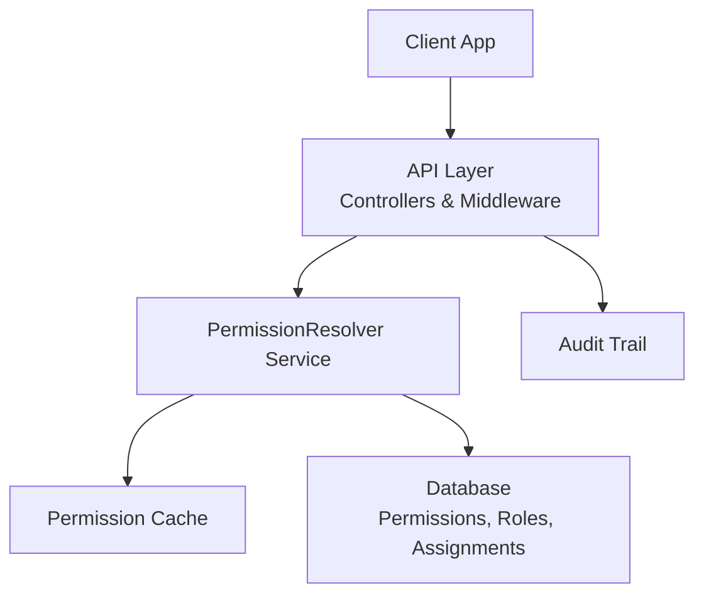
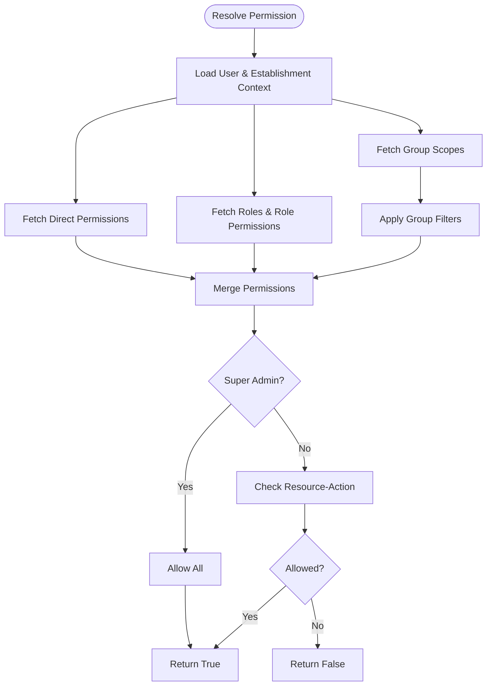
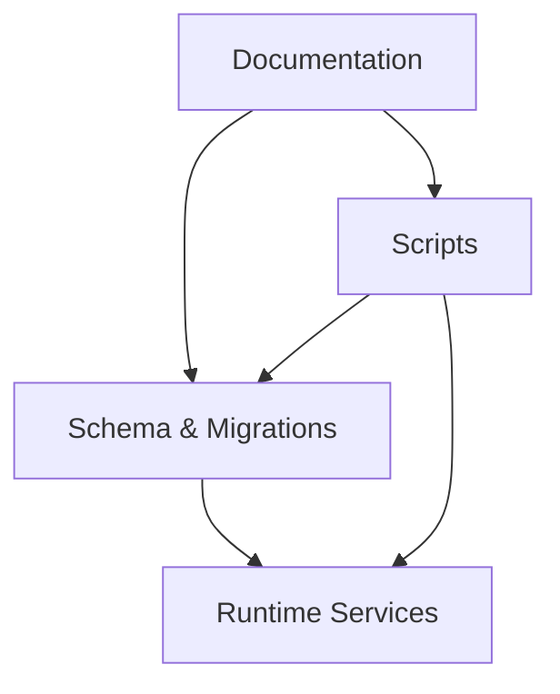

# Permissions System

<cite>
**Referenced Files in This Document**
- [rbac-system.md](file://docs/rbac-system.md)
- [CONVENTIONS-PERMISSIONS.md](file://docs/CONVENTIONS-PERMISSIONS.md)
- [PERMISSIONS-BASE-DONNEES.md](file://docs/PERMISSIONS-BASE-DONNEES.md)
- [EXEMPLE-INTEGRATION-PERMISSIONS.md](file://docs/EXEMPLE-INTEGRATION-PERMISSIONS.md)
- [GUIDE-TEST-MULTI-ROLES.md](file://docs/guides/GUIDE-TEST-MULTI-ROLES.md)
- [CORRECTION-PERMISSIONS-SUPER-ADMIN.md](file://docs/corrections/CORRECTION-PERMISSIONS-SUPER-ADMIN.md)
- [RAPPORT-FINAL-RBAC-v3.md](file://docs/rapports/RAPPORT-FINAL-RBAC-v3.md)
- [MIGRATION-RBAC-v3-MULTI-TENANT-STRICT.md](file://docs/migrations/MIGRATION-RBAC-v3-MULTI-TENANT-STRICT.md)
- [021-module-personnel-rh-permissions-attribution.sql](file://backend/database/migrations/021-module-personnel-rh-permissions-attribution.sql)
- [076-permissions-groupes-etablissements.sql](file://backend/database/migrations/076-permissions-groupes-etablissements.sql)
- [077-update-permissions-groupes.sql](file://backend/database/migrations/077-update-permissions-groupes.sql)
- [079-add-roleId-utilisateur-etablissements.sql](file://backend/database/migrations/079-add-roleId-utilisateur-etablissements.sql)
- [079-correction-permissions-groupes.sql](file://backend/database/migrations/079-correction-permissions-groupes.sql)
- [080-preferences-utilisateur-multi-tenant.sql](file://backend/database/migrations/080-preferences-utilisateur-multi-tenant.sql)
- [043-permissions-critiques-manquantes.sql](file://backend/database/migrations/043-permissions-critiques-manquantes.sql)
- [069-fix-super-admin-permissions.sql](file://backend/database/migrations/069-fix-super-admin-permissions.sql)
- [070-fix-super-admin-all-permission.sql](file://backend/database/migrations/070-fix-super-admin-all-permission.sql)
- [migrate-rbac-v3.sql](file://backend/database/migrations/migrate-rbac-v3.sql)
- [run-role-perm-migration.ts](file://backend/scripts/run-role-perm-migration.ts)
- [analyse-enums-complet.ts](file://backend/analyse-enums-complet.ts)
- [guards-exemples-implémentation.ts](file://docs/guards-exemples-implémentation.ts)
- [guide-implémentation-permissions.ts](file://docs/guide-implémentation-permissions.ts)
- [ANALYSE-PERMISSIONS-CONFIGURATION-AUDIT.md](file://docs/analyses/ANALYSE-PERMISSIONS-CONFIGURATION-AUDIT.md)
- [ANALYSE-PERMISSIONS-SYNTHESE.md](file://docs/analyses/ANALYSE-PERMISSIONS-SYNTHESE.md)
- [RESUME-IMPLÉMENTATION-PERMISSIONS-FRONTEND.md](file://docs/resumes/RESUME-IMPLÉMENTATION-PERMISSIONS-FRONTEND.md)
- [GUIDE-API-UTILISATEURS-ETABLISSEMENTS.md](file://docs/GUIDE-API-UTILISATEURS-ETABLISSEMENTS.md)
</cite>

## Table of Contents
1. [Introduction](#introduction)
2. [Project Structure](#project-structure)
3. [Core Components](#core-components)
4. [Architecture Overview](#architecture-overview)
5. [Detailed Component Analysis](#detailed-component-analysis)
6. [Dependency Analysis](#dependency-analysis)
7. [Performance Considerations](#performance-considerations)
8. [Troubleshooting Guide](#troubleshooting-guide)
9. [Conclusion](#conclusion)
10. [Appendices](#appendices)

## Introduction
This document explains eLISAschool’s permission system architecture with a focus on the Permission entity model, resource-action based permission types, and evaluation logic. It details how permissions are assigned via user-permission relationships and role-permission inheritance, including group-based scoping for multi-tenant environments. It also covers practical guidance for defining new permissions, implementing guards in controllers, checking permissions in services, and rendering UI conditionally. Finally, it addresses validation rules, conflict resolution, auditing capabilities, and best practices for granular access control.

## Project Structure
The permission system spans documentation, database migrations, scripts, and shared examples:
- Documentation: conceptual design, conventions, integration examples, and frontend summaries
- Database: RBAC schema, seeds, and migration scripts for roles, permissions, assignments, and group scoping
- Scripts: utilities to run migrations and analyze enums
- Examples: guard implementation patterns and step-by-step guides

```mermaid
graph TB
subgraph "Documentation"
D1["rbac-system.md"]
D2["CONVENTIONS-PERMISSIONS.md"]
D3["PERMISSIONS-BASE-DONNEES.md"]
D4["EXEMPLE-INTEGRATION-PERMISSIONS.md"]
D5["guides/GUIDE-TEST-MULTI-ROLES.md"]
D6["corrections/CORRECTION-PERMISSIONS-SUPER-ADMIN.md"]
D7["rapports/RAPPORT-FINAL-RBAC-v3.md"]
D8["migrations/MIGRATION-RBAC-v3-MULTI-TENANT-STRICT.md"]
D9["analyses/ANALYSE-PERMISSIONS-CONFIGURATION-AUDIT.md"]
D10["analyses/ANALYSE-PERMISSIONS-SYNTHESE.md"]
D11["resumes/RESUME-IMPLÉMENTATION-PERMISSIONS-FRONTEND.md"]
D12["GUIDE-API-UTILISATEURS-ETABLISSEMENTS.md"]
end
subgraph "Database Migrations"
M1["021-module-personnel-rh-permissions-attribution.sql"]
M2["076-permissions-groupes-etablissements.sql"]
M3["077-update-permissions-groupes.sql"]
M4["079-add-roleId-utilisateur-etablissements.sql"]
M5["079-correction-permissions-groupes.sql"]
M6["080-preferences-utilisateur-multi-tenant.sql"]
M7["043-permissions-critiques-manquantes.sql"]
M8["069-fix-super-admin-permissions.sql"]
M9["070-fix-super-admin-all-permission.sql"]
M10["migrate-rbac-v3.sql"]
end
subgraph "Scripts"
S1["scripts/run-role-perm-migration.ts"]
S2["backend/analyse-enums-complet.ts"]
end
subgraph "Examples"
E1["docs/guards-exemples-implémentation.ts"]
E2["docs/guide-implémentation-permissions.ts"]
end
D1 --> M10
D2 --> M10
D3 --> M10
D4 --> E1
D4 --> E2
D5 --> M10
D6 --> M8
D6 --> M9
D7 --> M10
D8 --> M10
D9 --> M10
D10 --> M10
D11 --> E1
D12 --> M4
M10 --> M1
M10 --> M2
M10 --> M3
M10 --> M4
M10 --> M5
M10 --> M6
M10 --> M7
M10 --> M8
M10 --> M9
S1 --> M10
S2 --> D2
```

**Diagram sources**
- [rbac-system.md](file://docs/rbac-system.md)
- [CONVENTIONS-PERMISSIONS.md](file://docs/CONVENTIONS-PERMISSIONS.md)
- [PERMISSIONS-BASE-DONNEES.md](file://docs/PERMISSIONS-BASE-DONNEES.md)
- [EXEMPLE-INTEGRATION-PERMISSIONS.md](file://docs/EXEMPLE-INTEGRATION-PERMISSIONS.md)
- [guides/GUIDE-TEST-MULTI-ROLES.md](file://docs/guides/GUIDE-TEST-MULTI-ROLES.md)
- [corrections/CORRECTION-PERMISSIONS-SUPER-ADMIN.md](file://docs/corrections/CORRECTION-PERMISSIONS-SUPER-ADMIN.md)
- [rapports/RAPPORT-FINAL-RBAC-v3.md](file://docs/rapports/RAPPORT-FINAL-RBAC-v3.md)
- [migrations/MIGRATION-RBAC-v3-MULTI-TENANT-STRICT.md](file://docs/migrations/MIGRATION-RBAC-v3-MULTI-TENANT-STRICT.md)
- [analyses/ANALYSE-PERMISSIONS-CONFIGURATION-AUDIT.md](file://docs/analyses/ANALYSE-PERMISSIONS-CONFIGURATION-AUDIT.md)
- [analyses/ANALYSE-PERMISSIONS-SYNTHESE.md](file://docs/analyses/ANALYSE-PERMISSIONS-SYNTHESE.md)
- [resumes/RESUME-IMPLÉMENTATION-PERMISSIONS-FRONTEND.md](file://docs/resumes/RESUME-IMPLÉMENTATION-PERMISSIONS-FRONTEND.md)
- [GUIDE-API-UTILISATEURS-ETABLISSEMENTS.md](file://docs/GUIDE-API-UTILISATEURS-ETABLISSEMENTS.md)
- [021-module-personnel-rh-permissions-attribution.sql](file://backend/database/migrations/021-module-personnel-rh-permissions-attribution.sql)
- [076-permissions-groupes-etablissements.sql](file://backend/database/migrations/076-permissions-groupes-etablissements.sql)
- [077-update-permissions-groupes.sql](file://backend/database/migrations/077-update-permissions-groupes.sql)
- [079-add-roleId-utilisateur-etablissements.sql](file://backend/database/migrations/079-add-roleId-utilisateur-etablissements.sql)
- [079-correction-permissions-groupes.sql](file://backend/database/migrations/079-correction-permissions-groupes.sql)
- [080-preferences-utilisateur-multi-tenant.sql](file://backend/database/migrations/080-preferences-utilisateur-multi-tenant.sql)
- [043-permissions-critiques-manquantes.sql](file://backend/database/migrations/043-permissions-critiques-manquantes.sql)
- [069-fix-super-admin-permissions.sql](file://backend/database/migrations/069-fix-super-admin-permissions.sql)
- [070-fix-super-admin-all-permission.sql](file://backend/database/migrations/070-fix-super-admin-all-permission.sql)
- [migrate-rbac-v3.sql](file://backend/database/migrations/migrate-rbac-v3.sql)
- [run-role-perm-migration.ts](file://backend/scripts/run-role-perm-migration.ts)
- [analyse-enums-complet.ts](file://backend/analyse-enums-complet.ts)
- [guards-exemples-implémentation.ts](file://docs/guards-exemples-implémentation.ts)
- [guide-implémentation-permissions.ts](file://docs/guide-implémentation-permissions.ts)

**Section sources**
- [rbac-system.md](file://docs/rbac-system.md)
- [CONVENTIONS-PERMISSIONS.md](file://docs/CONVENTIONS-PERMISSIONS.md)
- [PERMISSIONS-BASE-DONNEES.md](file://docs/PERMISSIONS-BASE-DONNEES.md)
- [EXEMPLE-INTEGRATION-PERMISSIONS.md](file://docs/EXEMPLE-INTEGRATION-PERMISSIONS.md)
- [guides/GUIDE-TEST-MULTI-ROLES.md](file://docs/guides/GUIDE-TEST-MULTI-ROLES.md)
- [corrections/CORRECTION-PERMISSIONS-SUPER-ADMIN.md](file://docs/corrections/CORRECTION-PERMISSIONS-SUPER-ADMIN.md)
- [rapports/RAPPORT-FINAL-RBAC-v3.md](file://docs/rapports/RAPPORT-FINAL-RBAC-v3.md)
- [migrations/MIGRATION-RBAC-v3-MULTI-TENANT-STRICT.md](file://docs/migrations/MIGRATION-RBAC-v3-MULTI-TENANT-STRICT.md)
- [analyses/ANALYSE-PERMISSIONS-CONFIGURATION-AUDIT.md](file://docs/analyses/ANALYSE-PERMISSIONS-CONFIGURATION-AUDIT.md)
- [analyses/ANALYSE-PERMISSIONS-SYNTHESE.md](file://docs/analyses/ANALYSE-PERMISSIONS-SYNTHESE.md)
- [resumes/RESUME-IMPLÉMENTATION-PERMISSIONS-FRONTEND.md](file://docs/resumes/RESUME-IMPLÉMENTATION-PERMISSIONS-FRONTEND.md)
- [GUIDE-API-UTILISATEURS-ETABLISSEMENTS.md](file://docs/GUIDE-API-UTILISATEURS-ETABLISSEMENTS.md)
- [021-module-personnel-rh-permissions-attribution.sql](file://backend/database/migrations/021-module-personnel-rh-permissions-attribution.sql)
- [076-permissions-groupes-etablissements.sql](file://backend/database/migrations/076-permissions-groupes-etablissements.sql)
- [077-update-permissions-groupes.sql](file://backend/database/migrations/077-update-permissions-groupes.sql)
- [079-add-roleId-utilisateur-etablissements.sql](file://backend/database/migrations/079-add-roleId-utilisateur-etablissements.sql)
- [079-correction-permissions-groupes.sql](file://backend/database/migrations/079-correction-permissions-groupes.sql)
- [080-preferences-utilisateur-multi-tenant.sql](file://backend/database/migrations/080-preferences-utilisateur-multi-tenant.sql)
- [043-permissions-critiques-manquantes.sql](file://backend/database/migrations/043-permissions-critiques-manquantes.sql)
- [069-fix-super-admin-permissions.sql](file://backend/database/migrations/069-fix-super-admin-permissions.sql)
- [070-fix-super-admin-all-permission.sql](file://backend/database/migrations/070-fix-super-admin-all-permission.sql)
- [migrate-rbac-v3.sql](file://backend/database/migrations/migrate-rbac-v3.sql)
- [run-role-perm-migration.ts](file://backend/scripts/run-role-perm-migration.ts)
- [analyse-enums-complet.ts](file://backend/analyse-enums-complet.ts)
- [guards-exemples-implémentation.ts](file://docs/guards-exemples-implémentation.ts)
- [guide-implémentation-permissions.ts](file://docs/guide-implémentation-permissions.ts)

## Core Components
- Permission entity model: Resource-action pairs define fine-grained capabilities (for example, module.resource.action). The model supports metadata such as description and scope constraints.
- Role-permission inheritance: Roles aggregate permissions; users inherit permissions from their assigned roles. Group membership further scopes permissions to specific establishments or contexts.
- User-permission assignment: Direct user-to-permission links can override or extend inherited permissions, enabling precise exceptions.
- Evaluation logic: A resolver aggregates permissions by combining direct assignments, role inheritance, and group scoping, then evaluates whether a given resource-action is allowed under the current context (including tenant isolation).

Key responsibilities:
- Define canonical permission identifiers and conventions
- Persist roles, permissions, and assignments
- Resolve effective permissions per user and context
- Provide APIs and hooks for real-time checks and UI gating

**Section sources**
- [rbac-system.md](file://docs/rbac-system.md)
- [CONVENTIONS-PERMISSIONS.md](file://docs/CONVENTIONS-PERMISSIONS.md)
- [PERMISSIONS-BASE-DONNEES.md](file://docs/PERMISSIONS-BASE-DONNEES.md)
- [rapports/RAPPORT-FINAL-RBAC-v3.md](file://docs/rapports/RAPPORT-FINAL-RBAC-v3.md)

## Architecture Overview
The permission system integrates across data, services, and presentation layers:
- Data layer: Tables for permissions, roles, user-role mappings, and group-scoped assignments
- Service layer: PermissionResolver computes effective permissions using caching and context-aware queries
- API layer: Controllers enforce permissions via decorators or middleware
- Frontend: Hooks and components render features conditionally based on resolved permissions

**Diagram sources**
- [rapports/RAPPORT-FINAL-RBAC-v3.md](file://docs/rapports/RAPPORT-FINAL-RBAC-v3.md)
- [migrations/MIGRATION-RBAC-v3-MULTI-TENANT-STRICT.md](file://docs/migrations/MIGRATION-RBAC-v3-MULTI-TENANT-STRICT.md)
- [analyses/ANALYSE-PERMISSIONS-CONFIGURATION-AUDIT.md](file://docs/analyses/ANALYSE-PERMISSIONS-CONFIGURATION-AUDIT.md)

## Detailed Component Analysis

### Permission Entity Model and Conventions
- Naming convention: Use hierarchical identifiers like module.resource.action to express intent clearly and consistently.
- Metadata: Each permission includes descriptive fields to aid administration and auditing.
- Scope: Permissions may be scoped to tenants or groups to support multi-tenant isolation.

Practical implications:
- Centralized registry of permissions simplifies discovery and maintenance
- Consistent naming enables automated tooling (e.g., enum analysis)

**Section sources**
- [CONVENTIONS-PERMISSIONS.md](file://docs/CONVENTIONS-PERMISSIONS.md)
- [PERMISSIONS-BASE-DONNEES.md](file://docs/PERMISSIONS-BASE-DONNEES.md)
- [analyse-enums-complet.ts](file://backend/analyse-enums-complet.ts)

### Role-Permission Inheritance and Group Scoping
- Roles bundle permissions for reuse across users
- Users inherit permissions from roles they hold
- Groups add establishment-level scoping, ensuring permissions apply only within authorized contexts

Migration references:
- Role-permission attribution and updates
- Group-based permission scoping and corrections
- Adding role linkage to user-establishment records

**Section sources**
- [021-module-personnel-rh-permissions-attribution.sql](file://backend/database/migrations/021-module-personnel-rh-permissions-attribution.sql)
- [076-permissions-groupes-etablissements.sql](file://backend/database/migrations/076-permissions-groupes-etablissements.sql)
- [077-update-permissions-groupes.sql](file://backend/database/migrations/077-update-permissions-groupes.sql)
- [079-add-roleId-utilisateur-etablissements.sql](file://backend/database/migrations/079-add-roleId-utilisateur-etablissements.sql)
- [079-correction-permissions-groupes.sql](file://backend/database/migrations/079-correction-permissions-groupes.sql)
- [080-preferences-utilisateur-multi-tenant.sql](file://backend/database/migrations/080-preferences-utilisateur-multi-tenant.sql)

### Permission Resolution Logic
Resolution combines:
- Direct user-permission assignments
- Role-inherited permissions
- Group-scoped permissions filtered by current establishment context
- Special-case handling for super-admin privileges where applicable

Evaluation steps:
1. Load user identity and active establishment context
2. Retrieve direct permissions and role-linked permissions
3. Apply group scoping filters
4. Merge and deduplicate effective permissions
5. Check if requested resource-action is present
6. Return boolean result and optionally audit the check

**Diagram sources**
- [migrate-rbac-v3.sql](file://backend/database/migrations/migrate-rbac-v3.sql)
- [069-fix-super-admin-permissions.sql](file://backend/database/migrations/069-fix-super-admin-permissions.sql)
- [070-fix-super-admin-all-permission.sql](file://backend/database/migrations/070-fix-super-admin-all-permission.sql)
- [043-permissions-critiques-manquantes.sql](file://backend/database/migrations/043-permissions-critiques-manquantes.sql)

**Section sources**
- [migrate-rbac-v3.sql](file://backend/database/migrations/migrate-rbac-v3.sql)
- [069-fix-super-admin-permissions.sql](file://backend/database/migrations/069-fix-super-admin-permissions.sql)
- [070-fix-super-admin-all-permission.sql](file://backend/database/migrations/070-fix-super-admin-all-permission.sql)
- [043-permissions-critiques-manquantes.sql](file://backend/database/migrations/043-permissions-critiques-manquantes.sql)

### PermissionResolver Service Implementation
Responsibilities:
- Compute effective permissions efficiently
- Cache results keyed by user and establishment context
- Support real-time checks with minimal latency
- Integrate with audit logging for compliance

Caching strategy:
- In-memory cache with TTL for hot paths
- Cache invalidation on role/group changes or permission updates
- Fallback to database when cache miss occurs

Performance optimizations:
- Batched queries to reduce round-trips
- Indexed lookups on user, role, and group associations
- Early exit for super-admin cases

Real-time checking:
- Lightweight endpoint or service method to evaluate permissions on demand
- Optional request-scoped cache to avoid repeated DB hits within a single request

**Section sources**
- [rapports/RAPPORT-FINAL-RBAC-v3.md](file://docs/rapports/RAPPORT-FINAL-RBAC-v3.md)
- [migrations/MIGRATION-RBAC-v3-MULTI-TENANT-STRICT.md](file://docs/migrations/MIGRATION-RBAC-v3-MULTI-TENANT-STRICT.md)

### Assignment Patterns: User-Permission and Role-Permission
- Direct assignments: Useful for exceptional cases or temporary grants
- Role inheritance: Preferred for standard access patterns
- Group scoping: Ensures permissions respect establishment boundaries

Operational guidance:
- Prefer roles for common access patterns
- Use direct assignments sparingly and document reasons
- Validate group membership before granting scoped permissions

**Section sources**
- [021-module-personnel-rh-permissions-attribution.sql](file://backend/database/migrations/021-module-personnel-rh-permissions-attribution.sql)
- [076-permissions-groupes-etablissements.sql](file://backend/database/migrations/076-permissions-groupes-etablissements.sql)
- [079-add-roleId-utilisateur-etablissements.sql](file://backend/database/migrations/079-add-roleId-utilisateur-etablissements.sql)

### Practical Examples

#### Defining New Permissions
- Follow naming conventions (module.resource.action)
- Add metadata (description, scope)
- Seed initial entries if needed
- Update enum registries for consistency

References:
- Conventions and base definitions
- Enum analysis utility

**Section sources**
- [CONVENTIONS-PERMISSIONS.md](file://docs/CONVENTIONS-PERMISSIONS.md)
- [PERMISSIONS-BASE-DONNEES.md](file://docs/PERMISSIONS-BASE-DONNEES.md)
- [analyse-enums-complet.ts](file://backend/analyse-enums-complet.ts)

#### Implementing Permission Guards in Controllers
- Use decorators or middleware to enforce required permissions at route level
- Fail fast with appropriate HTTP status codes
- Log denied attempts for auditing

Example reference:
- Guard implementation patterns

**Section sources**
- [EXEMPLE-INTEGRATION-PERMISSIONS.md](file://docs/EXEMPLE-INTEGRATION-PERMISSIONS.md)
- [guards-exemples-implémentation.ts](file://docs/guards-exemples-implémentation.ts)

#### Checking Permissions in Services
- Call PermissionResolver directly for business logic decisions
- Avoid duplicating authorization logic across services
- Keep checks close to the action being protected

Example reference:
- Step-by-step guide for service integration

**Section sources**
- [guide-implémentation-permissions.ts](file://docs/guide-implémentation-permissions.ts)

#### Conditional UI Rendering Based on Permissions
- Use frontend hooks to fetch and cache user permissions
- Render or hide features based on resolved permissions
- Provide graceful fallbacks when permission data is unavailable

Frontend summary:
- Integration patterns and hooks usage

**Section sources**
- [RESUME-IMPLÉMENTATION-PERMISSIONS-FRONTEND.md](file://docs/resumes/RESUME-IMPLÉMENTATION-PERMISSIONS-FRONTEND.md)

### Validation Rules, Conflicts, and Auditing
Validation rules:
- Enforce unique permission identifiers
- Prevent circular dependencies in role hierarchies
- Ensure group scoping aligns with tenant boundaries

Conflict resolution:
- Explicit deny overrides allow where necessary
- Super-admin bypass documented and audited
- Group conflicts resolved by most restrictive rule

Auditing:
- Record permission checks and outcomes
- Track role and permission changes
- Provide reports for compliance and troubleshooting

**Section sources**
- [analyses/ANALYSE-PERMISSIONS-CONFIGURATION-AUDIT.md](file://docs/analyses/ANALYSE-PERMISSIONS-CONFIGURATION-AUDIT.md)
- [rapports/RAPPORT-FINAL-RBAC-v3.md](file://docs/rapports/RAPPORT-FINAL-RBAC-v3.md)

### Best Practices for Granular Access Control
- Prefer resource-action granularity over coarse roles
- Centralize permission definitions and conventions
- Use roles for baseline access and direct assignments for exceptions
- Scope permissions to groups and tenants rigorously
- Cache aggressively but invalidate promptly on changes
- Audit all authorization-sensitive operations

**Section sources**
- [CONVENTIONS-PERMISSIONS.md](file://docs/CONVENTIONS-PERMISSIONS.md)
- [rapports/RAPPORT-FINAL-RBAC-v3.md](file://docs/rapports/RAPPORT-FINAL-RBAC-v3.md)

## Dependency Analysis
The permission system depends on:
- Database schema for permissions, roles, assignments, and group scoping
- Migration scripts to evolve the schema safely
- Scripts to execute migrations and analyze enums
- Documentation guiding integration and testing

**Diagram sources**
- [migrations/MIGRATION-RBAC-v3-MULTI-TENANT-STRICT.md](file://docs/migrations/MIGRATION-RBAC-v3-MULTI-TENANT-STRICT.md)
- [run-role-perm-migration.ts](file://backend/scripts/run-role-perm-migration.ts)
- [analyse-enums-complet.ts](file://backend/analyse-enums-complet.ts)

**Section sources**
- [migrations/MIGRATION-RBAC-v3-MULTI-TENANT-STRICT.md](file://docs/migrations/MIGRATION-RBAC-v3-MULTI-TENANT-STRICT.md)
- [run-role-perm-migration.ts](file://backend/scripts/run-role-perm-migration.ts)
- [analyse-enums-complet.ts](file://backend/analyse-enums-complet.ts)

## Performance Considerations
- Cache permission sets per user-establishment pair with short TTLs
- Batch load roles and group memberships to minimize queries
- Index foreign keys and scoping columns for faster joins
- Short-circuit evaluation for privileged accounts
- Monitor cache hit rates and adjust TTLs accordingly

[No sources needed since this section provides general guidance]

## Troubleshooting Guide
Common issues and resolutions:
- Missing critical permissions: Review critical permission seed and fix scripts
- Super-admin behavior anomalies: Verify special-case handling and ensure consistent application
- Group scoping mismatches: Confirm establishment context and group membership alignment
- Multi-tenant isolation failures: Validate tenant boundary enforcement in queries and caches

Operational references:
- Fixes for super-admin permissions
- Critical permission gaps
- Multi-tenant strictness guidelines

**Section sources**
- [043-permissions-critiques-manquantes.sql](file://backend/database/migrations/043-permissions-critiques-manquantes.sql)
- [069-fix-super-admin-permissions.sql](file://backend/database/migrations/069-fix-super-admin-permissions.sql)
- [070-fix-super-admin-all-permission.sql](file://backend/database/migrations/070-fix-super-admin-all-permission.sql)
- [corrections/CORRECTION-PERMISSIONS-SUPER-ADMIN.md](file://docs/corrections/CORRECTION-PERMISSIONS-SUPER-ADMIN.md)
- [migrations/MIGRATION-RBAC-v3-MULTI-TENANT-STRICT.md](file://docs/migrations/MIGRATION-RBAC-v3-MULTI-TENANT-STRICT.md)

## Conclusion
eLISAschool’s permission system provides a robust, scalable foundation for fine-grained access control. By adhering to clear conventions, leveraging role inheritance and group scoping, and implementing efficient resolution with caching and auditing, teams can maintain secure and performant applications. Following the provided patterns and best practices ensures consistent, maintainable authorization across modules and tenants.

[No sources needed since this section summarizes without analyzing specific files]

## Appendices

### API and User-Establishment Context
When evaluating permissions, always include the active establishment context to honor group scoping and tenant isolation.

**Section sources**
- [GUIDE-API-UTILISATEURS-ETABLISSEMENTS.md](file://docs/GUIDE-API-UTILISATEURS-ETABLISSEMENTS.md)

### Testing Multi-Role Scenarios
Use dedicated test guides to validate role combinations, group scoping, and edge cases.

**Section sources**
- [guides/GUIDE-TEST-MULTI-ROLES.md](file://docs/guides/GUIDE-TEST-MULTI-ROLES.md)