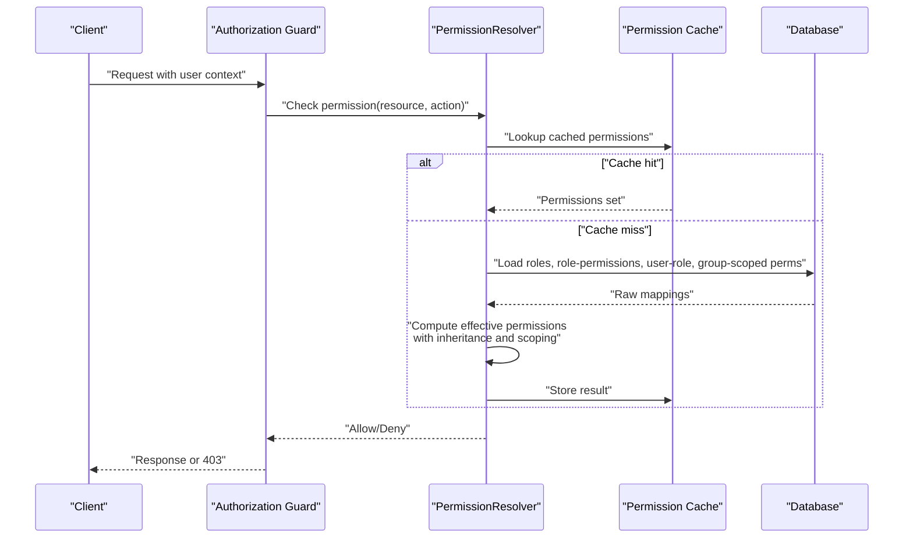
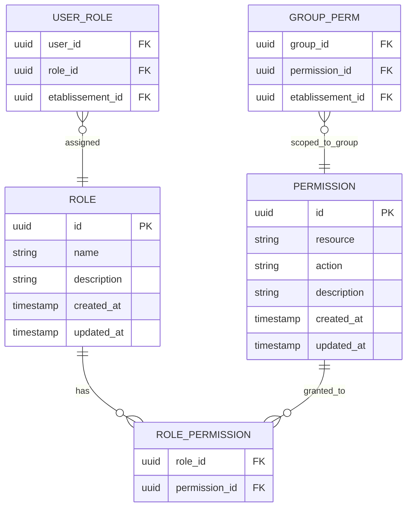
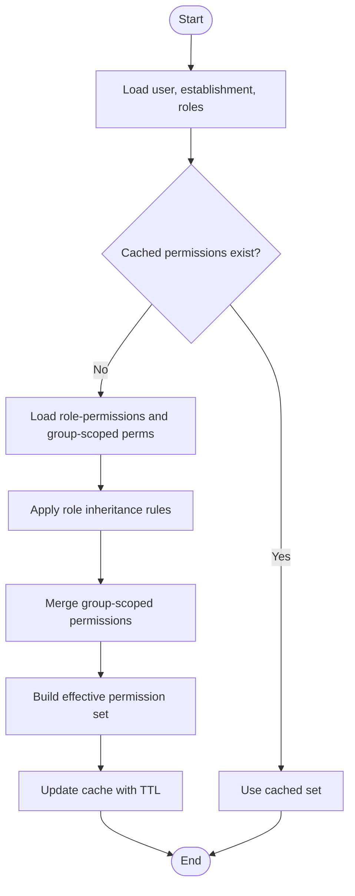
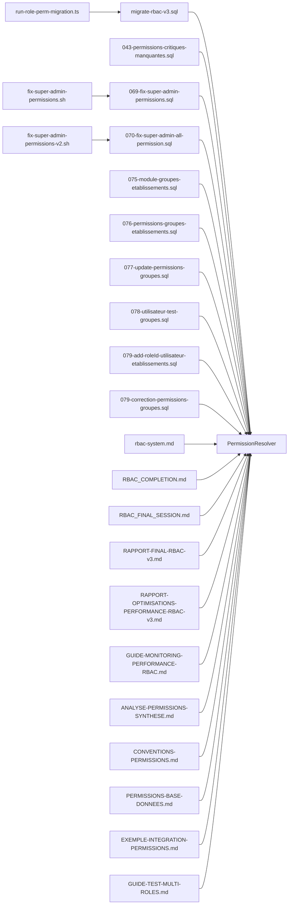

# Role-Based Access Control (RBAC)

<cite>
**Referenced Files in This Document**
- [rbac-system.md](file://docs/rbac-system.md)
- [RBAC_COMPLETION.md](file://docs/RBAC_COMPLETION.md)
- [RBAC_FINAL_SESSION.md](file://docs/RBAC_FINAL_SESSION.md)
- [RAPPORT-FINAL-RBAC-v3.md](file://docs/rapports/RAPPORT-FINAL-RBAC-v3.md)
- [RAPPORT-OPTIMISATIONS-PERFORMANCE-RBAC-v3.md](file://docs/rapports/RAPPORT-OPTIMISATIONS-PERFORMANCE-RBAC-v3.md)
- [GUIDE-MONITORING-PERFORMANCE-RBAC.md](file://docs/guides/GUIDE-MONITORING-PERFORMANCE-RBAC.md)
- [ANALYSE-PERMISSIONS-SYNTHESE.md](file://docs/analyses/ANALYSE-PERMISSIONS-SYNTHESE.md)
- [CONVENTIONS-PERMISSIONS.md](file://docs/CONVENTIONS-PERMISSIONS.md)
- [PERMISSIONS-BASE-DONNEES.md](file://docs/PERMISSIONS-BASE-DONNEES.md)
- [EXEMPLE-INTEGRATION-PERMISSIONS.md](file://docs/EXEMPLE-INTEGRATION-PERMISSIONS.md)
- [GUIDE-TEST-MULTI-ROLES.md](file://docs/guides/GUIDE-TEST-MULTI-ROLES.md)
- [migrate-rbac-v3.sql](file://backend/database/migrations/migrate-rbac-v3.sql)
- [043-permissions-critiques-manquantes.sql](file://backend/database/migrations/043-permissions-critiques-manquantes.sql)
- [069-fix-super-admin-permissions.sql](file://backend/database/migrations/069-fix-super-admin-permissions.sql)
- [070-fix-super-admin-all-permission.sql](file://backend/database/migrations/070-fix-super-admin-all-permission.sql)
- [075-module-groupes-etablissements.sql](file://backend/database/migrations/075-module-groupes-etablissements.sql)
- [076-permissions-groupes-etablissements.sql](file://backend/database/migrations/076-permissions-groupes-etablissements.sql)
- [077-update-permissions-groupes.sql](file://backend/database/migrations/077-update-permissions-groupes.sql)
- [078-utilisateur-test-groupes.sql](file://backend/database/migrations/078-utilisateur-test-groupes.sql)
- [079-add-roleId-utilisateur-etablissements.sql](file://backend/database/migrations/079-add-roleId-utilisateur-etablissements.sql)
- [079-correction-permissions-groupes.sql](file://backend/database/migrations/079-correction-permissions-groupes.sql)
- [run-role-perm-migration.ts](file://backend/scripts/run-role-perm-migration.ts)
- [fix-super-admin-permissions.sh](file://scripts/fix-super-admin-permissions.sh)
- [fix-super-admin-permissions-v2.sh](file://scripts/fix-super-admin-permissions-v2.sh)
- [fix-super-admin-permissions.sql](file://scripts/fix-super-admin-permissions.sql)
- [fix-super-admin-quick.sql](file://scripts/fix-super-admin-quick.sql)
- [analyse-enums-complet.ts](file://backend/analyse-enums-complet.ts)
</cite>

## Table of Contents
1. [Introduction](#introduction)
2. [Project Structure](#project-structure)
3. [Core Components](#core-components)
4. [Architecture Overview](#architecture-overview)
5. [Detailed Component Analysis](#detailed-component-analysis)
6. [Dependency Analysis](#dependency-analysis)
7. [Performance Considerations](#performance-considerations)
8. [Troubleshooting Guide](#troubleshooting-guide)
9. [Conclusion](#conclusion)
10. [Appendices](#appendices)

## Introduction
This document explains eLISAschool’s Role-Based Access Control (RBAC) system, focusing on roles, permissions, hierarchical relationships, inheritance patterns, dynamic evaluation, and granular access control at resource and action levels. It also covers the PermissionResolver service implementation, caching strategies, performance optimizations, practical usage examples, permission matrix interface, bulk operations, auditing, conflict resolution, and validation rules. The content synthesizes backend migrations, scripts, and documentation artifacts to provide a complete reference for developers and administrators.

## Project Structure
The RBAC system spans database schema definitions, seed and migration scripts, runtime services, guards, and documentation. Key areas include:
- Database migrations defining roles, permissions, role-permission mappings, user-role assignments, and group-scoped permissions.
- Scripts to initialize or fix RBAC data, including super-admin corrections and group-based permissions.
- Documentation describing conventions, integration examples, testing procedures, and performance monitoring.

```mermaid
graph TB
subgraph "Database Layer"
M1["migrate-rbac-v3.sql"]
M2["043-permissions-critiques-manquantes.sql"]
M3["069-fix-super-admin-permissions.sql"]
M4["070-fix-super-admin-all-permission.sql"]
M5["075-module-groupes-etablissements.sql"]
M6["076-permissions-groupes-etablissements.sql"]
M7["077-update-permissions-groupes.sql"]
M8["078-utilisateur-test-groupes.sql"]
M9["079-add-roleId-utilisateur-etablissements.sql"]
M10["079-correction-permissions-groupes.sql"]
end
subgraph "Runtime Services"
PR["PermissionResolver Service"]
GUARD["Authorization Guards"]
CACHE["Permission Cache"]
end
subgraph "Scripts & Docs"
S1["run-role-perm-migration.ts"]
S2["fix-super-admin-permissions.sh"]
S3["fix-super-admin-permissions-v2.sh"]
D1["rbac-system.md"]
D2["RBAC_COMPLETION.md"]
D3["RBAC_FINAL_SESSION.md"]
D4["RAPPORT-FINAL-RBAC-v3.md"]
D5["RAPPORT-OPTIMISATIONS-PERFORMANCE-RBAC-v3.md"]
D6["GUIDE-MONITORING-PERFORMANCE-RBAC.md"]
D7["ANALYSE-PERMISSIONS-SYNTHESE.md"]
D8["CONVENTIONS-PERMISSIONS.md"]
D9["PERMISSIONS-BASE-DONNEES.md"]
D10["EXEMPLE-INTEGRATION-PERMISSIONS.md"]
D11["GUIDE-TEST-MULTI-ROLES.md"]
end
M1 --> PR
M2 --> PR
M3 --> PR
M4 --> PR
M5 --> PR
M6 --> PR
M7 --> PR
M8 --> PR
M9 --> PR
M10 --> PR
PR --> GUARD
PR --> CACHE
S1 --> M1
S2 --> M3
S3 --> M4
D1 --> PR
D2 --> PR
D3 --> PR
D4 --> PR
D5 --> PR
D6 --> PR
D7 --> PR
D8 --> PR
D9 --> PR
D10 --> PR
D11 --> PR
```

**Diagram sources**
- [migrate-rbac-v3.sql](file://backend/database/migrations/migrate-rbac-v3.sql)
- [043-permissions-critiques-manquantes.sql](file://backend/database/migrations/043-permissions-critiques-manquantes.sql)
- [069-fix-super-admin-permissions.sql](file://backend/database/migrations/069-fix-super-admin-permissions.sql)
- [070-fix-super-admin-all-permission.sql](file://backend/database/migrations/070-fix-super-admin-all-permission.sql)
- [075-module-groupes-etablissements.sql](file://backend/database/migrations/075-module-groupes-etablissements.sql)
- [076-permissions-groupes-etablissements.sql](file://backend/database/migrations/076-permissions-groupes-etablissements.sql)
- [077-update-permissions-groupes.sql](file://backend/database/migrations/077-update-permissions-groupes.sql)
- [078-utilisateur-test-groupes.sql](file://backend/database/migrations/078-utilisateur-test-groupes.sql)
- [079-add-roleId-utilisateur-etablissements.sql](file://backend/database/migrations/079-add-roleId-utilisateur-etablissements.sql)
- [079-correction-permissions-groupes.sql](file://backend/database/migrations/079-correction-permissions-groupes.sql)
- [run-role-perm-migration.ts](file://backend/scripts/run-role-perm-migration.ts)
- [fix-super-admin-permissions.sh](file://scripts/fix-super-admin-permissions.sh)
- [fix-super-admin-permissions-v2.sh](file://scripts/fix-super-admin-permissions-v2.sh)
- [rbac-system.md](file://docs/rbac-system.md)
- [RBAC_COMPLETION.md](file://docs/RBAC_COMPLETION.md)
- [RBAC_FINAL_SESSION.md](file://docs/RBAC_FINAL_SESSION.md)
- [RAPPORT-FINAL-RBAC-v3.md](file://docs/rapports/RAPPORT-FINAL-RBAC-v3.md)
- [RAPPORT-OPTIMISATIONS-PERFORMANCE-RBAC-v3.md](file://docs/rapports/RAPPORT-OPTIMISATIONS-PERFORMANCE-RBAC-v3.md)
- [GUIDE-MONITORING-PERFORMANCE-RBAC.md](file://docs/guides/GUIDE-MONITORING-PERFORMANCE-RBAC.md)
- [ANALYSE-PERMISSIONS-SYNTHESE.md](file://docs/analyses/ANALYSE-PERMISSIONS-SYNTHESE.md)
- [CONVENTIONS-PERMISSIONS.md](file://docs/CONVENTIONS-PERMISSIONS.md)
- [PERMISSIONS-BASE-DONNEES.md](file://docs/PERMISSIONS-BASE-DONNEES.md)
- [EXEMPLE-INTEGRATION-PERMISSIONS.md](file://docs/EXEMPLE-INTEGRATION-PERMISSIONS.md)
- [GUIDE-TEST-MULTI-ROLES.md](file://docs/guides/GUIDE-TEST-MULTI-ROLES.md)

**Section sources**
- [rbac-system.md](file://docs/rbac-system.md)
- [RBAC_COMPLETION.md](file://docs/RBAC_COMPLETION.md)
- [RBAC_FINAL_SESSION.md](file://docs/RBAC_FINAL_SESSION.md)
- [RAPPORT-FINAL-RBAC-v3.md](file://docs/rapports/RAPPORT-FINAL-RBAC-v3.md)
- [RAPPORT-OPTIMISATIONS-PERFORMANCE-RBAC-v3.md](file://docs/rapports/RAPPORT-OPTIMISATIONS-PERFORMANCE-RBAC-v3.md)
- [GUIDE-MONITORING-PERFORMANCE-RBAC.md](file://docs/guides/GUIDE-MONITORING-PERFORMANCE-RBAC.md)
- [ANALYSE-PERMISSIONS-SYNTHESE.md](file://docs/analyses/ANALYSE-PERMISSIONS-SYNTHESE.md)
- [CONVENTIONS-PERMISSIONS.md](file://docs/CONVENTIONS-PERMISSIONS.md)
- [PERMISSIONS-BASE-DONNEES.md](file://docs/PERMISSIONS-BASE-DONNEES.md)
- [EXEMPLE-INTEGRATION-PERMISSIONS.md](file://docs/EXEMPLE-INTEGRATION-PERMISSIONS.md)
- [GUIDE-TEST-MULTI-ROLES.md](file://docs/guides/GUIDE-TEST-MULTI-ROLES.md)
- [migrate-rbac-v3.sql](file://backend/database/migrations/migrate-rbac-v3.sql)
- [043-permissions-critiques-manquantes.sql](file://backend/database/migrations/043-permissions-critiques-manquantes.sql)
- [069-fix-super-admin-permissions.sql](file://backend/database/migrations/069-fix-super-admin-permissions.sql)
- [070-fix-super-admin-all-permission.sql](file://backend/database/migrations/070-fix-super-admin-all-permission.sql)
- [075-module-groupes-etablissements.sql](file://backend/database/migrations/075-module-groupes-etablissements.sql)
- [076-permissions-groupes-etablissements.sql](file://backend/database/migrations/076-permissions-groupes-etablissements.sql)
- [077-update-permissions-groupes.sql](file://backend/database/migrations/077-update-permissions-groupes.sql)
- [078-utilisateur-test-groupes.sql](file://backend/database/migrations/078-utilisateur-test-groupes.sql)
- [079-add-roleId-utilisateur-etablissements.sql](file://backend/database/migrations/079-add-roleId-utilisateur-etablissements.sql)
- [079-correction-permissions-groupes.sql](file://backend/database/migrations/079-correction-permissions-groupes.sql)
- [run-role-perm-migration.ts](file://backend/scripts/run-role-perm-migration.ts)
- [fix-super-admin-permissions.sh](file://scripts/fix-super-admin-permissions.sh)
- [fix-super-admin-permissions-v2.sh](file://scripts/fix-super-admin-permissions-v2.sh)

## Core Components
- Roles: Named collections of permissions that can be assigned to users within an establishment context.
- Permissions: Fine-grained capabilities expressed as resource-action pairs (for example, module.view, module.edit).
- Role-Permission Mapping: Defines which permissions are granted to each role.
- User-Role Assignment: Associates users with one or more roles per establishment.
- Group-Scoped Permissions: Extends permissions by groups and establishments to support multi-tenant scoping.
- PermissionResolver: Central service that evaluates effective permissions for a user across roles, groups, and establishment scope.
- Caching: In-memory or Redis-backed cache for resolved permissions to reduce repeated computation.
- Guards and Decorators: Middleware and decorators that enforce authorization at controller/service boundaries.
- Auditing: Logs permission-related decisions and changes for compliance and troubleshooting.

Key responsibilities:
- Resolve effective permissions dynamically based on current user, establishment, and request context.
- Support inheritance via role hierarchies where applicable.
- Provide fast checks for UI rendering and API enforcement.
- Maintain consistency through migrations and scripts.

**Section sources**
- [rbac-system.md](file://docs/rbac-system.md)
- [RBAC_COMPLETION.md](file://docs/RBAC_COMPLETION.md)
- [RBAC_FINAL_SESSION.md](file://docs/RBAC_FINAL_SESSION.md)
- [RAPPORT-FINAL-RBAC-v3.md](file://docs/rapports/RAPPORT-FINAL-RBAC-v3.md)
- [PERMISSIONS-BASE-DONNEES.md](file://docs/PERMISSIONS-BASE-DONNEES.md)
- [CONVENTIONS-PERMISSIONS.md](file://docs/CONVENTIONS-PERMISSIONS.md)

## Architecture Overview
The RBAC architecture integrates database-backed definitions with runtime evaluation and caching. Migrations define core entities and relationships; the PermissionResolver computes effective permissions; guards enforce them; and audits record outcomes.

**Diagram sources**
- [migrate-rbac-v3.sql](file://backend/database/migrations/migrate-rbac-v3.sql)
- [075-module-groupes-etablissements.sql](file://backend/database/migrations/075-module-groupes-etablissements.sql)
- [076-permissions-groupes-etablissements.sql](file://backend/database/migrations/076-permissions-groupes-etablissements.sql)
- [077-update-permissions-groupes.sql](file://backend/database/migrations/077-update-permissions-groupes.sql)
- [079-add-roleId-utilisateur-etablissements.sql](file://backend/database/migrations/079-add-roleId-utilisateur-etablissements.sql)
- [RAPPORT-OPTIMISATIONS-PERFORMANCE-RBAC-v3.md](file://docs/rapports/RAPPORT-OPTIMISATIONS-PERFORMANCE-RBAC-v3.md)
- [GUIDE-MONITORING-PERFORMANCE-RBAC.md](file://docs/guides/GUIDE-MONITORING-PERFORMANCE-RBAC.md)

## Detailed Component Analysis

### Permission Model and Relationships
The RBAC model centers on roles, permissions, and their mappings, extended by user-role assignments and group-scoped permissions for multi-tenant environments.

**Diagram sources**
- [migrate-rbac-v3.sql](file://backend/database/migrations/migrate-rbac-v3.sql)
- [075-module-groupes-etablissements.sql](file://backend/database/migrations/075-module-groupes-etablissements.sql)
- [076-permissions-groupes-etablissements.sql](file://backend/database/migrations/076-permissions-groupes-etablissements.sql)
- [077-update-permissions-groupes.sql](file://backend/database/migrations/077-update-permissions-groupes.sql)
- [079-add-roleId-utilisateur-etablissements.sql](file://backend/database/migrations/079-add-roleId-utilisateur-etablissements.sql)

**Section sources**
- [PERMISSIONS-BASE-DONNEES.md](file://docs/PERMISSIONS-BASE-DONNEES.md)
- [migrate-rbac-v3.sql](file://backend/database/migrations/migrate-rbac-v3.sql)
- [075-module-groupes-etablissements.sql](file://backend/database/migrations/075-module-groupes-etablissements.sql)
- [076-permissions-groupes-etablissements.sql](file://backend/database/migrations/076-permissions-groupes-etablissements.sql)
- [077-update-permissions-groupes.sql](file://backend/database/migrations/077-update-permissions-groupes.sql)
- [079-add-roleId-utilisateur-etablissements.sql](file://backend/database/migrations/079-add-roleId-utilisateur-etablissements.sql)

### PermissionResolver Service
Responsibilities:
- Compute effective permissions for a user within a specific establishment.
- Apply role inheritance if defined.
- Merge group-scoped permissions into the final set.
- Provide fast boolean checks and sets for UI and API layers.
- Integrate with caching to minimize database calls.

Evaluation flow:

**Diagram sources**
- [RAPPORT-OPTIMISATIONS-PERFORMANCE-RBAC-v3.md](file://docs/rapports/RAPPORT-OPTIMISONS-PERFORMANCE-RBAC-v3.md)
- [GUIDE-MONITORING-PERFORMANCE-RBAC.md](file://docs/guides/GUIDE-MONITORING-PERFORMANCE-RBAC.md)
- [migrate-rbac-v3.sql](file://backend/database/migrations/migrate-rbac-v3.sql)

**Section sources**
- [RAPPORT-OPTIMISATIONS-PERFORMANCE-RBAC-v3.md](file://docs/rapports/RAPPORT-OPTIMISATIONS-PERFORMANCE-RBAC-v3.md)
- [GUIDE-MONITORING-PERFORMANCE-RBAC.md](file://docs/guides/GUIDE-MONITORING-PERFORMANCE-RBAC.md)
- [RBAC_FINAL_SESSION.md](file://docs/RBAC_FINAL_SESSION.md)

### Permission Inheritance Patterns
- Role hierarchy: A parent role can inherit all permissions from child roles, reducing duplication.
- Group-scoped overrides: Group-level permissions can extend or refine role permissions within an establishment.
- Establishment isolation: Permissions are scoped to the active establishment to ensure multi-tenant safety.

Best practices:
- Keep role hierarchies shallow to avoid complex transitive closures.
- Prefer explicit permissions over deep inheritance when clarity is critical.
- Validate inheritance chains during migrations and seeds.

**Section sources**
- [RBAC_COMPLETION.md](file://docs/RBAC_COMPLETION.md)
- [RBAC_FINAL_SESSION.md](file://docs/RBAC_FINAL_SESSION.md)
- [CONVENTIONS-PERMISSIONS.md](file://docs/CONVENTIONS-PERMISSIONS.md)

### Dynamic Permission Evaluation and Granularity
- Resource-action granularity: Permissions are modeled as resource-action pairs enabling fine-grained control.
- Context-aware checks: Evaluations consider the current establishment and user context.
- Conditional UI rendering: Frontend components use permission checks to show/hide features.

Examples:
- Controller guard: Require a specific permission before executing business logic.
- Service check: Validate permissions inside domain services for defense-in-depth.
- UI toggle: Render buttons or sections only when the user has the required permission.

**Section sources**
- [EXEMPLE-INTEGRATION-PERMISSIONS.md](file://docs/EXEMPLE-INTEGRATION-PERMISSIONS.md)
- [CONVENTIONS-PERMISSIONS.md](file://docs/CONVENTIONS-PERMISSIONS.md)
- [ANALYSE-PERMISSIONS-SYNTHESE.md](file://docs/analyses/ANALYSE-PERMISSIONS-SYNTHESE.md)

### Permission Caching Strategies and Performance Optimization
- Cache keys: Based on user ID, establishment ID, and optionally request context.
- TTL policies: Short-lived caches for high-churn scenarios; longer TTLs for stable configurations.
- Invalidation triggers: On role/permission updates, user-role assignments, or group-scoped changes.
- Monitoring: Track cache hit rates, latency, and fallback queries.

Optimization techniques:
- Batch load role-permission mappings.
- Precompute common permission sets for frequent roles.
- Use efficient set operations for merging and checking.

**Section sources**
- [RAPPORT-OPTIMISATIONS-PERFORMANCE-RBAC-v3.md](file://docs/rapports/RAPPORT-OPTIMISATIONS-PERFORMANCE-RBAC-v3.md)
- [GUIDE-MONITORING-PERFORMANCE-RBAC.md](file://docs/guides/GUIDE-MONITORING-PERFORMANCE-RBAC.md)

### Permission Matrix Interface and Bulk Operations
- Permission matrix: Admin UI to view and edit permissions per role and resource-action.
- Bulk assignment: Assign multiple permissions to roles or revoke them in batches.
- Validation: Prevent invalid combinations and enforce naming conventions.

Operational guidance:
- Use provided scripts to initialize or correct baseline permissions.
- Audit changes made via the matrix for traceability.

**Section sources**
- [RBAC_COMPLETION.md](file://docs/RBAC_COMPLETION.md)
- [RBAC_FINAL_SESSION.md](file://docs/RBAC_FINAL_SESSION.md)
- [ANALYSE-PERMISSIONS-SYNTHESE.md](file://docs/analyses/ANALYSE-PERMISSIONS-SYNTHESE.md)

### Permission Auditing Capabilities
- Decision logs: Record allow/deny outcomes with user, resource, action, and context.
- Change logs: Track modifications to roles, permissions, and assignments.
- Compliance reports: Export audit trails for reviews and certifications.

Implementation notes:
- Ensure audit entries are immutable and time-stamped.
- Separate audit storage from operational data for performance.

**Section sources**
- [RBAC_FINAL_SESSION.md](file://docs/RBAC_FINAL_SESSION.md)
- [RAPPORT-FINAL-RBAC-v3.md](file://docs/rapports/RAPPORT-FINAL-RBAC-v3.md)

### Permission Conflicts Resolution and Validation Rules
- Conflict detection: Identify overlapping or contradictory permissions across roles and groups.
- Resolution strategy: Explicit overrides take precedence; default deny unless explicitly allowed.
- Validation rules: Enforce consistent naming, unique resource-action pairs, and referential integrity.

Operational safeguards:
- Migration constraints to prevent orphaned mappings.
- Pre-deployment checks to validate permission sets.

**Section sources**
- [CONVENTIONS-PERMISSIONS.md](file://docs/CONVENTIONS-PERMISSIONS.md)
- [PERMISSIONS-BASE-DONNEES.md](file://docs/PERMISSIONS-BASE-DONNEES.md)
- [079-correction-permissions-groupes.sql](file://backend/database/migrations/079-correction-permissions-groupes.sql)

## Dependency Analysis
RBAC depends on database schema definitions, initialization scripts, and runtime services. The following diagram highlights key dependencies between migrations, scripts, and documentation.

**Diagram sources**
- [migrate-rbac-v3.sql](file://backend/database/migrations/migrate-rbac-v3.sql)
- [043-permissions-critiques-manquantes.sql](file://backend/database/migrations/043-permissions-critiques-manquantes.sql)
- [069-fix-super-admin-permissions.sql](file://backend/database/migrations/069-fix-super-admin-permissions.sql)
- [070-fix-super-admin-all-permission.sql](file://backend/database/migrations/070-fix-super-admin-all-permission.sql)
- [075-module-groupes-etablissements.sql](file://backend/database/migrations/075-module-groupes-etablissements.sql)
- [076-permissions-groupes-etablissements.sql](file://backend/database/migrations/076-permissions-groupes-etablissements.sql)
- [077-update-permissions-groupes.sql](file://backend/database/migrations/077-update-permissions-groupes.sql)
- [078-utilisateur-test-groupes.sql](file://backend/database/migrations/078-utilisateur-test-groupes.sql)
- [079-add-roleId-utilisateur-etablissements.sql](file://backend/database/migrations/079-add-roleId-utilisateur-etablissements.sql)
- [079-correction-permissions-groupes.sql](file://backend/database/migrations/079-correction-permissions-groupes.sql)
- [run-role-perm-migration.ts](file://backend/scripts/run-role-perm-migration.ts)
- [fix-super-admin-permissions.sh](file://scripts/fix-super-admin-permissions.sh)
- [fix-super-admin-permissions-v2.sh](file://scripts/fix-super-admin-permissions-v2.sh)
- [rbac-system.md](file://docs/rbac-system.md)
- [RBAC_COMPLETION.md](file://docs/RBAC_COMPLETION.md)
- [RBAC_FINAL_SESSION.md](file://docs/RBAC_FINAL_SESSION.md)
- [RAPPORT-FINAL-RBAC-v3.md](file://docs/rapports/RAPPORT-FINAL-RBAC-v3.md)
- [RAPPORT-OPTIMISATIONS-PERFORMANCE-RBAC-v3.md](file://docs/rapports/RAPPORT-OPTIMISATIONS-PERFORMANCE-RBAC-v3.md)
- [GUIDE-MONITORING-PERFORMANCE-RBAC.md](file://docs/guides/GUIDE-MONITORING-PERFORMANCE-RBAC.md)
- [ANALYSE-PERMISSIONS-SYNTHESE.md](file://docs/analyses/ANALYSE-PERMISSIONS-SYNTHESE.md)
- [CONVENTIONS-PERMISSIONS.md](file://docs/CONVENTIONS-PERMISSIONS.md)
- [PERMISSIONS-BASE-DONNEES.md](file://docs/PERMISSIONS-BASE-DONNEES.md)
- [EXEMPLE-INTEGRATION-PERMISSIONS.md](file://docs/EXEMPLE-INTEGRATION-PERMISSIONS.md)
- [GUIDE-TEST-MULTI-ROLES.md](file://docs/guides/GUIDE-TEST-MULTI-ROLES.md)

**Section sources**
- [migrate-rbac-v3.sql](file://backend/database/migrations/migrate-rbac-v3.sql)
- [043-permissions-critiques-manquantes.sql](file://backend/database/migrations/043-permissions-critiques-manquantes.sql)
- [069-fix-super-admin-permissions.sql](file://backend/database/migrations/069-fix-super-admin-permissions.sql)
- [070-fix-super-admin-all-permission.sql](file://backend/database/migrations/070-fix-super-admin-all-permission.sql)
- [075-module-groupes-etablissements.sql](file://backend/database/migrations/075-module-groupes-etablissements.sql)
- [076-permissions-groupes-etablissements.sql](file://backend/database/migrations/076-permissions-groupes-etablissements.sql)
- [077-update-permissions-groupes.sql](file://backend/database/migrations/077-update-permissions-groupes.sql)
- [078-utilisateur-test-groupes.sql](file://backend/database/migrations/078-utilisateur-test-groupes.sql)
- [079-add-roleId-utilisateur-etablissements.sql](file://backend/database/migrations/079-add-roleId-utilisateur-etablissements.sql)
- [079-correction-permissions-groupes.sql](file://backend/database/migrations/079-correction-permissions-groupes.sql)
- [run-role-perm-migration.ts](file://backend/scripts/run-role-perm-migration.ts)
- [fix-super-admin-permissions.sh](file://scripts/fix-super-admin-permissions.sh)
- [fix-super-admin-permissions-v2.sh](file://scripts/fix-super-admin-permissions-v2.sh)
- [rbac-system.md](file://docs/rbac-system.md)
- [RBAC_COMPLETION.md](file://docs/RBAC_COMPLETION.md)
- [RBAC_FINAL_SESSION.md](file://docs/RBAC_FINAL_SESSION.md)
- [RAPPORT-FINAL-RBAC-v3.md](file://docs/rapports/RAPPORT-FINAL-RBAC-v3.md)
- [RAPPORT-OPTIMISATIONS-PERFORMANCE-RBAC-v3.md](file://docs/rapports/RAPPORT-OPTIMISATIONS-PERFORMANCE-RBAC-v3.md)
- [GUIDE-MONITORING-PERFORMANCE-RBAC.md](file://docs/guides/GUIDE-MONITORING-PERFORMANCE-RBAC.md)
- [ANALYSE-PERMISSIONS-SYNTHESE.md](file://docs/analyses/ANALYSE-PERMISSIONS-SYNTHESE.md)
- [CONVENTIONS-PERMISSIONS.md](file://docs/CONVENTIONS-PERMISSIONS.md)
- [PERMISSIONS-BASE-DONNEES.md](file://docs/PERMISSIONS-BASE-DONNEES.md)
- [EXEMPLE-INTEGRATION-PERMISSIONS.md](file://docs/EXEMPLE-INTEGRATION-PERMISSIONS.md)
- [GUIDE-TEST-MULTI-ROLES.md](file://docs/guides/GUIDE-TEST-MULTI-ROLES.md)

## Performance Considerations
- Minimize database round-trips by batching permission loads.
- Use short TTLs for volatile contexts and longer TTLs for stable role-permission sets.
- Monitor cache hit ratios and adjust TTLs accordingly.
- Profile PermissionResolver under realistic workloads to identify hot paths.
- Avoid deep role hierarchies to keep evaluation time predictable.

[No sources needed since this section provides general guidance]

## Troubleshooting Guide
Common issues and resolutions:
- Super-admin not granting all permissions: Run correction scripts to ensure super-admin has comprehensive permissions.
- Group-scoped permissions not applied: Verify group-to-establishment mappings and run update scripts.
- Missing critical permissions: Execute targeted migration to add missing permissions.
- Multi-role conflicts: Review role inheritance and group overrides; apply corrections using dedicated scripts.

Operational steps:
- Use provided shell and SQL scripts to fix known issues.
- Validate after fixes by running tests and checking audit logs.

**Section sources**
- [069-fix-super-admin-permissions.sql](file://backend/database/migrations/069-fix-super-admin-permissions.sql)
- [070-fix-super-admin-all-permission.sql](file://backend/database/migrations/070-fix-super-admin-all-permission.sql)
- [043-permissions-critiques-manquantes.sql](file://backend/database/migrations/043-permissions-critiques-manquantes.sql)
- [079-correction-permissions-groupes.sql](file://backend/database/migrations/079-correction-permissions-groupes.sql)
- [fix-super-admin-permissions.sh](file://scripts/fix-super-admin-permissions.sh)
- [fix-super-admin-permissions-v2.sh](file://scripts/fix-super-admin-permissions-v2.sh)
- [fix-super-admin-permissions.sql](file://scripts/fix-super-admin-permissions.sql)
- [fix-super-admin-quick.sql](file://scripts/fix-super-admin-quick.sql)

## Conclusion
eLISAschool’s RBAC system provides robust, scalable, and auditable access control through well-defined roles, granular permissions, and group-scoped extensions. The PermissionResolver service centralizes evaluation, supports caching for performance, and integrates with guards and UI layers. Migrations and scripts ensure consistent initialization and remediation. Following the conventions and best practices outlined here will help maintain security, clarity, and performance across the platform.

[No sources needed since this section summarizes without analyzing specific files]

## Appendices

### Practical Examples
- Creating custom roles: Define new roles and assign permissions via the permission matrix or scripts.
- Assigning permissions: Map permissions to roles and propagate to users within an establishment.
- Checking permissions in controllers/services: Use guards and service-level checks to enforce authorization.
- Conditional UI rendering: Hide or show features based on resolved permissions.

For step-by-step guidance and examples, see:
- [EXEMPLE-INTEGRATION-PERMISSIONS.md](file://docs/EXEMPLE-INTEGRATION-PERMISSIONS.md)
- [GUIDE-TEST-MULTI-ROLES.md](file://docs/guides/GUIDE-TEST-MULTI-ROLES.md)

**Section sources**
- [EXEMPLE-INTEGRATION-PERMISSIONS.md](file://docs/EXEMPLE-INTEGRATION-PERMISSIONS.md)
- [GUIDE-TEST-MULTI-ROLES.md](file://docs/guides/GUIDE-TEST-MULTI-ROLES.md)

### Reference Artifacts
- System overview and completion status:
  - [rbac-system.md](file://docs/rbac-system.md)
  - [RBAC_COMPLETION.md](file://docs/RBAC_COMPLETION.md)
  - [RBAC_FINAL_SESSION.md](file://docs/RBAC_FINAL_SESSION.md)
- Final report and performance optimization:
  - [RAPPORT-FINAL-RBAC-v3.md](file://docs/rapports/RAPPORT-FINAL-RBAC-v3.md)
  - [RAPPORT-OPTIMISATIONS-PERFORMANCE-RBAC-v3.md](file://docs/rapports/RAPPORT-OPTIMISATIONS-PERFORMANCE-RBAC-v3.md)
  - [GUIDE-MONITORING-PERFORMANCE-RBAC.md](file://docs/guides/GUIDE-MONITORING-PERFORMANCE-RBAC.md)
- Conventions and database design:
  - [CONVENTIONS-PERMISSIONS.md](file://docs/CONVENTIONS-PERMISSIONS.md)
  - [PERMISSIONS-BASE-DONNEES.md](file://docs/PERMISSIONS-BASE-DONNEES.md)
  - [ANALYSE-PERMISSIONS-SYNTHESE.md](file://docs/analyses/ANALYSE-PERMISSIONS-SYNTHESE.md)
- Migrations and scripts:
  - [migrate-rbac-v3.sql](file://backend/database/migrations/migrate-rbac-v3.sql)
  - [043-permissions-critiques-manquantes.sql](file://backend/database/migrations/043-permissions-critiques-manquantes.sql)
  - [069-fix-super-admin-permissions.sql](file://backend/database/migrations/069-fix-super-admin-permissions.sql)
  - [070-fix-super-admin-all-permission.sql](file://backend/database/migrations/070-fix-super-admin-all-permission.sql)
  - [075-module-groupes-etablissements.sql](file://backend/database/migrations/075-module-groupes-etablissements.sql)
  - [076-permissions-groupes-etablissements.sql](file://backend/database/migrations/076-permissions-groupes-etablissements.sql)
  - [077-update-permissions-groupes.sql](file://backend/database/migrations/077-update-permissions-groupes.sql)
  - [078-utilisateur-test-groupes.sql](file://backend/database/migrations/078-utilisateur-test-groupes.sql)
  - [079-add-roleId-utilisateur-etablissements.sql](file://backend/database/migrations/079-add-roleId-utilisateur-etablissements.sql)
  - [079-correction-permissions-groupes.sql](file://backend/database/migrations/079-correction-permissions-groupes.sql)
  - [run-role-perm-migration.ts](file://backend/scripts/run-role-perm-migration.ts)
  - [fix-super-admin-permissions.sh](file://scripts/fix-super-admin-permissions.sh)
  - [fix-super-admin-permissions-v2.sh](file://scripts/fix-super-admin-permissions-v2.sh)
  - [fix-super-admin-permissions.sql](file://scripts/fix-super-admin-permissions.sql)
  - [fix-super-admin-quick.sql](file://scripts/fix-super-admin-quick.sql)
  - [analyse-enums-complet.ts](file://backend/analyse-enums-complet.ts)

**Section sources**
- [rbac-system.md](file://docs/rbac-system.md)
- [RBAC_COMPLETION.md](file://docs/RBAC_COMPLETION.md)
- [RBAC_FINAL_SESSION.md](file://docs/RBAC_FINAL_SESSION.md)
- [RAPPORT-FINAL-RBAC-v3.md](file://docs/rapports/RAPPORT-FINAL-RBAC-v3.md)
- [RAPPORT-OPTIMISATIONS-PERFORMANCE-RBAC-v3.md](file://docs/rapports/RAPPORT-OPTIMISATIONS-PERFORMANCE-RBAC-v3.md)
- [GUIDE-MONITORING-PERFORMANCE-RBAC.md](file://docs/guides/GUIDE-MONITORING-PERFORMANCE-RBAC.md)
- [CONVENTIONS-PERMISSIONS.md](file://docs/CONVENTIONS-PERMISSIONS.md)
- [PERMISSIONS-BASE-DONNEES.md](file://docs/PERMISSIONS-BASE-DONNEES.md)
- [ANALYSE-PERMISSIONS-SYNTHESE.md](file://docs/analyses/ANALYSE-PERMISSIONS-SYNTHESE.md)
- [migrate-rbac-v3.sql](file://backend/database/migrations/migrate-rbac-v3.sql)
- [043-permissions-critiques-manquantes.sql](file://backend/database/migrations/043-permissions-critiques-manquantes.sql)
- [069-fix-super-admin-permissions.sql](file://backend/database/migrations/069-fix-super-admin-permissions.sql)
- [070-fix-super-admin-all-permission.sql](file://backend/database/migrations/070-fix-super-admin-all-permission.sql)
- [075-module-groupes-etablissements.sql](file://backend/database/migrations/075-module-groupes-etablissements.sql)
- [076-permissions-groupes-etablissements.sql](file://backend/database/migrations/076-permissions-groupes-etablissements.sql)
- [077-update-permissions-groupes.sql](file://backend/database/migrations/077-update-permissions-groupes.sql)
- [078-utilisateur-test-groupes.sql](file://backend/database/migrations/078-utilisateur-test-groupes.sql)
- [079-add-roleId-utilisateur-etablissements.sql](file://backend/database/migrations/079-add-roleId-utilisateur-etablissements.sql)
- [079-correction-permissions-groupes.sql](file://backend/database/migrations/079-correction-permissions-groupes.sql)
- [run-role-perm-migration.ts](file://backend/scripts/run-role-perm-migration.ts)
- [fix-super-admin-permissions.sh](file://scripts/fix-super-admin-permissions.sh)
- [fix-super-admin-permissions-v2.sh](file://scripts/fix-super-admin-permissions-v2.sh)
- [fix-super-admin-permissions.sql](file://scripts/fix-super-admin-permissions.sql)
- [fix-super-admin-quick.sql](file://scripts/fix-super-admin-quick.sql)
- [analyse-enums-complet.ts](file://backend/analyse-enums-complet.ts)