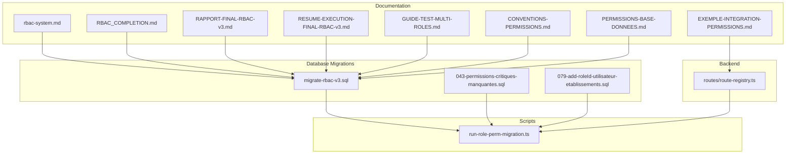
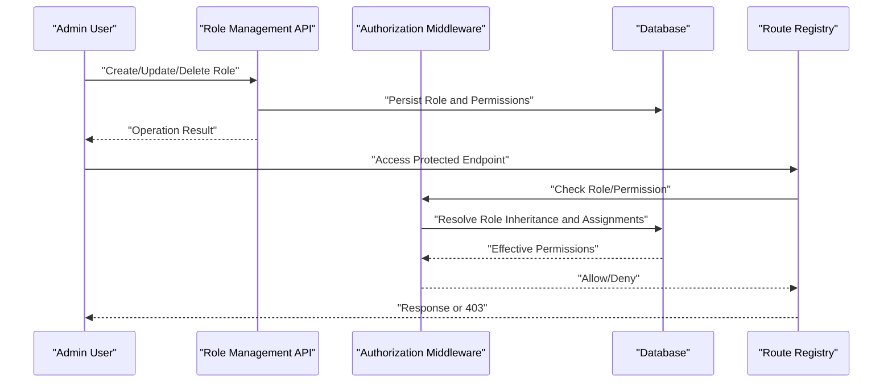
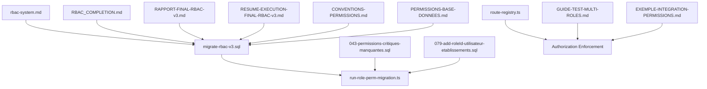

# Roles Management

<cite>
**Referenced Files in This Document**
- [rbac-system.md](file://docs/rbac-system.md)
- [RBAC_COMPLETION.md](file://docs/RBAC_COMPLETION.md)
- [RAPPORT-FINAL-RBAC-v3.md](file://docs/rapports/RAPPORT-FINAL-RBAC-v3.md)
- [RESUME-EXECUTION-FINAL-RBAC-v3.md](file://docs/resumes/RESUME-EXECUTION-FINAL-RBAC-v3.md)
- [GUIDE-TEST-MULTI-ROLES.md](file://docs/guides/GUIDE-TEST-MULTI-ROLES.md)
- [CONVENTIONS-PERMISSIONS.md](file://docs/CONVENTIONS-PERMISSIONS.md)
- [PERMISSIONS-BASE-DONNEES.md](file://docs/PERMISSIONS-BASE-DONNEES.md)
- [EXEMPLE-INTEGRATION-PERMISSIONS.md](file://docs/EXEMPLE-INTEGRATION-PERMISSIONS.md)
- [migrate-rbac-v3.sql](file://backend/database/migrations/migrate-rbac-v3.sql)
- [043-permissions-critiques-manquantes.sql](file://backend/database/migrations/043-permissions-critiques-manquantes.sql)
- [079-add-roleId-utilisateur-etablissements.sql](file://backend/database/migrations/079-add-roleId-utilisateur-etablissements.sql)
- [run-role-perm-migration.ts](file://backend/scripts/run-role-perm-migration.ts)
- [route-registry.ts](file://backend/src/routes/route-registry.ts)
</cite>

## Table of Contents
1. [Introduction](#introduction)
2. [Project Structure](#project-structure)
3. [Core Components](#core-components)
4. [Architecture Overview](#architecture-overview)
5. [Detailed Component Analysis](#detailed-component-analysis)
6. [Dependency Analysis](#dependency-analysis)
7. [Performance Considerations](#performance-considerations)
8. [Troubleshooting Guide](#troubleshooting-guide)
9. [Conclusion](#conclusion)
10. [Appendices](#appendices)

## Introduction
This document explains eLISAschool’s role management system with a focus on the Role entity, role creation workflows, role hierarchy and inheritance, permission definitions, role assignment to users, and the full lifecycle (creation, modification, deactivation, deletion). It also provides practical examples for predefined roles (admin, teacher, student), custom roles, controller-level access control using decorators, validation rules, conflict resolution strategies, bulk operations, and best practices for designing effective hierarchies and naming conventions.

## Project Structure
The role management system spans documentation, database migrations, scripts, and backend routing:
- Documentation: conceptual design, completion reports, conventions, and integration examples
- Database: RBAC schema migrations and critical permissions seeds
- Scripts: migration execution utilities
- Backend routes: registration points where authorization is enforced

**Diagram sources**
- [rbac-system.md](file://docs/rbac-system.md)
- [RBAC_COMPLETION.md](file://docs/RBAC_COMPLETION.md)
- [RAPPORT-FINAL-RBAC-v3.md](file://docs/rapports/RAPPORT-FINAL-RBAC-v3.md)
- [RESUME-EXECUTION-FINAL-RBAC-v3.md](file://docs/resumes/RESUME-EXECUTION-FINAL-RBAC-v3.md)
- [GUIDE-TEST-MULTI-ROLES.md](file://docs/guides/GUIDE-TEST-MULTI-ROLES.md)
- [CONVENTIONS-PERMISSIONS.md](file://docs/CONVENTIONS-PERMISSIONS.md)
- [PERMISSIONS-BASE-DONNEES.md](file://docs/PERMISSIONS-BASE-DONNEES.md)
- [EXEMPLE-INTEGRATION-PERMISSIONS.md](file://docs/EXEMPLE-INTEGRATION-PERMISSIONS.md)
- [migrate-rbac-v3.sql](file://backend/database/migrations/migrate-rbac-v3.sql)
- [043-permissions-critiques-manquantes.sql](file://backend/database/migrations/043-permissions-critiques-manquantes.sql)
- [079-add-roleId-utilisateur-etablissements.sql](file://backend/database/migrations/079-add-roleId-utilisateur-etablissements.sql)
- [run-role-perm-migration.ts](file://backend/scripts/run-role-perm-migration.ts)
- [route-registry.ts](file://backend/src/routes/route-registry.ts)

**Section sources**
- [rbac-system.md](file://docs/rbac-system.md)
- [RBAC_COMPLETION.md](file://docs/RBAC_COMPLETION.md)
- [RAPPORT-FINAL-RBAC-v3.md](file://docs/rapports/RAPPORT-FINAL-RBAC-v3.md)
- [RESUME-EXECUTION-FINAL-RBAC-v3.md](file://docs/resumes/RESUME-EXECUTION-FINAL-RBAC-v3.md)
- [GUIDE-TEST-MULTI-ROLES.md](file://docs/guides/GUIDE-TEST-MULTI-ROLES.md)
- [CONVENTIONS-PERMISSIONS.md](file://docs/CONVENTIONS-PERMISSIONS.md)
- [PERMISSIONS-BASE-DONNEES.md](file://docs/PERMISSIONS-BASE-DONNEES.md)
- [EXEMPLE-INTEGRATION-PERMISSIONS.md](file://docs/EXEMPLE-INTEGRATION-PERMISSIONS.md)
- [migrate-rbac-v3.sql](file://backend/database/migrations/migrate-rbac-v3.sql)
- [043-permissions-critiques-manquantes.sql](file://backend/database/migrations/043-permissions-critiques-manquantes.sql)
- [079-add-roleId-utilisateur-etablissements.sql](file://backend/database/migrations/079-add-roleId-utilisateur-etablissements.sql)
- [run-role-perm-migration.ts](file://backend/scripts/run-role-perm-migration.ts)
- [route-registry.ts](file://backend/src/routes/route-registry.ts)

## Core Components
- Role Entity: Represents a named set of permissions that can be assigned to users within an establishment context. Roles may support hierarchical relationships to enable inheritance.
- Permission Set: Granular capabilities (e.g., read/write/delete) scoped by module or resource. Permissions are defined centrally and referenced by roles.
- Role Hierarchy: A parent-child relationship model enabling transitive permission inheritance from base roles to specialized roles.
- Role Assignment: Links a user to one or more roles within a specific establishment scope.
- Lifecycle States: Active, deactivated, and deleted (soft delete) states govern visibility and enforcement behavior.

Key responsibilities:
- Define canonical permission sets and their scoping rules
- Provide APIs to create, update, deactivate, and delete roles
- Enforce role-based access at controller boundaries via decorators
- Support bulk operations for efficient administration

**Section sources**
- [rbac-system.md](file://docs/rbac-system.md)
- [RBAC_COMPLETION.md](file://docs/RBAC_COMPLETION.md)
- [RAPPORT-FINAL-RBAC-v3.md](file://docs/rapports/RAPPORT-FINAL-RBAC-v3.md)
- [RESUME-EXECUTION-FINAL-RBAC-v3.md](file://docs/resumes/RESUME-EXECUTION-FINAL-RBAC-v3.md)
- [PERMISSIONS-BASE-DONNEES.md](file://docs/PERMISSIONS-BASE-DONNEES.md)

## Architecture Overview
The role management architecture integrates database-backed entities, migration-driven schema evolution, and runtime authorization checks.

**Diagram sources**
- [migrate-rbac-v3.sql](file://backend/database/migrations/migrate-rbac-v3.sql)
- [043-permissions-critiques-manquantes.sql](file://backend/database/migrations/043-permissions-critiques-manquantes.sql)
- [079-add-roleId-utilisateur-etablissements.sql](file://backend/database/migrations/079-add-roleId-utilisateur-etablissements.sql)
- [route-registry.ts](file://backend/src/routes/route-registry.ts)

## Detailed Component Analysis

### Role Entity and Data Model
- Role: Unique identifier, name, description, status (active/deactivated/deleted), and optional parent role reference for hierarchy.
- Permission: Canonical capability identifiers with module/resource/action scoping.
- Role_Permission: Mapping table linking roles to permissions.
- User_Role_Assignment: Joins users to roles within an establishment context.
- Role_Hierarchy: Parent-child edges enabling transitive inheritance.

Design considerations:
- Soft deletes for roles to preserve audit trails
- Establishment-scoped assignments to enforce multi-tenant isolation
- Indexing on frequently queried columns (role_id, user_id, establishment_id)

**Section sources**
- [migrate-rbac-v3.sql](file://backend/database/migrations/migrate-rbac-v3.sql)
- [079-add-roleId-utilisateur-etablissements.sql](file://backend/database/migrations/079-add-roleId-utilisateur-etablissements.sql)
- [PERMISSIONS-BASE-DONNEES.md](file://docs/PERMISSIONS-BASE-DONNEES.md)

### Role Creation Workflows
- Predefined roles: admin, teacher, student are seeded during initialization.
- Custom roles: Created by selecting a subset of canonical permissions; optionally inheriting from a base role.
- Validation: Ensure unique role names per establishment, valid permission identifiers, and no circular hierarchy references.

Operational steps:
1. Validate input payload (name uniqueness, permission IDs existence)
2. Create role record with initial status active
3. Attach permissions and/or set parent role
4. Persist and return created role metadata

**Section sources**
- [RBAC_COMPLETION.md](file://docs/RBAC_COMPLETION.md)
- [RAPPORT-FINAL-RBAC-v3.md](file://docs/rapports/RAPPORT-FINAL-RBAC-v3.md)
- [migrate-rbac-v3.sql](file://backend/database/migrations/migrate-rbac-v3.sql)

### Role Hierarchy and Inheritance
- Parent-child relationships allow derived roles to inherit all permissions from ancestors.
- Transitive closure computation ensures effective permissions include inherited ones.
- Cycle detection prevents invalid hierarchies.

Best practices:
- Keep hierarchy depth shallow to simplify audits
- Prefer composition over deep nesting when possible
- Use clear naming to indicate specialization (e.g., “Teacher_Math”, “Teacher_Science”)

**Section sources**
- [rbac-system.md](file://docs/rbac-system.md)
- [RBAC_COMPLETION.md](file://docs/RBAC_COMPLETION.md)
- [migrate-rbac-v3.sql](file://backend/database/migrations/migrate-rbac-v3.sql)

### Role Assignment to Users
- Assign one or more roles to a user within a specific establishment.
- Effective permissions are computed by unioning permissions across assigned roles and their ancestors.
- Multi-tenant isolation ensures assignments only apply within the intended establishment.

Assignment workflow:
1. Verify user exists and belongs to the target establishment
2. Validate role existence and active status
3. Insert assignment record
4. Recompute cached effective permissions if applicable

**Section sources**
- [079-add-roleId-utilisateur-etablissements.sql](file://backend/database/migrations/079-add-roleId-utilisateur-etablissements.sql)
- [PERMISSIONS-BASE-DONNEES.md](file://docs/PERMISSIONS-BASE-DONNEES.md)

### Role Lifecycle Management
- Creation: New roles start active; require permission set and optional parent.
- Modification: Update name/description, adjust permissions, change parent role.
- Deactivation: Mark inactive to revoke access without losing history.
- Deletion: Soft delete to maintain referential integrity and auditability.

Validation rules:
- Prevent deleting roles still assigned to active users unless explicitly overridden
- Disallow deactivating foundational roles used by system processes
- Enforce unique names per establishment

**Section sources**
- [RBAC_COMPLETION.md](file://docs/RBAC_COMPLETION.md)
- [RAPPORT-FINAL-RBAC-v3.md](file://docs/rapports/RAPPORT-FINAL-RBAC-v3.md)

### Practical Examples

#### Creating Predefined Roles
- Admin: Full system access; typically includes all canonical permissions.
- Teacher: Access to teaching resources, grading, and class management.
- Student: Read-only access to personal records and course materials.

Implementation guidance:
- Seed predefined roles during setup
- Map each role to its canonical permission set
- Optionally assign default parent roles to establish baseline inheritance

**Section sources**
- [RBAC_COMPLETION.md](file://docs/RBAC_COMPLETION.md)
- [RAPPORT-FINAL-RBAC-v3.md](file://docs/rapports/RAPPORT-FINAL-RBAC-v3.md)

#### Implementing Custom Roles with Specific Permission Sets
- Identify required capabilities and map them to canonical permissions
- Choose a base role to inherit from to minimize duplication
- Validate against existing permissions and hierarchy constraints

**Section sources**
- [CONVENTIONS-PERMISSIONS.md](file://docs/CONVENTIONS-PERMISSIONS.md)
- [PERMISSIONS-BASE-DONNEES.md](file://docs/PERMISSIONS-BASE-DONNEES.md)

#### Managing Role-Based Access in Controllers Using Decorators
- Apply authorization decorators to endpoints requiring specific roles or permissions
- Middleware resolves effective permissions and enforces access decisions
- Route registry centralizes endpoint definitions and decorator usage

Example pattern:
- Protect sensitive endpoints with role decorators
- Return standardized 403 responses when access is denied
- Log authorization failures for auditing

**Section sources**
- [EXEMPLE-INTEGRATION-PERMISSIONS.md](file://docs/EXEMPLE-INTEGRATION-PERMISSIONS.md)
- [route-registry.ts](file://backend/src/routes/route-registry.ts)

### Role Validation Rules
- Name uniqueness per establishment
- Valid permission identifiers must exist in the canonical set
- No circular references in role hierarchy
- Required fields present (name, status)
- Establishment scoping enforced for assignments

Conflict resolution:
- If multiple roles grant conflicting permissions, compute union of permissions
- Explicit deny overrides not implemented; rely on least-privilege design
- Resolve ambiguous cases by narrowing role scopes and clarifying naming

**Section sources**
- [RBAC_COMPLETION.md](file://docs/RBAC_COMPLETION.md)
- [RAPPORT-FINAL-RBAC-v3.md](file://docs/rapports/RAPPORT-FINAL-RBAC-v3.md)

### Bulk Role Operations
- Bulk create roles from templates or CSV imports
- Bulk assign roles to users within an establishment
- Bulk update permissions for multiple roles simultaneously

Operational safeguards:
- Transactional execution to ensure consistency
- Rollback on partial failures
- Audit logging for all bulk changes

**Section sources**
- [RAPPORT-FINAL-RBAC-v3.md](file://docs/rapports/RAPPORT-FINAL-RBAC-v3.md)
- [RESUME-EXECUTION-FINAL-RBAC-v3.md](file://docs/resumes/RESUME-EXECUTION-FINAL-RBAC-v3.md)

### Designing Effective Role Hierarchies
- Start with broad base roles (e.g., Admin, Teacher, Student)
- Derive specialized roles from base roles rather than duplicating permissions
- Limit hierarchy depth to improve clarity and performance
- Use descriptive names indicating specialization and scope

Naming conventions:
- Use consistent prefixes for modules (e.g., “Finance_”, “HR_”)
- Indicate specialization with suffixes (e.g., “_Manager”, “_Auditor”)
- Avoid abbreviations that reduce readability

**Section sources**
- [CONVENTIONS-PERMISSIONS.md](file://docs/CONVENTIONS-PERMISSIONS.md)
- [rbac-system.md](file://docs/rbac-system.md)

## Dependency Analysis
The role system depends on database schema migrations, script utilities, and route-level authorization.

**Diagram sources**
- [migrate-rbac-v3.sql](file://backend/database/migrations/migrate-rbac-v3.sql)
- [043-permissions-critiques-manquantes.sql](file://backend/database/migrations/043-permissions-critiques-manquantes.sql)
- [079-add-roleId-utilisateur-etablissements.sql](file://backend/database/migrations/079-add-roleId-utilisateur-etablissements.sql)
- [run-role-perm-migration.ts](file://backend/scripts/run-role-perm-migration.ts)
- [route-registry.ts](file://backend/src/routes/route-registry.ts)
- [rbac-system.md](file://docs/rbac-system.md)
- [RBAC_COMPLETION.md](file://docs/RBAC_COMPLETION.md)
- [RAPPORT-FINAL-RBAC-v3.md](file://docs/rapports/RAPPORT-FINAL-RBAC-v3.md)
- [RESUME-EXECUTION-FINAL-RBAC-v3.md](file://docs/resumes/RESUME-EXECUTION-FINAL-RBAC-v3.md)
- [GUIDE-TEST-MULTI-ROLES.md](file://docs/guides/GUIDE-TEST-MULTI-ROLES.md)
- [CONVENTIONS-PERMISSIONS.md](file://docs/CONVENTIONS-PERMISSIONS.md)
- [PERMISSIONS-BASE-DONNEES.md](file://docs/PERMISSIONS-BASE-DONNEES.md)
- [EXEMPLE-INTEGRATION-PERMISSIONS.md](file://docs/EXEMPLE-INTEGRATION-PERMISSIONS.md)

**Section sources**
- [migrate-rbac-v3.sql](file://backend/database/migrations/migrate-rbac-v3.sql)
- [043-permissions-critiques-manquantes.sql](file://backend/database/migrations/043-permissions-critiques-manquantes.sql)
- [079-add-roleId-utilisateur-etablissements.sql](file://backend/database/migrations/079-add-roleId-utilisateur-etablissements.sql)
- [run-role-perm-migration.ts](file://backend/scripts/run-role-perm-migration.ts)
- [route-registry.ts](file://backend/src/routes/route-registry.ts)
- [rbac-system.md](file://docs/rbac-system.md)
- [RBAC_COMPLETION.md](file://docs/RBAC_COMPLETION.md)
- [RAPPORT-FINAL-RBAC-v3.md](file://docs/rapports/RAPPORT-FINAL-RBAC-v3.md)
- [RESUME-EXECUTION-FINAL-RBAC-v3.md](file://docs/resumes/RESUME-EXECUTION-FINAL-RBAC-v3.md)
- [GUIDE-TEST-MULTI-ROLES.md](file://docs/guides/GUIDE-TEST-MULTI-ROLES.md)
- [CONVENTIONS-PERMISSIONS.md](file://docs/CONVENTIONS-PERMISSIONS.md)
- [PERMISSIONS-BASE-DONNEES.md](file://docs/PERMISSIONS-BASE-DONNEES.md)
- [EXEMPLE-INTEGRATION-PERMISSIONS.md](file://docs/EXEMPLE-INTEGRATION-PERMISSIONS.md)

## Performance Considerations
- Cache effective permissions per user-establishment pair to reduce repeated computations
- Optimize queries for role inheritance traversal using indexed foreign keys
- Batch permission updates to minimize transaction overhead
- Monitor query plans for complex joins involving hierarchy tables

[No sources needed since this section provides general guidance]

## Troubleshooting Guide
Common issues and resolutions:
- Circular hierarchy detected: Validate parent-child relationships before saving
- Permission not found: Ensure canonical permission set includes the requested ID
- Access denied despite role assignment: Confirm establishment scoping and role activation status
- Bulk operation failure: Inspect transaction logs and rollback state

Diagnostic steps:
- Run migration verification scripts to confirm schema integrity
- Check route registry for missing or misapplied decorators
- Review audit logs for authorization denials

**Section sources**
- [RAPPORT-FINAL-RBAC-v3.md](file://docs/rapports/RAPPORT-FINAL-RBAC-v3.md)
- [RESUME-EXECUTION-FINAL-RBAC-v3.md](file://docs/resumes/RESUME-EXECUTION-FINAL-RBAC-v3.md)
- [route-registry.ts](file://backend/src/routes/route-registry.ts)

## Conclusion
eLISAschool’s role management system provides a robust foundation for fine-grained, establishment-scoped access control. By leveraging canonical permissions, hierarchical inheritance, and decorator-based enforcement, administrators can define flexible roles while maintaining security and auditability. Adhering to naming conventions, validation rules, and performance best practices ensures scalability and clarity across evolving organizational needs.

[No sources needed since this section summarizes without analyzing specific files]

## Appendices

### Migration Execution Reference
- Use the provided script to execute RBAC-related migrations safely and idempotently.

**Section sources**
- [run-role-perm-migration.ts](file://backend/scripts/run-role-perm-migration.ts)
- [migrate-rbac-v3.sql](file://backend/database/migrations/migrate-rbac-v3.sql)

### Testing Multi-Role Scenarios
- Follow the guide to validate multi-role assignments and effective permission resolution.

**Section sources**
- [GUIDE-TEST-MULTI-ROLES.md](file://docs/guides/GUIDE-TEST-MULTI-ROLES.md)