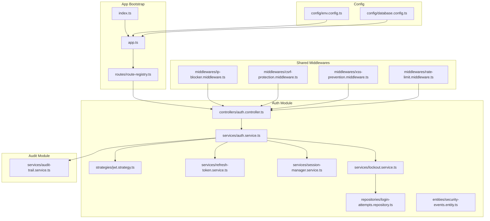
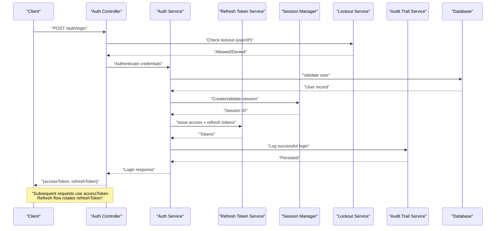
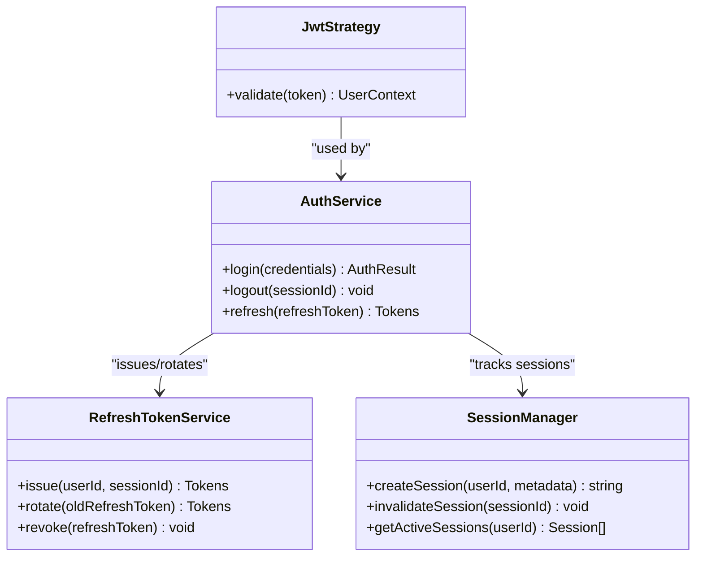
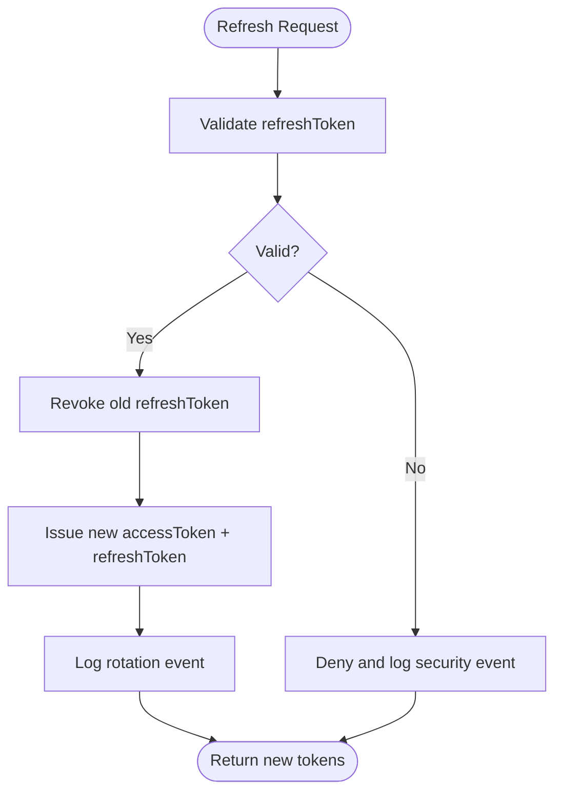
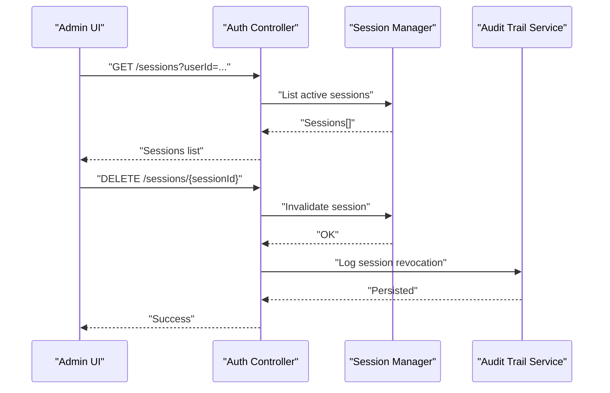
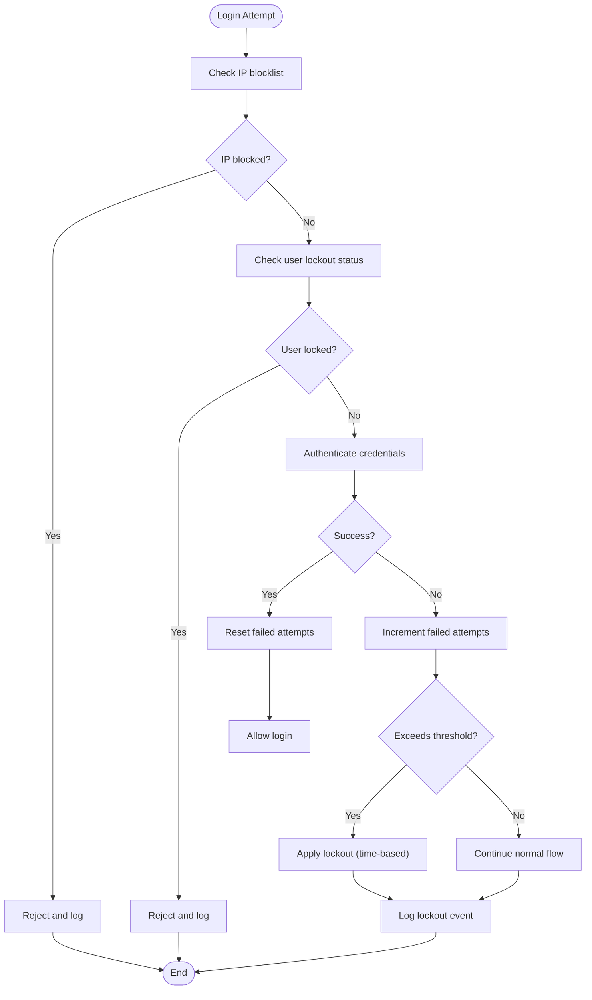
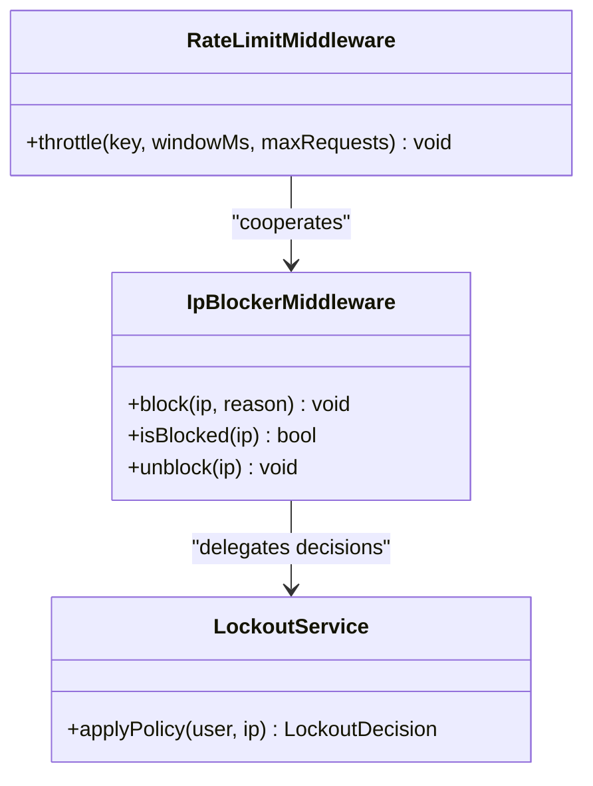
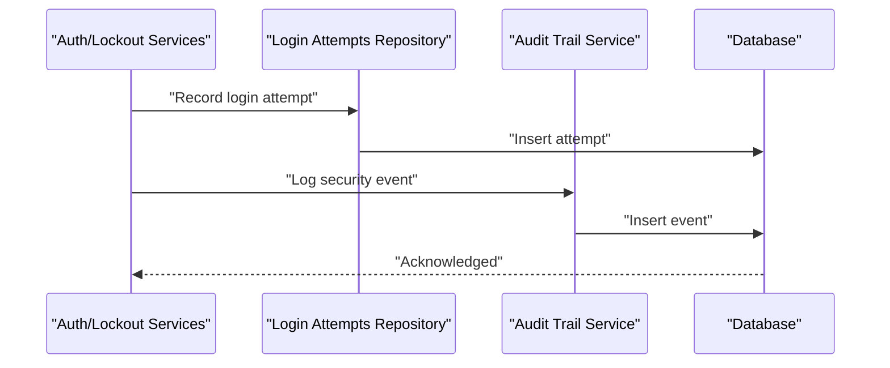
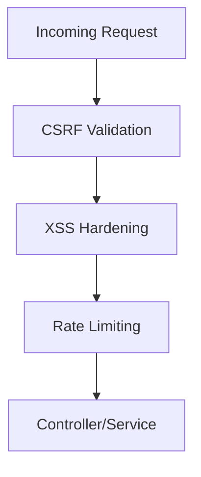
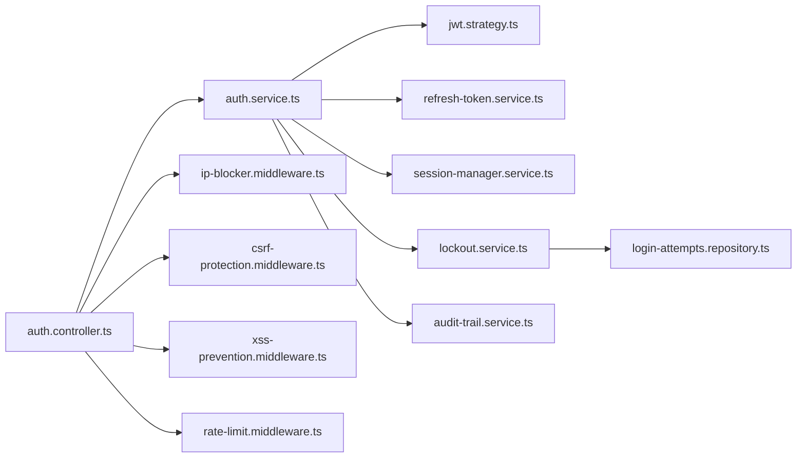

# Session Management & Security

<cite>
**Referenced Files in This Document**
- [app.ts](file://backend/src/app.ts)
- [index.ts](file://backend/src/index.ts)
- [route-registry.ts](file://backend/src/routes/route-registry.ts)
- [env.config.ts](file://backend/src/config/env.config.ts)
- [database.config.ts](file://backend/src/config/database.config.ts)
- [auth.controller.ts](file://backend/src/modules/auth/controllers/auth.controller.ts)
- [auth.service.ts](file://backend/src/modules/auth/services/auth.service.ts)
- [jwt.strategy.ts](file://backend/src/modules/auth/strategies/jwt.strategy.ts)
- [refresh-token.service.ts](file://backend/src/modules/auth/services/refresh-token.service.ts)
- [session-manager.service.ts](file://backend/src/modules/auth/services/session-manager.service.ts)
- [lockout.service.ts](file://backend/src/modules/auth/services/lockout.service.ts)
- [ip-blocker.middleware.ts](file://backend/src/common/middlewares/ip-blocker.middleware.ts)
- [audit-trail.service.ts](file://backend/src/modules/audit/services/audit-trail.service.ts)
- [login-attempts.repository.ts](file://backend/src/modules/auth/repositories/login-attempts.repository.ts)
- [security-events.entity.ts](file://backend/src/modules/auth/entities/security-events.entity.ts)
- [csrf-protection.middleware.ts](file://backend/src/common/middlewares/csrf-protection.middleware.ts)
- [xss-prevention.middleware.ts](file://backend/src/common/middlewares/xss-prevention.middleware.ts)
- [rate-limit.middleware.ts](file://backend/src/common/middlewares/rate-limit.middleware.ts)
- [027-auth-multi-mode.sql](file://backend/database/migrations/027-auth-multi-mode.sql)
- [IMPLEMENTATION-SESSION-RESUME-FINAL.md](file://docs/implementations/IMPLEMENTATION-SESSION-RESUME-FINAL.md)
- [SYSTEME-BLOCAGE-AUTH-DEUX-NIVEAUX.md](file://docs/SYSTEME-BLOCAGE-AUTH-DEUX-NIVEAUX.md)
- [GUIDE-TEST-SECURITE.md](file://docs/guides/GUIDE-TEST-SECURITE.md)
</cite>

## Table of Contents
1. [Introduction](#introduction)
2. [Project Structure](#project-structure)
3. [Core Components](#core-components)
4. [Architecture Overview](#architecture-overview)
5. [Detailed Component Analysis](#detailed-component-analysis)
6. [Dependency Analysis](#dependency-analysis)
7. [Performance Considerations](#performance-considerations)
8. [Troubleshooting Guide](#troubleshooting-guide)
9. [Conclusion](#conclusion)
10. [Appendices](#appendices)

## Introduction
This document explains eLISAschool’s session management and security features with a focus on:
- JWT-based sessions, refresh token rotation, and concurrent session control
- Account lockout mechanism with configurable thresholds, IP-based blocking, and progressive security measures
- Audit trail integration for security events, login attempt tracking, and suspicious activity detection
- Practical configuration examples, custom lockout rules, and monitoring metrics
- Session cleanup procedures, token expiration handling, and production best practices
- Web security considerations including CSRF protection and XSS prevention

The goal is to provide both high-level understanding and actionable guidance for developers and operators deploying secure, resilient authentication flows.

## Project Structure
Security-related functionality is implemented across dedicated modules and shared middleware:
- Authentication module (controllers, services, strategies, repositories, entities)
- Shared middlewares (IP blocker, CSRF, XSS, rate limiting)
- Configuration (environment variables, database settings)
- Route registry (applies guards and middlewares)
- Audit module (security event logging)
- Database migrations (schema changes for auth modes and related tables)

**Diagram sources**
- [app.ts](file://backend/src/app.ts)
- [index.ts](file://backend/src/index.ts)
- [route-registry.ts](file://backend/src/routes/route-registry.ts)
- [auth.controller.ts](file://backend/src/modules/auth/controllers/auth.controller.ts)
- [auth.service.ts](file://backend/src/modules/auth/services/auth.service.ts)
- [jwt.strategy.ts](file://backend/src/modules/auth/strategies/jwt.strategy.ts)
- [refresh-token.service.ts](file://backend/src/modules/auth/services/refresh-token.service.ts)
- [session-manager.service.ts](file://backend/src/modules/auth/services/session-manager.service.ts)
- [lockout.service.ts](file://backend/src/modules/auth/services/lockout.service.ts)
- [ip-blocker.middleware.ts](file://backend/src/common/middlewares/ip-blocker.middleware.ts)
- [csrf-protection.middleware.ts](file://backend/src/common/middlewares/csrf-protection.middleware.ts)
- [xss-prevention.middleware.ts](file://backend/src/common/middlewares/xss-prevention.middleware.ts)
- [rate-limit.middleware.ts](file://backend/src/common/middlewares/rate-limit.middleware.ts)
- [audit-trail.service.ts](file://backend/src/modules/audit/services/audit-trail.service.ts)
- [env.config.ts](file://backend/src/config/env.config.ts)
- [database.config.ts](file://backend/src/config/database.config.ts)

**Section sources**
- [app.ts](file://backend/src/app.ts)
- [index.ts](file://backend/src/index.ts)
- [route-registry.ts](file://backend/src/routes/route-registry.ts)
- [env.config.ts](file://backend/src/config/env.config.ts)
- [database.config.ts](file://backend/src/config/database.config.ts)

## Core Components
- JWT Strategy: Validates access tokens, extracts claims, and enforces session context.
- Auth Service: Orchestrates login, logout, token issuance, refresh token rotation, and lockout checks.
- Refresh Token Service: Manages rotation, revocation, and storage of refresh tokens.
- Session Manager: Tracks active sessions per user, enforces concurrency limits, and handles cleanup.
- Lockout Service: Applies progressive lockouts based on failed attempts, integrates with IP blocking.
- IP Blocker Middleware: Blocks requests from IPs exceeding thresholds or flagged by policy.
- CSRF Protection Middleware: Enforces CSRF tokens for state-changing operations.
- XSS Prevention Middleware: Sanitizes inputs and sets safe headers.
- Rate Limit Middleware: Throttles endpoints to mitigate brute-force attacks.
- Audit Trail Service: Persists security events for compliance and analysis.
- Login Attempts Repository: Stores and queries login attempt history.
- Security Events Entity: Defines schema for audit records.

Key responsibilities and interactions are detailed in the architecture and component sections below.

**Section sources**
- [jwt.strategy.ts](file://backend/src/modules/auth/strategies/jwt.strategy.ts)
- [auth.service.ts](file://backend/src/modules/auth/services/auth.service.ts)
- [refresh-token.service.ts](file://backend/src/modules/auth/services/refresh-token.service.ts)
- [session-manager.service.ts](file://backend/src/modules/auth/services/session-manager.service.ts)
- [lockout.service.ts](file://backend/src/modules/auth/services/lockout.service.ts)
- [ip-blocker.middleware.ts](file://backend/src/common/middlewares/ip-blocker.middleware.ts)
- [csrf-protection.middleware.ts](file://backend/src/common/middlewares/csrf-protection.middleware.ts)
- [xss-prevention.middleware.ts](file://backend/src/common/middlewares/xss-prevention.middleware.ts)
- [rate-limit.middleware.ts](file://backend/src/common/middlewares/rate-limit.middleware.ts)
- [audit-trail.service.ts](file://backend/src/modules/audit/services/audit-trail.service.ts)
- [login-attempts.repository.ts](file://backend/src/modules/auth/repositories/login-attempts.repository.ts)
- [security-events.entity.ts](file://backend/src/modules/auth/entities/security-events.entity.ts)

## Architecture Overview
The authentication flow combines JWT access tokens with rotating refresh tokens, enforced by session controls and progressive lockout policies. Requests traverse shared middlewares for IP blocking, CSRF validation, XSS hardening, and rate limiting before reaching controllers and services.

**Diagram sources**
- [auth.controller.ts](file://backend/src/modules/auth/controllers/auth.controller.ts)
- [auth.service.ts](file://backend/src/modules/auth/services/auth.service.ts)
- [refresh-token.service.ts](file://backend/src/modules/auth/services/refresh-token.service.ts)
- [session-manager.service.ts](file://backend/src/modules/auth/services/session-manager.service.ts)
- [lockout.service.ts](file://backend/src/modules/auth/services/lockout.service.ts)
- [audit-trail.service.ts](file://backend/src/modules/audit/services/audit-trail.service.ts)

## Detailed Component Analysis

### JWT Session Handling
- Access tokens carry minimal claims and short lifetimes; refresh tokens rotate on each use.
- The strategy validates tokens and attaches user context to the request.
- Session IDs are bound to tokens to support concurrent session control and revocation.

**Diagram sources**
- [jwt.strategy.ts](file://backend/src/modules/auth/strategies/jwt.strategy.ts)
- [auth.service.ts](file://backend/src/modules/auth/services/auth.service.ts)
- [refresh-token.service.ts](file://backend/src/modules/auth/services/refresh-token.service.ts)
- [session-manager.service.ts](file://backend/src/modules/auth/services/session-manager.service.ts)

**Section sources**
- [jwt.strategy.ts](file://backend/src/modules/auth/strategies/jwt.strategy.ts)
- [auth.service.ts](file://backend/src/modules/auth/services/auth.service.ts)
- [refresh-token.service.ts](file://backend/src/modules/auth/services/refresh-token.service.ts)
- [session-manager.service.ts](file://backend/src/modules/auth/services/session-manager.service.ts)

### Refresh Token Rotation
- On each refresh, the old refresh token is revoked and a new one issued.
- Rotation ensures that compromised tokens cannot be reused indefinitely.
- Rotation failures trigger forced logout and require re-authentication.

**Diagram sources**
- [refresh-token.service.ts](file://backend/src/modules/auth/services/refresh-token.service.ts)
- [audit-trail.service.ts](file://backend/src/modules/audit/services/audit-trail.service.ts)

**Section sources**
- [refresh-token.service.ts](file://backend/src/modules/auth/services/refresh-token.service.ts)
- [audit-trail.service.ts](file://backend/src/modules/audit/services/audit-trail.service.ts)

### Concurrent Session Management
- Each authenticated client receives a unique session identifier.
- Policies can limit the number of concurrent sessions per user.
- Administrators can revoke specific sessions or force logout all sessions.

**Diagram sources**
- [auth.controller.ts](file://backend/src/modules/auth/controllers/auth.controller.ts)
- [session-manager.service.ts](file://backend/src/modules/auth/services/session-manager.service.ts)
- [audit-trail.service.ts](file://backend/src/modules/audit/services/audit-trail.service.ts)

**Section sources**
- [auth.controller.ts](file://backend/src/modules/auth/controllers/auth.controller.ts)
- [session-manager.service.ts](file://backend/src/modules/auth/services/session-manager.service.ts)
- [audit-trail.service.ts](file://backend/src/modules/audit/services/audit-trail.service.ts)

### Account Lockout Mechanism
- Progressive lockout thresholds based on failed login attempts.
- Lockout applies per user and optionally per IP to mitigate distributed attacks.
- Integrates with audit trail and login attempts repository for visibility.

**Diagram sources**
- [lockout.service.ts](file://backend/src/modules/auth/services/lockout.service.ts)
- [ip-blocker.middleware.ts](file://backend/src/common/middlewares/ip-blocker.middleware.ts)
- [login-attempts.repository.ts](file://backend/src/modules/auth/repositories/login-attempts.repository.ts)
- [audit-trail.service.ts](file://backend/src/modules/audit/services/audit-trail.service.ts)

**Section sources**
- [lockout.service.ts](file://backend/src/modules/auth/services/lockout.service.ts)
- [ip-blocker.middleware.ts](file://backend/src/common/middlewares/ip-blocker.middleware.ts)
- [login-attempts.repository.ts](file://backend/src/modules/auth/repositories/login-attempts.repository.ts)
- [audit-trail.service.ts](file://backend/src/modules/audit/services/audit-trail.service.ts)

### IP-Based Blocking and Progressive Security
- IP addresses can be temporarily or permanently blocked based on policy.
- Progressive measures include escalating delays and stricter thresholds under attack conditions.
- Integration with rate limiting provides defense-in-depth against brute-force and credential stuffing.

**Diagram sources**
- [ip-blocker.middleware.ts](file://backend/src/common/middlewares/ip-blocker.middleware.ts)
- [rate-limit.middleware.ts](file://backend/src/common/middlewares/rate-limit.middleware.ts)
- [lockout.service.ts](file://backend/src/modules/auth/services/lockout.service.ts)

**Section sources**
- [ip-blocker.middleware.ts](file://backend/src/common/middlewares/ip-blocker.middleware.ts)
- [rate-limit.middleware.ts](file://backend/src/common/middlewares/rate-limit.middleware.ts)
- [lockout.service.ts](file://backend/src/modules/auth/services/lockout.service.ts)

### Audit Trail Integration
- All security-relevant events are logged: login success/failure, lockouts, token rotations, session revocations, IP blocks.
- Logs are queryable for compliance and incident response.
- Suspicious activity detection leverages aggregated counts and thresholds.

**Diagram sources**
- [login-attempts.repository.ts](file://backend/src/modules/auth/repositories/login-attempts.repository.ts)
- [audit-trail.service.ts](file://backend/src/modules/audit/services/audit-trail.service.ts)
- [security-events.entity.ts](file://backend/src/modules/auth/entities/security-events.entity.ts)

**Section sources**
- [login-attempts.repository.ts](file://backend/src/modules/auth/repositories/login-attempts.repository.ts)
- [audit-trail.service.ts](file://backend/src/modules/audit/services/audit-trail.service.ts)
- [security-events.entity.ts](file://backend/src/modules/auth/entities/security-events.entity.ts)

### Web Security Considerations
- CSRF Protection: Enforce origin checks and CSRF tokens for state-changing endpoints.
- XSS Prevention: Sanitize inputs, set Content-Security-Policy, and enforce safe headers.
- Rate Limiting: Protect sensitive endpoints from abuse.
- Secure Headers: Implement HSTS, X-Frame-Options, and other hardening headers via middleware.

**Diagram sources**
- [csrf-protection.middleware.ts](file://backend/src/common/middlewares/csrf-protection.middleware.ts)
- [xss-prevention.middleware.ts](file://backend/src/common/middlewares/xss-prevention.middleware.ts)
- [rate-limit.middleware.ts](file://backend/src/common/middlewares/rate-limit.middleware.ts)

**Section sources**
- [csrf-protection.middleware.ts](file://backend/src/common/middlewares/csrf-protection.middleware.ts)
- [xss-prevention.middleware.ts](file://backend/src/common/middlewares/xss-prevention.middleware.ts)
- [rate-limit.middleware.ts](file://backend/src/common/middlewares/rate-limit.middleware.ts)

## Dependency Analysis
The following diagram shows key dependencies among core components:

**Diagram sources**
- [auth.controller.ts](file://backend/src/modules/auth/controllers/auth.controller.ts)
- [auth.service.ts](file://backend/src/modules/auth/services/auth.service.ts)
- [jwt.strategy.ts](file://backend/src/modules/auth/strategies/jwt.strategy.ts)
- [refresh-token.service.ts](file://backend/src/modules/auth/services/refresh-token.service.ts)
- [session-manager.service.ts](file://backend/src/modules/auth/services/session-manager.service.ts)
- [lockout.service.ts](file://backend/src/modules/auth/services/lockout.service.ts)
- [login-attempts.repository.ts](file://backend/src/modules/auth/repositories/login-attempts.repository.ts)
- [audit-trail.service.ts](file://backend/src/modules/audit/services/audit-trail.service.ts)
- [ip-blocker.middleware.ts](file://backend/src/common/middlewares/ip-blocker.middleware.ts)
- [csrf-protection.middleware.ts](file://backend/src/common/middlewares/csrf-protection.middleware.ts)
- [xss-prevention.middleware.ts](file://backend/src/common/middlewares/xss-prevention.middleware.ts)
- [rate-limit.middleware.ts](file://backend/src/common/middlewares/rate-limit.middleware.ts)

**Section sources**
- [auth.controller.ts](file://backend/src/modules/auth/controllers/auth.controller.ts)
- [auth.service.ts](file://backend/src/modules/auth/services/auth.service.ts)
- [jwt.strategy.ts](file://backend/src/modules/auth/strategies/jwt.strategy.ts)
- [refresh-token.service.ts](file://backend/src/modules/auth/services/refresh-token.service.ts)
- [session-manager.service.ts](file://backend/src/modules/auth/services/session-manager.service.ts)
- [lockout.service.ts](file://backend/src/modules/auth/services/lockout.service.ts)
- [login-attempts.repository.ts](file://backend/src/modules/auth/repositories/login-attempts.repository.ts)
- [audit-trail.service.ts](file://backend/src/modules/audit/services/audit-trail.service.ts)
- [ip-blocker.middleware.ts](file://backend/src/common/middlewares/ip-blocker.middleware.ts)
- [csrf-protection.middleware.ts](file://backend/src/common/middlewares/csrf-protection.middleware.ts)
- [xss-prevention.middleware.ts](file://backend/src/common/middlewares/xss-prevention.middleware.ts)
- [rate-limit.middleware.ts](file://backend/src/common/middlewares/rate-limit.middleware.ts)

## Performance Considerations
- Keep access tokens small and short-lived; rely on refresh tokens for long sessions.
- Use efficient indexing on login attempts and security events tables to support fast lookups.
- Cache lockout and IP block states in memory where appropriate, with persistence fallback.
- Batch audit writes when possible to reduce database overhead during high-volume events.
- Tune rate limiting windows and thresholds to balance security and usability.

[No sources needed since this section provides general guidance]

## Troubleshooting Guide
Common issues and resolutions:
- Invalid token errors: Verify JWT secret configuration and token expiry settings.
- Refresh failures: Ensure rotation logic revokes old tokens and persists new ones atomically.
- Unexpected lockouts: Review lockout thresholds and reset counters after successful logins.
- IP false positives: Inspect IP blocklist and adjust policies for trusted networks.
- Audit gaps: Confirm audit service is initialized and writing to the database.

Operational references:
- Security testing guide and implementation summaries provide practical steps for validating behavior.

**Section sources**
- [env.config.ts](file://backend/src/config/env.config.ts)
- [database.config.ts](file://backend/src/config/database.config.ts)
- [IMPLEMENTATION-SESSION-RESUME-FINAL.md](file://docs/implementations/IMPLEMENTATION-SESSION-RESUME-FINAL.md)
- [SYSTEME-BLOCAGE-AUTH-DEUX-NIVEAUX.md](file://docs/SYSTEME-BLOCAGE-AUTH-DEUX-NIVEAUX.md)
- [GUIDE-TEST-SECURITE.md](file://docs/guides/GUIDE-TEST-SECURITE.md)

## Conclusion
eLISAschool implements a robust, layered security model combining JWT sessions, rotating refresh tokens, concurrent session control, progressive lockouts, IP blocking, and comprehensive auditing. By configuring thresholds, enabling CSRF/XSS protections, and monitoring security metrics, teams can deploy a secure, resilient authentication system suitable for production environments.

[No sources needed since this section summarizes without analyzing specific files]

## Appendices

### Configuration Examples
- Environment variables for JWT secrets, token lifetimes, lockout thresholds, and IP block durations.
- Database connection parameters for storing sessions, attempts, and audit logs.

**Section sources**
- [env.config.ts](file://backend/src/config/env.config.ts)
- [database.config.ts](file://backend/src/config/database.config.ts)

### Schema Notes
- Migration introducing multi-mode authentication and related structures.

**Section sources**
- [027-auth-multi-mode.sql](file://backend/database/migrations/027-auth-multi-mode.sql)

### Implementation References
- Session implementation summary and two-level auth blocking system documentation.
- Security testing guide for validating lockout, IP blocking, and audit trails.

**Section sources**
- [IMPLEMENTATION-SESSION-RESUME-FINAL.md](file://docs/implementations/IMPLEMENTATION-SESSION-RESUME-FINAL.md)
- [SYSTEME-BLOCAGE-AUTH-DEUX-NIVEAUX.md](file://docs/SYSTEME-BLOCAGE-AUTH-DEUX-NIVEAUX.md)
- [GUIDE-TEST-SECURITE.md](file://docs/guides/GUIDE-TEST-SECURITE.md)