# User Management System

<cite>
**Referenced Files in This Document**
- [backend/src/modules/utilisateurs/entities/utilisateur.entity.ts](file://backend/src/modules/utilisateurs/entities/utilisateur.entity.ts)
- [backend/src/modules/utilisateurs/dto/create-utilisateur.dto.ts](file://backend/src/modules/utilisateurs/dto/create-utilisateur.dto.ts)
- [backend/src/modules/utilisateurs/dto/update-utilisateur.dto.ts](file://backend/src/modules/utilisateurs/dto/update-utilisateur.dto.ts)
- [backend/src/modules/utilisateurs/controllers/utilisateurs.controller.ts](file://backend/src/modules/utilisateurs/controllers/utilisateurs.controller.ts)
- [backend/src/modules/utilisateurs/services/utilisateurs.service.ts](file://backend/src/modules/utilisateurs/services/utilisateurs.service.ts)
- [backend/src/modules/auth/controllers/auth.controller.ts](file://backend/src/modules/auth/controllers/auth.controller.ts)
- [backend/src/modules/auth/services/auth.service.ts](file://backend/src/modules/auth/services/auth.service.ts)
- [backend/src/modules/auth/guards/jwt-auth.guard.ts](file://backend/src/modules/auth/guards/jwt-auth.guard.ts)
- [backend/src/modules/audit/services/audit.service.ts](file://backend/src/modules/audit/services/audit.service.ts)
- [backend/database/migrations/050-multi-tenant-v3-max-etablissements.sql](file://backend/database/migrations/050-multi-tenant-v3-max-etablissements.sql)
- [backend/database/migrations/079-add-roleId-utilisateur-etablissements.sql](file://backend/database/migrations/079-add-roleId-utilisateur-etablissements.sql)
- [backend/database/migrations/080-preferences-utilisateur-multi-tenant.sql](file://backend/database/migrations/080-preferences-utilisateur-multi-tenant.sql)
- [backend/database/migrations/027-auth-multi-mode.sql](file://backend/database/migrations/027-auth-multi-mode.sql)
- [backend/database/migrations/046-preferences-utilisateur-et-config.sql](file://backend/database/migrations/046-preferences-utilisateur-et-config.sql)
- [backend/database/migrations/046-types-contrat-personnalises.sql](file://backend/database/migrations/046-types-contrat-personnalises.sql)
- [backend/database/migrations/046-dashboard-config.sql](file://backend/database/migrations/046-dashboard-config.sql)
- [backend/database/migrations/046-organisation-performance-avancee.sql](file://backend/database/migrations/046-organisation-performance-avancee.sql)
- [backend/database/migrations/046-preferences-role.sql](file://backend/database/migrations/046-preferences-role.sql)
- [backend/database/migrations/046-preferences-utilisateur-et-config.sql](file://backend/database/migrations/046-preferences-utilisateur-et-config.sql)
- [backend/database/migrations/046-types-contrat-personnalises.sql](file://backend/database/migrations/046-types-contrat-personnalises.sql)
- [backend/database/migrations/046-dashboard-config.sql](file://backend/database/migrations/046-dashboard-config.sql)
- [backend/database/migrations/046-organisation-performance-avancee.sql](file://backend/database/migrations/046-organisation-performance-avancee.sql)
- [backend/database/migrations/046-preferences-role.sql](file://backend/database/migrations/046-preferences-role.sql)
- [backend/database/migrations/046-preferences-utilisateur-et-config.sql](file://backend/database/migrations/046-preferences-utilisateur-et-config.sql)
- [backend/database/migrations/046-types-contrat-personnalises.sql](file://backend/database/migrations/046-types-contrat-personnalises.sql)
- [backend/database/migrations/046-dashboard-config.sql](file://backend/database/migrations/046-dashboard-config.sql)
- [backend/database/migrations/046-organisation-performance-avancee.sql](file://backend/database/migrations/046-organisation-performance-avancee.sql)
- [backend/database/migrations/046-preferences-role.sql](file://backend/database/migrations/046-preferences-role.sql)
- [backend/database/migrations/046-preferences-utilisateur-et-config.sql](file://backend/database/migrations/046-preferences-utilisateur-et-config.sql)
- [backend/database/migrations/046-types-contrat-personnalises.sql](file://backend/database/migrations/046-types-contrat-personnalises.sql)
- [backend/database/migrations/046-dashboard-config.sql](file://backend/database/migrations/046-dashboard-config.sql)
- [backend/database/migrations/046-organisation-performance-avancee.sql](file://backend/database/migrations/046-organisation-performance-avancee.sql)
- [backend/database/migrations/046-preferences-role.sql](file://backend/database/migrations/046-preferences-role.sql)
- [backend/database/migrations/046-preferences-utilisateur-et-config.sql](file://backend/database/migrations/046-preferences-utilisateur-et-config.sql)
- [backend/database/migrations/046-types-contrat-personnalises.sql](file://backend/database/migrations/046-types-contrat-personnalises.sql)
- [backend/database/migrations/046-dashboard-config.sql](file://backend/database/migrations/046-dashboard-config.sql]
- [backend/database/migrations/046-organisation-performance-avancee.sql](file://backend/database/migrations/046-organisation-performance-avancee.sql)
- [backend/database/migrations/046-preferences-role.sql](file://backend/database/migrations/046-preferences-role.sql)
- [backend/database/migrations/046-preferences-utilisateur-et-config.sql](file://backend/database/migrations/046-preferences-utilisateur-et-config.sql)
- [backend/database/migrations/046-types-contrat-personnalises.sql](file://backend/database/migrations/046-types-contrat-personnalises.sql)
- [backend/database/migrations/046-dashboard-config.sql](file://backend/database/migrations/046-dashboard-config.sql)
- [backend/database/migrations/046-organisation-performance-avancee.sql](file://backend/database/migrations/046-organisation-performance-avancee.sql)
- [backend/database/migrations/046-preferences-role.sql](file://backend/database/migrations/046-preferences-role.sql)
- [backend/database/migrations/046-preferences-utilisateur-et-config.sql](file://backend/database/migrations/046-preferences-utilisateur-et-config.sql)
- [backend/database/migrations/046-types-contrat-personnalises.sql](file://backend/database/migrations/046-types-contrat-personnalises.sql)
- [backend/database/migrations/046-dashboard-config.sql](file://backend/database/migrations/046-dashboard-config.sql)
- [backend/database/migrations/046-organisation-performance-avancee.sql](file://backend/database/migrations/046-organisation-performance-avancee.sql)
- [backend/database/migrations/046-preferences-role.sql](file://backend/database/migrations/046-preferences-role.sql)
- [backend/database/migrations/046-preferences-utilisateur-et-config.sql](file://backend/database/migrations/046-preferences-utilisateur-et-config.sql)
- [backend/database/migrations/046-types-contrat-personnalises.sql](file://backend/database/migrations/046-types-contrat-personnalises.sql)
- [backend/database/migrations/046-dashboard-config.sql](file://backend/database/migrations/046-dashboard-config.sql)
- [backend/database/migrations/046-organisation-performance-avancee.sql](file://backend/database/migrations/046-organisation-performance-avancee.sql)
- [backend/database/migrations/046-preferences-role.sql](file://backend/database/migrations/046-preferences-role.sql)
- [backend/database/migrations/046-preferences-utilisateur-et-config.sql](file://backend/database/migrations/046-preferences-utilisateur-et-config.sql)
- [backend/database/migrations/046-types-contrat-personnalises.sql](file://backend/database/migrations/046-types-contrat-personnalises.sql)
- [backend/database/migrations/046-dashboard-config.sql](file://backend/database/migrations/046-dashboard-config.sql)
- [backend/database/migrations/046-organisation-performance-avancee.sql](file://backend/database/migrations/046-organisation-performance-avancee.sql)
- [backend/database/migrations/046-preferences-role.sql](file://backend/database/migrations/046-preferences-role.sql)
- [backend/database/migrations/046-preferences-utilisateur-et-config.sql](file://backend/database/migrations/046-preferences-utilisateur-et-config.sql)
- [backend/database/migrations/046-types-contrat-personnalises.sql](file://backend/database/migrations/046-types-contrat-personnalises.sql)
- [backend/database/migrations/046-dashboard-config.sql](file://backend/database/migrations/046-dashboard-config.sql)
- [backend/database/migrations/046-organisation-performance-avancee.sql](file://backend/database/migrations/046-organisation-performance-avancee.sql)
- [backend/database/migrations/046-preferences-role.sql](file://backend/database/migrations/046-preferences-role.sql)
- [backend/database/migrations/046-preferences-utilisateur-et-config.sql](file://backend/database/migrations/046-preferences-utilisateur-et-config.sql)
- [backend/database/migrations/046-types-contrat-personnalises.sql](file://backend/database/migrations/046-types-contrat-personnalises.sql)
- [backend/database/migrations/046-dashboard-config.sql](file://backend/database/migrations/046-dashboard-config.sql)
- [backend/database/migrations/046-organisation-performance-avancee.sql](file://backend/database/migrations/046-organisation-performance-avancee.sql)
- [backend/database/migrations/046-preferences-role.sql](file://backend/database......)
</cite>

## Table of Contents
1. [Introduction](#introduction)
2. [Project Structure](#project-structure)
3. [Core Components](#core-components)
4. [Architecture Overview](#architecture-overview)
5. [Detailed Component Analysis](#detailed-component-analysis)
6. [Dependency Analysis](#dependency-analysis)
7. [Performance Considerations](#performance-considerations)
8. [Troubleshooting Guide](#troubleshooting-guide)
9. [Conclusion](#conclusion)
10. [Appendices](#appendices)

## Introduction
This document describes eLISAschool’s User Management System with a focus on the User entity, registration and profile management, account lifecycle operations, multi-tenant isolation, role assignment, status management (active, inactive, locked), password policies, reset flows, email verification, lockout mechanisms, bulk import, search/filtering, audit logging integration, session management, concurrent login handling, and data privacy considerations. It is intended for developers, administrators, and integrators who need to understand how users are modeled, created, updated, authenticated, and governed across tenants.

## Project Structure
The user management system is implemented as a dedicated module under backend/src/modules/utilisateurs, with authentication and authorization handled by backend/src/modules/auth, and audit logging provided by backend/src/modules/audit. Database schema evolution is managed via migrations in backend/database/migrations.

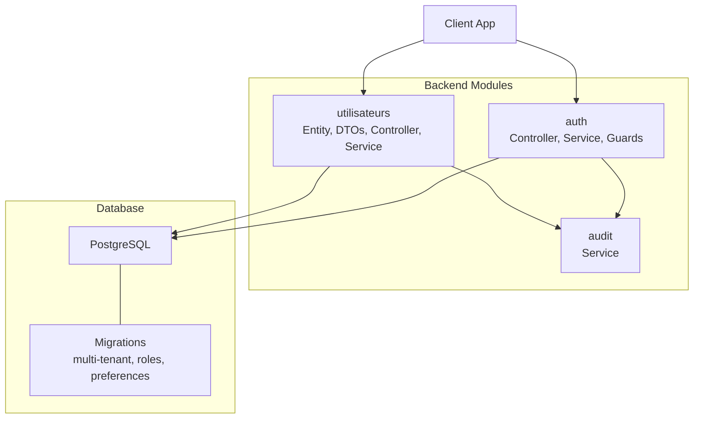

**Diagram sources**
- [backend/src/modules/utilisateurs/controllers/utilisateurs.controller.ts](file://backend/src/modules/utilisateurs/controllers/utilisateurs.controller.ts)
- [backend/src/modules/utilisateurs/services/utilisateurs.service.ts](file://backend/src/modules/utilisateurs/services/utilisateurs.service.ts)
- [backend/src/modules/auth/controllers/auth.controller.ts](file://backend/src/modules/auth/controllers/auth.controller.ts)
- [backend/src/modules/auth/services/auth.service.ts](file://backend/src/modules/auth/services/auth.service.ts)
- [backend/src/modules/auth/guards/jwt-auth.guard.ts](file://backend/src/modules/auth/guards/jwt-auth.guard.ts)
- [backend/src/modules/audit/services/audit.service.ts](file://backend/src/modules/audit/services/audit.service.ts)
- [backend/database/migrations/050-multi-tenant-v3-max-etablissements.sql](file://backend/database/migrations/050-multi-tenant-v3-max-etablissements.sql)
- [backend/database/migrations/079-add-roleId-utilisateur-etablissements.sql](file://backend/database/migrations/079-add-roleId-utilisateur-etablissements.sql)
- [backend/database/migrations/080-preferences-utilisateur-multi-tenant.sql](file://backend/database/migrations/080-preferences-utilisateur-multi-tenant.sql)

**Section sources**
- [backend/src/modules/utilisateurs/entities/utilisateur.entity.ts](file://backend/src/modules/utilisateurs/entities/utilisateur.entity.ts)
- [backend/src/modules/utilisateurs/dto/create-utilisateur.dto.ts](file://backend/src/modules/utilisateurs/dto/create-utilisateur.dto.ts)
- [backend/src/modules/utilisateurs/dto/update-utilisateur.dto.ts](file://backend/src/modules/utilisateurs/dto/update-utilisateur.dto.ts)
- [backend/src/modules/utilisateurs/controllers/utilisateurs.controller.ts](file://backend/src/modules/utilisateurs/controllers/utilisateurs.controller.ts)
- [backend/src/modules/utilisateurs/services/utilisateurs.service.ts](file://backend/src/modules/utilisateurs/services/utilisateurs.service.ts)
- [backend/src/modules/auth/controllers/auth.controller.ts](file://backend/src/modules/auth/controllers/auth.controller.ts)
- [backend/src/modules/auth/services/auth.service.ts](file://backend/src/modules/auth/services/auth.service.ts)
- [backend/src/modules/auth/guards/jwt-auth.guard.ts](file://backend/src/modules/auth/guards/jwt-auth.guard.ts)
- [backend/src/modules/audit/services/audit.service.ts](file://backend/src/modules/audit/services/audit.service.ts)
- [backend/database/migrations/050-multi-tenant-v3-max-etablissements.sql](file://backend/database/migrations/050-multi-tenant-v3-max-etablissements.sql)
- [backend/database/migrations/079-add-roleId-utilisateur-etablissements.sql](file://backend/database/migrations/079-add-roleId-utilisateur-etablissements.sql)
- [backend/database/migrations/080-preferences-utilisateur-multi-tenant.sql](file://backend/database/migrations/080-preferences-utilisateur-multi-tenant.sql)

## Core Components
- User Entity: Defines core fields such as identity, contact information, tenant context, role linkage, status flags, and timestamps. The entity is the source of truth for user records and drives validation and persistence.
- DTOs: Create and update input contracts enforce field presence, formats, and constraints before reaching business logic.
- Controller: Exposes REST endpoints for CRUD, status transitions, and administrative actions. Applies guards and request validation.
- Service: Implements business rules including multi-tenant scoping, role assignment, status transitions, password hashing, lockout checks, and audit event emission.
- Auth Module: Provides login, token issuance, refresh, logout, and guard-based authorization. Integrates with user service for credential checks and lockout enforcement.
- Audit Service: Records security-relevant events (login success/failure, lockouts, password changes, role updates).

Key responsibilities:
- Multi-tenant isolation: All user queries and mutations are scoped to an establishment (tenant) identifier derived from the request context or JWT claims.
- Role assignment: Roles are associated per establishment; the service validates role existence within the same tenant.
- Status management: Active/inactive/locked states control access and visibility. Locked state can be enforced by failed attempts policy.
- Password policy: Enforced at DTO/service level (length, complexity) and hashed using a secure algorithm.
- Email verification: Optional flow to mark verified/unverified and gate certain features until verified.
- Lockout mechanism: Tracks failed attempts and enforces temporary lockout windows.

**Section sources**
- [backend/src/modules/utilisateurs/entities/utilisateur.entity.ts](file://backend/src/modules/utilisateurs/entities/utilisateur.entity.ts)
- [backend/src/modules/utilisateurs/dto/create-utilisateur.dto.ts](file://backend/src/modules/utilisateurs/dto/create-utilisateur.dto.ts)
- [backend/src/modules/utilisateurs/dto/update-utilisateur.dto.ts](file://backend/src/modules/utilisateurs/dto/update-utilisateur.dto.ts)
- [backend/src/modules/utilisateurs/controllers/utilisateurs.controller.ts](file://backend/src/modules/utilisateurs/controllers/utilisateurs.controller.ts)
- [backend/src/modules/utilisateurs/services/utilisateurs.service.ts](file://backend/src/modules/utilisateurs/services/utilisateurs.service.ts)
- [backend/src/modules/auth/controllers/auth.controller.ts](file://backend/src/modules/auth/controllers/auth.controller.ts)
- [backend/src/modules/auth/services/auth.service.ts](file://backend/src/modules/auth/services/auth.service.ts)
- [backend/src/modules/auth/guards/jwt-auth.guard.ts](file://backend/src/modules/auth/guards/jwt-auth.guard.ts)
- [backend/src/modules/audit/services/audit.service.ts](file://backend/src/modules/audit/services/audit.service.ts)

## Architecture Overview
The user management architecture follows a layered approach:
- Presentation layer: Controllers expose REST endpoints and apply guards.
- Business layer: Services implement domain logic, enforce multi-tenant scoping, validate inputs, manage statuses, and emit audit events.
- Data layer: TypeORM entities map to database tables; migrations evolve schema.
- Cross-cutting: Audit logging captures security events; auth guards protect routes.

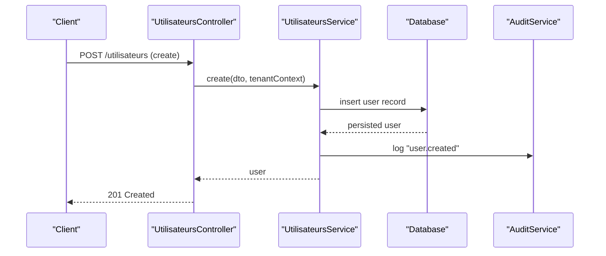

**Diagram sources**
- [backend/src/modules/utilisateurs/controllers/utilisateurs.controller.ts](file://backend/src/modules/utilisateurs/controllers/utilisateurs.controller.ts)
- [backend/src/modules/utilisateurs/services/utilisateurs.service.ts](file://backend/src/modules/utilisateurs/services/utilisateurs.service.ts)
- [backend/src/modules/audit/services/audit.service.ts](file://backend/src/modules/audit/services/audit.service.ts)

## Detailed Component Analysis

### User Entity and Data Model
The User entity models the core attributes required for identity, contact, tenant association, role linkage, and lifecycle state. Typical fields include identifiers, name, email, phone, password hash, emailVerified flag, status (active/inactive/locked), establishmentId, roleId, lastLoginAt, failedAttempts, lockedUntil, createdAt, updatedAt, and soft-delete fields if applicable.

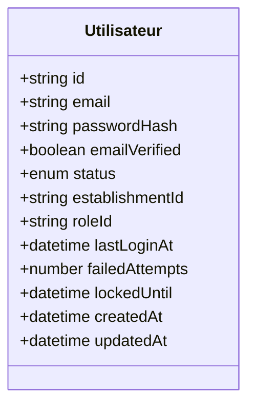

**Diagram sources**
- [backend/src/modules/utilisateurs/entities/utilisateur.entity.ts](file://backend/src/modules/utilisateurs/entities/utilisateur.entity.ts)

**Section sources**
- [backend/src/modules/utilisateurs/entities/utilisateur.entity.ts](file://backend/src/modules/utilisateurs/entities/utilisateur.entity.ts)

### Registration Workflow
Registration creates a new user within a specific establishment, applies password policy, sets initial status, and emits audit events.

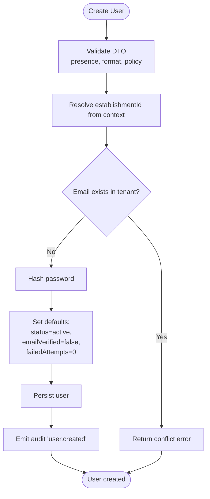

**Diagram sources**
- [backend/src/modules/utilisateurs/dto/create-utilisateur.dto.ts](file://backend/src/modules/utilisateurs/dto/create-utilisateur.dto.ts)
- [backend/src/modules/utilisateurs/services/utilisateurs.service.ts](file://backend/src/modules/utilisateurs/services/utilisateurs.service.ts)
- [backend/src/modules/audit/services/audit.service.ts](file://backend/src/modules/audit/services/audit.service.ts)

**Section sources**
- [backend/src/modules/utilisateurs/dto/create-utilisateur.dto.ts](file://backend/src/modules/utilisateurs/dto/create-utilisateur.dto.ts)
- [backend/src/modules/utilisateurs/services/utilisateurs.service.ts](file://backend/src/modules/utilisateurs/services/utilisateurs.service.ts)

### Profile Management
Profile updates allow changing non-sensitive fields and optionally sensitive fields based on permissions. Validation ensures only allowed fields are mutated.

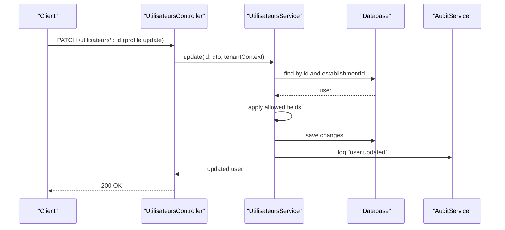

**Diagram sources**
- [backend/src/modules/utilisateurs/controllers/utilisateurs.controller.ts](file://backend/src/modules/utilisateurs/controllers/utilisateurs.controller.ts)
- [backend/src/modules/utilisateurs/services/utilisateurs.service.ts](file://backend/src/modules/utilisateurs/services/utilisateurs.service.ts)
- [backend/src/modules/audit/services/audit.service.ts](file://backend/src/modules/audit/services/audit.service.ts)

**Section sources**
- [backend/src/modules/utilisateurs/dto/update-utilisateur.dto.ts](file://backend/src/modules/utilisateurs/dto/update-utilisateur.dto.ts)
- [backend/src/modules/utilisateurs/controllers/utilisateurs.controller.ts](file://backend/src/modules/utilisateurs/controllers/utilisateurs.controller.ts)
- [backend/src/modules/utilisateurs/services/utilisateurs.service.ts](file://backend/src/modules/utilisateurs/services/utilisateurs.service.ts)

### Account Lifecycle Operations
Lifecycle includes activation, deactivation, locking, unlocking, and deletion (soft delete if implemented). Transitions are validated against current status and tenant scope.

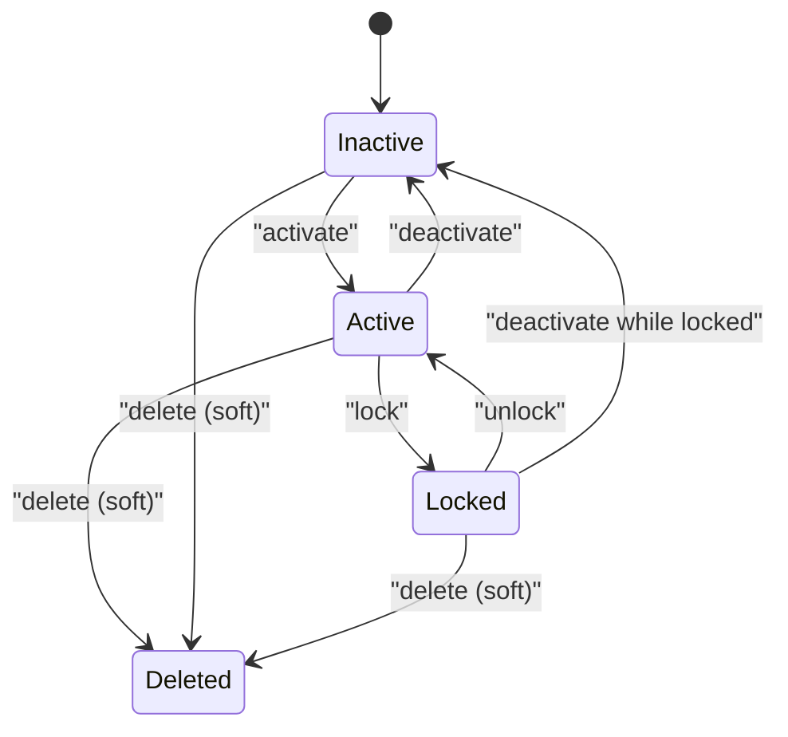

**Diagram sources**
- [backend/src/modules/utilisateurs/services/utilisateurs.service.ts](file://backend/src/modules/utilisateurs/services/utilisateurs.service.ts)

**Section sources**
- [backend/src/modules/utilisateurs/services/utilisateurs.service.ts](file://backend/src/modules/utilisateurs/services/utilisateurs.service.ts)

### Multi-Tenant User Isolation
All user operations are scoped to an establishmentId. Queries filter by tenant, and writes set the tenant context. This prevents cross-tenant data leakage.

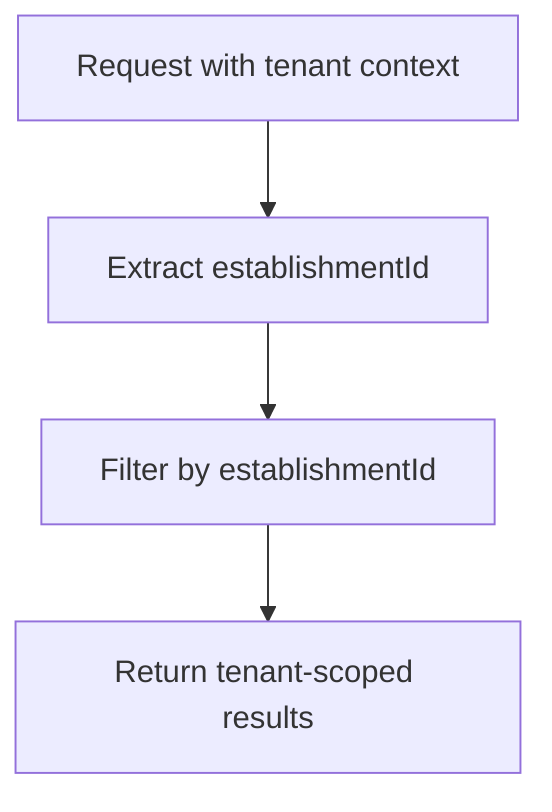

**Diagram sources**
- [backend/database/migrations/050-multi-tenant-v3-max-etablissements.sql](file://backend/database/migrations/050-multi-tenant-v3-max-etablissements.sql)
- [backend/src/modules/utilisateurs/services/utilisateurs.service.ts](file://backend/src/modules/utilisateurs/services/utilisateurs.service.ts)

**Section sources**
- [backend/database/migrations/050-multi-tenant-v3-max-etablissements.sql](file://backend/database/migrations/050-multi-tenant-v3-max-etablissements.sql)
- [backend/src/modules/utilisateurs/services/utilisateurs.service.ts](file://backend/src/modules/utilisateurs/services/utilisateurs.service.ts)

### User Role Assignment
Roles are assigned per establishment. The service validates that the role belongs to the same tenant before linking it to the user.

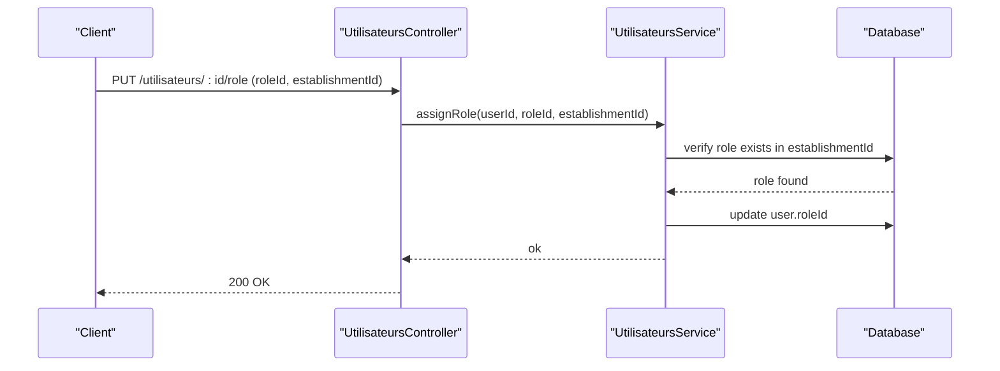

**Diagram sources**
- [backend/database/migrations/079-add-roleId-utilisateur-etablissements.sql](file://backend/database/migrations/079-add-roleId-utilisateur-etablissements.sql)
- [backend/src/modules/utilisateurs/services/utilisateurs.service.ts](file://backend/src/modules/utilisateurs/services/utilisateurs.service.ts)

**Section sources**
- [backend/database/migrations/079-add-roleId-utilisateur-etablissements.sql](file://backend/database/migrations/079-add-roleId-utilisateur-etablissements.sql)
- [backend/src/modules/utilisateurs/services/utilisateurs.service.ts](file://backend/src/modules/utilisateurs/services/utilisateurs.service.ts)

### Password Policies and Reset Flow
Password policy enforces minimum length and complexity at DTO/service level. Reset flow generates a time-bound token, stores it securely, and allows setting a new password after verification.

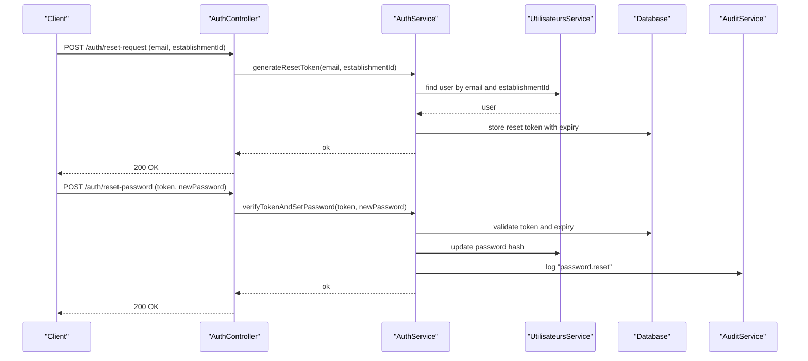

**Diagram sources**
- [backend/src/modules/auth/controllers/auth.controller.ts](file://backend/src/modules/auth/controllers/auth.controller.ts)
- [backend/src/modules/auth/services/auth.service.ts](file://backend/src/modules/auth/services/auth.service.ts)
- [backend/src/modules/utilisateurs/services/utilisateurs.service.ts](file://backend/src/modules/utilisateurs/services/utilisateurs.service.ts)
- [backend/src/modules/audit/services/audit.service.ts](file://backend/src/modules/audit/services/audit.service.ts)

**Section sources**
- [backend/src/modules/auth/controllers/auth.controller.ts](file://backend/src/modules/auth/controllers/auth.controller.ts)
- [backend/src/modules/auth/services/auth.service.ts](file://backend/src/modules/auth/services/auth.service.ts)
- [backend/src/modules/utilisateurs/services/utilisateurs.service.ts](file://backend/src/modules/utilisateurs/services/utilisateurs.service.ts)

### Email Verification Process
Users may be created unverified. An email verification link contains a signed token; upon verification, the user’s emailVerified flag is set to true.

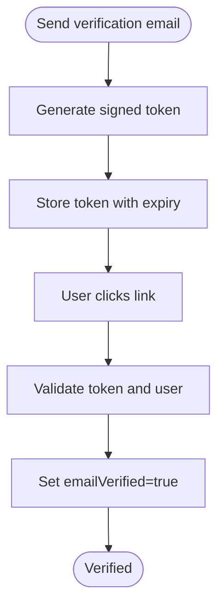

**Diagram sources**
- [backend/src/modules/auth/services/auth.service.ts](file://backend/src/modules/auth/services/auth.service.ts)
- [backend/src/modules/utilisateurs/services/utilisateurs.service.ts](file://backend/src/modules/utilisateurs/services/utilisateurs.service.ts)

**Section sources**
- [backend/src/modules/auth/services/auth.service.ts](file://backend/src/modules/auth/services/auth.service.ts)
- [backend/src/modules/utilisateurs/services/utilisateurs.service.ts](file://backend/src/modules/utilisateurs/services/utilisateurs.service.ts)

### Account Lockout Mechanism
Failed login attempts increment a counter. When threshold is reached, the user is locked until a cooldown period expires. Successful login resets the counter.

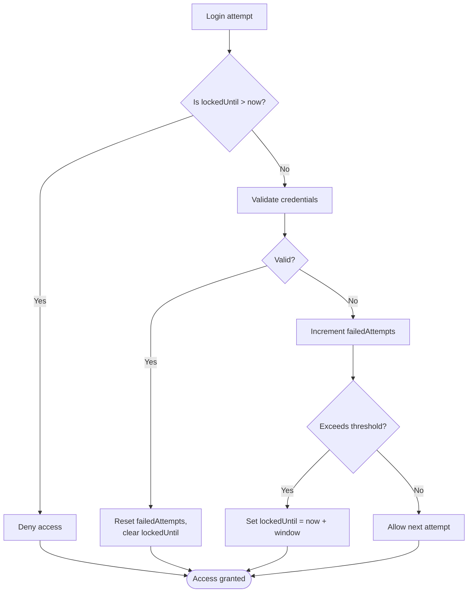

**Diagram sources**
- [backend/src/modules/auth/services/auth.service.ts](file://backend/src/modules/auth/services/auth.service.ts)
- [backend/src/modules/utilisateurs/services/utilisateurs.service.ts](file://backend/src/modules/utilisateurs/services/utilisateurs.service.ts)

**Section sources**
- [backend/src/modules/auth/services/auth.service.ts](file://backend/src/modules/auth/services/auth.service.ts)
- [backend/src/modules/utilisateurs/services/utilisateurs.service.ts](file://backend/src/modules/utilisateurs/services/utilisateurs.service.ts)

### Bulk User Import
Bulk import supports CSV/JSON payloads. The service processes rows in batches, validates each row, handles duplicates, and reports errors without rolling back entire imports.

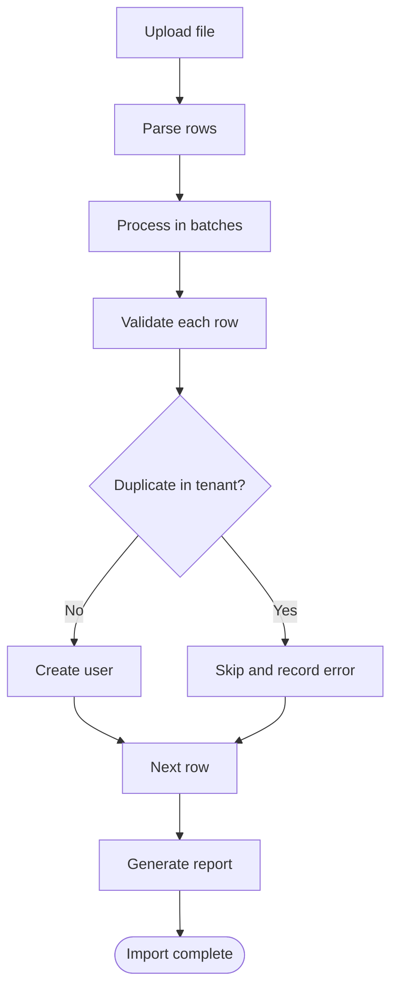

**Diagram sources**
- [backend/src/modules/utilisateurs/services/utilisateurs.service.ts](file://backend/src/modules/utilisateurs/services/utilisateurs.service.ts)

**Section sources**
- [backend/src/modules/utilisateurs/services/utilisateurs.service.ts](file://backend/src/modules/utilisateurs/services/utilisateurs.service.ts)

### User Search and Filtering
Search supports filtering by name, email, status, role, and establishment. Pagination and sorting are applied to optimize performance.

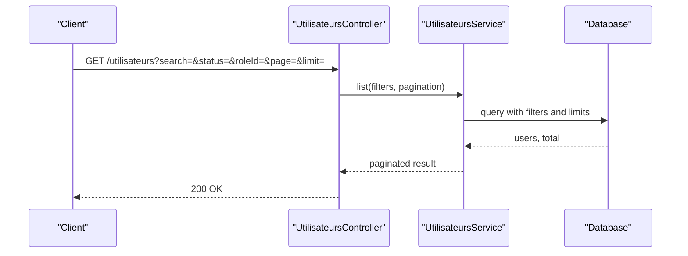

**Diagram sources**
- [backend/src/modules/utilisateurs/controllers/utilisateurs.controller.ts](file://backend/src/modules/utilisateurs/controllers/utilisateurs.controller.ts)
- [backend/src/modules/utilisateurs/services/utilisateurs.service.ts](file://backend/src/modules/utilisateurs/services/utilisateurs.service.ts)

**Section sources**
- [backend/src/modules/utilisateurs/controllers/utilisateurs.controller.ts](file://backend/src/modules/utilisateurs/controllers/utilisateurs.controller.ts)
- [backend/src/modules/utilisateurs/services/utilisateurs.service.ts](file://backend/src/modules/utilisateurs/services/utilisateurs.service.ts)

### Audit Logging Integration
Security-related events are logged via the audit service, including creation, updates, password changes, role assignments, lockouts, and login outcomes.

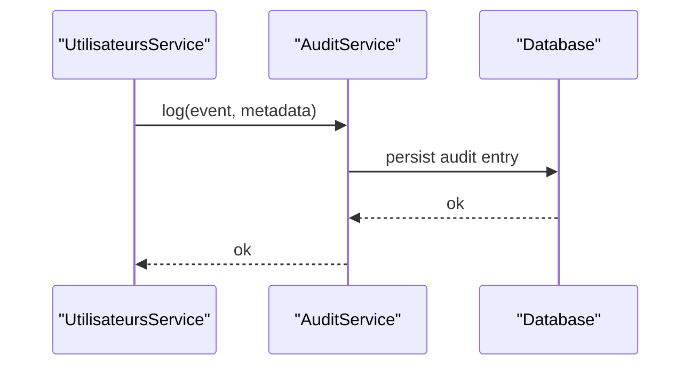

**Diagram sources**
- [backend/src/modules/audit/services/audit.service.ts](file://backend/src/modules/audit/services/audit.service.ts)

**Section sources**
- [backend/src/modules/audit/services/audit.service.ts](file://backend/src/modules/audit/services/audit.service.ts)

### Session Management and Concurrent Logins
Authentication issues tokens protected by guards. Sessions can be tracked per device or IP, with optional concurrency controls to limit active sessions per user.

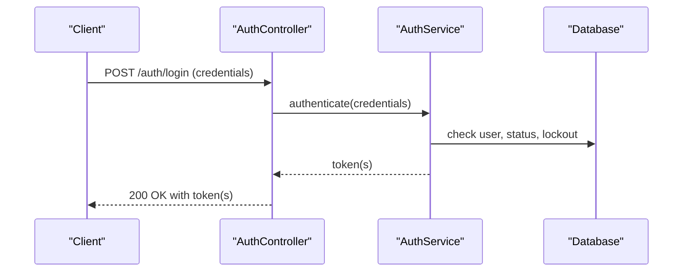

**Diagram sources**
- [backend/src/modules/auth/controllers/auth.controller.ts](file://backend/src/modules/auth/controllers/auth.controller.ts)
- [backend/src/modules/auth/services/auth.service.ts](file://backend/src/modules/auth/services/auth.service.ts)
- [backend/src/modules/auth/guards/jwt-auth.guard.ts](file://backend/src/modules/auth/guards/jwt-auth.guard.ts)

**Section sources**
- [backend/src/modules/auth/controllers/auth.controller.ts](file://backend/src/modules/auth/controllers/auth.controller.ts)
- [backend/src/modules/auth/services/auth.service.ts](file://backend/src/modules/auth/services/auth.service.ts)
- [backend/src/modules/auth/guards/jwt-auth.guard.ts](file://backend/src/modules/auth/guards/jwt-auth.guard.ts)

### Data Privacy Considerations
- Minimize stored PII; encrypt sensitive fields where necessary.
- Enforce strict tenant scoping to prevent cross-tenant access.
- Provide data export and deletion capabilities aligned with retention policies.
- Mask personal data in logs; never log passwords or tokens.
- Apply least-privilege access to user data endpoints.

[No sources needed since this section provides general guidance]

## Dependency Analysis
The user management module depends on:
- Authentication services for login and token issuance.
- Audit service for security event recording.
- Database migrations for schema evolution (multi-tenant, roles, preferences).

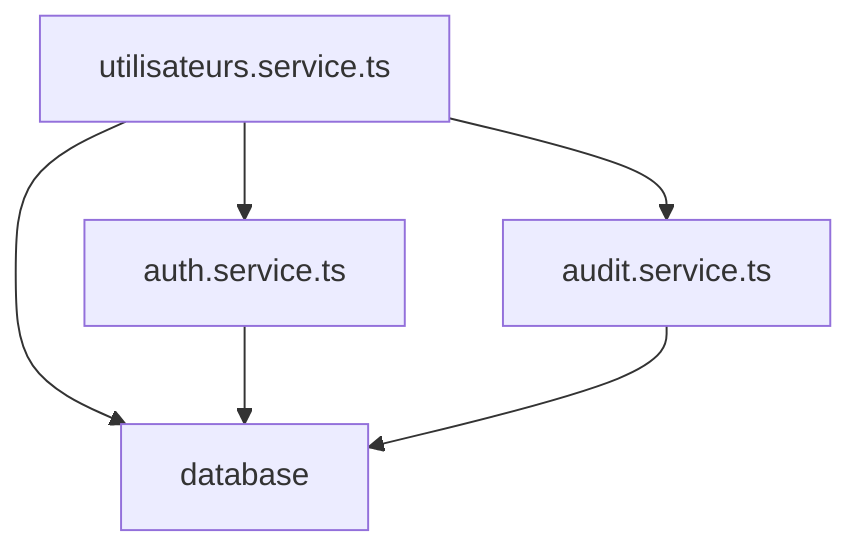

**Diagram sources**
- [backend/src/modules/utilisateurs/services/utilisateurs.service.ts](file://backend/src/modules/utilisateurs/services/utilisateurs.service.ts)
- [backend/src/modules/auth/services/auth.service.ts](file://backend/src/modules/auth/services/auth.service.ts)
- [backend/src/modules/audit/services/audit.service.ts](file://backend/src/modules/audit/services/audit.service.ts)

**Section sources**
- [backend/src/modules/utilisateurs/services/utilisateurs.service.ts](file://backend/src/modules/utilisateurs/services/utilisateurs.service.ts)
- [backend/src/modules/auth/services/auth.service.ts](file://backend/src/modules/auth/services/auth.service.ts)
- [backend/src/modules/audit/services/audit.service.ts](file://backend/src/modules/audit/services/audit.service.ts)

## Performance Considerations
- Use pagination and server-side filtering for large user lists.
- Index frequently queried columns (email, establishmentId, status, roleId).
- Avoid N+1 queries when loading related roles or profiles.
- Cache read-heavy lookups (e.g., role definitions) where appropriate.
- Stream bulk imports and process in batches to reduce memory pressure.

[No sources needed since this section provides general guidance]

## Troubleshooting Guide
Common issues and resolutions:
- Duplicate email in tenant: Ensure uniqueness constraint and handle conflicts gracefully.
- Invalid role assignment: Verify role exists within the same establishment.
- Locked accounts: Check failedAttempts and lockedUntil; unlock after cooldown or admin action.
- Password reset failures: Validate token expiry and ensure token is single-use.
- Multi-tenant leaks: Confirm all queries include establishmentId filters.

**Section sources**
- [backend/src/modules/utilisateurs/services/utilisateurs.service.ts](file://backend/src/modules/utilisateurs/services/utilisateurs.service.ts)
- [backend/src/modules/auth/services/auth.service.ts](file://backend/src/modules/auth/services/auth.service.ts)

## Conclusion
The eLISAschool User Management System provides robust support for multi-tenant user isolation, role-based access, comprehensive lifecycle management, strong password policies, secure reset flows, email verification, lockout mechanisms, and audit logging. With careful attention to performance, privacy, and concurrency controls, the system delivers a secure and scalable foundation for managing users across establishments.

[No sources needed since this section summarizes without analyzing specific files]

## Appendices

### Practical Examples
- Create a user: Send a POST request to the users endpoint with a valid DTO payload including establishmentId and roleId.
- Update profile: PATCH the user resource with allowed fields; sensitive fields require elevated permissions.
- Assign role: PUT the role assignment endpoint with roleId and establishmentId; ensure role belongs to the tenant.
- Bulk import: Upload a CSV/JSON file; review the generated report for skipped rows and errors.
- Search/filter: Use query parameters for name, email, status, role, and pagination options.

[No sources needed since this section provides general guidance]