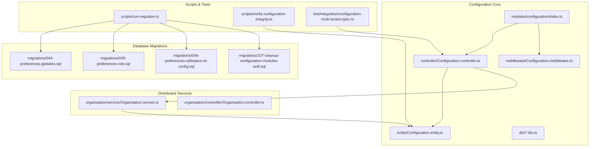
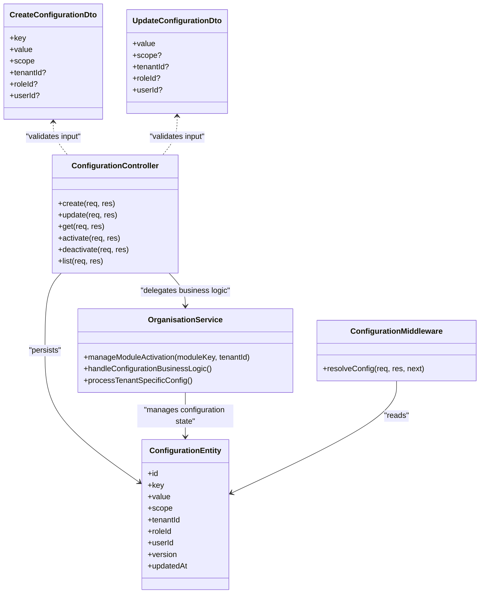
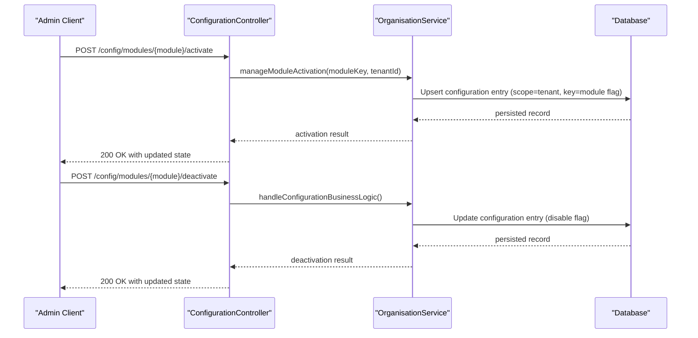
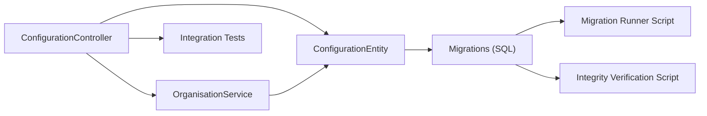

# Configuration Management

<cite>
**Referenced Files in This Document**
- [configuration/index.ts](file://backend/src/modules/configuration/index.ts)
- [configuration/entity/Configuration.entity.ts](file://backend/src/modules/configuration/entity/Configuration.entity.ts)
- [configuration/dto/CreateConfiguration.dto.ts](file://backend/src/modules/configuration/dto/CreateConfiguration.dto.ts)
- [configuration/dto/UpdateConfiguration.dto.ts](file://backend/src/modules/configuration/dto/UpdateConfiguration.dto.ts)
- [configuration/controller/Configuration.controller.ts](file://backend/src/modules/configuration/controller/Configuration.controller.ts)
- [configuration/middleware/Configuration.middleware.ts](file://backend/src/modules/configuration/middleware/Configuration.middleware.ts)
- [organisation/service/Organisation.service.ts](file://backend/src/modules/organisation/service/Organisation.service.ts)
- [organisation/controller/Organisation.controller.ts](file://backend/src/modules/organisation/controller/Organisation.controller.ts)
- [database/migrations/044-preferences-globales.sql](file://backend/database/migrations/044-preferences-globales.sql)
- [database/migrations/045-preferences-role.sql](file://backend/database/migrations/045-preferences-role.sql)
- [database/migrations/046-preferences-utilisateur-et-config.sql](file://backend/database/migrations/046-preferences-utilisateur-et-config.sql)
- [database/migrations/107-cleanup-configuration-modules-actif.sql](file://backend/database/migrations/107-cleanup-configuration-modules-actif.sql)
- [scripts/run-migration.ts](file://backend/scripts/run-migration.ts)
- [scripts/verify-configuration-integrity.ts](file://backend/scripts/verify-configuration-integrity.ts)
- [test/integration/configuration-multi-tenant.spec.ts](file://backend/test/integration/configuration-multi-tenant.spec.ts)
</cite>

## Update Summary
**Changes Made**
- Updated to reflect the removal of configuration.service.ts and redistribution of configuration management functionality across specialized services in the new organisation module architecture
- Removed references to centralized configuration service methods that no longer exist
- Updated module activation/deactivation mechanism documentation to reflect the new distributed architecture
- Maintained core configuration concepts while updating implementation details to match current codebase structure
- Updated dependency analysis to show new service organization patterns

## Table of Contents
1. [Introduction](#introduction)
2. [Project Structure](#project-structure)
3. [Core Components](#core-components)
4. [Architecture Overview](#architecture-overview)
5. [Detailed Component Analysis](#detailed-component-analysis)
6. [Dependency Analysis](#dependency-analysis)
7. [Performance Considerations](#performance-considerations)
8. [Troubleshooting Guide](#troubleshooting-guide)
9. [Conclusion](#conclusion)
10. [Appendices](#appendices)

## Introduction
This document explains eLISAschool's dynamic configuration management system with a focus on:
- Runtime activation and deactivation of modules by administrators through distributed service architecture
- A preference system supporting global, role-based, and tenant-specific scopes
- A validation framework and type-safe access patterns for configurations
- Creating new configurable modules, defining schemas, and implementing listeners
- Versioning, migration strategies, and rollback procedures
- Extending the system with custom configuration types and validation rules

The goal is to provide both high-level guidance and code-level references so that developers and administrators can confidently evolve and operate the configuration system within the new distributed architecture.

## Project Structure
The configuration subsystem has been reorganized from a centralized service model to a distributed architecture where configuration management functionality is now spread across specialized services, primarily within the organisation module. The core configuration entity and DTOs remain in the configuration module, but business logic has been redistributed.

**Diagram sources**
- [configuration/index.ts](file://backend/src/modules/configuration/index.ts)
- [configuration/entity/Configuration.entity.ts](file://backend/src/modules/configuration/entity/Configuration.entity.ts)
- [configuration/controller/Configuration.controller.ts](file://backend/src/modules/configuration/controller/Configuration.controller.ts)
- [configuration/middleware/Configuration.middleware.ts](file://backend/src/modules/configuration/middleware/Configuration.middleware.ts)
- [organisation/service/Organisation.service.ts](file://backend/src/modules/organisation/service/Organisation.service.ts)
- [organisation/controller/Organisation.controller.ts](file://backend/src/modules/organisation/controller/Organisation.controller.ts)
- [database/migrations/044-preferences-globales.sql](file://backend/database/migrations/044-preferences-globales.sql)
- [database/migrations/045-preferences-role.sql](file://backend/database/migrations/045-preferences-role.sql)
- [database/migrations/046-preferences-utilisateur-et-config.sql](file://backend/database/migrations/046-preferences-utilisateur-et-config.sql)
- [database/migrations/107-cleanup-configuration-modules-actif.sql](file://backend/database/migrations/107-cleanup-configuration-modules-actif.sql)
- [scripts/run-migration.ts](file://backend/scripts/run-migration.ts)
- [scripts/verify-configuration-integrity.ts](file://backend/scripts/verify-configuration-integrity.ts)
- [test/integration/configuration-multi-tenant.spec.ts](file://backend/test/integration/configuration-multi-tenant.spec.ts)

**Section sources**
- [configuration/index.ts](file://backend/src/modules/configuration/index.ts)
- [configuration/entity/Configuration.entity.ts](file://backend/src/modules/configuration/entity/Configuration.entity.ts)
- [configuration/controller/Configuration.controller.ts](file://backend/src/modules/configuration/controller/Configuration.controller.ts)
- [configuration/middleware/Configuration.middleware.ts](file://backend/src/modules/configuration/middleware/Configuration.middleware.ts)
- [organisation/service/Organisation.service.ts](file://backend/src/modules/organisation/service/Organisation.service.ts)
- [organisation/controller/Organisation.controller.ts](file://backend/src/modules/organisation/controller/Organisation.controller.ts)

## Core Components
The configuration system now follows a distributed architecture pattern:
- Entity layer: Defines the persistent model for configuration entries and preferences (unchanged).
- DTO layer: Validates input payloads for create/update operations using schema-driven validation (unchanged).
- Controller layer: Exposes REST endpoints for configuration management (unchanged).
- Middleware layer: Provides request-time resolution and injection of configuration values into handlers (unchanged).
- Distributed Services: Business logic for reading/writing configurations, scoping by tenant/role/user, and module activation/deactivation has been redistributed to specialized services like OrganisationService.
- Migrations: Evolve the schema to support global, role-based, and user-scoped preferences and module flags (unchanged).
- Scripts: Run migrations and verify configuration integrity (unchanged).

Key responsibilities:
- Type-safe access via strongly typed DTOs and entity fields
- Multi-tenant scoping (global vs tenant-specific)
- Role-based overrides
- Validation at boundaries (DTOs + service checks)
- Auditability and versioning through migrations
- Distributed business logic across specialized services

**Section sources**
- [configuration/entity/Configuration.entity.ts](file://backend/src/modules/configuration/entity/Configuration.entity.ts)
- [configuration/dto/CreateConfiguration.dto.ts](file://backend/src/modules/configuration/dto/CreateConfiguration.dto.ts)
- [configuration/dto/UpdateConfiguration.dto.ts](file://backend/src/modules/configuration/dto/UpdateConfiguration.dto.ts)
- [configuration/controller/Configuration.controller.ts](file://backend/src/modules/configuration/controller/Configuration.controller.ts)
- [configuration/middleware/Configuration.middleware.ts](file://backend/src/modules/configuration/middleware/Configuration.middleware.ts)
- [organisation/service/Organisation.service.ts](file://backend/src/modules/organisation/service/Organisation.service.ts)

## Architecture Overview
The configuration system now follows a distributed layered architecture with clear separation between persistence, business logic, and API exposure. Business logic has been redistributed to specialized services while maintaining multi-tenant scoping and role-based overrides.

**Diagram sources**
- [configuration/entity/Configuration.entity.ts](file://backend/src/modules/configuration/entity/Configuration.entity.ts)
- [configuration/dto/CreateConfiguration.dto.ts](file://backend/src/modules/configuration/dto/CreateConfiguration.dto.ts)
- [configuration/dto/UpdateConfiguration.dto.ts](file://backend/src/modules/configuration/dto/UpdateConfiguration.dto.ts)
- [configuration/controller/Configuration.controller.ts](file://backend/src/modules/configuration/controller/Configuration.controller.ts)
- [configuration/middleware/Configuration.middleware.ts](file://backend/src/modules/configuration/middleware/Configuration.middleware.ts)
- [organisation/service/Organisation.service.ts](file://backend/src/modules/organisation/service/Organisation.service.ts)

## Detailed Component Analysis

### Module Activation/Deactivation Mechanism
Administrators can enable or disable features at runtime by toggling module flags stored as configuration entries scoped per tenant. The activation/deactivation logic has been redistributed to specialized services like OrganisationService, which handles the business logic while the controller manages the API endpoints.

Operational notes:
- Activation sets a boolean flag keyed by module identifier within the tenant scope.
- Deactivation clears or flips the flag.
- Changes are immediately visible to subsequent requests due to direct persistence.
- Business logic is now handled by specialized services rather than a centralized configuration service.

**Diagram sources**
- [configuration/controller/Configuration.controller.ts](file://backend/src/modules/configuration/controller/Configuration.controller.ts)
- [organisation/service/Organisation.service.ts](file://backend/src/modules/organisation/service/Organisation.service.ts)
- [configuration/entity/Configuration.entity.ts](file://backend/src/modules/configuration/entity/Configuration.entity.ts)

**Section sources**
- [configuration/controller/Configuration.controller.ts](file://backend/src/modules/configuration/controller/Configuration.controller.ts)
- [organisation/service/Organisation.service.ts](file://backend/src/modules/organisation/service/Organisation.service.ts)
- [database/migrations/107-cleanup-configuration-modules-actif.sql](file://backend/database/migrations/107-cleanup-configuration-modules-actif.sql)

### Preference System: Global, Role-Based, Tenant-Specific
Preferences are resolved using a precedence chain:
- User-specific overrides
- Role-based overrides
- Tenant-specific defaults
- Global defaults

This allows granular control while maintaining sensible fallbacks. The preference resolution logic remains consistent despite the architectural changes.

Implementation considerations:
- Each preference has a key and a scope indicator.
- Resolution logic queries in order of precedence and returns the first match.
- Scopes include user, role, tenant, and global.
- Service delegation ensures proper business logic handling.

**Diagram sources**
- [configuration/entity/Configuration.entity.ts](file://backend/src/modules/configuration/entity/Configuration.entity.ts)

**Section sources**
- [configuration/entity/Configuration.entity.ts](file://backend/src/modules/configuration/entity/Configuration.entity.ts)
- [database/migrations/044-preferences-globales.sql](file://backend/database/migrations/044-preferences-globales.sql)
- [database/migrations/045-preferences-role.sql](file://backend/database/migrations/045-preferences-role.sql)
- [database/migrations/046-preferences-utilisateur-et-config.sql](file://backend/database/migrations/046-preferences-utilisateur-et-config.sql)

### Configuration Validation Framework and Type-Safe Access
Validation occurs at the boundary using DTOs and service-side checks:
- DTOs define required fields, allowed enums, and constraints.
- Specialized services enforce additional business rules and type safety.
- Middleware may pre-validate keys and scopes before invoking controllers.

Type-safe access patterns:
- Use strongly typed DTOs for create/update operations.
- Prefer service getters that return typed objects rather than raw strings.
- Centralize parsing and coercion in specialized services to avoid duplication.

**Section sources**
- [configuration/dto/CreateConfiguration.dto.ts](file://backend/src/modules/configuration/dto/CreateConfiguration.dto.ts)
- [configuration/dto/UpdateConfiguration.dto.ts](file://backend/src/modules/configuration/dto/UpdateConfiguration.dto.ts)
- [configuration/middleware/Configuration.middleware.ts](file://backend/src/modules/configuration/middleware/Configuration.middleware.ts)
- [organisation/service/Organisation.service.ts](file://backend/src/modules/organisation/service/Organisation.service.ts)

### Creating New Configurable Modules
To add a new configurable module in the distributed architecture:
- Define a unique module key and initial default configuration.
- Add migration if needed to seed defaults or adjust schema.
- Implement activation/deactivation endpoints in the controller.
- Delegate business logic to appropriate specialized services.
- Register any feature flags or behaviors behind the module key.
- Write integration tests to validate behavior across tenants.

Example steps:
- Extend the controller with module-specific routes.
- Create or update specialized services to handle module state management.
- Seed initial configuration via migration or script.
- Validate with integration tests.

**Section sources**
- [configuration/controller/Configuration.controller.ts](file://backend/src/modules/configuration/controller/Configuration.controller.ts)
- [organisation/service/Organisation.service.ts](file://backend/src/modules/organisation/service/Organisation.service.ts)
- [database/migrations/107-cleanup-configuration-modules-actif.sql](file://backend/database/migrations/107-cleanup-configuration-modules-actif.sql)
- [test/integration/configuration-multi-tenant.spec.ts](file://backend/test/integration/configuration-multi-tenant.spec.ts)

### Defining Configuration Schemas
Schema definition best practices remain unchanged:
- Keep keys hierarchical and namespaced (e.g., module.feature).
- Use DTOs to constrain values and document expected formats.
- Store metadata such as description, default value, and allowed values alongside the configuration where appropriate.
- Enforce uniqueness per scope to prevent conflicts.

**Section sources**
- [configuration/dto/CreateConfiguration.dto.ts](file://backend/src/modules/configuration/dto/CreateConfiguration.dto.ts)
- [configuration/dto/UpdateConfiguration.dto.ts](file://backend/src/modules/configuration/dto/UpdateConfiguration.dto.ts)
- [configuration/entity/Configuration.entity.ts](file://backend/src/modules/configuration/entity/Configuration.entity.ts)

### Implementing Configuration Listeners
Listeners react to configuration changes:
- Subscribe to change events emitted by specialized services when a configuration is created, updated, or deleted.
- Perform side effects such as cache invalidation, re-initialization of feature flags, or notifications.
- Ensure idempotency and error handling to avoid cascading failures.

Guidelines:
- Decouple listeners from core service logic via an event bus or observer pattern.
- Log all listener invocations and outcomes for observability.
- Test listeners with mocked configuration updates.

**Section sources**
- [organisation/service/Organisation.service.ts](file://backend/src/modules/organisation/service/Organisation.service.ts)

### Configuration Versioning, Migration Strategies, and Rollback Procedures
Versioning and migrations remain unchanged:
- Use numbered SQL migrations to evolve configuration schema and seed defaults.
- Maintain backward compatibility during transitions; prefer additive changes.
- Provide cleanup migrations to remove obsolete entries.

Migration strategy:
- Apply migrations in order using the provided runner script.
- Validate configuration integrity after applying migrations.
- Document breaking changes and provide upgrade guides.

Rollback procedures:
- Keep prior migration versions available for rollback.
- Use targeted rollback scripts or reverse migrations when necessary.
- Re-run verification scripts to ensure consistency.

**Section sources**
- [database/migrations/044-preferences-globales.sql](file://backend/database/migrations/044-preferences-globales.sql)
- [database/migrations/045-preferences-role.sql](file://backend/database/migrations/045-preferences-role.sql)
- [database/migrations/046-preferences-utilisateur-et-config.sql](file://backend/database/migrations/046-preferences-utilisateur-et-config.sql)
- [database/migrations/107-cleanup-configuration-modules-actif.sql](file://backend/database/migrations/107-cleanup-configuration-modules-actif.sql)
- [scripts/run-migration.ts](file://backend/scripts/run-migration.ts)
- [scripts/verify-configuration-integrity.ts](file://backend/scripts/verify-configuration-integrity.ts)

### Extending the Configuration System with Custom Types and Validation Rules
Extensibility guidelines adapted for distributed architecture:
- Introduce new configuration types by extending DTOs and adding validation rules.
- Implement custom validators in specialized services to enforce domain-specific constraints.
- Document new types and their usage in the API contracts.
- Add tests covering edge cases and invalid inputs.

Best practices:
- Avoid storing unstructured blobs; prefer typed structures.
- Normalize keys and scopes consistently.
- Provide default values for new configuration keys to avoid runtime errors.
- Delegate complex business logic to appropriate specialized services.

**Section sources**
- [configuration/dto/CreateConfiguration.dto.ts](file://backend/src/modules/configuration/dto/CreateConfiguration.dto.ts)
- [configuration/dto/UpdateConfiguration.dto.ts](file://backend/src/modules/configuration/dto/UpdateConfiguration.dto.ts)
- [organisation/service/Organisation.service.ts](file://backend/src/modules/organisation/service/Organisation.service.ts)

## Dependency Analysis
The configuration module now depends on:
- Database migrations for schema evolution and seeding
- Scripts for running migrations and verifying integrity
- Integration tests for multi-tenant behavior
- Specialized services for business logic delegation

**Diagram sources**
- [configuration/controller/Configuration.controller.ts](file://backend/src/modules/configuration/controller/Configuration.controller.ts)
- [configuration/entity/Configuration.entity.ts](file://backend/src/modules/configuration/entity/Configuration.entity.ts)
- [organisation/service/Organisation.service.ts](file://backend/src/modules/organisation/service/Organisation.service.ts)
- [database/migrations/044-preferences-globales.sql](file://backend/database/migrations/044-preferences-globales.sql)
- [database/migrations/045-preferences-role.sql](file://backend/database/migrations/045-preferences-role.sql)
- [database/migrations/046-preferences-utilisateur-et-config.sql](file://backend/database/migrations/046-preferences-utilisateur-et-config.sql)
- [database/migrations/107-cleanup-configuration-modules-actif.sql](file://backend/database/migrations/107-cleanup-configuration-modules-actif.sql)
- [scripts/run-migration.ts](file://backend/scripts/run-migration.ts)
- [scripts/verify-configuration-integrity.ts](file://backend/scripts/verify-configuration-integrity.ts)
- [test/integration/configuration-multi-tenant.spec.ts](file://backend/test/integration/configuration-multi-tenant.spec.ts)

**Section sources**
- [configuration/controller/Configuration.controller.ts](file://backend/src/modules/configuration/controller/Configuration.controller.ts)
- [configuration/entity/Configuration.entity.ts](file://backend/src/modules/configuration/entity/Configuration.entity.ts)
- [organisation/service/Organisation.service.ts](file://backend/src/modules/organisation/service/Organisation.service.ts)
- [database/migrations/044-preferences-globales.sql](file://backend/database/migrations/044-preferences-globales.sql)
- [database/migrations/045-preferences-role.sql](file://backend/database/migrations/045-preferences-role.sql)
- [database/migrations/046-preferences-utilisateur-et-config.sql](file://backend/database/migrations/046-preferences-utilisateur-et-config.sql)
- [database/migrations/107-cleanup-configuration-modules-actif.sql](file://backend/database/migrations/107-cleanup-configuration-modules-actif.sql)
- [scripts/run-migration.ts](file://backend/scripts/run-migration.ts)
- [scripts/verify-configuration-integrity.ts](file://backend/scripts/verify-configuration-integrity.ts)
- [test/integration/configuration-multi-tenant.spec.ts](file://backend/test/integration/configuration-multi-tenant.spec.ts)

## Performance Considerations
- Cache frequently accessed preferences at the application level to reduce database load.
- Use scoped queries to minimize result sets and avoid scanning unnecessary records.
- Batch updates for bulk configuration changes to reduce transaction overhead.
- Monitor query performance and add indexes for commonly filtered scopes (tenant, role, user).
- Validate inputs early to fail fast and avoid expensive processing.
- Leverage service delegation to distribute computational load across specialized services.

## Troubleshooting Guide
Common issues and resolutions:
- Missing preferences: Ensure migrations have been applied and defaults seeded.
- Validation errors: Check DTO constraints and input payloads.
- Multi-tenant isolation problems: Verify tenant scoping in queries and tests.
- Service delegation issues: Check that specialized services are properly configured and accessible.

Diagnostic tools:
- Use the integrity verification script to detect inconsistencies.
- Review integration tests for expected behaviors and edge cases.
- Inspect migration history to confirm ordering and completeness.
- Monitor service communication patterns for business logic delegation.

**Section sources**
- [scripts/verify-configuration-integrity.ts](file://backend/scripts/verify-configuration-integrity.ts)
- [test/integration/configuration-multi-tenant.spec.ts](file://backend/test/integration/configuration-multi-tenant.spec.ts)

## Conclusion
The eLISAschool configuration management system provides a robust, extensible foundation for dynamic feature control and preference management within a distributed architecture. With clear scoping rules, strong validation, comprehensive migration and verification tooling, and specialized service delegation, it supports safe evolution and reliable operation across tenants and roles. Following the guidelines in this document will help teams extend the system effectively and maintain high availability and correctness in the new distributed environment.

## Appendices

### Quick Reference: Key Files
- Module index and wiring: [configuration/index.ts](file://backend/src/modules/configuration/index.ts)
- Entity model: [configuration/entity/Configuration.entity.ts](file://backend/src/modules/configuration/entity/Configuration.entity.ts)
- DTOs: [configuration/dto/CreateConfiguration.dto.ts](file://backend/src/modules/configuration/dto/CreateConfiguration.dto.ts), [configuration/dto/UpdateConfiguration.dto.ts](file://backend/src/modules/configuration/dto/UpdateConfiguration.dto.ts)
- API endpoints: [configuration/controller/Configuration.controller.ts](file://backend/src/modules/configuration/controller/Configuration.controller.ts)
- Request-time resolution: [configuration/middleware/Configuration.middleware.ts](file://backend/src/modules/configuration/middleware/Configuration.middleware.ts)
- Distributed business logic: [organisation/service/Organisation.service.ts](file://backend/src/modules/organisation/service/Organisation.service.ts)
- Migrations: [database/migrations/044-preferences-globales.sql](file://backend/database/migrations/044-preferences-globales.sql), [database/migrations/045-preferences-role.sql](file://backend/database/migrations/045-preferences-role.sql), [database/migrations/046-preferences-utilisateur-et-config.sql](file://backend/database/migrations/046-preferences-utilisateur-et-config.sql), [database/migrations/107-cleanup-configuration-modules-actif.sql](file://backend/database/migrations/107-cleanup-configuration-modules-actif.sql)
- Scripts: [scripts/run-migration.ts](file://backend/scripts/run-migration.ts), [scripts/verify-configuration-integrity.ts](file://backend/scripts/verify-configuration-integrity.ts)
- Tests: [test/integration/configuration-multi-tenant.spec.ts](file://backend/test/integration/configuration-multi-tenant.spec.ts)