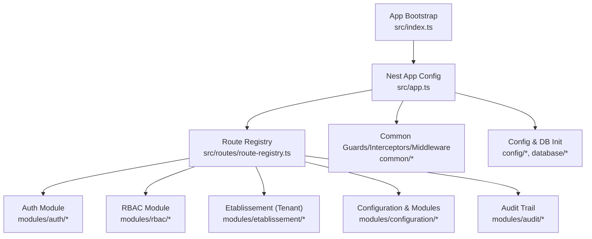
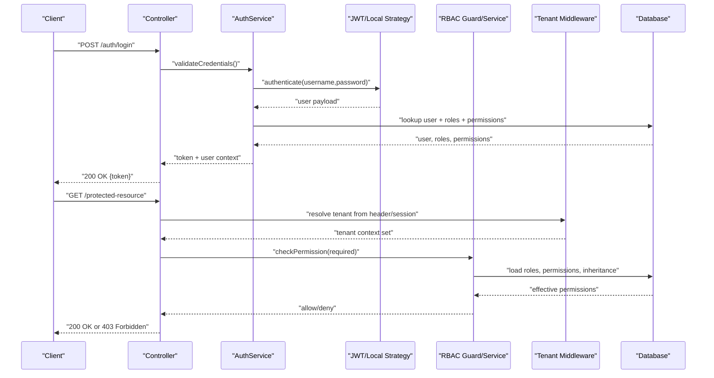
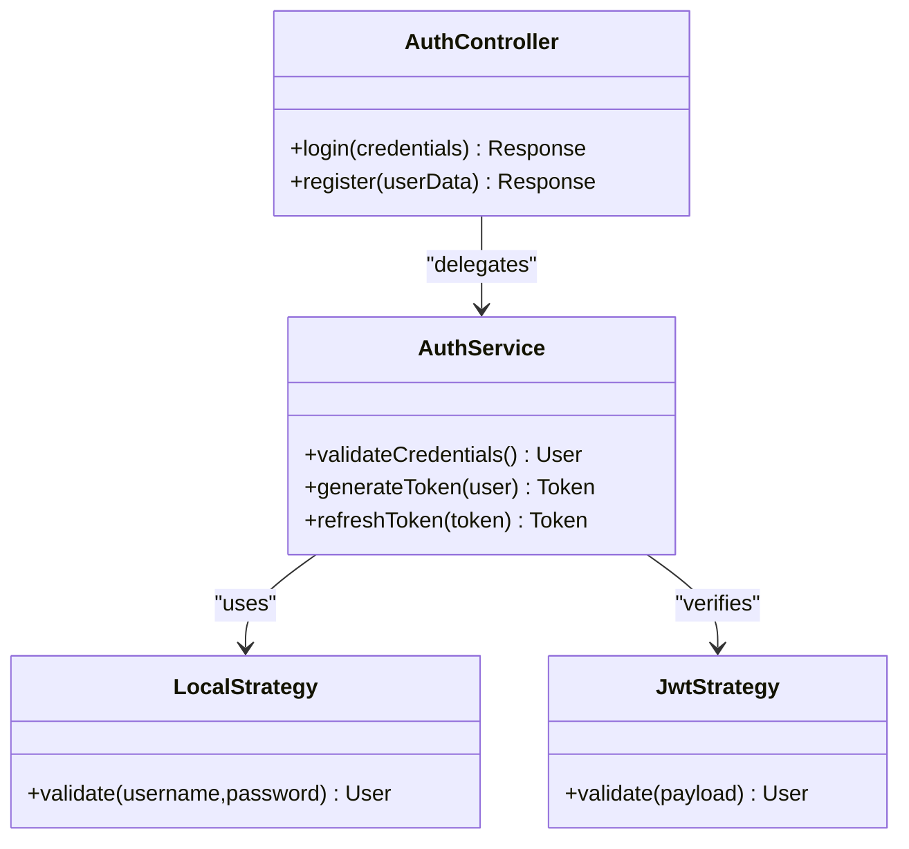
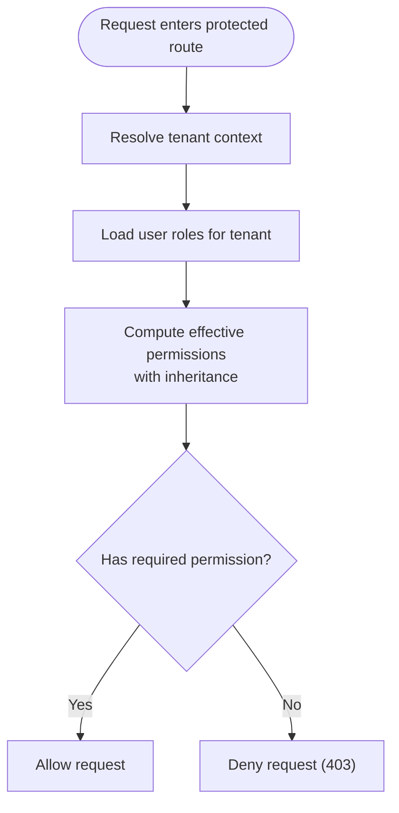
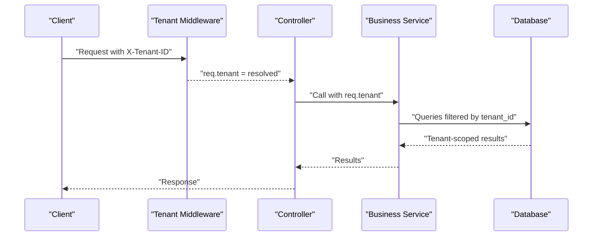
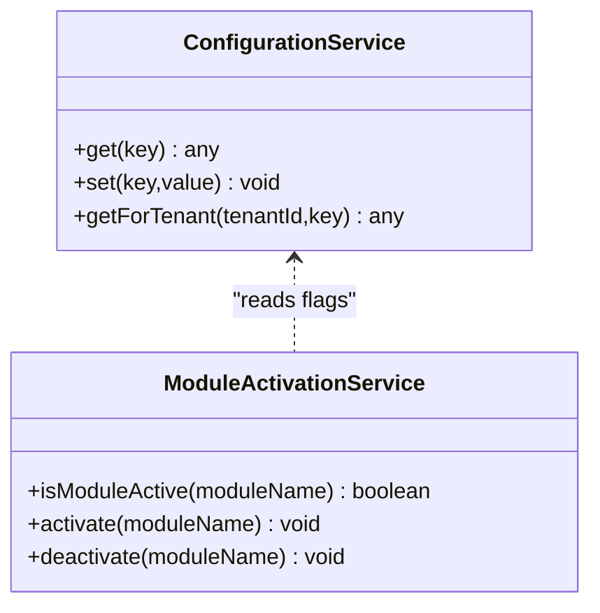
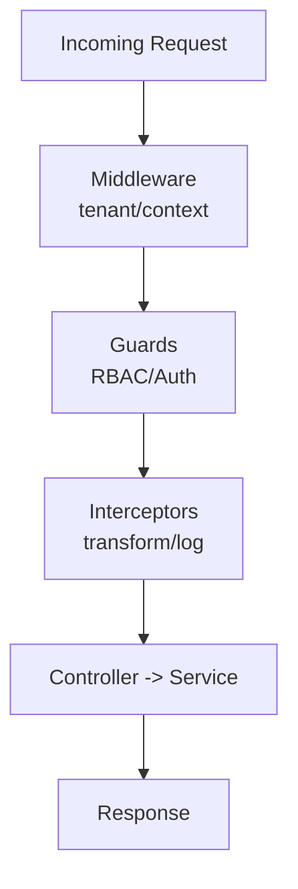
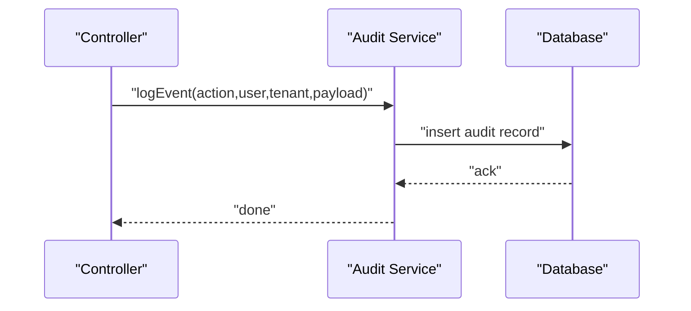
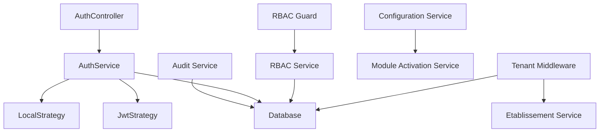

# Core Systems

<cite>
**Referenced Files in This Document**
- [app.ts](file://backend/src/app.ts)
- [index.ts](file://backend/src/index.ts)
- [route-registry.ts](file://backend/src/routes/route-registry.ts)
- [auth.module.ts](file://backend/src/modules/auth/auth.module.ts)
- [auth.controller.ts](file://backend/src/modules/auth/auth.controller.ts)
- [auth.service.ts](file://backend/src/modules/auth/auth.service.ts)
- [jwt.strategy.ts](file://backend/src/modules/auth/strategies/jwt.strategy.ts)
- [local.strategy.ts](file://backend/src/modules/auth/strategies/local.strategy.ts)
- [guard.ts](file://backend/src/common/guards/guard.ts)
- [interceptor.ts](file://backend/src/common/interceptors/interceptor.ts)
- [middleware.ts](file://backend/src/common/middlewares/middleware.ts)
- [rbac.service.ts](file://backend/src/modules/rbac/rbac.service.ts)
- [rbac.guard.ts](file://backend/src/modules/rbac/guards/rbac.guard.ts)
- [tenant.middleware.ts](file://backend/src/common/middlewares/tenant.middleware.ts)
- [etablissement.service.ts](file://backend/src/modules/etablissement/etablissement.service.ts)
- [configuration.service.ts](file://backend/src/modules/configuration/configuration.service.ts)
- [module-activation.service.ts](file://backend/src/modules/configuration/services/module-activation.service.ts)
- [audit.service.ts](file://backend/src/modules/audit/audit.service.ts)
- [database.config.ts](file://backend/src/config/database.config.ts)
- [env.config.ts](file://backend/src/config/env.config.ts)
- [data-source.ts](file://backend/src/database/data-source.ts)
- [050-multi-tenant-v3-max-etablissements.sql](file://backend/database/migrations/050-multi-tenant-v3-max-etablissements.sql)
- [027-auth-multi-mode.sql](file://backend/database/migrations/027-auth-multi-mode.sql)
- [migrate-rbac-v3.sql](file://backend/database/migrations/migrate-rbac-v3.sql)
- [test-guards.spec.ts](file://backend/test/unit/guards.test.ts)
- [test-interceptors.spec.ts](file://backend/test/unit/interceptors.test.ts)
- [test-middleware.spec.ts](file://backend/test/unit/middleware.test.ts)
</cite>

## Table of Contents
1. [Introduction](#introduction)
2. [Project Structure](#project-structure)
3. [Core Components](#core-components)
4. [Architecture Overview](#architecture-overview)
5. [Detailed Component Analysis](#detailed-component-analysis)
6. [Dependency Analysis](#dependency-analysis)
7. [Performance Considerations](#performance-considerations)
8. [Troubleshooting Guide](#troubleshooting-guide)
9. [Conclusion](#conclusion)
10. [Appendices](#appendices)

## Introduction
This document explains eLISAschool’s core systems for authentication, authorization, multi-tenancy, and configuration management. It covers role-based access control (RBAC) with permission inheritance and tenant isolation, multi-tenant authentication across multiple educational institutions within a single deployment, dynamic module activation, and configuration patterns. It also details guards, interceptors, and middleware components, provides practical examples for user registration, login flows, permission checking, and tenant switching, and addresses security considerations, session management, audit trail logging, and extension points for custom strategies and permission rules.

## Project Structure
The backend is organized by feature modules under src/modules, with shared cross-cutting concerns in src/common and application bootstrap in src/app.ts and src/index.ts. Routes are centrally registered via a route registry. Configuration and database initialization live under src/config and src/database. Migrations define the schema evolution for multi-tenant RBAC and authentication modes.

**Diagram sources**
- [index.ts](file://backend/src/index.ts)
- [app.ts](file://backend/src/app.ts)
- [route-registry.ts](file://backend/src/routes/route-registry.ts)

**Section sources**
- [index.ts](file://backend/src/index.ts)
- [app.ts](file://backend/src/app.ts)
- [route-registry.ts](file://backend/src/routes/route-registry.ts)

## Core Components
- Authentication: JWT and local strategies, controller and service orchestration, token issuance and validation.
- Authorization: RBAC guard with permission checks and inheritance; tenant-scoped enforcement.
- Multi-tenancy: Tenant resolution middleware and establishment service to isolate data per institution.
- Configuration Management: Centralized configuration service and dynamic module activation service.
- Cross-cutting: Guards, interceptors, and middleware for request lifecycle, auditing, and tenant context propagation.

**Section sources**
- [auth.controller.ts](file://backend/src/modules/auth/auth.controller.ts)
- [auth.service.ts](file://backend/src/modules/auth/auth.service.ts)
- [jwt.strategy.ts](file://backend/src/modules/auth/strategies/jwt.strategy.ts)
- [local.strategy.ts](file://backend/src/modules/auth/strategies/local.strategy.ts)
- [rbac.guard.ts](file://backend/src/modules/rbac/guards/rbac.guard.ts)
- [rbac.service.ts](file://backend/src/modules/rbac/rbac.service.ts)
- [tenant.middleware.ts](file://backend/src/common/middlewares/tenant.middleware.ts)
- [etablissement.service.ts](file://backend/src/modules/etablissement/etablissement.service.ts)
- [configuration.service.ts](file://backend/src/modules/configuration/configuration.service.ts)
- [module-activation.service.ts](file://backend/src/modules/configuration/services/module-activation.service.ts)
- [audit.service.ts](file://backend/src/modules/audit/audit.service.ts)

## Architecture Overview
The system uses NestJS with modular architecture. Requests flow through global middleware (tenant context), then controllers that delegate to services. Auth strategies validate credentials and produce tokens. RBAC guard enforces permissions based on roles and inheritance, scoped to the active tenant. Configuration and module activation are centralized and can be toggled at runtime. Audit events are recorded for sensitive operations.

**Diagram sources**
- [auth.controller.ts](file://backend/src/modules/auth/auth.controller.ts)
- [auth.service.ts](file://backend/src/modules/auth/auth.service.ts)
- [jwt.strategy.ts](file://backend/src/modules/auth/strategies/jwt.strategy.ts)
- [local.strategy.ts](file://backend/src/modules/auth/strategies/local.strategy.ts)
- [rbac.guard.ts](file://backend/src/modules/rbac/guards/rbac.guard.ts)
- [rbac.service.ts](file://backend/src/modules/rbac/rbac.service.ts)
- [tenant.middleware.ts](file://backend/src/common/middlewares/tenant.middleware.ts)

## Detailed Component Analysis

### Authentication System
- Strategies:
  - Local strategy validates username/password against user store and returns a user object.
  - JWT strategy extracts and verifies tokens, attaching user context to the request.
- Controller:
  - Exposes endpoints for login and registration, orchestrating AuthService calls.
- Service:
  - Handles credential verification, token generation, and user context enrichment.
- Security:
  - Tokens include minimal claims; secrets and expiration are configured via environment variables.
  - Passwords are hashed using secure algorithms before storage.

**Diagram sources**
- [auth.controller.ts](file://backend/src/modules/auth/auth.controller.ts)
- [auth.service.ts](file://backend/src/modules/auth/auth.service.ts)
- [local.strategy.ts](file://backend/src/modules/auth/strategies/local.strategy.ts)
- [jwt.strategy.ts](file://backend/src/modules/auth/strategies/jwt.strategy.ts)

**Section sources**
- [auth.controller.ts](file://backend/src/modules/auth/auth.controller.ts)
- [auth.service.ts](file://backend/src/modules/auth/auth.service.ts)
- [local.strategy.ts](file://backend/src/modules/auth/strategies/local.strategy.ts)
- [jwt.strategy.ts](file://backend/src/modules/auth/strategies/jwt.strategy.ts)

### Authorization and RBAC
- RBAC Guard:
  - Enforces required permissions on protected routes.
  - Resolves effective permissions by combining direct assignments and role inheritance.
- RBAC Service:
  - Loads roles, permissions, and inheritance graph.
  - Computes effective permissions for a user within the active tenant.
- Permission Inheritance:
  - Roles inherit permissions from parent roles; computed once per request and cached where appropriate.
- Tenant Isolation:
  - Permissions are evaluated within the scope of the current tenant context.

**Diagram sources**
- [rbac.guard.ts](file://backend/src/modules/rbac/guards/rbac.guard.ts)
- [rbac.service.ts](file://backend/src/modules/rbac/rbac.service.ts)

**Section sources**
- [rbac.guard.ts](file://backend/src/modules/rbac/guards/rbac.guard.ts)
- [rbac.service.ts](file://backend/src/modules/rbac/rbac.service.ts)

### Multi-Tenancy
- Tenant Middleware:
  - Extracts tenant identifier from headers or session and attaches it to the request context.
  - Ensures all subsequent services operate within the correct tenant scope.
- Establishment Service:
  - Provides tenant-specific operations and metadata.
- Database Schema:
  - Migrations introduce tenant scoping for users, roles, and resources.

**Diagram sources**
- [tenant.middleware.ts](file://backend/src/common/middlewares/tenant.middleware.ts)
- [etablissement.service.ts](file://backend/src/modules/etablissement/etablissement.service.ts)
- [050-multi-tenant-v3-max-etablissements.sql](file://backend/database/migrations/050-multi-tenant-v3-max-etablissements.sql)

**Section sources**
- [tenant.middleware.ts](file://backend/src/common/middlewares/tenant.middleware.ts)
- [etablissement.service.ts](file://backend/src/modules/etablissement/etablissement.service.ts)
- [050-multi-tenant-v3-max-etablissements.sql](file://backend/database/migrations/050-multi-tenant-v3-max-etablissements.sql)

### Dynamic Module Activation and Configuration Management
- Configuration Service:
  - Reads and writes application and tenant-level configuration.
- Module Activation Service:
  - Toggles module availability at runtime based on configuration flags.
- Patterns:
  - Feature flags drive module loading and UI visibility.
  - Configuration changes propagate without restarts where supported.

**Diagram sources**
- [configuration.service.ts](file://backend/src/modules/configuration/configuration.service.ts)
- [module-activation.service.ts](file://backend/src/modules/configuration/services/module-activation.service.ts)

**Section sources**
- [configuration.service.ts](file://backend/src/modules/configuration/configuration.service.ts)
- [module-activation.service.ts](file://backend/src/modules/configuration/services/module-activation.service.ts)

### Guards, Interceptors, and Middleware
- Guards:
  - Enforce access control and preconditions before controller execution.
- Interceptors:
  - Transform responses, add timing, and handle cross-cutting concerns.
- Middleware:
  - Global and route-specific middleware for tenant context, logging, and normalization.

**Diagram sources**
- [guard.ts](file://backend/src/common/guards/guard.ts)
- [interceptor.ts](file://backend/src/common/interceptors/interceptor.ts)
- [middleware.ts](file://backend/src/common/middlewares/middleware.ts)

**Section sources**
- [guard.ts](file://backend/src/common/guards/guard.ts)
- [interceptor.ts](file://backend/src/common/interceptors/interceptor.ts)
- [middleware.ts](file://backend/src/common/middlewares/middleware.ts)

### Practical Examples

#### User Registration Flow
- Steps:
  - Client sends registration payload to auth controller.
  - Service validates input, hashes password, creates user record.
  - Returns success response; optional auto-login may follow depending on policy.
- Security:
  - Input validation and sanitization.
  - Secure password hashing.

**Section sources**
- [auth.controller.ts](file://backend/src/modules/auth/auth.controller.ts)
- [auth.service.ts](file://backend/src/modules/auth/auth.service.ts)

#### Login Flow
- Steps:
  - Client sends credentials to login endpoint.
  - Local strategy authenticates user.
  - Service generates JWT and returns token.
- Session Management:
  - Stateless JWT recommended; if sessions are used, ensure secure cookie settings and CSRF protection.

**Section sources**
- [local.strategy.ts](file://backend/src/modules/auth/strategies/local.strategy.ts)
- [auth.service.ts](file://backend/src/modules/auth/auth.service.ts)
- [jwt.strategy.ts](file://backend/src/modules/auth/strategies/jwt.strategy.ts)

#### Permission Checking
- Steps:
  - Protected route invokes RBAC guard.
  - Guard loads user roles and computes effective permissions with inheritance.
  - Decision allows or denies request.

**Section sources**
- [rbac.guard.ts](file://backend/src/modules/rbac/guards/rbac.guard.ts)
- [rbac.service.ts](file://backend/src/modules/rbac/rbac.service.ts)

#### Tenant Switching
- Steps:
  - Client includes tenant identifier in request headers or switches via dedicated endpoint.
  - Tenant middleware resolves and sets context.
  - Subsequent requests use the new tenant context.

**Section sources**
- [tenant.middleware.ts](file://backend/src/common/middlewares/tenant.middleware.ts)
- [etablissement.service.ts](file://backend/src/modules/etablissement/etablissement.service.ts)

### Security Considerations
- Secrets and Tokens:
  - Configure JWT secret and expiration via environment variables.
- Password Storage:
  - Use strong hashing algorithms; never store plaintext passwords.
- CORS and CSRF:
  - Restrict origins; protect state-changing endpoints with CSRF when using cookies.
- Rate Limiting and Lockout:
  - Implement brute-force protections and account lockout policies.
- Data Isolation:
  - Ensure all queries are scoped to the active tenant.

**Section sources**
- [env.config.ts](file://backend/src/config/env.config.ts)
- [jwt.strategy.ts](file://backend/src/modules/auth/strategies/jwt.strategy.ts)

### Session Management
- Stateful Sessions:
  - If used, configure secure cookies, rotation, and server-side store.
- Stateless JWT:
  - Prefer short-lived tokens with refresh mechanisms; revoke on logout.

**Section sources**
- [env.config.ts](file://backend/src/config/env.config.ts)
- [jwt.strategy.ts](file://backend/src/modules/auth/strategies/jwt.strategy.ts)

### Audit Trail Logging
- Audit Service:
  - Records user actions, including who, what, when, and which tenant.
- Integration:
  - Attach audit events in controllers or services for critical operations.

**Diagram sources**
- [audit.service.ts](file://backend/src/modules/audit/audit.service.ts)

**Section sources**
- [audit.service.ts](file://backend/src/modules/audit/audit.service.ts)

### Extension Points
- Custom Authentication Strategies:
  - Implement a strategy interface compatible with the auth module to support additional providers (e.g., SSO, OAuth).
- Custom Permission Rules:
  - Extend RBAC service logic to incorporate domain-specific rules beyond role inheritance.
- Middleware Hooks:
  - Add custom middleware for request normalization, telemetry, or tenant-specific routing.

**Section sources**
- [jwt.strategy.ts](file://backend/src/modules/auth/strategies/jwt.strategy.ts)
- [rbac.service.ts](file://backend/src/modules/rbac/rbac.service.ts)
- [middleware.ts](file://backend/src/common/middlewares/middleware.ts)

## Dependency Analysis
The following diagram shows key dependencies among core components.

**Diagram sources**
- [auth.controller.ts](file://backend/src/modules/auth/auth.controller.ts)
- [auth.service.ts](file://backend/src/modules/auth/auth.service.ts)
- [local.strategy.ts](file://backend/src/modules/auth/strategies/local.strategy.ts)
- [jwt.strategy.ts](file://backend/src/modules/auth/strategies/jwt.strategy.ts)
- [rbac.guard.ts](file://backend/src/modules/rbac/guards/rbac.guard.ts)
- [rbac.service.ts](file://backend/src/modules/rbac/rbac.service.ts)
- [tenant.middleware.ts](file://backend/src/common/middlewares/tenant.middleware.ts)
- [etablissement.service.ts](file://backend/src/modules/etablissement/etablissement.service.ts)
- [configuration.service.ts](file://backend/src/modules/configuration/configuration.service.ts)
- [module-activation.service.ts](file://backend/src/modules/configuration/services/module-activation.service.ts)
- [audit.service.ts](file://backend/src/modules/audit/audit.service.ts)

**Section sources**
- [auth.controller.ts](file://backend/src/modules/auth/auth.controller.ts)
- [auth.service.ts](file://backend/src/modules/auth/auth.service.ts)
- [rbac.guard.ts](file://backend/src/modules/rbac/guards/rbac.guard.ts)
- [rbac.service.ts](file://backend/src/modules/rbac/rbac.service.ts)
- [tenant.middleware.ts](file://backend/src/common/middlewares/tenant.middleware.ts)
- [configuration.service.ts](file://backend/src/modules/configuration/configuration.service.ts)
- [module-activation.service.ts](file://backend/src/modules/configuration/services/module-activation.service.ts)
- [audit.service.ts](file://backend/src/modules/audit/audit.service.ts)

## Performance Considerations
- Cache effective permissions per user and tenant to reduce repeated computations.
- Index database columns used for tenant scoping and permission lookups.
- Minimize payload size in JWT tokens; store only essential claims.
- Use connection pooling and query optimization for high-throughput scenarios.

[No sources needed since this section provides general guidance]

## Troubleshooting Guide
- Common Issues:
  - 401 Unauthorized: Verify token validity and secret configuration.
  - 403 Forbidden: Check RBAC rules, role inheritance, and tenant context.
  - Tenant mismatch: Ensure X-Tenant-ID header is present and valid.
- Validation:
  - Unit tests for guards, interceptors, and middleware help catch regressions early.

**Section sources**
- [test-guards.spec.ts](file://backend/test/unit/guards.test.ts)
- [test-interceptors.spec.ts](file://backend/test/unit/interceptors.spec.ts)
- [test-middleware.spec.ts](file://backend/test/unit/middleware.test.ts)

## Conclusion
eLISAschool’s core systems provide a robust foundation for secure, multi-tenant operations with flexible RBAC and dynamic configuration. The architecture separates concerns cleanly, enabling extensibility for custom authentication strategies and permission rules while maintaining strict tenant isolation and comprehensive auditability.

[No sources needed since this section summarizes without analyzing specific files]

## Appendices

### Database Schema Highlights
- Multi-tenant structure and maximum establishments constraints.
- Authentication modes supporting multiple providers.
- RBAC v3 migration establishing roles, permissions, and inheritance.

**Section sources**
- [050-multi-tenant-v3-max-etablissements.sql](file://backend/database/migrations/050-multi-tenant-v3-max-etablissements.sql)
- [027-auth-multi-mode.sql](file://backend/database/migrations/027-auth-multi-mode.sql)
- [migrate-rbac-v3.sql](file://backend/database/migrations/migrate-rbac-v3.sql)

### Configuration and Initialization
- Environment configuration and database source setup.
- Application bootstrap and route registration.

**Section sources**
- [env.config.ts](file://backend/src/config/env.config.ts)
- [database.config.ts](file://backend/src/config/database.config.ts)
- [data-source.ts](file://backend/src/database/data-source.ts)
- [index.ts](file://backend/src/index.ts)
- [app.ts](file://backend/src/app.ts)
- [route-registry.ts](file://backend/src/routes/route-registry.ts)