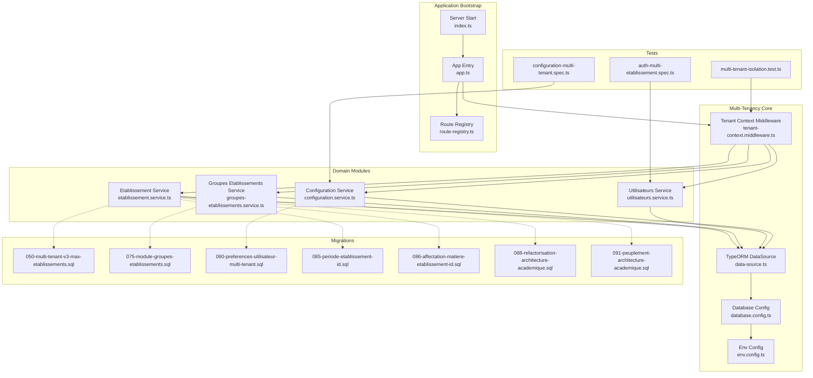
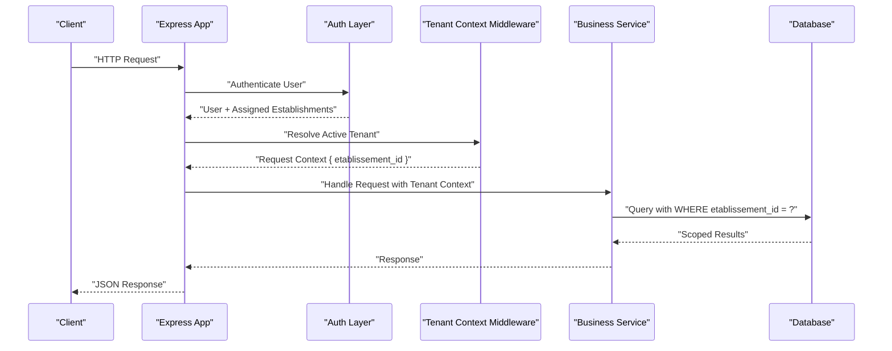
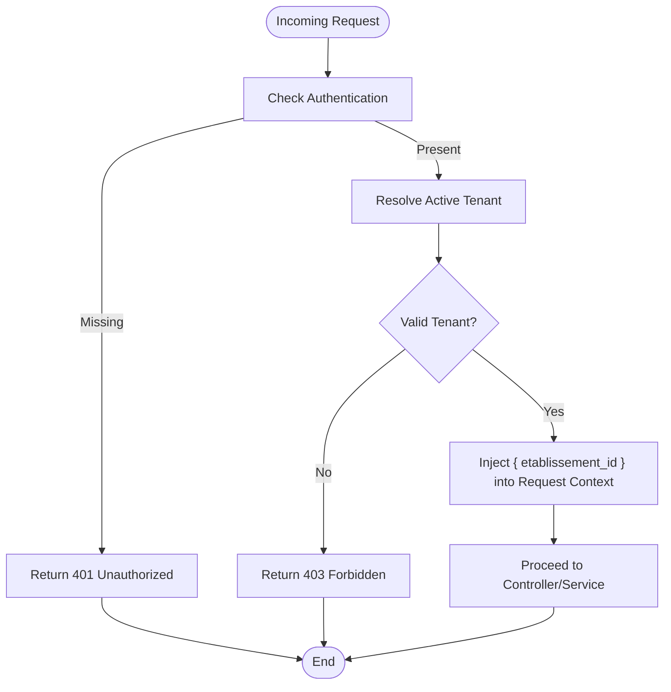
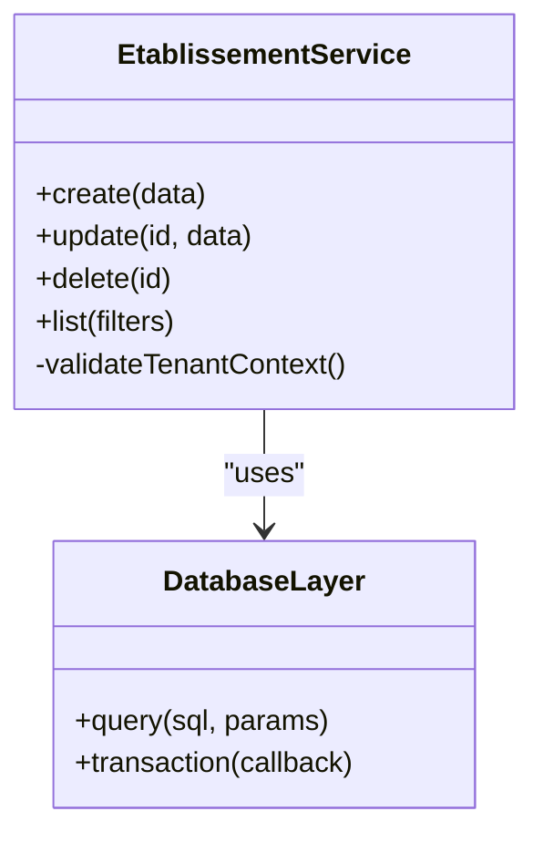
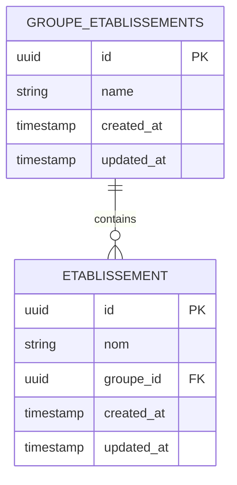
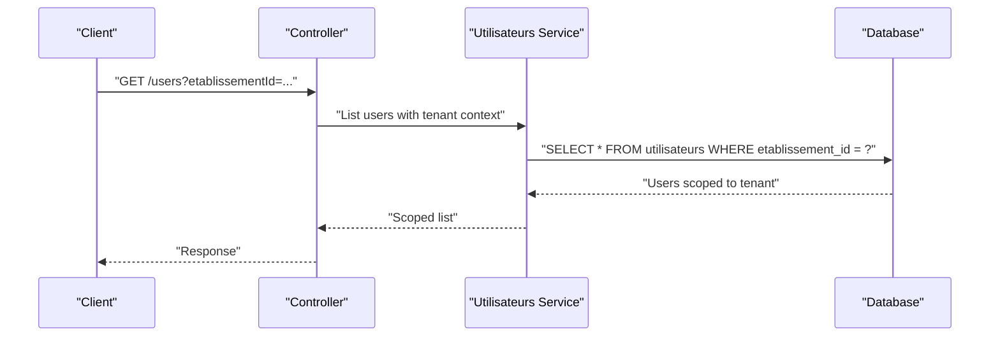
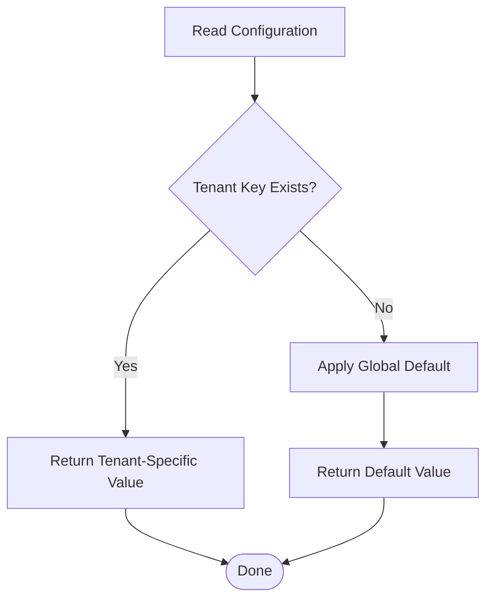
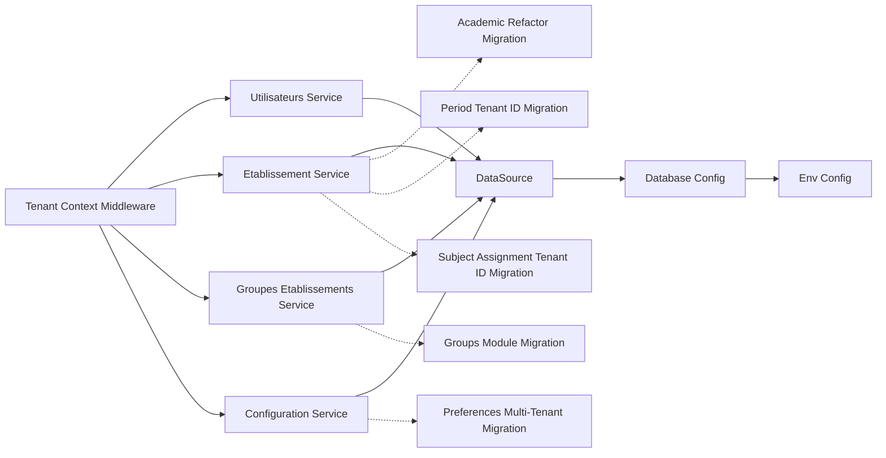

# Multi-Tenancy Engine

<cite>
**Referenced Files in This Document**
- [app.ts](file://backend/src/app.ts)
- [index.ts](file://backend/src/index.ts)
- [database.config.ts](file://backend/src/config/database.config.ts)
- [env.config.ts](file://backend/src/config/env.config.ts)
- [data-source.ts](file://backend/src/database/data-source.ts)
- [route-registry.ts](file://backend/src/routes/route-registry.ts)
- [middleware/tenant-context.middleware.ts](file://backend/src/common/middlewares/tenant-context.middleware.ts)
- [etablissement.service.ts](file://backend/src/modules/etablissement/services/etablissement.service.ts)
- [groupes-etablissements.service.ts](file://backend/src/modules/groupes-etablissements/services/groupes-etablissements.service.ts)
- [utilisateurs.service.ts](file://backend/src/modules/utilisateurs/services/utilisateurs.service.ts)
- [configuration.service.ts](file://backend/src/modules/configuration/services/configuration.service.ts)
- [050-multi-tenant-v3-max-etablissements.sql](file://backend/database/migrations/050-multi-tenant-v3-max-etablissements.sql)
- [075-module-groupes-etablissements.sql](file://backend/database/migrations/075-module-groupes-etablissements.sql)
- [080-preferences-utilisateur-multi-tenant.sql](file://backend/database/migrations/080-preferences-utilisateur-multi-tenant.sql)
- [085-periode-etablissement-id.sql](file://backend/database/migrations/085-periode-etablissement-id.sql)
- [086-affectation-matiere-etablissement-id.sql](file://backend/database/migrations/086-affectation-matiere-etablissement-id.sql)
- [088-refactorisation-architecture-academique.sql](file://backend/database/migrations/088-refactorisation-architecture-academique.sql)
- [091-peuplement-architecture-academique.sql](file://backend/database/migrations/091-peuplement-architecture-academique.sql)
- [multi-tenant-isolation.test.ts](file://backend/test/multi-tenant-isolation.test.ts)
- [auth-multi-etablissement.spec.ts](file://backend/test/integration/auth-multi-etablissement.spec.ts)
- [configuration-multi-tenant.spec.ts](file://backend/test/integration/configuration-multi-tenant.spec.ts)
</cite>

## Table of Contents
1. [Introduction](#introduction)
2. [Project Structure](#project-structure)
3. [Core Components](#core-components)
4. [Architecture Overview](#architecture-overview)
5. [Detailed Component Analysis](#detailed-component-analysis)
6. [Dependency Analysis](#dependency-analysis)
7. [Performance Considerations](#performance-considerations)
8. [Troubleshooting Guide](#troubleshooting-guide)
9. [Conclusion](#conclusion)
10. [Appendices](#appendices)

## Introduction
This document explains eLISAschool’s multi-tenancy engine, focusing on tenant isolation via etablissement_id scoping across all business entities, automatic tenant resolution middleware, group-based tenant organization for hierarchical institution structures, and patterns for cross-tenant operations and data separation. It also covers database schema patterns, query optimization strategies, performance considerations, caching per tenant, migration approaches, and examples of tenant switching, configuration isolation, and resource scoping.

## Project Structure
The multi-tenancy implementation spans configuration, middleware, services, database migrations, and tests:
- Configuration and application bootstrap define the request lifecycle and database connection settings.
- A dedicated middleware resolves and injects the current tenant context into each request.
- Services enforce tenant scoping at the data access layer.
- Migrations introduce or extend etablissement_id columns and indexes to support efficient filtering.
- Tests validate isolation and behavior across tenants.

**Diagram sources**
- [app.ts](file://backend/src/app.ts)
- [index.ts](file://backend/src/index.ts)
- [route-registry.ts](file://backend/src/routes/route-registry.ts)
- [tenant-context.middleware.ts](file://backend/src/common/middlewares/tenant-context.middleware.ts)
- [database.config.ts](file://backend/src/config/database.config.ts)
- [env.config.ts](file://backend/src/config/env.config.ts)
- [data-source.ts](file://backend/src/database/data-source.ts)
- [etablissement.service.ts](file://backend/src/modules/etablissement/services/etablissement.service.ts)
- [groupes-etablissements.service.ts](file://backend/src/modules/groupes-etablissements/services/groupes-etablissements.service.ts)
- [utilisateurs.service.ts](file://backend/src/modules/utilisateurs/services/utilisateurs.service.ts)
- [configuration.service.ts](file://backend/src/modules/configuration/services/configuration.service.ts)
- [050-multi-tenant-v3-max-etablissements.sql](file://backend/database/migrations/050-multi-tenant-v3-max-etablissements.sql)
- [075-module-groupes-etablissements.sql](file://backend/database/migrations/075-module-groupes-etablissements.sql)
- [080-preferences-utilisateur-multi-tenant.sql](file://backend/database/migrations/080-preferences-utilisateur-multi-tenant.sql)
- [085-periode-etablissement-id.sql](file://backend/database/migrations/085-periode-etablissement-id.sql)
- [086-affectation-matiere-etablissement-id.sql](file://backend/database/migrations/086-affectation-matiere-etablissement-id.sql)
- [088-refactorisation-architecture-academique.sql](file://backend/database/migrations/088-refactorisation-architecture-academique.sql)
- [091-peuplement-architecture-academique.sql](file://backend/database/migrations/091-peuplement-architecture-academique.sql)
- [multi-tenant-isolation.test.ts](file://backend/test/multi-tenant-isolation.test.ts)
- [auth-multi-etablissement.spec.ts](file://backend/test/integration/auth-multi-etablissement.spec.ts)
- [configuration-multi-tenant.spec.ts](file://backend/test/integration/configuration-multi-tenant.spec.ts)

**Section sources**
- [app.ts](file://backend/src/app.ts)
- [index.ts](file://backend/src/index.ts)
- [route-registry.ts](file://backend/src/routes/route-registry.ts)
- [tenant-context.middleware.ts](file://backend/src/common/middlewares/tenant-context.middleware.ts)
- [database.config.ts](file://backend/src/config/database.config.ts)
- [env.config.ts](file://backend/src/config/env.config.ts)
- [data-source.ts](file://backend/src/database/data-source.ts)

## Core Components
- Tenant Context Middleware: Resolves the active tenant (etablissement_id) from the authenticated user session and attaches it to the request context so downstream services automatically scope queries.
- Etablissement Service: Manages institutions and ensures all related resources are created and retrieved within the correct tenant boundary.
- Groupes Etablissements Service: Provides hierarchical grouping of establishments, enabling super-admin or regional admin views over multiple tenants while preserving isolation by default.
- Utilisateurs Service: Enforces that users can only access resources belonging to their assigned establishment(s), with explicit checks for cross-tenant actions.
- Configuration Service: Stores and retrieves tenant-scoped preferences and module flags, ensuring configuration isolation per establishment.

Key responsibilities:
- Automatic tenant injection into requests.
- Consistent use of etablissement_id filters in all data operations.
- Explicit authorization checks for cross-tenant operations.
- Isolated configuration storage keyed by tenant.

**Section sources**
- [tenant-context.middleware.ts](file://backend/src/common/middlewares/tenant-context.middleware.ts)
- [etablissement.service.ts](file://backend/src/modules/etablissement/services/etablissement.service.ts)
- [groupes-etablissements.service.ts](file://backend/src/modules/groupes-etablissements/services/groupes-etablissements.service.ts)
- [utilisateurs.service.ts](file://backend/src/modules/utilisateurs/services/utilisateurs.service.ts)
- [configuration.service.ts](file://backend/src/modules/configuration/services/configuration.service.ts)

## Architecture Overview
The multi-tenancy architecture follows a request-scoped pattern:
- Authentication establishes the user identity and associated establishment(s).
- The tenant context middleware extracts the active etablissement_id and persists it in the request context.
- All service-layer queries include an implicit or explicit filter by etablissement_id.
- Cross-tenant operations require explicit privileges and are audited.

**Diagram sources**
- [app.ts](file://backend/src/app.ts)
- [tenant-context.middleware.ts](file://backend/src/common/middlewares/tenant-context.middleware.ts)
- [utilisateurs.service.ts](file://backend/src/modules/utilisateurs/services/utilisateurs.service.ts)
- [data-source.ts](file://backend/src/database/data-source.ts)

## Detailed Component Analysis

### Tenant Resolution Middleware
Responsibilities:
- Extract the active etablissement_id from the authenticated user context.
- Validate that the tenant is allowed for the current user.
- Attach the tenant context to the request object for downstream services.
- Reject requests when no valid tenant is present.

**Diagram sources**
- [tenant-context.middleware.ts](file://backend/src/common/middlewares/tenant-context.middleware.ts)

**Section sources**
- [tenant-context.middleware.ts](file://backend/src/common/middlewares/tenant-context.middleware.ts)

### Etablissement Service Patterns
Patterns:
- Create/Update/Delete operations always include etablissement_id.
- List operations filter by the active tenant context.
- Validation ensures referential integrity within the same tenant.

**Diagram sources**
- [etablissement.service.ts](file://backend/src/modules/etablissement/services/etablissement.service.ts)
- [data-source.ts](file://backend/src/database/data-source.ts)

**Section sources**
- [etablissement.service.ts](file://backend/src/modules/etablissement/services/etablissement.service.ts)

### Group-Based Tenant Organization
Purpose:
- Organize establishments into groups to support hierarchical administration (e.g., regions, networks).
- Enable aggregated views for authorized administrators without breaking per-tenant isolation.

Implementation notes:
- Group membership is stored and validated before allowing cross-tenant reads.
- Aggregation queries explicitly join group membership and apply tenant filters where required.

**Diagram sources**
- [075-module-groupes-etablissements.sql](file://backend/database/migrations/075-module-groupes-etablissements.sql)

**Section sources**
- [groupes-etablissements.service.ts](file://backend/src/modules/groupes-etablissements/services/groupes-etablissements.service.ts)
- [075-module-groupes-etablissements.sql](file://backend/database/migrations/075-module-groupes-etablissements.sql)

### Utilisateurs Service and Access Control
Patterns:
- Users are linked to one or more établissements.
- Default behavior restricts access to the active tenant.
- Cross-tenant operations require elevated permissions and explicit authorization checks.

**Diagram sources**
- [utilisateurs.service.ts](file://backend/src/modules/utilisateurs/services/utilisateurs.service.ts)
- [data-source.ts](file://backend/src/database/data-source.ts)

**Section sources**
- [utilisateurs.service.ts](file://backend/src/modules/utilisateurs/services/utilisateurs.service.ts)

### Configuration Service and Tenant-Specific Settings
Patterns:
- Preferences and module flags are stored per tenant using a tenant key.
- Reads/writes always include the active etablissement_id.
- Global defaults are applied only when tenant-specific values are absent.

**Diagram sources**
- [configuration.service.ts](file://backend/src/modules/configuration/services/configuration.service.ts)
- [080-preferences-utilisateur-multi-tenant.sql](file://backend/database/migrations/080-preferences-utilisateur-multi-tenant.sql)

**Section sources**
- [configuration.service.ts](file://backend/src/modules/configuration/services/configuration.service.ts)
- [080-preferences-utilisateur-multi-tenant.sql](file://backend/database/migrations/080-preferences-utilisateur-multi-tenant.sql)

### Cross-Tenant Operations and Data Separation
Guidelines:
- Always prefer tenant-scoped operations; avoid bypassing tenant filters unless explicitly authorized.
- For cross-tenant reads, verify group membership and role permissions before aggregating data.
- Audit all cross-tenant operations with actor, target tenant(s), and action details.

Examples:
- Super-admin dashboard aggregates metrics across tenants after verifying group membership.
- Regional reports compute totals by joining group membership and applying tenant filters.

[No sources needed since this section provides general guidance]

### Examples: Tenant Switching, Configuration Isolation, Resource Scoping
- Tenant switching: After authentication, select an active establishment from the user’s assigned list; update the request context accordingly.
- Configuration isolation: Store module enablement flags per tenant; read tenant-specific settings first, then fallback to global defaults.
- Resource scoping: Ensure all list/create/update/delete endpoints include the active etablissement_id in queries and validations.

[No sources needed since this section provides general guidance]

## Dependency Analysis
The following diagram shows how core components depend on each other and on database migrations that introduce or enhance tenant-related fields and indexes.

**Diagram sources**
- [tenant-context.middleware.ts](file://backend/src/common/middlewares/tenant-context.middleware.ts)
- [utilisateurs.service.ts](file://backend/src/modules/utilisateurs/services/utilisateurs.service.ts)
- [etablissement.service.ts](file://backend/src/modules/etablissement/services/etablissement.service.ts)
- [groupes-etablissements.service.ts](file://backend/src/modules/groupes-etablissements/services/groupes-etablissements.service.ts)
- [configuration.service.ts](file://backend/src/modules/configuration/services/configuration.service.ts)
- [data-source.ts](file://backend/src/database/data-source.ts)
- [database.config.ts](file://backend/src/config/database.config.ts)
- [env.config.ts](file://backend/src/config/env.config.ts)
- [088-refactorisation-architecture-academique.sql](file://backend/database/migrations/088-refactorisation-architecture-academique.sql)
- [085-periode-etablissement-id.sql](file://backend/database/migrations/085-periode-etablissement-id.sql)
- [086-affectation-matiere-etablissement-id.sql](file://backend/database/migrations/086-affectation-matiere-etablissement-id.sql)
- [075-module-groupes-etablissements.sql](file://backend/database/migrations/075-module-groupes-etablissements.sql)
- [080-preferences-utilisateur-multi-tenant.sql](file://backend/database/migrations/080-preferences-utilisateur-multi-tenant.sql)

**Section sources**
- [tenant-context.middleware.ts](file://backend/src/common/middlewares/tenant-context.middleware.ts)
- [utilisateurs.service.ts](file://backend/src/modules/utilisateurs/services/utilisateurs.service.ts)
- [etablissement.service.ts](file://backend/src/modules/etablissement/services/etablissement.service.ts)
- [groupes-etablissements.service.ts](file://backend/src/modules/groupes-etablissements/services/groupes-etablissements.service.ts)
- [configuration.service.ts](file://backend/src/modules/configuration/services/configuration.service.ts)
- [data-source.ts](file://backend/src/database/data-source.ts)
- [database.config.ts](file://backend/src/config/database.config.ts)
- [env.config.ts](file://backend/src/config/env.config.ts)
- [088-refactorisation-architecture-academique.sql](file://backend/database/migrations/088-refactorisation-architecture-academique.sql)
- [085-periode-etablissement-id.sql](file://backend/database/migrations/085-periode-etablissement-id.sql)
- [086-affectation-matiere-etablissement-id.sql](file://backend/database/migrations/086-affectation-matiere-etablissement-id.sql)
- [075-module-groupes-etablissements.sql](file://backend/database/migrations/075-module-groupes-etablissements.sql)
- [080-preferences-utilisateur-multi-tenant.sql](file://backend/database/migrations/080-preferences-utilisateur-multi-tenant.sql)

## Performance Considerations
- Indexing: Ensure composite indexes exist on frequently filtered columns such as (etablissement_id, status) or (etablissement_id, created_at) to optimize common queries.
- Query design: Prefer narrow selects and pagination to reduce payload size and memory usage under high load.
- Connection pooling: Tune TypeORM pool settings based on expected concurrency and database capacity.
- Caching: Cache tenant-scoped configurations and reference data with keys including etablissement_id to prevent cross-tenant leakage.
- Aggregations: Use materialized views or summary tables for heavy cross-tenant analytics to avoid expensive runtime joins.

[No sources needed since this section provides general guidance]

## Troubleshooting Guide
Common issues and resolutions:
- Missing tenant context: Verify that authentication runs before the tenant middleware and that the user has an active establishment selected.
- Permission errors on cross-tenant operations: Confirm group membership and role permissions; ensure audit logs capture the actor and target tenant.
- Stale cache entries: Invalidate tenant-scoped caches when configuration changes occur; include etablissement_id in cache keys.
- Slow queries: Inspect execution plans for missing indexes on tenant-scoped filters; add composite indexes where necessary.

Validation references:
- Isolation tests confirm that data cannot leak across tenants.
- Integration tests validate authentication and configuration scoping.

**Section sources**
- [multi-tenant-isolation.test.ts](file://backend/test/multi-tenant-isolation.test.ts)
- [auth-multi-etablissement.spec.ts](file://backend/test/integration/auth-multi-etablissement.spec.ts)
- [configuration-multi-tenant.spec.ts](file://backend/test/integration/configuration-multi-tenant.spec.ts)

## Conclusion
eLISAschool’s multi-tenancy engine enforces strict tenant isolation through a consistent etablissement_id scoping strategy, automated tenant resolution, and disciplined service-layer patterns. Hierarchical group organization enables controlled cross-tenant visibility for administrators while preserving data boundaries. With careful indexing, caching, and migration practices, the system scales efficiently and remains secure across tenants.

## Appendices

### Database Schema Patterns for Multi-Tenancy
- Tenant column presence: Most business entities include an etablissement_id foreign key to enforce isolation.
- Composite indexes: Add indexes combining tenant identifiers with frequent filter columns.
- Reference data scoping: Even lookup tables may be tenant-scoped when they contain institution-specific options.

Relevant migrations:
- Maximum establishments and tenant constraints.
- Group-based organization of establishments.
- Tenant-aware preferences and configuration.
- Academic structure refactoring and population.

**Section sources**
- [050-multi-tenant-v3-max-etablissements.sql](file://backend/database/migrations/050-multi-tenant-v3-max-etablissements.sql)
- [075-module-groupes-etablissements.sql](file://backend/database/migrations/075-module-groupes-etablissements.sql)
- [080-preferences-utilisateur-multi-tenant.sql](file://backend/database/migrations/080-preferences-utilisateur-multi-tenant.sql)
- [085-periode-etablissement-id.sql](file://backend/database/migrations/085-periode-etablissement-id.sql)
- [086-affectation-matiere-etablissement-id.sql](file://backend/database/migrations/086-affectation-matiere-etablissement-id.sql)
- [088-refactorisation-architecture-academique.sql](file://backend/database/migrations/088-refactorisation-architecture-academique.sql)
- [091-peuplement-architecture-academique.sql](file://backend/database/migrations/091-peuplement-architecture-academique.sql)