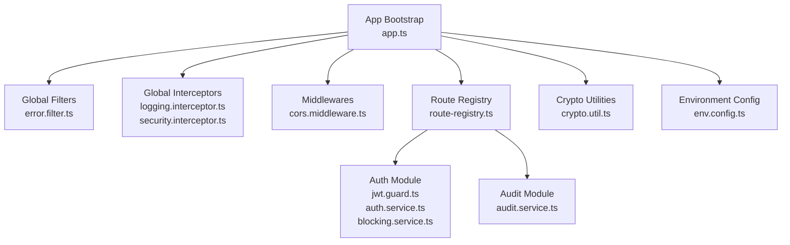
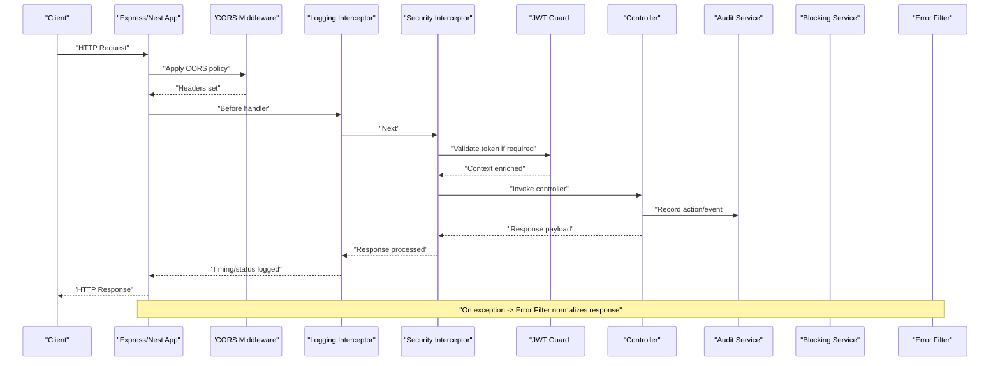
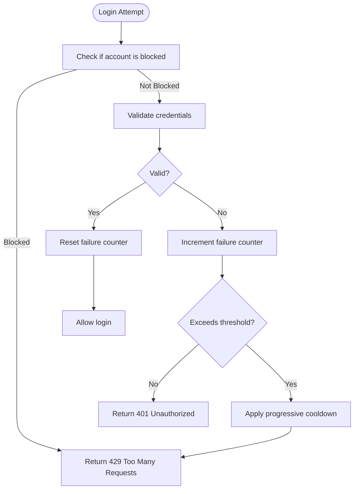
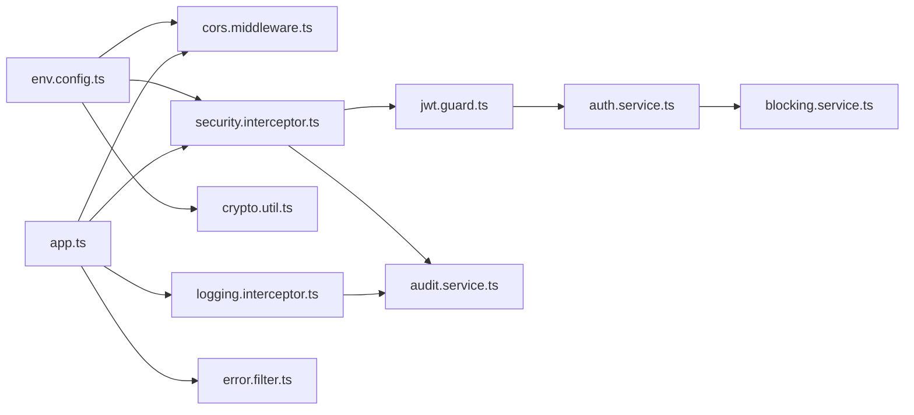

# Security Infrastructure

<cite>
**Referenced Files in This Document**
- [app.ts](file://backend/src/app.ts)
- [index.ts](file://backend/src/index.ts)
- [route-registry.ts](file://backend/src/routes/route-registry.ts)
- [filters/error.filter.ts](file://backend/src/common/filters/error.filter.ts)
- [interceptors/logging.interceptor.ts](file://backend/src/common/interceptors/logging.interceptor.ts)
- [interceptors/security.interceptor.ts](file://backend/src/common/interceptors/security.interceptor.ts)
- [middlewares/cors.middleware.ts](file://backend/src/common/middlewares/cors.middleware.ts)
- [auth/auth.service.ts](file://backend/src/modules/auth/auth.service.ts)
- [auth/guards/jwt.guard.ts](file://backend/src/modules/auth/guards/jwt.guard.ts)
- [auth/services/blocking.service.ts](file://backend/src/modules/auth/services/blocking.service.ts)
- [audit/audit.service.ts](file://backend/src/modules/audit/audit.service.ts)
- [utils/crypto.util.ts](file://backend/src/common/utils/crypto.util.ts)
- [config/env.config.ts](file://backend/src/config/env.config.ts)
- [common/index.ts](file://backend/src/common/index.ts)
</cite>

## Table of Contents
1. [Introduction](#introduction)
2. [Project Structure](#project-structure)
3. [Core Components](#core-components)
4. [Architecture Overview](#architecture-overview)
5. [Detailed Component Analysis](#detailed-component-analysis)
6. [Dependency Analysis](#dependency-analysis)
7. [Performance Considerations](#performance-considerations)
8. [Troubleshooting Guide](#troubleshooting-guide)
9. [Conclusion](#conclusion)
10. [Appendices](#appendices)

## Introduction
This document describes eLISAschool’s security infrastructure with a focus on:
- Error filtering for consistent error responses and security headers
- Request/response interceptors for logging, auditing, and security enhancements
- Authentication blocking service implementing progressive account lockout
- Audit trail system capturing user actions, data changes, and security events
- Encryption utilities for sensitive data protection and secure communication patterns
- Examples for custom security filters, audit logging, and handling security exceptions
- Security headers, CORS configuration, input validation, and output encoding strategies

The goal is to provide both high-level architecture understanding and practical guidance for extending the security surface safely and consistently.

## Project Structure
Security-related components are organized under common modules and feature modules:
- Common layer: filters, interceptors, middlewares, utilities
- Auth module: guards, services, blocking logic
- Audit module: centralized audit logging
- Configuration: environment-driven settings (CORS, headers, crypto)
- App bootstrap: wiring of global filters, interceptors, and middlewares

**Diagram sources**
- [app.ts](file://backend/src/app.ts)
- [filters/error.filter.ts](file://backend/src/common/filters/error.filter.ts)
- [interceptors/logging.interceptor.ts](file://backend/src/common/interceptors/logging.interceptor.ts)
- [interceptors/security.interceptor.ts](file://backend/src/common/interceptors/security.interceptor.ts)
- [middlewares/cors.middleware.ts](file://backend/src/common/middlewares/cors.middleware.ts)
- [route-registry.ts](file://backend/src/routes/route-registry.ts)
- [guards/jwt.guard.ts](file://backend/src/modules/auth/guards/jwt.guard.ts)
- [auth.service.ts](file://backend/src/modules/auth/auth.service.ts)
- [blocking.service.ts](file://backend/src/modules/auth/services/blocking.service.ts)
- [audit.service.ts](file://backend/src/modules/audit/audit.service.ts)
- [crypto.util.ts](file://backend/src/common/utils/crypto.util.ts)
- [env.config.ts](file://backend/src/config/env.config.ts)

**Section sources**
- [app.ts](file://backend/src/app.ts)
- [common/index.ts](file://backend/src/common/index.ts)

## Core Components
- Global error filter: normalizes all errors into consistent JSON responses and attaches security headers.
- Logging interceptor: captures request metadata, timing, and response status for observability.
- Security interceptor: enforces security headers, sanitizes inputs, and applies output encoding where applicable.
- CORS middleware: configures allowed origins, methods, headers, and credentials based on environment.
- JWT guard: validates tokens and enriches context for downstream authorization checks.
- Blocking service: implements progressive lockout thresholds and cooldowns for failed authentication attempts.
- Audit service: records user actions, data mutations, and security events with contextual metadata.
- Crypto utilities: provides hashing, encryption/decryption helpers for sensitive payloads and secrets.
- Environment config: centralizes security-sensitive settings such as CORS policies, header directives, and crypto parameters.

**Section sources**
- [filters/error.filter.ts](file://backend/src/common/filters/error.filter.ts)
- [interceptors/logging.interceptor.ts](file://backend/src/common/interceptors/logging.interceptor.ts)
- [interceptors/security.interceptor.ts](file://backend/src/common/interceptors/security.interceptor.ts)
- [middlewares/cors.middleware.ts](file://backend/src/common/middlewares/cors.middleware.ts)
- [guards/jwt.guard.ts](file://backend/src/modules/auth/guards/jwt.guard.ts)
- [auth.service.ts](file://backend/src/modules/auth/auth.service.ts)
- [blocking.service.ts](file://backend/src/modules/auth/services/blocking.service.ts)
- [audit.service.ts](file://backend/src/modules/audit/audit.service.ts)
- [crypto.util.ts](file://backend/src/common/utils/crypto.util.ts)
- [env.config.ts](file://backend/src/config/env.config.ts)

## Architecture Overview
End-to-end flow from HTTP request to response with security layers applied:

**Diagram sources**
- [middlewares/cors.middleware.ts](file://backend/src/common/middlewares/cors.middleware.ts)
- [interceptors/logging.interceptor.ts](file://backend/src/common/interceptors/logging.interceptor.ts)
- [interceptors/security.interceptor.ts](file://backend/src/common/interceptors/security.interceptor.ts)
- [guards/jwt.guard.ts](file://backend/src/modules/auth/guards/jwt.guard.ts)
- [audit.service.ts](file://backend/src/modules/audit/audit.service.ts)
- [blocking.service.ts](file://backend/src/modules/auth/services/blocking.service.ts)
- [filters/error.filter.ts](file://backend/src/common/filters/error.filter.ts)

## Detailed Component Analysis

### Error Filtering System
Purpose:
- Provide uniform error responses across all endpoints
- Attach security headers to every response
- Prevent leaking internal stack traces or sensitive details

Key behaviors:
- Centralized exception handling that maps domain-specific errors to standardized JSON structures
- Enforced security headers (e.g., content-type, cache-control, X-Content-Type-Options, etc.)
- Optional correlation IDs for tracing requests through logs

Implementation notes:
- Register globally during app bootstrap so it catches unhandled exceptions
- Ensure business logic throws typed exceptions rather than raw strings to preserve structure

Example usage pattern:
- Throw a typed exception in controllers/services; the filter converts it to a safe response

**Section sources**
- [filters/error.filter.ts](file://backend/src/common/filters/error.filter.ts)
- [app.ts](file://backend/src/app.ts)

### Request/Response Interceptors
Logging Interceptor:
- Captures method, path, IP, user context, timestamps, and response duration
- Emits structured logs suitable for aggregation and alerting

Security Interceptor:
- Applies security headers to responses
- Sanitizes inputs and encodes outputs where appropriate
- Integrates with auth context for per-request decisions

Usage examples:
- Apply logging interceptor globally
- Apply security interceptor globally or selectively on sensitive routes

**Section sources**
- [interceptors/logging.interceptor.ts](file://backend/src/common/interceptors/logging.interceptor.ts)
- [interceptors/security.interceptor.ts](file://backend/src/common/interceptors/security.interceptor.ts)
- [app.ts](file://backend/src/app.ts)

### Authentication Blocking Service (Progressive Lockout)
Goal:
- Protect against brute-force attacks by progressively locking accounts after repeated failures
- Implement time-based cooldowns that increase with each failure threshold

Core concepts:
- Track failed attempts per identity (e.g., username/email)
- Define thresholds and exponential backoff intervals
- Persist counters and last attempt timestamps for resilience across restarts

Flow:

Operational considerations:
- Use a fast store (e.g., in-memory or Redis) for counters in production
- Expose metrics for monitoring lockout spikes
- Integrate with audit service to record lockout events

**Diagram sources**
- [blocking.service.ts](file://backend/src/modules/auth/services/blocking.service.ts)
- [auth.service.ts](file://backend/src/modules/auth/auth.service.ts)

**Section sources**
- [blocking.service.ts](file://backend/src/modules/auth/services/blocking.service.ts)
- [auth.service.ts](file://backend/src/modules/auth/auth.service.ts)

### Audit Trail System
Scope:
- Capture user actions (create, update, delete), data changes (before/after snapshots), and security events (login success/failure, lockouts)

Design:
- Centralized audit service with pluggable writers (database, message queue)
- Context enrichment via request-scoped metadata (user id, tenant, ip, user-agent)
- Redaction rules to avoid logging sensitive fields (passwords, tokens)

Integration points:
- Controllers invoke audit service around critical operations
- Security interceptor can emit security events automatically

**Section sources**
- [audit.service.ts](file://backend/src/modules/audit/audit.service.ts)
- [interceptors/security.interceptor.ts](file://backend/src/common/interceptors/security.interceptor.ts)

### Encryption Utilities
Capabilities:
- Hashing for passwords and secrets using strong algorithms
- Symmetric encryption/decryption for sensitive payloads at rest or in transit when needed
- Key management helpers (rotation support, envelope encryption patterns)

Best practices:
- Never log plaintext secrets or decrypted payloads
- Use environment-backed keys and rotate regularly
- Prefer authenticated encryption modes

**Section sources**
- [crypto.util.ts](file://backend/src/common/utils/crypto.util.ts)
- [env.config.ts](file://backend/src/config/env.config.ts)

### Security Headers and CORS Configuration
Security headers:
- Content-Security-Policy, X-Frame-Options, X-Content-Type-Options, Referrer-Policy, Strict-Transport-Security, Permissions-Policy
- Controlled via security interceptor or dedicated header middleware

CORS:
- Configure allowed origins, methods, headers, and credentials
- Restrict to known domains in production
- Enable preflight caching where appropriate

**Section sources**
- [interceptors/security.interceptor.ts](file://backend/src/common/interceptors/security.interceptor.ts)
- [middlewares/cors.middleware.ts](file://backend/src/common/middlewares/cors.middleware.ts)
- [env.config.ts](file://backend/src/config/env.config.ts)

### Input Validation and Output Encoding
Input validation:
- Validate DTOs at entry points (controllers or interceptors)
- Reject malformed or oversized payloads early
- Normalize and sanitize dangerous characters

Output encoding:
- Ensure JSON responses are properly encoded
- Avoid injecting raw HTML into responses unless explicitly intended and sanitized

**Section sources**
- [interceptors/security.interceptor.ts](file://backend/src/common/interceptors/security.interceptor.ts)

## Dependency Analysis
High-level dependencies among security components:

**Diagram sources**
- [env.config.ts](file://backend/src/config/env.config.ts)
- [middlewares/cors.middleware.ts](file://backend/src/common/middlewares/cors.middleware.ts)
- [interceptors/security.interceptor.ts](file://backend/src/common/interceptors/security.interceptor.ts)
- [interceptors/logging.interceptor.ts](file://backend/src/common/interceptors/logging.interceptor.ts)
- [filters/error.filter.ts](file://backend/src/common/filters/error.filter.ts)
- [guards/jwt.guard.ts](file://backend/src/modules/auth/guards/jwt.guard.ts)
- [auth.service.ts](file://backend/src/modules/auth/auth.service.ts)
- [blocking.service.ts](file://backend/src/modules/auth/services/blocking.service.ts)
- [audit.service.ts](file://backend/src/modules/audit/audit.service.ts)
- [app.ts](file://backend/src/app.ts)

**Section sources**
- [common/index.ts](file://backend/src/common/index.ts)
- [app.ts](file://backend/src/app.ts)

## Performance Considerations
- Keep logging lightweight; sample high-frequency logs in hot paths
- Offload audit writes asynchronously to avoid blocking request latency
- Cache CORS preflight results and security headers where possible
- Use efficient stores for lockout counters (in-memory with persistence or Redis)
- Avoid heavy cryptographic operations on every request; batch or cache where safe

[No sources needed since this section provides general guidance]

## Troubleshooting Guide
Common issues and resolutions:
- Missing security headers: verify global registration of security interceptor and ensure no route overrides headers
- CORS failures: confirm allowed origins and credentials flags match client expectations
- Lockout false positives: check counter storage backend and reset mechanisms
- Audit gaps: ensure audit calls are wrapped around all mutating operations and that async writers are healthy
- Error responses inconsistent: validate that all controllers throw typed exceptions and that the global error filter is registered first

Actionable checks:
- Inspect request/response logs for missing fields or unexpected codes
- Review audit entries for redaction correctness and completeness
- Validate environment variables for crypto keys and CORS policies

**Section sources**
- [filters/error.filter.ts](file://backend/src/common/filters/error.filter.ts)
- [interceptors/security.interceptor.ts](file://backend/src/common/interceptors/security.interceptor.ts)
- [middlewares/cors.middleware.ts](file://backend/src/common/middlewares/cors.middleware.ts)
- [audit.service.ts](file://backend/src/modules/audit/audit.service.ts)
- [blocking.service.ts](file://backend/src/modules/auth/services/blocking.service.ts)

## Conclusion
eLISAschool’s security infrastructure combines layered defenses:
- Consistent error handling and security headers
- Comprehensive logging and auditing
- Progressive lockout to mitigate brute-force attacks
- Strong cryptography utilities and strict CORS policies
Adhering to these patterns ensures robust protection while maintaining clarity and extensibility.

[No sources needed since this section summarizes without analyzing specific files]

## Appendices

### Example: Implementing a Custom Security Filter
Steps:
- Create a new filter class that extends the base error filter
- Map additional domain errors to standardized responses
- Register the filter globally in app bootstrap

Reference locations:
- Base error filter implementation
- App bootstrap registration

**Section sources**
- [filters/error.filter.ts](file://backend/src/common/filters/error.filter.ts)
- [app.ts](file://backend/src/app.ts)

### Example: Adding Audit Logging
Steps:
- Wrap critical controller methods with audit service calls
- Include before/after snapshots for mutations
- Ensure sensitive fields are redacted

Reference locations:
- Audit service API
- Security interceptor integration point

**Section sources**
- [audit.service.ts](file://backend/src/modules/audit/audit.service.ts)
- [interceptors/security.interceptor.ts](file://backend/src/common/interceptors/security.interceptor.ts)

### Example: Handling Security Exceptions
Steps:
- Throw typed security exceptions in guards or services
- Let the global error filter convert them to safe responses
- Record relevant security events in the audit trail

Reference locations:
- JWT guard behavior
- Error filter mapping
- Audit event emission

**Section sources**
- [guards/jwt.guard.ts](file://backend/src/modules/auth/guards/jwt.guard.ts)
- [filters/error.filter.ts](file://backend/src/common/filters/error.filter.ts)
- [audit.service.ts](file://backend/src/modules/audit/audit.service.ts)