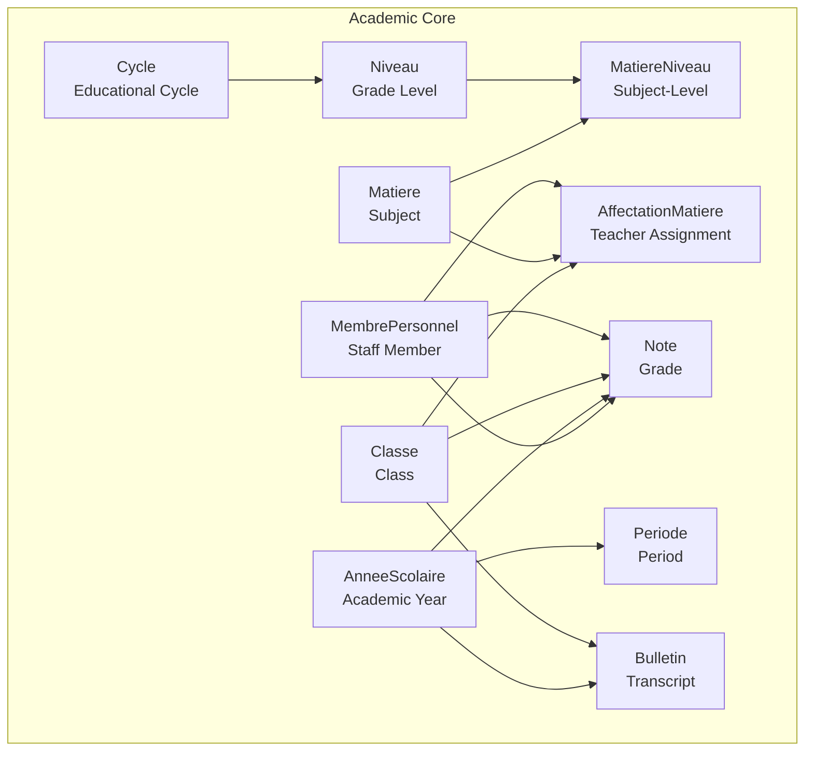
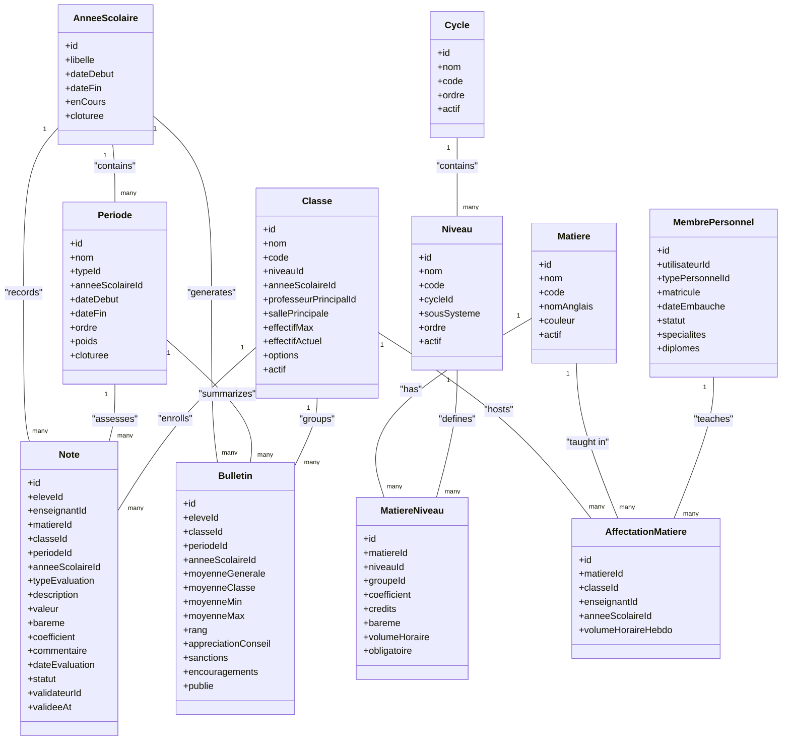
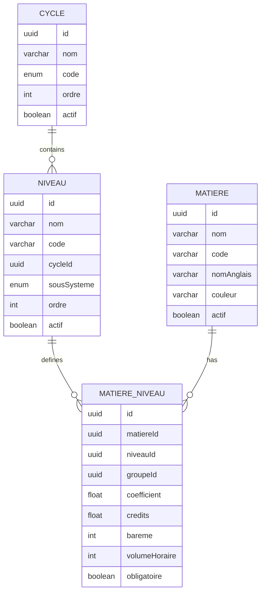
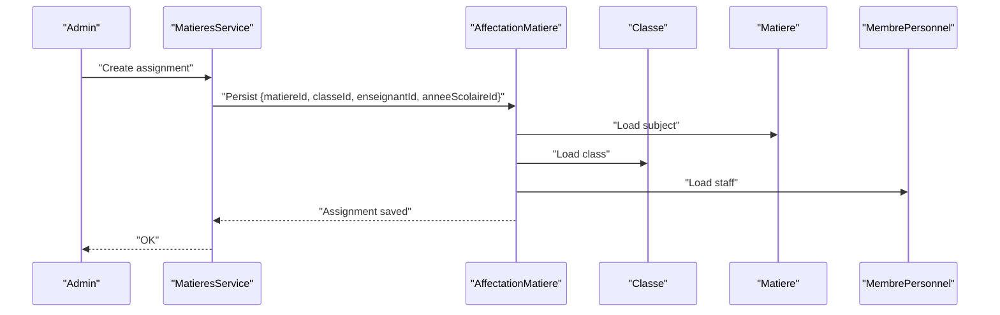
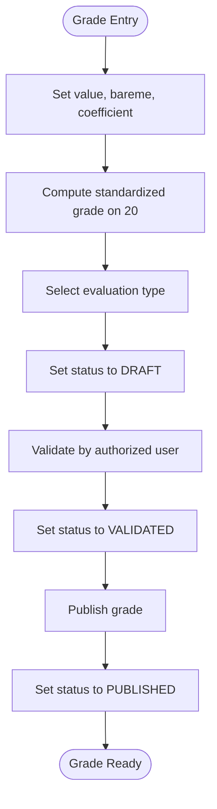
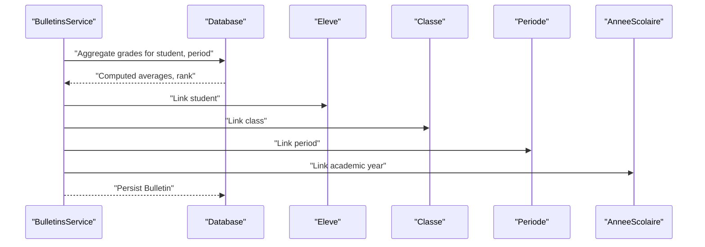
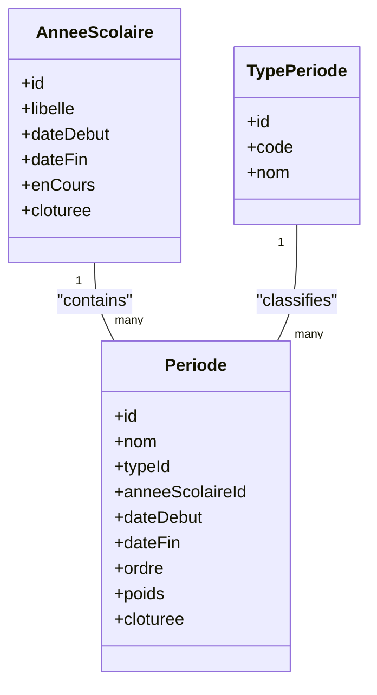
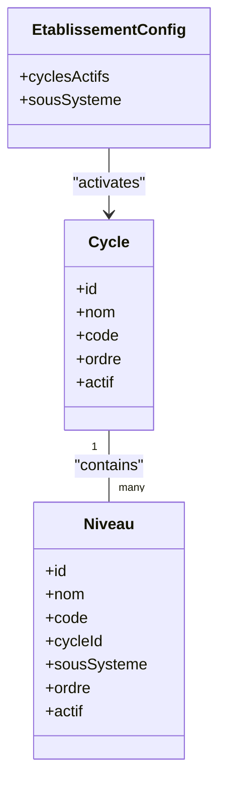
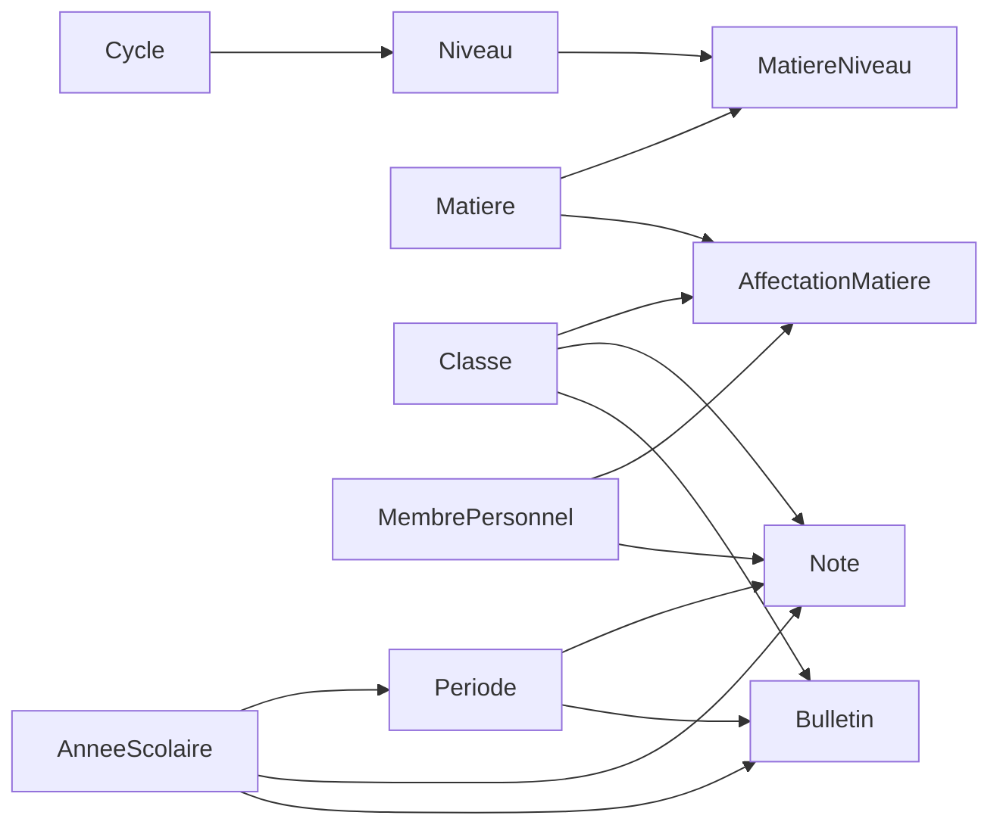

# Academic Entities

<cite>
**Referenced Files in This Document**
- [matiere.entity.ts](file://backend/src/modules/matieres/entities/matiere.entity.ts)
- [affectation-matiere.entity.ts](file://backend/src/modules/matieres/entities/affectation-matiere.entity.ts)
- [matiere-niveau.entity.ts](file://backend/src/modules/matieres/entities/matiere-niveau.entity.ts)
- [note.entity.ts](file://backend/src/modules/notes/entities/note.entity.ts)
- [bulletin.entity.ts](file://backend/src/modules/bulletins/entities/bulletin.entity.ts)
- [periode.entity.ts](file://backend/src/modules/periodes/entities/periode.entity.ts)
- [annee-scolaire.entity.ts](file://backend/src/modules/annees-scolaires/entities/annee-scolaire.entity.ts)
- [cycle.entity.ts](file://backend/src/modules/cycles/entities/cycle.entity.ts)
- [niveau.entity.ts](file://backend/src/modules/niveaux/entities/niveau.entity.ts)
- [classe.entity.ts](file://backend/src/modules/classes/entities/classe.entity.ts)
- [personnel.entity.ts](file://backend/src/modules/personnel/entities/personnel.entity.ts)
- [etablissement.entity.ts](file://backend/src/modules/etablissement/entities/etablissement.entity.ts)
</cite>

## Table of Contents
1. [Introduction](#introduction)
2. [Project Structure](#project-structure)
3. [Core Components](#core-components)
4. [Architecture Overview](#architecture-overview)
5. [Detailed Component Analysis](#detailed-component-analysis)
6. [Dependency Analysis](#dependency-analysis)
7. [Performance Considerations](#performance-considerations)
8. [Troubleshooting Guide](#troubleshooting-guide)
9. [Conclusion](#conclusion)

## Introduction
This document describes the academic data model used in eLISAschool. It focuses on the entities that define subjects, curriculum structure, teacher assignments, grades, transcripts, periods, academic years, and cycles. It explains relationships, constraints, and business rules that govern academic workflows such as curriculum delivery, grade recording, and transcript generation.

## Project Structure
The academic domain is organized around dedicated modules under backend/src/modules. The relevant modules for this document are:
- matieres: subject and curriculum entities
- notes: grade records
- bulletins: transcripts
- periodes: periods within an academic year
- annees-scolaires: academic year lifecycle
- cycles and niveaux: educational program structure
- classes and personnel: organizational units and staff
- etablissement: institution configuration and system variants

**Diagram sources**
- [matiere.entity.ts:36-62](file://backend/src/modules/matieres/entities/matiere.entity.ts#L36-L62)
- [matiere-niveau.entity.ts:20-71](file://backend/src/modules/matieres/entities/matiere-niveau.entity.ts#L20-L71)
- [affectation-matiere.entity.ts:22-66](file://backend/src/modules/matieres/entities/affectation-matiere.entity.ts#L22-L66)
- [classe.entity.ts:21-76](file://backend/src/modules/classes/entities/classe.entity.ts#L21-L76)
- [niveau.entity.ts:20-54](file://backend/src/modules/niveaux/entities/niveau.entity.ts#L20-L54)
- [cycle.entity.ts:17-40](file://backend/src/modules/cycles/entities/cycle.entity.ts#L17-L40)
- [annee-scolaire.entity.ts:15-41](file://backend/src/modules/annees-scolaires/entities/annee-scolaire.entity.ts#L15-L41)
- [periode.entity.ts:34-79](file://backend/src/modules/periodes/entities/periode.entity.ts#L34-L79)
- [note.entity.ts:45-142](file://backend/src/modules/notes/entities/note.entity.ts#L45-L142)
- [bulletin.entity.ts:23-93](file://backend/src/modules/bulletins/entities/bulletin.entity.ts#L23-L93)
- [personnel.entity.ts:38-79](file://backend/src/modules/personnel/entities/personnel.entity.ts#L38-L79)

**Section sources**
- [matiere.entity.ts:1-62](file://backend/src/modules/matieres/entities/matiere.entity.ts#L1-L62)
- [matiere-niveau.entity.ts:1-71](file://backend/src/modules/matieres/entities/matiere-niveau.entity.ts#L1-L71)
- [affectation-matiere.entity.ts:1-66](file://backend/src/modules/matieres/entities/affectation-matiere.entity.ts#L1-L66)
- [note.entity.ts:1-142](file://backend/src/modules/notes/entities/note.entity.ts#L1-L142)
- [bulletin.entity.ts:1-93](file://backend/src/modules/bulletins/entities/bulletin.entity.ts#L1-L93)
- [periode.entity.ts:1-79](file://backend/src/modules/periodes/entities/periode.entity.ts#L1-L79)
- [annee-scolaire.entity.ts:1-41](file://backend/src/modules/annees-scolaires/entities/annee-scolaire.entity.ts#L1-L41)
- [cycle.entity.ts:1-40](file://backend/src/modules/cycles/entities/cycle.entity.ts#L1-L40)
- [niveau.entity.ts:1-54](file://backend/src/modules/niveaux/entities/niveau.entity.ts#L1-L54)
- [classe.entity.ts:1-76](file://backend/src/modules/classes/entities/classe.entity.ts#L1-L76)
- [personnel.entity.ts:1-79](file://backend/src/modules/personnel/entities/personnel.entity.ts#L1-L79)
- [etablissement.entity.ts:1-93](file://backend/src/modules/etablissement/entities/etablissement.entity.ts#L1-L93)

## Core Components
This section documents the primary academic entities and their roles.

- Subject (Matiere)
  - Purpose: Defines a subject (e.g., Mathematics, French) with metadata such as name, code, color, and activity flag.
  - Key attributes: UUID identifier, unique name, optional code, optional English name, color, activity status, timestamps.
  - Constraints: Unique subject name enforced at the database level.
  - Notes: A grouping concept (GroupeMatiere) exists alongside subjects but is not part of the core objective here.

- Subject-Level (MatiereNiveau)
  - Purpose: Links a subject to a grade level and defines curriculum details for that combination.
  - Key attributes: UUID identifier, subject and level foreign keys, group reference (optional), coefficient, credits (anglophone system), scale (bareme), weekly hours, requirement (obligatoire), timestamps.
  - Business rules:
    - Coefficient is mandatory for francophone grading.
    - Credits are optional and intended for anglophone/LMD systems.
    - Bareme indicates the maximum score scale (e.g., 20, 100, 10).
    - Weekly hours and requirement flags support curriculum planning.

- Teacher Assignment (AffectationMatiere)
  - Purpose: Assigns a staff member to teach a specific subject within a class during an academic year.
  - Key attributes: UUID identifier, subject, class, staff member, academic year, weekly workload, timestamps.
  - Constraints: Indexes on class and staff member aid query performance.
  - Notes: Connects to Classe, MembrePersonnel, and AnneeScolaire.

- Grade (Note)
  - Purpose: Records a single assessment result for a student in a subject during a period.
  - Key attributes: UUID identifier, student, teacher (via user identity), subject, class, period, academic year, evaluation type, description, raw value, scale (bareme), coefficient, comment, evaluation date, status (draft, validated, published), validator and timestamp, timestamps.
  - Business rules:
    - Evaluation types enumerate common assessment categories.
    - Status controls lifecycle: draft -> validated -> published.
    - Standardized grade on 20 computed via value/bareme*20.
    - Indexes optimize queries by student, subject, class, period, and teacher.

- Transcript (Bulletin)
  - Purpose: Aggregates a student’s performance for a period into a report card.
  - Key attributes: UUID identifier, student, class, period, academic year, computed averages (general, class, min, max), rank, council comments, sanctions, encouragements, publication flag, timestamps.
  - Business rules:
    - Stores precomputed metrics to avoid heavy historical recomputations.
    - Publication flag controls visibility.

- Period (Periode)
  - Purpose: Defines a time window within an academic year (e.g., trimester, semester, sequence).
  - Key attributes: UUID identifier, name, type (TypePeriode), academic year, start/end dates, order, weight (poids), closure flag, timestamps.
  - Business rules:
    - Weight supports annual aggregation.
    - Closure prevents further changes after closing.

- Academic Year (AnneeScolaire)
  - Purpose: Represents the school year with lifecycle flags.
  - Key attributes: UUID identifier, label, start/end dates, current and closed flags, timestamps.
  - Business rules:
    - Exactly one “current” year at a time.
    - Closed year cannot accept new changes.

- Cycle and Level (Cycle, Niveau)
  - Purpose: Define the educational program structure and grade levels.
  - Key attributes:
    - Cycle: code (MATERNELLE, PRIMAIRE, COLLEGE, LYCEE), order, activity flag.
    - Niveau: name/code, cycle, subsystem (francophone/anglophone/bicultural), order, activity flag.
  - Business rules:
    - Levels belong to a cycle.
    - Subsystem influences grading and curriculum defaults.

- Class (Classe)
  - Purpose: Groups students by level and academic year, with a homeroom teacher and capacity.
  - Key attributes: UUID identifier, name/code, level, academic year, homeroom teacher, room, max/current enrollment, options, activity flag, timestamps.

- Staff (MembrePersonnel)
  - Purpose: Associates a user account to staff with role and employment details.
  - Key attributes: UUID identifier, user, staff type, badge number, hire date, status, specialties, qualifications, timestamps.

**Section sources**
- [matiere.entity.ts:36-62](file://backend/src/modules/matieres/entities/matiere.entity.ts#L36-L62)
- [matiere-niveau.entity.ts:20-71](file://backend/src/modules/matieres/entities/matiere-niveau.entity.ts#L20-L71)
- [affectation-matiere.entity.ts:22-66](file://backend/src/modules/matieres/entities/affectation-matiere.entity.ts#L22-L66)
- [note.entity.ts:45-142](file://backend/src/modules/notes/entities/note.entity.ts#L45-L142)
- [bulletin.entity.ts:23-93](file://backend/src/modules/bulletins/entities/bulletin.entity.ts#L23-L93)
- [periode.entity.ts:34-79](file://backend/src/modules/periodes/entities/periode.entity.ts#L34-L79)
- [annee-scolaire.entity.ts:15-41](file://backend/src/modules/annees-scolaires/entities/annee-scolaire.entity.ts#L15-L41)
- [cycle.entity.ts:17-40](file://backend/src/modules/cycles/entities/cycle.entity.ts#L17-L40)
- [niveau.entity.ts:20-54](file://backend/src/modules/niveaux/entities/niveau.entity.ts#L20-L54)
- [classe.entity.ts:21-76](file://backend/src/modules/classes/entities/classe.entity.ts#L21-L76)
- [personnel.entity.ts:38-79](file://backend/src/modules/personnel/entities/personnel.entity.ts#L38-L79)

## Architecture Overview
The academic entities form a cohesive model centered on the student’s learning journey. The relationships connect subjects to levels (curriculum), teachers to subjects and classes (assignments), grades to students and periods (assessments), and transcripts to periods and students (summaries). Academic year and period define temporal boundaries, while cycle and level structure the educational framework.

**Diagram sources**
- [matiere.entity.ts:36-62](file://backend/src/modules/matieres/entities/matiere.entity.ts#L36-L62)
- [matiere-niveau.entity.ts:20-71](file://backend/src/modules/matieres/entities/matiere-niveau.entity.ts#L20-L71)
- [affectation-matiere.entity.ts:22-66](file://backend/src/modules/matieres/entities/affectation-matiere.entity.ts#L22-L66)
- [note.entity.ts:45-142](file://backend/src/modules/notes/entities/note.entity.ts#L45-L142)
- [bulletin.entity.ts:23-93](file://backend/src/modules/bulletins/entities/bulletin.entity.ts#L23-L93)
- [periode.entity.ts:34-79](file://backend/src/modules/periodes/entities/periode.entity.ts#L34-L79)
- [annee-scolaire.entity.ts:15-41](file://backend/src/modules/annees-scolaires/entities/annee-scolaire.entity.ts#L15-L41)
- [cycle.entity.ts:17-40](file://backend/src/modules/cycles/entities/cycle.entity.ts#L17-L40)
- [niveau.entity.ts:20-54](file://backend/src/modules/niveaux/entities/niveau.entity.ts#L20-L54)
- [classe.entity.ts:21-76](file://backend/src/modules/classes/entities/classe.entity.ts#L21-L76)
- [personnel.entity.ts:38-79](file://backend/src/modules/personnel/entities/personnel.entity.ts#L38-L79)

## Detailed Component Analysis

### Subject (Matiere) and Curriculum (MatiereNiveau)
- Subject definition: Unique subject name, optional code and English name, color, activity flag, timestamps.
- Curriculum linkage: MatiereNiveau connects a subject to a level, optionally to a group, and defines grading parameters (coefficient, credits, bareme, weekly hours) and requirement flag.
- Business rules:
  - Coefficient mandatory for francophone grading.
  - Bareme determines the maximum score scale.
  - Weekly hours and obligation support course load and requirements.

**Diagram sources**
- [matiere.entity.ts:36-62](file://backend/src/modules/matieres/entities/matiere.entity.ts#L36-L62)
- [matiere-niveau.entity.ts:20-71](file://backend/src/modules/matieres/entities/matiere-niveau.entity.ts#L20-L71)
- [niveau.entity.ts:20-54](file://backend/src/modules/niveaux/entities/niveau.entity.ts#L20-L54)
- [cycle.entity.ts:17-40](file://backend/src/modules/cycles/entities/cycle.entity.ts#L17-L40)

**Section sources**
- [matiere.entity.ts:36-62](file://backend/src/modules/matieres/entities/matiere.entity.ts#L36-L62)
- [matiere-niveau.entity.ts:20-71](file://backend/src/modules/matieres/entities/matiere-niveau.entity.ts#L20-L71)
- [niveau.entity.ts:20-54](file://backend/src/modules/niveaux/entities/niveau.entity.ts#L20-L54)
- [cycle.entity.ts:17-40](file://backend/src/modules/cycles/entities/cycle.entity.ts#L17-L40)

### Teacher Assignment (AffectationMatiere)
- Purpose: Assigns a staff member to a subject within a class for a given academic year, optionally capturing weekly workload.
- Relationships: Links to Classe, Matiere, MembrePersonnel, and AnneeScolaire.
- Constraints: Indexes on class and staff member improve query performance.

**Diagram sources**
- [affectation-matiere.entity.ts:22-66](file://backend/src/modules/matieres/entities/affectation-matiere.entity.ts#L22-L66)
- [classe.entity.ts:21-76](file://backend/src/modules/classes/entities/classe.entity.ts#L21-L76)
- [matiere.entity.ts:36-62](file://backend/src/modules/matieres/entities/matiere.entity.ts#L36-L62)
- [personnel.entity.ts:38-79](file://backend/src/modules/personnel/entities/personnel.entity.ts#L38-L79)

**Section sources**
- [affectation-matiere.entity.ts:22-66](file://backend/src/modules/matieres/entities/affectation-matiere.entity.ts#L22-L66)
- [classe.entity.ts:21-76](file://backend/src/modules/classes/entities/classe.entity.ts#L21-L76)
- [personnel.entity.ts:38-79](file://backend/src/modules/personnel/entities/personnel.entity.ts#L38-L79)

### Grade (Note) and Grading System
- Purpose: Captures a single assessment with evaluation type, description, raw score, scale, coefficient, and status.
- Computation: Standardized grade on 20 derived from value/bareme*20.
- Lifecycle: Draft -> Validated -> Published via status transitions and validator metadata.
- Relationships: Tied to Eleve, Utilisateur (teacher identity), Matiere, Classe, Periode, AnneeScolaire.

**Diagram sources**
- [note.entity.ts:45-142](file://backend/src/modules/notes/entities/note.entity.ts#L45-L142)

**Section sources**
- [note.entity.ts:24-142](file://backend/src/modules/notes/entities/note.entity.ts#L24-L142)

### Transcript (Bulletin) Generation
- Purpose: Summarizes a student’s performance for a period, storing computed averages, rank, and administrative notes.
- Relationships: Links to Eleve, Classe, Periode, AnneeScolaire.
- Business rule: Publication flag controls visibility; computed metrics avoid expensive historical recalculation.

**Diagram sources**
- [bulletin.entity.ts:23-93](file://backend/src/modules/bulletins/entities/bulletin.entity.ts#L23-L93)
- [note.entity.ts:45-142](file://backend/src/modules/notes/entities/note.entity.ts#L45-L142)

**Section sources**
- [bulletin.entity.ts:23-93](file://backend/src/modules/bulletins/entities/bulletin.entity.ts#L23-L93)

### Period and Academic Year Management
- Academic Year: Unique label, start/end dates, current and closed flags.
- Period: Named window with type, academic year, start/end dates, order, weight, and closure flag.
- Business rules:
  - Exactly one current year.
  - Periods within a year are ordered; weights support weighted annual computation.
  - Closed periods prevent further modifications.

**Diagram sources**
- [annee-scolaire.entity.ts:15-41](file://backend/src/modules/annees-scolaires/entities/annee-scolaire.entity.ts#L15-L41)
- [periode.entity.ts:19-79](file://backend/src/modules/periodes/entities/periode.entity.ts#L19-L79)

**Section sources**
- [annee-scolaire.entity.ts:15-41](file://backend/src/modules/annees-scolaires/entities/annee-scolaire.entity.ts#L15-L41)
- [periode.entity.ts:34-79](file://backend/src/modules/periodes/entities/periode.entity.ts#L34-L79)

### Cycle and Educational Program Structure
- Cycle: Defines educational stages (e.g., COLLEGE, LYCEE) with ordering and activity.
- Niveau: Defines grade levels within a cycle, subsystem, and ordering.
- Institution configuration (etablissement) defines active cycles and system variant (francophone/anglophone/bicultural).

**Diagram sources**
- [etablissement.entity.ts:41-93](file://backend/src/modules/etablissement/entities/etablissement.entity.ts#L41-L93)
- [cycle.entity.ts:17-40](file://backend/src/modules/cycles/entities/cycle.entity.ts#L17-L40)
- [niveau.entity.ts:20-54](file://backend/src/modules/niveaux/entities/niveau.entity.ts#L20-L54)

**Section sources**
- [etablissement.entity.ts:17-93](file://backend/src/modules/etablissement/entities/etablissement.entity.ts#L17-L93)
- [cycle.entity.ts:17-40](file://backend/src/modules/cycles/entities/cycle.entity.ts#L17-L40)
- [niveau.entity.ts:20-54](file://backend/src/modules/niveaux/entities/niveau.entity.ts#L20-L54)

## Dependency Analysis
The academic entities exhibit the following dependencies:
- Subject-Level depends on Subject and Level; Level depends on Cycle.
- Teacher Assignment depends on Subject, Class, Staff, and Academic Year.
- Grade depends on Student, Teacher (via user), Subject, Class, Period, and Academic Year.
- Transcript depends on Student, Class, Period, and Academic Year.
- Period depends on Academic Year and TypePeriode.
- Institution configuration influences subsystem and active cycles.

**Diagram sources**
- [cycle.entity.ts:17-40](file://backend/src/modules/cycles/entities/cycle.entity.ts#L17-L40)
- [niveau.entity.ts:20-54](file://backend/src/modules/niveaux/entities/niveau.entity.ts#L20-L54)
- [matiere-niveau.entity.ts:20-71](file://backend/src/modules/matieres/entities/matiere-niveau.entity.ts#L20-L71)
- [matiere.entity.ts:36-62](file://backend/src/modules/matieres/entities/matiere.entity.ts#L36-L62)
- [classe.entity.ts:21-76](file://backend/src/modules/classes/entities/classe.entity.ts#L21-L76)
- [affectation-matiere.entity.ts:22-66](file://backend/src/modules/matieres/entities/affectation-matiere.entity.ts#L22-L66)
- [personnel.entity.ts:38-79](file://backend/src/modules/personnel/entities/personnel.entity.ts#L38-L79)
- [annee-scolaire.entity.ts:15-41](file://backend/src/modules/annees-scolaires/entities/annee-scolaire.entity.ts#L15-L41)
- [periode.entity.ts:34-79](file://backend/src/modules/periodes/entities/periode.entity.ts#L34-L79)
- [note.entity.ts:45-142](file://backend/src/modules/notes/entities/note.entity.ts#L45-L142)
- [bulletin.entity.ts:23-93](file://backend/src/modules/bulletins/entities/bulletin.entity.ts#L23-L93)

**Section sources**
- [cycle.entity.ts:17-40](file://backend/src/modules/cycles/entities/cycle.entity.ts#L17-L40)
- [niveau.entity.ts:20-54](file://backend/src/modules/niveaux/entities/niveau.entity.ts#L20-L54)
- [matiere-niveau.entity.ts:20-71](file://backend/src/modules/matieres/entities/matiere-niveau.entity.ts#L20-L71)
- [matiere.entity.ts:36-62](file://backend/src/modules/matieres/entities/matiere.entity.ts#L36-L62)
- [classe.entity.ts:21-76](file://backend/src/modules/classes/entities/classe.entity.ts#L21-L76)
- [affectation-matiere.entity.ts:22-66](file://backend/src/modules/matieres/entities/affectation-matiere.entity.ts#L22-L66)
- [personnel.entity.ts:38-79](file://backend/src/modules/personnel/entities/personnel.entity.ts#L38-L79)
- [annee-scolaire.entity.ts:15-41](file://backend/src/modules/annees-scolaires/entities/annee-scolaire.entity.ts#L15-L41)
- [periode.entity.ts:34-79](file://backend/src/modules/periodes/entities/periode.entity.ts#L34-L79)
- [note.entity.ts:45-142](file://backend/src/modules/notes/entities/note.entity.ts#L45-L142)
- [bulletin.entity.ts:23-93](file://backend/src/modules/bulletins/entities/bulletin.entity.ts#L23-L93)

## Performance Considerations
- Indexes: Several entities use database indexes on frequently queried foreign keys (e.g., affectation-matiere on class and staff; note on student, subject, class, period, teacher; bulletin on student, class, period). These improve query performance for common academic operations.
- Precomputed metrics: Transcripts store computed averages and rank to avoid expensive historical recomputations.
- Weighted aggregations: Period weights enable efficient annual computations without scanning all assessments.

[No sources needed since this section provides general guidance]

## Troubleshooting Guide
- Duplicate subject name: Subject name is unique; attempts to insert duplicates will fail at the database level.
- Closed academic year/period: Modifications are prevented when the academic year or period is closed.
- Grade status lifecycle: Ensure proper transitions (draft -> validated -> published) and that validator metadata is set upon validation.
- Missing coefficients: For francophone grading, ensure coefficient is set in MatiereNiveau; otherwise, grading calculations may be inconsistent.
- Cross-year data integrity: Ensure that assessments and transcripts reference the correct academic year to avoid incorrect aggregations.

**Section sources**
- [matiere.entity.ts:41-42](file://backend/src/modules/matieres/entities/matiere.entity.ts#L41-L42)
- [annee-scolaire.entity.ts:29-33](file://backend/src/modules/annees-scolaires/entities/annee-scolaire.entity.ts#L29-L33)
- [periode.entity.ts:70-71](file://backend/src/modules/periodes/entities/periode.entity.ts#L70-L71)
- [note.entity.ts:119-126](file://backend/src/modules/notes/entities/note.entity.ts#L119-L126)
- [matiere-niveau.entity.ts:48-50](file://backend/src/modules/matieres/entities/matiere-niveau.entity.ts#L48-L50)
- [bulletin.entity.ts:84-85](file://backend/src/modules/bulletins/entities/bulletin.entity.ts#L84-L85)

## Conclusion
The academic data model in eLISAschool provides a robust foundation for curriculum delivery, teacher assignments, grade recording, and transcript generation. It enforces key business rules through entity constraints and status lifecycles, while leveraging indexes and precomputed metrics to maintain performance. The model aligns closely with typical francophone grading practices and supports anglophone/LMD adaptations through optional fields.