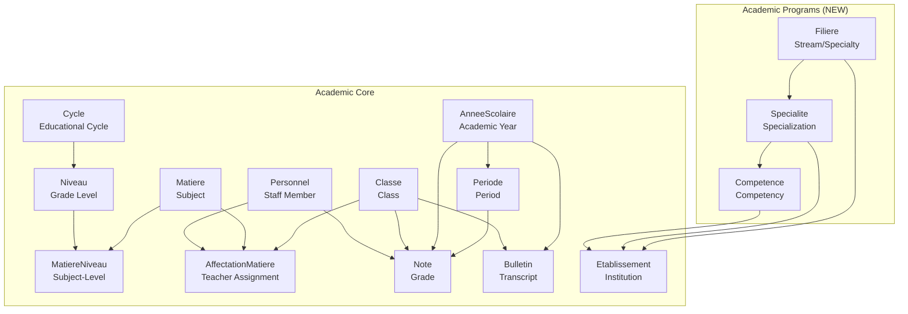
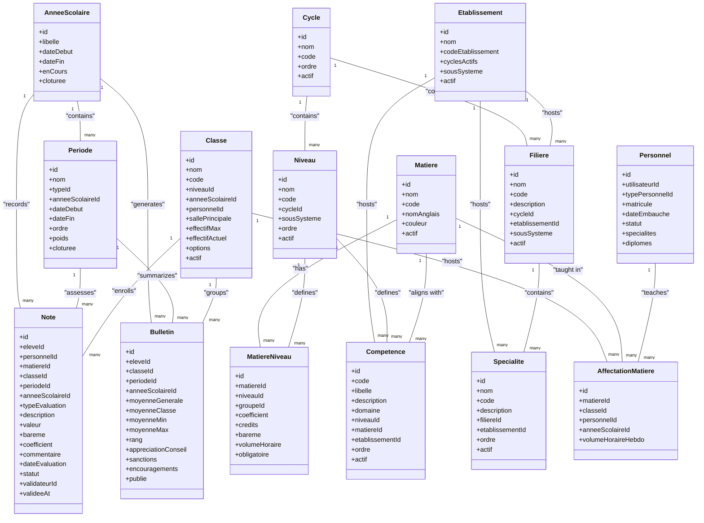
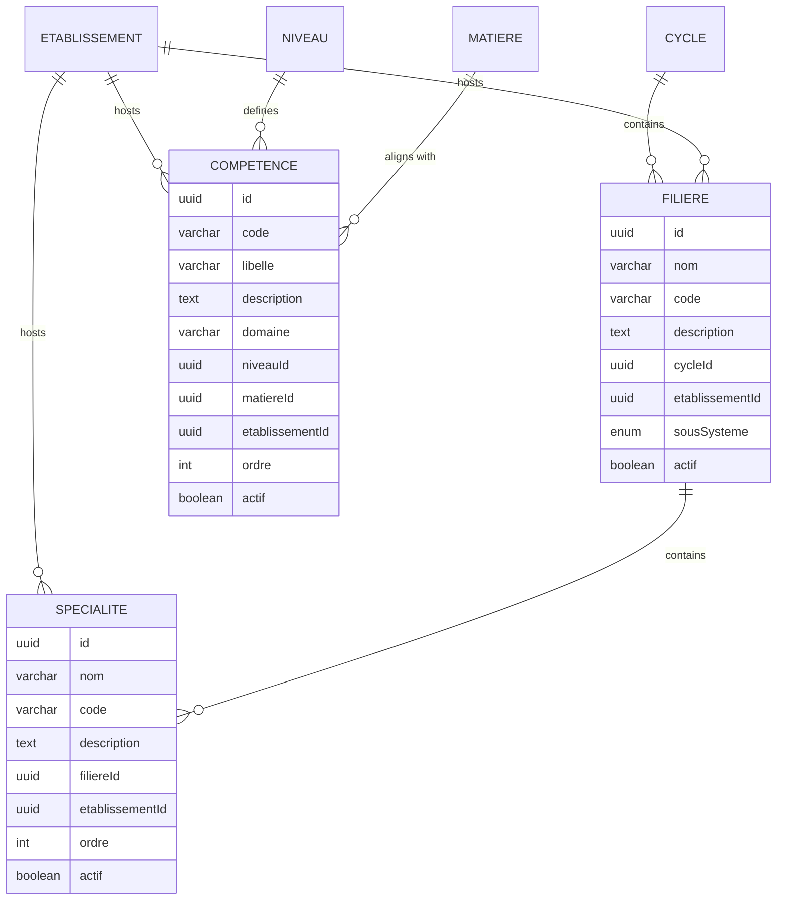
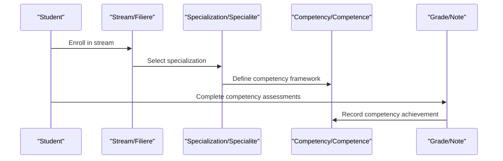
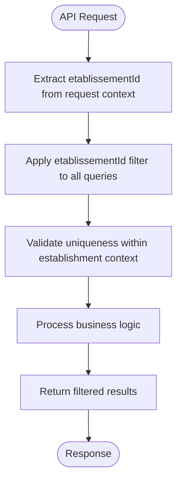
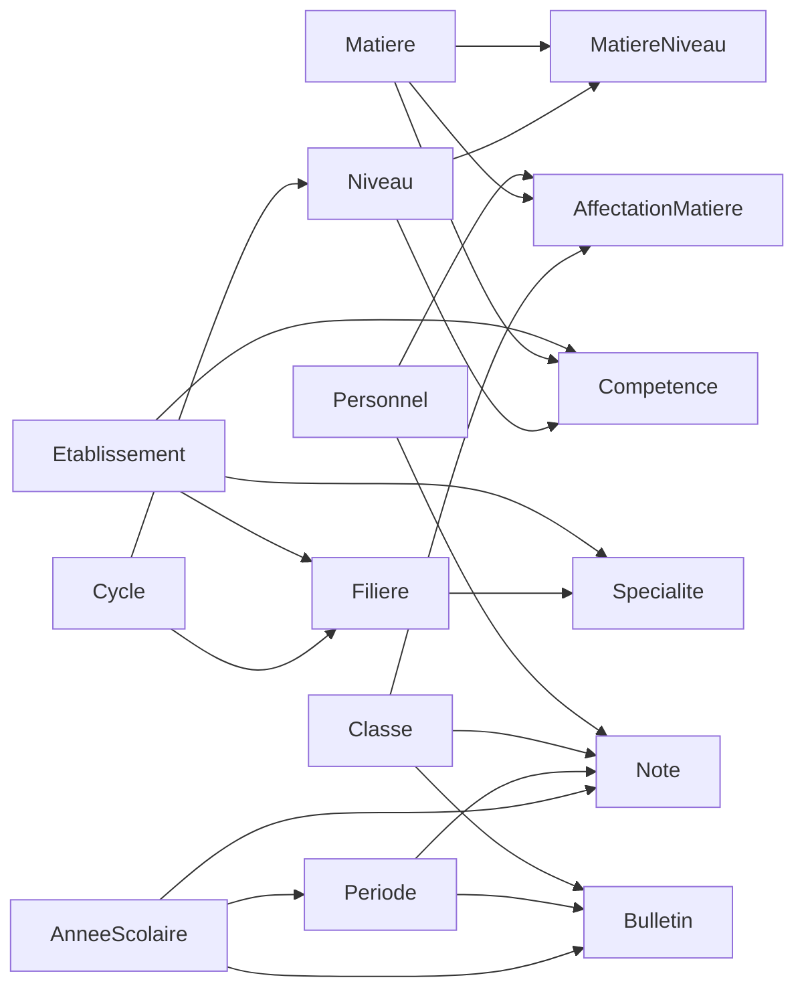

# Academic Entities

<cite>
**Referenced Files in This Document**
- [matiere.entity.ts](file://backend/src/modules/matieres/entities/matiere.entity.ts)
- [affectation-matiere.entity.ts](file://backend/src/modules/matieres/entities/affectation-matiere.entity.ts)
- [matiere-niveau.entity.ts](file://backend/src/modules/matieres/entities/matiere-niveau.entity.ts)
- [note.entity.ts](file://backend/src/modules/notes/entities/note.entity.ts)
- [bulletin.entity.ts](file://backend/src/modules/bulletins/entities/bulletin.entity.ts)
- [periode.entity.ts](file://backend/src/modules/periodes/entities/periode.entity.ts)
- [annee-scolaire.entity.ts](file://backend/src/modules/annees-scolaires/entities/annee-scolaire.entity.ts)
- [cycle.entity.ts](file://backend/src/modules/cycles/entities/cycle.entity.ts)
- [niveau.entity.ts](file://backend/src/modules/niveaux/entities/niveau.entity.ts)
- [classe.entity.ts](file://backend/src/modules/classes/entities/classe.entity.ts)
- [personnel.entity.ts](file://backend/src/modules/personnel/entities/personnel.entity.ts)
- [etablissement.entity.ts](file://backend/src/modules/etablissement/entities/etablissement.entity.ts)
- [filiere.entity.ts](file://backend/src/modules/filieres/entities/filiere.entity.ts)
- [specialite.entity.ts](file://backend/src/modules/specialites/entities/specialite.entity.ts)
- [competence.entity.ts](file://backend/src/modules/competences/entities/competence.entity.ts)
- [filieres.service.ts](file://backend/src/modules/filieres/services/filieres.service.ts)
- [specialites.service.ts](file://backend/src/modules/specialites/services/specialites.service.ts)
- [competences.service.ts](file://backend/src/modules/competences/services/competences.service.ts)
- [filieres.controller.ts](file://backend/src/modules/filieres/controllers/filieres.controller.ts)
- [specialites.controller.ts](file://backend/src/modules/specialites/controllers/specialites.controller.ts)
- [filiere.dto.ts](file://backend/src/modules/filieres/dto/filiere.dto.ts)
- [specialite.dto.ts](file://backend/src/modules/specialites/dto/specialite.dto.ts)
- [competence.dto.ts](file://backend/src/modules/competences/dto/competence.dto.ts)
</cite>

## Update Summary
**Changes Made**
- Added new Academic Program entities: Filiere (Stream/Specialty), Specialite (Specialization), and Competence (Competency)
- Integrated multi-tenant architecture with etablissementId foreign keys across academic entities
- Updated institutional structure to support both national frameworks and establishment-specific configurations
- Enhanced curriculum design capabilities with establishment-level customization options

## Table of Contents
1. [Introduction](#introduction)
2. [Project Structure](#project-structure)
3. [Core Components](#core-components)
4. [Architecture Overview](#architecture-overview)
5. [Detailed Component Analysis](#detailed-component-analysis)
6. [Multi-Tenant Academic Framework](#multi-tenant-academic-framework)
7. [Dependency Analysis](#dependency-analysis)
8. [Performance Considerations](#performance-considerations)
9. [Troubleshooting Guide](#troubleshooting-guide)
10. [Conclusion](#conclusion)

## Introduction
This document describes the comprehensive academic data model used in eLISAschool. It covers core academic entities (subjects, curriculum, teacher assignments, grades, transcripts, periods, academic years, cycles) along with newly integrated academic program entities (streams, specializations, competencies) that support multi-tenant institutional configurations. The model now accommodates both national educational frameworks and establishment-specific customizations, enabling institutions to tailor their academic programs while maintaining data isolation across multiple tenants.

## Project Structure
The academic domain is organized around dedicated modules under backend/src/modules. The core academic modules include:
- matieres: subject and curriculum entities
- notes: grade records
- bulletins: transcripts
- periodes: periods within an academic year
- annees-scolaires: academic year lifecycle
- cycles and niveaux: educational program structure
- classes and personnel: organizational units and staff
- etablissement: institution configuration and system variants
- **NEW**: filieres: academic streams and specializations
- **NEW**: specialites: establishment-specific specializations
- **NEW**: competences: competency-based learning framework

**Diagram sources**
- [matiere.entity.ts:36-62](file://backend/src/modules/matieres/entities/matiere.entity.ts#L36-L62)
- [matiere-niveau.entity.ts:20-71](file://backend/src/modules/matieres/entities/matiere-niveau.entity.ts#L20-L71)
- [affectation-matiere.entity.ts:22-66](file://backend/src/modules/matieres/entities/affectation-matiere.entity.ts#L22-L66)
- [classe.entity.ts:21-76](file://backend/src/modules/classes/entities/classe.entity.ts#L21-L76)
- [niveau.entity.ts:20-54](file://backend/src/modules/niveaux/entities/niveau.entity.ts#L20-L54)
- [cycle.entity.ts:17-40](file://backend/src/modules/cycles/entities/cycle.entity.ts#L17-L40)
- [annee-scolaire.entity.ts:15-41](file://backend/src/modules/annees-scolaires/entities/annee-scolaire.entity.ts#L15-L41)
- [periode.entity.ts:34-79](file://backend/src/modules/periodes/entities/periode.entity.ts#L34-L79)
- [note.entity.ts:45-142](file://backend/src/modules/notes/entities/note.entity.ts#L45-L142)
- [bulletin.entity.ts:23-93](file://backend/src/modules/bulletins/entities/bulletin.entity.ts#L23-L93)
- [personnel.entity.ts:38-79](file://backend/src/modules/personnel/entities/personnel.entity.ts#L38-L79)
- [etablissement.entity.ts:17-93](file://backend/src/modules/etablissement/entities/etablissement.entity.ts#L17-L93)
- [filiere.entity.ts:34-77](file://backend/src/modules/filieres/entities/filiere.entity.ts#L34-L77)
- [specialite.entity.ts:33-76](file://backend/src/modules/specialites/entities/specialite.entity.ts#L33-L76)
- [competence.entity.ts:35-88](file://backend/src/modules/competences/entities/competence.entity.ts#L35-L88)

**Section sources**
- [matiere.entity.ts:1-62](file://backend/src/modules/matieres/entities/matiere.entity.ts#L1-L62)
- [matiere-niveau.entity.ts:1-71](file://backend/src/modules/matieres/entities/matiere-niveau.entity.ts#L1-L71)
- [affectation-matiere.entity.ts:1-66](file://backend/src/modules/matieres/entities/affectation-matiere.entity.ts#L1-L66)
- [note.entity.ts:1-142](file://backend/src/modules/notes/entities/note.entity.ts#L1-L142)
- [bulletin.entity.ts:1-93](file://backend/src/modules/bulletins/entities/bulletin.entity.ts#L1-L93)
- [periode.entity.ts:1-79](file://backend/src/modules/periodes/entities/periode.entity.ts#L1-L79)
- [annee-scolaire.entity.ts:1-41](file://backend/src/modules/annees-scolaires/entities/annee-scolaire.entity.ts#L1-L41)
- [cycle.entity.ts:1-40](file://backend/src/modules/cycles/entities/cycle.entity.ts#L1-L40)
- [niveau.entity.ts:1-54](file://backend/src/modules/niveaux/entities/niveau.entity.ts#L1-L54)
- [classe.entity.ts:1-76](file://backend/src/modules/classes/entities/classe.entity.ts#L1-L76)
- [personnel.entity.ts:1-79](file://backend/src/modules/personnel/entities/personnel.entity.ts#L1-L79)
- [etablissement.entity.ts:1-93](file://backend/src/modules/etablissement/entities/etablissement.entity.ts#L1-L93)
- [filiere.entity.ts:1-77](file://backend/src/modules/filieres/entities/filiere.entity.ts#L1-L77)
- [specialite.entity.ts:1-76](file://backend/src/modules/specialites/entities/specialite.entity.ts#L1-L76)
- [competence.entity.ts:1-88](file://backend/src/modules/competences/entities/competence.entity.ts#L1-L88)

## Core Components
This section documents the primary academic entities and their roles, including the newly integrated academic program entities.

### Core Academic Entities
- **Subject (Matiere)**: Defines a subject (e.g., Mathematics, French) with metadata such as name, code, color, and activity flag.
- **Subject-Level (MatiereNiveau)**: Links a subject to a grade level and defines curriculum details for that combination.
- **Teacher Assignment (AffectationMatiere)**: Assigns a staff member to teach a specific subject within a class during an academic year.
- **Grade (Note)**: Records a single assessment result for a student in a subject during a period.
- **Transcript (Bulletin)**: Aggregates a student's performance for a period into a report card.
- **Period (Periode)**: Defines a time window within an academic year (e.g., trimester, semester, sequence).
- **Academic Year (AnneeScolaire)**: Represents the school year with lifecycle flags.
- **Cycle and Level (Cycle, Niveau)**: Define the educational program structure and grade levels.
- **Class (Classe)**: Groups students by level and academic year, with a homeroom teacher and capacity.
- **Staff (Personnel)**: Associates a user account to staff with role and employment details.

### **NEW** Academic Program Entities
- **Stream/Specialty (Filiere)**: Represents academic streams or specializations (e.g., Scientific, Literary, Technical series) within secondary education. Each stream belongs to a cycle and is associated with an establishment.
- **Specialization (Specialite)**: Represents specific specializations or options within streams (e.g., Mechanical Maintenance, Electrical Engineering). Each specialization belongs to a stream and establishment.
- **Competency (Competence)**: Represents competency-based learning objectives aligned with national frameworks. Each competency belongs to a level, optionally a subject, and establishment.

### Institutional Configuration
- **Establishment (Etablissement)**: Defines institutional configuration including active cycles, subsystem (francophone/anglophone/bicultural), and multi-tenant isolation.

**Section sources**
- [matiere.entity.ts:36-62](file://backend/src/modules/matieres/entities/matiere.entity.ts#L36-L62)
- [matiere-niveau.entity.ts:20-71](file://backend/src/modules/matieres/entities/matiere-niveau.entity.ts#L20-L71)
- [affectation-matiere.entity.ts:22-66](file://backend/src/modules/matieres/entities/affectation-matiere.entity.ts#L22-L66)
- [note.entity.ts:45-142](file://backend/src/modules/notes/entities/note.entity.ts#L45-L142)
- [bulletin.entity.ts:23-93](file://backend/src/modules/bulletins/entities/bulletin.entity.ts#L23-L93)
- [periode.entity.ts:34-79](file://backend/src/modules/periodes/entities/periode.entity.ts#L34-L79)
- [annee-scolaire.entity.ts:15-41](file://backend/src/modules/annees-scolaires/entities/annee-scolaire.entity.ts#L15-L41)
- [cycle.entity.ts:17-40](file://backend/src/modules/cycles/entities/cycle.entity.ts#L17-L40)
- [niveau.entity.ts:20-54](file://backend/src/modules/niveaux/entities/niveau.entity.ts#L20-L54)
- [classe.entity.ts:21-76](file://backend/src/modules/classes/entities/classe.entity.ts#L21-L76)
- [personnel.entity.ts:38-79](file://backend/src/modules/personnel/entities/personnel.entity.ts#L38-L79)
- [filiere.entity.ts:34-77](file://backend/src/modules/filieres/entities/filiere.entity.ts#L34-L77)
- [specialite.entity.ts:33-76](file://backend/src/modules/specialites/entities/specialite.entity.ts#L33-L76)
- [competence.entity.ts:35-88](file://backend/src/modules/competences/entities/competence.entity.ts#L35-L88)
- [etablissement.entity.ts:17-93](file://backend/src/modules/etablissement/entities/etablissement.entity.ts#L17-L93)

## Architecture Overview
The academic entities form a comprehensive model centered on the student's learning journey, now enhanced with multi-tenant academic program structures. The relationships connect subjects to levels (curriculum), teachers to subjects and classes (assignments), grades to students and periods (assessments), and transcripts to periods and students (summaries). Academic year and period define temporal boundaries, while cycle, level, stream, specialization, and competency structure the educational framework with establishment-specific customization.

**Diagram sources**
- [matiere.entity.ts:36-62](file://backend/src/modules/matieres/entities/matiere.entity.ts#L36-L62)
- [matiere-niveau.entity.ts:20-71](file://backend/src/modules/matieres/entities/matiere-niveau.entity.ts#L20-L71)
- [affectation-matiere.entity.ts:22-66](file://backend/src/modules/matieres/entities/affectation-matiere.entity.ts#L22-L66)
- [note.entity.ts:45-142](file://backend/src/modules/notes/entities/note.entity.ts#L45-L142)
- [bulletin.entity.ts:23-93](file://backend/src/modules/bulletins/entities/bulletin.entity.ts#L23-L93)
- [periode.entity.ts:34-79](file://backend/src/modules/periodes/entities/periode.entity.ts#L34-L79)
- [annee-scolaire.entity.ts:15-41](file://backend/src/modules/annees-scolaires/entities/annee-scolaire.entity.ts#L15-L41)
- [cycle.entity.ts:17-40](file://backend/src/modules/cycles/entities/cycle.entity.ts#L17-L40)
- [niveau.entity.ts:20-54](file://backend/src/modules/niveaux/entities/niveau.entity.ts#L20-L54)
- [classe.entity.ts:21-76](file://backend/src/modules/classes/entities/classe.entity.ts#L21-L76)
- [personnel.entity.ts:38-79](file://backend/src/modules/personnel/entities/personnel.entity.ts#L38-L79)
- [filiere.entity.ts:34-77](file://backend/src/modules/filieres/entities/filiere.entity.ts#L34-L77)
- [specialite.entity.ts:33-76](file://backend/src/modules/specialites/entities/specialite.entity.ts#L33-L76)
- [competence.entity.ts:35-88](file://backend/src/modules/competences/entities/competence.entity.ts#L35-L88)
- [etablissement.entity.ts:17-93](file://backend/src/modules/etablissement/entities/etablissement.entity.ts#L17-L93)

## Detailed Component Analysis

### Academic Program Entities (NEW)

#### Stream/Specialty (Filiere)
- **Purpose**: Represents academic streams or specializations within secondary education (e.g., Scientific, Literary, Technical series).
- **Key attributes**: UUID identifier, name, code, description, cycle association, establishment association, subsystem, activity flag, timestamps.
- **Multi-tenant design**: Each stream belongs to a specific establishment, enabling customized academic offerings.
- **Business rules**: 
  - Code uniqueness within a cycle per establishment.
  - Establishments can choose which streams to activate.
  - Supports both national cycle alignment and establishment-specific variations.

#### Specialization (Specialite)
- **Purpose**: Represents specific specializations or options within streams (e.g., Mechanical Maintenance, Electrical Engineering).
- **Key attributes**: UUID identifier, name, code, description, stream association, establishment association, order, activity flag, timestamps.
- **Multi-tenant design**: Specializations are isolated per establishment with establishment-level customization.
- **Business rules**:
  - Code uniqueness within a stream per establishment.
  - Ordered presentation within streams.
  - Establishment-specific activation/deactivation.

#### Competency (Competence)
- **Purpose**: Represents competency-based learning objectives aligned with national frameworks and establishment-specific adaptations.
- **Key attributes**: UUID identifier, code, label, description, domain, level association, optional subject association, establishment association, order, activity flag, timestamps.
- **Multi-tenant design**: Competencies can be customized per establishment while maintaining alignment with national standards.
- **Business rules**:
  - Composite uniqueness across level, subject, and establishment.
  - Optional subject alignment for curriculum integration.
  - Domain categorization (Mathematics, Sciences, Languages, etc.).

**Diagram sources**
- [filiere.entity.ts:34-77](file://backend/src/modules/filieres/entities/filiere.entity.ts#L34-L77)
- [specialite.entity.ts:33-76](file://backend/src/modules/specialites/entities/specialite.entity.ts#L33-L76)
- [competence.entity.ts:35-88](file://backend/src/modules/competences/entities/competence.entity.ts#L35-L88)
- [cycle.entity.ts:17-40](file://backend/src/modules/cycles/entities/cycle.entity.ts#L17-L40)
- [niveau.entity.ts:20-54](file://backend/src/modules/niveaux/entities/niveau.entity.ts#L20-L54)
- [matiere.entity.ts:36-62](file://backend/src/modules/matieres/entities/matiere.entity.ts#L36-L62)

**Section sources**
- [filiere.entity.ts:34-77](file://backend/src/modules/filieres/entities/filiere.entity.ts#L34-L77)
- [specialite.entity.ts:33-76](file://backend/src/modules/specialites/entities/specialite.entity.ts#L33-L76)
- [competence.entity.ts:35-88](file://backend/src/modules/competences/entities/competence.entity.ts#L35-L88)
- [filieres.service.ts:29-45](file://backend/src/modules/filieres/services/filieres.service.ts#L29-L45)
- [specialites.service.ts:29-45](file://backend/src/modules/specialites/services/specialites.service.ts#L29-L45)
- [competences.service.ts:1-117](file://backend/src/modules/competences/services/competences.service.ts#L1-L117)

### Enhanced Academic Workflow Integration
The addition of academic program entities creates new pathways in the academic workflow:
- Students can be enrolled in streams/specializations that define their competency framework
- Teachers can be assigned to deliver competencies within specific streams
- Grades can be recorded against competency-based assessments
- Transcripts can aggregate performance across competency domains

**Diagram sources**
- [filiere.entity.ts:34-77](file://backend/src/modules/filieres/entities/filiere.entity.ts#L34-L77)
- [specialite.entity.ts:33-76](file://backend/src/modules/specialites/entities/specialite.entity.ts#L33-L76)
- [competence.entity.ts:35-88](file://backend/src/modules/competences/entities/competence.entity.ts#L35-L88)
- [note.entity.ts:45-142](file://backend/src/modules/notes/entities/note.entity.ts#L45-L142)

**Section sources**
- [filiere.entity.ts:34-77](file://backend/src/modules/filieres/entities/filiere.entity.ts#L34-L77)
- [specialite.entity.ts:33-76](file://backend/src/modules/specialites/entities/specialite.entity.ts#L33-L76)
- [competence.entity.ts:35-88](file://backend/src/modules/competences/entities/competence.entity.ts#L35-L88)
- [note.entity.ts:45-142](file://backend/src/modules/notes/entities/note.entity.ts#L45-L142)

## Multi-Tenant Academic Framework
The academic model now supports comprehensive multi-tenant isolation through etablissementId foreign keys added to academic program entities.

### Multi-Tenant Implementation Details
- **Data Isolation**: All academic program entities (Filiere, Specialite, Competence) include etablissementId foreign keys
- **Query Filtering**: Services automatically filter all queries by establishment context
- **Unique Constraints**: Uniqueness validations consider establishment boundaries
- **Index Optimization**: Composite indexes support efficient multi-tenant queries

### Service Layer Enhancements
The service layer implements automatic establishment filtering:

**Diagram sources**
- [filieres.service.ts:47-75](file://backend/src/modules/filieres/services/filieres.service.ts#L47-L75)
- [specialites.service.ts:47-75](file://backend/src/modules/specialites/services/specialites.service.ts#L47-L75)
- [competences.service.ts:1-117](file://backend/src/modules/competences/services/competences.service.ts#L1-L117)

### Controller Integration
Controllers automatically extract establishment context from authenticated requests:

- **Filiere Controller**: Uses `req.utilisateur.etablissementId` for all operations
- **Specialite Controller**: Implements establishment-aware CRUD operations  
- **Competence Controller**: Manages establishment-specific competency frameworks

**Section sources**
- [filieres.service.ts:29-45](file://backend/src/modules/filieres/services/filieres.service.ts#L29-L45)
- [specialites.service.ts:29-45](file://backend/src/modules/specialites/services/specialites.service.ts#L29-L45)
- [filieres.controller.ts:27-28](file://backend/src/modules/filieres/controllers/filieres.controller.ts#L27-L28)
- [specialites.controller.ts:30-31](file://backend/src/modules/specialites/controllers/specialites.controller.ts#L30-L31)

## Dependency Analysis
The academic entities exhibit enhanced dependencies with the addition of academic program entities:

**Diagram sources**
- [cycle.entity.ts:17-40](file://backend/src/modules/cycles/entities/cycle.entity.ts#L17-L40)
- [niveau.entity.ts:20-54](file://backend/src/modules/niveaux/entities/niveau.entity.ts#L20-L54)
- [matiere-niveau.entity.ts:20-71](file://backend/src/modules/matieres/entities/matiere-niveau.entity.ts#L20-L71)
- [matiere.entity.ts:36-62](file://backend/src/modules/matieres/entities/matiere.entity.ts#L36-L62)
- [classe.entity.ts:21-76](file://backend/src/modules/classes/entities/classe.entity.ts#L21-L76)
- [affectation-matiere.entity.ts:22-66](file://backend/src/modules/matieres/entities/affectation-matiere.entity.ts#L22-L66)
- [personnel.entity.ts:38-79](file://backend/src/modules/personnel/entities/personnel.entity.ts#L38-L79)
- [annee-scolaire.entity.ts:15-41](file://backend/src/modules/annees-scolaires/entities/annee-scolaire.entity.ts#L15-L41)
- [periode.entity.ts:34-79](file://backend/src/modules/periodes/entities/periode.entity.ts#L34-L79)
- [note.entity.ts:45-142](file://backend/src/modules/notes/entities/note.entity.ts#L45-L142)
- [bulletin.entity.ts:23-93](file://backend/src/modules/bulletins/entities/bulletin.entity.ts#L23-L93)
- [cycle.entity.ts:17-40](file://backend/src/modules/cycles/entities/cycle.entity.ts#L17-L40)
- [filiere.entity.ts:34-77](file://backend/src/modules/filieres/entities/filiere.entity.ts#L34-L77)
- [specialite.entity.ts:33-76](file://backend/src/modules/specialites/entities/specialite.entity.ts#L33-L76)
- [competence.entity.ts:35-88](file://backend/src/modules/competences/entities/competence.entity.ts#L35-L88)
- [etablissement.entity.ts:17-93](file://backend/src/modules/etablissement/entities/etablissement.entity.ts#L17-L93)

**Section sources**
- [cycle.entity.ts:17-40](file://backend/src/modules/cycles/entities/cycle.entity.ts#L17-L40)
- [niveau.entity.ts:20-54](file://backend/src/modules/niveaux/entities/niveau.entity.ts#L20-L54)
- [matiere-niveau.entity.ts:20-71](file://backend/src/modules/matieres/entities/matiere-niveau.entity.ts#L20-L71)
- [matiere.entity.ts:36-62](file://backend/src/modules/matieres/entities/matiere.entity.ts#L36-L62)
- [classe.entity.ts:21-76](file://backend/src/modules/classes/entities/classe.entity.ts#L21-L76)
- [affectation-matiere.entity.ts:22-66](file://backend/src/modules/matieres/entities/affectation-matiere.entity.ts#L22-L66)
- [personnel.entity.ts:38-79](file://backend/src/modules/personnel/entities/personnel.entity.ts#L38-L79)
- [annee-scolaire.entity.ts:15-41](file://backend/src/modules/annees-scolaires/entities/annee-scolaire.entity.ts#L15-L41)
- [periode.entity.ts:34-79](file://backend/src/modules/periodes/entities/periode.entity.ts#L34-L79)
- [note.entity.ts:45-142](file://backend/src/modules/notes/entities/note.entity.ts#L45-L142)
- [bulletin.entity.ts:23-93](file://backend/src/modules/bulletins/entities/bulletin.entity.ts#L23-L93)
- [filiere.entity.ts:34-77](file://backend/src/modules/filieres/entities/filiere.entity.ts#L34-L77)
- [specialite.entity.ts:33-76](file://backend/src/modules/specialites/entities/specialite.entity.ts#L33-L76)
- [competence.entity.ts:35-88](file://backend/src/modules/competences/entities/competence.entity.ts#L35-L88)
- [etablissement.entity.ts:17-93](file://backend/src/modules/etablissement/entities/etablissement.entity.ts#L17-L93)

## Performance Considerations
- **Enhanced Indexing**: New entities include composite indexes for multi-tenant queries (e.g., `(cycleId, etablissementId)`, `(filiereId, etablissementId)`, `(niveauId, matiereId, etablissementId)`)
- **Automatic Filtering**: Services implement transparent establishment filtering without performance overhead
- **Query Optimization**: Multi-tenant queries leverage established composite indexes for optimal performance
- **Data Isolation**: Automatic filtering ensures no cross-establishment data leakage while maintaining query efficiency

## Troubleshooting Guide
- **Multi-tenant Data Isolation**: All academic program entities are automatically filtered by establishment context
- **Unique Constraint Violations**: Uniqueness validations now consider establishment boundaries (e.g., same code in different establishments)
- **Cross-establishment Access**: Direct queries bypassing establishment context will be automatically filtered by services
- **Migration Issues**: Ensure etablissementId is properly populated during migration from legacy systems

**Section sources**
- [filieres.service.ts:47-75](file://backend/src/modules/filieres/services/filieres.service.ts#L47-L75)
- [specialites.service.ts:47-75](file://backend/src/modules/specialites/services/specialites.service.ts#L47-L75)
- [filiere.entity.ts:58-63](file://backend/src/modules/filieres/entities/filiere.entity.ts#L58-L63)
- [specialite.entity.ts:57-62](file://backend/src/modules/specialites/entities/specialite.entity.ts#L57-L62)
- [competence.entity.ts:69-74](file://backend/src/modules/competences/entities/competence.entity.ts#L69-L74)

## Conclusion
The enhanced academic data model in eLISAschool now provides comprehensive support for multi-tenant academic program management. The integration of Filiere, Specialite, and Competence entities with establishment-level isolation enables institutions to customize their academic offerings while maintaining strict data separation. This enhancement extends the platform's capability to support diverse educational frameworks and institutional requirements, building upon the existing robust foundation for curriculum delivery, teacher assignments, grade recording, and transcript generation.