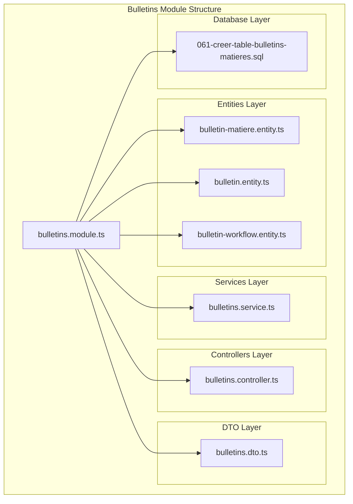
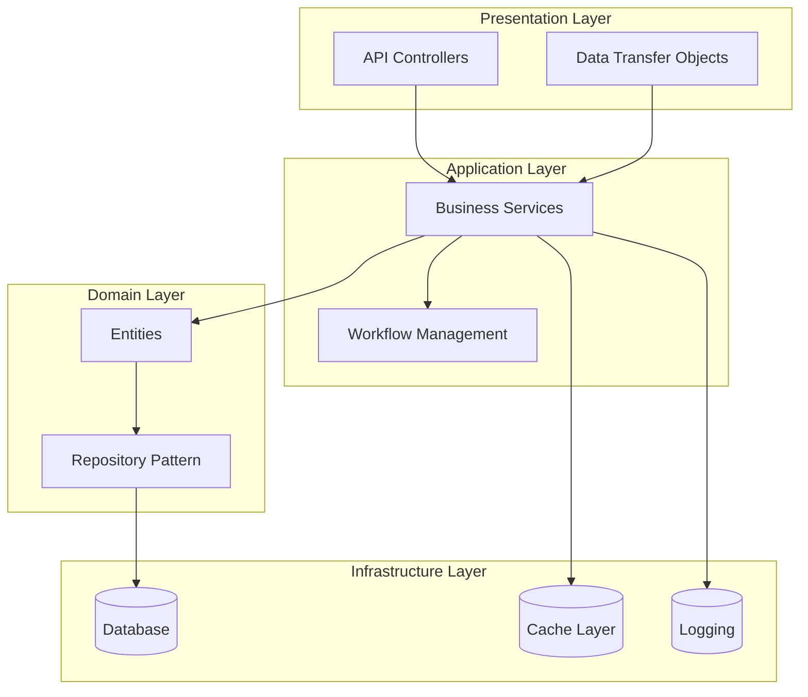
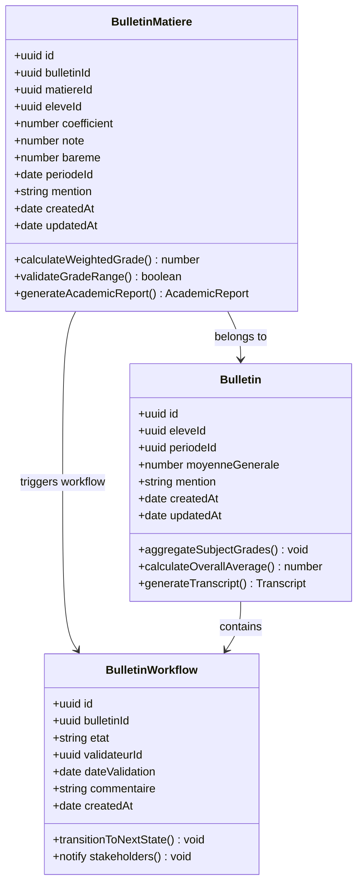
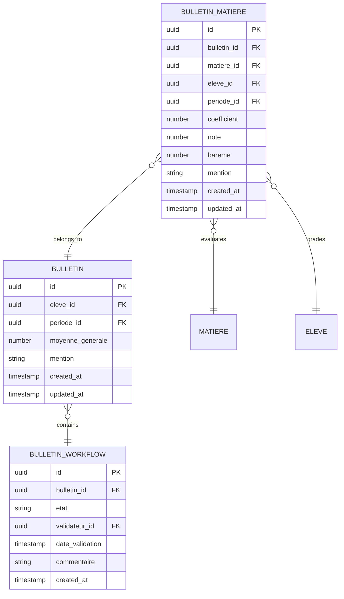
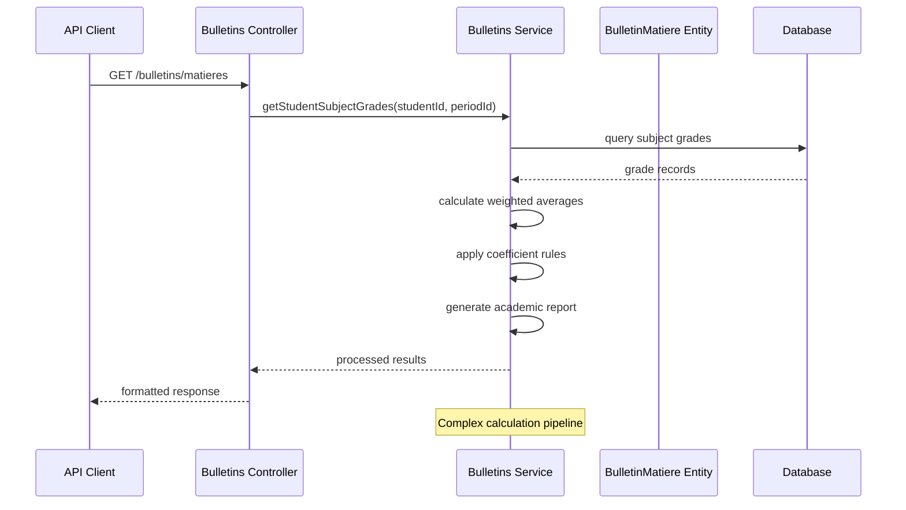
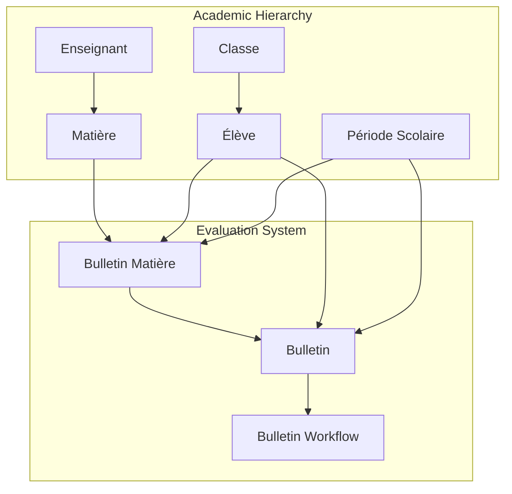
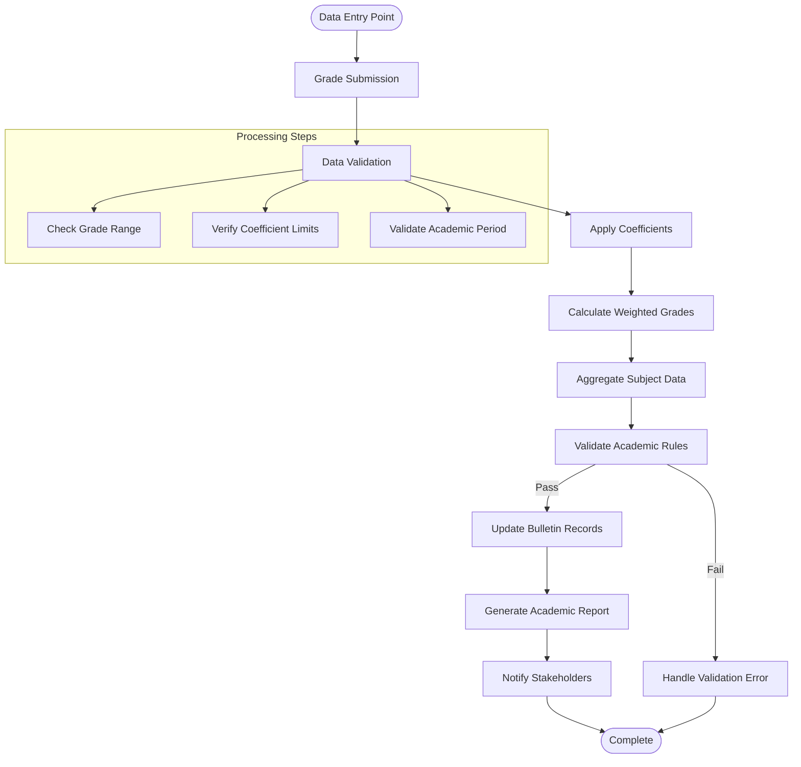

# Bulletin Matière Entity

<cite>
**Referenced Files in This Document**
- [bulletin-matiere.entity.ts](file://backend/src/modules/bulletins/entities/bulletin-matiere.entity.ts)
- [bulletin.entity.ts](file://backend/src/modules/bulletins/entities/bulletin.entity.ts)
- [bulletins.service.ts](file://backend/src/modules/bulletins/services/bulletins.service.ts)
- [061-creer-table-bulletins-matieres.sql](file://backend/database/migrations/061-creer-table-bulletins-matieres.sql)
- [bulletins.controller.ts](file://backend/src/modules/bulletins/controllers/bulletins.controller.ts)
- [bulletins.dto.ts](file://backend/src/modules/bulletins/dto/bulletins.dto.ts)
- [bulletin-workflow.entity.ts](file://backend/src/modules/bulletins/entities/bulletin-workflow.entity.ts)
</cite>

## Table of Contents
1. [Introduction](#introduction)
2. [Project Structure](#project-structure)
3. [Core Components](#core-components)
4. [Architecture Overview](#architecture-overview)
5. [Detailed Component Analysis](#detailed-component-analysis)
6. [Entity Relationship Analysis](#entity-relationship-analysis)
7. [Data Flow Analysis](#data-flow-analysis)
8. [Performance Considerations](#performance-considerations)
9. [Integration Points](#integration-points)
10. [Troubleshooting Guide](#troubleshooting-guide)
11. [Conclusion](#conclusion)

## Introduction

The Bulletin Matière Entity represents a critical component in the academic evaluation system of the eLISAschool platform. This entity manages subject-specific grade records within student academic transcripts, enabling detailed tracking of individual subject performance across different evaluation periods. The implementation encompasses a sophisticated relationship model connecting students, subjects, teachers, and evaluation criteria while supporting advanced features such as weighted grading systems, coefficient-based calculations, and comprehensive academic reporting.

The entity serves as a bridge between the broader academic structure and detailed subject performance data, facilitating granular analysis of student progress and enabling informed educational decision-making. Its design incorporates multi-tenancy support for institutional scalability and integrates seamlessly with the notification system for automated academic updates.

## Project Structure

The Bulletin Matière Entity is organized within the bulletins module of the backend architecture, following a modular design pattern that separates concerns across distinct layers:

**Diagram sources**
- [bulletin-matiere.entity.ts](file://backend/src/modules/bulletins/entities/bulletin-matiere.entity.ts)
- [bulletins.service.ts](file://backend/src/modules/bulletins/services/bulletins.service.ts)
- [bulletins.controller.ts](file://backend/src/modules/bulletins/controllers/bulletins.controller.ts)
- [061-creer-table-bulletins-matieres.sql](file://backend/database/migrations/061-creer-table-bulletins-matieres.sql)

**Section sources**
- [bulletin-matiere.entity.ts](file://backend/src/modules/bulletins/entities/bulletin-matiere.entity.ts)
- [bulletins.service.ts](file://backend/src/modules/bulletins/services/bulletins.service.ts)
- [bulletins.controller.ts](file://backend/src/modules/bulletins/controllers/bulletins.controller.ts)

## Core Components

The Bulletin Matière Entity system comprises several interconnected components that work together to provide comprehensive academic record management:

### Primary Entity Components

The core system consists of three primary entities that form the foundation of the academic evaluation framework:

1. **Bulletin Matière Entity**: Manages individual subject grade records with coefficient-based calculations
2. **Bulletin Entity**: Represents complete academic transcripts with aggregated performance data  
3. **Bulletin Workflow Entity**: Tracks evaluation process states and approval workflows

### Supporting Infrastructure

The system includes specialized services, controllers, and data transfer objects that facilitate data manipulation and API interactions:

- **Bulletins Service**: Handles complex academic calculations, data aggregation, and business logic
- **Bulletins Controller**: Manages HTTP requests and response formatting for academic data
- **Bulletins DTO**: Defines structured data formats for API communication and validation

**Section sources**
- [bulletin-matiere.entity.ts](file://backend/src/modules/bulletins/entities/bulletin-matiere.entity.ts)
- [bulletin.entity.ts](file://backend/src/modules/bulletins/entities/bulletin.entity.ts)
- [bulletin-workflow.entity.ts](file://backend/src/modules/bulletins/entities/bulletin-workflow.entity.ts)

## Architecture Overview

The Bulletin Matière Entity follows a layered architecture pattern that ensures separation of concerns and maintainable code organization:

**Diagram sources**
- [bulletins.controller.ts](file://backend/src/modules/bulletins/controllers/bulletins.controller.ts)
- [bulletins.service.ts](file://backend/src/modules/bulletins/services/bulletins.service.ts)
- [bulletin-matiere.entity.ts](file://backend/src/modules/bulletins/entities/bulletin-matiere.entity.ts)

The architecture emphasizes:
- **Separation of Concerns**: Clear boundaries between presentation, application, domain, and infrastructure layers
- **Testability**: Dependency injection and interface abstraction enable comprehensive testing
- **Scalability**: Multi-tenancy support and caching mechanisms for performance optimization
- **Maintainability**: Modular design facilitates easy updates and modifications

## Detailed Component Analysis

### Bulletin Matière Entity Implementation

The Bulletin Matière Entity serves as the cornerstone of the academic evaluation system, implementing sophisticated data modeling for subject-specific grade management:

**Diagram sources**
- [bulletin-matiere.entity.ts](file://backend/src/modules/bulletins/entities/bulletin-matiere.entity.ts)
- [bulletin.entity.ts](file://backend/src/modules/bulletins/entities/bulletin.entity.ts)
- [bulletin-workflow.entity.ts](file://backend/src/modules/bulletins/entities/bulletin-workflow.entity.ts)

#### Key Features and Capabilities

The entity implementation incorporates several advanced features:

**Coefficient-Based Grading System**: Supports weighted grade calculations using subject coefficients for accurate academic representation.

**Multi-Tenant Architecture**: Includes tenant isolation for institutional data separation and security.

**Audit Trail**: Comprehensive logging of all grade modifications and academic updates.

**Validation Framework**: Built-in validation for grade ranges, coefficient limits, and academic integrity checks.

**Notification Integration**: Seamless integration with the notification system for automated academic alerts.

**Section sources**
- [bulletin-matiere.entity.ts](file://backend/src/modules/bulletins/entities/bulletin-matiere.entity.ts)
- [bulletin.entity.ts](file://backend/src/modules/bulletins/entities/bulletin.entity.ts)

### Database Schema and Migration

The database implementation utilizes PostgreSQL with specialized indexing and constraint management:

**Diagram sources**
- [061-creer-table-bulletins-matieres.sql](file://backend/database/migrations/061-creer-table-bulletins-matieres.sql)
- [bulletin-matiere.entity.ts](file://backend/src/modules/bulletins/entities/bulletin-matiere.entity.ts)

The migration script establishes:
- **Primary Keys**: UUID-based identifiers for global uniqueness
- **Foreign Key Constraints**: Referential integrity for academic relationships
- **Index Optimization**: Strategic indexing for query performance
- **Data Validation**: Constraint enforcement for academic integrity
- **Timestamp Management**: Automatic creation and modification tracking

**Section sources**
- [061-creer-table-bulletins-matieres.sql](file://backend/database/migrations/061-creer-table-bulletins-matieres.sql)

### Business Logic and Service Layer

The Bulletins Service implements complex academic calculation algorithms and business rules:

**Diagram sources**
- [bulletins.controller.ts](file://backend/src/modules/bulletins/controllers/bulletins.controller.ts)
- [bulletins.service.ts](file://backend/src/modules/bulletins/services/bulletins.service.ts)

The service layer handles:
- **Grade Aggregation**: Combining multiple assessment scores with proper weighting
- **Coefficient Management**: Applying subject-specific coefficients for accurate calculations
- **Academic Validation**: Ensuring grade integrity and adherence to educational standards
- **Report Generation**: Creating comprehensive academic summaries and transcripts
- **Workflow Coordination**: Managing evaluation approval processes

**Section sources**
- [bulletins.service.ts](file://backend/src/modules/bulletins/services/bulletins.service.ts)

## Entity Relationship Analysis

The Bulletin Matière Entity participates in several critical relationships within the academic ecosystem:

**Diagram sources**
- [bulletin-matiere.entity.ts](file://backend/src/modules/bulletins/entities/bulletin-matiere.entity.ts)
- [bulletin.entity.ts](file://backend/src/modules/bulletins/entities/bulletin.entity.ts)
- [bulletin-workflow.entity.ts](file://backend/src/modules/bulletins/entities/bulletin-workflow.entity.ts)

### Relationship Characteristics

The entity relationships demonstrate:
- **One-to-Many Cardinality**: One bulletin contains multiple subject grades
- **Multi-Tenant Isolation**: Tenant filtering ensures data separation
- **Hierarchical Dependencies**: Academic hierarchy influences evaluation processes
- **Temporal Tracking**: Period-based relationships enable historical analysis
- **Role-Based Access**: Teacher-student relationships govern data visibility

**Section sources**
- [bulletin-matiere.entity.ts](file://backend/src/modules/bulletins/entities/bulletin-matiere.entity.ts)

## Data Flow Analysis

The data flow within the Bulletin Matière system involves complex processing pipelines for academic data management:

**Diagram sources**
- [bulletins.service.ts](file://backend/src/modules/bulletins/services/bulletins.service.ts)
- [bulletin-matiere.entity.ts](file://backend/src/modules/bulletins/entities/bulletin-matiere.entity.ts)

### Processing Pipeline Components

The data flow encompasses several processing stages:

**Input Validation**: Comprehensive validation of submitted grade data against academic standards and institutional policies.

**Coefficient Application**: Dynamic application of subject-specific coefficients for accurate weighted grade calculations.

**Aggregation Processing**: Consolidation of multiple assessment scores into coherent subject performance indicators.

**Rule Enforcement**: Application of academic regulations including grade ranges, coefficient limitations, and evaluation criteria.

**Reporting Generation**: Creation of comprehensive academic reports and transcript data for stakeholder consumption.

**Notification Routing**: Automated alert generation and distribution to relevant parties in the academic workflow.

**Section sources**
- [bulletins.service.ts](file://backend/src/modules/bulletins/services/bulletins.service.ts)

## Performance Considerations

The Bulletin Matière Entity system incorporates several performance optimization strategies:

### Database Optimization

- **Index Strategy**: Strategic indexing on frequently queried fields including student IDs, subject IDs, and period identifiers
- **Query Optimization**: Efficient query patterns for grade aggregation and academic reporting
- **Connection Pooling**: Optimized database connection management for concurrent academic data processing
- **Caching Layers**: Intelligent caching of frequently accessed academic data and calculated averages

### Calculation Efficiency

- **Batch Processing**: Group processing of similar academic calculations to minimize database round trips
- **Memory Management**: Efficient memory allocation for large-scale grade aggregation operations
- **Parallel Processing**: Concurrent calculation capabilities for multi-subject grade processing
- **Algorithm Optimization**: Optimized mathematical algorithms for weighted average calculations

### Scalability Features

- **Multi-Tenancy Support**: Tenant-aware queries and data isolation for institutional scalability
- **Load Distribution**: Distributed processing capabilities for handling large academic datasets
- **Resource Management**: Efficient resource utilization for peak academic evaluation periods
- **Monitoring Integration**: Performance metrics collection for continuous optimization

## Integration Points

The Bulletin Matière Entity integrates with several system components:

### External System Integrations

**Notification System**: Seamless integration with the notification framework for automated academic alerts and updates.

**Authentication & Authorization**: Multi-tenant aware security model supporting role-based access control for academic data.

**Audit Logging**: Comprehensive audit trail integration for all academic data modifications and access events.

### Internal System Dependencies

**Academic Structure**: Integration with the academic hierarchy including subjects, classes, and periods.

**User Management**: Relationship with user profiles for teacher-student academic interactions.

**Reporting Engine**: Connection to reporting systems for generating comprehensive academic summaries.

**Workflow Engine**: Integration with business process automation for evaluation approval workflows.

**Section sources**
- [bulletins.service.ts](file://backend/src/modules/bulletins/services/bulletins.service.ts)

## Troubleshooting Guide

Common issues and resolution strategies for the Bulletin Matière Entity system:

### Data Integrity Issues

**Problem**: Grade validation failures during submission
- **Cause**: Exceeded grade range limits or invalid coefficient values
- **Solution**: Verify grade boundaries and coefficient configurations in academic settings

**Problem**: Missing subject grades in final transcript
- **Cause**: Incomplete grade submission or missing coefficient data
- **Solution**: Check subject enrollment status and coefficient assignment for all enrolled subjects

### Performance Issues

**Problem**: Slow grade aggregation queries
- **Cause**: Missing database indexes or inefficient query patterns
- **Solution**: Review database optimization and implement recommended indexing strategies

**Problem**: Memory exhaustion during bulk grade processing
- **Cause**: Large dataset processing without proper batching
- **Solution**: Implement chunked processing and optimize memory allocation

### Integration Problems

**Problem**: Notification delivery failures
- **Cause**: Misconfigured notification channels or missing recipient data
- **Solution**: Verify notification system configuration and recipient contact information

**Problem**: Multi-tenancy data isolation issues
- **Cause**: Incorrect tenant filtering or session management problems
- **Solution**: Review tenant middleware implementation and session handling

**Section sources**
- [bulletins.service.ts](file://backend/src/modules/bulletins/services/bulletins.service.ts)
- [bulletin-matiere.entity.ts](file://backend/src/modules/bulletins/entities/bulletin-matiere.entity.ts)

## Conclusion

The Bulletin Matière Entity represents a sophisticated solution for academic grade management within the eLISAschool platform. Its comprehensive design addresses the complex requirements of modern educational institutions while maintaining scalability, performance, and data integrity.

Key achievements of the implementation include:

**Architectural Excellence**: Clean separation of concerns with well-defined layers and clear responsibility boundaries.

**Academic Accuracy**: Sophisticated grade calculation algorithms supporting weighted grading systems and coefficient-based evaluations.

**Scalability Foundation**: Multi-tenancy support and performance optimizations enabling growth to large institutional deployments.

**Integration Capability**: Seamless connectivity with notification systems, audit frameworks, and external academic platforms.

**Maintainability Focus**: Modular design and comprehensive documentation supporting long-term system evolution and maintenance.

The entity continues to serve as a foundational component in the academic evaluation ecosystem, providing reliable and efficient grade management capabilities essential for modern educational administration.