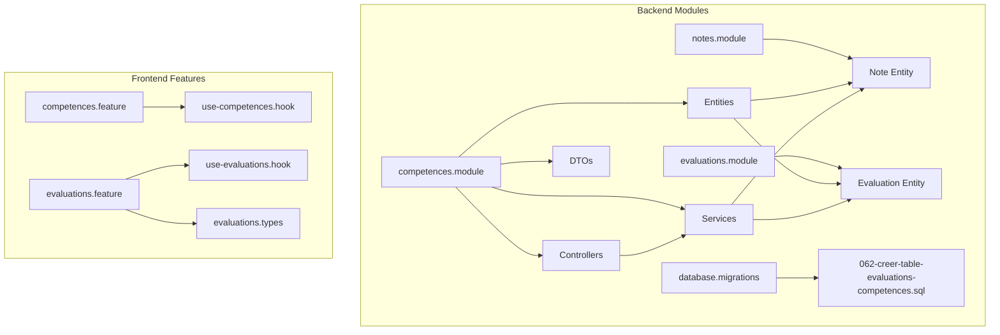
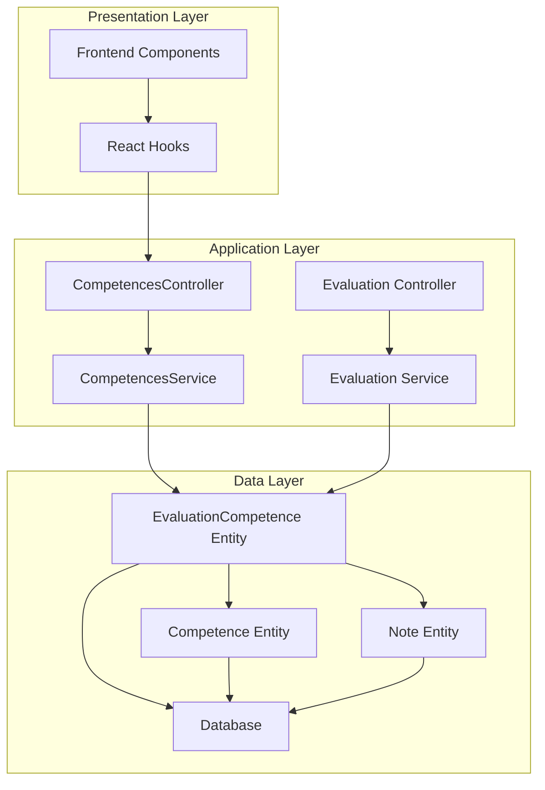
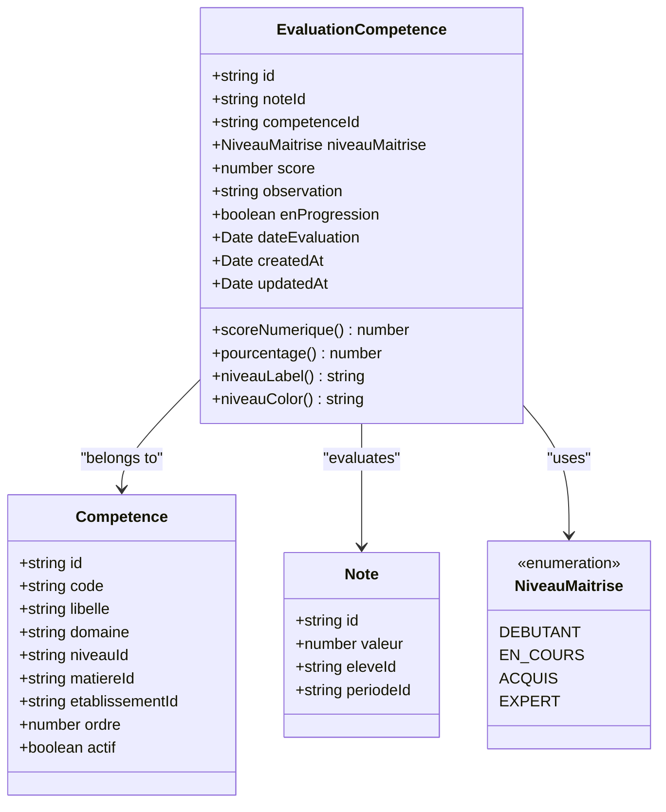
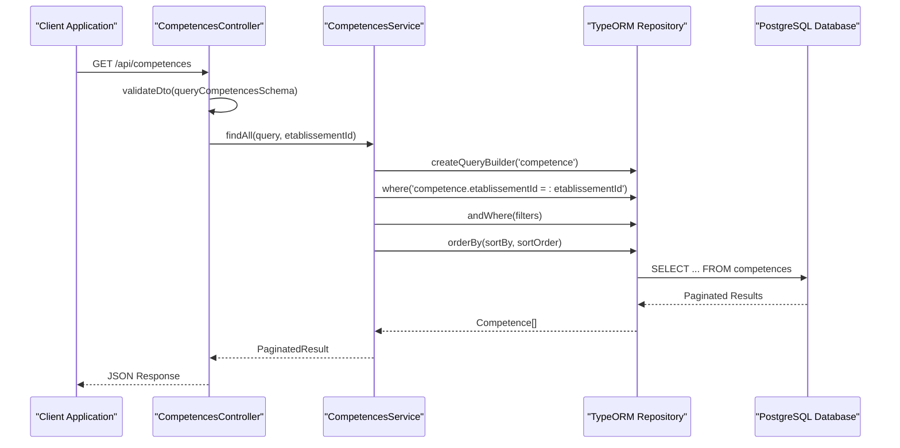
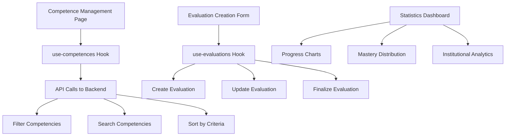
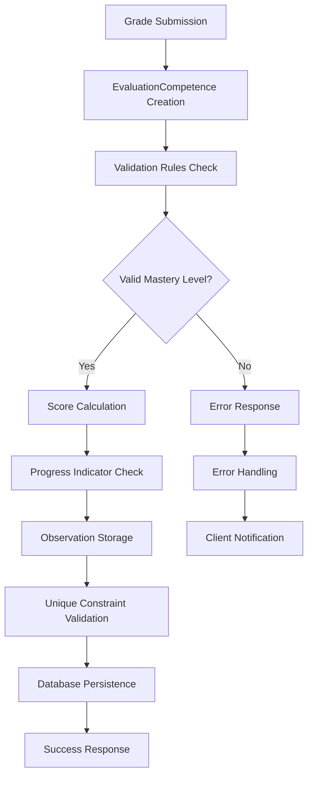

# Evaluation Compétence Entity

<cite>
**Referenced Files in This Document**
- [evaluation-competence.entity.ts](file://backend/src/modules/competences/entities/evaluation-competence.entity.ts)
- [competence.entity.ts](file://backend/src/modules/competences/entities/competence.entity.ts)
- [competences.controller.ts](file://backend/src/modules/competences/controllers/competences.controller.ts)
- [competences.service.ts](file://backend/src/modules/competences/services/competences.service.ts)
- [062-creer-table-evaluations-competences.sql](file://backend/database/migrations/062-creer-table-evaluations-competences.sql)
- [use-competences.ts](file://frontend/src/features/competences/hooks/use-competences.ts)
- [evaluations.types.ts](file://frontend/src/features/evaluations/types/evaluations.types.ts)
- [use-evaluations.ts](file://frontend/src/features/evaluations/hooks/use-evaluations.ts)
</cite>

## Table of Contents
1. [Introduction](#introduction)
2. [Project Structure](#project-structure)
3. [Core Components](#core-components)
4. [Architecture Overview](#architecture-overview)
5. [Detailed Component Analysis](#detailed-component-analysis)
6. [Entity Relationship Analysis](#entity-relationship-analysis)
7. [Data Flow and Processing Logic](#data-flow-and-processing-logic)
8. [Performance Considerations](#performance-considerations)
9. [Integration Points](#integration-points)
10. [Troubleshooting Guide](#troubleshooting-guide)
11. [Conclusion](#conclusion)

## Introduction

The Evaluation Compétence Entity represents a crucial component in the eLISAschool system's Approach Par Compétences (APC) framework. This entity bridges traditional grading systems with competency-based assessment, enabling educational institutions to track student mastery across specific competencies while maintaining alignment with national education standards (MINESEC).

The system implements a hybrid evaluation model that combines numerical grades with competency-level assessments, providing educators with comprehensive insights into student learning progress. This dual approach supports both quantitative analysis and qualitative competency tracking, essential for modern pedagogical assessment.

## Project Structure

The Evaluation Compétence implementation follows a modular architecture within the eLISAschool backend system:



**Diagram sources**
- [evaluation-competence.entity.ts:1-157](file://backend/src/modules/competences/entities/evaluation-competence.entity.ts#L1-L157)
- [competence.entity.ts:1-88](file://backend/src/modules/competences/entities/competence.entity.ts#L1-L88)
- [competences.controller.ts:1-124](file://backend/src/modules/competences/controllers/competences.controller.ts#L1-L124)

**Section sources**
- [evaluation-competence.entity.ts:1-157](file://backend/src/modules/competences/entities/evaluation-competence.entity.ts#L1-L157)
- [competence.entity.ts:1-88](file://backend/src/modules/competences/entities/competence.entity.ts#L1-L88)
- [competences.controller.ts:1-124](file://backend/src/modules/competences/controllers/competences.controller.ts#L1-L124)

## Core Components

### EvaluationCompetence Entity

The EvaluationCompetence entity serves as the central data structure for competency-based assessment tracking. It establishes a many-to-many relationship between academic notes and competency frameworks, enabling granular assessment of student mastery.

**Key Characteristics:**
- **Composite Primary Key**: Unique combination of noteId and competenceId ensures one competency evaluation per grade
- **Mastery Level Tracking**: Enum-based proficiency levels (Débutant, En Cours, Acquis, Expert)
- **Multi-Tenant Support**: Inherits institutional isolation from parent entities
- **Progress Monitoring**: Built-in progression indicators for student development tracking

### Competence Entity

The Competence entity defines the competency framework within the APC system, providing structured learning objectives aligned with national curriculum standards.

**Core Attributes:**
- **Code System**: Standardized competency codes (COMP_MATH_01 format)
- **Hierarchical Organization**: Links to levels and subjects for contextual grouping
- **Institutional Customization**: Supports individualized competency frameworks per establishment
- **Active Status Management**: Enables competency lifecycle management

**Section sources**
- [evaluation-competence.entity.ts:57-157](file://backend/src/modules/competences/entities/evaluation-competence.entity.ts#L57-L157)
- [competence.entity.ts:30-88](file://backend/src/modules/competences/entities/competence.entity.ts#L30-L88)

## Architecture Overview

The Evaluation Compétence system implements a three-tier architecture with clear separation of concerns:



**Diagram sources**
- [competences.controller.ts:1-124](file://backend/src/modules/competences/controllers/competences.controller.ts#L1-L124)
- [competences.service.ts:1-136](file://backend/src/modules/competences/services/competences.service.ts#L1-L136)
- [evaluation-competence.entity.ts:1-157](file://backend/src/modules/competences/entities/evaluation-competence.entity.ts#L1-L157)

The architecture ensures:
- **Data Integrity**: Composite unique constraints prevent duplicate competency evaluations
- **Scalability**: Multi-tenant design supports institutional isolation
- **Maintainability**: Clear separation between presentation, business logic, and data access layers

## Detailed Component Analysis

### Entity Implementation Details

#### EvaluationCompetence Entity Analysis

The EvaluationCompetence entity implements a sophisticated competency assessment system with the following key features:



**Diagram sources**
- [evaluation-competence.entity.ts:30-157](file://backend/src/modules/competences/entities/evaluation-competence.entity.ts#L30-L157)
- [competence.entity.ts:35-88](file://backend/src/modules/competences/entities/competence.entity.ts#L35-L88)

#### Mastery Level System

The system implements a standardized four-level mastery assessment framework:

| Level | Code | Description | Numerical Value |
|-------|------|-------------|-----------------|
| Débutant | DEBUTANT | En cours d'acquisition | 1 |
| En Cours | EN_COURS | Acquisition partielle | 2 |
| Acquis | ACQUIS | Compétence acquise | 3 |
| Expert | EXPERT | Maîtrise avancée | 4 |

Each level includes associated visual indicators:
- **Color Coding**: Red (Débutant), Orange (En Cours), Green (Acquis), Blue (Expert)
- **Progress Tracking**: Boolean flag for student progression indicators
- **Flexible Scoring**: Optional numeric scores (0-4 scale)

**Section sources**
- [evaluation-competence.entity.ts:28-157](file://backend/src/modules/competences/entities/evaluation-competence.entity.ts#L28-L157)

### Service Layer Implementation

The CompetencesService provides comprehensive CRUD operations with advanced filtering and multi-tenant support:



**Diagram sources**
- [competences.controller.ts:27-34](file://backend/src/modules/competences/controllers/competences.controller.ts#L27-L34)
- [competences.service.ts:47-86](file://backend/src/modules/competences/services/competences.service.ts#L47-L86)

**Section sources**
- [competences.service.ts:22-136](file://backend/src/modules/competences/services/competences.service.ts#L22-L136)

### Frontend Integration

The frontend implementation provides comprehensive competency management capabilities:



**Diagram sources**
- [use-competences.ts](file://frontend/src/features/competences/hooks/use-competences.ts)
- [use-evaluations.ts:32-72](file://frontend/src/features/evaluations/hooks/use-evaluations.ts#L32-L72)

**Section sources**
- [use-competences.ts](file://frontend/src/features/competences/hooks/use-competences.ts)
- [use-evaluations.ts:32-72](file://frontend/src/features/evaluations/hooks/use-evaluations.ts#L32-L72)

## Entity Relationship Analysis

The Evaluation Compétence system establishes complex relationships between entities that support comprehensive educational assessment:

```mermaid
erDiagram
EVALUATIONS_COMPETENCES {
uuid id PK
uuid note_id FK
uuid competence_id FK
varchar niveau_maitrise ENUM
float score
text observation
boolean en_progression
date date_evaluation
timestamp created_at
timestamp updated_at
}
COMPETENCES {
uuid id PK
varchar code
varchar libelle
text description
varchar domaine
uuid niveau_id FK
uuid matiere_id FK
uuid etablissement_id FK
int ordre
boolean actif
timestamp created_at
timestamp updated_at
}
NOTES {
uuid id PK
decimal valeur
uuid eleve_id FK
uuid periode_id FK
uuid matiere_id FK
timestamp date_creation
}
NIVEAUX {
uuid id PK
varchar libelle
varchar code
uuid etablissement_id FK
}
MATIERES {
uuid id PK
varchar nom
varchar code
uuid etablissement_id FK
}
ETABLISSEMENTS {
uuid id PK
varchar nom
varchar code
}
EVALUATIONS_COMPETENCES }o--|| COMPETENCES : "belongs_to"
EVALUATIONS_COMPETENCES }o--|| NOTES : "evaluates"
COMPETENCES }o--|| NIVEAUX : "part_of"
COMPETENCES }o--|| MATIERES : "aligned_with"
COMPETENCES }o--|| ETABLISSEMENTS : "institutionalized_by"
```

**Diagram sources**
- [evaluation-competence.entity.ts:57-77](file://backend/src/modules/competences/entities/evaluation-competence.entity.ts#L57-L77)
- [competence.entity.ts:30-74](file://backend/src/modules/competences/entities/competence.entity.ts#L30-L74)

### Database Design Considerations

The database schema implements several optimization strategies:

**Index Strategy:**
- Composite unique index on (note_id, competence_id) prevents duplicate evaluations
- Individual indexes on foreign keys for efficient joins
- Multi-tenant isolation through strategic indexing

**Constraint Implementation:**
- Foreign key constraints ensure referential integrity
- Enum constraints validate mastery level values
- Nullable fields accommodate flexible assessment scenarios

**Migration History:**
The system includes comprehensive migration history supporting:
- Initial competency table creation (062)
- Multi-tenant enhancements
- Performance optimization indexes
- Institutional customization features

**Section sources**
- [062-creer-table-evaluations-competences.sql:26-50](file://backend/database/migrations/062-creer-table-evaluations-competences.sql#L26-L50)

## Data Flow and Processing Logic

### Evaluation Creation Workflow

The competency evaluation process follows a structured workflow ensuring data consistency and institutional compliance:



### Search and Filtering Logic

The system implements sophisticated search capabilities:

**Search Parameters:**
- Text search across code, label, and domain fields
- Filter by academic level and subject
- Active status filtering
- Multi-criteria combinations

**Sorting Options:**
- Order by competency order, code, label, domain, creation date
- Ascending and descending sort directions
- Composite field sorting for complex queries

**Section sources**
- [competences.service.ts:47-86](file://backend/src/modules/competences/services/competences.service.ts#L47-L86)

## Performance Considerations

### Database Optimization

The Evaluation Compétence system implements several performance optimization strategies:

**Index Strategy:**
- Composite unique index prevents duplicate entries while maintaining query performance
- Strategic indexing on frequently queried fields (etablissementId, niveauId, matiereId)
- Multi-tenant isolation through targeted indexing

**Query Optimization:**
- Lazy loading for related entities (niveau, matiere)
- Pagination support for large datasets
- Efficient filtering through query builder patterns

**Memory Management:**
- Proper entity relationship handling prevents memory leaks
- Transaction boundaries ensure data consistency
- Connection pooling for optimal database performance

### Frontend Performance

**React Query Integration:**
- Automatic caching and invalidation
- Background updates and optimistic UI
- Error boundary handling
- Loading state management

**API Optimization:**
- Batch operations for bulk competency management
- Efficient data serialization
- Minimal payload sizes through selective field loading

## Integration Points

### Backend Integration

The Evaluation Compétence system integrates seamlessly with existing eLISAschool modules:

**Notes Module Integration:**
- Direct relationship with grade records
- Cascade deletion maintains data integrity
- Synchronized evaluation updates

**Competency Framework Integration:**
- Alignment with national competency standards
- Institutional customization support
- Hierarchical competency organization

**Audit Trail Integration:**
- Comprehensive change tracking
- User activity logging
- Compliance reporting capabilities

### Frontend Integration

**Hook-Based Architecture:**
- React Query hooks for state management
- Real-time data synchronization
- Error handling and loading states
- Type-safe API interactions

**Component Integration:**
- Modular competency management components
- Evaluation creation and editing interfaces
- Progress visualization dashboards
- Statistical reporting components

**Section sources**
- [evaluations.types.ts:7-58](file://frontend/src/features/evaluations/types/evaluations.types.ts#L7-L58)

## Troubleshooting Guide

### Common Issues and Solutions

**Duplicate Evaluation Prevention:**
- **Issue**: Attempting to create duplicate competency evaluations
- **Solution**: System automatically validates composite unique constraint
- **Prevention**: Implement proper client-side validation before submission

**Data Consistency Issues:**
- **Issue**: Inconsistent mastery level calculations
- **Solution**: Verify enum validation and score calculation logic
- **Prevention**: Implement comprehensive unit testing for calculation methods

**Performance Degradation:**
- **Issue**: Slow competency search operations
- **Solution**: Verify index utilization and query optimization
- **Prevention**: Monitor query execution plans and optimize frequently used filters

**Multi-Tenant Isolation Problems:**
- **Issue**: Cross-institutional data leakage
- **Solution**: Review middleware implementation and query filters
- **Prevention**: Implement comprehensive integration tests for tenant isolation

### Debugging Strategies

**Backend Debugging:**
- Enable detailed logging for entity operations
- Monitor database query performance
- Validate DTO schema compliance
- Test transaction boundaries

**Frontend Debugging:**
- Inspect React Query cache state
- Monitor API response times
- Validate form submission flows
- Test error boundary functionality

**Section sources**
- [competences.service.ts:29-45](file://backend/src/modules/competences/services/competences.service.ts#L29-L45)

## Conclusion

The Evaluation Compétence Entity represents a sophisticated implementation of competency-based assessment within the eLISAschool ecosystem. The system successfully balances educational requirements with technical excellence, providing institutions with powerful tools for competency tracking and student progress monitoring.

**Key Achievements:**
- **Standards Compliance**: Full alignment with MINESEC competency framework
- **Technical Excellence**: Robust architecture supporting scalability and maintainability
- **User Experience**: Intuitive interfaces for both educators and administrators
- **Data Integrity**: Comprehensive validation and constraint enforcement
- **Performance Optimization**: Efficient database design and query optimization

The system's modular design ensures future extensibility while maintaining backward compatibility. The comprehensive integration of frontend and backend components creates a cohesive educational assessment platform capable of supporting diverse institutional needs while adhering to national educational standards.

Future enhancements could include advanced analytics capabilities, automated competency recommendation systems, and expanded integration with external educational platforms. The solid foundation established by the current implementation provides an excellent base for continued evolution and improvement.