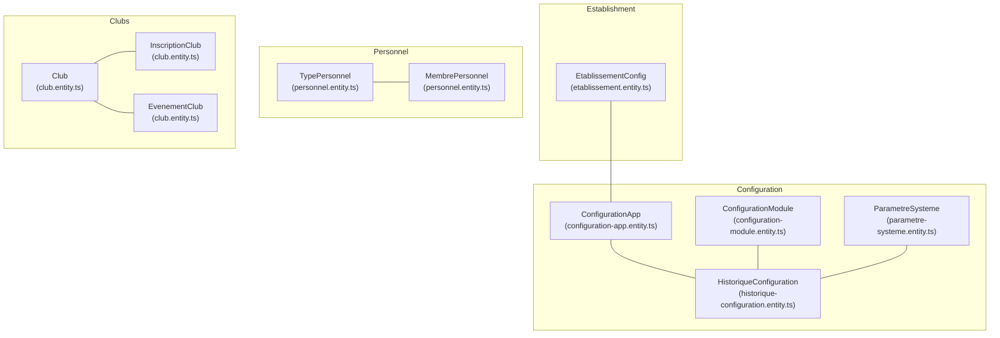
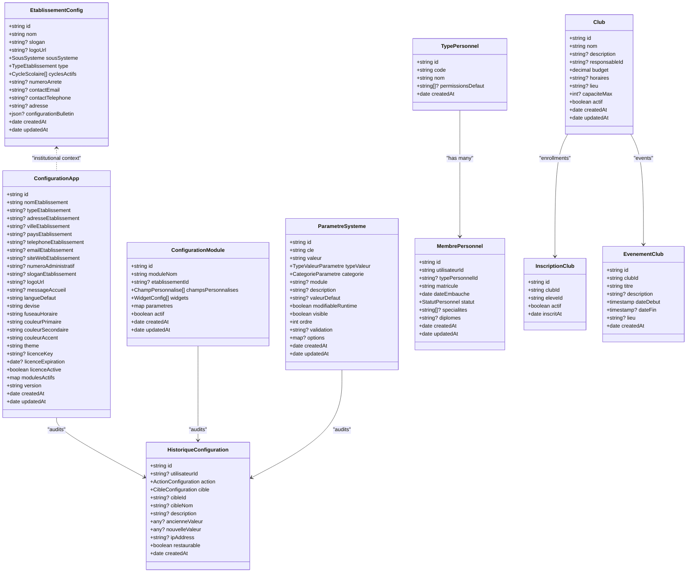
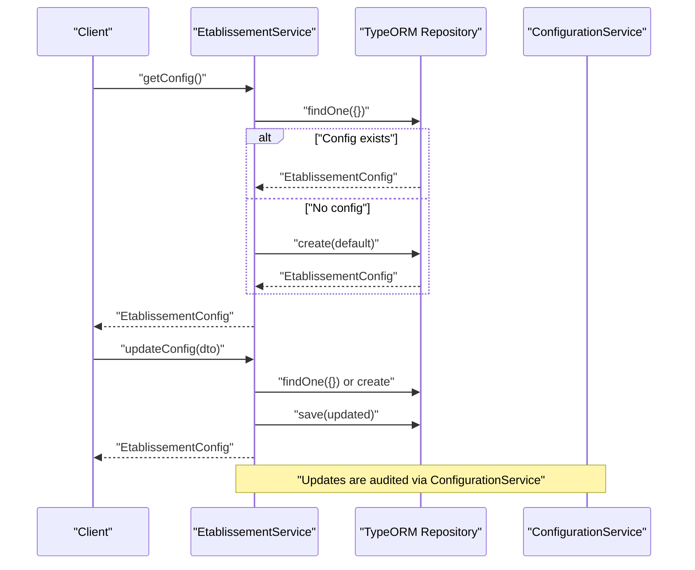
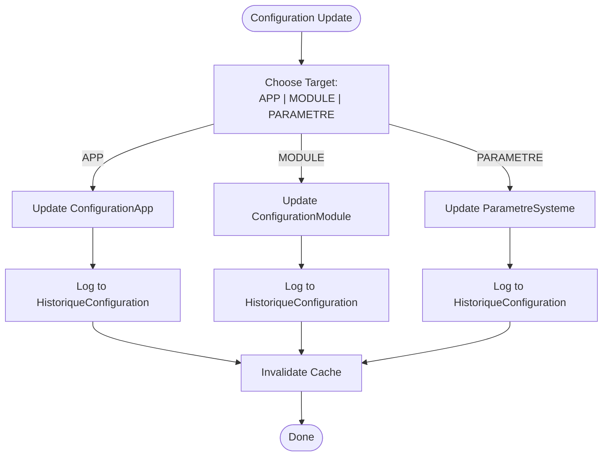
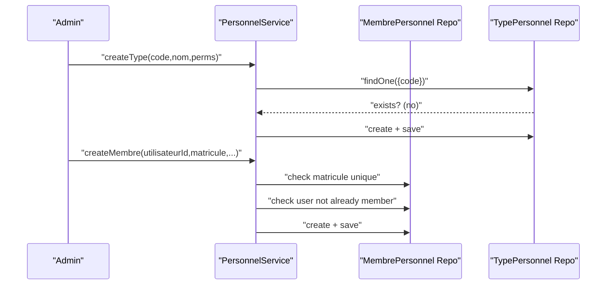
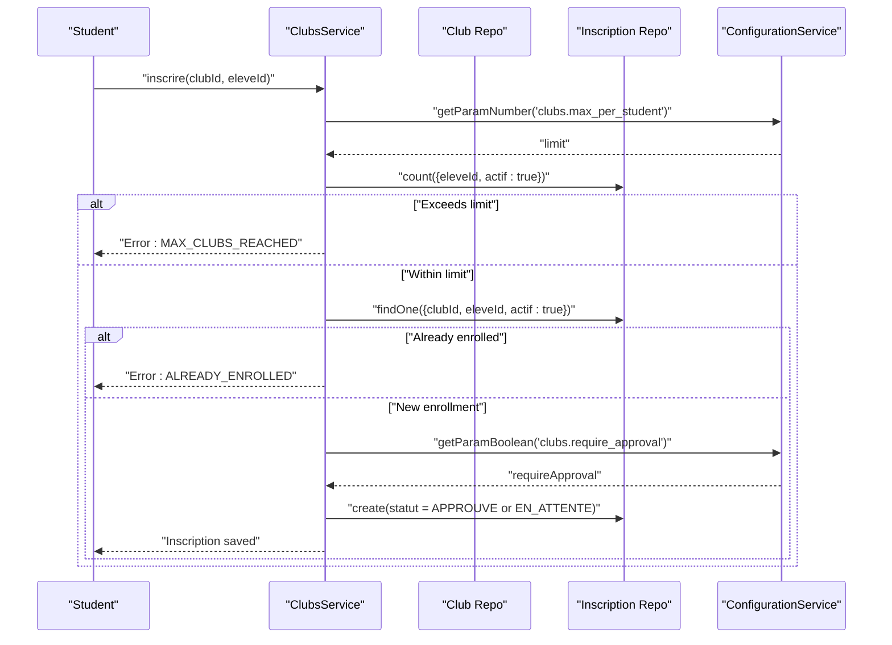
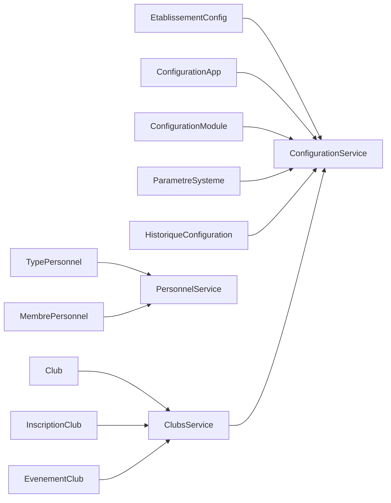

# Administrative Entities

<cite>
**Referenced Files in This Document**
- [etablissement.entity.ts](file://backend/src/modules/etablissement/entities/etablissement.entity.ts)
- [etablissement.dto.ts](file://backend/src/modules/etablissement/dto/etablissement.dto.ts)
- [etablissement.service.ts](file://backend/src/modules/etablissement/services/etablissement.service.ts)
- [configuration-app.entity.ts](file://backend/src/modules/configuration/entities/configuration-app.entity.ts)
- [configuration-module.entity.ts](file://backend/src/modules/configuration/entities/configuration-module.entity.ts)
- [historique-configuration.entity.ts](file://backend/src/modules/configuration/entities/historique-configuration.entity.ts)
- [parametre-systeme.entity.ts](file://backend/src/modules/configuration/entities/parametre-systeme.entity.ts)
- [configuration.dto.ts](file://backend/src/modules/configuration/dto/configuration.dto.ts)
- [configuration.service.ts](file://backend/src/modules/configuration/services/configuration.service.ts)
- [personnel.entity.ts](file://backend/src/modules/personnel/entities/personnel.entity.ts)
- [personnel.dto.ts](file://backend/src/modules/personnel/dto/personnel.dto.ts)
- [personnel.service.ts](file://backend/src/modules/personnel/services/personnel.service.ts)
- [club.entity.ts](file://backend/src/modules/clubs/entities/club.entity.ts)
- [club.dto.ts](file://backend/src/modules/clubs/dto/club.dto.ts)
- [clubs.service.ts](file://backend/src/modules/clubs/services/clubs.service.ts)
</cite>

## Table of Contents
1. [Introduction](#introduction)
2. [Project Structure](#project-structure)
3. [Core Components](#core-components)
4. [Architecture Overview](#architecture-overview)
5. [Detailed Component Analysis](#detailed-component-analysis)
6. [Dependency Analysis](#dependency-analysis)
7. [Performance Considerations](#performance-considerations)
8. [Troubleshooting Guide](#troubleshooting-guide)
9. [Conclusion](#conclusion)

## Introduction
This document describes the administrative data models used in eLISAschool, focusing on:
- Establishment (etablissement): institutional identity and administrative hierarchy
- Configuration: application-wide settings, module-specific configurations, and system parameters
- Personnel: staff profiles, roles, and employment details
- Club: extracurricular activities and student organizations
- Configuration History: audit trail and change management
- System Parameter: global settings and operational controls

It explains entity relationships, administrative workflows, and governance rules derived from the codebase.

## Project Structure
The administrative entities are organized by domain modules under backend/src/modules. Each module encapsulates:
- Entities (TypeORM)
- DTOs (Zod validation)
- Services (business logic and persistence)
- Controllers and Guards (not analyzed here)

**Diagram sources**
- [etablissement.entity.ts:41-92](file://backend/src/modules/etablissement/entities/etablissement.entity.ts#L41-L92)
- [configuration-app.entity.ts:21-109](file://backend/src/modules/configuration/entities/configuration-app.entity.ts#L21-L109)
- [configuration-module.entity.ts:54-86](file://backend/src/modules/configuration/entities/configuration-module.entity.ts#L54-L86)
- [parametre-systeme.entity.ts:58-119](file://backend/src/modules/configuration/entities/parametre-systeme.entity.ts#L58-L119)
- [historique-configuration.entity.ts:47-87](file://backend/src/modules/configuration/entities/historique-configuration.entity.ts#L47-L87)
- [personnel.entity.ts:20-78](file://backend/src/modules/personnel/entities/personnel.entity.ts#L20-L78)
- [club.entity.ts:7-103](file://backend/src/modules/clubs/entities/club.entity.ts#L7-L103)

**Section sources**
- [etablissement.entity.ts:1-93](file://backend/src/modules/etablissement/entities/etablissement.entity.ts#L1-L93)
- [configuration-app.entity.ts:1-112](file://backend/src/modules/configuration/entities/configuration-app.entity.ts#L1-L112)
- [configuration-module.entity.ts:1-89](file://backend/src/modules/configuration/entities/configuration-module.entity.ts#L1-L89)
- [parametre-systeme.entity.ts:1-122](file://backend/src/modules/configuration/entities/parametre-systeme.entity.ts#L1-L122)
- [historique-configuration.entity.ts:1-90](file://backend/src/modules/configuration/entities/historique-configuration.entity.ts#L1-L90)
- [personnel.entity.ts:1-79](file://backend/src/modules/personnel/entities/personnel.entity.ts#L1-L79)
- [club.entity.ts:1-103](file://backend/src/modules/clubs/entities/club.entity.ts#L1-L103)

## Core Components
This section summarizes the primary administrative entities and their responsibilities.

- Establishment (etablissement)
  - Stores institution identity, subsystem, type, active school cycles, administrative contacts, and report card configuration.
  - Provides default creation and updates via service.

- Configuration
  - Application-wide settings (institution info, locale, theme, license, enabled modules).
  - Module-specific customization (custom fields, dashboard widgets, module parameters).
  - System parameters (key-value pairs with categories, types, validation, runtime modifiability).
  - Audit trail of configuration changes.

- Personnel
  - Defines staff types with default permissions.
  - Manages staff profiles, employment details, and links to user accounts.

- Clubs
  - Clubs, member enrollments, and events.
  - Uses centralized configuration parameters for enrollment limits and approval workflows.

**Section sources**
- [etablissement.service.ts:13-57](file://backend/src/modules/etablissement/services/etablissement.service.ts#L13-L57)
- [configuration.service.ts:53-600](file://backend/src/modules/configuration/services/configuration.service.ts#L53-L600)
- [personnel.service.ts:14-95](file://backend/src/modules/personnel/services/personnel.service.ts#L14-L95)
- [clubs.service.ts:22-139](file://backend/src/modules/clubs/services/clubs.service.ts#L22-L139)

## Architecture Overview
The administrative domain follows a layered architecture:
- Entities define persistence and relationships
- DTOs enforce validation and shape API payloads
- Services orchestrate business rules, caching, audit logging, and cross-entity operations
- Configuration is hybrid: static defaults and dynamic runtime values with cache and history

**Diagram sources**
- [etablissement.entity.ts:41-92](file://backend/src/modules/etablissement/entities/etablissement.entity.ts#L41-L92)
- [configuration-app.entity.ts:21-109](file://backend/src/modules/configuration/entities/configuration-app.entity.ts#L21-L109)
- [configuration-module.entity.ts:54-86](file://backend/src/modules/configuration/entities/configuration-module.entity.ts#L54-L86)
- [parametre-systeme.entity.ts:58-119](file://backend/src/modules/configuration/entities/parametre-systeme.entity.ts#L58-L119)
- [historique-configuration.entity.ts:47-87](file://backend/src/modules/configuration/entities/historique-configuration.entity.ts#L47-L87)
- [personnel.entity.ts:20-78](file://backend/src/modules/personnel/entities/personnel.entity.ts#L20-L78)
- [club.entity.ts:7-103](file://backend/src/modules/clubs/entities/club.entity.ts#L7-L103)

## Detailed Component Analysis

### Establishment (etablissement)
- Purpose: Institutional identity and administrative hierarchy for the establishment.
- Key attributes:
  - Identity: name, tagline, logo
  - Subsystem and type
  - Active school cycles
  - Administrative contacts and address
  - Report card configuration block
- Governance:
  - Service ensures a single configuration row exists, creating defaults if missing.
  - Updates are validated via DTO schema and logged through configuration history via the configuration service.

**Diagram sources**
- [etablissement.service.ts:24-56](file://backend/src/modules/etablissement/services/etablissement.service.ts#L24-L56)
- [configuration.service.ts:122-146](file://backend/src/modules/configuration/services/configuration.service.ts#L122-L146)

**Section sources**
- [etablissement.entity.ts:41-92](file://backend/src/modules/etablissement/entities/etablissement.entity.ts#L41-L92)
- [etablissement.dto.ts:10-30](file://backend/src/modules/etablissement/dto/etablissement.dto.ts#L10-L30)
- [etablissement.service.ts:13-57](file://backend/src/modules/etablissement/services/etablissement.service.ts#L13-L57)

### Configuration
- Application settings (ConfigurationApp)
  - Stores institution metadata, locale, theme, license, and enabled modules.
  - Defaults are created on first access.
- Module configurations (ConfigurationModule)
  - Per-module customization: custom fields, dashboard widgets, and parameters.
  - Supports global and establishment-scoped variants.
- System parameters (ParametreSysteme)
  - Hybrid storage: key-value pairs with type, category, validation, and runtime modifiability.
  - Values are cached and parsed according to declared types.
- Audit and change management (HistoriqueConfiguration)
  - Tracks who changed what, when, and what was changed.
  - Supports restoration for selected actions.

**Diagram sources**
- [configuration.service.ts:122-146](file://backend/src/modules/configuration/services/configuration.service.ts#L122-L146)
- [configuration.service.ts:188-221](file://backend/src/modules/configuration/services/configuration.service.ts#L188-L221)
- [configuration.service.ts:320-357](file://backend/src/modules/configuration/services/configuration.service.ts#L320-L357)
- [historique-configuration.entity.ts:47-87](file://backend/src/modules/configuration/entities/historique-configuration.entity.ts#L47-L87)

**Section sources**
- [configuration-app.entity.ts:21-109](file://backend/src/modules/configuration/entities/configuration-app.entity.ts#L21-L109)
- [configuration-module.entity.ts:54-86](file://backend/src/modules/configuration/entities/configuration-module.entity.ts#L54-L86)
- [parametre-systeme.entity.ts:58-119](file://backend/src/modules/configuration/entities/parametre-systeme.entity.ts#L58-L119)
- [historique-configuration.entity.ts:47-87](file://backend/src/modules/configuration/entities/historique-configuration.entity.ts#L47-L87)
- [configuration.dto.ts:18-38](file://backend/src/modules/configuration/dto/configuration.dto.ts#L18-L38)
- [configuration.dto.ts:75-80](file://backend/src/modules/configuration/dto/configuration.dto.ts#L75-L80)
- [configuration.dto.ts:89-104](file://backend/src/modules/configuration/dto/configuration.dto.ts#L89-L104)
- [configuration.dto.ts:109-118](file://backend/src/modules/configuration/dto/configuration.dto.ts#L109-L118)
- [configuration.service.ts:53-600](file://backend/src/modules/configuration/services/configuration.service.ts#L53-L600)

### Personnel
- Roles and profiles:
  - TypePersonnel defines job families and default permissions.
  - MembrePersonnel stores staff profiles, employment dates, status, specialties, and linked user account.
- Workflows:
  - Creation validates uniqueness of matricule and user linkage.
  - Updates support partial changes with date normalization.
  - Deletion removes profile records.

**Diagram sources**
- [personnel.service.ts:25-55](file://backend/src/modules/personnel/services/personnel.service.ts#L25-L55)
- [personnel.entity.ts:20-78](file://backend/src/modules/personnel/entities/personnel.entity.ts#L20-L78)

**Section sources**
- [personnel.entity.ts:20-78](file://backend/src/modules/personnel/entities/personnel.entity.ts#L20-L78)
- [personnel.dto.ts:9-23](file://backend/src/modules/personnel/dto/personnel.dto.ts#L9-L23)
- [personnel.service.ts:14-95](file://backend/src/modules/personnel/services/personnel.service.ts#L14-L95)

### Clubs
- Organization:
  - Club: name, description, responsible, budget, schedule, location, capacity, activity flag.
  - InscriptionClub: enrollment linking students to clubs with approval status.
  - EvenementClub: events associated with a club.
- Governance:
  - Uses centralized configuration parameters for enrollment limits and approval requirement.
  - Enrolment checks prevent exceeding per-student caps and duplicates.
  - Approval workflow can be enforced via configuration.

**Diagram sources**
- [clubs.service.ts:63-94](file://backend/src/modules/clubs/services/clubs.service.ts#L63-L94)
- [configuration.service.ts:307-318](file://backend/src/modules/configuration/services/configuration.service.ts#L307-L318)
- [configuration.service.ts:359-405](file://backend/src/modules/configuration/services/configuration.service.ts#L359-L405)

**Section sources**
- [club.entity.ts:7-103](file://backend/src/modules/clubs/entities/club.entity.ts#L7-L103)
- [club.dto.ts:3-24](file://backend/src/modules/clubs/dto/club.dto.ts#L3-L24)
- [clubs.service.ts:22-139](file://backend/src/modules/clubs/services/clubs.service.ts#L22-L139)

### Configuration History
- Purpose: Audit trail of configuration changes.
- Attributes:
  - Actor, action, target, identifiers, descriptions, IP, timestamps, and serializable value snapshots.
- Usage:
  - Logged automatically by ConfigurationService on create/update/delete/reset and module toggles.
  - Supports restoration flag for reversible actions.

**Section sources**
- [historique-configuration.entity.ts:47-87](file://backend/src/modules/configuration/entities/historique-configuration.entity.ts#L47-L87)
- [configuration.service.ts:130-139](file://backend/src/modules/configuration/services/configuration.service.ts#L130-L139)
- [configuration.service.ts:206-215](file://backend/src/modules/configuration/services/configuration.service.ts#L206-L215)
- [configuration.service.ts:341-351](file://backend/src/modules/configuration/services/configuration.service.ts#L341-L351)
- [configuration.service.ts:430-437](file://backend/src/modules/configuration/services/configuration.service.ts#L430-L437)
- [configuration.service.ts:457-466](file://backend/src/modules/configuration/services/configuration.service.ts#L457-L466)

### System Parameter
- Purpose: Global settings and operational controls with strong typing and validation.
- Categories and types:
  - Categories include system, security, establishment, module, theme, notification, regional, and custom.
  - Types include string, number, boolean, JSON, array.
- Runtime behavior:
  - Some parameters can be modified without restart; others are restricted.
  - Centralized retrieval with cache and type-aware parsing.

**Section sources**
- [parametre-systeme.entity.ts:58-119](file://backend/src/modules/configuration/entities/parametre-systeme.entity.ts#L58-L119)
- [configuration.service.ts:307-318](file://backend/src/modules/configuration/services/configuration.service.ts#L307-L318)
- [configuration.service.ts:320-357](file://backend/src/modules/configuration/services/configuration.service.ts#L320-L357)
- [configuration.service.ts:359-405](file://backend/src/modules/configuration/services/configuration.service.ts#L359-L405)
- [configuration.dto.ts:89-118](file://backend/src/modules/configuration/dto/configuration.dto.ts#L89-L118)

## Dependency Analysis
- Entities depend on TypeORM decorators for persistence.
- Services depend on repositories and the configuration history service for auditing.
- Clubs rely on configuration helpers to fetch runtime parameters.
- DTOs validate inputs for all administrative operations.

**Diagram sources**
- [configuration.service.ts:53-600](file://backend/src/modules/configuration/services/configuration.service.ts#L53-L600)
- [personnel.service.ts:14-95](file://backend/src/modules/personnel/services/personnel.service.ts#L14-L95)
- [clubs.service.ts:22-139](file://backend/src/modules/clubs/services/clubs.service.ts#L22-L139)

**Section sources**
- [configuration.service.ts:53-600](file://backend/src/modules/configuration/services/configuration.service.ts#L53-L600)
- [personnel.service.ts:14-95](file://backend/src/modules/personnel/services/personnel.service.ts#L14-L95)
- [clubs.service.ts:22-139](file://backend/src/modules/clubs/services/clubs.service.ts#L22-L139)

## Performance Considerations
- Caching: ConfigurationService maintains an in-memory cache with TTL to reduce database load for frequently accessed settings.
- Batch updates: Bulk parameter updates are supported to minimize repeated writes.
- Indexing: Historical configuration uses composite indexes on actor+timestamp, target+targetId, and action+timestamp to optimize audits.
- Parsing: Parameter values are parsed according to declared types to avoid repeated conversions.

[No sources needed since this section provides general guidance]

## Troubleshooting Guide
- Duplicate identifiers
  - Matricule must be unique; attempting to create a second personnel record with an existing matricule fails.
  - User account must not already be linked to a personnel record.
- Parameter restrictions
  - Some parameters cannot be modified at runtime; attempts raise errors.
  - Non-existent parameters return not found errors during updates or resets.
- Clubs enrollment limits
  - Exceeding configured maximum per student prevents new enrollments.
  - Duplicate enrollments are rejected.

**Section sources**
- [personnel.service.ts:40-47](file://backend/src/modules/personnel/services/personnel.service.ts#L40-L47)
- [configuration.service.ts:326-328](file://backend/src/modules/configuration/services/configuration.service.ts#L326-L328)
- [configuration.service.ts:420-424](file://backend/src/modules/configuration/services/configuration.service.ts#L420-L424)
- [clubs.service.ts:71-77](file://backend/src/modules/clubs/services/clubs.service.ts#L71-L77)
- [clubs.service.ts:80-83](file://backend/src/modules/clubs/services/clubs.service.ts#L80-L83)

## Conclusion
The administrative data models in eLISAschool provide a robust foundation for institutional governance:
- Establishment identity and hierarchy are captured centrally.
- Configuration spans application-wide settings, module customization, and system parameters with comprehensive auditability.
- Personnel and clubs are modeled with clear roles, profiles, and governance rules.
- Operational controls leverage centralized configuration parameters to enforce policies dynamically.