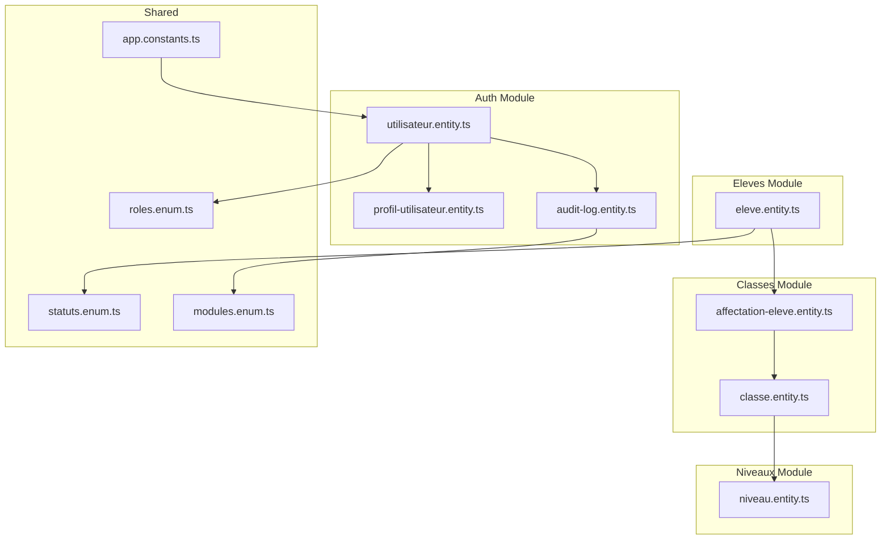
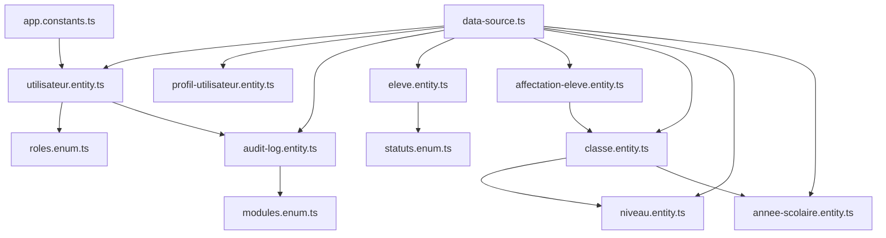
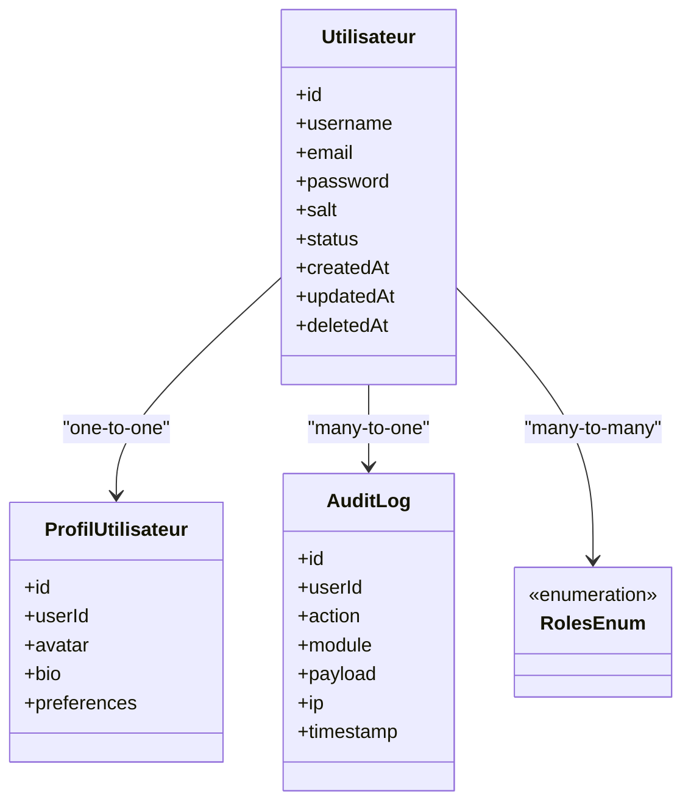
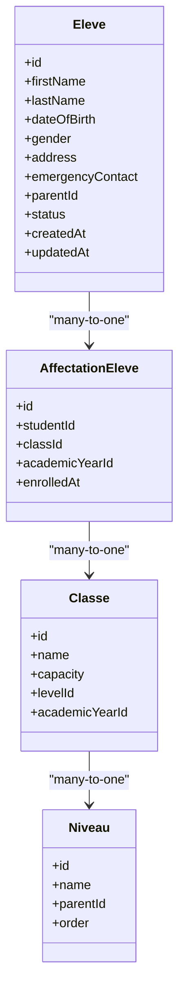
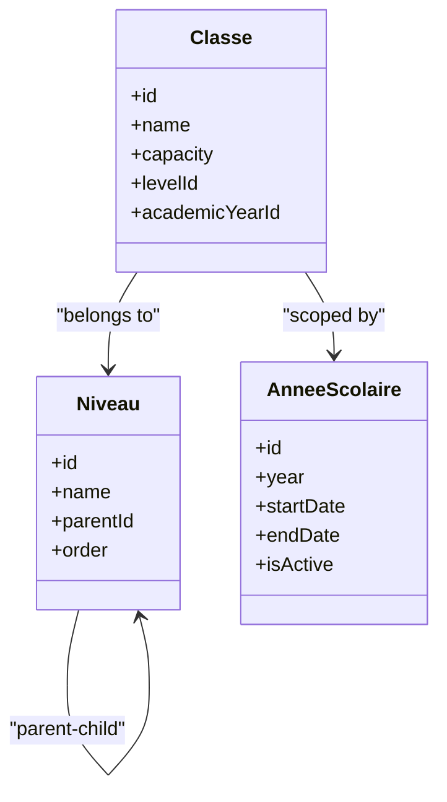
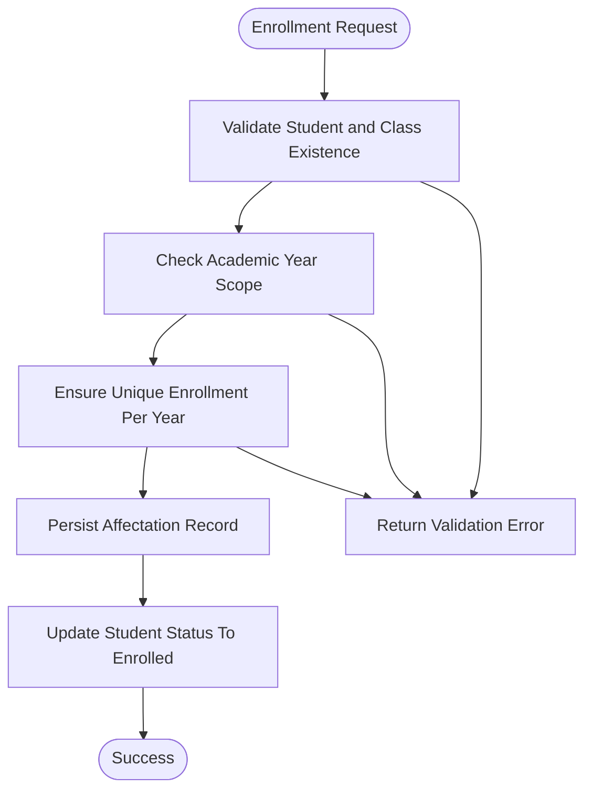
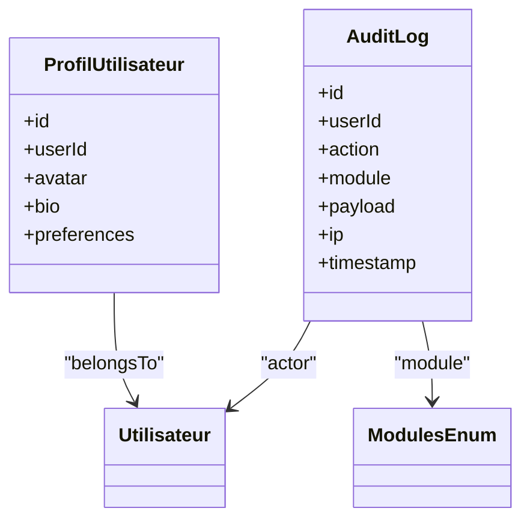

# Core Entities

<cite>
**Referenced Files in This Document**
- [utilisateur.entity.ts](file://backend/src/modules/auth/entities/utilisateur.entity.ts)
- [profil-utilisateur.entity.ts](file://backend/src/modules/auth/entities/profil-utilisateur.entity.ts)
- [audit-log.entity.ts](file://backend/src/modules/auth/entities/audit-log.entity.ts)
- [eleve.entity.ts](file://backend/src/modules/eleves/entities/eleve.entity.ts)
- [classe.entity.ts](file://backend/src/modules/classes/entities/classe.entity.ts)
- [affectation-eleve.entity.ts](file://backend/src/modules/classes/entities/affectation-eleve.entity.ts)
- [niveau.entity.ts](file://backend/src/modules/niveaux/entities/niveau.entity.ts)
- [annee-scolaire.entity.ts](file://backend/src/modules/annees-scolaires/entities/annee-scolaire.entity.ts)
- [roles.enum.ts](file://shared/src/enums/roles.enum.ts)
- [statuts.enum.ts](file://shared/src/enums/statuts.enum.ts)
- [modules.enum.ts](file://shared/src/enums/modules.enum.ts)
- [app.constants.ts](file://shared/src/constants/app.constants.ts)
- [data-source.ts](file://backend/src/database/data-source.ts)
- [initial.seed.ts](file://backend/src/database/seeds/initial.seed.ts)
</cite>

## Table of Contents
1. [Introduction](#introduction)
2. [Project Structure](#project-structure)
3. [Core Components](#core-components)
4. [Architecture Overview](#architecture-overview)
5. [Detailed Component Analysis](#detailed-component-analysis)
6. [Dependency Analysis](#dependency-analysis)
7. [Performance Considerations](#performance-considerations)
8. [Troubleshooting Guide](#troubleshooting-guide)
9. [Conclusion](#conclusion)

## Introduction
This document provides comprehensive data model documentation for the core entities in eLISAschool. It focuses on:
- User (utilisateur) entity with authentication fields, personal information, and role assignments
- Student (eleve) entity with enrollment details, family information, and academic records
- Class and Level entities with hierarchical relationships and enrollment management
- Profile and Audit Log entities for user management and system tracking
It also documents entity relationships, foreign key constraints, cascading operations, referential integrity, field definitions, data types, validation rules, and business logic constraints.

## Project Structure
The core entities are organized by domain modules under backend/src/modules. Authentication-related entities reside in the auth module, while student and class-related entities are located in eleves and classes modules respectively. Shared enumerations and constants define roles, statuses, and module identifiers used across entities.



**Diagram sources**
- [utilisateur.entity.ts](file://backend/src/modules/auth/entities/utilisateur.entity.ts)
- [profil-utilisateur.entity.ts](file://backend/src/modules/auth/entities/profil-utilisateur.entity.ts)
- [audit-log.entity.ts](file://backend/src/modules/auth/entities/audit-log.entity.ts)
- [eleve.entity.ts](file://backend/src/modules/eleves/entities/eleve.entity.ts)
- [classe.entity.ts](file://backend/src/modules/classes/entities/classe.entity.ts)
- [affectation-eleve.entity.ts](file://backend/src/modules/classes/entities/affectation-eleve.entity.ts)
- [niveau.entity.ts](file://backend/src/modules/niveaux/entities/niveau.entity.ts)
- [roles.enum.ts](file://shared/src/enums/roles.enum.ts)
- [statuts.enum.ts](file://shared/src/enums/statuts.enum.ts)
- [modules.enum.ts](file://shared/src/enums/modules.enum.ts)
- [app.constants.ts](file://shared/src/constants/app.constants.ts)

**Section sources**
- [utilisateur.entity.ts](file://backend/src/modules/auth/entities/utilisateur.entity.ts)
- [eleve.entity.ts](file://backend/src/modules/eleves/entities/eleve.entity.ts)
- [classe.entity.ts](file://backend/src/modules/classes/entities/classe.entity.ts)
- [affectation-eleve.entity.ts](file://backend/src/modules/classes/entities/affectation-eleve.entity.ts)
- [niveau.entity.ts](file://backend/src/modules/niveaux/entities/niveau.entity.ts)
- [roles.enum.ts](file://shared/src/enums/roles.enum.ts)
- [statuts.enum.ts](file://shared/src/enums/statuts.enum.ts)
- [modules.enum.ts](file://shared/src/enums/modules.enum.ts)
- [app.constants.ts](file://shared/src/constants/app.constants.ts)

## Core Components
This section outlines the primary entities and their responsibilities, focusing on fields, data types, constraints, and relationships.

- User (utilisateur)
  - Purpose: Central identity and authentication holder for the system
  - Key fields: Unique identifier, credentials, personal info, role assignment, timestamps, and status
  - Constraints: Unique username/email, role enumeration, soft-delete pattern via status
  - Relationships: One-to-one profile, many-to-many roles, optional audit logs

- Student (eleve)
  - Purpose: Academic record holder with family and enrollment details
  - Key fields: Personal info, family contacts, enrollment status, academic records linkage
  - Constraints: Status enumeration, parent/guardian contact requirements
  - Relationships: Many-to-one class via enrollment association, many-to-one level via class

- Class (classe)
  - Purpose: Organizational unit grouping students by level and academic year
  - Key fields: Name, capacity, academic year, level linkage
  - Constraints: Capacity bounds, unique class per level/year combination
  - Relationships: One-to-many enrollments, many-to-one level and academic year

- Level (niveau)
  - Purpose: Educational tier classification
  - Key fields: Name, description, order, academic hierarchy
  - Constraints: Ordering and uniqueness of level names
  - Relationships: Many-to-one parent level, many-to-many classes

- Profile (profil-utilisateur)
  - Purpose: Extended personal and professional details for a user
  - Key fields: Contact info, avatar, bio, preferences
  - Constraints: Optional fields with validation rules
  - Relationships: One-to-one with user

- Audit Log (audit-log)
  - Purpose: Track user actions and system events
  - Key fields: Actor, action, module, payload, IP, timestamps
  - Constraints: Module enumeration, actor reference
  - Relationships: Many-to-one user

**Section sources**
- [utilisateur.entity.ts](file://backend/src/modules/auth/entities/utilisateur.entity.ts)
- [profil-utilisateur.entity.ts](file://backend/src/modules/auth/entities/profil-utilisateur.entity.ts)
- [audit-log.entity.ts](file://backend/src/modules/auth/entities/audit-log.entity.ts)
- [eleve.entity.ts](file://backend/src/modules/eleves/entities/eleve.entity.ts)
- [classe.entity.ts](file://backend/src/modules/classes/entities/classe.entity.ts)
- [affectation-eleve.entity.ts](file://backend/src/modules/classes/entities/affectation-eleve.entity.ts)
- [niveau.entity.ts](file://backend/src/modules/niveaux/entities/niveau.entity.ts)

## Architecture Overview
The data model follows a layered architecture with clear separation of concerns:
- Domain entities encapsulate business rules and relationships
- Shared enumerations and constants provide type safety and consistency
- Database source configuration centralizes connection and migration settings
- Seed data initializes base roles and system parameters



**Diagram sources**
- [data-source.ts](file://backend/src/database/data-source.ts)
- [roles.enum.ts](file://shared/src/enums/roles.enum.ts)
- [statuts.enum.ts](file://shared/src/enums/statuts.enum.ts)
- [modules.enum.ts](file://shared/src/enums/modules.enum.ts)
- [app.constants.ts](file://shared/src/constants/app.constants.ts)
- [utilisateur.entity.ts](file://backend/src/modules/auth/entities/utilisateur.entity.ts)
- [profil-utilisateur.entity.ts](file://backend/src/modules/auth/entities/profil-utilisateur.entity.ts)
- [audit-log.entity.ts](file://backend/src/modules/auth/entities/audit-log.entity.ts)
- [eleve.entity.ts](file://backend/src/modules/eleves/entities/eleve.entity.ts)
- [affectation-eleve.entity.ts](file://backend/src/modules/classes/entities/affectation-eleve.entity.ts)
- [classe.entity.ts](file://backend/src/modules/classes/entities/classe.entity.ts)
- [niveau.entity.ts](file://backend/src/modules/niveaux/entities/niveau.entity.ts)
- [annee-scolaire.entity.ts](file://backend/src/modules/annees-scolaires/entities/annee-scolaire.entity.ts)

## Detailed Component Analysis

### User Entity (utilisateur)
- Identity and authentication
  - Unique identifier, username, email, hashed password, salt
  - Role assignments via many-to-many relationship with roles enumeration
  - Status tracking using status enumeration
  - Timestamps for creation/update and optional deletion flag
- Relationships
  - One-to-one with profile
  - Many-to-one with audit logs
  - Many-to-many with roles
- Validation and constraints
  - Unique constraints on username and email
  - Password hashing enforced via service layer
  - Role values constrained to predefined enumeration
- Business logic
  - Soft-deletion via status field
  - Multi-factor authentication readiness (fields present for future extension)



**Diagram sources**
- [utilisateur.entity.ts](file://backend/src/modules/auth/entities/utilisateur.entity.ts)
- [profil-utilisateur.entity.ts](file://backend/src/modules/auth/entities/profil-utilisateur.entity.ts)
- [audit-log.entity.ts](file://backend/src/modules/auth/entities/audit-log.entity.ts)
- [roles.enum.ts](file://shared/src/enums/roles.enum.ts)

**Section sources**
- [utilisateur.entity.ts](file://backend/src/modules/auth/entities/utilisateur.entity.ts)
- [roles.enum.ts](file://shared/src/enums/roles.enum.ts)
- [statuts.enum.ts](file://shared/src/enums/statuts.enum.ts)

### Student Entity (eleve)
- Academic and personal details
  - Personal info, date of birth, gender, address, emergency contacts
  - Family information including parents/guardians
  - Enrollment status using status enumeration
  - Academic records linkage (via related entities)
- Relationships
  - Many-to-one class via enrollment association
  - Many-to-one level via class relationship
- Validation and constraints
  - Required fields for legal guardian presence
  - Status constrained to predefined enumeration
- Business logic
  - Enrollment lifecycle managed through association entity
  - Academic progression tracked via level hierarchy



**Diagram sources**
- [eleve.entity.ts](file://backend/src/modules/eleves/entities/eleve.entity.ts)
- [affectation-eleve.entity.ts](file://backend/src/modules/classes/entities/affectation-eleve.entity.ts)
- [classe.entity.ts](file://backend/src/modules/classes/entities/classe.entity.ts)
- [niveau.entity.ts](file://backend/src/modules/niveaux/entities/niveau.entity.ts)

**Section sources**
- [eleve.entity.ts](file://backend/src/modules/eleves/entities/eleve.entity.ts)
- [statuts.enum.ts](file://shared/src/enums/statuts.enum.ts)

### Class and Level Entities
- Class (classe)
  - Identifies a classroom group within an academic year and level
  - Enforces capacity limits and links to academic year
  - Drives student enrollment via association entity
- Level (niveau)
  - Hierarchical educational tier with optional parent relationship
  - Ordered levels support grade progression
  - Many-to-many relationship with classes via academic year
- Academic Year (annee-scolaire)
  - Defines school year boundaries for enrollments and records
  - Used to scope class and enrollment validity



**Diagram sources**
- [niveau.entity.ts](file://backend/src/modules/niveaux/entities/niveau.entity.ts)
- [classe.entity.ts](file://backend/src/modules/classes/entities/classe.entity.ts)
- [annee-scolaire.entity.ts](file://backend/src/modules/annees-scolaires/entities/annee-scolaire.entity.ts)

**Section sources**
- [classe.entity.ts](file://backend/src/modules/classes/entities/classe.entity.ts)
- [niveau.entity.ts](file://backend/src/modules/niveaux/entities/niveau.entity.ts)
- [annee-scolaire.entity.ts](file://backend/src/modules/annees-scolaires/entities/annee-scolaire.entity.ts)

### Enrollment Association (affectation-eleve)
- Purpose: Bridge entity linking students to classes within specific academic years
- Fields: Unique identifiers for student, class, and academic year; enrollment timestamp
- Constraints: Composite uniqueness to prevent duplicate enrollments; referential integrity enforced by foreign keys
- Business logic: Ensures a student can belong to only one class per academic year; supports historical tracking



**Diagram sources**
- [affectation-eleve.entity.ts](file://backend/src/modules/classes/entities/affectation-eleve.entity.ts)
- [eleve.entity.ts](file://backend/src/modules/eleves/entities/eleve.entity.ts)
- [classe.entity.ts](file://backend/src/modules/classes/entities/classe.entity.ts)
- [annee-scolaire.entity.ts](file://backend/src/modules/annees-scolaires/entities/annee-scolaire.entity.ts)

**Section sources**
- [affectation-eleve.entity.ts](file://backend/src/modules/classes/entities/affectation-eleve.entity.ts)

### Profile and Audit Log Entities
- Profile (profil-utilisateur)
  - Extends user identity with personal details and preferences
  - Optional fields for avatar and bio; linked via one-to-one to user
- Audit Log (audit-log)
  - Tracks actions performed by users across modules
  - Includes module enumeration, payload, IP address, and timestamps
  - Links to user as actor; supports compliance and troubleshooting



**Diagram sources**
- [profil-utilisateur.entity.ts](file://backend/src/modules/auth/entities/profil-utilisateur.entity.ts)
- [audit-log.entity.ts](file://backend/src/modules/auth/entities/audit-log.entity.ts)
- [utilisateur.entity.ts](file://backend/src/modules/auth/entities/utilisateur.entity.ts)
- [modules.enum.ts](file://shared/src/enums/modules.enum.ts)

**Section sources**
- [profil-utilisateur.entity.ts](file://backend/src/modules/auth/entities/profil-utilisateur.entity.ts)
- [audit-log.entity.ts](file://backend/src/modules/auth/entities/audit-log.entity.ts)
- [modules.enum.ts](file://shared/src/enums/modules.enum.ts)

## Dependency Analysis
Entity dependencies reflect referential integrity and cascading behavior configured at the persistence layer.

```mermaid
erDiagram
UTILISATEUR {
uuid id PK
string username UK
string email UK
string password
string salt
enum status
timestamp createdAt
timestamp updatedAt
timestamp deletedAt
}
PROFIL_UTILISATEUR {
uuid id PK
uuid userId UK FK
string avatar
text bio
jsonb preferences
}
AUDIT_LOG {
uuid id PK
uuid userId FK
enum module
string action
jsonb payload
string ip
timestamp timestamp
}
ELEVE {
uuid id PK
string firstName
string lastName
date dateOfBirth
enum gender
text address
jsonb emergencyContact
uuid parentId
enum status
timestamp createdAt
timestamp updatedAt
}
AFFECTATION_ELEVE {
uuid id PK
uuid studentId FK
uuid classId FK
uuid academicYearId FK
timestamp enrolledAt
}
CLASSE {
uuid id PK
string name
int capacity
uuid levelId FK
uuid academicYearId FK
}
NIVEAU {
uuid id PK
string name
uuid parentId FK
int order
}
ANNEE_SCOLAIRE {
uuid id PK
string year UK
date startDate
date endDate
boolean isActive
}
UTILISATEUR ||--o| PROFIL_UTILISATEUR : "has"
UTILISATEUR ||--o{ AUDIT_LOG : "performed"
ELEVE ||--o{ AFFECTATION_ELEVE : "enrolled"
CLASSE ||--o{ AFFECTATION_ELEVE : "hosts"
CLASSE }o--|| NIVEAU : "belongs to"
CLASSE }o--|| ANNEE_SCOLAIRE : "scoped by"
NIVEAU ||--o{ NIVEAU : "parent"
```

**Diagram sources**
- [utilisateur.entity.ts](file://backend/src/modules/auth/entities/utilisateur.entity.ts)
- [profil-utilisateur.entity.ts](file://backend/src/modules/auth/entities/profil-utilisateur.entity.ts)
- [audit-log.entity.ts](file://backend/src/modules/auth/entities/audit-log.entity.ts)
- [eleve.entity.ts](file://backend/src/modules/eleves/entities/eleve.entity.ts)
- [affectation-eleve.entity.ts](file://backend/src/modules/classes/entities/affectation-eleve.entity.ts)
- [classe.entity.ts](file://backend/src/modules/classes/entities/classe.entity.ts)
- [niveau.entity.ts](file://backend/src/modules/niveaux/entities/niveau.entity.ts)
- [annee-scolaire.entity.ts](file://backend/src/modules/annees-scolaires/entities/annee-scolaire.entity.ts)

**Section sources**
- [utilisateur.entity.ts](file://backend/src/modules/auth/entities/utilisateur.entity.ts)
- [audit-log.entity.ts](file://backend/src/modules/auth/entities/audit-log.entity.ts)
- [eleve.entity.ts](file://backend/src/modules/eleves/entities/eleve.entity.ts)
- [classe.entity.ts](file://backend/src/modules/classes/entities/classe.entity.ts)
- [niveau.entity.ts](file://backend/src/modules/niveaux/entities/niveau.entity.ts)
- [annee-scolaire.entity.ts](file://backend/src/modules/annees-scolaires/entities/annee-scolaire.entity.ts)

## Performance Considerations
- Indexing strategies
  - Unique indexes on username and email for fast lookup
  - Composite unique index on student-class-academicYear in enrollment association
  - Indexes on foreign keys to optimize joins
- Query patterns
  - Denormalized status fields enable efficient filtering
  - Separate profile entity reduces user record size for frequent authentication queries
- Caching
  - Enumerations cached in memory reduce repeated lookups
- Cascading operations
  - Soft-deletion via status avoids costly cascade deletes
  - Enrollment association supports historical tracking without data loss

## Troubleshooting Guide
- Common issues and resolutions
  - Duplicate enrollment: Ensure composite uniqueness prevents multiple enrollments per academic year
  - Invalid role assignment: Validate against roles enumeration before persisting
  - Class capacity exceeded: Enforce capacity checks during enrollment
  - Missing profile: Create profile upon user registration
  - Audit log gaps: Verify actor-user relationship and module enumeration values
- Validation rules
  - Required fields for legal guardian presence in student records
  - Email and username uniqueness constraints
  - Status values constrained to predefined enumeration
- Business logic constraints
  - Academic year scoping ensures enrollments are valid only within active year
  - Level hierarchy prevents invalid parent-child relationships

**Section sources**
- [statuts.enum.ts](file://shared/src/enums/statuts.enum.ts)
- [roles.enum.ts](file://shared/src/enums/roles.enum.ts)
- [modules.enum.ts](file://shared/src/enums/modules.enum.ts)

## Conclusion
The core data model for eLISAschool emphasizes referential integrity, scalability, and maintainability. Users, students, classes, levels, profiles, and audit logs form a cohesive domain model with clear relationships and constraints. Shared enumerations and constants ensure type safety and consistency across the system. Proper indexing and cascading strategies support performance and operational reliability.