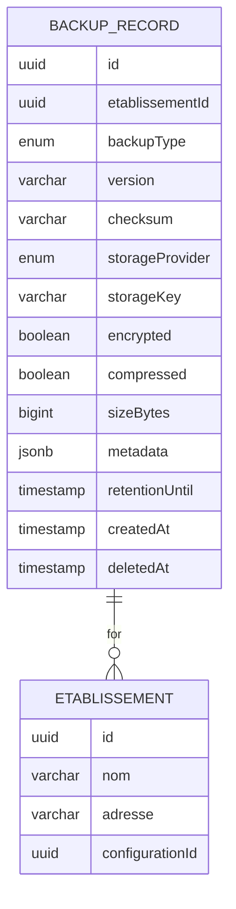
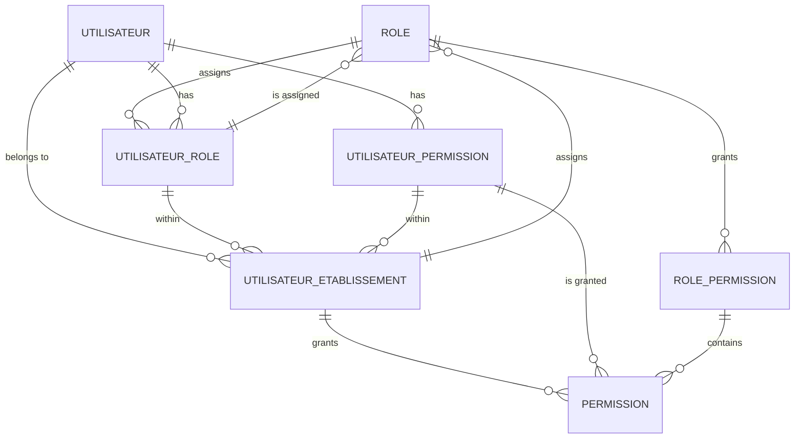
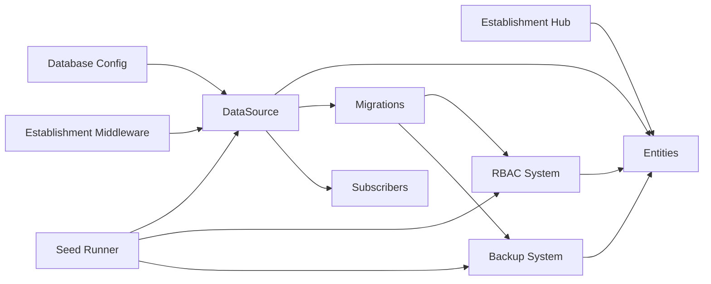

# Database Schema & Data Model

<cite>
**Referenced Files in This Document**
- [data-source.ts](file://backend/src/database/data-source.ts)
- [database.config.ts](file://backend/src/config/database.config.ts)
- [initial.seed.ts](file://backend/src/database/seeds/initial.seed.ts)
- [run-seeds.ts](file://backend/src/database/seeds/run-seeds.ts)
- [rbac.seed.ts](file://backend/src/database/seeds/rbac.seed.ts)
- [002-multi-etablissements.sql](file://backend/src/database/migrations/002-multi-etablissements.sql)
- [008-backup-system-v2.ts.bak](file://backend/src/database/migrations/008-backup-system-v2.ts.bak)
- [annee-scolaire.entity.ts](file://backend/src/modules/annees-scolaires/entities/annee-scolaire.entity.ts)
- [classe.entity.ts](file://backend/src/modules/classes/entities/classe.entity.ts)
- [affectation-eleve.entity.ts](file://backend/src/modules/classes/entities/affectation-eleve.entity.ts)
- [eleve.entity.ts](file://backend/src/modules/eleves/entities/eleve.entity.ts)
- [matiere.entity.ts](file://backend/src/modules/matieres/entities/matiere.entity.ts)
- [matiere-niveau.entity.ts](file://backend/src/modules/matieres/entities/matiere-niveau.entity.ts)
- [affectation-matiere.entity.ts](file://backend/src/modules/matieres/entities/affectation-matiere.entity.ts)
- [note.entity.ts](file://backend/src/modules/notes/entities/note.entity.ts)
- [bulletin.entity.ts](file://backend/src/modules/bulletins/entities/bulletin.entity.ts)
- [periode.entity.ts](file://backend/src/modules/periodes/entities/periode.entity.ts)
- [utilisateur.entity.ts](file://backend/src/modules/auth/entities/utilisateur.entity.ts)
- [audit-log.entity.ts](file://backend/src/modules/auth/entities/audit-log.entity.ts)
- [profil-utilisateur.entity.ts](file://backend/src/modules/auth/entities/profil-utilisateur.entity.ts)
- [refresh-token.entity.ts](file://backend/src/modules/auth/entities/refresh-token.entity.ts)
- [utilisateur-etablissement.entity.ts](file://backend/src/modules/auth/entities/utilisateur-etablissement.entity.ts)
- [role.entity.ts](file://backend/src/modules/auth/entities/role.entity.ts)
- [utilisateur-role.entity.ts](file://backend/src/modules/auth/entities/utilisateur-role.entity.ts)
- [permission.entity.ts](file://backend/src/modules/auth/entities/permission.entity.ts)
- [utilisateur-permission.entity.ts](file://backend/src/modules/auth/entities/utilisateur-permission.entity.ts)
- [niveau.entity.ts](file://backend/src/modules/niveaux/entities/niveau.entity.ts)
- [cycle.entity.ts](file://backend/src/modules/cycles/entities/cycle.entity.ts)
- [etablissement.entity.ts](file://backend/src/modules/etablissement/entities/etablissement.entity.ts)
- [etablissement.service.ts](file://backend/src/modules/etablissement/services/etablissement.service.ts)
- [carte.entity.ts](file://backend/src/modules/cartes/entities/carte.entity.ts)
- [cantine.entity.ts](file://backend/src/modules/cantine/entities/cantine.entity.ts)
- [transport.entity.ts](file://backend/src/modules/transport/entities/transport.entity.ts)
- [personnel.entity.ts](file://backend/src/modules/personnel/entities/personnel.entity.ts)
- [impressions.entity.ts](file://backend/src/modules/impressions/entities/impressions.entity.ts)
- [configuration-app.entity.ts](file://backend/src/modules/configuration/entities/configuration-app.entity.ts)
- [configuration-module.entity.ts](file://backend/src/modules/configuration/entities/configuration-module.entity.ts)
- [historique-configuration.entity.ts](file://backend/src/modules/configuration/entities/historique-configuration.entity.ts)
- [parametre-systeme.entity.ts](file://backend/src/modules/configuration/entities/parametre-systeme.entity.ts)
- [backup-record.entity.ts](file://backend/src/modules/configuration/entities/backup-record.entity.ts)
</cite>

## Update Summary
**Changes Made**
- Added comprehensive backup system documentation with new backup record entity
- Documented backup_records table for production-grade backup management with multi-tenant support
- Added backup type enumeration (CONFIG, DATABASE, FULL) and storage provider enumeration (DATABASE, S3, FILESYSTEM)
- Integrated backup system with establishment-aware architecture for tenant-specific backups
- Enhanced configuration management with backup metadata tracking and retention policies
- Added backup system migration with comprehensive indexing strategy for performance optimization

## Table of Contents
1. [Introduction](#introduction)
2. [Project Structure](#project-structure)
3. [Core Components](#core-components)
4. [Architecture Overview](#architecture-overview)
5. [Detailed Component Analysis](#detailed-component-analysis)
6. [Establishment-Centric Multi-Tenant Design](#establishment-centric-multi-tenant-design)
7. [Backup System Implementation](#backup-system-implementation)
8. [RBAC System Implementation](#rbac-system-implementation)
9. [Migration and Data Transformation](#migration-and-data-transformation)
10. [Dependency Analysis](#dependency-analysis)
11. [Performance Considerations](#performance-considerations)
12. [Troubleshooting Guide](#troubleshooting-guide)
13. [Conclusion](#conclusion)
14. [Appendices](#appendices)

## Introduction
This document describes the eLISAschool academic management system database schema and data model. The system has been redesigned to support multi-establishment architecture with comprehensive RBAC (Role-Based Access Control) capabilities and a production-grade backup system. The establishment entity serves as the central hub coordinating all establishment-specific relationships, while the RBAC system provides fine-grained permission management across users, roles, and establishment contexts. The backup system implements multi-tenant backup management with encryption, compression, and retention policies.

## Project Structure
The database layer is powered by TypeORM against PostgreSQL with enhanced multi-establishment support, comprehensive RBAC implementation, and production-grade backup system. Entities are grouped per domain module under backend/src/modules/*/entities, with establishment relationships integrated across all domain entities. The TypeORM DataSource is configured via environment-driven settings and initialized at application startup with establishment-aware middleware, RBAC support, and backup system integration.

```mermaid
graph TB
subgraph "Application"
APP["App Module"]
END
subgraph "Database Layer"
DS["TypeORM DataSource"]
CFG["Database Config"]
ENT["Entities (modules)"]
SEED["Seeds"]
ETAB["Establishment Hub"]
RBAC["RBAC System"]
BACKUP["Backup System"]
END
APP --> DS
DS --> CFG
DS --> ENT
DS --> SEED
ENT --> ETAB
ENT --> RBAC
ENT --> BACKUP
ETAB --> RBAC
ETAB --> BACKUP
RBAC --> BACKUP
```

**Diagram sources**
- [data-source.ts:17](file://backend/src/database/data-source.ts#L17)
- [database.config.ts:15-51](file://backend/src/config/database.config.ts#L15-L51)
- [etablissement.entity.ts:58](file://backend/src/modules/etablissement/entities/etablissement.entity.ts#L58)
- [utilisateur-etablissement.entity.ts](file://backend/src/modules/auth/entities/utilisateur-etablissement.entity.ts)
- [backup-record.entity.ts:45](file://backend/src/modules/configuration/entities/backup-record.entity.ts#L45)

**Section sources**
- [data-source.ts:17](file://backend/src/database/data-source.ts#L17)
- [database.config.ts:15-51](file://backend/src/config/database.config.ts#L15-L51)

## Core Components
- TypeORM DataSource: Centralized database connection with establishment-aware middleware, RBAC support, and backup system integration
- Establishment Entity: Central hub managing multi-establishment architecture with OneToOne configuration relationships
- RBAC Entities: Comprehensive role-based access control system with establishment-aware permissions
- Backup System: Production-grade backup management with multi-tenant support, encryption, compression, and retention policies
- Entity Modules: Academic and administrative domains with establishment-specific foreign keys
- Seeds: Initial dataset provisioning with establishment context and RBAC seed data
- Configuration Management: Establishment-specific settings, backup metadata tracking, and parameters

Key configuration highlights:
- Database type: PostgreSQL with UUID primary keys
- Establishment relationships: All entities now include establishmentId foreign keys
- OneToOne relationships: Establishment to configuration mapping
- RBAC integration: Role and permission management with establishment context
- Backup system: Multi-tenant backup records with comprehensive metadata and retention tracking
- Synchronization enabled only in development
- Logging controlled by environment
- Connection pooling and SSL options tuned for multi-establishment deployment

**Section sources**
- [database.config.ts:15-51](file://backend/src/config/database.config.ts#L15-L51)
- [data-source.ts:17](file://backend/src/database/data-source.ts#L17)
- [etablissement.entity.ts:96-98](file://backend/src/modules/etablissement/entities/etablissement.entity.ts#L96-L98)
- [backup-record.entity.ts:23-39](file://backend/src/modules/configuration/entities/backup-record.entity.ts#L23-L39)

## Architecture Overview
The schema follows a normalized relational model with UUID primary keys and explicit foreign key relationships. The establishment entity serves as the central hub, with all domain entities maintaining establishment relationships for proper data isolation and tenant separation. The RBAC system provides comprehensive role-based access control with establishment-aware permissions and multi-establishment user management. The backup system implements production-grade backup management with multi-tenant support, encryption, compression, and retention policies.

```mermaid
erDiagram
ANNEE_SCOLAIRE ||--o{ CLASSE : "academic year hosts"
CLASSE ||--o{ ELEVE : "enrolls"
CLASSE ||--o{ MATIERE_NIVEAU : "contains"
MATIERE_NIVEAU ||--o{ AFFECTATION_MATIERE : "assigns"
ELEVE ||--o{ NOTE : "receives"
CLASSE ||--o{ BULLETIN : "generates"
PERIODE ||--o{ BULLETIN : "defines"
UTILISATEUR ||--o{ AUDIT_LOG : "performed actions"
UTILISATEUR ||--o{ PROFIL_UTILISATEUR : "has profile"
UTILISATEUR ||--o{ REFRESH_TOKEN : "holds tokens"
UTILISATEUR ||--o{ UTILISATEUR_ETABLISSEMENT : "belongs to"
UTILISATEUR ||--o{ UTILISATEUR_ROLE : "has roles"
UTILISATEUR ||--o{ UTILISATEUR_PERMISSION : "has permissions"
UTILISATEUR_ETABLISSEMENT ||--o{ ROLE : "assigns"
UTILISATEUR_ETABLISSEMENT ||--o{ PERMISSION : "grants"
UTILISATEUR_ROLE ||--o{ ROLE : "is assigned"
UTILISATEUR_ROLE ||--o{ UTILISATEUR_ETABLISSEMENT : "within"
UTILISATEUR_PERMISSION ||--o{ PERMISSION : "is granted"
UTILISATEUR_PERMISSION ||--o{ UTILISATEUR_ETABLISSEMENT : "within"
NIVEAU ||--o{ MATIERE_NIVEAU : "levels"
CYCLE ||--o{ NIVEAU : "organizes"
ETABLISSEMENT ||--o{ CLASSE : "hosts"
ETABLISSEMENT ||--o{ UTILISATEUR : "employs"
ETABLISSEMENT ||--o{ ANNEE_SCOLAIRE : "manages"
ETABLISSEMENT ||--o{ BULLETIN : "generates"
ETABLISSEMENT ||--o{ PERSONNEL : "employs"
ETABLISSEMENT ||--o{ CARTES : "issues"
ETABLISSEMENT ||--o{ CANTINE : "operates"
ETABLISSEMENT ||--o{ TRANSPORT : "manages"
ETABLISSEMENT ||--o{ IMPRESSIONS : "prints"
ETABLISSEMENT ||--|| CONFIG_APP : "has configuration"
ETABLISSEMENT ||--|| CONFIG_MODULE : "has module config"
ETABLISSEMENT ||--|| HISTORIQUE_CONFIG : "tracks changes"
ETABLISSEMENT ||--|| PARAMETRE_SYSTEME : "uses parameters"
ETABLISSEMENT ||--o{ BACKUP_RECORD : "creates backups"
BACKUP_RECORD ||--o{ ETABLISSEMENT : "for"
```



**Diagram sources**
- [annee-scolaire.entity.ts:44-48](file://backend/src/modules/annees-scolaires/entities/annee-scolaire.entity.ts#L44-L48)
- [classe.entity.ts](file://backend/src/modules/classes/entities/classe.entity.ts)
- [affectation-eleve.entity.ts](file://backend/src/modules/classes/entities/affectation-eleve.entity.ts)
- [eleve.entity.ts](file://backend/src/modules/eleves/entities/eleve.entity.ts)
- [matiere-niveau.entity.ts](file://backend/src/modules/matieres/entities/matiere-niveau.entity.ts)
- [affectation-matiere.entity.ts](file://backend/src/modules/matieres/entities/affectation-matiere.entity.ts)
- [note.entity.ts](file://backend/src/modules/notes/entities/note.entity.ts)
- [bulletin.entity.ts:92-96](file://backend/src/modules/bulletins/entities/bulletin.entity.ts#L92-L96)
- [periode.entity.ts](file://backend/src/modules/periodes/entities/periode.entity.ts)
- [utilisateur.entity.ts:99-107](file://backend/src/modules/auth/entities/utilisateur.entity.ts#L99-L107)
- [audit-log.entity.ts](file://backend/src/modules/auth/entities/audit-log.entity.ts)
- [profil-utilisateur.entity.ts](file://backend/src/modules/auth/entities/profil-utilisateur.entity.ts)
- [refresh-token.entity.ts](file://backend/src/modules/auth/entities/refresh-token.entity.ts)
- [utilisateur-etablissement.entity.ts](file://backend/src/modules/auth/entities/utilisateur-etablissement.entity.ts)
- [role.entity.ts](file://backend/src/modules/auth/entities/role.entity.ts)
- [utilisateur-role.entity.ts](file://backend/src/modules/auth/entities/utilisateur-role.entity.ts)
- [permission.entity.ts](file://backend/src/modules/auth/entities/permission.entity.ts)
- [utilisateur-permission.entity.ts](file://backend/src/modules/auth/entities/utilisateur-permission.entity.ts)
- [niveau.entity.ts](file://backend/src/modules/niveaux/entities/niveau.entity.ts)
- [cycle.entity.ts](file://backend/src/modules/cycles/entities/cycle.entity.ts)
- [etablissement.entity.ts:58](file://backend/src/modules/etablissement/entities/etablissement.entity.ts#L58)
- [personnel.entity.ts](file://backend/src/modules/personnel/entities/personnel.entity.ts)
- [carte.entity.ts:67-72](file://backend/src/modules/cartes/entities/carte.entity.ts#L67-L72)
- [cantine.entity.ts:56-60](file://backend/src/modules/cantine/entities/cantine.entity.ts#L56-L60)
- [transport.entity.ts](file://backend/src/modules/transport/entities/transport.entity.ts)
- [impressions.entity.ts](file://backend/src/modules/impressions/entities/impressions.entity.ts)
- [configuration-app.entity.ts](file://backend/src/modules/configuration/entities/configuration-app.entity.ts)
- [configuration-module.entity.ts](file://backend/src/modules/configuration/entities/configuration-module.entity.ts)
- [historique-configuration.entity.ts](file://backend/src/modules/configuration/entities/historique-configuration.entity.ts)
- [parametre-systeme.entity.ts](file://backend/src/modules/configuration/entities/parametre-systeme.entity.ts)
- [backup-record.entity.ts:45](file://backend/src/modules/configuration/entities/backup-record.entity.ts#L45)

## Detailed Component Analysis

### Academic Year (Years)
- Purpose: Define school years with establishment context and start/end dates
- Key fields: Unique identifier, year label, start date, end date, active flags, establishment foreign key
- Constraints: Unique year label per establishment enforced at the database level
- Business rules: Active year determines current academic period; establishment isolation prevents cross-establishment overlap; overlapping years are prevented by unique constraint including establishmentId

**Section sources**
- [annee-scolaire.entity.ts:14](file://backend/src/modules/annees-scolaires/entities/annee-scolaire.entity.ts#L14)
- [annee-scolaire.entity.ts:19-20](file://backend/src/modules/annees-scolaires/entities/annee-scolaire.entity.ts#L19-L20)
- [annee-scolaire.entity.ts:44-48](file://backend/src/modules/annees-scolaires/entities/annee-scolaire.entity.ts#L44-L48)

### Classes (Classe)
- Purpose: Represent class groups within an academic year and establishment
- Relationships: Belongs to an academic year and establishment; enrolls students; contains subject offerings per grade
- Indexing: UUID primary key; foreign keys to year and establishment; composite indexes for establishment-based queries
- Business rules: Establishment isolation ensures class data separation; class capacity and schedule coordination handled outside schema; referential integrity enforced by FKs

**Section sources**
- [classe.entity.ts](file://backend/src/modules/classes/entities/classe.entity.ts)

### Students (Eleve)
- Purpose: Store student profiles linked to personal and contact details with establishment context
- Relationships: Enrolled in a class via assignment entity; receives grades; generates reports; establishment relationship for data isolation
- Indexing: UUID primary key; links to class via assignment; establishment foreign key for tenant separation
- Business rules: Establishment-aware enrollment lifecycle managed by assignment records; deletion requires cascade handling in assignments; cross-establishment data access prevented

**Section sources**
- [eleve.entity.ts](file://backend/src/modules/eleves/entities/eleve.entity.ts)

### Student-Class Assignment (Affectation Eleve)
- Purpose: Bridge table linking students to classes across time with establishment context
- Keys: Composite or dedicated PK; foreign keys to eleve and classe; establishment foreign key
- Constraints: Ensures one student belongs to one class during a given period; prevents orphan enrollments; establishment isolation
- Business rules: Effective date ranges and concurrent enrollment policies enforced by application/business logic; establishment-aware validation

**Section sources**
- [affectation-eleve.entity.ts](file://backend/src/modules/classes/entities/affectation-eleve.entity.ts)

### Subjects and Levels (Matiere, Niveau, MatiereNiveau)
- Matiere: Subject catalog with attributes and establishment context
- Niveau: Grade levels (e.g., primary, secondary) with establishment relationships
- MatiereNiveau: Cross-reference for which subjects are taught per level with establishment isolation
- Relationships: Matiere to MatiereNiveau; Niveau to MatiereNiveau; MatiereNiveau to Classe via teaching assignments; establishment foreign keys
- Indexing: Foreign keys; composite indexes may be beneficial for frequent queries by level and subject within establishments
- Business rules: Establishment-specific subject catalogs; cross-establishment subject sharing prevented; level hierarchies isolated

**Section sources**
- [matiere.entity.ts](file://backend/src/modules/matieres/entities/matiere.entity.ts)
- [niveau.entity.ts](file://backend/src/modules/niveaux/entities/niveau.entity.ts)
- [matiere-niveau.entity.ts](file://backend/src/modules/matieres/entities/matiere-niveau.entity.ts)

### Subject Assignments (AffectationMatiere)
- Purpose: Assign teachers or subject coordinators to specific subject/level/class combinations with establishment context
- Keys: Foreign keys to MatiereNiveau and Classe; optional teacher link; establishment foreign key
- Business rules: One subject/level/class combination per assignment; establishment isolation prevents cross-establishment assignments; scheduling conflicts resolved by application logic

**Section sources**
- [affectation-matiere.entity.ts](file://backend/src/modules/matieres/entities/affectation-matiere.entity.ts)

### Grades (Note)
- Purpose: Store individual assessment scores for students in specific subjects and periods with establishment context
- Keys: Foreign keys to Eleve, MatiereNiveau, and Periode; ensures granularity of grading; establishment foreign key
- Constraints: Score bounds validated by application; uniqueness constraints prevent duplicate entries for identical student-subject-period combinations; establishment isolation
- Business rules: Weighted averages and grade boundaries managed by service logic; establishment-specific grade reporting; aggregation into reports handled separately

**Section sources**
- [note.entity.ts](file://backend/src/modules/notes/entities/note.entity.ts)

### Periods (Periode)
- Purpose: Define grading periods (e.g., trimesters) within an academic year with establishment context
- Keys: Foreign key to AnneeScolaire; used to scope grade reporting; establishment foreign key
- Business rules: Periods must fall within the academic year; establishment isolation ensures period uniqueness; open/close windows for submissions enforced by application

**Section sources**
- [periode.entity.ts](file://backend/src/modules/periodes/entities/periode.entity.ts)

### Reports (Bulletin)
- Purpose: Aggregate student grades per period and class for official reporting with establishment context
- Keys: Foreign keys to Classe and Periode; links to student records via grades; establishment foreign key
- Business rules: Report generation depends on completeness of grades; establishment-specific report generation; finalization flags managed by application; establishment isolation

**Section sources**
- [bulletin.entity.ts:92-96](file://backend/src/modules/bulletins/entities/bulletin.entity.ts#L92-L96)

### Users and Authentication (Utilisateur, ProfilUtilisateur, RefreshToken, AuditLog)
- Utilisateur: Core user account with establishment context and profile linkage
- ProfilUtilisateur: Additional profile attributes (e.g., role, permissions) with establishment relationships
- RefreshToken: Token persistence for session refresh with establishment awareness
- AuditLog: Comprehensive audit trail of user actions with establishment context and severity metadata
- Relationships: One-to-one or one-to-many depending on entity; FKs enforce referential integrity; establishment foreign keys
- Security: Tokens and logs are sensitive; establishment isolation ensures proper access control; establishment-aware retention policies

**Section sources**
- [utilisateur.entity.ts:99-107](file://backend/src/modules/auth/entities/utilisateur.entity.ts#L99-L107)
- [profil-utilisateur.entity.ts](file://backend/src/modules/auth/entities/profil-utilisateur.entity.ts)
- [refresh-token.entity.ts](file://backend/src/modules/auth/entities/refresh-token.entity.ts)
- [audit-log.entity.ts](file://backend/src/modules/auth/entities/audit-log.entity.ts)

### Establishment and Personnel (Etablissement, Personnel)
- Etablissement: School or institution entity as central hub; hosts classes and employs staff; manages establishment configuration
- Personnel: Staff members mapped to users with establishment relationships; supports HR and administrative workflows within establishment context
- Relationships: Personnel linked to Utilisateur; both linked to Etablissement; establishment foreign keys ensure proper tenant separation
- Configuration: OneToOne relationship with establishment configuration for establishment-specific settings

**Section sources**
- [etablissement.entity.ts:58](file://backend/src/modules/etablissement/entities/etablissement.entity.ts#L58)
- [etablissement.entity.ts:96-98](file://backend/src/modules/etablissement/entities/etablissement.entity.ts#L96-L98)
- [personnel.entity.ts](file://backend/src/modules/personnel/entities/personnel.entity.ts)

### Cards, Canteen, Transport, Impressions
- Carte: Identity or access card records with establishment foreign key for establishment-specific card management
- Cantine: Meal-related data (catalog, orders, balances) with establishment context for establishment-specific canteen operations
- Transport: Transportation records and routes with establishment relationships for establishment-specific transport management
- Impressions: Printing or document generation logs with establishment foreign keys for establishment-specific printing operations
- Relationships: Typically link to students or users; establishment foreign keys ensure proper tenant separation; support operational workflows within establishment context

**Section sources**
- [carte.entity.ts:67-72](file://backend/src/modules/cartes/entities/carte.entity.ts#L67-L72)
- [cantine.entity.ts:56-60](file://backend/src/modules/cantine/entities/cantine.entity.ts#L56-L60)
- [transport.entity.ts](file://backend/src/modules/transport/entities/transport.entity.ts)
- [impressions.entity.ts](file://backend/src/modules/impressions/entities/impressions.entity.ts)

### Configuration (ConfigurationApp, ConfigurationModule, HistoriqueConfiguration, ParametreSysteme)
- ConfigurationApp: Application-wide configuration set with establishment relationships for establishment-specific settings
- ConfigurationModule: Module-scoped settings with establishment foreign keys for establishment isolation
- HistoriqueConfiguration: Change history for auditing configuration drift with establishment context
- ParametreSysteme: System parameters driving behavior with establishment relationships for establishment-specific parameterization
- Relationships: Hierarchical ownership with establishment foreign keys; history tracks changes over time within establishment context

**Section sources**
- [configuration-app.entity.ts](file://backend/src/modules/configuration/entities/configuration-app.entity.ts)
- [configuration-module.entity.ts](file://backend/src/modules/configuration/entities/configuration-module.entity.ts)
- [historique-configuration.entity.ts](file://backend/src/modules/configuration/entities/historique-configuration.entity.ts)
- [parametre-systeme.entity.ts](file://backend/src/modules/configuration/entities/parametre-systeme.entity.ts)

### Backup Records (BackupRecord)
**Updated** Added comprehensive backup system implementation

- Purpose: Store metadata for all backup operations with multi-tenant support, encryption, compression, and retention tracking
- Key fields: Unique identifier, establishment foreign key (nullable for system-wide backups), backup type, version, checksum, storage provider, storage key, encryption/compression flags, size metrics, metadata, retention timestamp, creation/deletion timestamps
- Enumerations: BackupType (CONFIG, DATABASE, FULL) and StorageProvider (DATABASE, S3, FILESYSTEM)
- Indexing: Composite indexes on (etablissementId, backupType, createdAt) for tenant-specific queries, checksum index for deduplication, retention index for cleanup operations, soft-delete index for archive queries
- Cascade operations: Establishment cascade deletion ensures backup records are cleaned up when establishments are removed
- Business rules: Nullable establishmentId enables system-wide backups; checksum ensures backup uniqueness; retention tracking supports automated cleanup; multi-tenant isolation prevents cross-establishment backup access

**Section sources**
- [backup-record.entity.ts:11-65](file://backend/src/modules/configuration/entities/backup-record.entity.ts#L11-L65)
- [008-backup-system-v2.ts.bak:32-108](file://backend/src/database/migrations/008-backup-system-v2.ts.bak#L32-L108)

### Multi-Etablissements User Management (UtilisateurEtablissement)
**Updated** Added comprehensive multi-establishment user management system

- Purpose: Manage user associations with multiple establishments and establish primary establishment context
- Key fields: User ID, establishment ID, role assignment, primary establishment flag, active status, effective dates
- Junction table: Acts as bridge between users and establishments with establishment-aware role assignments
- Indexing: Composite indexes on (etablissement_id, actif) and (utilisateur_id, etablissement_principal)
- Business rules: Single primary establishment per user; multiple establishment memberships allowed; establishment isolation enforced

**Section sources**
- [utilisateur-etablissement.entity.ts](file://backend/src/modules/auth/entities/utilisateur-etablissement.entity.ts)
- [002-multi-etablissements.sql:47-51](file://backend/src/database/migrations/002-multi-etablissements.sql#L47-L51)

### RBAC System Entities
**Updated** Added comprehensive RBAC system documentation

#### Roles (Role)
- Purpose: Define user roles with establishment context and permission assignments
- Key fields: Role code, label, description, establishment foreign key, active status
- Business rules: Unique role codes per establishment; establishment-aware role hierarchy; permission inheritance

#### Permissions (Permission)
- Purpose: Define granular permissions for system access control
- Key fields: Permission code, label, module, action, establishment foreign key, active status
- Business rules: Permission codes follow module:action pattern; establishment isolation; hierarchical permission structure

#### User-Roles (UtilisateurRole)
- Purpose: Assign roles to users with establishment context and attribution dates
- Key fields: User ID, role ID, primary role flag, attribution date, establishment foreign key
- Business rules: Single primary role per user; establishment-aware role assignments; role hierarchy validation

#### User-Permissions (UtilisateurPermission)
- Purpose: Grant individual permissions to users with establishment context
- Key fields: User ID, permission ID, grant date, establishment foreign key
- Business rules: Direct permission grants override role-based permissions; establishment isolation; temporal validity

**Section sources**
- [role.entity.ts](file://backend/src/modules/auth/entities/role.entity.ts)
- [permission.entity.ts](file://backend/src/modules/auth/entities/permission.entity.ts)
- [utilisateur-role.entity.ts](file://backend/src/modules/auth/entities/utilisateur-role.entity.ts)
- [utilisateur-permission.entity.ts](file://backend/src/modules/auth/entities/utilisateur-permission.entity.ts)

### Initial Seed Data
- Purpose: Populate baseline data for a fresh installation with establishment context (e.g., master lists, default configurations)
- Structure: Defined in seed files; executed via seed runner with establishment relationships
- Lifecycle: Run once at bootstrap or migration; establishment-aware idempotency depends on seed implementation
- Establishment Context: Seed data includes establishment foreign keys for proper tenant separation
- RBAC Seed Data: Comprehensive role and permission seed data with establishment-aware assignments

**Section sources**
- [initial.seed.ts](file://backend/src/database/seeds/initial.seed.ts)
- [run-seeds.ts](file://backend/src/database/seeds/run-seeds.ts)
- [rbac.seed.ts](file://backend/src/database/seeds/rbac.seed.ts)

## Establishment-Centric Multi-Tenant Design

### Establishment Entity as Central Hub
The establishment entity serves as the cornerstone of the multi-establishment architecture, managing all establishment-specific relationships and configurations. Each establishment operates as an independent tenant with complete data isolation and operational autonomy.

**Key Features:**
- **Central Hub Design**: All establishment relationships flow through the establishment entity
- **OneToOne Configuration**: Each establishment has exactly one configuration entity for establishment-specific settings
- **Establishment Foreign Keys**: All domain entities include establishmentId foreign keys for proper tenant separation
- **Business Rule Enforcement**: Establishment isolation prevents cross-establishment data access and operations

### Establishment Configuration Management
Establishment-specific configurations are managed through a dedicated configuration entity with OneToOne relationship to the establishment entity.

**Configuration Features:**
- **Active Cycles**: Establishment-specific academic cycle management
- **Bulletin Settings**: Establishment-specific report generation parameters
- **System Parameters**: Establishment-aware system behavior configuration
- **Change Tracking**: Historical configuration tracking for compliance and audit purposes

### Establishment Relationships Across Entities
All domain entities maintain establishment relationships to ensure proper data isolation and tenant separation.

**Establishment-Aware Entities:**
- Academic entities (classes, students, subjects, grades)
- Administrative entities (personnel, configuration)
- Operational entities (cards, canteen, transport, impressions)
- User management entities (authentication, authorization)
- Backup system entities (backup records)
- RBAC entities (roles, permissions, user-role assignments)

**Relationship Patterns:**
- **Foreign Key Integration**: All entities include establishmentId foreign keys
- **Index Optimization**: Composite indexes for establishment-based queries
- **Cascade Operations**: Establishment-aware cascade behaviors for data integrity
- **Query Isolation**: Establishment-specific query patterns for tenant separation

### Multi-Tenant Business Rules
The establishment-centric design enforces strict business rules for proper tenant separation and data integrity.

**Tenant Separation Rules:**
- **Data Isolation**: No cross-establishment data access permitted
- **Unique Constraints**: Establishment-aware unique constraints prevent conflicts
- **Audit Trail**: Establishment-specific audit logging for compliance
- **Resource Allocation**: Establishment-specific resource management and limits

**Operational Constraints:**
- **Cross-Tenant Prevention**: Business logic prevents establishment-to-establishment operations
- **Configuration Isolation**: Establishment-specific settings cannot be accessed by other establishments
- **User Assignment**: Users are permanently bound to single establishment
- **Cascade Deletion**: Establishment deletion cascades appropriately to maintain data integrity

**Section sources**
- [etablissement.entity.ts:58](file://backend/src/modules/etablissement/entities/etablissement.entity.ts#L58)
- [etablissement.entity.ts:96-98](file://backend/src/modules/etablissement/entities/etablissement.entity.ts#L96-L98)
- [etablissement.service.ts:35-44](file://backend/src/modules/etablissement/services/etablissement.service.ts#L35-L44)
- [utilisateur.entity.ts:99-107](file://backend/src/modules/auth/entities/utilisateur.entity.ts#L99-L107)
- [bulletin.entity.ts:92-96](file://backend/src/modules/bulletins/entities/bulletin.entity.ts#L92-L96)
- [carte.entity.ts:67-72](file://backend/src/modules/cartes/entities/carte.entity.ts#L67-L72)
- [cantine.entity.ts:56-60](file://backend/src/modules/cantine/entities/cantine.entity.ts#L56-L60)
- [backup-record.entity.ts:53-65](file://backend/src/modules/configuration/entities/backup-record.entity.ts#L53-L65)

## Backup System Implementation

### Backup System Architecture Overview
The backup system provides production-grade backup management with multi-tenant support, encryption, compression, and retention policies. The system implements a comprehensive backup record tracking mechanism with establishment-aware isolation and metadata management.



**Diagram sources**
- [backup-record.entity.ts:45-65](file://backend/src/modules/configuration/entities/backup-record.entity.ts#L45-L65)
- [etablissement.entity.ts:58](file://backend/src/modules/etablissement/entities/etablissement.entity.ts#L58)

### Backup Record Entity
The BackupRecord entity serves as the central metadata store for all backup operations, implementing comprehensive tracking with multi-tenant support.

**Backup Record Characteristics:**
- **Multi-Tenant Support**: Nullable establishmentId enables both establishment-specific and system-wide backups
- **Backup Types**: Enumerated backup types (CONFIG, DATABASE, FULL) for precise backup categorization
- **Storage Providers**: Flexible storage provider support (DATABASE, S3, FILESYSTEM) for various deployment scenarios
- **Security Features**: Built-in encryption and compression flags for backup security and efficiency
- **Retention Management**: Dedicated retention tracking with automated cleanup support
- **Metadata Tracking**: JSONB metadata field for arbitrary backup information storage

### Backup Types and Storage Providers
The system supports three primary backup types and three storage providers, enabling flexible deployment scenarios.

**Backup Types:**
- **CONFIG**: Configuration-only backups for settings and parameters
- **DATABASE**: Database-only backups for data integrity
- **FULL**: Complete system backups including both configuration and database

**Storage Providers:**
- **DATABASE**: In-database storage for small backups and development environments
- **S3**: Cloud storage integration for scalable enterprise deployments
- **FILESYSTEM**: Local filesystem storage for hybrid and edge computing scenarios

### Indexing Strategy for Performance
The backup system implements a comprehensive indexing strategy optimized for common backup operations and tenant isolation.

**Index Categories:**
- **Tenant Isolation Index**: Composite index on (etablissementId, backupType, createdAt) for efficient establishment-specific queries
- **Uniqueness Index**: Checksum index for duplicate detection and backup deduplication
- **Retention Index**: Conditional index on retentionUntil for automated cleanup operations
- **Soft-Delete Index**: Conditional index on deletedAt for archive and recovery operations

### Backup Lifecycle Management
The backup system implements comprehensive lifecycle management with establishment-aware operations and retention policies.

**Lifecycle Stages:**
- **Creation**: Backup metadata recorded with establishment context and security flags
- **Processing**: Backup execution with progress tracking and error handling
- **Archival**: Metadata archival with soft-delete support for recovery operations
- **Cleanup**: Automated retention-based cleanup with establishment-specific policies

**Section sources**
- [backup-record.entity.ts:11-65](file://backend/src/modules/configuration/entities/backup-record.entity.ts#L11-L65)
- [008-backup-system-v2.ts.bak:28-108](file://backend/src/database/migrations/008-backup-system-v2.ts.bak#L28-L108)

## RBAC System Implementation

### RBAC Architecture Overview
The RBAC system provides comprehensive role-based access control with establishment-aware permissions and multi-establishment user management. The system consists of four core entities working together to provide fine-grained access control.



**Diagram sources**
- [role.entity.ts](file://backend/src/modules/auth/entities/role.entity.ts)
- [utilisateur-role.entity.ts](file://backend/src/modules/auth/entities/utilisateur-role.entity.ts)
- [utilisateur-permission.entity.ts](file://backend/src/modules/auth/entities/utilisateur-permission.entity.ts)
- [utilisateur-etablissement.entity.ts](file://backend/src/modules/auth/entities/utilisateur-etablissement.entity.ts)
- [permission.entity.ts](file://backend/src/modules/auth/entities/permission.entity.ts)

### Role Management
Roles represent collections of permissions that can be assigned to users within specific establishments. Each role maintains establishment context and can contain multiple permissions.

**Role Characteristics:**
- **Establishment Context**: Roles are established within specific establishments
- **Permission Collections**: Roles aggregate multiple permissions for simplified management
- **Hierarchical Structure**: Roles can inherit permissions from parent roles
- **Assignment Tracking**: Role assignment timestamps and primary role designation

### Permission Management
Permissions define granular access rights within the system, following a structured naming convention and establishment isolation.

**Permission Structure:**
- **Code Convention**: module:action format (e.g., users:create, grades:view)
- **Module Organization**: Permissions organized by functional modules
- **Action Types**: CRUD operations and custom actions
- **Establishment Isolation**: Permissions scoped to specific establishments

### User-Role Assignment
Users can be assigned multiple roles within the same establishment, with one designated as their primary role for default permissions.

**Assignment Rules:**
- **Multiple Assignments**: Users can hold multiple roles simultaneously
- **Primary Role**: Single primary role determines default permissions
- **Temporal Validity**: Role assignments can have effective date ranges
- **Establishment Scope**: Role assignments are establishment-specific

### User-Permission Assignment
Direct permission grants can be applied to users, overriding role-based permissions when necessary.

**Grant Characteristics:**
- **Direct Grants**: Individual permissions assigned to specific users
- **Override Capability**: Direct grants take precedence over role-based permissions
- **Establishment Context**: Direct grants are establishment-specific
- **Temporary Grants**: Permissions can be granted for specific time periods

### Establishment-Aware RBAC
The RBAC system integrates seamlessly with the multi-establishment architecture, ensuring proper tenant separation and establishment isolation.

**Establishment Integration:**
- **Multi-Establishment Support**: Users can belong to multiple establishments with different roles
- **Primary Establishment**: Each user has a designated primary establishment
- **Isolation Enforcement**: RBAC operations respect establishment boundaries
- **Cross-Establishment Limitations**: Users cannot access resources outside their establishment context

**Section sources**
- [role.entity.ts](file://backend/src/modules/auth/entities/role.entity.ts)
- [permission.entity.ts](file://backend/src/modules/auth/entities/permission.entity.ts)
- [utilisateur-role.entity.ts](file://backend/src/modules/auth/entities/utilisateur-role.entity.ts)
- [utilisateur-permission.entity.ts](file://backend/src/modules/auth/entities/utilisateur-permission.entity.ts)
- [utilisateur-etablissement.entity.ts](file://backend/src/modules/auth/entities/utilisateur-etablissement.entity.ts)

## Migration and Data Transformation

### Multi-Etablissements Migration Strategy
The migration to support multi-establishments follows a carefully planned approach that maintains backward compatibility while enabling new functionality.

**Migration Phases:**
1. **Schema Enhancement**: Addition of utilisateur_etablissements table and RBAC entities
2. **Data Migration**: Transformation of legacy user-establishment relationships
3. **Validation**: Verification of migrated data and establishment isolation
4. **Cleanup**: Optional removal of legacy columns in future migrations

### Backup System Migration Strategy
The backup system migration implements a production-grade backup infrastructure with comprehensive multi-tenant support and performance optimizations.

**Migration Phases:**
1. **Schema Creation**: Implementation of backup_records table with comprehensive indexing
2. **Storage Provider Integration**: Setup of multi-provider storage architecture
3. **Security Implementation**: Encryption, compression, and retention policy integration
4. **Performance Optimization**: Index tuning and query optimization for backup operations

### Backward Compatibility Preservation
The migration maintains backward compatibility through careful column preservation and gradual transition.

**Compatibility Measures:**
- **Legacy Column Retention**: Original etablissementId column preserved for legacy support
- **Gradual Transition**: Codebase adapted incrementally to use new multi-establishment system
- **Rollback Capability**: Migration includes rollback procedures for safety
- **Testing Validation**: Comprehensive testing ensures data integrity during transition

### Data Migration Process
The migration process transforms existing user-establishment relationships into the new multi-establishment framework.

**Migration Steps:**
1. **Table Creation**: utilisateur_etablissements table created with establishment-aware design
2. **Index Creation**: Essential indexes for performance and establishment filtering
3. **Data Transfer**: Existing user-establishment relationships migrated to new table
4. **Verification**: Statistical verification confirms successful data transfer
5. **Inconsistency Checking**: Validation identifies and reports potential data issues

### RBAC Seed Data Generation
The RBAC system includes comprehensive seed data to support immediate functionality and proper permission management.

**Seed Data Components:**
- **Role Definitions**: Complete set of system roles with establishment context
- **Permission Sets**: Granular permissions organized by functional modules
- **Role-Permission Mapping**: Strategic assignment of permissions to roles
- **User Role Assignment**: Migration of legacy role assignments to new system

**Seed Data Process:**
- **Permission Creation**: Automatic creation of missing permissions with proper labeling
- **Role Permission Assignment**: Bulk assignment of permissions to appropriate roles
- **User Role Migration**: Transformation of legacy user roles to new multi-establishment system
- **Logging and Tracking**: Comprehensive logging of seed data operations

**Section sources**
- [002-multi-etablissements.sql:47-129](file://backend/src/database/migrations/002-multi-etablissements.sql#L47-L129)
- [008-backup-system-v2.ts.bak:28-108](file://backend/src/database/migrations/008-backup-system-v2.ts.bak#L28-L108)
- [rbac.seed.ts:297-365](file://backend/src/database/seeds/rbac.seed.ts#L297-L365)

## Dependency Analysis
- Coupling: Entities are grouped by domain modules with establishment relationships; cross-module references are explicit via foreign keys
- Cohesion: Each module encapsulates related entities and services with establishment context
- External dependencies: PostgreSQL via TypeORM with establishment-aware middleware; environment-driven configuration
- Initialization: DataSource loads entities dynamically from module folders with establishment relationships; migrations and subscribers support multi-establishment deployment
- Establishment Middleware: Tenant-aware middleware ensures proper establishment context for all operations
- RBAC Integration: Comprehensive RBAC system integrated across authentication and authorization layers
- Backup System Integration: Production-grade backup system integrated with establishment-aware architecture and multi-provider storage support



**Diagram sources**
- [database.config.ts:30-36](file://backend/src/config/database.config.ts#L30-L36)
- [data-source.ts:17](file://backend/src/database/data-source.ts#L17)
- [etablissement.entity.ts:58](file://backend/src/modules/etablissement/entities/etablissement.entity.ts#L58)
- [utilisateur-etablissement.entity.ts](file://backend/src/modules/auth/entities/utilisateur-etablissement.entity.ts)
- [backup-record.entity.ts:45](file://backend/src/modules/configuration/entities/backup-record.entity.ts#L45)

**Section sources**
- [database.config.ts:30-36](file://backend/src/config/database.config.ts#L30-L36)
- [data-source.ts:17](file://backend/src/database/data-source.ts#L17)

## Performance Considerations
Derived from configuration and schema design with establishment awareness:
- Connection pooling: Larger pool in production to handle multiple establishment connections concurrently
- Logging: Minimal logging in production; enable only for diagnostics with establishment context
- Synchronization: Disabled in production to avoid schema drift; rely on migrations with establishment awareness
- SSL: Enabled in production for secure connections across establishment boundaries
- Indexing strategy recommendations:
  - Add indexes on frequently filtered/sorted columns (e.g., foreign keys, academic year ranges, user identifiers, establishmentId)
  - Consider composite indexes for multi-column filters (e.g., Eleve+MatiereNiveau+Periode+establishmentId)
  - Partitioning may be considered for large historical tables (grades, audit logs, backup records) based on establishmentId and time ranges
  - Establishment-specific indexes for high-volume establishment queries
  - RBAC-specific indexes on utilisateur_etablissements (etablissement_id, actif) and (utilisateur_id, etablissement_principal)
  - Backup system indexes: Composite tenant index, checksum index, retention index, and soft-delete index for optimal backup operations
- Query optimization patterns:
  - Use joins with establishment filters to minimize result sets and ensure tenant isolation
  - Denormalized aggregates (e.g., report summaries) can reduce runtime computation at the cost of write overhead
  - Batch writes for bulk operations (e.g., importing grades) with establishment context
  - Establishment-aware caching strategies for frequently accessed establishment data
  - RBAC query optimization using proper indexing on role and permission relationships
  - Backup query optimization through proper indexing and establishment-aware filtering
- Multi-establishment optimization:
  - Establishment-specific query routing for optimal performance
  - Establishment-aware connection pooling for resource allocation
  - Tenant isolation enforcement at query execution level
  - RBAC query optimization through proper indexing and join strategies
  - Backup system optimization with establishment-aware queries and retention-based cleanup

## Troubleshooting Guide
- Connection failures:
  - Verify environment variables for host, port, user, password, and database name
  - Confirm SSL settings match target environment
  - Check establishment middleware configuration for proper tenant context
- Migration errors:
  - Ensure migrations directory exists and TypeORM can discover migration files
  - Check synchronization flag; in production, disable automatic sync and use migrations
  - Verify establishment relationships in migration scripts
  - Validate RBAC seed data generation and role-permission assignments
  - Confirm backup system migration completion and index creation
- Seed execution:
  - Confirm seed runner is invoked and initial seed file is present
  - Validate seed logic idempotency to avoid duplicate inserts
  - Check establishment foreign keys in seed data
  - Verify RBAC seed data integrity and role-permission mappings
  - Validate backup system seed data and storage provider configuration
- Establishment-specific issues:
  - Verify establishmentId is properly set in establishment-aware entities
  - Check establishment configuration relationships for proper setup
  - Ensure establishment middleware is functioning correctly for tenant isolation
  - Validate utilisateur_etablissements table data integrity and indexes
- RBAC issues:
  - Verify role and permission assignments in utilisateur_role and utilisateur_permission tables
  - Check establishment-aware permission resolution and user-role inheritance
  - Validate primary establishment assignment and multi-establishment user access
  - Ensure proper RBAC middleware operation and permission checking
- Backup system issues:
  - Verify backup_records table creation and proper indexing
  - Check establishment-aware backup operations and multi-provider storage configuration
  - Validate backup type enumeration and storage provider compatibility
  - Ensure retention policies are properly enforced and cleanup operations function correctly
- Audit and logs:
  - Review audit log entries for failed operations and error messages
  - Monitor database logs for slow queries and deadlocks
  - Check establishment-specific audit trails for compliance tracking
  - Validate RBAC audit logging and permission change tracking
  - Monitor backup system logs for backup operation failures and storage provider errors

**Section sources**
- [database.config.ts:15-51](file://backend/src/config/database.config.ts#L15-L51)
- [run-seeds.ts](file://backend/src/database/seeds/run-seeds.ts)
- [etablissement.service.ts:119-153](file://backend/src/modules/etablissement/services/etablissement.service.ts#L119-L153)
- [002-multi-etablissements.sql:47-129](file://backend/src/database/migrations/002-multi-etablissements.sql#L47-L129)
- [008-backup-system-v2.ts.bak:28-108](file://backend/src/database/migrations/008-backup-system-v2.ts.bak#L28-L108)
- [rbac.seed.ts:297-365](file://backend/src/database/seeds/rbac.seed.ts#L297-L365)

## Conclusion
The eLISAschool schema has been successfully redesigned to support multi-establishment architecture with comprehensive RBAC capabilities and a production-grade backup system. The establishment entity serves as the central hub for tenant management, while the RBAC system provides fine-grained access control with establishment-aware permissions. The backup system implements comprehensive backup management with multi-tenant support, encryption, compression, and retention policies. The migration strategy ensures backward compatibility while enabling advanced multi-establishment functionality and robust backup infrastructure. TypeORM's environment-driven configuration with establishment-aware middleware, RBAC support, and backup system integration enables safe, scalable deployments across multiple establishments. Proper indexing, migration discipline, seed management, establishment middleware, comprehensive RBAC implementation, and robust backup system are essential for maintaining performance, integrity, and operability across the multi-establishment environment.

## Appendices

### Entity Relationship Diagram (ERD) with Establishment Context

```mermaid
erDiagram
ANNEE_SCOLAIRE ||--o{ CLASSE : "academic year hosts"
CLASSE ||--o{ ELEVE : "enrolls"
CLASSE ||--o{ MATIERE_NIVEAU : "teaches"
MATIERE_NIVEAU ||--o{ AFFECTATION_MATIERE : "assigned"
ELEVE ||--o{ NOTE : "scores"
CLASSE ||--o{ BULLETIN : "reports"
PERIODE ||--o{ BULLETIN : "periods"
UTILISATEUR ||--o{ AUDIT_LOG : "audits"
UTILISATEUR ||--o{ PROFIL_UTILISATEUR : "profiles"
UTILISATEUR ||--o{ REFRESH_TOKEN : "tokens"
UTILISATEUR ||--o{ UTILISATEUR_ETABLISSEMENT : "belongs to"
UTILISATEUR ||--o{ UTILISATEUR_ROLE : "has roles"
UTILISATEUR ||--o{ UTILISATEUR_PERMISSION : "has permissions"
UTILISATEUR_ETABLISSEMENT ||--o{ ROLE : "assigns"
UTILISATEUR_ETABLISSEMENT ||--o{ PERMISSION : "grants"
UTILISATEUR_ROLE ||--o{ ROLE : "is assigned"
UTILISATEUR_ROLE ||--o{ UTILISATEUR_ETABLISSEMENT : "within"
UTILISATEUR_PERMISSION ||--o{ PERMISSION : "is granted"
UTILISATEUR_PERMISSION ||--o{ UTILISATEUR_ETABLISSEMENT : "within"
NIVEAU ||--o{ MATIERE_NIVEAU : "levels"
CYCLE ||--o{ NIVEAU : "cycles"
ETABLISSEMENT ||--o{ CLASSE : "hosts"
ETABLISSEMENT ||--o{ UTILISATEUR : "employs"
ETABLISSEMENT ||--o{ ANNEE_SCOLAIRE : "manages"
ETABLISSEMENT ||--o{ BULLETIN : "generates"
ETABLISSEMENT ||--o{ PERSONNEL : "employs"
ETABLISSEMENT ||--o{ CARTES : "issues"
ETABLISSEMENT ||--o{ CANTINE : "operates"
ETABLISSEMENT ||--o{ TRANSPORT : "manages"
ETABLISSEMENT ||--o{ IMPRESSIONS : "prints"
ETABLISSEMENT ||--|| CONFIG_APP : "has configuration"
ETABLISSEMENT ||--|| CONFIG_MODULE : "has module config"
ETABLISSEMENT ||--|| HISTORIQUE_CONFIG : "tracks changes"
ETABLISSEMENT ||--|| PARAMETRE_SYSTEME : "uses parameters"
ETABLISSEMENT ||--o{ BACKUP_RECORD : "creates backups"
BACKUP_RECORD ||--o{ ETABLISSEMENT : "for"
```


**Diagram sources**
- [annee-scolaire.entity.ts:44-48](file://backend/src/modules/annees-scolaires/entities/annee-scolaire.entity.ts#L44-L48)
- [classe.entity.ts](file://backend/src/modules/classes/entities/classe.entity.ts)
- [affectation-eleve.entity.ts](file://backend/src/modules/classes/entities/affectation-eleve.entity.ts)
- [eleve.entity.ts](file://backend/src/modules/eleves/entities/eleve.entity.ts)
- [matiere-niveau.entity.ts](file://backend/src/modules/matieres/entities/matiere-niveau.entity.ts)
- [affectation-matiere.entity.ts](file://backend/src/modules/matieres/entities/affectation-matiere.entity.ts)
- [note.entity.ts](file://backend/src/modules/notes/entities/note.entity.ts)
- [bulletin.entity.ts:92-96](file://backend/src/modules/bulletins/entities/bulletin.entity.ts#L92-L96)
- [periode.entity.ts](file://backend/src/modules/periodes/entities/periode.entity.ts)
- [utilisateur.entity.ts:99-107](file://backend/src/modules/auth/entities/utilisateur.entity.ts#L99-L107)
- [audit-log.entity.ts](file://backend/src/modules/auth/entities/audit-log.entity.ts)
- [profil-utilisateur.entity.ts](file://backend/src/modules/auth/entities/profil-utilisateur.entity.ts)
- [refresh-token.entity.ts](file://backend/src/modules/auth/entities/refresh-token.entity.ts)
- [utilisateur-etablissement.entity.ts](file://backend/src/modules/auth/entities/utilisateur-etablissement.entity.ts)
- [role.entity.ts](file://backend/src/modules/auth/entities/role.entity.ts)
- [utilisateur-role.entity.ts](file://backend/src/modules/auth/entities/utilisateur-role.entity.ts)
- [permission.entity.ts](file://backend/src/modules/auth/entities/permission.entity.ts)
- [utilisateur-permission.entity.ts](file://backend/src/modules/auth/entities/utilisateur-permission.entity.ts)
- [niveau.entity.ts](file://backend/src/modules/niveaux/entities/niveau.entity.ts)
- [cycle.entity.ts](file://backend/src/modules/cycles/entities/cycle.entity.ts)
- [etablissement.entity.ts:58](file://backend/src/modules/etablissement/entities/etablissement.entity.ts#L58)
- [personnel.entity.ts](file://backend/src/modules/personnel/entities/personnel.entity.ts)
- [carte.entity.ts:67-72](file://backend/src/modules/cartes/entities/carte.entity.ts#L67-L72)
- [cantine.entity.ts:56-60](file://backend/src/modules/cantine/entities/cantine.entity.ts#L56-L60)
- [transport.entity.ts](file://backend/src/modules/transport/entities/transport.entity.ts)
- [impressions.entity.ts](file://backend/src/modules/impressions/entities/impressions.entity.ts)
- [configuration-app.entity.ts](file://backend/src/modules/configuration/entities/configuration-app.entity.ts)
- [configuration-module.entity.ts](file://backend/src/modules/configuration/entities/configuration-module.entity.ts)
- [historique-configuration.entity.ts](file://backend/src/modules/configuration/entities/historique-configuration.entity.ts)
- [parametre-systeme.entity.ts](file://backend/src/modules/configuration/entities/parametre-systeme.entity.ts)
- [backup-record.entity.ts:45](file://backend/src/modules/configuration/entities/backup-record.entity.ts#L45)

### Data Lifecycle and Retention Policies with Establishment Context
- Academic data (grades, reports) typically retained per institutional policy per establishment; consider establishment-specific archiving for older periods
- Audit logs: Retain for compliance per establishment; define purge schedules aligned with legal requirements for each establishment
- User tokens: Short-lived access tokens and refresh token rotation reduce long-term exposure per establishment
- Establishment configuration: Historical configuration tracking maintained per establishment for compliance and audit purposes
- Backup records: Comprehensive backup metadata retained with establishment-aware retention policies; automated cleanup based on retentionUntil timestamps
- Seeds: Applied per establishment; maintain establishment-aware deterministic scripts for reproducibility
- Establishment isolation: Data retention policies enforced per establishment with proper tenant separation
- RBAC data: Role and permission data retained for access control continuity; establishment-specific audit trails for permission changes
- User-establishment relationships: Historical user-establishment associations maintained for access control history and compliance tracking
- Backup system retention: Establishment-specific backup retention policies with automated cleanup; system-wide backups may have different retention requirements

### Backup System Implementation Details
- **Multi-Tenant Architecture**: Backup records support both establishment-specific and system-wide backups through nullable establishmentId
- **Storage Provider Flexibility**: Support for DATABASE, S3, and FILESYSTEM providers enables diverse deployment scenarios
- **Security Features**: Built-in encryption and compression flags for backup security and efficiency optimization
- **Retention Management**: Comprehensive retention tracking with automated cleanup operations based on retentionUntil timestamps
- **Performance Optimization**: Strategic indexing for tenant isolation, uniqueness checks, retention-based queries, and soft-delete operations
- **Audit Trail**: Comprehensive backup operation logging with establishment context for compliance and troubleshooting
- **Error Handling**: Robust error handling and retry mechanisms for backup operations across multiple storage providers
- **Monitoring**: Backup system monitoring and alerting for backup failures, storage provider issues, and retention policy violations

### RBAC Implementation Details
- **Role Hierarchy**: Roles can inherit permissions from parent roles with establishment context
- **Permission Resolution**: Complex permission resolution combining role and direct user permissions
- **Establishment Scoping**: All RBAC operations respect establishment boundaries and isolation requirements
- **Audit Trail**: Comprehensive audit logging for role assignments, permission grants, and access control events
- **Performance Optimization**: Proper indexing on utilisateur_etablissements and RBAC relationship tables for efficient permission checking