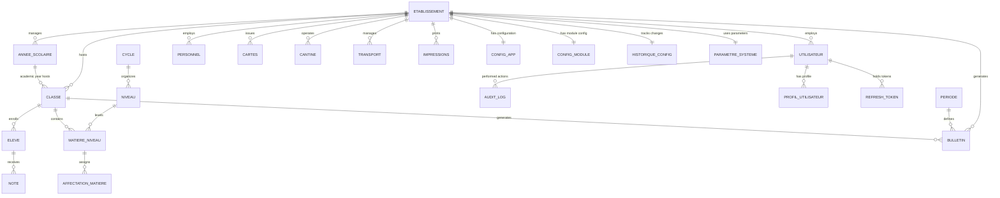
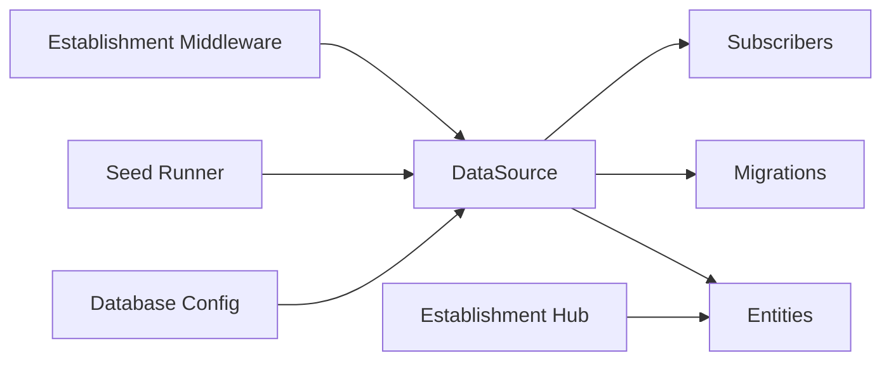

# Database Schema & Data Model

<cite>
**Referenced Files in This Document**
- [data-source.ts](file://backend/src/database/data-source.ts)
- [database.config.ts](file://backend/src/config/database.config.ts)
- [initial.seed.ts](file://backend/src/database/seeds/initial.seed.ts)
- [run-seeds.ts](file://backend/src/database/seeds/run-seeds.ts)
- [annee-scolaire.entity.ts](file://backend/src/modules/annees-scolaires/entities/annee-scolaire.entity.ts)
- [classe.entity.ts](file://backend/src/modules/classes/entities/classe.entity.ts)
- [affectation-eleve.entity.ts](file://backend/src/modules/classes/entities/affectation-eleve.entity.ts)
- [eleve.entity.ts](file://backend/src/modules/eleves/entities/eleve.entity.ts)
- [matiere.entity.ts](file://backend/src/modules/matieres/entities/matiere.entity.ts)
- [matiere-niveau.entity.ts](file://backend/src/modules/matieres/entities/matiere-niveau.entity.ts)
- [affectation-matiere.entity.ts](file://backend/src/modules/matieres/entities/affectation-matiere.entity.ts)
- [note.entity.ts](file://backend/src/modules/notes/entities/note.entity.ts)
- [bulletin.entity.ts](file://backend/src/modules/bulletins/entities/bulletin.entity.ts)
- [periode.entity.ts](file://backend/src/modules/periodes/entities/periode.entity.ts)
- [utilisateur.entity.ts](file://backend/src/modules/auth/entities/utilisateur.entity.ts)
- [audit-log.entity.ts](file://backend/src/modules/auth/entities/audit-log.entity.ts)
- [profil-utilisateur.entity.ts](file://backend/src/modules/auth/entities/profil-utilisateur.entity.ts)
- [refresh-token.entity.ts](file://backend/src/modules/auth/entities/refresh-token.entity.ts)
- [niveau.entity.ts](file://backend/src/modules/niveaux/entities/niveau.entity.ts)
- [cycle.entity.ts](file://backend/src/modules/cycles/entities/cycle.entity.ts)
- [etablissement.entity.ts](file://backend/src/modules/etablissement/entities/etablissement.entity.ts)
- [etablissement.service.ts](file://backend/src/modules/etablissement/services/etablissement.service.ts)
- [carte.entity.ts](file://backend/src/modules/cartes/entities/carte.entity.ts)
- [cantine.entity.ts](file://backend/src/modules/cantine/entities/cantine.entity.ts)
- [transport.entity.ts](file://backend/src/modules/transport/entities/transport.entity.ts)
- [personnel.entity.ts](file://backend/src/modules/personnel/entities/personnel.entity.ts)
- [impressions.entity.ts](file://backend/src/modules/impressions/entities/impressions.entity.ts)
- [configuration-app.entity.ts](file://backend/src/modules/configuration/entities/configuration-app.entity.ts)
- [configuration-module.entity.ts](file://backend/src/modules/configuration/entities/configuration-module.entity.ts)
- [historique-configuration.entity.ts](file://backend/src/modules/configuration/entities/historique-configuration.entity.ts)
- [parametre-systeme.entity.ts](file://backend/src/modules/configuration/entities/parametre-systeme.entity.ts)
</cite>

## Update Summary
**Changes Made**
- Added comprehensive multi-establishment architecture documentation
- Updated establishment entity as central hub with OneToOne configuration relationships
- Documented establishment relationships in user entities and other domain entities
- Enhanced entity relationship diagrams to reflect new establishment-centric design
- Added establishment-specific fields and business rules
- Updated configuration management to support establishment isolation

## Table of Contents
1. [Introduction](#introduction)
2. [Project Structure](#project-structure)
3. [Core Components](#core-components)
4. [Architecture Overview](#architecture-overview)
5. [Detailed Component Analysis](#detailed-component-analysis)
6. [Establishment-Centric Multi-Tenant Design](#establishment-centric-multi-tenant-design)
7. [Dependency Analysis](#dependency-analysis)
8. [Performance Considerations](#performance-considerations)
9. [Troubleshooting Guide](#troubleshooting-guide)
10. [Conclusion](#conclusion)
11. [Appendices](#appendices)

## Introduction
This document describes the eLISAschool academic management system database schema and data model. The system has been redesigned to support multi-establishment architecture, where each educational establishment operates as an independent tenant with its own configuration, data isolation, and operational autonomy. The establishment entity serves as the central hub coordinating all establishment-specific relationships and configurations.

## Project Structure
The database layer is powered by TypeORM against PostgreSQL with enhanced multi-establishment support. Entities are grouped per domain module under backend/src/modules/*/entities, with establishment relationships integrated across all domain entities. The TypeORM DataSource is configured via environment-driven settings and initialized at application startup with establishment-aware middleware.

```mermaid
graph TB
subgraph "Application"
APP["App Module"]
END
subgraph "Database Layer"
DS["TypeORM DataSource"]
CFG["Database Config"]
ENT["Entities (modules)"]
SEED["Seeds"]
ETAB["Establishment Hub"]
END
APP --> DS
DS --> CFG
DS --> ENT
DS --> SEED
ENT --> ETAB
```

**Diagram sources**
- [data-source.ts:17](file://backend/src/database/data-source.ts#L17)
- [database.config.ts:15-51](file://backend/src/config/database.config.ts#L15-L51)
- [etablissement.entity.ts:58](file://backend/src/modules/etablissement/entities/etablissement.entity.ts#L58)

**Section sources**
- [data-source.ts:17](file://backend/src/database/data-source.ts#L17)
- [database.config.ts:15-51](file://backend/src/config/database.config.ts#L15-L51)

## Core Components
- TypeORM DataSource: Centralized database connection with establishment-aware middleware
- Establishment Entity: Central hub managing multi-establishment architecture with OneToOne configuration relationships
- Entity Modules: Academic and administrative domains with establishment-specific foreign keys
- Seeds: Initial dataset provisioning with establishment context
- Configuration Management: Establishment-specific settings and parameters

Key configuration highlights:
- Database type: PostgreSQL with UUID primary keys
- Establishment relationships: All entities now include establishmentId foreign keys
- OneToOne relationships: Establishment to configuration mapping
- Synchronization enabled only in development
- Logging controlled by environment
- Connection pooling and SSL options tuned for multi-establishment deployment

**Section sources**
- [database.config.ts:15-51](file://backend/src/config/database.config.ts#L15-L51)
- [data-source.ts:17](file://backend/src/database/data-source.ts#L17)
- [etablissement.entity.ts:96-98](file://backend/src/modules/etablissement/entities/etablissement.entity.ts#L96-L98)

## Architecture Overview
The schema follows a normalized relational model with UUID primary keys and explicit foreign key relationships. The establishment entity serves as the central hub, with all domain entities maintaining establishment relationships for proper data isolation and tenant separation. Authentication and audit entities support user management with establishment context and compliance tracking.



**Diagram sources**
- [annee-scolaire.entity.ts:44-48](file://backend/src/modules/annees-scolaires/entities/annee-scolaire.entity.ts#L44-L48)
- [classe.entity.ts](file://backend/src/modules/classes/entities/classe.entity.ts)
- [affectation-eleve.entity.ts](file://backend/src/modules/classes/entities/affectation-eleve.entity.ts)
- [eleve.entity.ts](file://backend/src/modules/eleves/entities/eleve.entity.ts)
- [matiere-niveau.entity.ts](file://backend/src/modules/matieres/entities/matiere-niveau.entity.ts)
- [affectation-matiere.entity.ts](file://backend/src/modules/matieres/entities/affectation-matiere.entity.ts)
- [note.entity.ts](file://backend/src/modules/notes/entities/note.entity.ts)
- [bulletin.entity.ts:92-96](file://backend/src/modules/bulletins/entities/bulletin.entity.ts#L92-L96)
- [periode.entity.ts](file://backend/src/modules/periodes/entities/periode.entity.ts)
- [utilisateur.entity.ts:99-107](file://backend/src/modules/auth/entities/utilisateur.entity.ts#L99-L107)
- [audit-log.entity.ts](file://backend/src/modules/auth/entities/audit-log.entity.ts)
- [profil-utilisateur.entity.ts](file://backend/src/modules/auth/entities/profil-utilisateur.entity.ts)
- [refresh-token.entity.ts](file://backend/src/modules/auth/entities/refresh-token.entity.ts)
- [niveau.entity.ts](file://backend/src/modules/niveaux/entities/niveau.entity.ts)
- [cycle.entity.ts](file://backend/src/modules/cycles/entities/cycle.entity.ts)
- [etablissement.entity.ts:58](file://backend/src/modules/etablissement/entities/etablissement.entity.ts#L58)
- [personnel.entity.ts](file://backend/src/modules/personnel/entities/personnel.entity.ts)
- [carte.entity.ts:67-72](file://backend/src/modules/cartes/entities/carte.entity.ts#L67-L72)
- [cantine.entity.ts:56-60](file://backend/src/modules/cantine/entities/cantine.entity.ts#L56-L60)
- [transport.entity.ts](file://backend/src/modules/transport/entities/transport.entity.ts)
- [impressions.entity.ts](file://backend/src/modules/impressions/entities/impressions.entity.ts)
- [configuration-app.entity.ts](file://backend/src/modules/configuration/entities/configuration-app.entity.ts)
- [configuration-module.entity.ts](file://backend/src/modules/configuration/entities/configuration-module.entity.ts)
- [historique-configuration.entity.ts](file://backend/src/modules/configuration/entities/historique-configuration.entity.ts)
- [parametre-systeme.entity.ts](file://backend/src/modules/configuration/entities/parametre-systeme.entity.ts)

## Detailed Component Analysis

### Academic Year (Years)
- Purpose: Define school years with establishment context and start/end dates
- Key fields: Unique identifier, year label, start date, end date, active flags, establishment foreign key
- Constraints: Unique year label per establishment enforced at the database level
- Business rules: Active year determines current academic period; establishment isolation prevents cross-establishment overlap; overlapping years are prevented by unique constraint including establishmentId

**Section sources**
- [annee-scolaire.entity.ts:14](file://backend/src/modules/annees-scolaires/entities/annee-scolaire.entity.ts#L14)
- [annee-scolaire.entity.ts:19-20](file://backend/src/modules/annees-scolaires/entities/annee-scolaire.entity.ts#L19-L20)
- [annee-scolaire.entity.ts:44-48](file://backend/src/modules/annees-scolaires/entities/annee-scolaire.entity.ts#L44-L48)

### Classes (Classe)
- Purpose: Represent class groups within an academic year and establishment
- Relationships: Belongs to an academic year and establishment; enrolls students; contains subject offerings per grade
- Indexing: UUID primary key; foreign keys to year and establishment; composite indexes for establishment-based queries
- Business rules: Establishment isolation ensures class data separation; class capacity and schedule coordination handled outside schema; referential integrity enforced by FKs

**Section sources**
- [classe.entity.ts](file://backend/src/modules/classes/entities/classe.entity.ts)

### Students (Eleve)
- Purpose: Store student profiles linked to personal and contact details with establishment context
- Relationships: Enrolled in a class via assignment entity; receives grades; generates reports; establishment relationship for data isolation
- Indexing: UUID primary key; links to class via assignment; establishment foreign key for tenant separation
- Business rules: Establishment-aware enrollment lifecycle managed by assignment records; deletion requires cascade handling in assignments; cross-establishment data access prevented

**Section sources**
- [eleve.entity.ts](file://backend/src/modules/eleves/entities/eleve.entity.ts)

### Student-Class Assignment (Affectation Eleve)
- Purpose: Bridge table linking students to classes across time with establishment context
- Keys: Composite or dedicated PK; foreign keys to eleve and classe; establishment foreign key
- Constraints: Ensures one student belongs to one class during a given period; prevents orphan enrollments; establishment isolation
- Business rules: Effective date ranges and concurrent enrollment policies enforced by application/business logic; establishment-aware validation

**Section sources**
- [affectation-eleve.entity.ts](file://backend/src/modules/classes/entities/affectation-eleve.entity.ts)

### Subjects and Levels (Matiere, Niveau, MatiereNiveau)
- Matiere: Subject catalog with attributes and establishment context
- Niveau: Grade levels (e.g., primary, secondary) with establishment relationships
- MatiereNiveau: Cross-reference for which subjects are taught per level with establishment isolation
- Relationships: Matiere to MatiereNiveau; Niveau to MatiereNiveau; MatiereNiveau to Classe via teaching assignments; establishment foreign keys
- Indexing: Foreign keys; composite indexes may be beneficial for frequent queries by level and subject within establishments
- Business rules: Establishment-specific subject catalogs; cross-establishment subject sharing prevented; level hierarchies isolated

**Section sources**
- [matiere.entity.ts](file://backend/src/modules/matieres/entities/matiere.entity.ts)
- [niveau.entity.ts](file://backend/src/modules/niveaux/entities/niveau.entity.ts)
- [matiere-niveau.entity.ts](file://backend/src/modules/matieres/entities/matiere-niveau.entity.ts)

### Subject Assignments (AffectationMatiere)
- Purpose: Assign teachers or subject coordinators to specific subject/level/class combinations with establishment context
- Keys: Foreign keys to MatiereNiveau and Classe; optional teacher link; establishment foreign key
- Business rules: One subject/level/class combination per assignment; establishment isolation prevents cross-establishment assignments; scheduling conflicts resolved by application logic

**Section sources**
- [affectation-matiere.entity.ts](file://backend/src/modules/matieres/entities/affectation-matiere.entity.ts)

### Grades (Note)
- Purpose: Store individual assessment scores for students in specific subjects and periods with establishment context
- Keys: Foreign keys to Eleve, MatiereNiveau, and Periode; ensures granularity of grading; establishment foreign key
- Constraints: Score bounds validated by application; uniqueness constraints prevent duplicate entries for identical student-subject-period combinations; establishment isolation
- Business rules: Weighted averages and grade boundaries managed by service logic; establishment-specific grade reporting; aggregation into reports handled separately

**Section sources**
- [note.entity.ts](file://backend/src/modules/notes/entities/note.entity.ts)

### Periods (Periode)
- Purpose: Define grading periods (e.g., trimesters) within an academic year with establishment context
- Keys: Foreign key to AnneeScolaire; used to scope grade reporting; establishment foreign key
- Business rules: Periods must fall within the academic year; establishment isolation ensures period uniqueness; open/close windows for submissions enforced by application

**Section sources**
- [periode.entity.ts](file://backend/src/modules/periodes/entities/periode.entity.ts)

### Reports (Bulletin)
- Purpose: Aggregate student grades per period and class for official reporting with establishment context
- Keys: Foreign keys to Classe and Periode; links to student records via grades; establishment foreign key
- Business rules: Report generation depends on completeness of grades; establishment-specific report generation; finalization flags managed by application; establishment isolation

**Section sources**
- [bulletin.entity.ts:92-96](file://backend/src/modules/bulletins/entities/bulletin.entity.ts#L92-L96)

### Users and Authentication (Utilisateur, ProfilUtilisateur, RefreshToken, AuditLog)
- Utilisateur: Core user account with establishment context and profile linkage
- ProfilUtilisateur: Additional profile attributes (e.g., role, permissions) with establishment relationships
- RefreshToken: Token persistence for session refresh with establishment awareness
- AuditLog: Comprehensive audit trail of user actions with establishment context and severity metadata
- Relationships: One-to-one or one-to-many depending on entity; FKs enforce referential integrity; establishment foreign keys
- Security: Tokens and logs are sensitive; establishment isolation ensures proper access control; establishment-aware retention policies

**Section sources**
- [utilisateur.entity.ts:99-107](file://backend/src/modules/auth/entities/utilisateur.entity.ts#L99-L107)
- [profil-utilisateur.entity.ts](file://backend/src/modules/auth/entities/profil-utilisateur.entity.ts)
- [refresh-token.entity.ts](file://backend/src/modules/auth/entities/refresh-token.entity.ts)
- [audit-log.entity.ts](file://backend/src/modules/auth/entities/audit-log.entity.ts)

### Establishment and Personnel (Etablissement, Personnel)
- Etablissement: School or institution entity as central hub; hosts classes and employs staff; manages establishment configuration
- Personnel: Staff members mapped to users with establishment relationships; supports HR and administrative workflows within establishment context
- Relationships: Personnel linked to Utilisateur; both linked to Etablissement; establishment foreign keys ensure proper tenant separation
- Configuration: OneToOne relationship with establishment configuration for establishment-specific settings

**Section sources**
- [etablissement.entity.ts:58](file://backend/src/modules/etablissement/entities/etablissement.entity.ts#L58)
- [etablissement.entity.ts:96-98](file://backend/src/modules/etablissement/entities/etablissement.entity.ts#L96-L98)
- [personnel.entity.ts](file://backend/src/modules/personnel/entities/personnel.entity.ts)

### Cards, Canteen, Transport, Impressions
- Carte: Identity or access card records with establishment foreign key for establishment-specific card management
- Cantine: Meal-related data (catalog, orders, balances) with establishment context for establishment-specific canteen operations
- Transport: Transportation records and routes with establishment relationships for establishment-specific transport management
- Impressions: Printing or document generation logs with establishment foreign keys for establishment-specific printing operations
- Relationships: Typically link to students or users; establishment foreign keys ensure proper tenant separation; support operational workflows within establishment context

**Section sources**
- [carte.entity.ts:67-72](file://backend/src/modules/cartes/entities/carte.entity.ts#L67-L72)
- [cantine.entity.ts:56-60](file://backend/src/modules/cantine/entities/cantine.entity.ts#L56-L60)
- [transport.entity.ts](file://backend/src/modules/transport/entities/transport.entity.ts)
- [impressions.entity.ts](file://backend/src/modules/impressions/entities/impressions.entity.ts)

### Configuration (ConfigurationApp, ConfigurationModule, HistoriqueConfiguration, ParametreSysteme)
- ConfigurationApp: Application-wide configuration set with establishment relationships for establishment-specific settings
- ConfigurationModule: Module-scoped settings with establishment foreign keys for establishment isolation
- HistoriqueConfiguration: Change history for auditing configuration drift with establishment context
- ParametreSysteme: System parameters driving behavior with establishment relationships for establishment-specific parameterization
- Relationships: Hierarchical ownership with establishment foreign keys; history tracks changes over time within establishment context

**Section sources**
- [configuration-app.entity.ts](file://backend/src/modules/configuration/entities/configuration-app.entity.ts)
- [configuration-module.entity.ts](file://backend/src/modules/configuration/entities/configuration-module.entity.ts)
- [historique-configuration.entity.ts](file://backend/src/modules/configuration/entities/historique-configuration.entity.ts)
- [parametre-systeme.entity.ts](file://backend/src/modules/configuration/entities/parametre-systeme.entity.ts)

### Initial Seed Data
- Purpose: Populate baseline data for a fresh installation with establishment context (e.g., master lists, default configurations)
- Structure: Defined in seed files; executed via seed runner with establishment relationships
- Lifecycle: Run once at bootstrap or migration; establishment-aware idempotency depends on seed implementation
- Establishment Context: Seed data includes establishment foreign keys for proper tenant separation

**Section sources**
- [initial.seed.ts](file://backend/src/database/seeds/initial.seed.ts)
- [run-seeds.ts](file://backend/src/database/seeds/run-seeds.ts)

## Establishment-Centric Multi-Tenant Design

### Establishment Entity as Central Hub
The establishment entity serves as the cornerstone of the multi-establishment architecture, managing all establishment-specific relationships and configurations. Each establishment operates as an independent tenant with complete data isolation and operational autonomy.

**Key Features:**
- **Central Hub Design**: All establishment relationships flow through the establishment entity
- **OneToOne Configuration**: Each establishment has exactly one configuration entity for establishment-specific settings
- **Establishment Foreign Keys**: All domain entities include establishmentId foreign keys for proper tenant separation
- **Business Rule Enforcement**: Establishment isolation prevents cross-establishment data access and operations

### Establishment Configuration Management
Establishment-specific configurations are managed through a dedicated configuration entity with OneToOne relationship to the establishment entity.

**Configuration Features:**
- **Active Cycles**: Establishment-specific academic cycle management
- **Bulletin Settings**: Establishment-specific report generation parameters
- **System Parameters**: Establishment-aware system behavior configuration
- **Change Tracking**: Historical configuration tracking for compliance and audit purposes

### Establishment Relationships Across Entities
All domain entities maintain establishment relationships to ensure proper data isolation and tenant separation.

**Establishment-Aware Entities:**
- Academic entities (classes, students, subjects, grades)
- Administrative entities (personnel, configuration)
- Operational entities (cards, canteen, transport, impressions)
- User management entities (authentication, authorization)

**Relationship Patterns:**
- **Foreign Key Integration**: All entities include establishmentId foreign keys
- **Index Optimization**: Composite indexes for establishment-based queries
- **Cascade Operations**: Establishment-aware cascade behaviors for data integrity
- **Query Isolation**: Establishment-specific query patterns for tenant separation

### Multi-Tenant Business Rules
The establishment-centric design enforces strict business rules for proper tenant separation and data integrity.

**Tenant Separation Rules:**
- **Data Isolation**: No cross-establishment data access permitted
- **Unique Constraints**: Establishment-aware unique constraints prevent conflicts
- **Audit Trail**: Establishment-specific audit logging for compliance
- **Resource Allocation**: Establishment-specific resource management and limits

**Operational Constraints:**
- **Cross-Tenant Prevention**: Business logic prevents establishment-to-establishment operations
- **Configuration Isolation**: Establishment-specific settings cannot be accessed by other establishments
- **User Assignment**: Users are permanently bound to single establishment
- **Cascade Deletion**: Establishment deletion cascades appropriately to maintain data integrity

**Section sources**
- [etablissement.entity.ts:58](file://backend/src/modules/etablissement/entities/etablissement.entity.ts#L58)
- [etablissement.entity.ts:96-98](file://backend/src/modules/etablissement/entities/etablissement.entity.ts#L96-L98)
- [etablissement.service.ts:35-44](file://backend/src/modules/etablissement/services/etablissement.service.ts#L35-L44)
- [utilisateur.entity.ts:99-107](file://backend/src/modules/auth/entities/utilisateur.entity.ts#L99-L107)
- [bulletin.entity.ts:92-96](file://backend/src/modules/bulletins/entities/bulletin.entity.ts#L92-L96)
- [carte.entity.ts:67-72](file://backend/src/modules/cartes/entities/carte.entity.ts#L67-L72)
- [cantine.entity.ts:56-60](file://backend/src/modules/cantine/entities/cantine.entity.ts#L56-L60)

## Dependency Analysis
- Coupling: Entities are grouped by domain modules with establishment relationships; cross-module references are explicit via foreign keys
- Cohesion: Each module encapsulates related entities and services with establishment context
- External dependencies: PostgreSQL via TypeORM with establishment-aware middleware; environment-driven configuration
- Initialization: DataSource loads entities dynamically from module folders with establishment relationships; migrations and subscribers support multi-establishment deployment
- Establishment Middleware: Tenant-aware middleware ensures proper establishment context for all operations



**Diagram sources**
- [database.config.ts:30-36](file://backend/src/config/database.config.ts#L30-L36)
- [data-source.ts:17](file://backend/src/database/data-source.ts#L17)
- [etablissement.entity.ts:58](file://backend/src/modules/etablissement/entities/etablissement.entity.ts#L58)

**Section sources**
- [database.config.ts:30-36](file://backend/src/config/database.config.ts#L30-L36)
- [data-source.ts:17](file://backend/src/database/data-source.ts#L17)

## Performance Considerations
Derived from configuration and schema design with establishment awareness:
- Connection pooling: Larger pool in production to handle multiple establishment connections concurrently
- Logging: Minimal logging in production; enable only for diagnostics with establishment context
- Synchronization: Disabled in production to avoid schema drift; rely on migrations with establishment awareness
- SSL: Enabled in production for secure connections across establishment boundaries
- Indexing strategy recommendations:
  - Add indexes on frequently filtered/sorted columns (e.g., foreign keys, academic year ranges, user identifiers, establishmentId)
  - Consider composite indexes for multi-column filters (e.g., Eleve+MatiereNiveau+Periode+establishmentId)
  - Partitioning may be considered for large historical tables (grades, audit logs) based on establishmentId and time ranges
  - Establishment-specific indexes for high-volume establishment queries
- Query optimization patterns:
  - Use joins with establishment filters to minimize result sets and ensure tenant isolation
  - Denormalized aggregates (e.g., report summaries) can reduce runtime computation at the cost of write overhead
  - Batch writes for bulk operations (e.g., importing grades) with establishment context
  - Establishment-aware caching strategies for frequently accessed establishment data
- Multi-establishment optimization:
  - Establishment-specific query routing for optimal performance
  - Establishment-aware connection pooling for resource allocation
  - Tenant isolation enforcement at query execution level

## Troubleshooting Guide
- Connection failures:
  - Verify environment variables for host, port, user, password, and database name
  - Confirm SSL settings match target environment
  - Check establishment middleware configuration for proper tenant context
- Migration errors:
  - Ensure migrations directory exists and TypeORM can discover migration files
  - Check synchronization flag; in production, disable automatic sync and use migrations
  - Verify establishment relationships in migration scripts
- Seed execution:
  - Confirm seed runner is invoked and initial seed file is present
  - Validate seed logic idempotency to avoid duplicate inserts
  - Check establishment foreign keys in seed data
- Establishment-specific issues:
  - Verify establishmentId is properly set in establishment-aware entities
  - Check establishment configuration relationships for proper setup
  - Ensure establishment middleware is functioning correctly for tenant isolation
- Audit and logs:
  - Review audit log entries for failed operations and error messages
  - Monitor database logs for slow queries and deadlocks
  - Check establishment-specific audit trails for compliance tracking

**Section sources**
- [database.config.ts:15-51](file://backend/src/config/database.config.ts#L15-L51)
- [run-seeds.ts](file://backend/src/database/seeds/run-seeds.ts)
- [etablissement.service.ts:119-153](file://backend/src/modules/etablissement/services/etablissement.service.ts#L119-L153)

## Conclusion
The eLISAschool schema has been successfully redesigned to support multi-establishment architecture with establishment entity as the central hub. This redesign provides proper tenant isolation, establishment-specific configurations, and comprehensive establishment relationships across all domain entities. TypeORM's environment-driven configuration with establishment-aware middleware enables safe multi-establishment deployments. Proper indexing, migration discipline, seed management, and establishment middleware are essential for maintaining performance, integrity, and operability across multiple establishments.

## Appendices

### Entity Relationship Diagram (ERD) with Establishment Context


**Diagram sources**
- [annee-scolaire.entity.ts:44-48](file://backend/src/modules/annees-scolaires/entities/annee-scolaire.entity.ts#L44-L48)
- [classe.entity.ts](file://backend/src/modules/classes/entities/classe.entity.ts)
- [affectation-eleve.entity.ts](file://backend/src/modules/classes/entities/affectation-eleve.entity.ts)
- [eleve.entity.ts](file://backend/src/modules/eleves/entities/eleve.entity.ts)
- [matiere-niveau.entity.ts](file://backend/src/modules/matieres/entities/matiere-niveau.entity.ts)
- [affectation-matiere.entity.ts](file://backend/src/modules/matieres/entities/affectation-matiere.entity.ts)
- [note.entity.ts](file://backend/src/modules/notes/entities/note.entity.ts)
- [bulletin.entity.ts:92-96](file://backend/src/modules/bulletins/entities/bulletin.entity.ts#L92-L96)
- [periode.entity.ts](file://backend/src/modules/periodes/entities/periode.entity.ts)
- [utilisateur.entity.ts:99-107](file://backend/src/modules/auth/entities/utilisateur.entity.ts#L99-L107)
- [audit-log.entity.ts](file://backend/src/modules/auth/entities/audit-log.entity.ts)
- [profil-utilisateur.entity.ts](file://backend/src/modules/auth/entities/profil-utilisateur.entity.ts)
- [refresh-token.entity.ts](file://backend/src/modules/auth/entities/refresh-token.entity.ts)
- [niveau.entity.ts](file://backend/src/modules/niveaux/entities/niveau.entity.ts)
- [cycle.entity.ts](file://backend/src/modules/cycles/entities/cycle.entity.ts)
- [etablissement.entity.ts:58](file://backend/src/modules/etablissement/entities/etablissement.entity.ts#L58)
- [personnel.entity.ts](file://backend/src/modules/personnel/entities/personnel.entity.ts)
- [carte.entity.ts:67-72](file://backend/src/modules/cartes/entities/carte.entity.ts#L67-L72)
- [cantine.entity.ts:56-60](file://backend/src/modules/cantine/entities/cantine.entity.ts#L56-L60)
- [transport.entity.ts](file://backend/src/modules/transport/entities/transport.entity.ts)
- [impressions.entity.ts](file://backend/src/modules/impressions/entities/impressions.entity.ts)
- [configuration-app.entity.ts](file://backend/src/modules/configuration/entities/configuration-app.entity.ts)
- [configuration-module.entity.ts](file://backend/src/modules/configuration/entities/configuration-module.entity.ts)
- [historique-configuration.entity.ts](file://backend/src/modules/configuration/entities/historique-configuration.entity.ts)
- [parametre-systeme.entity.ts](file://backend/src/modules/configuration/entities/parametre-systeme.entity.ts)

### Data Lifecycle and Retention Policies with Establishment Context
- Academic data (grades, reports) typically retained per institutional policy per establishment; consider establishment-specific archiving for older periods
- Audit logs: Retain for compliance per establishment; define purge schedules aligned with legal requirements for each establishment
- User tokens: Short-lived access tokens and refresh token rotation reduce long-term exposure per establishment
- Establishment configuration: Historical configuration tracking maintained per establishment for compliance and audit purposes
- Seeds: Applied per establishment; maintain establishment-aware deterministic scripts for reproducibility
- Establishment isolation: Data retention policies enforced per establishment with proper tenant separation