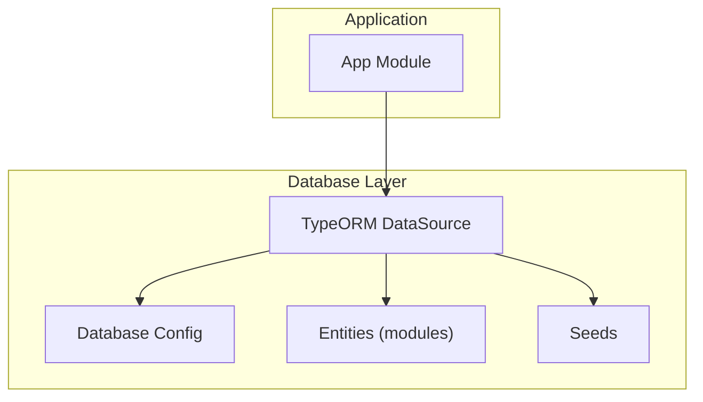
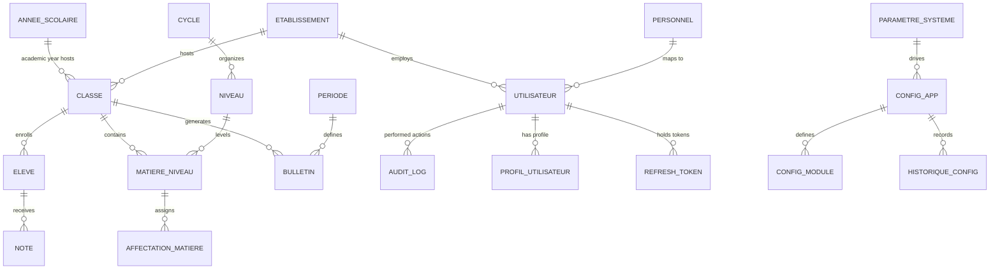
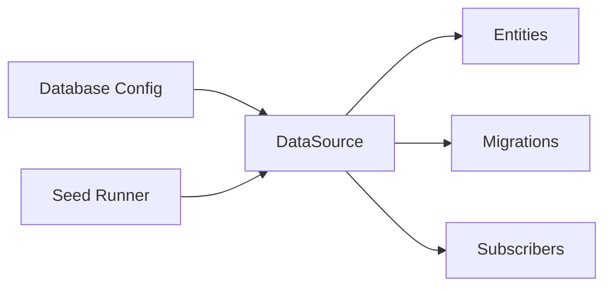
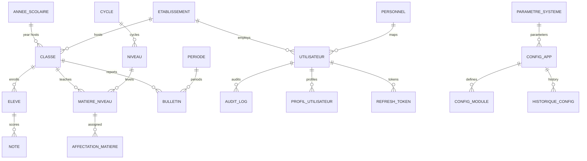

# Database Schema & Data Model

<cite>
**Referenced Files in This Document**
- [data-source.ts](file://backend/src/database/data-source.ts)
- [database.config.ts](file://backend/src/config/database.config.ts)
- [initial.seed.ts](file://backend/src/database/seeds/initial.seed.ts)
- [run-seeds.ts](file://backend/src/database/seeds/run-seeds.ts)
- [annee-scolaire.entity.ts](file://backend/src/modules/annees-scolaires/entities/annee-scolaire.entity.ts)
- [classe.entity.ts](file://backend/src/modules/classes/entities/classe.entity.ts)
- [affectation-eleve.entity.ts](file://backend/src/modules/classes/entities/affectation-eleve.entity.ts)
- [eleve.entity.ts](file://backend/src/modules/eleves/entities/eleve.entity.ts)
- [matiere.entity.ts](file://backend/src/modules/matieres/entities/matiere.entity.ts)
- [matiere-niveau.entity.ts](file://backend/src/modules/matieres/entities/matiere-niveau.entity.ts)
- [affectation-matiere.entity.ts](file://backend/src/modules/matieres/entities/affectation-matiere.entity.ts)
- [note.entity.ts](file://backend/src/modules/notes/entities/note.entity.ts)
- [bulletin.entity.ts](file://backend/src/modules/bulletins/entities/bulletin.entity.ts)
- [periode.entity.ts](file://backend/src/modules/periodes/entities/periode.entity.ts)
- [utilisateur.entity.ts](file://backend/src/modules/auth/entities/utilisateur.entity.ts)
- [audit-log.entity.ts](file://backend/src/modules/auth/entities/audit-log.entity.ts)
- [profil-utilisateur.entity.ts](file://backend/src/modules/auth/entities/profil-utilisateur.entity.ts)
- [refresh-token.entity.ts](file://backend/src/modules/auth/entities/refresh-token.entity.ts)
- [niveau.entity.ts](file://backend/src/modules/niveaux/entities/niveau.entity.ts)
- [cycle.entity.ts](file://backend/src/modules/cycles/entities/cycle.entity.ts)
- [etablissement.entity.ts](file://backend/src/modules/etablissement/entities/etablissement.entity.ts)
- [carte.entity.ts](file://backend/src/modules/cartes/entities/carte.entity.ts)
- [cantine.entity.ts](file://backend/src/modules/cantine/entities/cantine.entity.ts)
- [transport.entity.ts](file://backend/src/modules/transport/entities/transport.entity.ts)
- [personnel.entity.ts](file://backend/src/modules/personnel/entities/personnel.entity.ts)
- [impressions.entity.ts](file://backend/src/modules/impressions/entities/impressions.entity.ts)
- [configuration-app.entity.ts](file://backend/src/modules/configuration/entities/configuration-app.entity.ts)
- [configuration-module.entity.ts](file://backend/src/modules/configuration/entities/configuration-module.entity.ts)
- [historique-configuration.entity.ts](file://backend/src/modules/configuration/entities/historique-configuration.entity.ts)
- [parametre-systeme.entity.ts](file://backend/src/modules/configuration/entities/parametre-systeme.entity.ts)
</cite>

## Table of Contents
1. [Introduction](#introduction)
2. [Project Structure](#project-structure)
3. [Core Components](#core-components)
4. [Architecture Overview](#architecture-overview)
5. [Detailed Component Analysis](#detailed-component-analysis)
6. [Dependency Analysis](#dependency-analysis)
7. [Performance Considerations](#performance-considerations)
8. [Troubleshooting Guide](#troubleshooting-guide)
9. [Conclusion](#conclusion)
10. [Appendices](#appendices)

## Introduction
This document describes the eLISAschool academic management system database schema and data model. It covers entity definitions, relationships, primary and foreign keys, indexes, constraints, and business rules. It also documents initial seed data structure, data lifecycle, retention considerations, and performance strategies derived from the repository’s configuration and entity metadata.

## Project Structure
The database layer is powered by TypeORM against PostgreSQL. Entities are grouped per domain module under backend/src/modules/*/entities. The TypeORM DataSource is configured via environment-driven settings and initialized at application startup.

**Diagram sources**
- [data-source.ts:17](file://backend/src/database/data-source.ts#L17)
- [database.config.ts:15-51](file://backend/src/config/database.config.ts#L15-L51)

**Section sources**
- [data-source.ts:17](file://backend/src/database/data-source.ts#L17)
- [database.config.ts:15-51](file://backend/src/config/database.config.ts#L15-L51)

## Core Components
- TypeORM DataSource: Centralized database connection and initialization.
- Entity Modules: Academic and administrative domains (years, classes, students, subjects, grades, users, configurations, etc.).
- Seeds: Initial dataset provisioning.

Key configuration highlights:
- Database type: PostgreSQL.
- Entities discovered automatically via glob pattern.
- Synchronization enabled only in development.
- Logging controlled by environment.
- Connection pooling and SSL options tuned for dev vs prod.

**Section sources**
- [database.config.ts:15-51](file://backend/src/config/database.config.ts#L15-L51)
- [data-source.ts:17](file://backend/src/database/data-source.ts#L17)

## Architecture Overview
The schema follows a normalized relational model with UUID primary keys and explicit foreign key relationships. Domain entities are organized by functional modules. Authentication and audit entities support user management and compliance. Configuration entities manage system-wide settings and history.

**Diagram sources**
- [annee-scolaire.entity.ts:14](file://backend/src/modules/annees-scolaires/entities/annee-scolaire.entity.ts#L14)
- [classe.entity.ts](file://backend/src/modules/classes/entities/classe.entity.ts)
- [affectation-eleve.entity.ts](file://backend/src/modules/classes/entities/affectation-eleve.entity.ts)
- [eleve.entity.ts](file://backend/src/modules/eleves/entities/eleve.entity.ts)
- [matiere-niveau.entity.ts](file://backend/src/modules/matieres/entities/matiere-niveau.entity.ts)
- [affectation-matiere.entity.ts](file://backend/src/modules/matieres/entities/affectation-matiere.entity.ts)
- [note.entity.ts](file://backend/src/modules/notes/entities/note.entity.ts)
- [bulletin.entity.ts](file://backend/src/modules/bulletins/entities/bulletin.entity.ts)
- [periode.entity.ts](file://backend/src/modules/periodes/entities/periode.entity.ts)
- [utilisateur.entity.ts](file://backend/src/modules/auth/entities/utilisateur.entity.ts)
- [audit-log.entity.ts](file://backend/src/modules/auth/entities/audit-log.entity.ts)
- [profil-utilisateur.entity.ts](file://backend/src/modules/auth/entities/profil-utilisateur.entity.ts)
- [refresh-token.entity.ts](file://backend/src/modules/auth/entities/refresh-token.entity.ts)
- [niveau.entity.ts](file://backend/src/modules/niveaux/entities/niveau.entity.ts)
- [cycle.entity.ts](file://backend/src/modules/cycles/entities/cycle.entity.ts)
- [etablissement.entity.ts](file://backend/src/modules/etablissement/entities/etablissement.entity.ts)
- [personnel.entity.ts](file://backend/src/modules/personnel/entities/personnel.entity.ts)
- [configuration-app.entity.ts](file://backend/src/modules/configuration/entities/configuration-app.entity.ts)
- [configuration-module.entity.ts](file://backend/src/modules/configuration/entities/configuration-module.entity.ts)
- [historique-configuration.entity.ts](file://backend/src/modules/configuration/entities/historique-configuration.entity.ts)
- [parametre-systeme.entity.ts](file://backend/src/modules/configuration/entities/parametre-systeme.entity.ts)

## Detailed Component Analysis

### Academic Year (Years)
- Purpose: Define school years with start/end dates and status flags.
- Key fields: Unique identifier, year label, start date, end date, active flags.
- Constraints: Unique year label enforced at the database level.
- Business rules: Active year determines current academic period; overlapping years are prevented by unique constraint.

**Section sources**
- [annee-scolaire.entity.ts:14](file://backend/src/modules/annees-scolaires/entities/annee-scolaire.entity.ts#L14)
- [annee-scolaire.entity.ts:16-31](file://backend/src/modules/annees-scolaires/entities/annee-scolaire.entity.ts#L16-L31)

### Classes (Classe)
- Purpose: Represent class groups within an academic year and establishment.
- Relationships: Belongs to an academic year and establishment; enrolls students; contains subject offerings per grade.
- Indexing: UUID primary key; foreign keys to year and establishment.
- Business rules: Class capacity and schedule coordination handled outside schema; referential integrity enforced by FKs.

**Section sources**
- [classe.entity.ts](file://backend/src/modules/classes/entities/classe.entity.ts)

### Students (Eleve)
- Purpose: Store student profiles linked to personal and contact details.
- Relationships: Enrolled in a class via assignment entity; receives grades; generates reports.
- Indexing: UUID primary key; links to class via assignment.
- Business rules: Enrollment lifecycle managed by assignment records; deletion requires cascade handling in assignments.

**Section sources**
- [eleve.entity.ts](file://backend/src/modules/eleves/entities/eleve.entity.ts)

### Student-Class Assignment (Affectation Eleve)
- Purpose: Bridge table linking students to classes across time.
- Keys: Composite or dedicated PK; foreign keys to eleve and classe.
- Constraints: Ensures one student belongs to one class during a given period; prevents orphan enrollments.
- Business rules: Effective date ranges and concurrent enrollment policies enforced by application/business logic.

**Section sources**
- [affectation-eleve.entity.ts](file://backend/src/modules/classes/entities/affectation-eleve.entity.ts)

### Subjects and Levels (Matiere, Niveau, MatiereNiveau)
- Matiere: Subject catalog with attributes.
- Niveau: Grade levels (e.g., primary, secondary).
- MatiereNiveau: Cross-reference for which subjects are taught per level.
- Relationships: Matiere to MatiereNiveau; Niveau to MatiereNiveau; MatiereNiveau to Classe via teaching assignments.
- Indexing: Foreign keys; composite indexes may be beneficial for frequent queries by level and subject.

**Section sources**
- [matiere.entity.ts](file://backend/src/modules/matieres/entities/matiere.entity.ts)
- [niveau.entity.ts](file://backend/src/modules/niveaux/entities/niveau.entity.ts)
- [matiere-niveau.entity.ts](file://backend/src/modules/matieres/entities/matiere-niveau.entity.ts)

### Subject Assignments (AffectationMatiere)
- Purpose: Assign teachers or subject coordinators to specific subject/level/class combinations.
- Keys: Foreign keys to MatiereNiveau and Classe; optional teacher link.
- Business rules: One subject/level/class combination per assignment; scheduling conflicts resolved by application logic.

**Section sources**
- [affectation-matiere.entity.ts](file://backend/src/modules/matieres/entities/affectation-matiere.entity.ts)

### Grades (Note)
- Purpose: Store individual assessment scores for students in specific subjects and periods.
- Keys: Foreign keys to Eleve, MatiereNiveau, and Periode; ensures granularity of grading.
- Constraints: Score bounds validated by application; uniqueness constraints prevent duplicate entries for identical student-subject-period combinations.
- Business rules: Weighted averages and grade boundaries managed by service logic; aggregation into reports handled separately.

**Section sources**
- [note.entity.ts](file://backend/src/modules/notes/entities/note.entity.ts)

### Periods (Periode)
- Purpose: Define grading periods (e.g., trimesters) within an academic year.
- Keys: Foreign key to AnneeScolaire; used to scope grade reporting.
- Business rules: Periods must fall within the academic year; open/close windows for submissions enforced by application.

**Section sources**
- [periode.entity.ts](file://backend/src/modules/periodes/entities/periode.entity.ts)

### Reports (Bulletin)
- Purpose: Aggregate student grades per period and class for official reporting.
- Keys: Foreign keys to Classe and Periode; links to student records via grades.
- Business rules: Report generation depends on completeness of grades; finalization flags managed by application.

**Section sources**
- [bulletin.entity.ts](file://backend/src/modules/bulletins/entities/bulletin.entity.ts)

### Users and Authentication (Utilisateur, ProfilUtilisateur, RefreshToken, AuditLog)
- Utilisateur: Core user account with credentials and profile linkage.
- ProfilUtilisateur: Additional profile attributes (e.g., role, permissions).
- RefreshToken: Token persistence for session refresh.
- AuditLog: Comprehensive audit trail of user actions with severity and metadata.
- Relationships: One-to-one or one-to-many depending on entity; FKs enforce referential integrity.
- Security: Tokens and logs are sensitive; ensure appropriate access controls and retention policies.

**Section sources**
- [utilisateur.entity.ts](file://backend/src/modules/auth/entities/utilisateur.entity.ts)
- [profil-utilisateur.entity.ts](file://backend/src/modules/auth/entities/profil-utilisateur.entity.ts)
- [refresh-token.entity.ts](file://backend/src/modules/auth/entities/refresh-token.entity.ts)
- [audit-log.entity.ts](file://backend/src/modules/auth/entities/audit-log.entity.ts)

### Establishment and Personnel (Etablissement, Personnel)
- Etablissement: School or institution entity; hosts classes and employs staff.
- Personnel: Staff members mapped to users; supports HR and administrative workflows.
- Relationships: Personnel linked to Utilisateur; both linked to Etablissement.

**Section sources**
- [etablissement.entity.ts](file://backend/src/modules/etablissement/entities/etablissement.entity.ts)
- [personnel.entity.ts](file://backend/src/modules/personnel/entities/personnel.entity.ts)

### Cards, Canteen, Transport, Impressions
- Carte: Identity or access card records.
- Cantine: Meal-related data (catalog, orders, balances).
- Transport: Transportation records and routes.
- Impressions: Printing or document generation logs.
- Relationships: Typically link to students or users; support operational workflows.

**Section sources**
- [carte.entity.ts](file://backend/src/modules/cartes/entities/carte.entity.ts)
- [cantine.entity.ts](file://backend/src/modules/cantine/entities/cantine.entity.ts)
- [transport.entity.ts](file://backend/src/modules/transport/entities/transport.entity.ts)
- [impressions.entity.ts](file://backend/src/modules/impressions/entities/impressions.entity.ts)

### Configuration (ConfigurationApp, ConfigurationModule, HistoriqueConfiguration, ParametreSysteme)
- ConfigurationApp: Application-wide configuration set.
- ConfigurationModule: Module-scoped settings.
- HistoriqueConfiguration: Change history for auditing configuration drift.
- ParametreSysteme: System parameters driving behavior.
- Relationships: Hierarchical ownership; history tracks changes over time.

**Section sources**
- [configuration-app.entity.ts](file://backend/src/modules/configuration/entities/configuration-app.entity.ts)
- [configuration-module.entity.ts](file://backend/src/modules/configuration/entities/configuration-module.entity.ts)
- [historique-configuration.entity.ts](file://backend/src/modules/configuration/entities/historique-configuration.entity.ts)
- [parametre-systeme.entity.ts](file://backend/src/modules/configuration/entities/parametre-systeme.entity.ts)

### Initial Seed Data
- Purpose: Populate baseline data for a fresh installation (e.g., master lists, default configurations).
- Structure: Defined in seed files; executed via seed runner.
- Lifecycle: Run once at bootstrap or migration; idempotency depends on seed implementation.

**Section sources**
- [initial.seed.ts](file://backend/src/database/seeds/initial.seed.ts)
- [run-seeds.ts](file://backend/src/database/seeds/run-seeds.ts)

## Dependency Analysis
- Coupling: Entities are grouped by domain modules; cross-module references are explicit via foreign keys.
- Cohesion: Each module encapsulates related entities and services.
- External dependencies: PostgreSQL via TypeORM; environment-driven configuration.
- Initialization: DataSource loads entities dynamically from module folders; migrations and subscribers supported.

**Diagram sources**
- [database.config.ts:30-36](file://backend/src/config/database.config.ts#L30-L36)
- [data-source.ts:17](file://backend/src/database/data-source.ts#L17)

**Section sources**
- [database.config.ts:30-36](file://backend/src/config/database.config.ts#L30-L36)
- [data-source.ts:17](file://backend/src/database/data-source.ts#L17)

## Performance Considerations
Derived from configuration and schema design:
- Connection pooling: Larger pool in production to handle concurrency.
- Logging: Minimal logging in production; enable only for diagnostics.
- Synchronization: Disabled in production to avoid schema drift; rely on migrations.
- SSL: Enabled in production for secure connections.
- Indexing strategy recommendations:
  - Add indexes on frequently filtered/sorted columns (e.g., foreign keys, academic year ranges, user identifiers).
  - Consider composite indexes for multi-column filters (e.g., Eleve+MatiereNiveau+Periode).
  - Partitioning may be considered for large historical tables (grades, audit logs) based on time ranges.
- Query optimization patterns:
  - Use joins with selective filters to minimize result sets.
  - Denormalized aggregates (e.g., report summaries) can reduce runtime computation at the cost of write overhead.
  - Batch writes for bulk operations (e.g., importing grades).

[No sources needed since this section provides general guidance]

## Troubleshooting Guide
- Connection failures:
  - Verify environment variables for host, port, user, password, and database name.
  - Confirm SSL settings match target environment.
- Migration errors:
  - Ensure migrations directory exists and TypeORM can discover migration files.
  - Check synchronization flag; in production, disable automatic sync and use migrations.
- Seed execution:
  - Confirm seed runner is invoked and initial seed file is present.
  - Validate seed logic idempotency to avoid duplicate inserts.
- Audit and logs:
  - Review audit log entries for failed operations and error messages.
  - Monitor database logs for slow queries and deadlocks.

**Section sources**
- [database.config.ts:15-51](file://backend/src/config/database.config.ts#L15-L51)
- [run-seeds.ts](file://backend/src/database/seeds/run-seeds.ts)

## Conclusion
The eLISAschool schema organizes academic and administrative data into cohesive modules with clear relationships and constraints. TypeORM’s environment-driven configuration enables safe development and production deployments. Proper indexing, migration discipline, and seed management are essential for maintaining performance, integrity, and operability.

[No sources needed since this section summarizes without analyzing specific files]

## Appendices

### Entity Relationship Diagram (ERD)

**Diagram sources**
- [annee-scolaire.entity.ts:14](file://backend/src/modules/annees-scolaires/entities/annee-scolaire.entity.ts#L14)
- [classe.entity.ts](file://backend/src/modules/classes/entities/classe.entity.ts)
- [affectation-eleve.entity.ts](file://backend/src/modules/classes/entities/affectation-eleve.entity.ts)
- [eleve.entity.ts](file://backend/src/modules/eleves/entities/eleve.entity.ts)
- [matiere-niveau.entity.ts](file://backend/src/modules/matieres/entities/matiere-niveau.entity.ts)
- [affectation-matiere.entity.ts](file://backend/src/modules/matieres/entities/affectation-matiere.entity.ts)
- [note.entity.ts](file://backend/src/modules/notes/entities/note.entity.ts)
- [bulletin.entity.ts](file://backend/src/modules/bulletins/entities/bulletin.entity.ts)
- [periode.entity.ts](file://backend/src/modules/periodes/entities/periode.entity.ts)
- [utilisateur.entity.ts](file://backend/src/modules/auth/entities/utilisateur.entity.ts)
- [audit-log.entity.ts](file://backend/src/modules/auth/entities/audit-log.entity.ts)
- [profil-utilisateur.entity.ts](file://backend/src/modules/auth/entities/profil-utilisateur.entity.ts)
- [refresh-token.entity.ts](file://backend/src/modules/auth/entities/refresh-token.entity.ts)
- [niveau.entity.ts](file://backend/src/modules/niveaux/entities/niveau.entity.ts)
- [cycle.entity.ts](file://backend/src/modules/cycles/entities/cycle.entity.ts)
- [etablissement.entity.ts](file://backend/src/modules/etablissement/entities/etablissement.entity.ts)
- [personnel.entity.ts](file://backend/src/modules/personnel/entities/personnel.entity.ts)
- [configuration-app.entity.ts](file://backend/src/modules/configuration/entities/configuration-app.entity.ts)
- [configuration-module.entity.ts](file://backend/src/modules/configuration/entities/configuration-module.entity.ts)
- [historique-configuration.entity.ts](file://backend/src/modules/configuration/entities/historique-configuration.entity.ts)
- [parametre-systeme.entity.ts](file://backend/src/modules/configuration/entities/parametre-systeme.entity.ts)

### Data Lifecycle and Retention Policies
- Academic data (grades, reports) typically retained per institutional policy; consider archiving older periods.
- Audit logs: Retain for compliance; define purge schedules aligned with legal requirements.
- User tokens: Short-lived access tokens and refresh token rotation reduce long-term exposure.
- Seeds: Applied once; maintain deterministic scripts for reproducibility.

[No sources needed since this section provides general guidance]