# Supporting Entities

<cite>
**Referenced Files in This Document**
- [carte.entity.ts](file://backend/src/modules/cartes/entities/carte.entity.ts)
- [cantine.entity.ts](file://backend/src/modules/cantine/entities/cantine.entity.ts)
- [transport.entity.ts](file://backend/src/modules/transport/entities/transport.entity.ts)
- [materiel.entity.ts](file://backend/src/modules/materiel/entities/materiel.entity.ts)
- [gamification.entity.ts](file://backend/src/modules/gamification/entities/gamification.entity.ts)
- [notification.entity.ts](file://backend/src/modules/notifications/entities/notification.entity.ts)
- [messagerie.entity.ts](file://backend/src/modules/messagerie/entities/messagerie.entity.ts)
- [orientation.entity.ts](file://backend/src/modules/orientation/entities/orientation.entity.ts)
- [requete.entity.ts](file://backend/src/modules/requetes/entities/requete.entity.ts)
</cite>

## Table of Contents
1. [Introduction](#introduction)
2. [Project Structure](#project-structure)
3. [Core Components](#core-components)
4. [Architecture Overview](#architecture-overview)
5. [Detailed Component Analysis](#detailed-component-analysis)
6. [Dependency Analysis](#dependency-analysis)
7. [Performance Considerations](#performance-considerations)
8. [Troubleshooting Guide](#troubleshooting-guide)
9. [Conclusion](#conclusion)

## Introduction
This document describes the supporting service entities that enable day-to-day operations in eLISAschool. It focuses on:
- Card (carte) for student identification and access control
- Canteen (cantine) for meal management and dietary tracking
- Transport (transport) for student transport services and route management
- Material (materiel) for inventory and supply management
- Gamification for reward systems and behavioral tracking
- Notifications for communication management and alert systems
- Messaging (messagerie) for internal and external communications
- Orientation for career guidance services and counseling records
- Request (requete) for service requests and workflow management

The goal is to explain each entity’s purpose, attributes, relationships, and operational constraints, enabling developers and administrators to integrate and maintain these services effectively.

## Project Structure
Each supporting entity resides under its own module with dedicated controller, DTO, entity, and service layers. The entities are defined in TypeScript and mapped to database tables via an ORM. Controllers expose REST endpoints; services encapsulate business logic; DTOs define request/response shapes; and modules are registered in the application index.

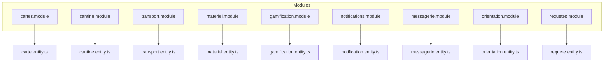

**Diagram sources**
- [carte.entity.ts](file://backend/src/modules/cartes/entities/carte.entity.ts)
- [cantine.entity.ts](file://backend/src/modules/cantine/entities/cantine.entity.ts)
- [transport.entity.ts](file://backend/src/modules/transport/entities/transport.entity.ts)
- [materiel.entity.ts](file://backend/src/modules/materiel/entities/materiel.entity.ts)
- [gamification.entity.ts](file://backend/src/modules/gamification/entities/gamification.entity.ts)
- [notification.entity.ts](file://backend/src/modules/notifications/entities/notification.entity.ts)
- [messagerie.entity.ts](file://backend/src/modules/messagerie/entities/messagerie.entity.ts)
- [orientation.entity.ts](file://backend/src/modules/orientation/entities/orientation.entity.ts)
- [requete.entity.ts](file://backend/src/modules/requetes/entities/requete.entity.ts)

**Section sources**
- [carte.entity.ts](file://backend/src/modules/cartes/entities/carte.entity.ts)
- [cantine.entity.ts](file://backend/src/modules/cantine/entities/cantine.entity.ts)
- [transport.entity.ts](file://backend/src/modules/transport/entities/transport.entity.ts)
- [materiel.entity.ts](file://backend/src/modules/materiel/entities/materiel.entity.ts)
- [gamification.entity.ts](file://backend/src/modules/gamification/entities/gamification.entity.ts)
- [notification.entity.ts](file://backend/src/modules/notifications/entities/notification.entity.ts)
- [messagerie.entity.ts](file://backend/src/modules/messagerie/entities/messagerie.entity.ts)
- [orientation.entity.ts](file://backend/src/modules/orientation/entities/orientation.entity.ts)
- [requete.entity.ts](file://backend/src/modules/requetes/entities/requete.entity.ts)

## Core Components
This section introduces each entity and its primary responsibilities.

- Card (carte): Identifies students and controls access to facilities and services.
- Canteen (cantine): Manages meals, consumption logs, and dietary preferences.
- Transport (transport): Tracks student transportation assignments and routes.
- Material (materiel): Handles inventory items, stock levels, and supply movements.
- Gamification: Records achievements, points, and behavioral metrics.
- Notifications: Stores alerts and communication events for users.
- Messaging (messagerie): Manages messages exchanged between users.
- Orientation: Documents career guidance sessions and outcomes.
- Request (requete): Captures service requests and their lifecycle.

**Section sources**
- [carte.entity.ts](file://backend/src/modules/cartes/entities/carte.entity.ts)
- [cantine.entity.ts](file://backend/src/modules/cantine/entities/cantine.entity.ts)
- [transport.entity.ts](file://backend/src/modules/transport/entities/transport.entity.ts)
- [materiel.entity.ts](file://backend/src/modules/materiel/entities/materiel.entity.ts)
- [gamification.entity.ts](file://backend/src/modules/gamification/entities/gamification.entity.ts)
- [notification.entity.ts](file://backend/src/modules/notifications/entities/notification.entity.ts)
- [messagerie.entity.ts](file://backend/src/modules/messagerie/entities/messagerie.entity.ts)
- [orientation.entity.ts](file://backend/src/modules/orientation/entities/orientation.entity.ts)
- [requete.entity.ts](file://backend/src/modules/requetes/entities/requete.entity.ts)

## Architecture Overview
The entities are part of a layered architecture:
- Entities define persistent models and relationships
- Services encapsulate domain logic and orchestrate operations
- Controllers expose endpoints for CRUD and specialized actions
- DTOs shape inputs and outputs for type safety

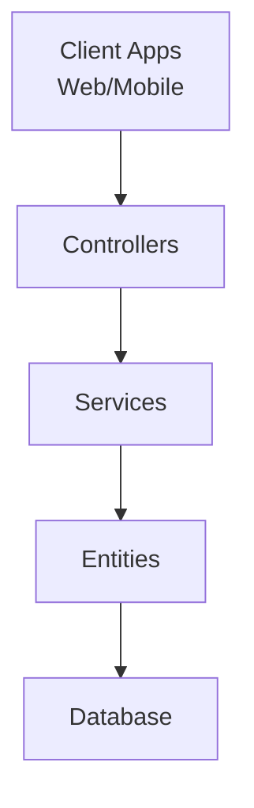

[No sources needed since this diagram shows conceptual workflow, not actual code structure]

## Detailed Component Analysis

### Card (carte)
Purpose
- Provides student identity and access control tokens for secure entry to school services.

Key attributes and constraints
- Unique identifier per student
- Access credentials or token metadata
- Optional biometric or QR data for physical access
- Status flags (active/inactive) and validity dates
- Link to related entities such as attendance logs or meal accounts

Operational constraints
- Must be linked to a valid student profile
- Access tokens may expire and require renewal
- Biometric or QR data must be synchronized with access control systems

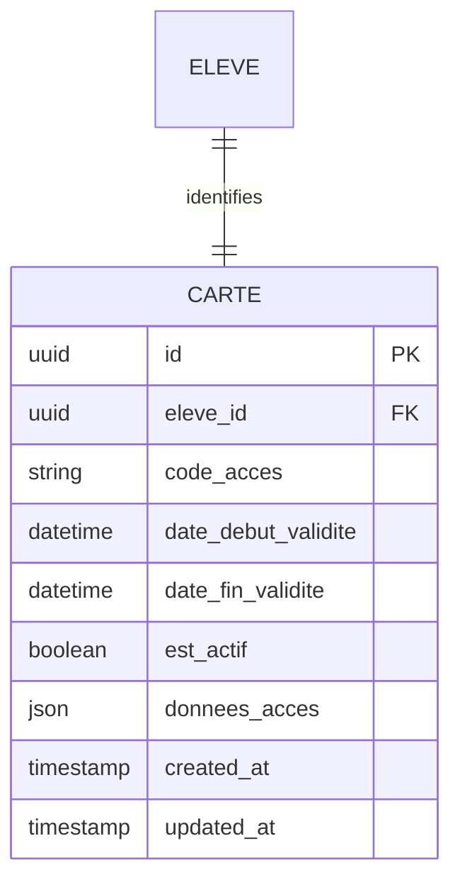

**Diagram sources**
- [carte.entity.ts](file://backend/src/modules/cartes/entities/carte.entity.ts)

**Section sources**
- [carte.entity.ts](file://backend/src/modules/cartes/entities/carte.entity.ts)

### Canteen (cantine)
Purpose
- Manages meal distribution, consumption tracking, and dietary compliance.

Key attributes and constraints
- Meal catalog (breakfast, lunch, snack)
- Daily serving schedules and capacity limits
- Dietary restrictions and allergen tracking
- Consumption logs per student and per date
- Stock adjustments for ingredients and packaging

Operational constraints
- Meals must align with student enrollment periods
- Dietary restrictions must be enforced during meal allocation
- Capacity limits prevent over-serving

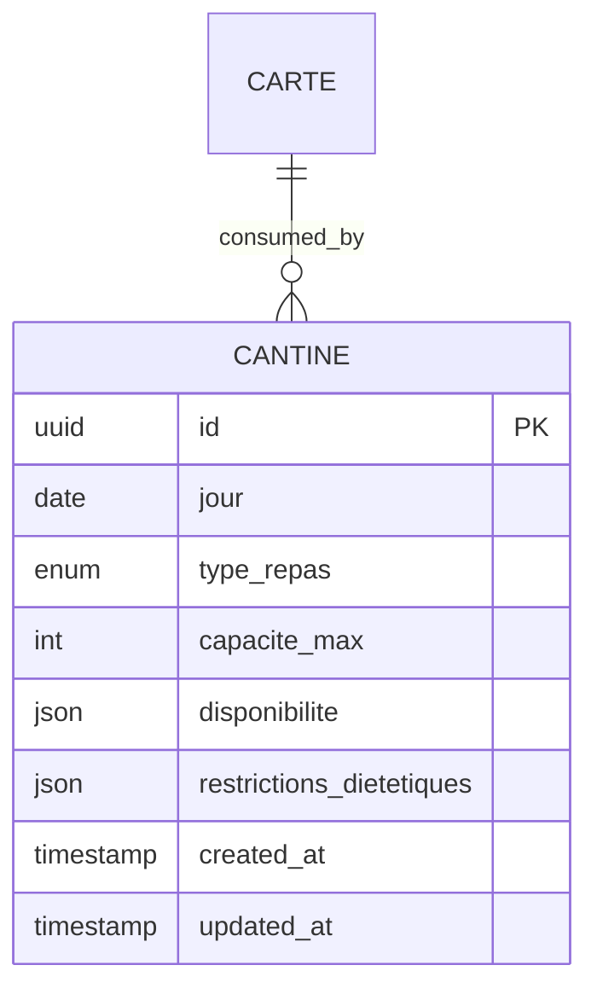

**Diagram sources**
- [cantine.entity.ts](file://backend/src/modules/cantine/entities/cantine.entity.ts)
- [carte.entity.ts](file://backend/src/modules/cartes/entities/carte.entity.ts)

**Section sources**
- [cantine.entity.ts](file://backend/src/modules/cantine/entities/cantine.entity.ts)
- [carte.entity.ts](file://backend/src/modules/cartes/entities/carte.entity.ts)

### Transport (transport)
Purpose
- Assigns students to transport routes and monitors attendance.

Key attributes and constraints
- Route definitions (pickup/dropoff points, stops)
- Vehicle and driver assignments
- Student route enrollments per period
- Attendance records and real-time updates

Operational constraints
- Students must be enrolled in a valid period
- Routes operate within scheduled windows
- Capacity constraints at stops and vehicles

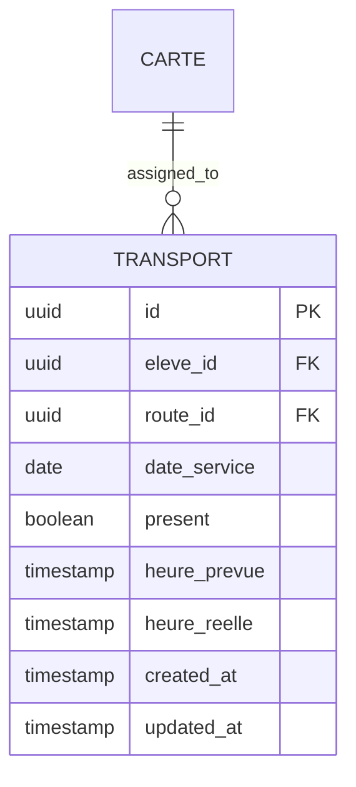

**Diagram sources**
- [transport.entity.ts](file://backend/src/modules/transport/entities/transport.entity.ts)
- [carte.entity.ts](file://backend/src/modules/cartes/entities/carte.entity.ts)

**Section sources**
- [transport.entity.ts](file://backend/src/modules/transport/entities/transport.entity.ts)
- [carte.entity.ts](file://backend/src/modules/cartes/entities/carte.entity.ts)

### Material (materiel)
Purpose
- Tracks inventory items, quantities, and supply movements.

Key attributes and constraints
- Item categories (stationery, equipment, consumables)
- Stock levels and reorder thresholds
- Movement logs (inbound/outbound, transfers)
- Supplier and budget tracking

Operational constraints
- Stock cannot go below zero without triggering alerts
- Movements must be approved and logged
- Categories help with reporting and budgeting

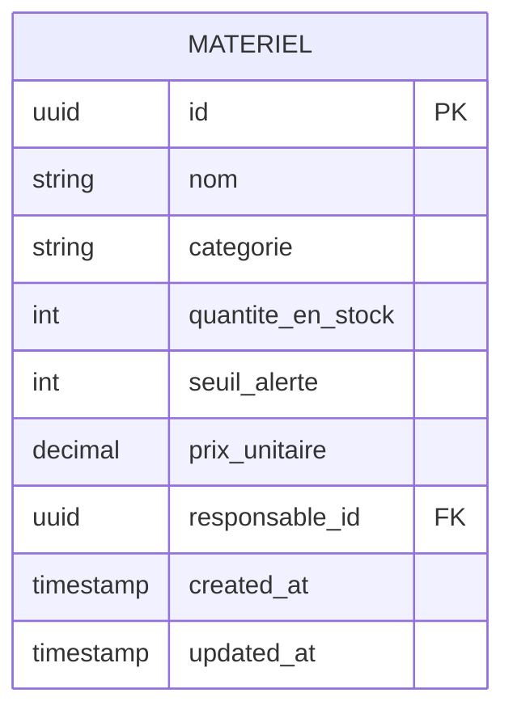

**Diagram sources**
- [materiel.entity.ts](file://backend/src/modules/materiel/entities/materiel.entity.ts)

**Section sources**
- [materiel.entity.ts](file://backend/src/modules/materiel/entities/materiel.entity.ts)

### Gamification
Purpose
- Encourages positive behavior and academic engagement through points, badges, and progress tracking.

Key attributes and constraints
- Point ledger per student
- Achievement criteria and triggers
- Behavioral events and timestamps
- Leaderboards and cohort comparisons

Operational constraints
- Events must be validated against predefined rules
- Points are cumulative but bounded by policy caps
- Achievements unlock progressively

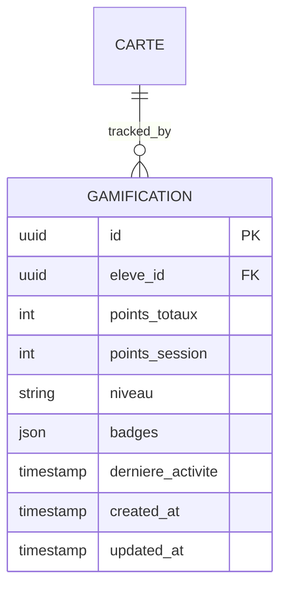

**Diagram sources**
- [gamification.entity.ts](file://backend/src/modules/gamification/entities/gamification.entity.ts)
- [carte.entity.ts](file://backend/src/modules/cartes/entities/carte.entity.ts)

**Section sources**
- [gamification.entity.ts](file://backend/src/modules/gamification/entities/gamification.entity.ts)
- [carte.entity.ts](file://backend/src/modules/cartes/entities/carte.entity.ts)

### Notifications
Purpose
- Sends and stores system alerts and reminders for users.

Key attributes and constraints
- Alert types (info, warning, critical)
- Recipients (individual or group)
- Delivery status and timestamps
- Read/unread indicators

Operational constraints
- Must respect user preferences and opt-out settings
- Critical alerts may bypass delays
- Logs support auditing and delivery reports

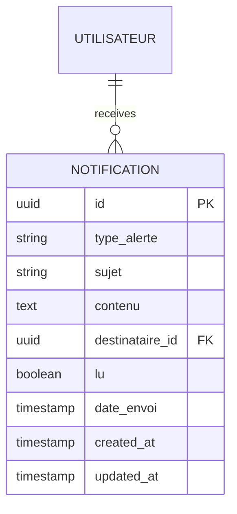

**Diagram sources**
- [notification.entity.ts](file://backend/src/modules/notifications/entities/notification.entity.ts)

**Section sources**
- [notification.entity.ts](file://backend/src/modules/notifications/entities/notification.entity.ts)

### Messaging (messagerie)
Purpose
- Enables internal and external messaging between users.

Key attributes and constraints
- Conversations and threads
- Message content, attachments, and timestamps
- Sender and recipient visibility
- Drafts and sent items

Operational constraints
- Messages must be associated with valid conversations
- Attachments must meet size and type policies
- Privacy settings restrict message visibility

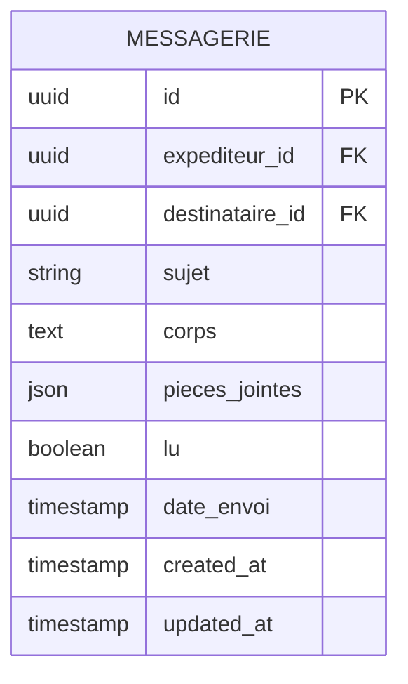

**Diagram sources**
- [messagerie.entity.ts](file://backend/src/modules/messagerie/entities/messagerie.entity.ts)

**Section sources**
- [messagerie.entity.ts](file://backend/src/modules/messagerie/entities/messagerie.entity.ts)

### Orientation
Purpose
- Maintains records of career guidance sessions and outcomes.

Key attributes and constraints
- Session topics and objectives
- Counselor and student assignments
- Notes and action plans
- Follow-up reminders and outcomes

Operational constraints
- Sessions must be scheduled within academic periods
- Outcomes require supervisor approval
- Confidentiality and retention policies apply

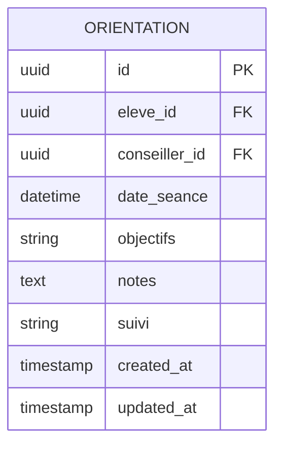

**Diagram sources**
- [orientation.entity.ts](file://backend/src/modules/orientation/entities/orientation.entity.ts)

**Section sources**
- [orientation.entity.ts](file://backend/src/modules/orientation/entities/orientation.entity.ts)

### Request (requete)
Purpose
- Standardizes service requests and tracks their workflow.

Key attributes and constraints
- Request types and categories
- Status transitions (pending, approved, rejected, completed)
- Assigned handlers and deadlines
- Comments and attachments

Operational constraints
- Requests must follow defined approval workflows
- Deadlines enforce SLA compliance
- Audit trails capture all state changes

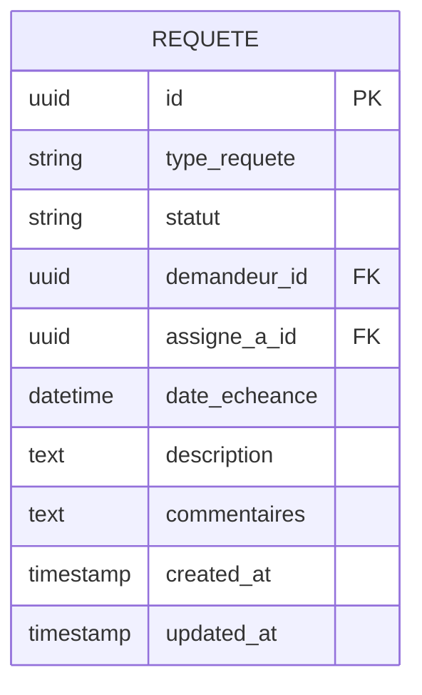

**Diagram sources**
- [requete.entity.ts](file://backend/src/modules/requetes/entities/requete.entity.ts)

**Section sources**
- [requete.entity.ts](file://backend/src/modules/requetes/entities/requete.entity.ts)

## Dependency Analysis
The entities are primarily independent, with optional cross-references for operational enrichment. The following diagram highlights relationships among entities and their linkage to student identification via the card entity.

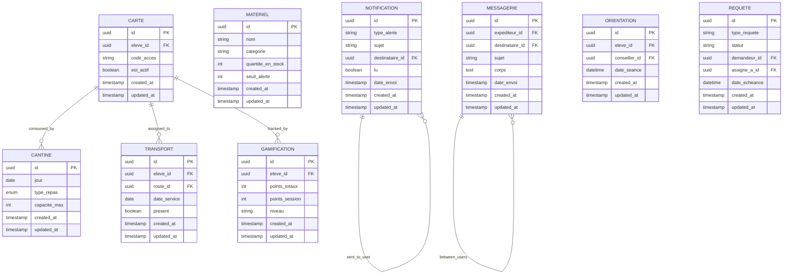

**Diagram sources**
- [carte.entity.ts](file://backend/src/modules/cartes/entities/carte.entity.ts)
- [cantine.entity.ts](file://backend/src/modules/cantine/entities/cantine.entity.ts)
- [transport.entity.ts](file://backend/src/modules/transport/entities/transport.entity.ts)
- [materiel.entity.ts](file://backend/src/modules/materiel/entities/materiel.entity.ts)
- [gamification.entity.ts](file://backend/src/modules/gamification/entities/gamification.entity.ts)
- [notification.entity.ts](file://backend/src/modules/notifications/entities/notification.entity.ts)
- [messagerie.entity.ts](file://backend/src/modules/messagerie/entities/messagerie.entity.ts)
- [orientation.entity.ts](file://backend/src/modules/orientation/entities/orientation.entity.ts)
- [requete.entity.ts](file://backend/src/modules/requetes/entities/requete.entity.ts)

**Section sources**
- [carte.entity.ts](file://backend/src/modules/cartes/entities/carte.entity.ts)
- [cantine.entity.ts](file://backend/src/modules/cantine/entities/cantine.entity.ts)
- [transport.entity.ts](file://backend/src/modules/transport/entities/transport.entity.ts)
- [materiel.entity.ts](file://backend/src/modules/materiel/entities/materiel.entity.ts)
- [gamification.entity.ts](file://backend/src/modules/gamification/entities/gamification.entity.ts)
- [notification.entity.ts](file://backend/src/modules/notifications/entities/notification.entity.ts)
- [messagerie.entity.ts](file://backend/src/modules/messagerie/entities/messagerie.entity.ts)
- [orientation.entity.ts](file://backend/src/modules/orientation/entities/orientation.entity.ts)
- [requete.entity.ts](file://backend/src/modules/requetes/entities/requete.entity.ts)

## Performance Considerations
- Index frequently queried columns (e.g., student identifiers, dates, statuses) to optimize joins and filters.
- Batch operations for high-volume updates (e.g., daily meal counts, transport attendance).
- Asynchronous processing for notifications and messaging bursts.
- Pagination for large lists (requests, messages, notifications).
- Caching of static configurations (e.g., categories, route stops) to reduce DB load.

[No sources needed since this section provides general guidance]

## Troubleshooting Guide
Common issues and resolutions
- Access denied or invalid card: Verify card status and validity dates; ensure synchronization with access control systems.
- Over-capacity in canteen: Check daily capacities and dietary restrictions; adjust schedules or split servings.
- Transport attendance mismatches: Confirm route enrollments and real-time updates; reconcile discrepancies.
- Low material stock alerts: Review reorder thresholds and supplier lead times; trigger procurement workflows.
- Gamification points not updating: Validate event triggers and policy caps; check audit logs for errors.
- Notification delivery failures: Inspect recipient preferences and retry mechanisms; review delivery timestamps.
- Messaging timeouts: Monitor queue sizes and worker throughput; implement retry policies.
- Orientation session conflicts: Align sessions with academic periods and counselor availability.
- Request stuck in pending: Review workflow approvals and escalate unresolved tickets.

**Section sources**
- [carte.entity.ts](file://backend/src/modules/cartes/entities/carte.entity.ts)
- [cantine.entity.ts](file://backend/src/modules/cantine/entities/cantine.entity.ts)
- [transport.entity.ts](file://backend/src/modules/transport/entities/transport.entity.ts)
- [materiel.entity.ts](file://backend/src/modules/materiel/entities/materiel.entity.ts)
- [gamification.entity.ts](file://backend/src/modules/gamification/entities/gamification.entity.ts)
- [notification.entity.ts](file://backend/src/modules/notifications/entities/notification.entity.ts)
- [messagerie.entity.ts](file://backend/src/modules/messagerie/entities/messagerie.entity.ts)
- [orientation.entity.ts](file://backend/src/modules/orientation/entities/orientation.entity.ts)
- [requete.entity.ts](file://backend/src/modules/requetes/entities/requete.entity.ts)

## Conclusion
These supporting entities form the backbone of operational services in eLISAschool. By understanding their models, relationships, and constraints, teams can implement robust integrations, maintain data integrity, and deliver reliable experiences across access control, nutrition, transport, inventory, rewards, communication, guidance, and service requests.

[No sources needed since this section summarizes without analyzing specific files]