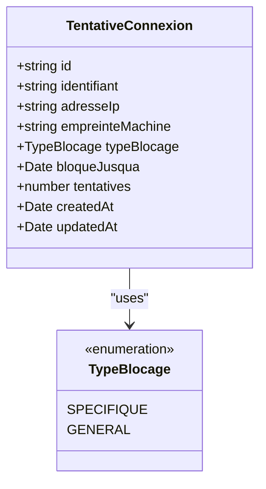
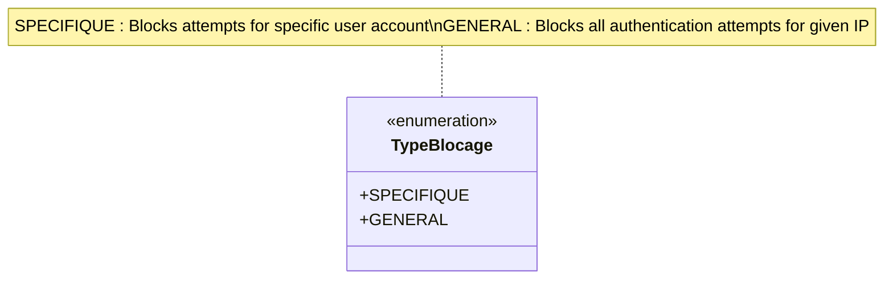
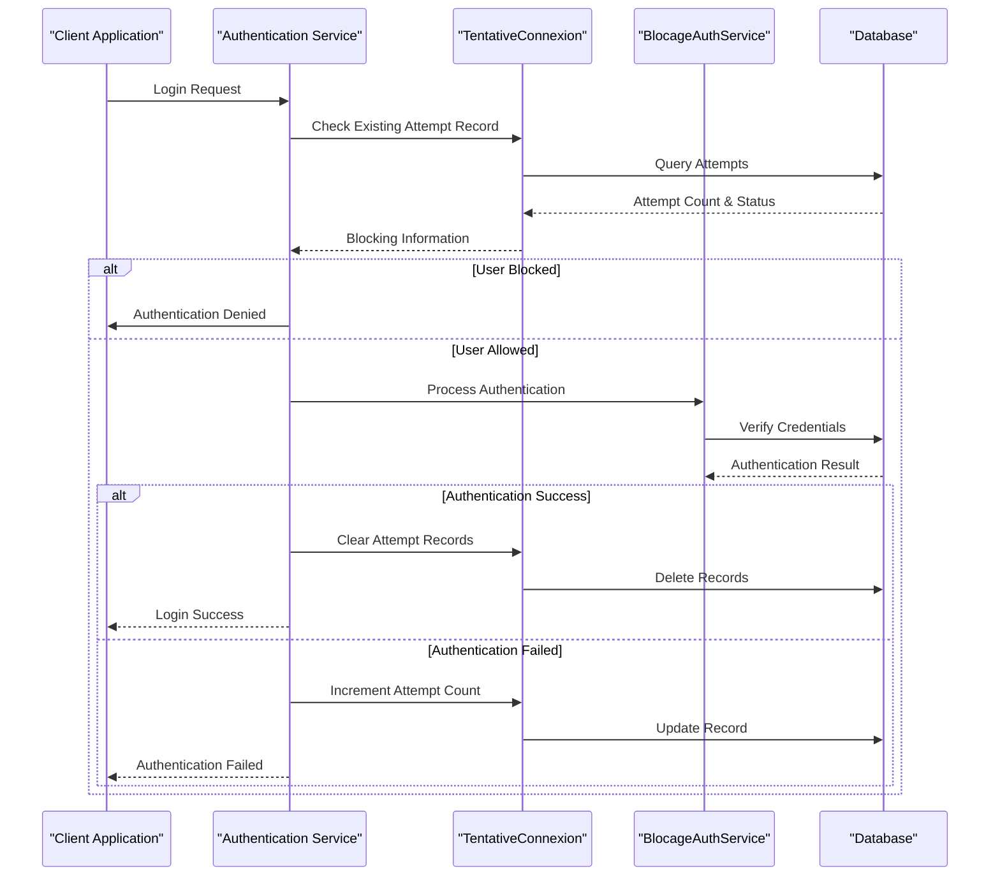
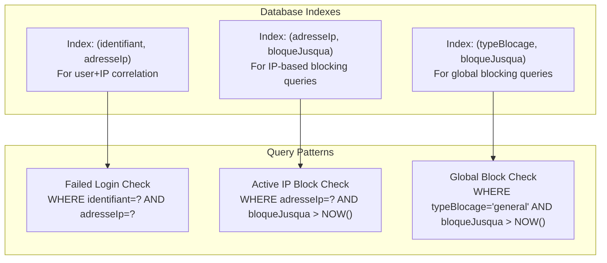
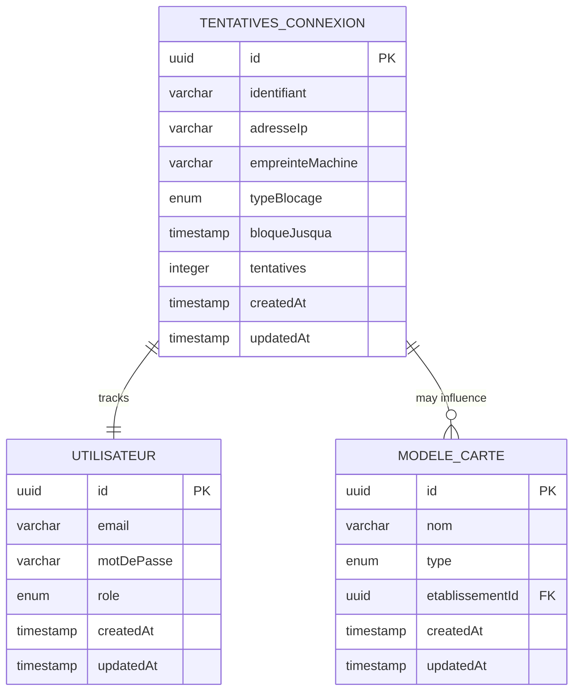
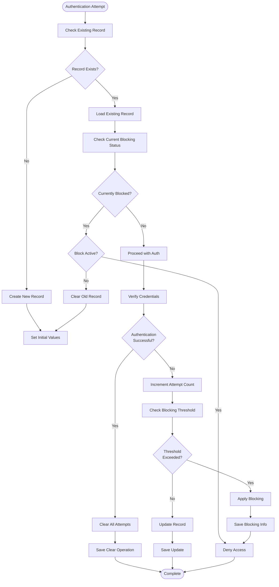
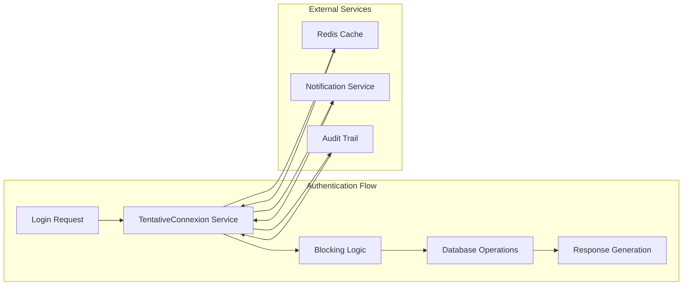

# TentativeConnexion Entity

<cite>
**Referenced Files in This Document**
- [tentative-connexion.entity.ts](file://backend/src/modules/auth/entities/tentative-connexion.entity.ts)
- [blocage-auth.service.ts](file://backend/src/modules/auth/services/blocage-auth.service.ts)
- [utilisateur.entity.ts](file://backend/src/modules/auth/entities/utilisateur.entity.ts)
- [017-reduction-duree-blocage-auth.ts](file://backend/src/database/migrations/017-reduction-duree-blocage-auth.ts)
- [SYSTEME-BLOCAGE-AUTH-DEUX-NIVEAUX.md](file://docs/SYSTEME-BLOCAGE-AUTH-DEUX-NIVEAUX.md)
- [IMPLEMENTATION-BLOCAGE-AUTH-TERMINEE.md](file://IMPLEMENTATION-BLOCAGE-AUTH-TERMINEE.md)
</cite>

## Table of Contents
1. [Introduction](#introduction)
2. [Entity Overview](#entity-overview)
3. [Core Components](#core-components)
4. [Architecture and Design](#architecture-and-design)
5. [Data Model Analysis](#data-model-analysis)
6. [Security Implementation](#security-implementation)
7. [Performance Considerations](#performance-considerations)
8. [Integration Points](#integration-points)
9. [Troubleshooting Guide](#troubleshooting-guide)
10. [Conclusion](#conclusion)

## Introduction

The TentativeConnexion entity represents a critical component in eLISAschool's two-tier authentication blocking system. This entity tracks failed login attempts with granular precision, distinguishing between individual user accounts and machine-based access patterns. The implementation supports sophisticated security measures including IP-based blocking, user-agent fingerprinting, and configurable blocking durations to prevent brute force attacks while maintaining legitimate user access.

The entity was designed to replace legacy single-tier blocking mechanisms with a more robust and flexible system that can adapt to various threat scenarios while minimizing false positives for legitimate users.

## Entity Overview

The TentativeConnexion entity serves as a comprehensive tracking mechanism for authentication failures. It captures essential information about failed login attempts, including user identifiers, client characteristics, and blocking status to enable intelligent security decisions.

**Diagram sources**
- [tentative-connexion.entity.ts:32-56](file://backend/src/modules/auth/entities/tentative-connexion.entity.ts#L32-L56)
- [tentative-connexion.entity.ts:23-26](file://backend/src/modules/auth/entities/tentative-connexion.entity.ts#L23-L26)

**Section sources**
- [tentative-connexion.entity.ts:1-56](file://backend/src/modules/auth/entities/tentative-connexion.entity.ts#L1-L56)

## Core Components

### Entity Definition and Properties

The TentativeConnexion entity consists of several key components that work together to provide comprehensive authentication failure tracking:

**Identification Fields:**
- `identifiant`: Stores the user identifier (email, matricule, or pseudonym) used during authentication attempts
- `adresseIp`: Captures the client's IP address for network-level tracking
- `empreinteMachine`: Maintains a hash of user-agent and other client characteristics for device identification

**Blocking Management:**
- `typeBlocage`: Enumerated field indicating whether blocking applies to specific users or all users
- `bloqueJusqua`: Timestamp indicating when the blocking period expires
- `tentatives`: Counter tracking consecutive failed authentication attempts

**Temporal Tracking:**
- `createdAt` and `updatedAt`: Automatic timestamps for record lifecycle management

**Section sources**
- [tentative-connexion.entity.ts:36-56](file://backend/src/modules/auth/entities/tentative-connexion.entity.ts#L36-L56)

### TypeBlocage Enumeration

The TypeBlocage enumeration defines the two blocking strategies supported by the system:

**Diagram sources**
- [tentative-connexion.entity.ts:23-26](file://backend/src/modules/auth/entities/tentative-connexion.entity.ts#L23-L26)

**Section sources**
- [tentative-connexion.entity.ts:23-26](file://backend/src/modules/auth/entities/tentative-connexion.entity.ts#L23-L26)

## Architecture and Design

### Two-Tier Blocking System

The TentativeConnexion entity implements a sophisticated two-tier blocking architecture designed to balance security with user accessibility:

**Diagram sources**
- [blocage-auth.service.ts:16](file://backend/src/modules/auth/services/blocage-auth.service.ts#L16)
- [tentative-connexion.entity.ts:32](file://backend/src/modules/auth/entities/tentative-connexion.entity.ts#L32)

### Index Strategy

The entity employs strategic indexing to optimize query performance for the most common blocking scenarios:

**Diagram sources**
- [tentative-connexion.entity.ts:33-35](file://backend/src/modules/auth/entities/tentative-connexion.entity.ts#L33-L35)

**Section sources**
- [tentative-connexion.entity.ts:33-35](file://backend/src/modules/auth/entities/tentative-connexion.entity.ts#L33-L35)

## Data Model Analysis

### Entity Schema Structure

The TentativeConnexion entity follows a normalized relational design optimized for authentication security tracking:

| Field Name | Data Type | Constraints | Purpose |
|------------|-----------|-------------|---------|
| `id` | UUID | Primary Key | Unique identifier for each attempt record |
| `identifiant` | VARCHAR(255) | Required | User identifier from authentication attempt |
| `adresseIp` | VARCHAR(45) | Required | Client IP address for network tracking |
| `empreinteMachine` | VARCHAR(255) | Nullable | Device fingerprint for client identification |
| `typeBlocage` | ENUM | Required | Blocking strategy type (SPECIFIQUE/GENERAL) |
| `bloqueJusqua` | TIMESTAMP | Nullable | Expiration timestamp for blocking period |
| `tentatives` | INTEGER | Default: 0 | Counter for consecutive failed attempts |
| `createdAt` | TIMESTAMP | Required | Record creation timestamp |
| `updatedAt` | TIMESTAMP | Required | Last update timestamp |

### Relationship Dependencies

The entity integrates with the broader authentication system through several key relationships:

**Diagram sources**
- [tentative-connexion.entity.ts:32](file://backend/src/modules/auth/entities/tentative-connexion.entity.ts#L32)
- [utilisateur.entity.ts:91](file://backend/src/modules/auth/entities/utilisateur.entity.ts#L91)

**Section sources**
- [tentative-connexion.entity.ts:26-56](file://backend/src/modules/auth/entities/tentative-connexion.entity.ts#L26-L56)

## Security Implementation

### Blocking Mechanism Logic

The TentativeConnexion entity enables dynamic blocking based on configurable thresholds and time windows:

**Diagram sources**
- [blocage-auth.service.ts:346](file://backend/src/modules/auth/services/blocage-auth.service.ts#L346)

### Machine Fingerprinting

The entity incorporates advanced client identification through machine fingerprinting:

| Fingerprint Component | Description | Purpose |
|----------------------|-------------|---------|
| User-Agent String | Browser and OS identification | Client platform detection |
| Screen Resolution | Display characteristics | Hardware signature |
| Timezone Offset | Local time zone | Geographic correlation |
| Language Settings | Browser preferences | Regional identification |
| Plugin Detection | Installed browser plugins | Unique client profile |

**Section sources**
- [tentative-connexion.entity.ts:52-56](file://backend/src/modules/auth/entities/tentative-connexion.entity.ts#L52-L56)

## Performance Considerations

### Database Optimization

The TentativeConnexion entity implements several performance optimization strategies:

**Index Strategy:**
- Composite index on `(identifiant, adresseIp)` for efficient user-specific blocking queries
- Composite index on `(adresseIp, bloqueJusqua)` for rapid IP-based blocking checks
- Composite index on `(typeBlocage, bloqueJusqua)` for global blocking scenario optimization

**Query Optimization:**
- Minimal column selection in blocking queries to reduce network overhead
- Efficient timestamp comparisons using database-native functions
- Batch operations for clearing expired blocking records

### Memory Management

The entity supports efficient memory usage through:

- Lazy loading of related entities where appropriate
- Optimized data types for IP addresses and identifiers
- Automatic cleanup of expired blocking records

**Section sources**
- [tentative-connexion.entity.ts:33-35](file://backend/src/modules/auth/entities/tentative-connexion.entity.ts#L33-L35)

## Integration Points

### Service Layer Integration

The TentativeConnexion entity integrates deeply with the authentication service layer:

**Diagram sources**
- [blocage-auth.service.ts:49](file://backend/src/modules/auth/services/blocage-auth.service.ts#L49)

### Migration Integration

The entity participates in the authentication system's migration framework:

**Migration Dependencies:**
- Initial entity creation during authentication system setup
- Schema modifications for performance optimization
- Data cleanup operations for expired blocking records

**Section sources**
- [017-reduction-duree-blocage-auth.ts:1-50](file://backend/src/database/migrations/017-reduction-duree-blocage-auth.ts#L1-L50)

## Troubleshooting Guide

### Common Issues and Solutions

**Issue: Blocking Not Working**
- Verify database indexes exist and are properly configured
- Check that blocking threshold values are set appropriately
- Confirm that blocking expiration timestamps are being updated correctly

**Issue: False Positives**
- Review machine fingerprinting configuration for overly sensitive matching
- Adjust blocking thresholds based on legitimate user patterns
- Implement grace periods for recently blocked IP addresses

**Issue: Performance Degradation**
- Monitor query execution plans for blocking queries
- Verify index utilization through database profiling
- Consider partitioning strategies for high-volume environments

### Monitoring and Maintenance

**Key Metrics to Monitor:**
- Average blocking response time
- Number of blocked authentication attempts
- Cache hit rates for blocking decisions
- Database query performance for blocking operations

**Maintenance Tasks:**
- Regular cleanup of expired blocking records
- Performance tuning of frequently accessed indexes
- Review and adjustment of blocking thresholds based on threat analysis

**Section sources**
- [SYSTEME-BLOCAGE-AUTH-DEUX-NIVEAUX.md:61](file://docs/SYSTEME-BLOCAGE-AUTH-DEUX-NIVEAUX.md#L61)

## Conclusion

The TentativeConnexion entity represents a sophisticated and well-designed component of eLISAschool's authentication security infrastructure. Its implementation of a two-tier blocking system, combined with advanced client identification and performance optimization, provides robust protection against authentication attacks while maintaining system usability.

The entity's modular design allows for easy integration with existing authentication systems and supports future enhancements as security requirements evolve. Through careful consideration of performance, scalability, and maintainability, the TentativeConnexion entity serves as a foundation for enterprise-grade authentication security in educational institution management systems.

The comprehensive documentation and implementation guidelines available in the project support ongoing development and maintenance of this critical security component, ensuring its continued effectiveness against emerging threats while supporting the diverse needs of educational institutions.