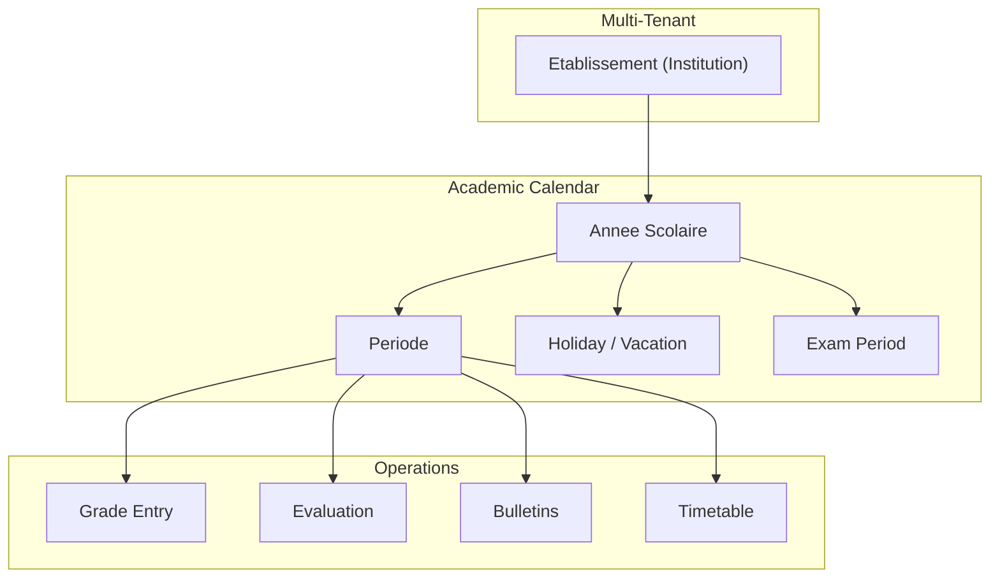
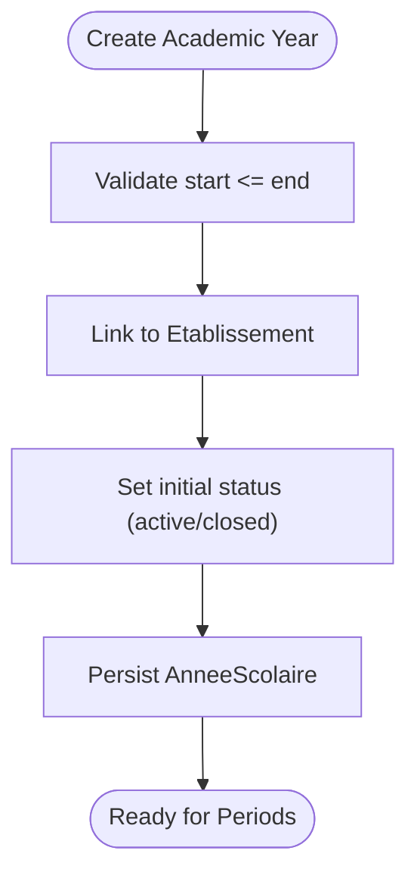
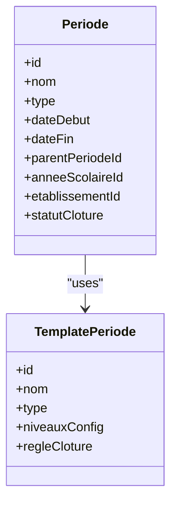
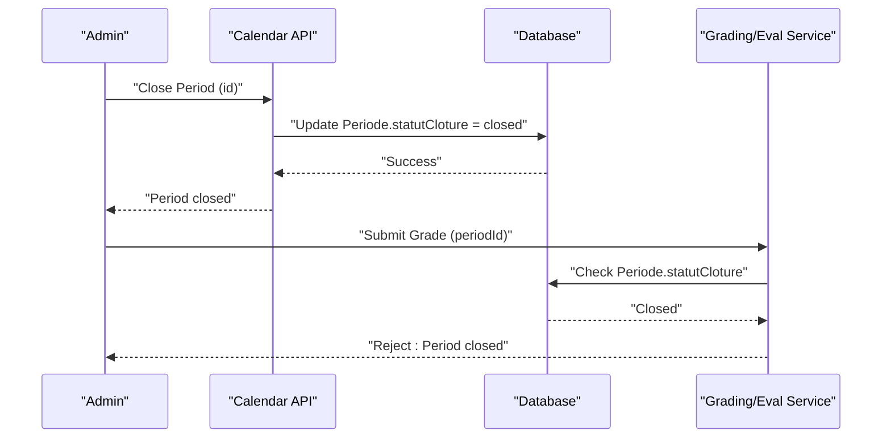
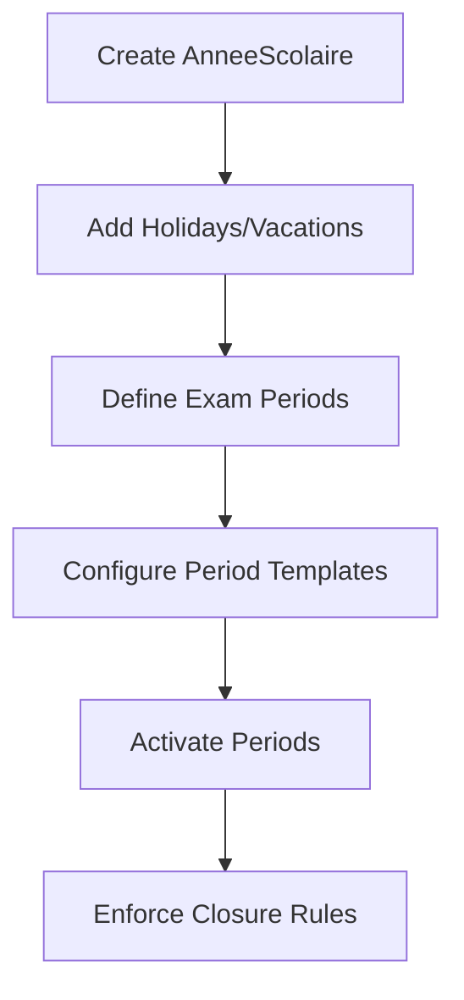
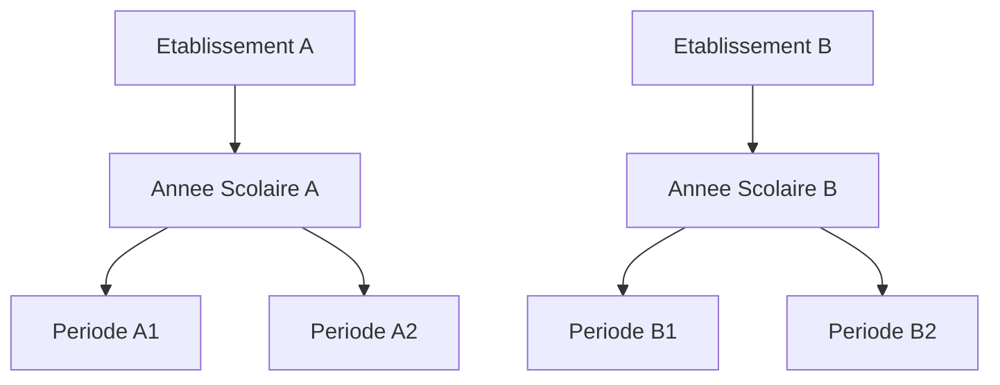
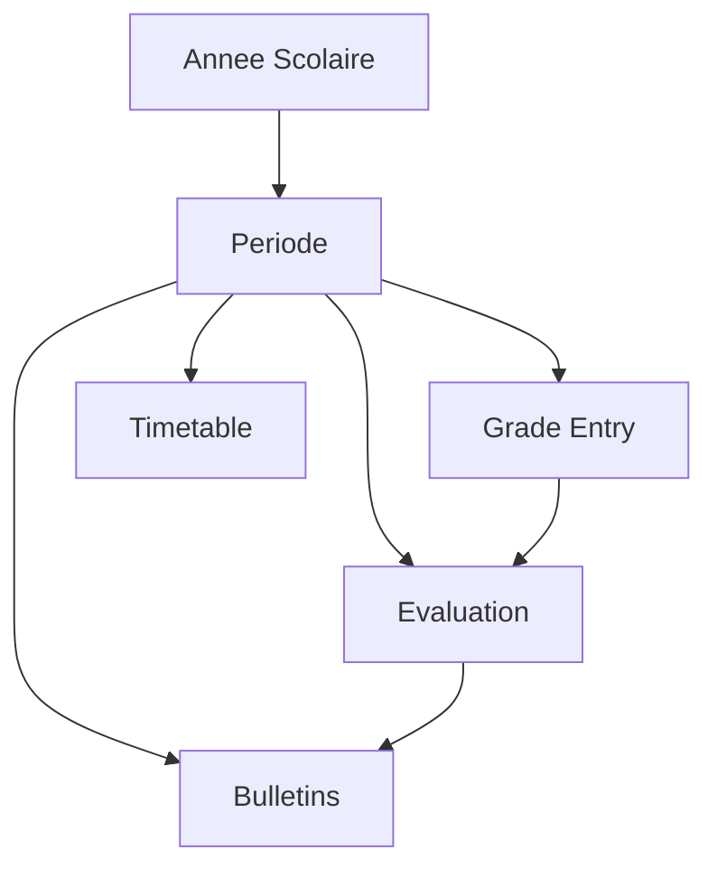
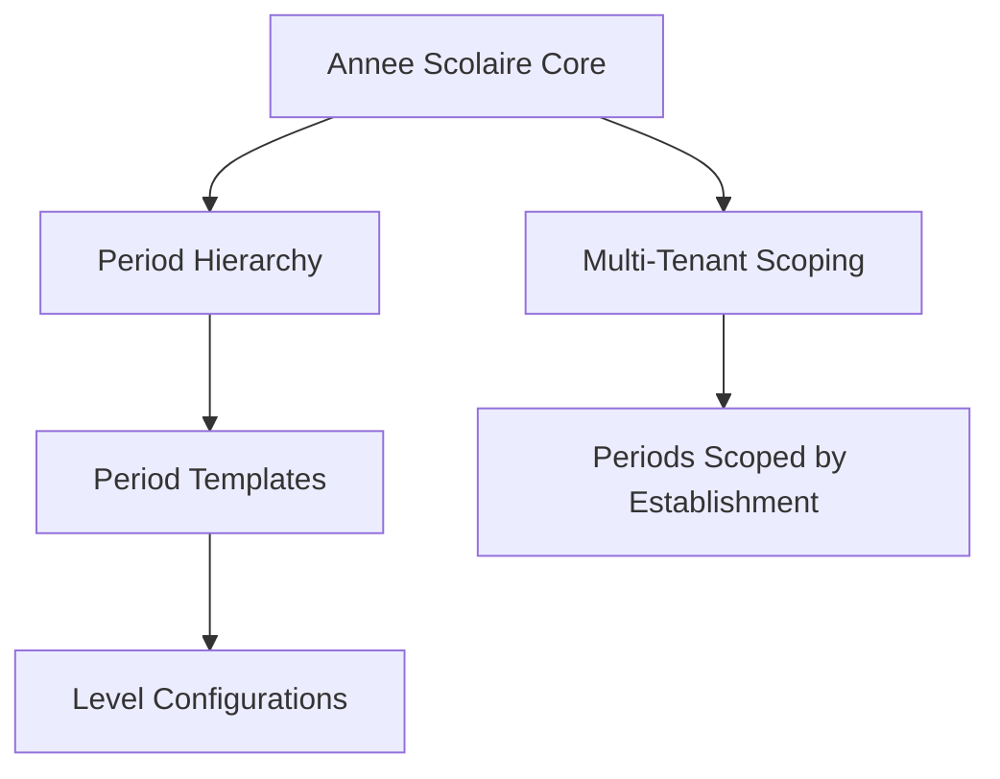

# Academic Calendar System

<cite>
**Referenced Files in This Document**
- [035-contexte-africain-periodes.sql](file://backend/database/migrations/035-contexte-africain-periodes.sql)
- [035b-migration-donnees-periodes.sql](file://backend/database/migrations/035b-migration-donnees-periodes.sql)
- [102-periodes-hierarchie.sql](file://backend/database/migrations/102-periodes-hierarchie.sql)
- [103-templates-periode-personnalisables.sql](file://backend/database/migrations/103-templates-periode-personnalisables.sql)
- [104-refonte-periodes-niveaux-configurables.sql](file://backend/database/migrations/104-refonte-periodes-niveaux-configurables.sql)
- [105-migration-templates-v5.sql](file://backend/database/migrations/105-migration-templates-v5.sql)
- [101-normalisation-annee-scolaire-cloture.sql](file://backend/database/migrations/101-normalisation-annee-scolaire-cloture.sql)
- [085-periode-etablissement-id.sql](file://backend/database/migrations/085-periode-etablissement-id.sql)
- [058-multi-tenant-structure-academique.sql](file://backend/database/migrations/058-multi-tenant-structure-academique.sql)
- [059-multi-tenant-matiere.sql](file://backend/database/migrations/059-multi-tenant-matiere.sql)
- [088-refactorisation-architecture-academique.sql](file://backend/database/migrations/088-refactorisation-architecture-academique.sql)
- [089-finalisation-architecture-academique-v2.sql](file://backend/database/migrations/089-finalisation-architecture-academique-v2.sql)
- [090-correction-migration-088-camelcase.sql](file://backend/database/migrations/090-correction-migration-088-camelcase.sql)
- [091-peuplement-architecture-academique.sql](file://backend/database/migrations/091-peuplement-architecture-academique.sql)
- [092-refactorisation-classeAnneeId.sql](file://backend/database/migrations/092-refactorisation-classeAnneeId.sql)
- [056-suppression-cycle-scolaire.sql](file://backend/database/migrations/056-suppression-cycle-scolaire.sql)
- [057-supprimer-niveau-filiere-id.sql](file://backend/database/migrations/057-supprimer-niveau-filiere-id.sql)
- [053-structure-academique-complete.sql](file://backend/database/migrations/053-structure-academique-complete.sql)
- [054-refonte-structure-academique-v2.sql](file://backend/database/migrations/054-refonte-structure-academique-v2.sql)
- [055-structure-academique-ameliorations.sql](file://backend/database/migrations/055-structure-academique-ameliorations.sql)
- [058-unifier-periode-cloturee-statut.sql](file://backend/database/migrations/058-unifier-periode-cloturee-statut.sql)
- [060-ajouter-affectation-matiere-coefficient.sql](file://backend/database/migrations/060-ajouter-affectation-matiere-coefficient.sql)
- [061-creer-table-bulletins-matieres.sql](file://backend/database/migrations/061-creer-table-bulletins-matieres.sql)
- [062-creer-table-evaluations-competences.sql](file://backend/database/migrations/062-creer-table-evaluations-competences.sql)
- [063-creer-module-emploi-du-temps.sql](file://backend/database/migrations/063-creer-module-emploi-du-temps.sql)
- [064-validateur-sous-systeme.sql](file://backend/database/migrations/064-validateur-sous-systeme.sql)
- [065-creer-templates-emploi-du-temps.sql](file://backend/database/migrations/065-creer-templates-emploi-du-temps.sql)
- [072-scoping-cycles-niveaux.sql](file://backend/database/migrations/072-scoping-cycles-niveaux.sql)
- [073-competence-unique-composite.sql](file://backend/database/migrations/073-competence-unique-composite.sql)
- [074-matiere-niveau-unique-composite.sql](file://backend/database/migrations/074-matiere-niveau-unique-composite.sql)
- [075-module-groupes-etablissements.sql](file://backend/database/migrations/075-module-groupes-etablissements.sql)
- [076-permissions-groupes-etablissements.sql](file://backend/database/migrations/076-permissions-groupes-etablissements.sql)
- [077-update-permissions-groupes.sql](file://backend/database/migrations/077-update-permissions-groupes.sql)
- [078-utilisateur-test-groupes.sql](file://backend/database/migrations/078-utilisateur-test-groupes.sql)
- [079-add-roleId-utilisateur-etablissements.sql](file://backend/database/migrations/079-add-roleId-utilisateur-etablissements.sql)
- [079-correction-permissions-groupes.sql](file://backend/database/migrations/079-correction-permissions-groupes.sql)
- [080-preferences-utilisateur-multi-tenant.sql](file://backend/database/migrations/080-preferences-utilisateur-multi-tenant.sql)
- [081-module-apparence-fonds.sql](file://backend/database/migrations/081-module-apparence-fonds.sql)
- [082-fix-contrainte-unique-preferences.sql](file://backend/database/migrations/082-fix-contrainte-unique-preferences.sql)
- [083-fix-contrainte-unique-parametres.sql](file://backend/database/migrations/083-fix-contrainte-unique-parametres.sql)
- [084-cleanup-classe-id-notes.sql](file://backend/database/migrations/084-cleanup-classe-id-notes.sql)
- [086-affectation-matiere-etablissement-id.sql](file://backend/database/migrations/086-affectation-matiere-etablissement-id.sql)
- [087-affectation-matiere-verifications.sql](file://backend/database/migrations/087-affectation-matiere-verifications.sql)
- [089-finalisation-architecture-academique-v2.sql](file://backend/database/migrations/089-finalisation-architecture-academique-v2.sql)
- [090-correction-migration-088-camelcase.sql](file://backend/database/migrations/090-correction-migration-088-camelcase.sql)
- [091-peuplement-architecture-academique.sql](file://backend/database/migrations/091-peuplement-architecture-academique.sql)
- [092-refactorisation-classeAnneeId.sql](file://backend/database/migrations/092-refactorisation-classeAnneeId.sql)
- [099-add-monitoring-params.sql](file://backend/database/migrations/099-add-monitoring-params.sql)
- [100-classes-salle-principale.sql](file://backend/database/migrations/100-classes-salle-principale.sql)
- [101-normalisation-annee-scolaire-cloture.sql](file://backend/database/migrations/101-normalisation-annee-scolaire-cloture.sql)
- [102-periodes-hierarchie.sql](file://backend/database/migrations/102-periodes-hierarchie.sql)
- [103-templates-periode-personnalisables.sql](file://backend/database/migrations/103-templates-periode-personnalisables.sql)
- [104-refonte-periodes-niveaux-configurables.sql](file://backend/database/migrations/104-refonte-periodes-niveaux-configurables.sql)
- [105-migration-templates-v5.sql](file://backend/database/migrations/105-migration-templates-v5.sql)
- [106-rename-sequence-to-evaluation.sql](file://backend/database/migrations/106-rename-sequence-to-evaluation.sql)
- [107-cleanup-configuration-modules-actif.sql](file://backend/database/migrations/107-cleanup-configuration-modules-actif.sql)
- [108-refactor-salle-principale.sql](file://backend/database/migrations/108-refactor-salle-principale.sql)
</cite>

## Table of Contents
1. [Introduction](#introduction)
2. [Project Structure](#project-structure)
3. [Core Components](#core-components)
4. [Architecture Overview](#architecture-overview)
5. [Detailed Component Analysis](#detailed-component-analysis)
6. [Dependency Analysis](#dependency-analysis)
7. [Performance Considerations](#performance-considerations)
8. [Troubleshooting Guide](#troubleshooting-guide)
9. [Conclusion](#conclusion)
10. [Appendices](#appendices)

## Introduction
This document provides comprehensive data model documentation for eLISAschool’s academic calendar system. It focuses on:
- AnneeScolaire entities that define academic years with start/end dates and institutional context
- Periode entities representing periods, semesters, and trimesters with configurable hierarchies
- The period closure workflow and its impact on academic operations such as grading and reporting
- Holiday scheduling, exam periods, and vacation management
- Multi-tenant isolation and institution-specific calendars
- Relationships between academic years, periods, and operational constraints like grade entry deadlines
- Examples of different academic calendar structures used across educational systems and regions

The goal is to help both technical and non-technical users understand how the academic calendar is modeled, configured, and enforced within the platform.

## Project Structure
The academic calendar system is implemented primarily through database migrations and module schemas. Key areas include:
- Academic year definitions and closures
- Period hierarchy and templates
- Multi-tenant scoping by establishment
- Integration points with grades, evaluations, timetables, and bulletins



[No sources needed since this diagram shows conceptual workflow, not actual code structure]

## Core Components
- AnneeScolaire (Academic Year): Defines an academic year with start and end dates, linked to an institution (establishment). Supports closure status and operational constraints.
- Periode (Period): Represents academic periods (semesters, trimesters, quarters), with hierarchical relationships and customizable templates. Scoped per establishment and tied to an academic year.
- Closure Workflow: Enforces period closure states that restrict or enable operations such as grade entry, evaluation updates, and bulletin generation.
- Holidays and Vacations: Scheduled non-instructional days managed at the academic year level.
- Exam Periods: Specialized periods for national or institutional exams, integrated with evaluation workflows.
- Multi-Tenant Isolation: All calendar entities are scoped to establishments to ensure strict tenant isolation.

**Section sources**
- [053-structure-academique-complete.sql](file://backend/database/migrations/053-structure-academique-complete.sql)
- [054-refonte-structure-academique-v2.sql](file://backend/database/migrations/054-refonte-structure-academique-v2.sql)
- [055-structure-academique-ameliorations.sql](file://backend/database/migrations/055-structure-academique-ameliorations.sql)
- [058-multi-tenant-structure-academique.sql](file://backend/database/migrations/058-multi-tenant-structure-academique.sql)
- [085-periode-etablissement-id.sql](file://backend/database/migrations/085-periode-etablissement-id.sql)
- [101-normalisation-annee-scolaire-cloture.sql](file://backend/database/migrations/101-normalisation-annee-scolaire-cloture.sql)
- [102-periodes-hierarchie.sql](file://backend/database/migrations/102-periodes-hierarchie.sql)
- [103-templates-periode-personnalisables.sql](file://backend/database/migrations/103-templates-periode-personnalisables.sql)
- [104-refonte-periodes-niveaux-configurables.sql](file://backend/database/migrations/104-refonte-periodes-niveaux-configurables.sql)
- [105-migration-templates-v5.sql](file://backend/database/migrations/105-migration-templates-v5.sql)
- [058-unifier-periode-cloturee-statut.sql](file://backend/database/migrations/058-unifier-periode-cloturee-statut.sql)

## Architecture Overview
The academic calendar architecture centers around AnneeScolaire and Periode, with strong multi-tenant scoping and closure enforcement. Operations such as grading, evaluations, bulletins, and timetables depend on active periods and respect closure constraints.

```mermaid
classDiagram
class Etablissement {
+id
+nom
+pays
+region
}
class AnneeScolaire {
+id
+nom
+dateDebut
+dateFin
+statutCloture
+etablissementId
}
class Periode {
+id
+nom
+type
+dateDebut
+dateFin
+parentPeriodeId
+anneeScolaireId
+etablissementId
+statutCloture
}
class Evaluation {
+id
+periodeId
+anneeScolaireId
+etablissementId
}
class BulletinMatiere {
+id
+periodeId
+anneeScolaireId
+etablissementId
}
class EmploiDuTemps {
+id
+periodeId
+anneeScolaireId
+etablissementId
}
Etablissement ||--o{ AnneeScolaire : "owns"
AnneeScolaire ||--o{ Periode : "contains"
Periode ||--o{ Evaluation : "hosts"
Periode ||--o{ BulletinMatiere : "hosts"
Periode ||--o{ EmploiDuTemps : "hosts"
```

**Diagram sources**
- [053-structure-academique-complete.sql](file://backend/database/migrations/053-structure-academique-complete.sql)
- [054-refonte-structure-academique-v2.sql](file://backend/database/migrations/054-refonte-structure-academique-v2.sql)
- [058-multi-tenant-structure-academique.sql](file://backend/database/migrations/058-multi-tenant-structure-academique.sql)
- [085-periode-etablissement-id.sql](file://backend/database/migrations/085-periode-etablissement-id.sql)
- [102-periodes-hierarchie.sql](file://backend/database/migrations/102-periodes-hierarchie.sql)
- [061-creer-table-bulletins-matieres.sql](file://backend/database/migrations/061-creer-table-bulletins-matieres.sql)
- [062-creer-table-evaluations-competences.sql](file://backend/database/migrations/062-creer-table-evaluations-competences.sql)
- [063-creer-module-emploi-du-temps.sql](file://backend/database/migrations/063-creer-module-emploi-du-temps.sql)

## Detailed Component Analysis

### AnneeScolaire (Academic Year)
- Purpose: Define a single academic year with start and end dates, associated with an establishment.
- Key attributes: name, start date, end date, closure status, establishment link.
- Operational constraints: Closure status affects downstream operations (grading, evaluations, bulletins).
- Multi-tenant scope: Each establishment can have multiple academic years; queries must filter by etablissementId.



**Section sources**
- [053-structure-academique-complete.sql](file://backend/database/migrations/053-structure-academique-complete.sql)
- [054-refonte-structure-academique-v2.sql](file://backend/database/migrations/054-refonte-structure-academique-v2.sql)
- [058-multi-tenant-structure-academique.sql](file://backend/database/migrations/058-multi-tenant-structure-academique.sql)
- [101-normalisation-annee-scolaire-cloture.sql](file://backend/database/migrations/101-normalisation-annee-scolaire-cloture.sql)

### Periode (Period)
- Purpose: Represent academic periods (semesters, trimesters, quarters) with hierarchical organization.
- Key attributes: name, type, start/end dates, parent period reference, academic year link, establishment link, closure status.
- Hierarchical support: Parent-child relationships allow nested structures (e.g., semester -> trimester).
- Templates: Customizable period templates enable region-specific configurations.



**Diagram sources**
- [102-periodes-hierarchie.sql](file://backend/database/migrations/102-periodes-hierarchie.sql)
- [103-templates-periode-personnalisables.sql](file://backend/database/migrations/103-templates-periode-personnalisables.sql)
- [104-refonte-periodes-niveaux-configurables.sql](file://backend/database/migrations/104-refonte-periodes-niveaux-configurables.sql)
- [105-migration-templates-v5.sql](file://backend/database/migrations/105-migration-templates-v5.sql)

**Section sources**
- [035-contexte-africain-periodes.sql](file://backend/database/migrations/035-contexte-africain-periodes.sql)
- [035b-migration-donnees-periodes.sql](file://backend/database/migrations/035b-migration-donnees-periodes.sql)
- [085-periode-etablissement-id.sql](file://backend/database/migrations/085-periode-etablissement-id.sql)
- [102-periodes-hierarchie.sql](file://backend/database/migrations/102-periodes-hierarchie.sql)
- [103-templates-periode-personnalisables.sql](file://backend/database/migrations/103-templates-periode-personnalisables.sql)
- [104-refonte-periodes-niveaux-configurables.sql](file://backend/database/migrations/104-refonte-periodes-niveaux-configurables.sql)
- [105-migration-templates-v5.sql](file://backend/database/migrations/105-migration-templates-v5.sql)

### Period Closure Workflow
- Purpose: Control when academic operations can proceed based on period status.
- States: Open, Closed, Locked (as applicable).
- Impact: When closed, grade entry and evaluation modifications may be restricted; bulletins and reports may require closure.



**Diagram sources**
- [058-unifier-periode-cloturee-statut.sql](file://backend/database/migrations/058-unifier-periode-cloturee-statut.sql)
- [101-normalisation-annee-scolaire-cloture.sql](file://backend/database/migrations/101-normalisation-annee-scolaire-cloture.sql)

**Section sources**
- [058-unifier-periode-cloturee-statut.sql](file://backend/database/migrations/058-unifier-periode-cloturee-statut.sql)
- [101-normalisation-annee-scolaire-cloture.sql](file://backend/database/migrations/101-normalisation-annee-scolaire-cloture.sql)

### Holiday Scheduling, Exam Periods, and Vacation Management
- Holidays/Vacations: Non-instructional days scheduled within an academic year; affect timetable and availability.
- Exam Periods: Specialized periods for national/institutional exams; integrate with evaluation workflows and grading constraints.
- Configuration: Managed via period types and templates; can be scoped to specific levels or subjects.



**Section sources**
- [035-contexte-africain-periodes.sql](file://backend/database/migrations/035-contexte-africain-periodes.sql)
- [035b-migration-donnees-periodes.sql](file://backend/database/migrations/035b-migration-donnees-periodes.sql)
- [103-templates-periode-personnalisables.sql](file://backend/database/migrations/103-templates-periode-personnalisables.sql)
- [104-refonte-periodes-niveaux-configurables.sql](file://backend/database/migrations/104-refonte-periodes-niveaux-configurables.sql)

### Multi-Tenant Calendar Isolation and Institution-Specific Calendars
- Scoping: All calendar entities include establishment identifiers to enforce strict tenant isolation.
- Independence: Each establishment maintains independent academic years, periods, holidays, and exam schedules.
- Data Integrity: Foreign keys and constraints ensure referential integrity within each tenant.



**Diagram sources**
- [058-multi-tenant-structure-academique.sql](file://backend/database/migrations/058-multi-tenant-structure-academique.sql)
- [085-periode-etablissement-id.sql](file://backend/database/migrations/085-periode-etablissement-id.sql)

**Section sources**
- [058-multi-tenant-structure-academique.sql](file://backend/database/migrations/058-multi-tenant-structure-academique.sql)
- [085-periode-etablissement-id.sql](file://backend/database/migrations/085-periode-etablissement-id.sql)

### Relationship Between Academic Years, Periods, and Operational Constraints
- Dependencies: Grading, evaluations, bulletins, and timetables depend on active periods within an academic year.
- Constraints: Closure status enforces deadlines and prevents retrograde changes after period closure.
- Integration: Coefficients, subject assignments, and competency evaluations align with period boundaries.



**Diagram sources**
- [060-ajouter-affectation-matiere-coefficient.sql](file://backend/database/migrations/060-ajouter-affectation-matiere-coefficient.sql)
- [061-creer-table-bulletins-matieres.sql](file://backend/database/migrations/061-creer-table-bulletins-matieres.sql)
- [062-creer-table-evaluations-competences.sql](file://backend/database/migrations/062-creer-table-evaluations-competences.sql)
- [063-creer-module-emploi-du-temps.sql](file://backend/database/migrations/063-creer-module-emploi-du-temps.sql)

**Section sources**
- [060-ajouter-affectation-matiere-coefficient.sql](file://backend/database/migrations/060-ajouter-affectation-matiere-coefficient.sql)
- [061-creer-table-bulletins-matieres.sql](file://backend/database/migrations/061-creer-table-bulletins-matieres.sql)
- [062-creer-table-evaluations-competences.sql](file://backend/database/migrations/062-creer-table-evaluations-competences.sql)
- [063-creer-module-emploi-du-temps.sql](file://backend/database/migrations/063-creer-module-emploi-du-temps.sql)

### Examples of Academic Calendar Structures Across Regions
- Trimester Model: Three equal-length periods per academic year; suitable for systems emphasizing frequent assessment cycles.
- Semester Model: Two main periods per academic year; common in many international curricula.
- Hybrid Model: Combines semesters with trimesters or quarters; allows flexibility for regional requirements.
- National Exam Focus: Dedicated exam periods integrated into the calendar; critical for standardized testing environments.

These structures are enabled via period types, templates, and hierarchical configurations.

[No sources needed since this section provides general guidance]

## Dependency Analysis
The academic calendar depends on foundational academic structure and multi-tenant scoping. Migrations progressively refined the architecture, introducing hierarchy, templates, and closure normalization.



**Diagram sources**
- [053-structure-academique-complete.sql](file://backend/database/migrations/053-structure-academique-complete.sql)
- [054-refonte-structure-academique-v2.sql](file://backend/database/migrations/054-refonte-structure-academique-v2.sql)
- [058-multi-tenant-structure-academique.sql](file://backend/database/migrations/058-multi-tenant-structure-academique.sql)
- [102-periodes-hierarchie.sql](file://backend/database/migrations/102-periodes-hierarchie.sql)
- [103-templates-periode-personnalisables.sql](file://backend/database/migrations/103-templates-periode-personnalisables.sql)
- [104-refonte-periodes-niveaux-configurables.sql](file://backend/database/migrations/104-refonte-periodes-niveaux-configurables.sql)

**Section sources**
- [053-structure-academique-complete.sql](file://backend/database/migrations/053-structure-academique-complete.sql)
- [054-refonte-structure-academique-v2.sql](file://backend/database/migrations/054-refonte-structure-academique-v2.sql)
- [058-multi-tenant-structure-academique.sql](file://backend/database/migrations/058-multi-tenant-structure-academique.sql)
- [102-periodes-hierarchie.sql](file://backend/database/migrations/102-periodes-hierarchie.sql)
- [103-templates-periode-personnalisables.sql](file://backend/database/migrations/103-templates-periode-personnalisables.sql)
- [104-refonte-periodes-niveaux-configurables.sql](file://backend/database/migrations/104-refonte-periodes-niveaux-configurables.sql)

## Performance Considerations
- Indexing: Ensure indexes on etablissementId, anneeScolaireId, and periodeId for efficient filtering and joins.
- Query Patterns: Use establishment-scoped queries to minimize cross-tenant overhead.
- Closure Checks: Cache period closure status where appropriate to reduce repeated checks during high-volume operations.
- Bulk Operations: Batch updates for period template changes and holiday scheduling to avoid excessive transactions.

[No sources needed since this section provides general guidance]

## Troubleshooting Guide
Common issues and resolutions:
- Period closure errors: Verify Periode.statutCloture and ensure closure workflow was executed correctly.
- Multi-tenant data leakage: Confirm all queries include etablissementId filters; check foreign key constraints.
- Template misconfiguration: Review period templates and level configurations; validate against migration history.
- Date range conflicts: Ensure period start/end dates do not overlap within the same academic year and establishment.

**Section sources**
- [058-unifier-periode-cloturee-statut.sql](file://backend/database/migrations/058-unifier-periode-cloturee-statut.sql)
- [101-normalisation-annee-scolaire-cloture.sql](file://backend/database/migrations/101-normalisation-annee-scolaire-cloture.sql)
- [085-periode-etablissement-id.sql](file://backend/database/migrations/085-periode-etablissement-id.sql)
- [103-templates-periode-personnalisables.sql](file://backend/database/migrations/103-templates-periode-personnalisables.sql)

## Conclusion
The eLISAschool academic calendar system provides a robust, multi-tenant framework for managing academic years and periods. With configurable hierarchies, templates, and closure enforcement, it supports diverse educational models and regional requirements while maintaining strict tenant isolation and operational integrity.

[No sources needed since this section summarizes without analyzing specific files]

## Appendices

### Migration History Highlights
- Academic structure refactoring and completion
- Multi-tenant enhancements and establishment scoping
- Period hierarchy and template personalization
- Closure normalization and unified status handling
- Integration with evaluations, bulletins, and timetables

**Section sources**
- [053-structure-academique-complete.sql](file://backend/database/migrations/053-structure-academique-complete.sql)
- [054-refonte-structure-academique-v2.sql](file://backend/database/migrations/054-refonte-structure-academique-v2.sql)
- [055-structure-academique-ameliorations.sql](file://backend/database/migrations/055-structure-academique-ameliorations.sql)
- [058-multi-tenant-structure-academique.sql](file://backend/database/migrations/058-multi-tenant-structure-academique.sql)
- [085-periode-etablissement-id.sql](file://backend/database/migrations/085-periode-etablissement-id.sql)
- [101-normalisation-annee-scolaire-cloture.sql](file://backend/database/migrations/101-normalisation-annee-scolaire-cloture.sql)
- [102-periodes-hierarchie.sql](file://backend/database/migrations/102-periodes-hierarchie.sql)
- [103-templates-periode-personnalisables.sql](file://backend/database/migrations/103-templates-periode-personnalisables.sql)
- [104-refonte-periodes-niveaux-configurables.sql](file://backend/database/migrations/104-refonte-periodes-niveaux-configurables.sql)
- [105-migration-templates-v5.sql](file://backend/database/migrations/105-migration-templates-v5.sql)
- [058-unifier-periode-cloturee-statut.sql](file://backend/database/migrations/058-unifier-periode-cloturee-statut.sql)
- [060-ajouter-affectation-matiere-coefficient.sql](file://backend/database/migrations/060-ajouter-affectation-matiere-coefficient.sql)
- [061-creer-table-bulletins-matieres.sql](file://backend/database/migrations/061-creer-table-bulletins-matieres.sql)
- [062-creer-table-evaluations-competences.sql](file://backend/database/migrations/062-creer-table-evaluations-competences.sql)
- [063-creer-module-emploi-du-temps.sql](file://backend/database/migrations/063-creer-module-emploi-du-temps.sql)