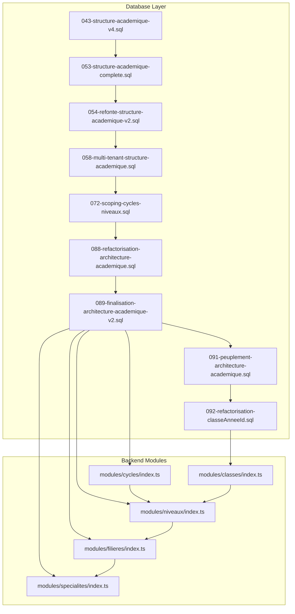
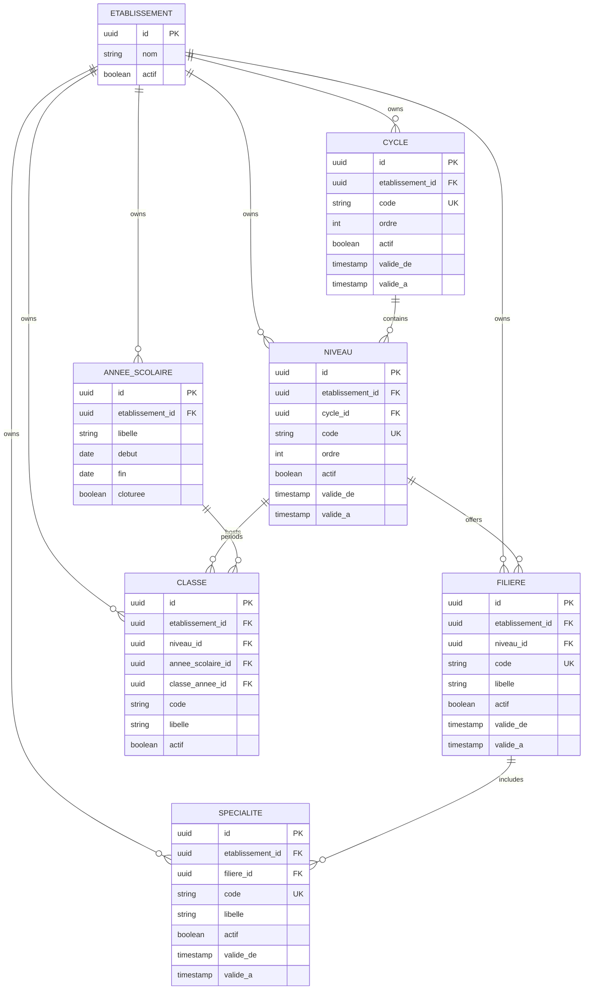
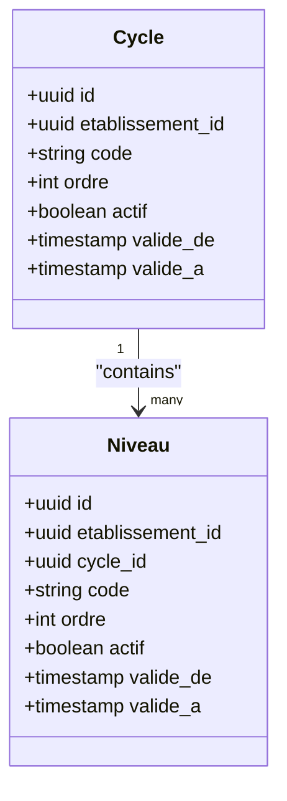
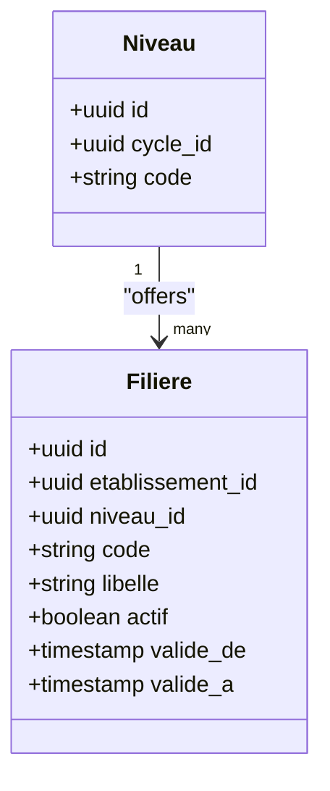
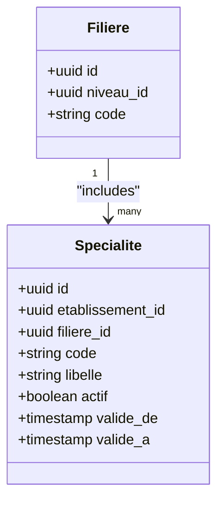
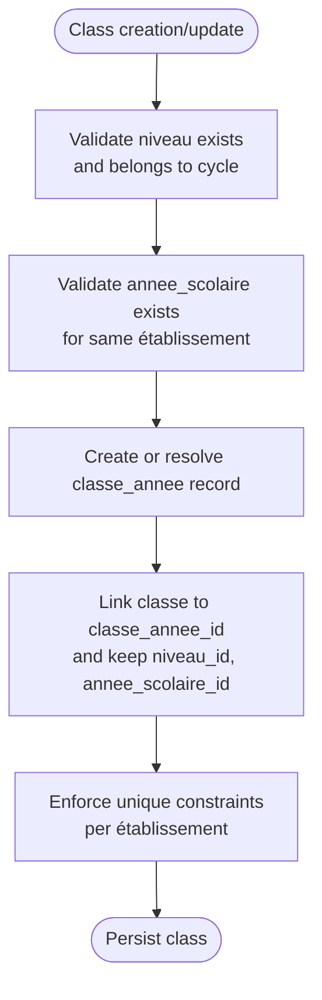
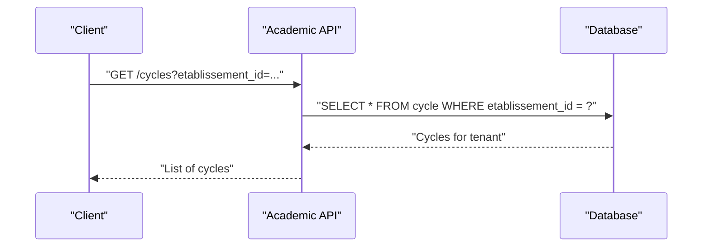
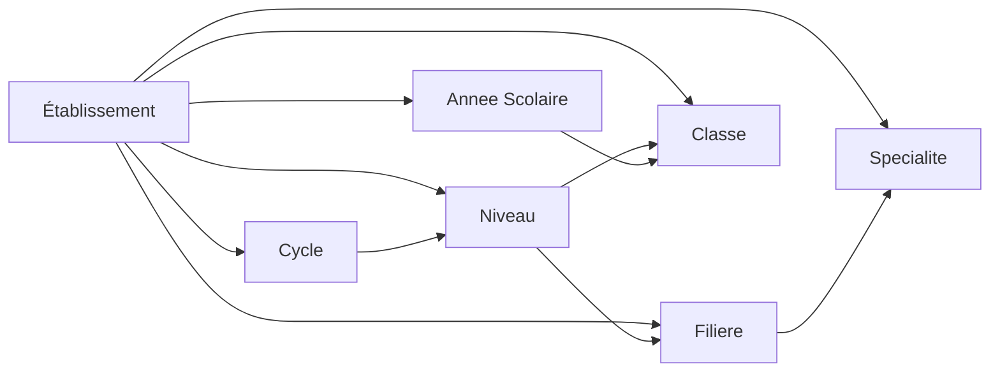

# Academic Hierarchy Structure

<cite>
**Referenced Files in This Document**
- [043-structure-academique-v4.sql](file://backend/database/migrations/043-structure-academique-v4.sql)
- [053-structure-academique-complete.sql](file://backend/database/migrations/053-structure-academique-complete.sql)
- [054-refonte-structure-academique-v2.sql](file://backend/database/migrations/054-refonte-structure-academique-v2.sql)
- [058-multi-tenant-structure-academique.sql](file://backend/database/migrations/058-multi-tenant-structure-academique.sql)
- [072-scoping-cycles-niveaux.sql](file://backend/database/migrations/072-scoping-cycles-niveaux.sql)
- [088-refactorisation-architecture-academique.sql](file://backend/database/migrations/088-refactorisation-architecture-academique.sql)
- [089-finalisation-architecture-academique-v2.sql](file://backend/database/migrations/089-finalisation-architecture-academique-v2.sql)
- [091-peuplement-architecture-academique.sql](file://backend/database/migrations/091-peuplement-architecture-academique.sql)
- [092-refactorisation-classeAnneeId.sql](file://backend/database/migrations/092-refactorisation-classeAnneeId.sql)
- [cycles/index.ts](file://backend/src/modules/cycles/index.ts)
- [niveaux/index.ts](file://backend/src/modules/niveaux/index.ts)
- [filieres/index.ts](file://backend/src/modules/filieres/index.ts)
- [specialites/index.ts](file://backend/src/modules/specialites/index.ts)
- [classes/index.ts](file://backend/src/modules/classes/index.ts)
</cite>

## Table of Contents
1. [Introduction](#introduction)
2. [Project Structure](#project-structure)
3. [Core Components](#core-components)
4. [Architecture Overview](#architecture-overview)
5. [Detailed Component Analysis](#detailed-component-analysis)
6. [Dependency Analysis](#dependency-analysis)
7. [Performance Considerations](#performance-considerations)
8. [Troubleshooting Guide](#troubleshooting-guide)
9. [Conclusion](#conclusion)
10. [Appendices](#appendices)

## Introduction
This document describes the academic hierarchy data model used by eLISAschool. It focuses on the Cycle entity as the top-level organizer of educational phases (primary, secondary, etc.), Niveau entities representing grade levels within cycles, Filiere entities for specialized tracks or streams at a level, and Specialite entities for subject specializations and elective options. It also documents the refactored architecture that improves class-year relationships and adds multi-tenant support, along with validation constraints that ensure hierarchy integrity. Finally, it provides examples of typical academic structures across different educational systems and cultural contexts.

## Project Structure
The academic hierarchy spans database migrations and backend modules:
- Migrations define the canonical schema evolution for cycles, niveaux, filieres, specialites, classes, and their relationships, including scoping to établissements (tenants).
- Backend modules expose services/controllers for each entity and integrate with the shared types and validators.

**Diagram sources**
- [043-structure-academique-v4.sql](file://backend/database/migrations/043-structure-academique-v4.sql)
- [053-structure-academique-complete.sql](file://backend/database/migrations/053-structure-academique-complete.sql)
- [054-refonte-structure-academique-v2.sql](file://backend/database/migrations/054-refonte-structure-academique-v2.sql)
- [058-multi-tenant-structure-academique.sql](file://backend/database/migrations/058-multi-tenant-structure-academique.sql)
- [072-scoping-cycles-niveaux.sql](file://backend/database/migrations/072-scoping-cycles-niveaux.sql)
- [088-refactorisation-architecture-academique.sql](file://backend/database/migrations/088-refactorisation-architecture-academique.sql)
- [089-finalisation-architecture-academique-v2.sql](file://backend/database/migrations/089-finalisation-architecture-academique-v2.sql)
- [091-peuplement-architecture-academique.sql](file://backend/database/migrations/091-peuplement-architecture-academique.sql)
- [092-refactorisation-classeAnneeId.sql](file://backend/database/migrations/092-refactorisation-classeAnneeId.sql)
- [cycles/index.ts](file://backend/src/modules/cycles/index.ts)
- [niveaux/index.ts](file://backend/src/modules/niveaux/index.ts)
- [filieres/index.ts](file://backend/src/modules/filieres/index.ts)
- [specialites/index.ts](file://backend/src/modules/specialites/index.ts)
- [classes/index.ts](file://backend/src/modules/classes/index.ts)

**Section sources**
- [043-structure-academique-v4.sql](file://backend/database/migrations/043-structure-academique-v4.sql)
- [053-structure-academique-complete.sql](file://backend/database/migrations/053-structure-academique-complete.sql)
- [054-refonte-structure-academique-v2.sql](file://backend/database/migrations/054-refonte-structure-academique-v2.sql)
- [058-multi-tenant-structure-academique.sql](file://backend/database/migrations/058-multi-tenant-structure-academique.sql)
- [072-scoping-cycles-niveaux.sql](file://backend/database/migrations/072-scoping-cycles-niveaux.sql)
- [088-refactorisation-architecture-academique.sql](file://backend/database/migrations/088-refactorisation-architecture-academique.sql)
- [089-finalisation-architecture-academique-v2.sql](file://backend/database/migrations/089-finalisation-architecture-academique-v2.sql)
- [091-peuplement-architecture-academique.sql](file://backend/database/migrations/091-peuplement-architecture-academique.sql)
- [092-refactorisation-classeAnneeId.sql](file://backend/database/migrations/092-refactorisation-classeAnneeId.sql)
- [cycles/index.ts](file://backend/src/modules/cycles/index.ts)
- [niveaux/index.ts](file://backend/src/modules/niveaux/index.ts)
- [filieres/index.ts](file://backend/src/modules/filieres/index.ts)
- [specialites/index.ts](file://backend/src/modules/specialites/index.ts)
- [classes/index.ts](file://backend/src/modules/classes/index.ts)

## Core Components
- Cycle: The highest-level organizational unit grouping educational phases (e.g., primary, lower secondary, upper secondary). Each cycle is scoped to an établissement (tenant).
- Niveau: Represents a specific grade level within a cycle (e.g., 6th grade, 10th grade). A niveau belongs to exactly one cycle and is tenant-scoped.
- Filiere: A specialized track or stream offered at a niveau (e.g., scientific, literary, technical). A filiere is associated with a niveau and is tenant-scoped.
- Specialite: Subject specializations or elective options available within a filiere. Multiple specialites can be attached to a filiere; they are tenant-scoped.
- Class-Year relationship: Classes are linked to a niveau and a school year via a refactored classYearId field, improving queryability and referential integrity.

Key properties typically include:
- Tenant isolation: établissement_id on all entities to enforce multi-tenancy.
- Ordering and status fields: order, isActive, validFrom/validTo for temporal validity.
- Descriptive metadata: code, label(s), description, optional external identifiers.

Validation constraints ensuring hierarchy integrity:
- Uniqueness per tenant: unique constraints on (établissement_id, code) for cycles, niveaux, filieres, and specialites.
- Parent-child references: foreign keys from niveau to cycle, filiere to niveau, specialite to filiere.
- Class-year linkage: classe.annee_scolaire_id and classe.niveau_id, plus the refactored classe.classe_annee_id to unify class-year associations.
- Temporal consistency: non-overlapping validity periods where applicable.

**Section sources**
- [053-structure-academique-complete.sql](file://backend/database/migrations/053-structure-academique-complete.sql)
- [054-refonte-structure-academique-v2.sql](file://backend/database/migrations/054-refonte-structure-academique-v2.sql)
- [058-multi-tenant-structure-academique.sql](file://backend/database/migrations/058-multi-tenant-structure-academique.sql)
- [072-scoping-cycles-niveaux.sql](file://backend/database/migrations/072-scoping-cycles-niveaux.sql)
- [088-refactorisation-architecture-academique.sql](file://backend/database/migrations/088-refactorisation-architecture-academique.sql)
- [089-finalisation-architecture-academique-v2.sql](file://backend/database/migrations/089-finalisation-architecture-academique-v2.sql)
- [092-refactorisation-classeAnneeId.sql](file://backend/database/migrations/092-refactorisation-classeAnneeId.sql)

## Architecture Overview
The final academic architecture emphasizes clear parent-child relationships, strict tenant scoping, and robust class-year association.

**Diagram sources**
- [053-structure-academique-complete.sql](file://backend/database/migrations/053-structure-academique-complete.sql)
- [054-refonte-structure-academique-v2.sql](file://backend/database/migrations/054-refonte-structure-academique-v2.sql)
- [058-multi-tenant-structure-academique.sql](file://backend/database/migrations/058-multi-tenant-structure-academique.sql)
- [072-scoping-cycles-niveaux.sql](file://backend/database/migrations/072-scoping-cycles-niveaux.sql)
- [088-refactorisation-architecture-academique.sql](file://backend/database/migrations/088-refactorisation-architecture-academique.sql)
- [089-finalisation-architecture-academique-v2.sql](file://backend/database/migrations/089-finalisation-architecture-academique-v2.sql)
- [092-refactorisation-classeAnneeId.sql](file://backend/database/migrations/092/refactorisation-classeAnneeId.sql)

## Detailed Component Analysis

### Cycle Entity
- Purpose: Top-level grouping of educational phases (e.g., Primary, Lower Secondary, Upper Secondary).
- Relationships: Owned by établissement; contains multiple niveaux.
- Constraints: Unique (établissement_id, code); active flag; optional validity window.
- Typical usage: Define the macro structure of schooling in a given country or system.

**Section sources**
- [053-structure-academique-complete.sql](file://backend/database/migrations/053-structure-academique-complete.sql)
- [054-refonte-structure-academique-v2.sql](file://backend/database/migrations/054-refonte-structure-academique-v2.sql)
- [058-multi-tenant-structure-academique.sql](file://backend/database/migrations/058-multi-tenant-structure-academique.sql)
- [072-scoping-cycles-niveaux.sql](file://backend/database/migrations/072-scoping-cycles-niveaux.sql)
- [089-finalisation-architecture-academique-v2.sql](file://backend/database/migrations/089-finalisation-architecture-academique-v2.sql)
- [cycles/index.ts](file://backend/src/modules/cycles/index.ts)

### Niveau Entity
- Purpose: Specific grade level within a cycle (e.g., 6th grade, 10th grade).
- Relationships: Belongs to exactly one cycle; hosts multiple classes; offers multiple filieres.
- Constraints: Unique (établissement_id, code); active flag; optional validity window; foreign key to cycle.
- Typical usage: Anchor student progression and scheduling.

**Diagram sources**
- [053-structure-academique-complete.sql](file://backend/database/migrations/053-structure-academique-complete.sql)
- [054-refonte-structure-academique-v2.sql](file://backend/database/migrations/054-refonte-structure-academique-v2.sql)
- [058-multi-tenant-structure-academique.sql](file://backend/database/migrations/058-multi-tenant-structure-academique.sql)
- [072-scoping-cycles-niveaux.sql](file://backend/database/migrations/072-scoping-cycles-niveaux.sql)
- [089-finalisation-architecture-academique-v2.sql](file://backend/database/migrations/089-finalisation-architecture-academique-v2.sql)
- [niveaux/index.ts](file://backend/src/modules/niveaux/index.ts)

**Section sources**
- [053-structure-academique-complete.sql](file://backend/database/migrations/053-structure-academique-complete.sql)
- [054-refonte-structure-academique-v2.sql](file://backend/database/migrations/054-refonte-structure-academique-v2.sql)
- [058-multi-tenant-structure-academique.sql](file://backend/database/migrations/058-multi-tenant-structure-academique.sql)
- [072-scoping-cycles-niveaux.sql](file://backend/database/migrations/072-scoping-cycles-niveaux.sql)
- [089-finalisation-architecture-academique-v2.sql](file://backend/database/migrations/089-finalisation-architecture-academique-v2.sql)
- [niveaux/index.ts](file://backend/src/modules/niveaux/index.ts)

### Filiere Entity
- Purpose: Specialized track or stream at a niveau (e.g., scientific, literary, technical).
- Relationships: Associated with a niveau; includes multiple specialites.
- Constraints: Unique (établissement_id, code); active flag; optional validity window; foreign key to niveau.
- Typical usage: Determine curriculum pathways and subject availability.

**Diagram sources**
- [053-structure-academique-complete.sql](file://backend/database/migrations/053-structure-academique-complete.sql)
- [054-refonte-structure-academique-v2.sql](file://backend/database/migrations/054-refonte-structure-academique-v2.sql)
- [058-multi-tenant-structure-academique.sql](file://backend/database/migrations/058-multi-tenant-structure-academique.sql)
- [089-finalisation-architecture-academique-v2.sql](file://backend/database/migrations/089-finalisation-architecture-academique-v2.sql)
- [filieres/index.ts](file://backend/src/modules/filieres/index.ts)

**Section sources**
- [053-structure-academique-complete.sql](file://backend/database/migrations/053-structure-academique-complete.sql)
- [054-refonte-structure-academique-v2.sql](file://backend/database/migrations/054-refonte-structure-academique-v2.sql)
- [058-multi-tenant-structure-academique.sql](file://backend/database/migrations/058-multi-tenant-structure-academique.sql)
- [089-finalisation-architecture-academique-v2.sql](file://backend/database/migrations/089-finalisation-architecture-academique-v2.sql)
- [filieres/index.ts](file://backend/src/modules/filieres/index.ts)

### Specialite Entity
- Purpose: Subject specializations or elective options within a filiere.
- Relationships: Belongs to a filiere; many-to-one with filiere.
- Constraints: Unique (établissement_id, code); active flag; optional validity window; foreign key to filiere.
- Typical usage: Enable flexible electives and specialization choices.

**Diagram sources**
- [053-structure-academique-complete.sql](file://backend/database/migrations/053-structure-academique-complete.sql)
- [054-refonte-structure-academique-v2.sql](file://backend/database/migrations/054-refonte-structure-academique-v2.sql)
- [058-multi-tenant-structure-academique.sql](file://backend/database/migrations/058-multi-tenant-structure-academique.sql)
- [089-finalisation-architecture-academique-v2.sql](file://backend/database/migrations/089-finalisation-architecture-academique-v2.sql)
- [specialites/index.ts](file://backend/src/modules/specialites/index.ts)

**Section sources**
- [053-structure-academique-complete.sql](file://backend/database/migrations/053-structure-academique-complete.sql)
- [054-refonte-structure-academique-v2.sql](file://backend/database/migrations/054-refonte-structure-academique-v2.sql)
- [058-multi-tenant-structure-academique.sql](file://backend/database/migrations/058-multi-tenant-structure-academique.sql)
- [089-finalisation-architecture-academique-v2.sql](file://backend/database/migrations/089-finalisation-architecture-academique-v2.sql)
- [specialites/index.ts](file://backend/src/modules/specialites/index.ts)

### Class-Year Relationship Refactoring
- Goal: Improve class-year associations by introducing a dedicated reference (classe_annee_id) alongside existing niveau and annee_scolaire links.
- Benefits: Simplifies queries for class schedules, timetables, and reporting; ensures referential integrity between classes and school years.
- Key changes:
  - Add classe.classe_annee_id referencing a class-year composite or table.
  - Maintain classe.niveau_id and classe.annee_scolaire_id for backward compatibility and clarity.
  - Enforce uniqueness and foreign keys to prevent orphaned records.

**Diagram sources**
- [088-refactorisation-architecture-academique.sql](file://backend/database/migrations/088-refactorisation-architecture-academique.sql)
- [089-finalisation-architecture-academique-v2.sql](file://backend/database/migrations/089-finalisation-architecture-academique-v2.sql)
- [092-refactorisation-classeAnneeId.sql](file://backend/database/migrations/092-refactorisation-classeAnneeId.sql)
- [classes/index.ts](file://backend/src/modules/classes/index.ts)

**Section sources**
- [088-refactorisation-architecture-academique.sql](file://backend/database/migrations/088-refactorisation-architecture-academique.sql)
- [089-finalisation-architecture-academique-v2.sql](file://backend/database/migrations/089-finalisation-architecture-academique-v2.sql)
- [092-refactorisation-classeAnneeId.sql](file://backend/database/migrations/092-refactorisation-classeAnneeId.sql)
- [classes/index.ts](file://backend/src/modules/classes/index.ts)

### Multi-Tenant Support
- All academic entities include établissement_id to isolate data per tenant.
- Unique constraints are defined per établissement to avoid cross-tenant collisions.
- Queries must always scope by établissement_id to maintain isolation.

**Diagram sources**
- [058-multi-tenant-structure-academique.sql](file://backend/database/migrations/058-multi-tenant-structure-academique.sql)
- [072-scoping-cycles-niveaux.sql](file://backend/database/migrations/072-scoping-cycles-niveaux.sql)

**Section sources**
- [058-multi-tenant-structure-academique.sql](file://backend/database/migrations/058-multi-tenant-structure-academique.sql)
- [072-scoping-cycles-niveaux.sql](file://backend/database/migrations/072-scoping-cycles-niveaux.sql)

## Dependency Analysis
The academic hierarchy exhibits a layered dependency pattern:
- Cycle depends only on établissement.
- Niveau depends on cycle and établissement.
- Filiere depends on niveau and établissement.
- Specialite depends on filiere and établissement.
- Classe depends on niveau, annee_scolaire, and classe_annee, all scoped to établissement.

**Diagram sources**
- [053-structure-academique-complete.sql](file://backend/database/migrations/053-structure-academique-complete.sql)
- [054-refonte-structure-academique-v2.sql](file://backend/database/migrations/054-refonte-structure-academique-v2.sql)
- [058-multi-tenant-structure-academique.sql](file://backend/database/migrations/058-multi-tenant-structure-academique.sql)
- [088-refactorisation-architecture-academique.sql](file://backend/database/migrations/088-refactorisation-architecture-academique.sql)
- [089-finalisation-architecture-academique-v2.sql](file://backend/database/migrations/089-finalisation-architecture-academique-v2.sql)
- [092-refactorisation-classeAnneeId.sql](file://backend/database/migrations/092-refactorisation-classeAnneeId.sql)

**Section sources**
- [053-structure-academique-complete.sql](file://backend/database/migrations/053-structure-academique-complete.sql)
- [054-refonte-structure-academique-v2.sql](file://backend/database/migrations/054-refonte-structure-academique-v2.sql)
- [058-multi-tenant-structure-academique.sql](file://backend/database/migrations/058-multi-tenant-structure-academique.sql)
- [088-refactorisation-architecture-academique.sql](file://backend/database/migrations/088-refactorisation-architecture-academique.sql)
- [089-finalisation-architecture-academique-v2.sql](file://backend/database/migrations/089-finalisation-architecture-academique-v2.sql)
- [092-refactorisation-classeAnneeId.sql](file://backend/database/migrations/092-refactorisation-classeAnneeId.sql)

## Performance Considerations
- Indexing: Ensure indexes on foreign keys (cycle_id, niveau_id, filiere_id, etablissement_id) and common query filters (code, actif, ordre).
- Scoping: Always filter by établissement_id to leverage indexes and reduce scan size.
- Class-year queries: Use classe_annee_id to optimize timetable and scheduling lookups.
- Validity windows: If querying active items, add predicates on valide_de/valide_a and cache results when appropriate.

[No sources needed since this section provides general guidance]

## Troubleshooting Guide
Common issues and resolutions:
- Duplicate codes across tenants: Verify unique constraints on (établissement_id, code) and ensure queries include établissement_id.
- Orphaned references: Confirm foreign keys exist for niveau->cycle, filiere->niveau, specialite->filiere, and classe->niveau/classe_annee.
- Invalid class-year link: Ensure classe.classe_annee_id points to a valid class-year record tied to the same établissement and annee_scolaire.
- Temporal conflicts: Check valide_de/valide_a ranges to avoid overlaps if business rules require non-overlapping validity.

**Section sources**
- [053-structure-academique-complete.sql](file://backend/database/migrations/053-structure-academique-complete.sql)
- [054-refonte-structure-academique-v2.sql](file://backend/database/migrations/054-refonte-structure-academique-v2.sql)
- [058-multi-tenant-structure-academique.sql](file://backend/database/migrations/058-multi-tenant-structure-academique.sql)
- [088-refactorisation-architecture-academique.sql](file://backend/database/migrations/088-refactorisation-architecture-academique.sql)
- [089-finalisation-architecture-academique-v2.sql](file://backend/database/migrations/089-finalisation-architecture-academique-v2.sql)
- [092-refactorisation-classeAnneeId.sql](file://backend/database/migrations/092-refactorisation-classeAnneeId.sql)

## Conclusion
The eLISAschool academic hierarchy is designed for clarity, scalability, and multi-tenant safety. Cycles organize educational phases, niveaux represent grades, filieres define tracks, and specialites enable subject-level customization. The refactored class-year relationship strengthens scheduling and reporting capabilities. Strict constraints and scoping ensure data integrity and isolation across tenants.

[No sources needed since this section summarizes without analyzing specific files]

## Appendices

### Examples of Typical Academic Structures
- France-like system:
  - Cycle: Primary, Lower Secondary, Upper Secondary
  - Niveau: CE1–CM2 (Primary), 6ème–3ème (Lower Secondary), 2nde–Terminale (Upper Secondary)
  - Filiere: Générale, Technologique, Professionnelle
  - Specialite: Mathématiques, Physique-Chimie, Littérature, Économie
- Cameroon-like system:
  - Cycle: Primaire, Secondaire (Collège, Lycée)
  - Niveau: 6ème–3ème (Collège), Seconde–Terminale (Lycée)
  - Filiere: Scientifique, Lettres, Économique et Sociale
  - Specialite: Biologie, Histoire-Géographie, Informatique
- US-like system:
  - Cycle: Elementary, Middle School, High School
  - Niveau: Grades 1–5, 6–8, 9–12
  - Filiere: General Education, Advanced Placement Tracks
  - Specialite: Calculus, Biology, Computer Science, Art History

[No sources needed since this section provides conceptual examples]