# Academic Schema

<cite>
**Referenced Files in This Document**
- [043-structure-academique-v4.sql](file://backend/database/migrations/043-structure-academique-v4.sql)
- [053-structure-academique-complete.sql](file://backend/database/migrations/053-structure-academique-complete.sql)
- [054-refonte-structure-academique-v2.sql](file://backend/database/migrations/054-refonte-structure-academique-v2.sql)
- [058-multi-tenant-structure-academique.sql](file://backend/database/migrations/058-multi-tenant-structure-academique.sql)
- [088-refactorisation-architecture-academique.sql](file://backend/database/migrations/088-refactorisation-architecture-academique.sql)
- [089-finalisation-architecture-academique-v2.sql](file://backend/database/migrations/089-finalisation-architecture-academique-v2.sql)
- [091-peuplement-architecture-academique.sql](file://backend/database/migrations/091-peuplement-architecture-academique.sql)
- [092-refactorisation-classeAnneeId.sql](file://backend/database/migrations/092-refactorisation-classeAnneeId.sql)
- [100-classes-salle-principale.sql](file://backend/database/migrations/100-classes-salle-principale.sql)
- [101-normalisation-annee-scolaire-cloture.sql](file://backend/database/migrations/101-normalisation-annee-scolaire-cloture.sql)
- [102-periodes-hierarchie.sql](file://backend/database/migrations/102-periodes-hierarchie.sql)
- [103-templates-periode-personnalisables.sql](file://backend/database/migrations/103-templates-periode-personnalisables.sql)
- [104-refonte-periodes-niveaux-configurables.sql](file://backend/database/migrations/104-refonte-periodes-niveaux-configurables.sql)
- [059-ajouter-affectation-matiere-sous-systeme.sql](file://backend/database/migrations/059-ajouter-affectation-matiere-sous-systeme.sql)
- [060-ajouter-affectation-matiere-coefficient.sql](file://backend/database/migrations/060-ajouter-affectation-matiere-coefficient.sql)
- [061-creer-table-bulletins-matieres.sql](file://backend/database/migrations/061-creer-table-bulletins-matieres.sql)
- [062-creer-table-evaluations-competences.sql](file://backend/database/migrations/062-creer-table-evaluations-competences.sql)
- [063-creer-module-emploi-du-temps.sql](file://backend/database/migrations/063-creer-module-emploi-du-temps.sql)
- [070-module-salles.sql](file://backend/database/migrations/070-module-salles.sql)
- [072-scoping-cycles-niveaux.sql](file://backend/database/migrations/072-scoping-cycles-niveaux.sql)
- [073-competence-unique-composite.sql](file://backend/database/migrations/073-competence-unique-composite.sql)
- [074-matiere-niveau-unique-composite.sql](file://backend/database/migrations/074-matiere-niveau-unique-composite.sql)
- [106-rename-sequence-to-evaluation.sql](file://backend/database/migrations/106-rename-sequence-to-evaluation.sql)
- [113-fix-unique-constraints-nomenclatures.sql](file://backend/database/migrations/113-fix-unique-constraints-nomenclatures.sql)
- [114-fusion-creneaux-horaires.sql](file://backend/database/migrations/114-fusion-creneaux-horaires.sql)
- [114-normalisation-echelons-structurels.sql](file://backend/database/migrations/114-normalisation-echelons-structurels.sql)
- [115-supprimer-config-matiere-classe.sql](file://backend/database/migrations/115-supprimer-config-matiere-classe.sql)
- [116-programme-intemporel.sql](file://backend/database/migrations/116-programme-intemporel.sql)
- [117-heure-cours-classe-annee.sql](file://backend/database/migrations/117-heure-cours-classe-annee.sql)
- [118-preferences-edt-enrichi.sql](file://backend/database/migrations/118-preferences-edt-enrichi.sql)
- [eleves/entities/Eleve.entity.ts](file://backend/src/modules/eleves/entities/Eleve.entity.ts)
- [responsables-eleves/entities/ResponsableEleve.entity.ts](file://backend/src/modules/responsables-eleves/entities/ResponsableEleve.entity.ts)
- [cycles/entities/Cycle.entity.ts](file://backend/src/modules/cycles/entities/Cycle.entity.ts)
- [niveaux/entities/Niveau.entity.ts](file://backend/src/modules/niveaux/entities/Niveau.entity.ts)
- [filieres/entities/Filiere.entity.ts](file://backend/src/modules/filieres/entities/Filiere.entity.ts)
- [classes/entities/Classe.entity.ts](file://backend/src/modules/classes/entities/Classe.entity.ts)
- [matieres/entities/Matiere.entity.ts](file://backend/src/modules/matieres/entities/Matiere.entity.ts)
- [bulletins/entities/Bulletin.entity.ts](file://backend/src/modules/bulletins/entities/Bulletin.entity.ts)
- [notes/entities/Note.entity.ts](file://backend/src/modules/notes/entities/Note.entity.ts)
- [competences/entities/Competence.entity.ts](file://backend/src/modules/competences/entities/Competence.entity.ts)
- [emploi-du-temps/entities/PlanningSession.entity.ts](file://backend/src/modules/emploi-du-temps/entities/PlanningSession.entity.ts)
- [salles/entities/Salle.entity.ts](file://backend/src/modules/salles/entities/Salle.entity.ts)
- [annees-scolaires/entities/AnneeScolaire.entity.ts](file://backend/src/modules/annees-scolaires/entities/AnneeScolaire.entity.ts)
- [diplomes-eleves/entities/DiplomeEleve.entity.ts](file://backend/src/modules/diplomes-eleves/entities/DiplomeEleve.entity.ts)
- [examens-nationaux/entities/ExamenNational.entity.ts](file://backend/src/modules/examens-nationaux/entities/ExamenNational.entity.ts)
</cite>

## Update Summary
**Changes Made**
- Added documentation for seven new database migrations (113-118) that significantly restructured the academic schema
- Updated Timetable Scheduling section to reflect hour fusion and enhanced preferences
- Added Program Versioning support documentation with timeless program management
- Enhanced Echelon normalization documentation for structural improvements
- Updated Configuration removal documentation showing cleanup of material-class configuration
- Revised Timetable Hour Fusion documentation with improved scheduling efficiency

## Table of Contents
1. [Introduction](#introduction)
2. [Project Structure](#project-structure)
3. [Core Components](#core-components)
4. [Architecture Overview](#architecture-overview)
5. [Detailed Component Analysis](#detailed-component-analysis)
6. [Recent Schema Enhancements](#recent-schema-enhancements)
7. [Dependency Analysis](#dependency-analysis)
8. [Performance Considerations](#performance-considerations)
9. [Troubleshooting Guide](#troubleshooting-guide)
10. [Conclusion](#conclusion)
11. [Appendices](#appendices)

## Introduction
This document provides a comprehensive data model for eLISAschool's academic management system. It covers the complete educational hierarchy (cycles, levels, classes), student enrollment and profile management, subject and teacher assignment, competency-based assessment with evaluation criteria and scoring, timetable scheduling with room allocation and conflict resolution, report card generation, exam management, diploma tracking, and academic calendar entities. The documentation is grounded in the repository's database migrations and entity definitions to ensure accuracy and traceability. Recent enhancements include timetable optimization, echelon normalization, configuration cleanup, and program versioning support through seven major schema restructuring migrations.

## Project Structure
The academic schema spans multiple modules and migrations:
- Academic hierarchy: cycles, levels, streams, classes
- Students and guardians: enrollment, profiles, relationships
- Subjects and assignments: subjects, coefficients, teacher assignments
- Assessment and grading: evaluations, competencies, notes, bulletins
- Scheduling: sessions, rooms, conflicts with enhanced hour fusion
- Calendar and periods: school years, periods, templates
- Exams and diplomas: national exams, diplomas per student
- Multi-tenant scoping: establishment-level isolation
- Program versioning: timeless program management and echelon normalization

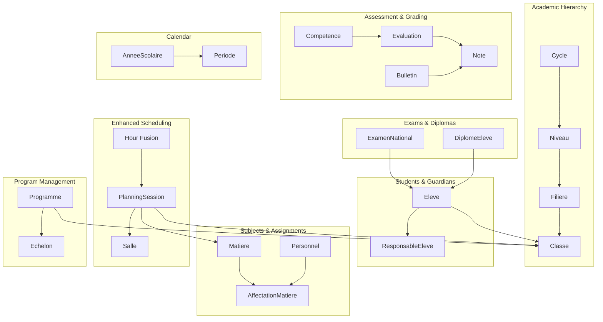

[No sources needed since this diagram shows conceptual workflow, not actual code structure]

## Core Components
- Academic hierarchy: Cycles contain Levels; Levels may have Streams; Streams organize Classes.
- Student lifecycle: Enrollment into a Class within an academic year; Guardian associations for contact and consent.
- Subject management: Subjects scoped by Level or Stream; Teacher assignments with coefficients for weighting.
- Assessment model: Competency-based evaluations linked to subjects and periods; Notes recorded per student per evaluation; Bulletins aggregate results.
- Enhanced scheduling: Sessions assigned to Classes, Subjects, Rooms, and Teachers with conflict checks and optimized hour fusion.
- Program versioning: Timeless programs with echelon normalization for better curriculum management.
- Calendar: School Years define Periods; Periods can be templated and configured per Level.
- Exams and Diplomas: National exams associated with students; Diplomas issued upon completion.

**Section sources**
- [053-structure-academique-complete.sql](file://backend/database/migrations/053-structure-academique-complete.sql)
- [054-refonte-structure-academique-v2.sql](file://backend/database/migrations/054-refonte-structure-academique-v2.sql)
- [058-multi-tenant-structure-academique.sql](file://backend/database/migrations/058-multi-tenant-structure-academique.sql)
- [088-refactorisation-architecture-academique.sql](file://backend/database/migrations/088-refactorisation-architecture-academique.sql)
- [089-finalisation-architecture-academique-v2.sql](file://backend/database/migrations/089-finalisation-architecture-academique-v2.sql)
- [091-peuplement-architecture-academique.sql](file://backend/database/migrations/091-peuplement-architecture-academique.sql)
- [092-refactorisation-classeAnneeId.sql](file://backend/database/migrations/092-refactorisation-classeAnneeId.sql)
- [100-classes-salle-principale.sql](file://backend/database/migrations/100-classes-salle-principale.sql)
- [101-normalisation-annee-scolaire-cloture.sql](file://backend/database/migrations/101-normalisation-annee-scolaire-cloture.sql)
- [102-periodes-hierarchie.sql](file://backend/database/migrations/102-periodes-hierarchie.sql)
- [103-templates-periode-personnalisables.sql](file://backend/database/migrations/103-templates-periode-personnalisables.sql)
- [104-refonte-periodes-niveaux-configurables.sql](file://backend/database/migrations/104-refonte-periodes-niveaux-configurables.sql)
- [059-ajouter-affectation-matiere-sous-systeme.sql](file://backend/database/migrations/059-ajouter-affectation-matiere-sous-systeme.sql)
- [060-ajouter-affectation-matiere-coefficient.sql](file://backend/database/migrations/060-ajouter-affectation-matiere-coefficient.sql)
- [061-creer-table-bulletins-matieres.sql](file://backend/database/migrations/061-creer-table-bulletins-matieres.sql)
- [062-creer-table-evaluations-competences.sql](file://backend/database/migrations/062-creer-table-evaluations-competences.sql)
- [063-creer-module-emploi-du-temps.sql](file://backend/database/migrations/063-creer-module-emploi-du-temps.sql)
- [070-module-salles.sql](file://backend/database/migrations/070-module-salles.sql)
- [072-scoping-cycles-niveaux.sql](file://backend/database/migrations/072-scoping-cycles-niveaux.sql)
- [073-competence-unique-composite.sql](file://backend/database/migrations/073-competence-unique-composite.sql)
- [074-matiere-niveau-unique-composite.sql](file://backend/database/migrations/074-matiere-niveau-unique-composite.sql)
- [106-rename-sequence-to-evaluation.sql](file://backend/database/migrations/106-rename-sequence-to-evaluation.sql)
- [113-fix-unique-constraints-nomenclatures.sql](file://backend/database/migrations/113-fix-unique-constraints-nomenclatures.sql)
- [114-fusion-creneaux-horaires.sql](file://backend/database/migrations/114-fusion-creneaux-horaires.sql)
- [114-normalisation-echelons-structurels.sql](file://backend/database/migrations/114-normalisation-echelons-structurels.sql)
- [115-supprimer-config-matiere-classe.sql](file://backend/database/migrations/115-supprimer-config-matiere-classe.sql)
- [116-programme-intemporel.sql](file://backend/database/migrations/116-programme-intemporel.sql)
- [117-heure-cours-classe-annee.sql](file://backend/database/migrations/117-heure-cours-classe-annee.sql)
- [118-preferences-edt-enrichi.sql](file://backend/database/migrations/118-preferences-edt-enrichi.sql)

## Architecture Overview
The academic architecture is multi-tenant and hierarchical with recent enhancements for improved scheduling efficiency and program management:
- Establishment-scoped entities ensure isolation across institutions.
- Hierarchical organization from Cycles down to Classes supports curriculum structuring.
- Assessment and scheduling are period-aware and tied to academic calendars.
- Report cards aggregate evaluations and notes per period and class.
- Enhanced timetable system with hour fusion and enriched preferences.
- Program versioning support with timeless program management and echelon normalization.

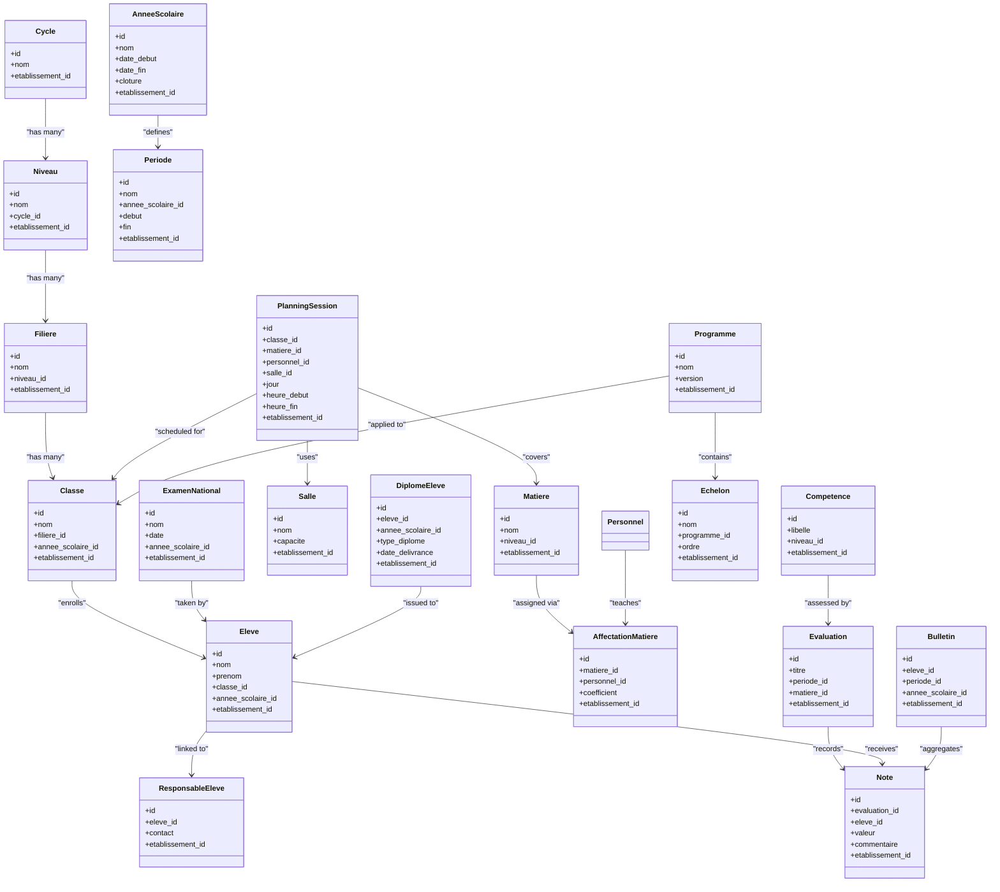

**Diagram sources**
- [053-structure-academique-complete.sql](file://backend/database/migrations/053-structure-academique-complete.sql)
- [054-refonte-structure-academique-v2.sql](file://backend/database/migrations/054-refonte-structure-academique-v2.sql)
- [058-multi-tenant-structure-academique.sql](file://backend/database/migrations/058-multi-tenant-structure-academique.sql)
- [088-refactorisation-architecture-academique.sql](file://backend/database/migrations/088-refactorisation-architecture-academique.sql)
- [089-finalisation-architecture-academique-v2.sql](file://backend/database/migrations/089-finalisation-architecture-academique-v2.sql)
- [091-peuplement-architecture-academique.sql](file://backend/database/migrations/091-peuplement-architecture-academique.sql)
- [092-refactorisation-classeAnneeId.sql](file://backend/database/migrations/092-refactorisation-classeAnneeId.sql)
- [100-classes-salle-principale.sql](file://backend/database/migrations/100-classes-salle-principale.sql)
- [101-normalisation-annee-scolaire-cloture.sql](file://backend/database/migrations/101-normalisation-annee-scolaire-cloture.sql)
- [102-periodes-hierarchie.sql](file://backend/database/migrations/102-periodes-hierarchie.sql)
- [103-templates-periode-personnalisables.sql](file://backend/database/migrations/103-templates-periode-personnalisables.sql)
- [104-refonte-periodes-niveaux-configurables.sql](file://backend/database/migrations/104-refonte-periodes-niveaux-configurables.sql)
- [059-ajouter-affectation-matiere-sous-systeme.sql](file://backend/database/migrations/059-ajouter-affectation-matiere-sous-systeme.sql)
- [060-ajouter-affectation-matiere-coefficient.sql](file://backend/database/migrations/060-ajouter-affectation-matiere-coefficient.sql)
- [061-creer-table-bulletins-matieres.sql](file://backend/database/migrations/061-creer-table-bulletins-matieres.sql)
- [062-creer-table-evaluations-competences.sql](file://backend/database/migrations/062-creer-table-evaluations-competences.sql)
- [063-creer-module-emploi-du-temps.sql](file://backend/database/migrations/063-creer-module-emploi-du-temps.sql)
- [070-module-salles.sql](file://backend/database/migrations/070-module-salles.sql)
- [072-scoping-cycles-niveaux.sql](file://backend/database/migrations/072-scoping-cycles-niveaux.sql)
- [073-competence-unique-composite.sql](file://backend/database/migrations/073-competence-unique-composite.sql)
- [074-matiere-niveau-unique-composite.sql](file://backend/database/migrations/074-matiere-niveau-unique-composite.sql)
- [106-rename-sequence-to-evaluation.sql](file://backend/database/migrations/106-rename-sequence-to-evaluation.sql)
- [114-normalisation-echelons-structurels.sql](file://backend/database/migrations/114-normalisation-echelons-structurels.sql)
- [116-programme-intemporel.sql](file://backend/database/migrations/116-programme-intemporel.sql)

## Detailed Component Analysis

### Academic Hierarchy: Cycles, Levels, Streams, Classes
- Cycles group Levels; Levels may define Streams; Streams organize Classes.
- Multi-tenant scoping ensures each entity belongs to an establishment.
- Class-year linkage ties enrollment to a specific academic year.

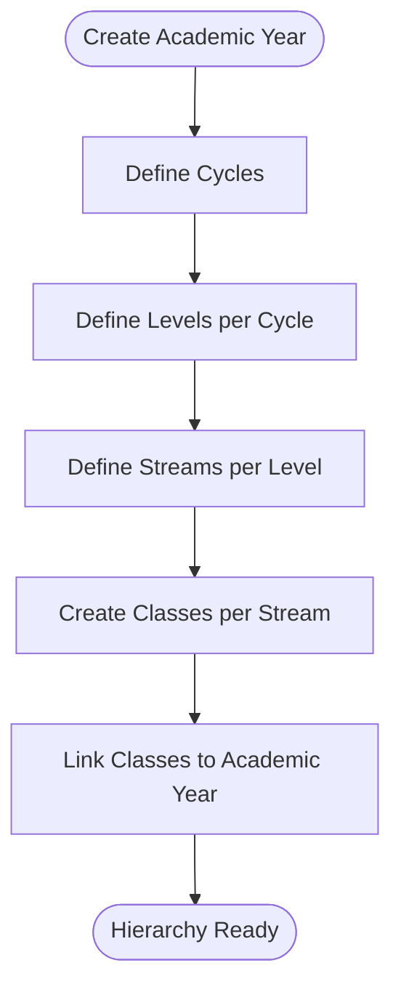

**Diagram sources**
- [053-structure-academique-complete.sql](file://backend/database/migrations/053-structure-academique-complete.sql)
- [054-refonte-structure-academique-v2.sql](file://backend/database/migrations/054-refonte-structure-academique-v2.sql)
- [072-scoping-cycles-niveaux.sql](file://backend/database/migrations/072-scoping-cycles-niveaux.sql)
- [092-refactorisation-classeAnneeId.sql](file://backend/database/migrations/092-refactorisation-classeAnneeId.sql)

**Section sources**
- [053-structure-academique-complete.sql](file://backend/database/migrations/053-structure-academique-complete.sql)
- [054-refonte-structure-academique-v2.sql](file://backend/database/migrations/054-refonte-structure-academique-v2.sql)
- [072-scoping-cycles-niveaux.sql](file://backend/database/migrations/072-scoping-cycles-niveaux.sql)
- [092-refactorisation-classeAnneeId.sql](file://backend/database/migrations/092-refactorisation-classeAnneeId.sql)

### Student Information System: Enrollment, Profiles, Guardians
- Students are enrolled in a Class within an Academic Year.
- Guardians link to Students for contact and consent management.
- Profile fields support additional demographic and administrative data.

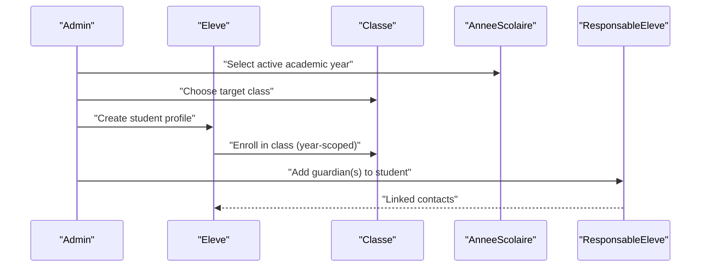

**Diagram sources**
- [eleves/entities/Eleve.entity.ts](file://backend/src/modules/eleves/entities/Eleve.entity.ts)
- [responsables-eleves/entities/ResponsableEleve.entity.ts](file://backend/src/modules/responsables-eleves/entities/ResponsableEleve.entity.ts)
- [classes/entities/Classe.entity.ts](file://backend/src/modules/classes/entities/Classe.entity.ts)
- [annees-scolaires/entities/AnneeScolaire.entity.ts](file://backend/src/modules/annees-scolaires/entities/AnneeScolaire.entity.ts)

**Section sources**
- [eleves/entities/Eleve.entity.ts](file://backend/src/modules/eleves/entities/Eleve.entity.ts)
- [responsables-eleves/entities/ResponsableEleve.entity.ts](file://backend/src/modules/responsables-eleves/entities/ResponsableEleve.entity.ts)
- [classes/entities/Classe.entity.ts](file://backend/src/modules/classes/entities/Classe.entity.ts)
- [annees-scolaires/entities/AnneeScolaire.entity.ts](file://backend/src/modules/annees-scolaires/entities/AnneeScolaire.entity.ts)

### Subject Management and Teacher Assignments
- Subjects are defined at Level scope and can be assigned to teachers with coefficients.
- Coefficients influence grade calculations and report card weights.
- Assignment records tie personnel to subjects for scheduling and grading.

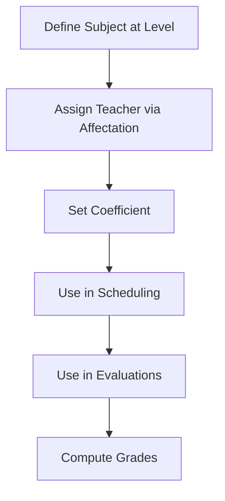

**Diagram sources**
- [059-ajouter-affectation-matiere-sous-systeme.sql](file://backend/database/migrations/059-ajouter-affectation-matiere-sous-systeme.sql)
- [060-ajouter-affectation-matiere-coefficient.sql](file://backend/database/migrations/060-ajouter-affectation-matiere-coefficient.sql)
- [matieres/entities/Matiere.entity.ts](file://backend/src/modules/matieres/entities/Matiere.entity.ts)

**Section sources**
- [059-ajouter-affectation-matiere-sous-systeme.sql](file://backend/database/migrations/059-ajouter-affectation-matiere-sous-systeme.sql)
- [060-ajouter-affectation-matiere-coefficient.sql](file://backend/database/migrations/060-ajouter-affectation-matiere-coefficient.sql)
- [matieres/entities/Matiere.entity.ts](file://backend/src/modules/matieres/entities/Matiere.entity.ts)

### Competency-Based Assessment Model
- Competencies are defined per Level and assessed through Evaluations.
- Evaluations record student performance via Notes.
- Unique constraints ensure consistent competency definitions.

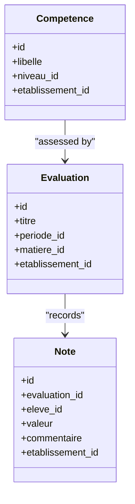

**Diagram sources**
- [062-creer-table-evaluations-competences.sql](file://backend/database/migrations/062-creer-table-evaluations-competences.sql)
- [073-competence-unique-composite.sql](file://backend/database/migrations/073-competence-unique-composite.sql)
- [106-rename-sequence-to-evaluation.sql](file://backend/database/migrations/106-rename-sequence-to-evaluation.sql)
- [competences/entities/Competence.entity.ts](file://backend/src/modules/competences/entities/Competence.entity.ts)
- [notes/entities/Note.entity.ts](file://backend/src/modules/notes/entities/Note.entity.ts)

**Section sources**
- [062-creer-table-evaluations-competences.sql](file://backend/database/migrations/062-creer-table-evaluations-competences.sql)
- [073-competence-unique-composite.sql](file://backend/database/migrations/073-competence-unique-composite.sql)
- [106-rename-sequence-to-evaluation.sql](file://backend/database/migrations/106-rename-sequence-to-evaluation.sql)
- [competences/entities/Competence.entity.ts](file://backend/src/modules/competences/entities/Competence.entity.ts)
- [notes/entities/Note.entity.ts](file://backend/src/modules/notes/entities/Note.entity.ts)

### Enhanced Timetable Scheduling and Room Allocation
- Sessions are scheduled for Classes, Subjects, and Teachers in Rooms with optimized hour fusion.
- Conflict resolution prevents double-booking of Rooms, Teachers, and Classes.
- Primary room association per Class aids default allocation.
- Enhanced preferences system provides detailed scheduling customization.

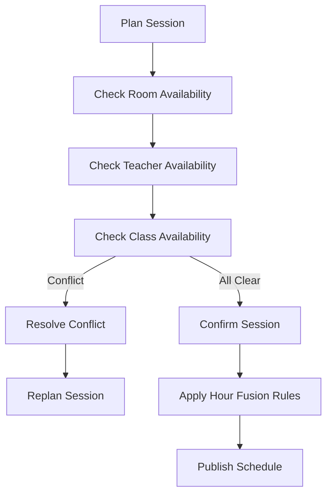

**Updated** Enhanced with hour fusion capabilities and enriched preferences system for improved scheduling efficiency.

**Diagram sources**
- [063-creer-module-emploi-du-temps.sql](file://backend/database/migrations/063-creer-module-emploi-du-temps.sql)
- [070-module-salles.sql](file://backend/database/migrations/070-module-salles.sql)
- [100-classes-salle-principale.sql](file://backend/database/migrations/100-classes-salle-principale.sql)
- [114-fusion-creneaux-horaires.sql](file://backend/database/migrations/114-fusion-creneaux-horaires.sql)
- [117-heure-cours-classe-annee.sql](file://backend/database/migrations/117-heure-cours-classe-annee.sql)
- [118-preferences-edt-enrichi.sql](file://backend/database/migrations/118-preferences-edt-enrichi.sql)
- [emploi-du-temps/entities/PlanningSession.entity.ts](file://backend/src/modules/emploi-du-temps/entities/PlanningSession.entity.ts)
- [salles/entities/Salle.entity.ts](file://backend/src/modules/salles/entities/Salle.entity.ts)

**Section sources**
- [063-creer-module-emploi-du-temps.sql](file://backend/database/migrations/063-creer-module-emploi-du-temps.sql)
- [070-module-salles.sql](file://backend/database/migrations/070-module-salles.sql)
- [100-classes-salle-principale.sql](file://backend/database/migrations/100-classes-salle-principale.sql)
- [114-fusion-creneaux-horaires.sql](file://backend/database/migrations/114-fusion-creneaux-horaires.sql)
- [117-heure-cours-classe-annee.sql](file://backend/database/migrations/117-heure-cours-classe-annee.sql)
- [118-preferences-edt-enrichi.sql](file://backend/database/migrations/118-preferences-edt-enrichi.sql)
- [emploi-du-temps/entities/PlanningSession.entity.ts](file://backend/src/modules/emploi-du-temps/entities/PlanningSession.entity.ts)
- [salles/entities/Salle.entity.ts](file://backend/src/modules/salles/entities/Salle.entity.ts)

### Academic Calendar: School Years and Periods
- School Years define start/end dates and closure status.
- Periods are scoped to School Years and can be templated/configured per Level.
- Templates enable standardized period structures across Levels.

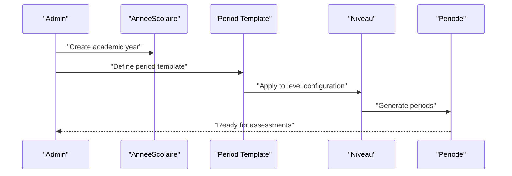

**Diagram sources**
- [101-normalisation-annee-scolaire-cloture.sql](file://backend/database/migrations/101-normalisation-annee-scolaire-cloture.sql)
- [102-periodes-hierarchie.sql](file://backend/database/migrations/102-periodes-hierarchie.sql)
- [103-templates-periode-personnalisables.sql](file://backend/database/migrations/103-templates-periode-personnalisables.sql)
- [104-refonte-periodes-niveaux-configurables.sql](file://backend/database/migrations/104-refonte-periodes-niveaux-configurables.sql)
- [annees-scolaires/entities/AnneeScolaire.entity.ts](file://backend/src/modules/annees-scolaires/entities/AnneeScolaire.entity.ts)

**Section sources**
- [101-normalisation-annee-scolaire-cloture.sql](file://backend/database/migrations/101-normalisation-annee-scolaire-cloture.sql)
- [102-periodes-hierarchie.sql](file://backend/database/migrations/102-periodes-hierarchie.sql)
- [103-templates-periode-personnalisables.sql](file://backend/database/migrations/103-templates-periode-personnalisables.sql)
- [104-refonte-periodes-niveaux-configurables.sql](file://backend/database/migrations/104-refonte-periodes-niveaux-configurables.sql)
- [annees-scolaires/entities/AnneeScolaire.entity.ts](file://backend/src/modules/annees-scolaires/entities/AnneeScolaire.entity.ts)

### Report Card Generation and Grade Calculations
- Bulletins aggregate Notes per student per period/year.
- Subject-specific bulletin entries allow detailed breakdowns.
- Coefficients from subject assignments influence weighted averages.

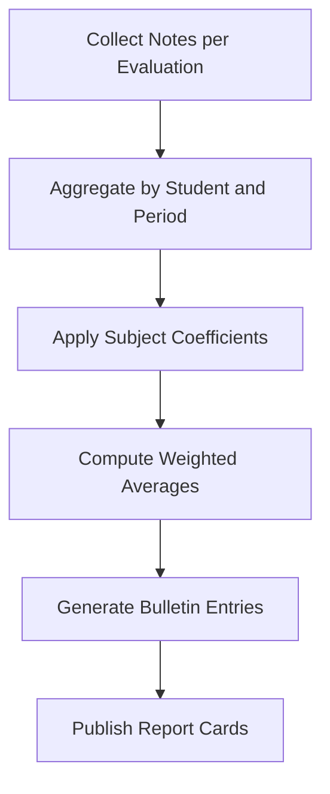

**Diagram sources**
- [061-creer-table-bulletins-matieres.sql](file://backend/database/migrations/061-creer-table-bulletins-matieres.sql)
- [bulletins/entities/Bulletin.entity.ts](file://backend/src/modules/bulletins/entities/Bulletin.entity.ts)
- [notes/entities/Note.entity.ts](file://backend/src/modules/notes/entities/Note.entity.ts)
- [060-ajouter-affectation-matiere-coefficient.sql](file://backend/database/migrations/060-ajouter-affectation-matiere-coefficient.sql)

**Section sources**
- [061-creer-table-bulletins-matieres.sql](file://backend/database/migrations/061-creer-table-bulletins-matieres.sql)
- [bulletins/entities/Bulletin.entity.ts](file://backend/src/modules/bulletins/entities/Bulletin.entity.ts)
- [notes/entities/Note.entity.ts](file://backend/src/modules/notes/entities/Note.entity.ts)
- [060-ajouter-affectation-matiere-coefficient.sql](file://backend/database/migrations/060-ajouter-affectation-matiere-coefficient.sql)

### Exam Management and Diploma Tracking
- National Exams are associated with Students and Academic Years.
- Diplomas are issued to Students upon completion, capturing type and issuance date.
- These entities support certification workflows and transcript generation.

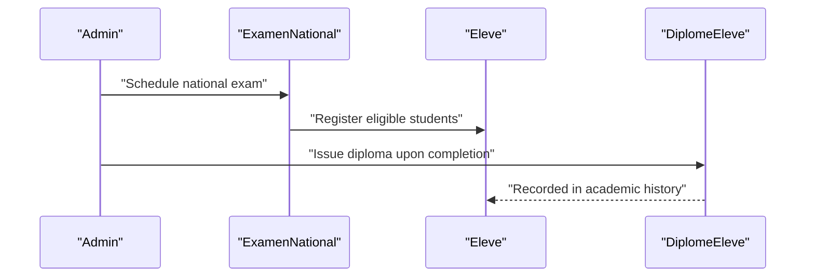

**Diagram sources**
- [examens-nationaux/entities/ExamenNational.entity.ts](file://backend/src/modules/examens-nationaux/entities/ExamenNational.entity.ts)
- [diplomes-eleves/entities/DiplomeEleve.entity.ts](file://backend/src/modules/diplomes-eleves/entities/DiplomeEleve.entity.ts)
- [eleves/entities/Eleve.entity.ts](file://backend/src/modules/eleves/entities/Eleve.entity.ts)

**Section sources**
- [examens-nationaux/entities/ExamenNational.entity.ts](file://backend/src/modules/examens-nationaux/entities/ExamenNational.entity.ts)
- [diplomes-eleves/entities/DiplomeEleve.entity.ts](file://backend/src/modules/diplomes-eleves/entities/DiplomeEleve.entity.ts)
- [eleves/entities/Eleve.entity.ts](file://backend/src/modules/eleves/entities/Eleve.entity.ts)

## Recent Schema Enhancements

### Timetable Hour Fusion Optimization
The latest schema includes significant improvements to timetable scheduling through hour fusion capabilities. This enhancement allows for more efficient time slot management and reduces scheduling conflicts.

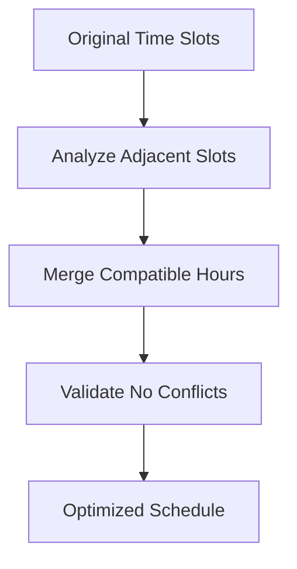

**Diagram sources**
- [114-fusion-creneaux-horaires.sql](file://backend/database/migrations/114-fusion-creneaux-horaires.sql)
- [117-heure-cours-classe-annee.sql](file://backend/database/migrations/117-heure-cours-classe-annee.sql)

**Section sources**
- [114-fusion-creneaux-horaires.sql](file://backend/database/migrations/114-fusion-creneaux-horaires.sql)
- [117-heure-cours-classe-annee.sql](file://backend/database/migrations/117-heure-cours-classe-annee.sql)

### Echelon Normalization and Structural Improvements
Structural normalization of echelons provides better organization and management of academic levels within programs. This change improves data consistency and reduces redundancy.

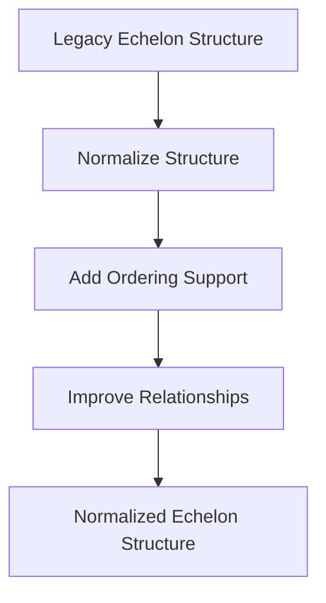

**Diagram sources**
- [114-normalisation-echelons-structurels.sql](file://backend/database/migrations/114-normalisation-echelons-structurels.sql)

**Section sources**
- [114-normalisation-echelons-structurels.sql](file://backend/database/migrations/114-normalisation-echelons-structurels.sql)

### Configuration Cleanup and Material-Class Separation
Removal of redundant configuration tables and separation of material-class relationships improves database efficiency and maintains cleaner data architecture.

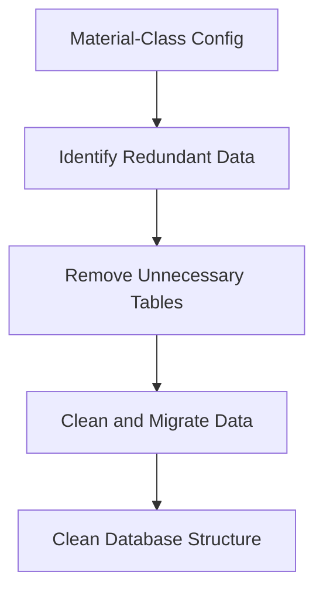

**Diagram sources**
- [115-supprimer-config-matiere-classe.sql](file://backend/database/migrations/115-supprimer-config-matiere-classe.sql)

**Section sources**
- [115-supprimer-config-matiere-classe.sql](file://backend/database/migrations/115-supprimer-config-matiere-classe.sql)

### Program Versioning and Timeless Programs
New program versioning support enables timeless program management with proper version control and historical tracking capabilities.

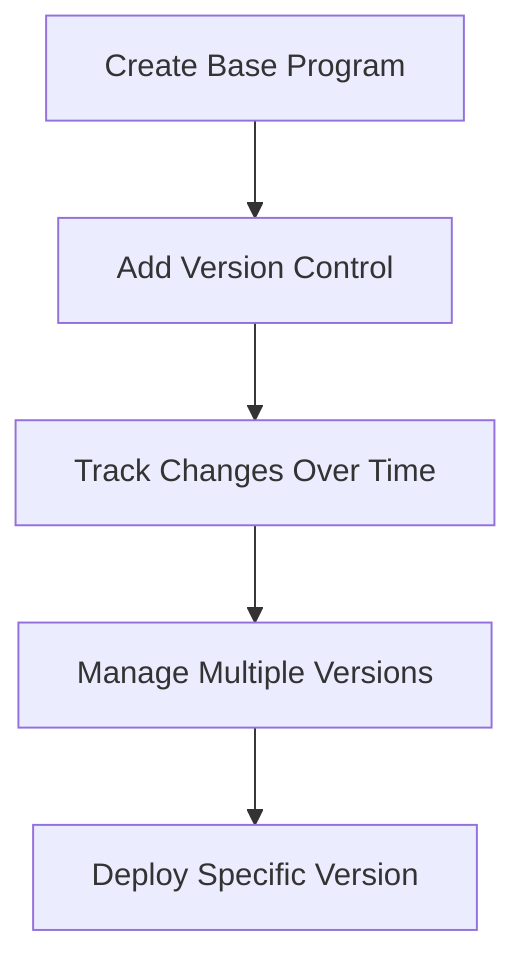

**Diagram sources**
- [116-programme-intemporel.sql](file://backend/database/migrations/116-programme-intemporel.sql)

**Section sources**
- [116-programme-intemporel.sql](file://backend/database/migrations/116-programme-intemporel.sql)

### Enhanced Timetable Preferences System
The enriched preferences system provides detailed customization options for timetable scheduling, including advanced conflict resolution and user preference management.

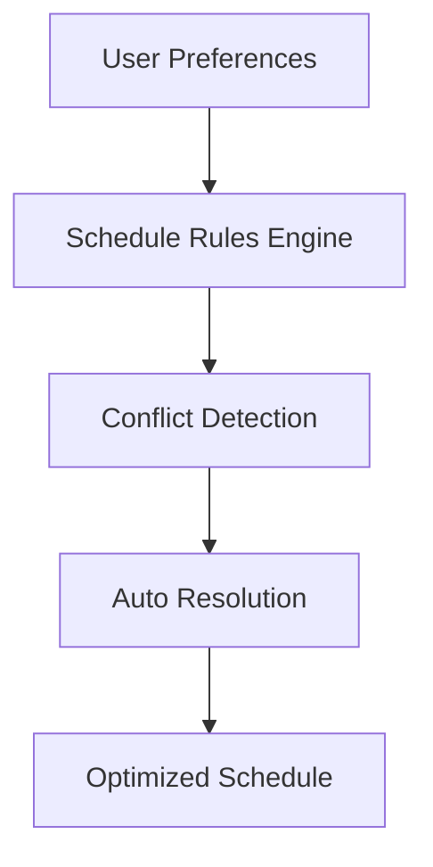

**Diagram sources**
- [118-preferences-edt-enrichi.sql](file://backend/database/migrations/118-preferences-edt-enrichi.sql)

**Section sources**
- [118-preferences-edt-enrichi.sql](file://backend/database/migrations/118-preferences-edt-enrichi.sql)

### Nomenclature Constraints Fix
Unique constraint fixes for nomenclature tables ensure data integrity and prevent duplicate entries across different establishments.

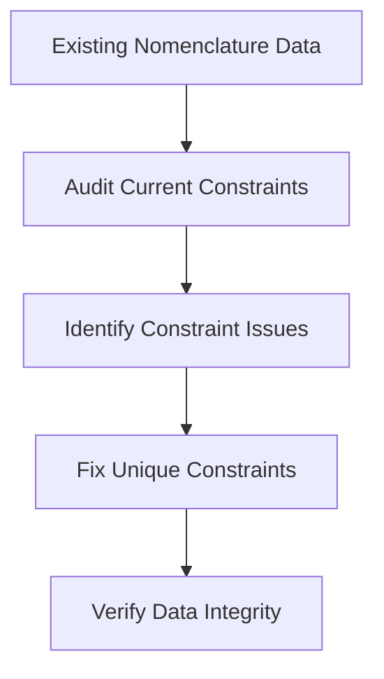

**Diagram sources**
- [113-fix-unique-constraints-nomenclatures.sql](file://backend/database/migrations/113-fix-unique-constraints-nomenclatures.sql)

**Section sources**
- [113-fix-unique-constraints-nomenclatures.sql](file://backend/database/migrations/113-fix-unique-constraints-nomenclatures.sql)

## Dependency Analysis
Key dependency chains with recent enhancements:
- Academic hierarchy drives class composition and enrollment.
- Subject assignments drive scheduling and assessment opportunities.
- Evaluations and Notes feed Bulletin aggregation and grade computation.
- Enhanced scheduling depends on Room availability, teacher/class constraints, and hour fusion rules.
- Program versioning dependencies support echelon management and timeless curriculum administration.
- Calendar periods gate assessment windows and report card generation.
- Configuration cleanup reduces unnecessary dependencies between material and class entities.

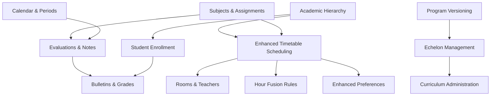

[No sources needed since this diagram shows conceptual workflow, not actual code structure]

**Section sources**
- [053-structure-academique-complete.sql](file://backend/database/migrations/053-structure-academique-complete.sql)
- [054-refonte-structure-academique-v2.sql](file://backend/database/migrations/054-refonte-structure-academique-v2.sql)
- [058-multi-tenant-structure-academique.sql](file://backend/database/migrations/058-multi-tenant-structure-academique.sql)
- [088-refactorisation-architecture-academique.sql](file://backend/database/migrations/088-refactorisation-architecture-academique.sql)
- [089-finalisation-architecture-academique-v2.sql](file://backend/database/migrations/089-finalisation-architecture-academique-v2.sql)
- [091-peuplement-architecture-academique.sql](file://backend/database/migrations/091-peuplement-architecture-academique.sql)
- [092-refactorisation-classeAnneeId.sql](file://backend/database/migrations/092-refactorisation-classeAnneeId.sql)
- [100-classes-salle-principale.sql](file://backend/database/migrations/100-classes-salle-principale.sql)
- [101-normalisation-annee-scolaire-cloture.sql](file://backend/database/migrations/101-normalisation-annee-scolaire-cloture.sql)
- [102-periodes-hierarchie.sql](file://backend/database/migrations/102-periodes-hierarchie.sql)
- [103-templates-periode-personnalisables.sql](file://backend/database/migrations/103-templates-periode-personnalisables.sql)
- [104-refonte-periodes-niveaux-configurables.sql](file://backend/database/migrations/104-refonte-periodes-niveaux-configurables.sql)
- [059-ajouter-affectation-matiere-sous-systeme.sql](file://backend/database/migrations/059-ajouter-affectation-matiere-sous-systeme.sql)
- [060-ajouter-affectation-matiere-coefficient.sql](file://backend/database/migrations/060-ajouter-affectation-matiere-coefficient.sql)
- [061-creer-table-bulletins-matieres.sql](file://backend/database/migrations/061-creer-table-bulletins-matieres.sql)
- [062-creer-table-evaluations-competences.sql](file://backend/database/migrations/062-creer-table-evaluations-competences.sql)
- [063-creer-module-emploi-du-temps.sql](file://backend/database/migrations/063-creer-module-emploi-du-temps.sql)
- [070-module-salles.sql](file://backend/database/migrations/070-module-salles.sql)
- [072-scoping-cycles-niveaux.sql](file://backend/database/migrations/072-scoping-cycles-niveaux.sql)
- [073-competence-unique-composite.sql](file://backend/database/migrations/073-competence-unique-composite.sql)
- [074-matiere-niveau-unique-composite.sql](file://backend/database/migrations/074-matiere-niveau-unique-composite.sql)
- [106-rename-sequence-to-evaluation.sql](file://backend/database/migrations/106-rename-sequence-to-evaluation.sql)
- [113-fix-unique-constraints-nomenclatures.sql](file://backend/database/migrations/113-fix-unique-constraints-nomenclatures.sql)
- [114-fusion-creneaux-horaires.sql](file://backend/database/migrations/114-fusion-creneaux-horaires.sql)
- [114-normalisation-echelons-structurels.sql](file://backend/database/migrations/114-normalisation-echelons-structurels.sql)
- [115-supprimer-config-matiere-classe.sql](file://backend/database/migrations/115-supprimer-config-matiere-classe.sql)
- [116-programme-intemporel.sql](file://backend/database/migrations/116-programme-intemporel.sql)
- [117-heure-cours-classe-annee.sql](file://backend/database/migrations/117-heure-cours-classe-annee.sql)
- [118-preferences-edt-enrichi.sql](file://backend/database/migrations/118-preferences-edt-enrichi.sql)

## Performance Considerations
- Indexing strategies should prioritize foreign keys used in frequent joins (e.g., classe_id, matiere_id, evaluation_id).
- Composite unique constraints reduce duplicate data and improve query efficiency.
- Partitioning large tables (Notes, Bulletins) by academic year can enhance reporting performance.
- Avoid over-fetching in schedule conflict checks; use targeted queries with existence checks.
- **Updated** Hour fusion optimization reduces computational overhead in timetable generation.
- **Updated** Echelon normalization improves query performance through reduced table joins.
- **Updated** Configuration cleanup eliminates unnecessary database lookups and improves response times.

## Troubleshooting Guide
Common issues and resolutions:
- Duplicate subject definitions: Ensure composite uniqueness at Level scope.
- Scheduling conflicts: Validate Room, Teacher, and Class availability before confirmation.
- Grade calculation discrepancies: Verify coefficient values and evaluation coverage.
- Period misalignment: Confirm Period boundaries match assessment windows.
- **Updated** Hour fusion conflicts: Check adjacent time slot compatibility and validation rules.
- **Updated** Echelon ordering issues: Verify proper sequence numbers and parent-child relationships.
- **Updated** Program version conflicts: Ensure proper version control and deployment procedures.

**Section sources**
- [074-matiere-niveau-unique-composite.sql](file://backend/database/migrations/074-matiere-niveau-unique-composite.sql)
- [063-creer-module-emploi-du-temps.sql](file://backend/database/migrations/063-creer-module-emploi-du-temps.sql)
- [060-ajouter-affectation-matiere-coefficient.sql](file://backend/database/migrations/060-ajouter-affectation-matiere-coefficient.sql)
- [102-periodes-hierarchie.sql](file://backend/database/migrations/102-periodes-hierarchie.sql)
- [114-fusion-creneaux-horaires.sql](file://backend/database/migrations/114-fusion-creneaux-horaires.sql)
- [114-normalisation-echelons-structurels.sql](file://backend/database/migrations/114-normalisation-echelons-structurels.sql)
- [116-programme-intemporel.sql](file://backend/database/migrations/116-programme-intemporel.sql)

## Conclusion
The eLISAschool academic schema provides a robust, multi-tenant foundation for managing educational hierarchies, student lifecycles, subject assignments, competency-based assessments, scheduling, and reporting. Its design emphasizes clarity, scalability, and operational integrity through well-defined relationships, constraints, and calendar-driven workflows. Recent enhancements through seven major schema restructuring migrations have significantly improved timetable efficiency, program versioning capabilities, echelon management, and overall system performance while maintaining backward compatibility and data integrity.

## Appendices
- Entity relationship overview: See Architecture Overview diagram.
- Migration timeline: Refer to referenced migration files for evolution details.
- Module integration points: Consult module entity files for API and service hooks.
- **Updated** Recent enhancements: Review migrations 113-118 for detailed schema improvements.