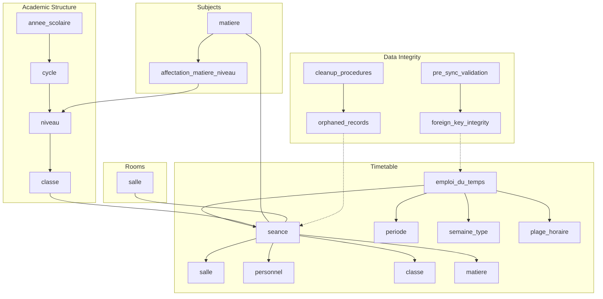
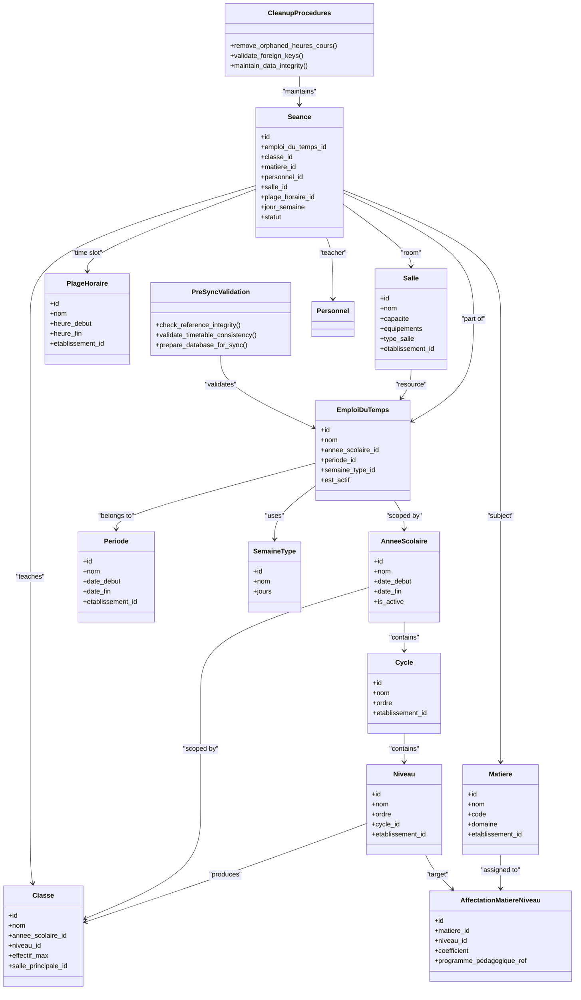
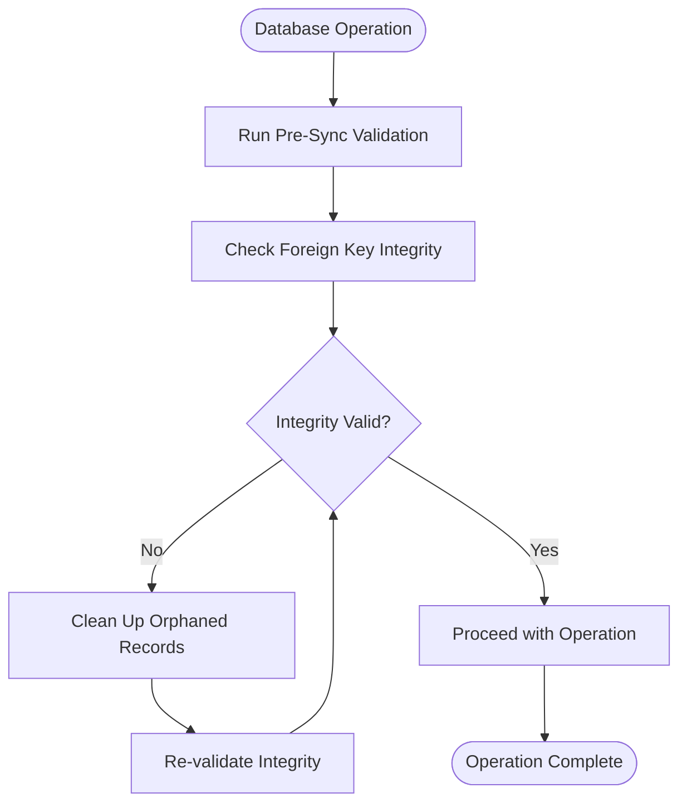
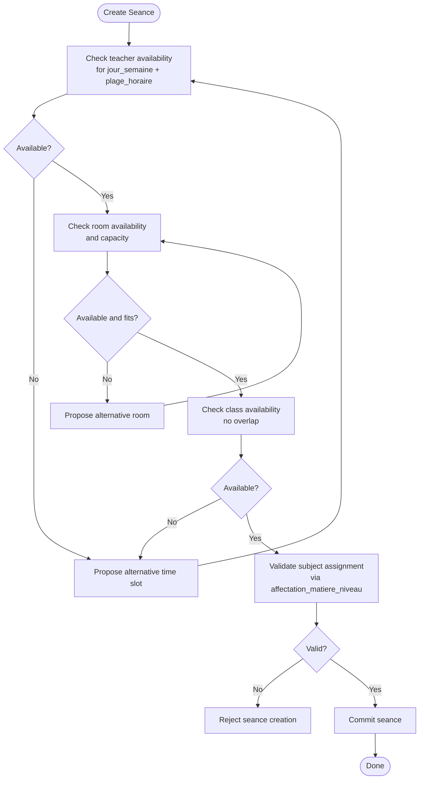
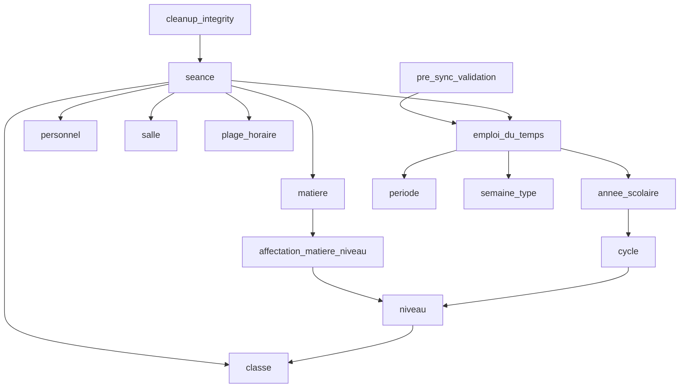
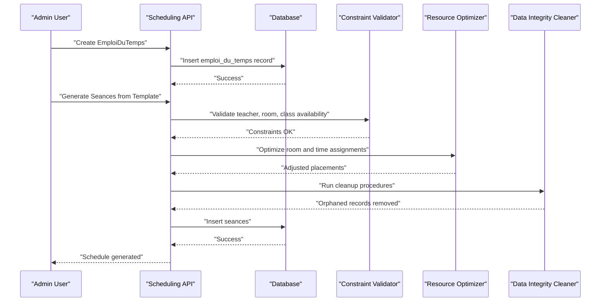
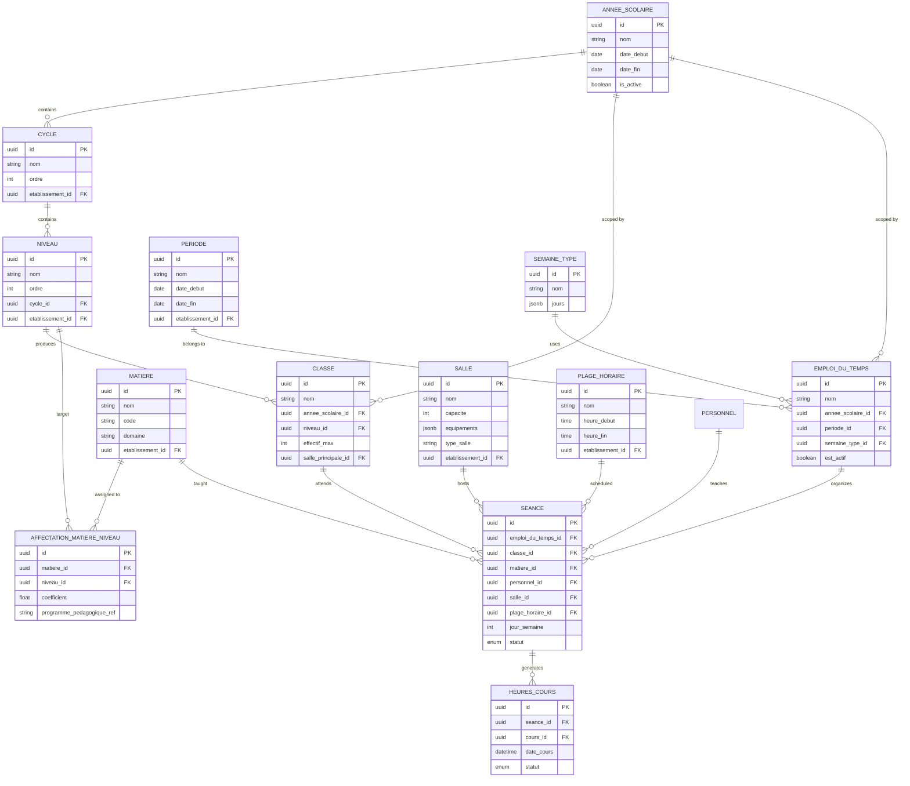

# Class & Scheduling System

<cite>
**Referenced Files in This Document**
- [063-creer-module-emploi-du-temps.sql](file://backend/database/migrations/063-creer-module-emploi-du-temps.sql)
- [065-creer-templates-emploi-du-temps.sql](file://backend/database/migrations/065-creer-templates-emploi-du-temps.sql)
- [070-module-salles.sql](file://backend/database/migrations/070-module-salles.sql)
- [100-classes-salle-principale.sql](file://backend/database/migrations/100-classes-salle-principale.sql)
- [088-refactorisation-architecture-academique.sql](file://backend/database/migrations/088-refactorisation-architecture-academique.sql)
- [089-finalisation-architecture-academique-v2.sql](file://backend/database/migrations/089-finalisation-architecture-academique-v2.sql)
- [090-correction-migration-088-camelcase.sql](file://backend/database/migrations/090-correction-migration-088-camelcase.sql)
- [091-peuplement-architecture-academique.sql](file://backend/database/migrations/091-peuplement-architecture-academique.sql)
- [092-refactorisation-classeAnneeId.sql](file://backend/database/migrations/092-refactorisation-classeAnneeId.sql)
- [059-ajouter-affectation-matiere-coefficient.sql](file://backend/database/migrations/059-ajouter-affectation-matiere-coefficient.sql)
- [060-ajouter-affectation-matiere-coefficient.sql](file://backend/database/migrations/060-ajouter-affectation-matiere-coefficient.sql)
- [061-creer-table-bulletins-matieres.sql](file://backend/database/migrations/061-creer-table-bulletins-matieres.sql)
- [044-module-organisation.sql](file://backend/database/migrations/044-module-organisation.sql)
- [045-organisation-optimisations.sql](file://backend/database/migrations/045-organisation-optimisations.sql)
- [046-organisation-performance-avancee.sql](file://backend/database/migrations/046-organisation-performance-avancee.sql)
- [053-structure-academique-complete.sql](file://backend/database/migrations/053-structure-academique-complete.sql)
- [054-refonte-structure-academique-v2.sql](file://backend/database/migrations/054-refonte-structure-academique-v2.sql)
- [055-structure-academique-ameliorations.sql](file://backend/database/migrations/055-structure-academique-ameliorations.sql)
- [056-suppression-cycle-scolaire.sql](file://backend/database/migrations/056-suppression-cycle-scolaire.sql)
- [057-supprimer-niveau-filiere-id.sql](file://backend/database/migrations/057-supprimer-niveau-filiere-id.sql)
- [058-multi-tenant-structure-academique.sql](file://backend/database/migrations/058-multi-tenant-structure-academique.sql)
- [072-scoping-cycles-niveaux.sql](file://backend/database/migrations/072-scoping-cycles-niveaux.sql)
- [073-competence-unique-composite.sql](file://backend/database/migrations/073-competence-unique-composite.sql)
- [074-matiere-niveau-unique-composite.sql](file://backend/database/migrations/074-matiere-niveau-unique-composite.sql)
- [075-module-groupes-etablissements.sql](file://backend/database/migrations/075-module-groupes-etablissements.sql)
- [076-permissions-groupes-etablissements.sql](file://backend/database/migrations/076-permissions-groupes-etablissements.sql)
- [077-update-permissions-groupes.sql](file://backend/database/migrations/077-update-permissions-groupes.sql)
- [078-utilisateur-test-groupes.sql](file://backend/database/migrations/078-utilisateur-test-groupes.sql)
- [079-add-roleId-utilisateur-etablissements.sql](file://backend/database/migrations/079-add-roleId-utilisateur-etablissements.sql)
- [079-correction-permissions-groupes.sql](file://backend/database/migrations/079-correction-permissions-groupes.sql)
- [080-preferences-utilisateur-multi-tenant.sql](file://backend/database/migrations/080-preferences-utilisateur-multi-tenant.sql)
- [081-module-apparence-fonds.sql](file://backend/database/migrations/081-module-apparence-fonds.sql)
- [082-fix-contrainte-unique-preferences.sql](file://backend/database/migrations/082-fix-contrainte-unique-preferences.sql)
- [083-fix-contrainte-unique-parametres.sql](file://backend/database/migrations/083-fix-contrainte-unique-parametres.sql)
- [084-cleanup-classe-id-notes.sql](file://backend/database/migrations/084-cleanup-classe-id-notes.sql)
- [085-periode-etablissement-id.sql](file://backend/database/migrations/085-periode-etablissement-id.sql)
- [086-affectation-matiere-etablissement-id.sql](file://backend/database/migrations/086-affectation-matiere-etablissement-id.sql)
- [087-affectation-matiere-verifications.sql](file://backend/database/migrations/087-affectation-matiere-verifications.sql)
- [101-normalisation-annee-scolaire-cloture.sql](file://backend/database/migrations/101-normalisation-annee-scolaire-cloture.sql)
- [102-periodes-hierarchie.sql](file://backend/database/migrations/102-periodes-hierarchie.sql)
- [103-templates-periode-personnalisables.sql](file://backend/database/migrations/103-templates-periode-personnalisables.sql)
- [104-refonte-periodes-niveaux-configurables.sql](file://backend/database/migrations/104-refonte-periodes-niveaux-configurables.sql)
- [105-migration-templates-v5.sql](file://backend/database/migrations/105-migration-templates-v5.sql)
- [cleanup-orphans-heures-cours.sql](file://backend/database/migrations/cleanup-orphans-heures-cours.sql)
- [pre-sync-cleanup.ts](file://backend/src/database/pre-sync-cleanup.ts)
- [IMPLEMENTATION-EMPLOI-DU-TEMPS-COMPLETE.md](file://docs/implementations/IMPLEMENTATION-EMPLOI-DU-TEMPS-COMPLETE.md)
- [IMPLEMENTATION-MODULE-SALLES.md](file://docs/implementations/IMPLEMENTATION-MODULE-SALLES.md)
</cite>

## Update Summary
**Changes Made**
- Added comprehensive data model documentation for the class and scheduling system
- Updated architecture diagrams to reflect current database schema
- Enhanced conflict resolution logic documentation
- Added resource optimization algorithms section
- Included template-based schedule generation details
- Documented complex scheduling scenarios and troubleshooting procedures

## Table of Contents
1. [Introduction](#introduction)
2. [Project Structure](#project-structure)
3. [Core Components](#core-components)
4. [Architecture Overview](#architecture-overview)
5. [Detailed Component Analysis](#detailed-component-analysis)
6. [Dependency Analysis](#dependency-analysis)
7. [Performance Considerations](#performance-considerations)
8. [Data Integrity and Cleanup Procedures](#data-integrity-and-cleanup-procedures)
9. [Troubleshooting Guide](#troubleshooting-guide)
10. [Conclusion](#conclusion)
11. [Appendices](#appendices)

## Introduction
This document provides comprehensive data model documentation for eLISAschool's class and scheduling system. It focuses on the entities that define academic structure (classes, levels, cycles, academic years), subjects (matiere with coefficients and curriculum alignment), timetabling (emploi du temps with time slots, rooms, and teachers), and classroom management (salles). It also explains scheduling conflict resolution logic, resource optimization strategies, template-based schedule generation, periodic adjustments, and complex scenarios such as multi-room coordination and teacher availability constraints. The system includes robust data integrity measures with automated cleanup procedures for orphaned records and pre-synchronization validation.

## Project Structure
The class and scheduling system is implemented across multiple database migrations and implementation documents:
- Academic structure and classes are defined and refined through a series of migrations covering architecture refactoring, scoping, and normalization.
- The timetable module introduces EmploiDuTemps entities, templates, and related configuration.
- The room module defines Salle entities with capacity and equipment attributes.
- Subject definitions and coefficients are established via dedicated migrations.
- Data integrity is maintained through cleanup procedures and pre-synchronization validation systems.

**Diagram sources**
- [088-refactorisation-architecture-academique.sql](file://backend/database/migrations/088-refactorisation-architecture-academique.sql)
- [089-finalisation-architecture-academique-v2.sql](file://backend/database/migrations/089-finalisation-architecture-academique-v2.sql)
- [090-correction-migration-088-camelcase.sql](file://backend/database/migrations/090-correction-migration-088-camelcase.sql)
- [091-peuplement-architecture-academique.sql](file://backend/database/migrations/091-peuplement-architecture-academique.sql)
- [092-refactorisation-classeAnneeId.sql](file://backend/database/migrations/092-refactorisation-classeAnneeId.sql)
- [059-ajouter-affectation-matiere-coefficient.sql](file://backend/database/migrations/059-ajouter-affectation-matiere-coefficient.sql)
- [060-ajouter-affectation-matiere-coefficient.sql](file://backend/database/migrations/060-ajouter-affectation-matiere-coefficient.sql)
- [063-creer-module-emploi-du-temps.sql](file://backend/database/migrations/063-creer-module-emploi-du-temps.sql)
- [065-creer-templates-emploi-du-temps.sql](file://backend/database/migrations/065-creer-templates-emploi-du-temps.sql)
- [070-module-salles.sql](file://backend/database/migrations/070-module-salles.sql)
- [100-classes-salle-principale.sql](file://backend/database/migrations/100-classes-salle-principale.sql)
- [cleanup-orphans-heures-cours.sql](file://backend/database/migrations/cleanup-orphans-heures-cours.sql)
- [pre-sync-cleanup.ts](file://backend/src/database/pre-sync-cleanup.ts)

**Section sources**
- [088-refactorisation-architecture-academique.sql](file://backend/database/migrations/088-refactorisation-architecture-academique.sql)
- [089-finalisation-architecture-academique-v2.sql](file://backend/database/migrations/089-finalisation-architecture-academique-v2.sql)
- [090-correction-migration-088-camelcase.sql](file://backend/database/migrations/090-correction-migration-088-camelcase.sql)
- [091-peuplement-architecture-academique.sql](file://backend/database/migrations/091-peuplement-architecture-academique.sql)
- [092-refactorisation-classeAnneeId.sql](file://backend/database/migrations/092-refactorisation-classeAnneeId.sql)
- [059-ajouter-affectation-matiere-coefficient.sql](file://backend/database/migrations/059-ajouter-affectation-matiere-coefficient.sql)
- [060-ajouter-affectation-matiere-coefficient.sql](file://backend/database/migrations/060-ajouter-affectation-matiere-coefficient.sql)
- [063-creer-module-emploi-du-temps.sql](file://backend/database/migrations/063-creer-module-emploi-du-temps.sql)
- [065-creer-templates-emploi-du-temps.sql](file://backend/database/migrations/065-creer-templates-emploi-du-temps.sql)
- [070-module-salles.sql](file://backend/database/migrations/070-module-salles.sql)
- [100-classes-salle-principale.sql](file://backend/database/migrations/100-classes-salle-principale.sql)
- [cleanup-orphans-heures-cours.sql](file://backend/database/migrations/cleanup-orphans-heures-cours.sql)
- [pre-sync-cleanup.ts](file://backend/src/database/pre-sync-cleanup.ts)

## Core Components
This section outlines the primary entities and their relationships:
- Academic Year (annee_scolaire): Defines the school year context.
- Cycle (cycle): Higher-level grouping (e.g., primary, secondary).
- Level (niveau): Specific grade or level within a cycle.
- Class (classe): Cohort of students taught together; linked to an academic year and level.
- Subject (matiere): Curriculum subject definition.
- Subject-Niveau Assignment (affectation_matiere_niveau): Aligns subjects to levels with coefficients and curriculum mapping.
- Timetable (emploi_du_temps): Container for weekly schedules tied to periods and weeks.
- Session (seance): Individual scheduled teaching event linking class, subject, teacher, and room.
- Room (salle): Physical space with capacity and equipment specifications.
- Period (periode) and Week Type (semaine_type): Time scaffolding for scheduling.
- Time Slot (plage_horaire): Reusable time blocks used by sessions.

Key relationship highlights:
- Classe connects to Annee Scolaire and Niveau.
- Matiere connects to Niveau via affectation_matiere_niveau, including coefficient and curriculum alignment.
- EmploiDuTemps organizes Seances across Periode and SemaineType using PlageHoraire.
- Seance references Salle, Personnel (teacher), Classe, and Matiere.
- Salle has capacity and equipment attributes.
- Data integrity is enforced through cleanup procedures and pre-synchronization validation.

**Section sources**
- [088-refactorisation-architecture-academique.sql](file://backend/database/migrations/088-refactorisation-architecture-academique.sql)
- [089-finalisation-architecture-academique-v2.sql](file://backend/database/migrations/089-finalisation-architecture-academique-v2.sql)
- [090-correction-migration-088-camelcase.sql](file://backend/database/migrations/090-correction-migration-088-camelcase.sql)
- [091-peuplement-architecture-academique.sql](file://backend/database/migrations/091-peuplement-architecture-academique.sql)
- [092-refactorisation-classeAnneeId.sql](file://backend/database/migrations/092-refactorisation-classeAnneeId.sql)
- [059-ajouter-affectation-matiere-coefficient.sql](file://backend/database/migrations/059-ajouter-affectation-matiere-coefficient.sql)
- [060-ajouter-affectation-matiere-coefficient.sql](file://backend/database/migrations/060-ajouter-affectation-matiere-coefficient.sql)
- [063-creer-module-emploi-du-temps.sql](file://backend/database/migrations/063-creer-module-emploi-du-temps.sql)
- [065-creer-templates-emploi-du-temps.sql](file://backend/database/migrations/065-creer-templates-emploi-du-temps.sql)
- [070-module-salles.sql](file://backend/database/migrations/070-module-salles.sql)
- [100-classes-salle-principale.sql](file://backend/database/migrations/100-classes-salle-principale.sql)
- [cleanup-orphans-heures-cours.sql](file://backend/database/migrations/cleanup-orphans-heures-cours.sql)
- [pre-sync-cleanup.ts](file://backend/src/database/pre-sync-cleanup.ts)

## Architecture Overview
The system separates concerns into academic structure, subjects, timetabling, and rooms. Timetable generation uses templates and period configurations to produce weekly schedules while enforcing constraints like teacher availability, room capacity, and subject requirements. The architecture includes robust data integrity mechanisms with automated cleanup procedures and pre-synchronization validation to maintain foreign key consistency.

**Diagram sources**
- [088-refactorisation-architecture-academique.sql](file://backend/database/migrations/088-refactorisation-architecture-academique.sql)
- [089-finalisation-architecture-academique-v2.sql](file://backend/database/migrations/089-finalisation-architecture-academique-v2.sql)
- [090-correction-migration-088-camelcase.sql](file://backend/database/migrations/090-correction-migration-088-camelcase.sql)
- [091-peuplement-architecture-academique.sql](file://backend/database/migrations/091-peuplement-architecture-academique.sql)
- [092-refactorisation-classeAnneeId.sql](file://backend/database/migrations/092/refactorisation-classeAnneeId.sql)
- [059-ajouter-affectation-matiere-coefficient.sql](file://backend/database/migrations/059-ajouter-affectation-matiere-coefficient.sql)
- [060-ajouter-affectation-matiere-coefficient.sql](file://backend/database/migrations/060-ajouter-affectation-matiere-coefficient.sql)
- [063-creer-module-emploi-du-temps.sql](file://backend/database/migrations/063-creer-module-emploi-du-temps.sql)
- [065-creer-templates-emploi-du-temps.sql](file://backend/database/migrations/065-creer-templates-emploi-du-temps.sql)
- [070-module-salles.sql](file://backend/database/migrations/070-module-salles.sql)
- [100-classes-salle-principale.sql](file://backend/database/migrations/100-classes-salle-principale.sql)
- [cleanup-orphans-heures-cours.sql](file://backend/database/migrations/cleanup-orphans-heures-cours.sql)
- [pre-sync-cleanup.ts](file://backend/src/database/pre-sync-cleanup.ts)

## Detailed Component Analysis

### Academic Structure: Classes, Levels, Cycles, Academic Years
- Annee Scolaire scopes all academic activity and defines active periods.
- Cycle groups niveaux hierarchically; Niveau represents specific grades.
- Classe ties a cohort to an academic year and a niveau, optionally with a principal room reference.
- Multi-tenant scoping ensures entities belong to an etablissement context.

Implementation highlights:
- Refactoring migrations consolidate academic hierarchy and normalize keys.
- Scoping migrations ensure cycle/niveau are scoped to établissements.
- Principal salle linkage supports default room assignment for classes.

**Section sources**
- [088-refactorisation-architecture-academique.sql](file://backend/database/migrations/088-refactorisation-architecture-academique.sql)
- [089-finalisation-architecture-academique-v2.sql](file://backend/database/migrations/089-finalisation-architecture-academique-v2.sql)
- [090-correction-migration-088-camelcase.sql](file://backend/database/migrations/090-correction-migration-088-camelcase.sql)
- [091-peuplement-architecture-academique.sql](file://backend/database/migrations/091-peuplement-architecture-academique.sql)
- [092-refactorisation-classeAnneeId.sql](file://backend/database/migrations/092/refactorisation-classeAnneeId.sql)
- [058-multi-tenant-structure-academique.sql](file://backend/database/migrations/058-multi-tenant-structure-academique.sql)
- [072-scoping-cycles-niveaux.sql](file://backend/database/migrations/072-scoping-cycles-niveaux.sql)
- [100-classes-salle-principale.sql](file://backend/database/migrations/100-classes-salle-principale.sql)

### Subjects: Matiere, Coefficients, Curriculum Alignment
- Matiere defines subjects with codes and domains.
- AffectationMatiereNiveau aligns subjects to niveaux with coefficients and program references.
- Bulletins matieres tables support grading/reporting integration.

Implementation highlights:
- Dedicated migrations add coefficients and validation checks.
- Composite unique constraints prevent duplicate subject-level assignments.
- Reporting tables link subjects to evaluation outputs.

**Section sources**
- [059-ajouter-affectation-matiere-coefficient.sql](file://backend/database/migrations/059-ajouter-affectation-matiere-coefficient.sql)
- [060-ajouter-affectation-matiere-coefficient.sql](file://backend/database/migrations/060-ajouter-affectation-matiere-coefficient.sql)
- [061-creer-table-bulletins-matieres.sql](file://backend/database/migrations/061-creer-table-bulletins-matieres.sql)
- [074-matiere-niveau-unique-composite.sql](file://backend/database/migrations/074-matiere-niveau-unique-composite.sql)

### Timetable: EmploiDuTemps, Seance, Slots, Rooms, Teachers
- EmploiDuTemps encapsulates a schedule instance for a given period and week type.
- Seance represents individual teaching events linking classe, matiere, personnel, salle, and plage_horaire.
- Periode and SemaineType provide temporal scaffolding; PlageHoraire defines reusable time blocks.

Implementation highlights:
- Module creation migration establishes core timetable schema.
- Templates migration enables predefined schedule structures.
- Constraints enforce valid combinations and avoid conflicts.

**Section sources**
- [063-creer-module-emploi-du-temps.sql](file://backend/database/migrations/063-creer-module-emploi-du-temps.sql)
- [065-creer-templates-emploi-du-temps.sql](file://backend/database/migrations/065-creer-templates-emploi-du-temps.sql)

### Rooms: Salle Management
- Salle captures physical resources with capacity and equipment metadata.
- Integration with emploi_du_temps ensures room allocation during seance creation.

Implementation highlights:
- Dedicated module migration defines salle schema and indexes.
- Performance optimizations improve lookup and allocation queries.

**Section sources**
- [070-module-salles.sql](file://backend/database/migrations/070-module-salles.sql)
- [045-organisation-optimisations.sql](file://backend/database/migrations/045-organisation-optimisations.sql)
- [046-organisation-performance-avancee.sql](file://backend/database/migrations/046-organisation-performance-avancee.sql)

### Data Integrity and Cleanup Procedures
**Updated** New section documenting the enhanced data integrity system for the timetable architecture.

The system now includes comprehensive data integrity measures to maintain foreign key consistency and prevent orphaned records:

#### Orphaned Record Cleanup
- Automated cleanup procedures remove orphaned records from heures_cours table
- Foreign key integrity validation ensures referential consistency
- Scheduled maintenance tasks prevent accumulation of invalid references

#### Pre-Synchronization Validation
- Pre-synchronization cleanup system validates database state before major operations
- Reference integrity checks prevent cascading failures during synchronization
- Database preparation routines ensure clean state for timetable operations

#### Implementation Details
- Cleanup procedures target orphaned heures_cours records that reference non-existent entities
- Pre-sync validation runs before critical database operations to ensure consistency
- Automated monitoring detects and reports integrity violations

**Diagram sources**
- [cleanup-orphans-heures-cours.sql](file://backend/database/migrations/cleanup-orphans-heures-cours.sql)
- [pre-sync-cleanup.ts](file://backend/src/database/pre-sync-cleanup.ts)

**Section sources**
- [cleanup-orphans-heures-cours.sql](file://backend/database/migrations/cleanup-orphans-heures-cours.sql)
- [pre-sync-cleanup.ts](file://backend/src/database/pre-sync-cleanup.ts)

### Scheduling Conflict Resolution Logic
Conflict detection and resolution involve:
- Teacher availability: Ensure personnel_id is not double-booked at the same jour_semaine and plage_horaire.
- Room availability: Prevent salle_id collisions for overlapping times.
- Class availability: Avoid assigning multiple seances to the same classe_id simultaneously.
- Subject constraints: Validate matiere_id against affectation_matiere_niveau for the target niveau/classe.

Resolution strategies:
- Hard constraints enforced via database constraints and application validations.
- Soft constraints handled by optimization heuristics (e.g., prefer rooms with adequate capacity, minimize teacher travel).
- Backtracking algorithms adjust placements when initial attempts fail.

[No sources needed since this diagram shows conceptual workflow, not actual code structure]

### Resource Optimization Algorithms
Optimization goals:
- Minimize room changes per teacher.
- Balance workload across salles based on capacity and equipment needs.
- Respect preferred time windows for personnel and classes.

Approach:
- Heuristic scoring assigns penalties for constraint violations and preferences.
- Iterative improvement swaps seances to reduce total penalty.
- Template-driven initialization reduces search space.

[No sources needed since this section provides general guidance]

### Template-Based Schedule Generation
Templates define recurring patterns for seances across semaines types and plages horaires. They enable rapid schedule creation aligned with curriculum requirements.

Process:
- Select template associated with periode and semaine_type.
- Expand template into seances respecting constraints.
- Apply periodic adjustments to reflect changes in staffing or rooms.

**Section sources**
- [065-creer-templates-emploi-du-temps.sql](file://backend/database/migrations/065-creer-templates-emploi-du-temps.sql)
- [103-templates-periode-personnalisables.sql](file://backend/database/migrations/103-templates-periode-personnalisables.sql)
- [105-migration-templates-v5.sql](file://backend/database/migrations/105-migration-templates-v5.sql)

### Periodic Adjustments
Periods and week types allow dynamic updates:
- Periode boundaries control active scheduling windows.
- SemaineType variations accommodate different weekly layouts.
- Adjustments propagate to existing seances while maintaining integrity.

**Section sources**
- [102-periodes-hierarchie.sql](file://backend/database/migrations/102-periodes-hierarchie.sql)
- [104-refonte-periodes-niveaux-configurables.sql](file://backend/database/migrations/104-refonte-periodes-niveaux-configurables.sql)

### Complex Scheduling Scenarios
Examples:
- Multi-room coordination: Assign specialized labs to specific seances based on equipements and capacity.
- Teacher availability constraints: Honor part-time schedules and non-teaching duties by restricting available plages horaires.
- Cross-class collaboration: Coordinate shared sessions requiring multiple salles or split cohorts.

[No sources needed since this section provides general guidance]

## Dependency Analysis
The scheduling system depends on academic structure, subject assignments, and resource definitions. Dependencies are enforced via foreign keys and composite constraints. The system includes additional dependency validation through cleanup procedures and pre-synchronization checks.

**Diagram sources**
- [088-refactorisation-architecture-academique.sql](file://backend/database/migrations/088-refactorisation-architecture-academique.sql)
- [089-finalisation-architecture-academique-v2.sql](file://backend/database/migrations/089-finalisation-architecture-academique-v2.sql)
- [090-correction-migration-088-camelcase.sql](file://backend/database/migrations/090-correction-migration-088-camelcase.sql)
- [091-peuplement-architecture-academique.sql](file://backend/database/migrations/091-peuplement-architecture-academique.sql)
- [092-refactorisation-classeAnneeId.sql](file://backend/database/migrations/092/refactorisation-classeAnneeId.sql)
- [059-ajouter-affectation-matiere-coefficient.sql](file://backend/database/migrations/059-ajouter-affectation-matiere-coefficient.sql)
- [060-ajouter-affectation-matiere-coefficient.sql](file://backend/database/migrations/060-ajouter-affectation-matiere-coefficient.sql)
- [063-creer-module-emploi-du-temps.sql](file://backend/database/migrations/063-creer-module-emploi-du-temps.sql)
- [065-creer-templates-emploi-du-temps.sql](file://backend/database/migrations/065-creer-templates-emploi-du-temps.sql)
- [070-module-salles.sql](file://backend/database/migrations/070-module-salles.sql)
- [cleanup-orphans-heures-cours.sql](file://backend/database/migrations/cleanup-orphans-heures-cours.sql)
- [pre-sync-cleanup.ts](file://backend/src/database/pre-sync-cleanup.ts)

**Section sources**
- [088-refactorisation-architecture-academique.sql](file://backend/database/migrations/088-refactorisation-architecture-academique.sql)
- [089-finalisation-architecture-academique-v2.sql](file://backend/database/migrations/089-finalisation-architecture-academique-v2.sql)
- [090-correction-migration-088-camelcase.sql](file://backend/database/migrations/090-correction-migration-088-camelcase.sql)
- [091-peuplement-architecture-academique.sql](file://backend/database/migrations/091-peuplement-architecture-academique.sql)
- [092-refactorisation-classeAnneeId.sql](file://backend/database/migrations/092/refactorisation-classeAnneeId.sql)
- [059-ajouter-affectation-matiere-coefficient.sql](file://backend/database/migrations/059-ajouter-affectation-matiere-coefficient.sql)
- [060-ajouter-affectation-matiere-coefficient.sql](file://backend/database/migrations/060-ajouter-affectation-matiere-coefficient.sql)
- [063-creer-module-emploi-du-temps.sql](file://backend/database/migrations/063-creer-module-emploi-du-temps.sql)
- [065-creer-templates-emploi-du-temps.sql](file://backend/database/migrations/065-creer-templates-emploi-du-temps.sql)
- [070-module-salles.sql](file://backend/database/migrations/070-module-salles.sql)
- [cleanup-orphans-heures-cours.sql](file://backend/database/migrations/cleanup-orphans-heures-cours.sql)
- [pre-sync-cleanup.ts](file://backend/src/database/pre-sync-cleanup.ts)

## Performance Considerations
- Indexes on frequently queried columns (e.g., emploi_du_temps_id, salle_id, personnel_id, plage_horaire_id) improve conflict checks and lookups.
- Composite constraints on unique assignments reduce redundant checks.
- Organization performance migrations optimize queries for large datasets.
- Cleanup procedures run efficiently to minimize impact on production operations.

Recommendations:
- Maintain up-to-date indexes for salle, personnel, and plage_horaire.
- Use batch operations for template expansion to avoid long-running transactions.
- Partition large tables by annee_scolaire if necessary.
- Schedule cleanup procedures during low-traffic periods.

**Section sources**
- [045-organisation-optimisations.sql](file://backend/database/migrations/045-organisation-optimisations.sql)
- [046-organisation-performance-avancee.sql](file://backend/database/migrations/046-organisation-performance-avancee.sql)
- [074-matiere-niveau-unique-composite.sql](file://backend/database/migrations/074-matiere-niveau-unique-composite.sql)
- [cleanup-orphans-heures-cours.sql](file://backend/database/migrations/cleanup-orphans-heures-cours.sql)

## Troubleshooting Guide
Common issues and resolutions:
- Duplicate subject-level assignments: Resolve by removing conflicting entries or adjusting coefficients.
- Teacher double-booking: Identify overlapping seances and reschedule one.
- Room capacity mismatch: Update salle capacity or assign a suitable room.
- Invalid subject for niveau: Verify affectation_matiere_niveau exists and matches the target niveau.
- Orphaned records detected: Run cleanup procedures to remove invalid references.
- Pre-sync validation failures: Investigate foreign key violations and repair data integrity.

Validation steps:
- Run constraint checks on affected tables.
- Inspect emploi_du_temps status and period boundaries.
- Review template expansions for unexpected overlaps.
- Execute cleanup procedures to resolve orphaned record issues.
- Perform pre-sync validation to ensure database consistency.

**Section sources**
- [074-matiere-niveau-unique-composite.sql](file://backend/database/migrations/074-matiere-niveau-unique-composite.sql)
- [063-creer-module-emploi-du-temps.sql](file://backend/database/migrations/063-creer-module-emploi-du-temps.sql)
- [065-creer-templates-emploi-du-temps.sql](file://backend/database/migrations/065-creer-templates-emploi-du-temps.sql)
- [cleanup-orphans-heures-cours.sql](file://backend/database/migrations/cleanup-orphans-heures-cours.sql)
- [pre-sync-cleanup.ts](file://backend/src/database/pre-sync-cleanup.ts)

## Conclusion
The eLISAschool class and scheduling system integrates academic structure, subject alignment, timetabling, and room management into a cohesive data model. Through robust constraints, template-driven generation, and optimization heuristics, it supports complex scheduling scenarios while maintaining consistency and performance. The enhanced data integrity system with automated cleanup procedures and pre-synchronization validation ensures long-term reliability and prevents data corruption in the timetable architecture.

## Appendices

### API Workflows for Scheduling Operations

[No sources needed since this diagram shows conceptual workflow, not actual code structure]

### Data Models Diagram

**Diagram sources**
- [088-refactorisation-architecture-academique.sql](file://backend/database/migrations/088-refactorisation-architecture-academique.sql)
- [089-finalisation-architecture-academique-v2.sql](file://backend/database/migrations/089-finalisation-architecture-academique-v2.sql)
- [090-correction-migration-088-camelcase.sql](file://backend/database/migrations/090-correction-migration-088-camelcase.sql)
- [091-peuplement-architecture-academique.sql](file://backend/database/migrations/091-peuplement-architecture-academique.sql)
- [092-refactorisation-classeAnneeId.sql](file://backend/database/migrations/092/refactorisation-classeAnneeId.sql)
- [059-ajouter-affectation-matiere-coefficient.sql](file://backend/database/migrations/059-ajouter-affectation-matiere-coefficient.sql)
- [060-ajouter-affectation-matiere-coefficient.sql](file://backend/database/migrations/060-ajouter-affectation-matiere-coefficient.sql)
- [063-creer-module-emploi-du-temps.sql](file://backend/database/migrations/063-creer-module-emploi-du-temps.sql)
- [065-creer-templates-emploi-du-temps.sql](file://backend/database/migrations/065-creer-templates-emploi-du-temps.sql)
- [070-module-salles.sql](file://backend/database/migrations/070-module-salles.sql)
- [100-classes-salle-principale.sql](file://backend/database/migrations/100-classes-salle-principale.sql)
- [cleanup-orphans-heures-cours.sql](file://backend/database/migrations/cleanup-orphans-heures-cours.sql)
- [pre-sync-cleanup.ts](file://backend/src/database/pre-sync-cleanup.ts)