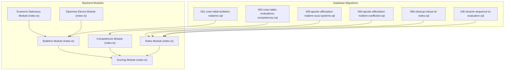
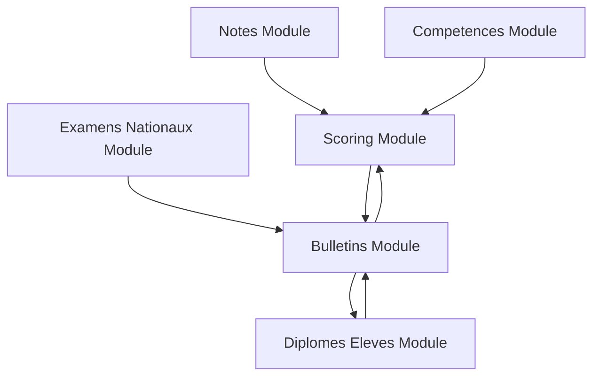
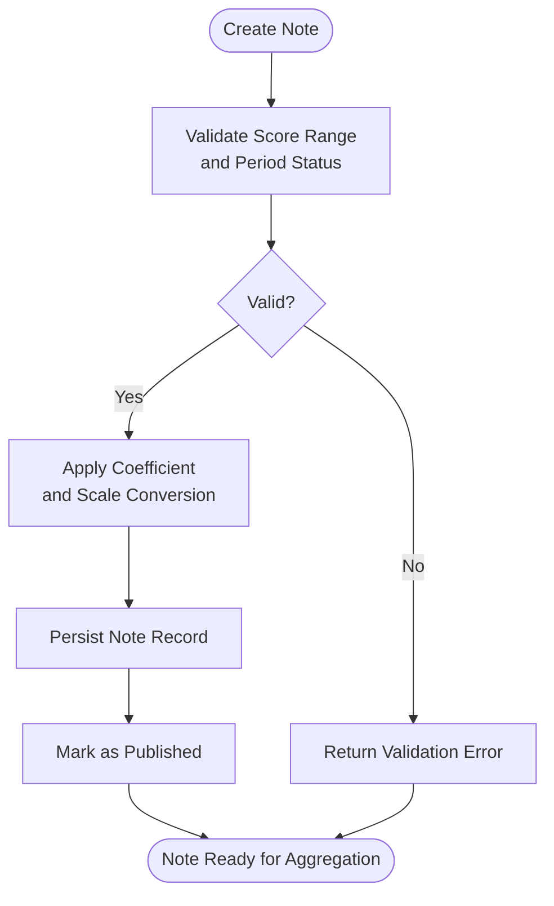
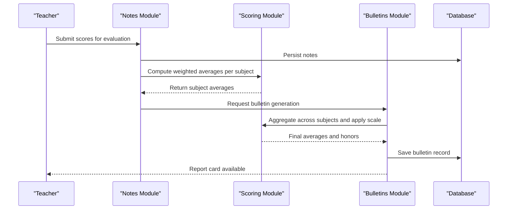
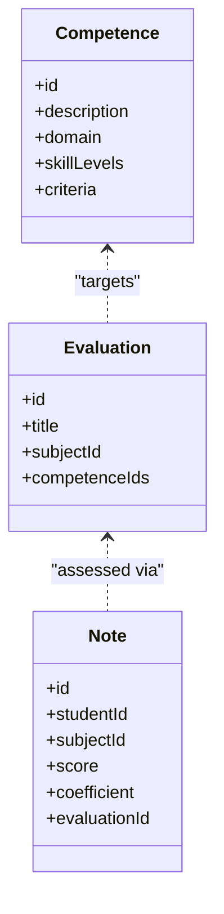
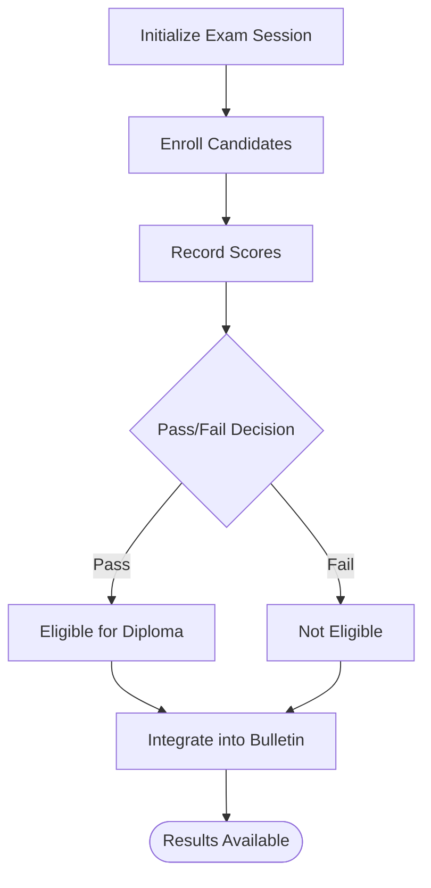
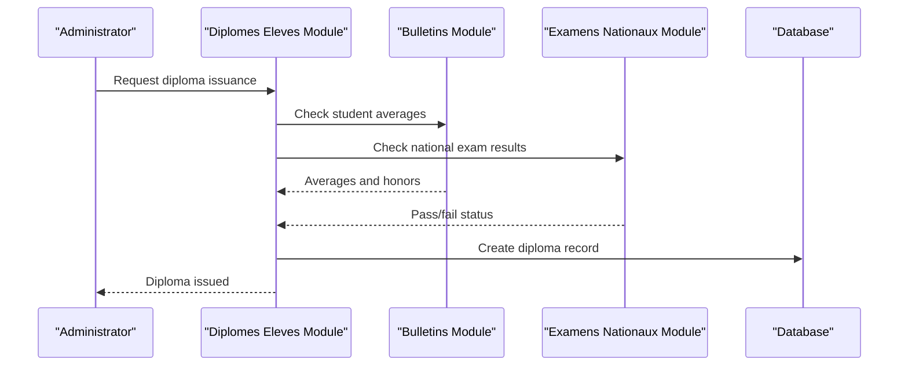
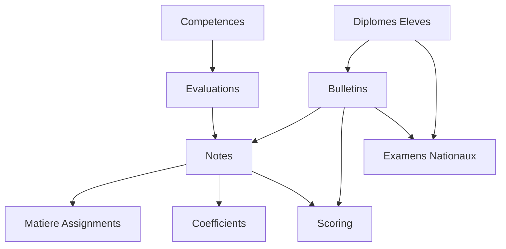

# Grading & Evaluation System

<cite>
**Referenced Files in This Document**
- [061-creer-table-bulletins-matieres.sql](file://backend/database/migrations/061-creer-table-bulletins-matieres.sql)
- [062-creer-table-evaluations-competences.sql](file://backend/database/migrations/062-creer-table-evaluations-competences.sql)
- [059-ajouter-affectation-matiere-sous-systeme.sql](file://backend/database/migrations/059-ajouter-affectation-matiere-sous-systeme.sql)
- [060-ajouter-affectation-matiere-coefficient.sql](file://backend/database/migrations/060-ajouter-affectation-matiere-coefficient.sql)
- [084-cleanup-classe-id-notes.sql](file://backend/database/migrations/084-cleanup-classe-id-notes.sql)
- [106-rename-sequence-to-evaluation.sql](file://backend/database/migrations/106-rename-sequence-to-evaluation.sql)
- [notes/index.ts](file://backend/src/modules/notes/index.ts)
- [bulletins/index.ts](file://backend/src/modules/bulletins/index.ts)
- [competences/index.ts](file://backend/src/modules/competences/index.ts)
- [examens-nationaux/index.ts](file://backend/src/modules/examens-nationaux/index.ts)
- [diplomes-eleves/index.ts](file://backend/src/modules/diplomes-eleves/index.ts)
- [scoring/index.ts](file://backend/src/modules/scoring/index.ts)
</cite>

## Table of Contents
1. [Introduction](#introduction)
2. [Project Structure](#project-structure)
3. [Core Components](#core-components)
4. [Architecture Overview](#architecture-overview)
5. [Detailed Component Analysis](#detailed-component-analysis)
6. [Dependency Analysis](#dependency-analysis)
7. [Performance Considerations](#performance-considerations)
8. [Troubleshooting Guide](#troubleshooting-guide)
9. [Conclusion](#conclusion)
10. [Appendices](#appendices)

## Introduction
This document describes the data model and workflow for eLISAschool’s grading and evaluation system. It focuses on:
- Note entities for individual assessments, scoring mechanisms, and weight calculations
- Bulletin entities for report card generation with subject-specific grades and overall averages
- Competence entities supporting competency-based assessment with skill levels and criteria
- ExamenNational entities for national examination tracking and results management
- DiplomeEleve entities for diploma issuance and academic achievement records
- The end-to-end evaluation workflow from assessment creation to final grade calculation
- Examples of grading scales, competency frameworks, and report card formats across educational systems

The goal is to provide a clear, accessible reference for both technical and non-technical stakeholders.

## Project Structure
The grading and evaluation system spans multiple modules and database migrations:
- Database schema changes are defined in SQL migrations under backend/database/migrations
- Module entry points expose controllers, services, DTOs, and types under backend/src/modules/<module>/index.ts
- Scoring logic and utilities are centralized in backend/src/modules/scoring

**Diagram sources**
- [061-creer-table-bulletins-matieres.sql](file://backend/database/migrations/061-creer-table-bulletins-matieres.sql)
- [062-creer-table-evaluations-competences.sql](file://backend/database/migrations/062-creer-table-evaluations-competences.sql)
- [059-ajouter-affectation-matiere-sous-systeme.sql](file://backend/database/migrations/059-ajouter-affectation-matiere-sous-systeme.sql)
- [060-ajouter-affectation-matiere-coefficient.sql](file://backend/database/migrations/060-ajouter-affectation-matiere-coefficient.sql)
- [084-cleanup-classe-id-notes.sql](file://backend/database/migrations/084-cleanup-classe-id-notes.sql)
- [106-rename-sequence-to-evaluation.sql](file://backend/database/migrations/106-rename-sequence-to-evaluation.sql)
- [notes/index.ts](file://backend/src/modules/notes/index.ts)
- [bulletins/index.ts](file://backend/src/modules/bulletins/index.ts)
- [competences/index.ts](file://backend/src/modules/competences/index.ts)
- [examens-nationaux/index.ts](file://backend/src/modules/examens-nationaux/index.ts)
- [diplomes-eleves/index.ts](file://backend/src/modules/diplomes-eleves/index.ts)
- [scoring/index.ts](file://backend/src/modules/scoring/index.ts)

**Section sources**
- [061-creer-table-bulletins-matieres.sql](file://backend/database/migrations/061-creer-table-bulletins-matieres.sql)
- [062-creer-table-evaluations-competences.sql](file://backend/database/migrations/062-creer-table-evaluations-competences.sql)
- [059-ajouter-affectation-matiere-sous-systeme.sql](file://backend/database/migrations/059-ajouter-affectation-matiere-sous-systeme.sql)
- [060-ajouter-affectation-matiere-coefficient.sql](file://backend/database/migrations/060-ajouter-affectation-matiere-coefficient.sql)
- [084-cleanup-classe-id-notes.sql](file://backend/database/migrations/084-cleanup-classe-id-notes.sql)
- [106-rename-sequence-to-evaluation.sql](file://backend/database/migrations/106-rename-sequence-to-evaluation.sql)
- [notes/index.ts](file://backend/src/modules/notes/index.ts)
- [bulletins/index.ts](file://backend/src/modules/bulletins/index.ts)
- [competences/index.ts](file://backend/src/modules/competences/index.ts)
- [examens-nationaux/index.ts](file://backend/src/modules/examens-nationaux/index.ts)
- [diplomes-eleves/index.ts](file://backend/src/modules/diplomes-eleves/index.ts)
- [scoring/index.ts](file://backend/src/modules/scoring/index.ts)

## Core Components
This section outlines the primary entities and their roles within the grading and evaluation system.

- Note
  - Represents an individual assessment or score entry for a student in a subject context.
  - Supports scoring mechanisms and weight calculations via coefficients and evaluation metadata.
  - Related to subjects, classes, periods, and evaluations.

- Bulletin
  - Aggregates subject-specific grades into a report card for a student and period.
  - Computes overall averages using configured weights and scales.
  - Links to matiere assignments and coefficient rules.

- Competence
  - Models competencies and skills used in competency-based assessment.
  - Includes skill levels and evaluation criteria.
  - Can be associated with evaluations and notes.

- ExamenNational
  - Tracks national examination events, candidates, scores, and outcomes.
  - Integrates with bulletin generation and diploma eligibility.

- DiplomeEleve
  - Records diploma issuance and academic achievements for students.
  - Depends on bulletin results and national exam outcomes.

- Scoring Utilities
  - Centralized logic for weighted averages, scale conversions, and aggregation.

**Section sources**
- [notes/index.ts](file://backend/src/modules/notes/index.ts)
- [bulletins/index.ts](file://backend/src/modules/bulletins/index.ts)
- [competences/index.ts](file://backend/src/modules/competences/index.ts)
- [examens-nationaux/index.ts](file://backend/src/modules/examens-nationaux/index.ts)
- [diplomes-eleves/index.ts](file://backend/src/modules/diplomes-eleves/index.ts)
- [scoring/index.ts](file://backend/src/modules/scoring/index.ts)

## Architecture Overview
The evaluation architecture connects assessment inputs (Notes), competency definitions (Competence), aggregation (Bulletin), external exams (ExamenNational), and certification outputs (DiplomeEleve). Scoring utilities provide consistent computation across modules.

**Diagram sources**
- [notes/index.ts](file://backend/src/modules/notes/index.ts)
- [competences/index.ts](file://backend/src/modules/competences/index.ts)
- [bulletins/index.ts](file://backend/src/modules/bulletins/index.ts)
- [examens-nationaux/index.ts](file://backend/src/modules/examens-nationaux/index.ts)
- [diplomes-eleves/index.ts](file://backend/src/modules/diplomes-eleves/index.ts)
- [scoring/index.ts](file://backend/src/modules/scoring/index.ts)

## Detailed Component Analysis

### Note Entity
Purpose:
- Captures individual assessment results for a student in a subject context.
- Enables weighting through coefficients and supports various grading scales.

Key attributes and relationships:
- Identifier and references to student, class, subject, period, and evaluation
- Score value, maximum score, and optional comments
- Coefficient and scale configuration references
- Status flags for validation and publication

Weighting and scoring:
- Weighted average per subject uses coefficients assigned to each note
- Scale conversion maps raw scores to standardized values before averaging
- Validation ensures scores fall within configured bounds

Data flow:
- Creation: teacher enters scores linked to an evaluation
- Validation: checks against allowed ranges and period closure
- Publication: marks notes as finalized for bulletin aggregation

**Diagram sources**
- [059-ajouter-affectation-matiere-sous-systeme.sql](file://backend/database/migrations/059-ajouter-affectation-matiere-sous-systeme.sql)
- [060-ajouter-affectation-matiere-coefficient.sql](file://backend/database/migrations/060-ajouter-affectation-matiere-coefficient.sql)
- [084-cleanup-classe-id-notes.sql](file://backend/database/migrations/084-cleanup-classe-id-notes.sql)
- [106-rename-sequence-to-evaluation.sql](file://backend/database/migrations/106-rename-sequence-to-evaluation.sql)
- [notes/index.ts](file://backend/src/modules/notes/index.ts)

**Section sources**
- [059-ajouter-affectation-matiere-sous-systeme.sql](file://backend/database/migrations/059-ajouter-affectation-matiere-sous-systeme.sql)
- [060-ajouter-affectation-matiere-coefficient.sql](file://backend/database/migrations/060-ajouter-affectation-matiere-coefficient.sql)
- [084-cleanup-classe-id-notes.sql](file://backend/database/migrations/084-cleanup-classe-id-notes.sql)
- [106-rename-sequence-to-evaluation.sql](file://backend/database/migrations/106-rename-sequence-to-evaluation.sql)
- [notes/index.ts](file://backend/src/modules/notes/index.ts)

### Bulletin Entity
Purpose:
- Generates report cards by aggregating subject-specific grades and computing overall averages.

Key attributes and relationships:
- Student, period, and institution identifiers
- Subject entries with computed grades and weights
- Overall average and honors/distinctions based on thresholds

Aggregation logic:
- Uses coefficients from matiere assignments and note weights
- Applies scale normalization and rounding policies
- Handles missing or excluded subjects according to policy

Report card formats:
- Supports multiple layouts depending on institutional templates
- Includes subject breakdown, averages, and remarks

**Diagram sources**
- [061-creer-table-bulletins-matieres.sql](file://backend/database/migrations/061-creer-table-bulletins-matieres.sql)
- [bulletins/index.ts](file://backend/src/modules/bulletins/index.ts)
- [scoring/index.ts](file://backend/src/modules/scoring/index.ts)
- [notes/index.ts](file://backend/src/modules/notes/index.ts)

**Section sources**
- [061-creer-table-bulletins-matieres.sql](file://backend/database/migrations/061-creer-table-bulletins-matieres.sql)
- [bulletins/index.ts](file://backend/src/modules/bulletins/index.ts)
- [scoring/index.ts](file://backend/src/modules/scoring/index.ts)
- [notes/index.ts](file://backend/src/modules/notes/index.ts)

### Competence Entity
Purpose:
- Defines competencies and skills for competency-based assessment.
- Provides skill levels and evaluation criteria that can be mapped to evaluations and notes.

Key attributes and relationships:
- Competency identifier, description, and domain
- Skill levels (e.g., beginner, intermediate, advanced)
- Criteria descriptors and rubrics
- Association with evaluations and subjects

Assessment integration:
- Evaluations can include competence targets
- Notes may capture competence attainment alongside numeric scores
- Bulletins can reflect competency progress indicators

**Diagram sources**
- [062-creer-table-evaluations-competences.sql](file://backend/database/migrations/062-creer-table-evaluations-competences.sql)
- [competences/index.ts](file://backend/src/modules/competences/index.ts)
- [notes/index.ts](file://backend/src/modules/notes/index.ts)

**Section sources**
- [062-creer-table-evaluations-competences.sql](file://backend/database/migrations/062-creer-table-evaluations-competences.sql)
- [competences/index.ts](file://backend/src/modules/competences/index.ts)
- [notes/index.ts](file://backend/src/modules/notes/index.ts)

### ExamenNational Entity
Purpose:
- Manages national examination events, candidate lists, scores, and outcomes.

Key attributes and relationships:
- Examination session details (year, region, type)
- Candidate enrollment and status
- Scores and pass/fail decisions
- Integration with bulletin and diploma workflows

Workflow:
- Create exam session and define parameters
- Enroll candidates and record results
- Export results for bulletin aggregation and diploma eligibility

**Diagram sources**
- [examens-nationaux/index.ts](file://backend/src/modules/examens-nationaux/index.ts)
- [bulletins/index.ts](file://backend/src/modules/bulletins/index.ts)

**Section sources**
- [examens-nationaux/index.ts](file://backend/src/modules/examens-nationaux/index.ts)
- [bulletins/index.ts](file://backend/src/modules/bulletins/index.ts)

### DiplomeEleve Entity
Purpose:
- Records diploma issuance and academic achievements for students.

Key attributes and relationships:
- Student identifier and diploma type
- Issuance date and issuing authority
- Associated bulletins and national exam results
- Honors and distinctions

Lifecycle:
- Verify eligibility based on bulletin averages and national exam outcomes
- Issue diploma and archive records
- Provide certificates and transcripts

**Diagram sources**
- [diplomes-eleves/index.ts](file://backend/src/modules/diplomes-eleves/index.ts)
- [bulletins/index.ts](file://backend/src/modules/bulletins/index.ts)
- [examens-nationaux/index.ts](file://backend/src/modules/examens-nationaux/index.ts)

**Section sources**
- [diplomes-eleves/index.ts](file://backend/src/modules/diplomes-eleves/index.ts)
- [bulletins/index.ts](file://backend/src/modules/bulletins/index.ts)
- [examens-nationaux/index.ts](file://backend/src/modules/examens-nationaux/index.ts)

### Scoring Utilities
Purpose:
- Centralizes weighted average computation, scale conversion, and aggregation logic.

Capabilities:
- Weighted average per subject using coefficients
- Scale normalization across different grading systems
- Rounding and threshold policies for honors/distinctions
- Reusable functions consumed by Notes, Bulletins, and other modules

Integration points:
- Called during note publication and bulletin generation
- Ensures consistency across modules and institutions

**Section sources**
- [scoring/index.ts](file://backend/src/modules/scoring/index.ts)
- [notes/index.ts](file://backend/src/modules/notes/index.ts)
- [bulletins/index.ts](file://backend/src/modules/bulletins/index.ts)

## Dependency Analysis
The evaluation system exhibits clear module boundaries and dependencies:
- Notes depend on matiere assignments and coefficients
- Bulletins depend on Notes, Scoring, and optionally Examens
- Competences integrate with Evaluations and Notes
- Diplomes depend on Bulletins and Examens

**Diagram sources**
- [059-ajouter-affectation-matiere-sous-systeme.sql](file://backend/database/migrations/059-ajouter-affectation-matiere-sous-systeme.sql)
- [060-ajouter-affectation-matiere-coefficient.sql](file://backend/database/migrations/060-ajouter-affectation-matiere-coefficient.sql)
- [061-creer-table-bulletins-matieres.sql](file://backend/database/migrations/061-creer-table-bulletins-matieres.sql)
- [062-creer-table-evaluations-competences.sql](file://backend/database/migrations/062-creer-table-evaluations-competences.sql)
- [notes/index.ts](file://backend/src/modules/notes/index.ts)
- [bulletins/index.ts](file://backend/src/modules/bulletins/index.ts)
- [competences/index.ts](file://backend/src/modules/competences/index.ts)
- [examens-nationaux/index.ts](file://backend/src/modules/examens-nationaux/index.ts)
- [diplomes-eleves/index.ts](file://backend/src/modules/diplomes-eleves/index.ts)
- [scoring/index.ts](file://backend/src/modules/scoring/index.ts)

**Section sources**
- [059-ajouter-affectation-matiere-sous-systeme.sql](file://backend/database/migrations/059-ajouter-affectation-matiere-sous-systeme.sql)
- [060-ajouter-affectation-matiere-coefficient.sql](file://backend/database/migrations/060-ajouter-affectation-matiere-coefficient.sql)
- [061-creer-table-bulletins-matieres.sql](file://backend/database/migrations/061-creer-table-bulletins-matieres.sql)
- [062-creer-table-evaluations-competences.sql](file://backend/database/migrations/062-creer-table-evaluations-competences.sql)
- [notes/index.ts](file://backend/src/modules/notes/index.ts)
- [bulletins/index.ts](file://backend/src/modules/bulletins/index.ts)
- [competences/index.ts](file://backend/src/modules/competences/index.ts)
- [examens-nationaux/index.ts](file://backend/src/modules/examens-nationaux/index.ts)
- [diplomes-eleves/index.ts](file://backend/src/modules/diplomes-eleves/index.ts)
- [scoring/index.ts](file://backend/src/modules/scoring/index.ts)

## Performance Considerations
- Indexes and constraints: Ensure foreign keys and frequently queried fields (studentId, subjectId, periodId) are indexed to optimize bulletin generation and note retrieval.
- Batch processing: For large cohorts, compute bulletin aggregates in batches to reduce memory pressure and improve throughput.
- Caching: Cache stable configurations such as coefficients and scale mappings to avoid repeated lookups.
- Idempotency: Make scoring computations idempotent to support retries without duplicating results.
- Validation early: Perform input validation at the Notes layer to prevent expensive rework downstream.

[No sources needed since this section provides general guidance]

## Troubleshooting Guide
Common issues and resolutions:
- Invalid score range: Ensure notes are validated against configured minimum and maximum values before publication.
- Missing coefficients: Verify matiere assignment coefficients exist; otherwise, weighted averages cannot be computed.
- Closed periods: Prevent modifications to notes once a period is closed; enforce status checks.
- Inconsistent scales: Confirm scale conversion rules are applied consistently across modules.
- National exam integration: Validate that exam results are correctly linked to candidates before bulletin aggregation.

Operational checks:
- Review migration logs for schema alignment issues
- Inspect module error handling and logging for failed computations
- Use diagnostic scripts to verify data integrity across related tables

**Section sources**
- [084-cleanup-classe-id-notes.sql](file://backend/database/migrations/084-cleanup-classe-id-notes.sql)
- [106-rename-sequence-to-evaluation.sql](file://backend/database/migrations/106-rename-sequence-to-evaluation.sql)
- [notes/index.ts](file://backend/src/modules/notes/index.ts)
- [bulletins/index.ts](file://backend/src/modules/bulletins/index.ts)
- [scoring/index.ts](file://backend/src/modules/scoring/index.ts)

## Conclusion
The eLISAschool grading and evaluation system provides a robust foundation for managing assessments, generating report cards, supporting competency-based evaluation, tracking national examinations, and issuing diplomas. By centralizing scoring logic and enforcing clear data flows between modules, the system ensures accuracy, consistency, and scalability across diverse educational contexts.

[No sources needed since this section summarizes without analyzing specific files]

## Appendices

### Examples of Grading Scales
- 0–20 scale with honors thresholds (e.g., mention Très Bien, Bien, Assez Bien)
- Percentage-based scale (0–100%) with letter grades (A–F)
- Pass/Fail with additional competency indicators

### Competency Frameworks
- Skill levels: Beginner, Intermediate, Advanced, Expert
- Rubric descriptors aligned with learning objectives
- Mapping competencies to subjects and evaluations

### Report Card Formats
- Traditional tabular layout with subject rows and averages
- Competency-focused layout highlighting skill progression
- National exam summary integrated with overall performance

[No sources needed since this section provides conceptual examples]