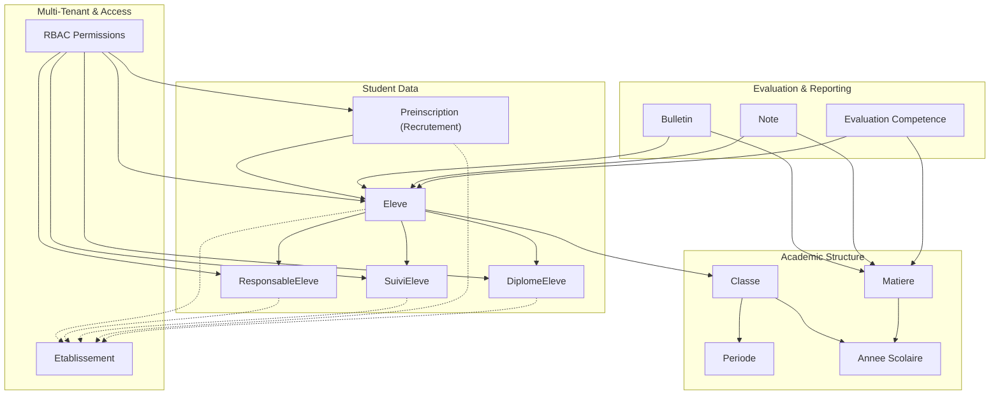
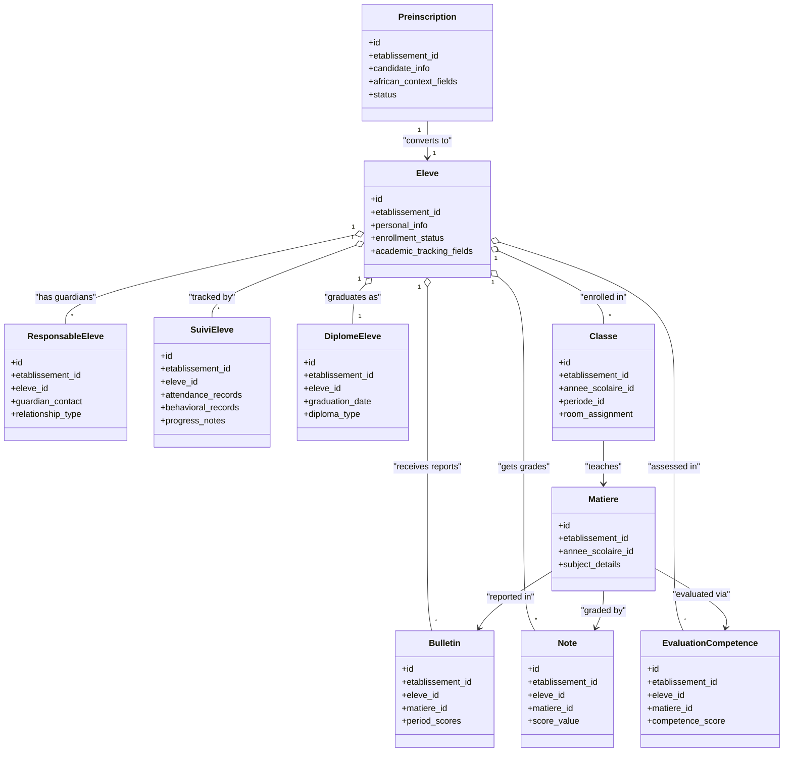
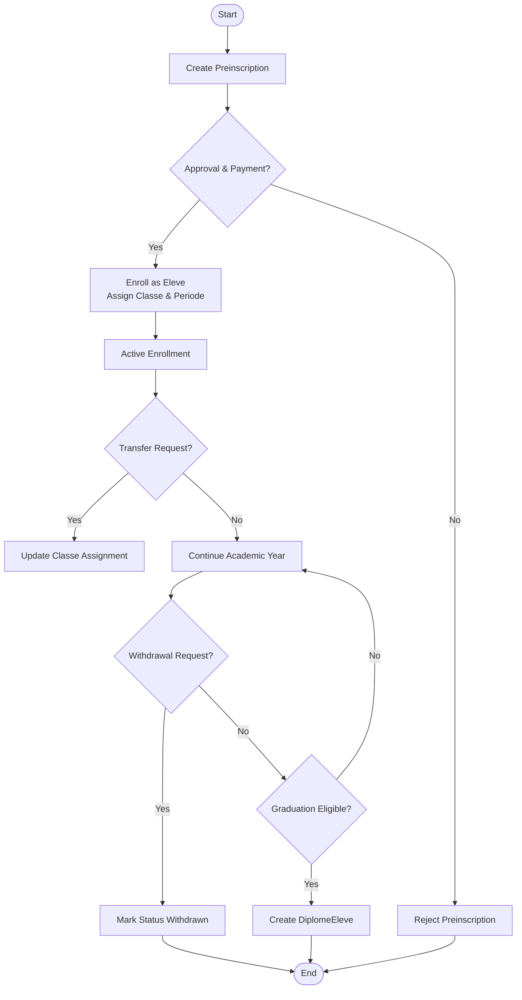
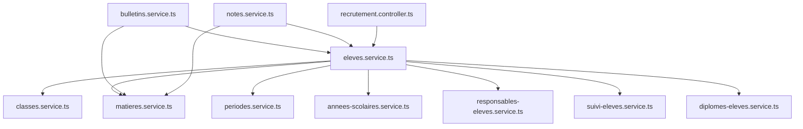

# Student Information System

<cite>
**Referenced Files in This Document**
- [024-eleve-champs-additionnels.sql](file://backend/database/migrations/024-eleve-champs-additionnels.sql)
- [025-responsable-champs-additionnels.sql](file://backend/database/migrations/025-responsable-champs-additionnels.sql)
- [030-suivi-eleves.sql](file://backend/database/migrations/030-suivi-eleves.sql)
- [051-champs-preinscription-enrichis.sql](file://backend/database/migrations/051-champs-preinscription-enrichis.sql)
- [058-multi-tenant-structure-academique.sql](file://backend/database/migrations/058-multi-tenant-structure-academique.sql)
- [059-multi-tenant-matiere.sql](file://backend/database/migrations/059-multi-tenant-matiere.sql)
- [061-creer-table-bulletins-matieres.sql](file://backend/database/migrations/061-creer-table-bulletins-matieres.sql)
- [062-creer-table-evaluations-competences.sql](file://backend/database/migrations/062-creer-table-evaluations-competences.sql)
- [072-scoping-cycles-niveaux.sql](file://backend/database/migrations/072-scoping-cycles-niveaux.sql)
- [088-refactorisation-architecture-academique.sql](file://backend/database/migrations/088-refactorisation-architecture-academique.sql)
- [089-finalisation-architecture-academique-v2.sql](file://backend/database/migrations/089-finalisation-architecture-academique-v2.sql)
- [091-peuplement-architecture-academique.sql](file://backend/database/migrations/091-peuplement-architecture-academique.sql)
- [092-refactorisation-classeAnneeId.sql](file://backend/database/migrations/092-refactorisation-classeAnneeId.sql)
- [100-classes-salle-principale.sql](file://backend/database/migrations/100-classes-salle-principale.sql)
- [101-normalisation-annee-scolaire-cloture.sql](file://backend/database/migrations/101-normalisation-annee-scolaire-cloture.sql)
- [102-periodes-hierarchie.sql](file://backend/database/migrations/102-periodes-hierarchie.sql)
- [103-templates-periode-personnalisables.sql](file://backend/database/migrations/103-templates-periode-personnalisables.sql)
- [104-refonte-periodes-niveaux-configurables.sql](file://backend/database/migrations/104-refonte-periodes-niveaux-configurables.sql)
- [eleves.service.ts](file://backend/src/modules/eleves/services/eleves.service.ts)
- [responsables-eleves.service.ts](file://backend/src/modules/responsables-eleves/services/responsables-eleves.service.ts)
- [suivi-eleves.service.ts](file://backend/src/modules/suivi-eleves/services/suivi-eleves.service.ts)
- [recrutement.controller.ts](file://backend/src/modules/recrutement/controllers/recrutement.controller.ts)
- [diplomes-eleves.service.ts](file://backend/src/modules/diplomes-eleves/services/diplomes-eleves.service.ts)
- [bulletins.service.ts](file://backend/src/modules/bulletins/services/bulletins.service.ts)
- [notes.service.ts](file://backend/src/modules/notes/services/notes.service.ts)
- [matieres.service.ts](file://backend/src/modules/matieres/services/matieres.service.ts)
- [classes.service.ts](file://backend/src/modules/classes/services/classes.service.ts)
- [periodes.service.ts](file://backend/src/modules/periodes/services/periodes.service.ts)
- [annees-scolaires.service.ts](file://backend/src/modules/annees-scolaires/services/annees-scolaires.service.ts)
</cite>

## Table of Contents
1. [Introduction](#introduction)
2. [Project Structure](#project-structure)
3. [Core Components](#core-components)
4. [Architecture Overview](#architecture-overview)
5. [Detailed Component Analysis](#detailed-component-analysis)
6. [Dependency Analysis](#dependency-analysis)
7. [Performance Considerations](#performance-considerations)
8. [Troubleshooting Guide](#troubleshooting-guide)
9. [Conclusion](#conclusion)
10. [Appendices](#appendices)

## Introduction
This document provides comprehensive data model documentation for eLISAschool’s student information system. It focuses on the Eleve entity, ResponsableEleve relationships, SuiviEleve tracking entities, pre-registration workflow with African educational context fields, and the full student lifecycle from enrollment to graduation. It also explains multi-tenant isolation and permission-based access controls, and maps how students connect to classes, subjects, and evaluation systems.

## Project Structure
The student information system is implemented across multiple modules:
- eleves: core student records and enrichment fields
- responsables-eleves: parent-guardian associations and contact management
- suivi-eleves: attendance, behavioral, and progress monitoring
- recrutement: pre-registration and admission workflows
- diplomes-eleves: graduation and certification records
- bulletins, notes, competences: evaluation and reporting
- classes, matieres, periodes, annees-scolaires: academic structure and scheduling
- Multi-tenant scoping via etablissement_id and RBAC permissions

[No sources needed since this diagram shows conceptual workflow, not actual code structure]

## Core Components
- Eleve: Represents a student with personal information, enrollment status, and academic tracking fields. Enriched with additional fields for African educational contexts.
- ResponsableEleve: Links one or more parents/guardians to a student with contact details and relationship metadata.
- SuiviEleve: Tracks student progress, attendance, and behavioral records over time.
- Preinscription (Recrutement): Pre-registration records enriched for African educational contexts, bridging into formal enrollment.
- DiplomeEleve: Records graduation and certification events.
- Academic Structure: Classes, Subjects (Matieres), Periods, and School Years define the academic environment.
- Evaluation & Reporting: Bulletins, Notes, and Competence evaluations capture academic performance.
- Multi-Tenant Isolation: All student-related entities are scoped by etablissement_id; RBAC enforces permission-based access.

**Section sources**
- [024-eleve-champs-additionnels.sql](file://backend/database/migrations/024-eleve-champs-additionnels.sql)
- [025-responsable-champs-additionnels.sql](file://backend/database/migrations/025-responsable-champs-additionnels.sql)
- [030-suivi-eleves.sql](file://backend/database/migrations/030-suivi-eleves.sql)
- [051-champs-preinscription-enrichis.sql](file://backend/database/migrations/051-champs-preinscription-enrichis.sql)
- [058-multi-tenant-structure-academique.sql](file://backend/database/migrations/058-multi-tenant-structure-academique.sql)
- [059-multi-tenant-matiere.sql](file://backend/database/migrations/059-multi-tenant-matiere.sql)
- [061-creer-table-bulletins-matieres.sql](file://backend/database/migrations/061-creer-table-bulletins-matieres.sql)
- [062-creer-table-evaluations-competences.sql](file://backend/database/migrations/062-creer-table-evaluations-competences.sql)
- [072-scoping-cycles-niveaux.sql](file://backend/database/migrations/072-scoping-cycles-niveaux.sql)
- [088-refactorisation-architecture-academique.sql](file://backend/database/migrations/088-refactorisation-architecture-academique.sql)
- [089-finalisation-architecture-academique-v2.sql](file://backend/database/migrations/089-finalisation-architecture-academique-v2.sql)
- [091-peuplement-architecture-academique.sql](file://backend/database/migrations/091-peuplement-architecture-academique.sql)
- [092-refactorisation-classeAnneeId.sql](file://backend/database/migrations/092-refactorisation-classeAnneeId.sql)
- [100-classes-salle-principale.sql](file://backend/database/migrations/100-classes-salle-principale.sql)
- [101-normalisation-annee-scolaire-cloture.sql](file://backend/database/migrations/101-normalisation-annee-scolaire-cloture.sql)
- [102-periodes-hierarchie.sql](file://backend/database/migrations/102-periodes-hierarchie.sql)
- [103-templates-periode-personnalisables.sql](file://backend/database/migrations/103-templates-periode-personnalisables.sql)
- [104-refonte-periodes-niveaux-configurables.sql](file://backend/database/migrations/104-refonte-periodes-niveaux-configurables.sql)

## Architecture Overview
The data architecture centers around the Eleve entity, which connects to guardians, tracking records, academic structure, evaluations, and graduation outcomes. Multi-tenancy ensures strict isolation per establishment, while RBAC governs who can read/write each entity.

**Diagram sources**
- [024-eleve-champs-additionnels.sql](file://backend/database/migrations/024-eleve-champs-additionnels.sql)
- [025-responsable-champs-additionnels.sql](file://backend/database/migrations/025-responsable-champs-additionnels.sql)
- [030-suivi-eleves.sql](file://backend/database/migrations/030-suivi-eleves.sql)
- [051-champs-preinscription-enrichis.sql](file://backend/database/migrations/051-champs-preinscription-enrichis.sql)
- [061-creer-table-bulletins-matieres.sql](file://backend/database/migrations/061-creer-table-bulletins-matieres.sql)
- [062-creer-table-evaluations-competences.sql](file://backend/database/migrations/062-creer-table-evaluations-competences.sql)
- [088-refactorisation-architecture-academique.sql](file://backend/database/migrations/088-refactorisation-architecture-academique.sql)
- [089-finalisation-architecture-academique-v2.sql](file://backend/database/migrations/089-finalisation-architecture-academique-v2.sql)
- [092-refactorisation-classeAnneeId.sql](file://backend/database/migrations/092-refactorisation-classeAnneeId.sql)

## Detailed Component Analysis

### Eleve Entity
- Personal information includes name, date of birth, gender, nationality, and identification numbers.
- Enrollment status captures current state (active, transferred, withdrawn, graduated).
- Academic tracking fields include grade level, cycle, section, and historical transitions.
- Additional fields support African educational contexts such as region, commune, school district, and prior schooling history.

Key implementation references:
- Enrichment fields and constraints are defined in migration files for Eleve.
- Service layer handles CRUD operations and validation.

**Section sources**
- [024-eleve-champs-additionnels.sql](file://backend/database/migrations/024-eleve-champs-additionnels.sql)
- [eleves.service.ts](file://backend/src/modules/eleves/services/eleves.service.ts)

### ResponsableEleve Relationship
- Associates one or more guardians to a student with contact details (phone, email, address).
- Relationship type distinguishes parent, legal guardian, emergency contact, etc.
- Supports hybrid approaches for family structures common in African contexts.

Key implementation references:
- Migration adds additional fields for Responsables.
- Service manages linkage and updates.

**Section sources**
- [025-responsable-champs-additionnels.sql](file://backend/database/migrations/025-responsable-champs-additionnels.sql)
- [responsables-eleves.service.ts](file://backend/src/modules/responsables-eleves/services/responsables-eleves.service.ts)

### SuiviEleve Entities
- Attendance records track daily presence, absences, tardiness, and excused reasons.
- Behavioral records capture incidents, commendations, and interventions.
- Progress notes document academic milestones, remediation plans, and counselor comments.

Key implementation references:
- Dedicated migration defines SuiviEleve tables and indexes.
- Service orchestrates creation and retrieval of tracking entries.

**Section sources**
- [030-suivi-eleves.sql](file://backend/database/migrations/030-suivi-eleves.sql)
- [suivi-eleves.service.ts](file://backend/src/modules/suivi-eleves/services/suivi-eleves.service.ts)

### Pre-Registration Workflow (Recrutement)
- Preinscription captures candidate information before formal enrollment.
- Enriched fields reflect African educational contexts: origin school, previous curriculum, language proficiency, scholarship eligibility, and transport needs.
- Conversion to Eleve occurs upon approval and payment verification.

Key implementation references:
- Migration enriches pre-registration fields.
- Controller exposes endpoints for recruitment workflow.

**Section sources**
- [051-champs-preinscription-enrichis.sql](file://backend/database/migrations/051-champs-preinscription-enrichis.sql)
- [recrutement.controller.ts](file://backend/src/modules/recrutement/controllers/recrutement.controller.ts)

### Student Lifecycle Transitions
- Enrollment: Converts approved Preinscription to Eleve and assigns to Classe and Periode.
- Transfer: Updates Classe assignment within the same Annee Scolaire or across establishments (with data scoping).
- Withdrawal: Marks enrollment status as withdrawn and archives tracking records.
- Graduation: Creates DiplomeEleve record and finalizes academic year closure.

Lifecycle flow:

**Diagram sources**
- [051-champs-preinscription-enrichis.sql](file://backend/database/migrations/051-champs-preinscription-enrichis.sql)
- [088-refactorisation-architecture-academique.sql](file://backend/database/migrations/088-refactorisation-architecture-academique.sql)
- [089-finalisation-architecture-academique-v2.sql](file://backend/database/migrations/089-finalisation-architecture-academique-v2.sql)
- [092-refactorisation-classeAnneeId.sql](file://backend/database/migrations/092-refactorisation-classeAnneeId.sql)
- [101-normalisation-annee-scolaire-cloture.sql](file://backend/database/migrations/101-normalisation-annee-scolaire-cloture.sql)
- [diplomes-eleves.service.ts](file://backend/src/modules/diplomes-eleves/services/diplomes-eleves.service.ts)

### Multi-Tenant Isolation and Permission-Based Access Controls
- All student-related entities include etablissement_id to enforce multi-tenant isolation at the database level.
- RBAC permissions restrict access based on roles and scopes tied to etablissement_id.
- Academic structure (Classes, Matieres, Periodes) is also scoped per establishment.

Key implementation references:
- Migrations add etablissement_id scoping to academic entities.
- Service layers apply tenant filters automatically.

**Section sources**
- [058-multi-tenant-structure-academique.sql](file://backend/database/migrations/058-multi-tenant-structure-academique.sql)
- [059-multi-tenant-matiere.sql](file://backend/database/migrations/059-multi-tenant-matiere.sql)
- [072-scoping-cycles-niveaux.sql](file://backend/database/migrations/072-scoping-cycles-niveaux.sql)

### Connections to Classes, Subjects, and Evaluations
- Students enroll in Classes linked to Annee Scolaire and Periode.
- Subjects (Matieres) are assigned to Classes and evaluated through Notes and Competence assessments.
- Bulletins aggregate scores and competence evaluations per subject and period.

Key implementation references:
- Academic architecture migrations define relationships and constraints.
- Services manage evaluation generation and report compilation.

**Section sources**
- [088-refactorisation-architecture-academique.sql](file://backend/database/migrations/088-refactorisation-architecture-academique.sql)
- [089-finalisation-architecture-academique-v2.sql](file://backend/database/migrations/089-finalisation-architecture-academique-v2.sql)
- [091-peuplement-architecture-academique.sql](file://backend/database/migrations/091-peuplement-architecture-academique.sql)
- [092-refactorisation-classeAnneeId.sql](file://backend/database/migrations/092-refactorisation-classeAnneeId.sql)
- [100-classes-salle-principale.sql](file://backend/database/migrations/100-classes-salle-principale.sql)
- [102-periodes-hierarchie.sql](file://backend/database/migrations/102-periodes-hierarchie.sql)
- [103-templates-periode-personnalisables.sql](file://backend/database/migrations/103-templates-periode-personnalisables.sql)
- [104-refonte-periodes-niveaux-configurables.sql](file://backend/database/migrations/104-refonte-periodes-niveaux-configurables.sql)
- [061-creer-table-bulletins-matieres.sql](file://backend/database/migrations/061-creer-table-bulletins-matieres.sql)
- [062-creer-table-evaluations-competences.sql](file://backend/database/migrations/062-creer-table-evaluations-competences.sql)
- [bulletins.service.ts](file://backend/src/modules/bulletins/services/bulletins.service.ts)
- [notes.service.ts](file://backend/src/modules/notes/services/notes.service.ts)
- [matieres.service.ts](file://backend/src/modules/matieres/services/matieres.service.ts)
- [classes.service.ts](file://backend/src/modules/classes/services/classes.service.ts)
- [periodes.service.ts](file://backend/src/modules/periodes/services/periodes.service.ts)
- [annees-scolaires.service.ts](file://backend/src/modules/annees-scolaires/services/annees-scolaires.service.ts)

## Dependency Analysis
The following diagram illustrates key dependencies among student-related services and their interactions with academic and evaluation modules.

**Diagram sources**
- [eleves.service.ts](file://backend/src/modules/eleves/services/eleves.service.ts)
- [responsables-eleves.service.ts](file://backend/src/modules/responsables-eleves/services/responsables-eleves.service.ts)
- [suivi-eleves.service.ts](file://backend/src/modules/suivi-eleves/services/suivi-eleves.service.ts)
- [recrutement.controller.ts](file://backend/src/modules/recrutement/controllers/recrutement.controller.ts)
- [diplomes-eleves.service.ts](file://backend/src/modules/diplomes-eleves/services/diplomes-eleves.service.ts)
- [bulletins.service.ts](file://backend/src/modules/bulletins/services/bulletins.service.ts)
- [notes.service.ts](file://backend/src/modules/notes/services/notes.service.ts)
- [matieres.service.ts](file://backend/src/modules/matieres/services/matieres.service.ts)
- [classes.service.ts](file://backend/src/modules/classes/services/classes.service.ts)
- [periodes.service.ts](file://backend/src/modules/periodes/services/periodes.service.ts)
- [annees-scolaires.service.ts](file://backend/src/modules/annees-scolaires/services/annees-scolaires.service.ts)

**Section sources**
- [eleves.service.ts](file://backend/src/modules/eleves/services/eleves.service.ts)
- [responsables-eleves.service.ts](file://backend/src/modules/responsables-eleves/services/responsables-eleves.service.ts)
- [suivi-eleves.service.ts](file://backend/src/modules/suivi-eleves/services/suivi-eleves.service.ts)
- [recrutement.controller.ts](file://backend/src/modules/recrutement/controllers/recrutement.controller.ts)
- [diplomes-eleves.service.ts](file://backend/src/modules/diplomes-eleves/services/diplomes-eleves.service.ts)
- [bulletins.service.ts](file://backend/src/modules/bulletins/services/bulletins.service.ts)
- [notes.service.ts](file://backend/src/modules/notes/services/notes.service.ts)
- [matieres.service.ts](file://backend/src/modules/matieres/services/matieres.service.ts)
- [classes.service.ts](file://backend/src/modules/classes/services/classes.service.ts)
- [periodes.service.ts](file://backend/src/modules/periodes/services/periodes.service.ts)
- [annees-scolaires.service.ts](file://backend/src/modules/annees-scolaires/services/annees-scolaires.service.ts)

## Performance Considerations
- Indexing: Ensure composite indexes on (etablissement_id, eleve_id) and related foreign keys for fast queries.
- Pagination: Use server-side pagination for large lists (students, tracking records).
- Caching: Cache static academic structure (classes, subjects) per establishment.
- Batch Operations: Batch create/update for bulk enrollment and grading.
- Query Optimization: Avoid N+1 queries by joining related tables where appropriate.

[No sources needed since this section provides general guidance]

## Troubleshooting Guide
Common issues and resolutions:
- Multi-tenant leakage: Verify all queries filter by etablissement_id; check service-layer scoping.
- Permission errors: Confirm RBAC roles include required permissions for student modules.
- Lifecycle inconsistencies: Validate state transitions (transfer/withdrawal/graduation) against business rules.
- Evaluation mismatches: Cross-check bulletin generation logic with underlying notes and competence evaluations.

**Section sources**
- [058-multi-tenant-structure-academique.sql](file://backend/database/migrations/058-multi-tenant-structure-academique.sql)
- [059-multi-tenant-matiere.sql](file://backend/database/migrations/059-multi-tenant-matiere.sql)
- [061-creer-table-bulletins-matieres.sql](file://backend/database/migrations/061-creer-table-bulletins-matieres.sql)
- [062-creer-table-evaluations-competences.sql](file://backend/database/migrations/062-creer-table-evaluations-competences.sql)

## Conclusion
The eLISAschool student information system models a robust, multi-tenant architecture centered on the Eleve entity. It supports comprehensive guardian associations, detailed tracking, pre-registration workflows tailored for African educational contexts, and a complete lifecycle from enrollment to graduation. Strong scoping and RBAC ensure secure, isolated access across establishments, while well-defined academic structure and evaluation systems provide accurate reporting and assessment capabilities.

[No sources needed since this section summarizes without analyzing specific files]

## Appendices

### Entity Relationships Summary
- Eleve ↔ ResponsableEleve: One-to-many guardians per student.
- Eleve ↔ SuiviEleve: One-to-many tracking records per student.
- Preinscription → Eleve: One-to-one conversion upon enrollment.
- Eleve ↔ Classe: Many-to-many via enrollment records.
- Eleve ↔ Matiere: Many-to-many via evaluations and grades.
- Eleve ↔ DiplomeEleve: One-to-one graduation record.

[No sources needed since this section doesn't analyze specific files]