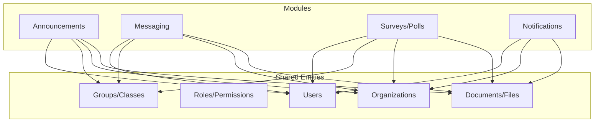
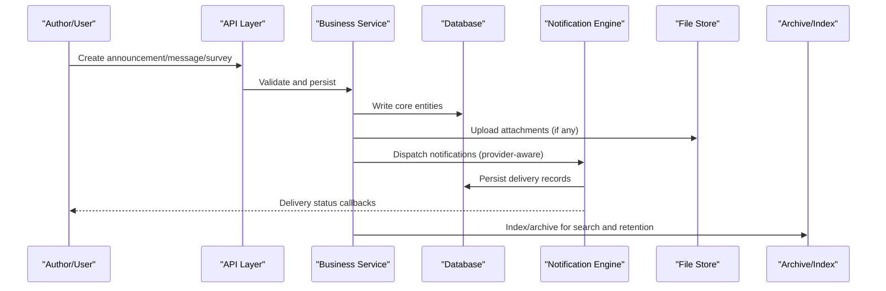
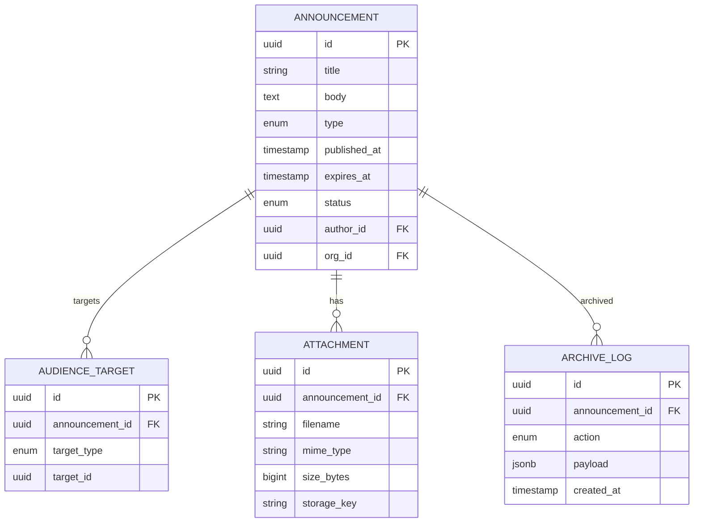
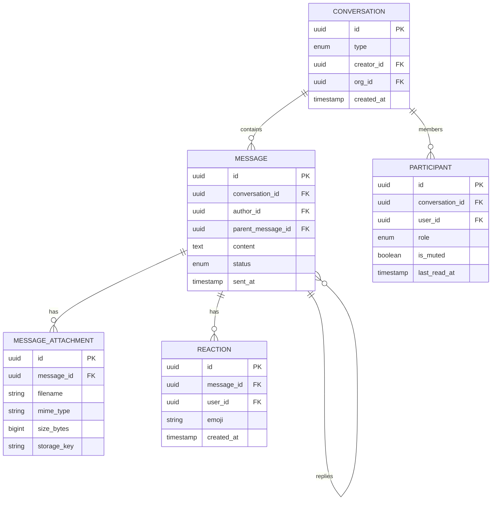
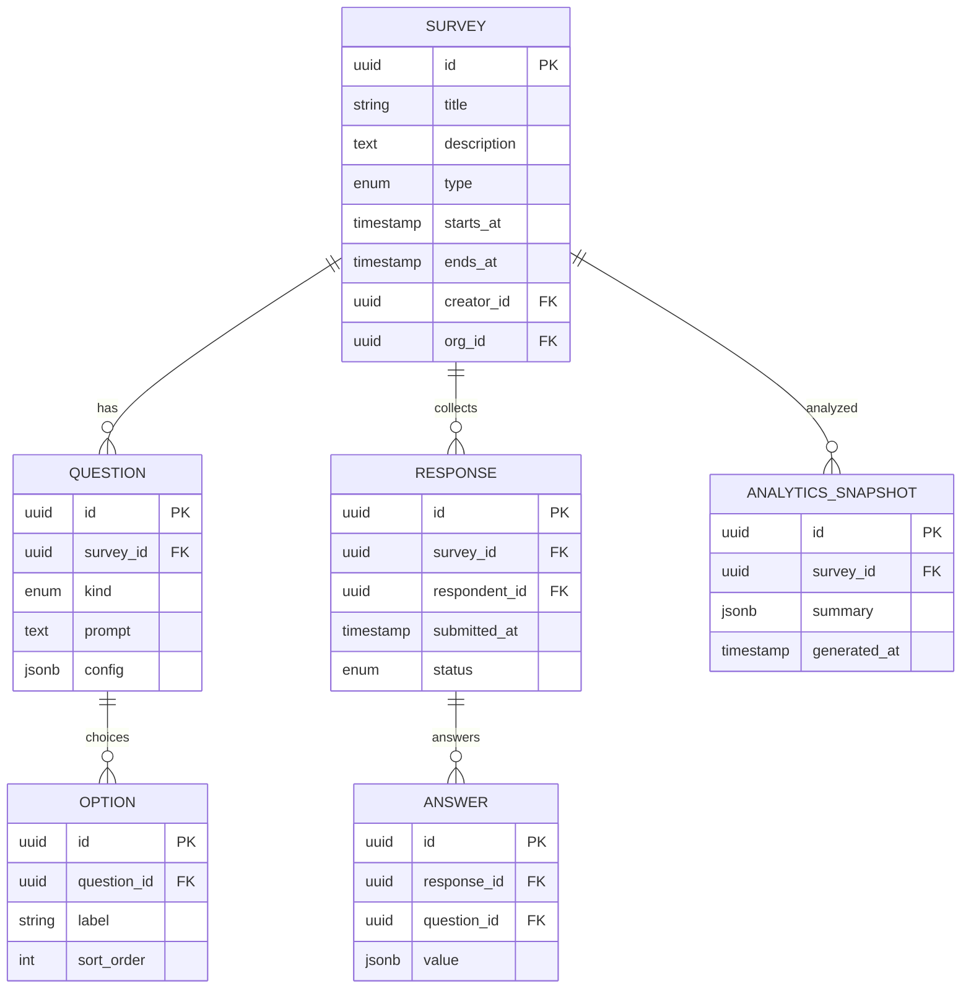
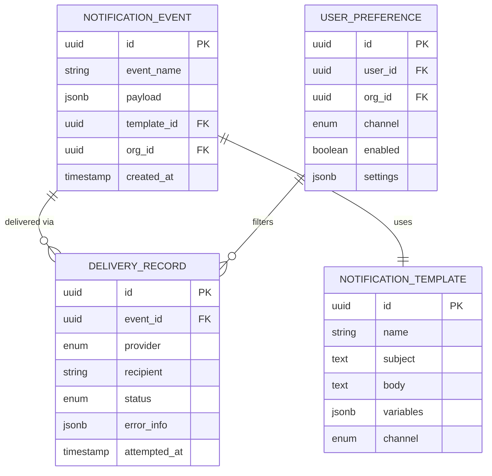
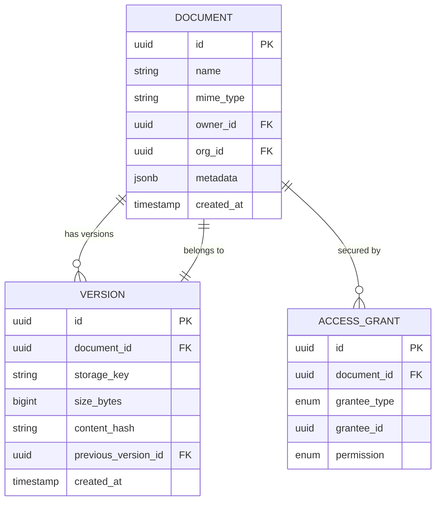
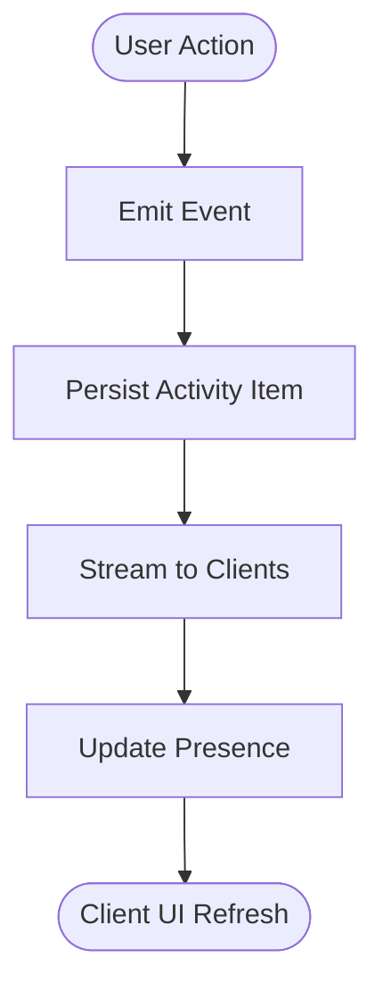
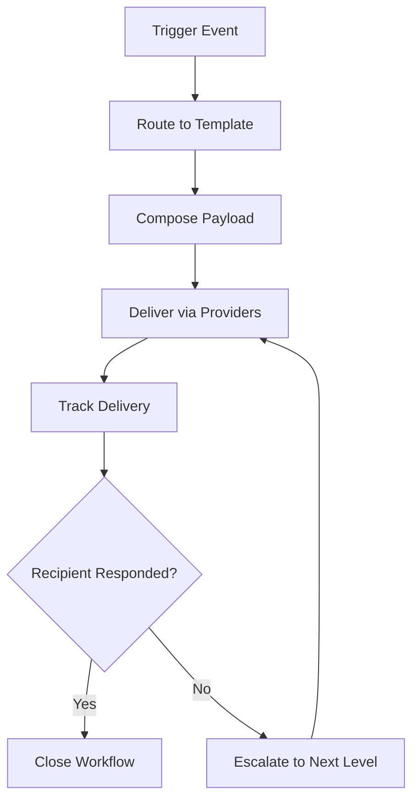
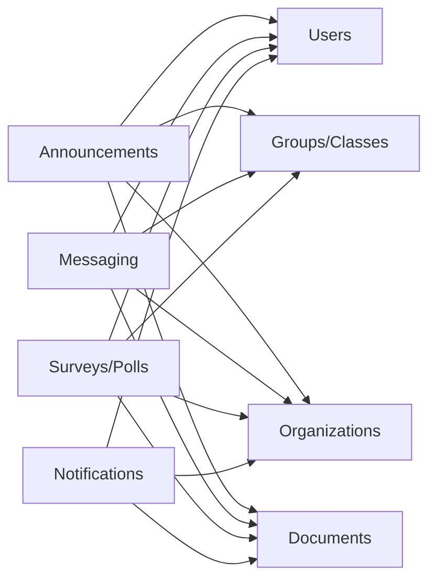

# Communication & Collaboration Schema

<cite>
**Referenced Files in This Document**
- [041-module-annonces.sql](file://backend/database/migrations/041-module-annonces.sql)
- [041-module-sondages.sql](file://backend/database/migrations/041-module-sondages.sql)
- [043-module-messagerie-complete.sql](file://backend/database/migrations/043-module-messagerie-complete.sql)
- [045-messagerie-fonctionnalites-avancees-v2.2.sql](file://backend/database/migrations/045-messagerie-fonctionnalites-avancees-v2.2.sql)
- [047-notifications-ameliorations.sql](file://backend/database/migrations/047-notifications-ameliorations.sql)
- [048-notifications-performance-optimizations.sql](file://backend/database/migrations/048-notifications-performance-optimizations.sql)
- [042-annonces-performance-optimization.sql](file://backend/database/migrations/042-annonces-performance-optimization.sql)
- [042-sondages-recurrents.sql](file://backend/database/migrations/042-sondages-recurrents.sql)
- [044-messagerie-optimisations-v2.1.sql](file://backend/database/migrations/044-messagerie-optimisations-v2.1.sql)
- [046-preferences-utilisateur-et-config.sql](file://backend/database/migrations/046-preferences-utilisateur-et-config.sql)
- [046-types-contrat-personnalises.sql](file://backend/database/migrations/046-types-contrat-personnalises.sql)
- [049-ameliorations-inscription-finances.sql](file://backend/database/migrations/049-ameliorations-inscription-finances.sql)
- [050-multi-tenant-v3-max-etablissements.sql](file://backend/database/migrations/050-multi-tenant-v3-max-etablissements.sql)
- [050-suppression-utilisateur-etablissementId.sql](file://backend/database/migrations/050-suppression-utilisateur-etablissementId.sql)
- [051-champs-preinscription-enrichis.sql](file://backend/database/migrations/051-champs-preinscription-enrichis.sql)
- [052-approche-hybride-parents.sql](file://backend/database/migrations/052-approche-hybride-parents.sql)
- [053-structure-academique-complete.sql](file://backend/database/migrations/053-structure-academique-complete.sql)
- [054-refonte-structure-academique-v2.sql](file://backend/database/migrations/054-refonte-structure-academique-v2.sql)
- [055-structure-academique-ameliorations.sql](file://backend/database/migrations/055-structure-academique-ameliorations.sql)
- [056-refactor-note-enseignant-membre-personnel.sql](file://backend/database/migrations/056-refactor-note-enseignant-membre-personnel.sql)
- [056-suppression-cycle-scolaire.sql](file://backend/database/migrations/056-suppression-cycle-scolaire.sql)
- [057-supprimer-niveau-filiere-id.sql](file://backend/database/migrations/057-supprimer-niveau-filiere-id.sql)
- [057-supprimer-parametres-dupliques-etablissement.sql](file://backend/database/migrations/057-supprimer-parametres-dupliques-etablissement.sql)
- [058-multi-tenant-structure-academique.sql](file://backend/database/migrations/058-multi-tenant-structure-academique.sql)
- [058-unifier-periode-cloturee-statut.sql](file://backend/database/migrations/058-unifier-periode-cloturee-statut.sql)
- [059-ajouter-affectation-matiere-coefficient.sql](file://backend/database/migrations/059-ajouter-affectation-matiere-coefficient.sql)
- [060-creer-table-bulletins-matieres.sql](file://backend/database/migrations/060-creer-table-bulletins-matieres.sql)
- [061-creer-table-evaluations-competences.sql](file://backend/database/migrations/061-creer-table-evaluations-competences.sql)
- [062-creer-module-emploi-du-temps.sql](file://backend/database/migrations/062-creer-module-emploi-du-temps.sql)
- [063-validateur-sous-systeme.sql](file://backend/database/migrations/063-validateur-sous-systeme.sql)
- [064-creer-templates-emploi-du-temps.sql](file://backend/database/migrations/064-creer-templates-emploi-du-temps.sql)
- [065-fix-super-admin-permissions.sql](file://backend/database/migrations/065-fix-super-admin-permissions.sql)
- [066-fix-super-admin-all-perrmission.sql](file://backend/database/migrations/066-fix-super-admin-all-perrmission.sql)
- [067-module-salles.sql](file://backend/database/migrations/067-module-salles.sql)
- [068-scoping-cycles-niveaux.sql](file://backend/database/migrations/068-scoping-cycles-niveaux.sql)
- [069-competence-unique-composite.sql](file://backend/database/migrations/069-competence-unique-composite.sql)
- [070-matiere-niveau-unique-composite.sql](file://backend/database/migrations/070-matiere-niveau-unique-composite.sql)
- [071-module-groupes-etablissements.sql](file://backend/database/migrations/071-module-groupes-etablissements.sql)
- [072-permissions-groupes-etablissements.sql](file://backend/database/migrations/072-permissions-groupes-etablissements.sql)
- [073-update-permissions-groupes.sql](file://backend/database/migrations/073-update-permissions-groupes.sql)
- [074-utilisateur-test-groupes.sql](file://backend/database/migrations/074-utilisateur-test-groupes.sql)
- [075-add-roleId-utilisateur-etablissements.sql](file://backend/database/migrations/075-add-roleId-utilisateur-etablissements.sql)
- [076-correction-permissions-groupes.sql](file://backend/database/migrations/076-correction-permissions-groupes.sql)
- [077-preferences-utilisateur-multi-tenant.sql](file://backend/database/migrations/077-preferences-utilisateur-multi-tenant.sql)
- [078-module-apparence-fonds.sql](file://backend/database/migrations/078-module-apparence-fonds.sql)
- [079-fix-contrainte-unique-preferences.sql](file://backend/database/migrations/079-fix-contrainte-unique-preferences.sql)
- [080-fix-contrainte-unique-parametres.sql](file://backend/database/migrations/080-fix-contrainte-unique-parametres.sql)
- [081-cleanup-classe-id-notes.sql](file://backend/database/migrations/081-cleanup-classe-id-notes.sql)
- [082-periode-etablissement-id.sql](file://backend/database/migrations/082-periode-etablissement-id.sql)
- [083-affectation-matiere-etablissement-id.sql](file://backend/database/migrations/083-affectation-matiere-etablissement-id.sql)
- [084-affectation-matiere-verifications.sql](file://backend/database/migrations/084-affectation-matiere-verifications.sql)
- [085-refactorisation-architecture-academique.sql](file://backend/database/migrations/085-refactorisation-architecture-academique.sql)
- [086-finalisation-architecture-academique-v2.sql](file://backend/database/migrations/086-finalisation-architecture-academique-v2.sql)
- [087-correction-migration-088-camelcase.sql](file://backend/database/migrations/087-correction-migration-088-camelcase.sql)
- [088-peuplement-architecture-academique.sql](file://backend/database/migrations/088-peuplement-architecture-academique.sql)
- [089-refactorisation-classeAnneeId.sql](file://backend/database/migrations/089-refactorisation-classeAnneeId.sql)
- [090-add-monitoring-params.sql](file://backend/database/migrations/090-add-monitoring-params.sql)
- [091-classes-salle-principale.sql](file://backend/database/migrations/091-classes-salle-principale.sql)
- [092-normalisation-annee-scolaire-cloture.sql](file://backend/database/migrations/092-normalisation-annee-scolaire-cloture.sql)
- [093-periodes-hierarchie.sql](file://backend/database/migrations/093-periodes-hierarchie.sql)
- [094-templates-periode-personnalisables.sql](file://backend/database/migrations/094-templates-periode-personnalisables.sql)
- [095-refonte-periodes-niveaux-configurables.sql](file://backend/database/migrations/095-refonte-periodes-niveaux-configurables.sql)
- [096-migration-templates-v5.sql](file://backend/database/migrations/096-migration-templates-v5.sql)
- [097-rename-sequence-to-evaluation.sql](file://backend/database/migrations/097-rename-sequence-to-evaluation.sql)
- [098-cleanup-configuration-modules-actif.sql](file://backend/database/migrations/098-cleanup-configuration-modules-actif.sql)
- [099-refactor-salle-principale.sql](file://backend/database/migrations/099-refactor-salle-principale.sql)
- [100-classes-salle-principale.sql](file://backend/database/migrations/100-classes-salle-principale.sql)
- [101-normalisation-annee-scolaire-cloture.sql](file://backend/database/migrations/101-normalisation-annee-scolaire-cloture.sql)
- [102-periodes-hierarchie.sql](file://backend/database/migrations/102-periodes-hierarchie.sql)
- [103-templates-periode-personnalisables.sql](file://backend/database/migrations/103-templates-periode-personnalisables.sql)
- [104-refonte-periodes-niveaux-configurables.sql](file://backend/database/migrations/104-refonte-periodes-niveaux-configurables.sql)
- [105-migration-templates-v5.sql](file://backend/database/migrations/105-migration-templates-v5.sql)
- [106-rename-sequence-to-evaluation.sql](file://backend/database/migrations/106-rename-sequence-to-evaluation.sql)
- [107-cleanup-configuration-modules-actif.sql](file://backend/database/migrations/107-cleanup-configuration-modules-actif.sql)
- [108-refactor-salle-principale.sql](file://backend/database/migrations/108-refactor-salle-principale.sql)
- [MIGRATION-076-SUCCESS.md](file://backend/database/migrations/MIGRATION-076-SUCCESS.md)
- [PERMISSIONS-GROUPES-SEED-UPDATE.md](file://backend/database/migrations/PERMISSIONS-GROUPES-SEED-UPDATE.md)
- [README-075-GROUPES.md](file://backend/database/migrations/README-075-GROUPES.md)
- [migrate-rbac-v3.sql](file://backend/database/migrations/migrate-rbac-v3.sql)
- [app.ts](file://backend/src/app.ts)
- [index.ts](file://backend/src/index.ts)
- [route-registry.ts](file://backend/src/routes/route-registry.ts)
- [database.config.ts](file://backend/src/config/database.config.ts)
- [env.config.ts](file://backend/src/config/env.config.ts)
- [data-source.ts](file://backend/src/database/data-source.ts)
- [index.ts](file://backend/src/modules/index.ts)
- [annonces.controller.ts](file://backend/src/modules/annonces/controllers/annonces.controller.ts)
- [annonces.service.ts](file://backend/src/modules/annonces/services/annonces.service.ts)
- [messagerie.controller.ts](file://backend/src/modules/messagerie/controllers/messagerie.controller.ts)
- [messagerie.service.ts](file://backend/src/modules/messagerie/services/messagerie.service.ts)
- [notifications.controller.ts](file://backend/src/modules/notifications/controllers/notifications.controller.ts)
- [notifications.service.ts](file://backend/src/modules/notifications/services/notifications.service.ts)
- [sondages.controller.ts](file://backend/src/modules/sondages/controllers/sondages.controller.ts)
- [sondages.service.ts](file://backend/src/modules/sondages/services/sondages.service.ts)
</cite>

## Table of Contents
1. [Introduction](#introduction)
2. [Project Structure](#project-structure)
3. [Core Components](#core-components)
4. [Architecture Overview](#architecture-overview)
5. [Detailed Component Analysis](#detailed-component-analysis)
6. [Dependency Analysis](#dependency-analysis)
7. [Performance Considerations](#performance-considerations)
8. [Troubleshooting Guide](#troubleshooting-guide)
9. [Conclusion](#conclusion)
10. [Appendices](#appendices)

## Introduction
This document describes the data model and architecture for eLISAschool’s communication and collaboration features. It covers announcements (broadcasts, audiences, archiving), internal messaging (direct messages, departmental channels, threading), surveys and polls (questions, responses, analytics), notifications (providers, delivery tracking, preferences), file sharing and versioning, real-time communication (presence and activity feeds), templates and automation, and escalation workflows. The goal is to provide a clear entity relationship view from message creation through delivery and archiving.

## Project Structure
The communication and collaboration capabilities are implemented as backend modules with corresponding database migrations:
- Announcements module: broadcast communications, audience scoping, and archival
- Messaging module: direct messages, group/channel-based threads, read receipts, attachments
- Surveys/Polls module: question management, response collection, analytics
- Notifications module: provider configuration, delivery tracking, user preferences
- Shared entities: users, roles, organizations, academic structure, groups, documents/files

[No sources needed since this diagram shows conceptual workflow, not actual code structure]

**Section sources**
- [app.ts](file://backend/src/app.ts)
- [index.ts](file://backend/src/index.ts)
- [route-registry.ts](file://backend/src/routes/route-registry.ts)
- [index.ts](file://backend/src/modules/index.ts)

## Core Components
- Announcement system: supports broadcasts, target audiences (users, groups, classes), scheduling, visibility, and archiving.
- Internal messaging: supports direct messages, channel/group conversations, threaded replies, read receipts, and attachments.
- Surveys and polls: supports questions, options, responses, deadlines, and aggregated analytics.
- Notification engine: supports multiple providers, delivery tracking, retry policies, and per-user preferences.
- File sharing and versioning: supports uploads, metadata, access control, and version history.
- Real-time features: presence indicators and activity feeds (conceptual; implementation details may vary).
- Templates and automation: reusable content templates, scheduled dispatch, and escalation rules.

**Section sources**
- [041-module-annonces.sql](file://backend/database/migrations/041-module-annonces.sql)
- [043-module-messagerie-complete.sql](file://backend/database/migrations/043-module-messagerie-complete.sql)
- [045-messagerie-fonctionnalites-avancees-v2.2.sql](file://backend/database/migrations/045-messagerie-fonctionnalites-avancees-v2.2.sql)
- [041-module-sondages.sql](file://backend/database/migrations/041-module-sondages.sql)
- [047-notifications-ameliorations.sql](file://backend/database/migrations/047-notifications-ameliorations.sql)
- [048-notifications-performance-optimizations.sql](file://backend/database/migrations/048-notifications-performance-optimizations.sql)
- [046-preferences-utilisateur-et-config.sql](file://backend/database/migrations/046-preferences-utilisateur-et-config.sql)

## Architecture Overview
End-to-end flow from creation to delivery and archiving:

**Diagram sources**
- [041-module-annonces.sql](file://backend/database/migrations/041-module-annonces.sql)
- [043-module-messagerie-complete.sql](file://backend/database/migrations/043-module-messagerie-complete.sql)
- [041-module-sondages.sql](file://backend/database/migrations/041-module-sondages.sql)
- [047-notifications-ameliorations.sql](file://backend/database/migrations/047-notifications-ameliorations.sql)
- [048-notifications-performance-optimizations.sql](file://backend/database/migrations/048-notifications-performance-optimizations.sql)

## Detailed Component Analysis

### Announcement System
- Broadcasts: publish-wide or scoped announcements with scheduling and expiration.
- Target audiences: users, groups/classes, departments, custom segments.
- Message archiving: immutable logs, retention policies, and search indexing.

Key entities and relationships:
- Announcement: title, body, type, schedule, visibility, status, author, organization scope.
- Audience membership: mapping between announcements and target groups/users.
- Attachment: files linked to announcements with access controls.
- Archive log: immutable record of publication events and changes.

**Diagram sources**
- [041-module-annonces.sql](file://backend/database/migrations/041-module-annonces.sql)
- [042-annonces-performance-optimization.sql](file://backend/database/migrations/042-annonces-performance-optimization.sql)

**Section sources**
- [041-module-annonces.sql](file://backend/database/migrations/041-module-annonces.sql)
- [042-annonces-performance-optimization.sql](file://backend/database/migrations/042-annonces-performance-optimization.sql)

### Internal Messaging
- Direct messages: one-to-one or small group chats.
- Departmental communication: channel/group-based conversations with permissions.
- Threading: parent-child message relationships for organized discussions.
- Read receipts and reactions: track engagement and status.

Key entities and relationships:
- Conversation: represents a chat thread or channel.
- Message: individual message with optional parent reference for threading.
- Participant: users in a conversation with roles and read state.
- Attachment: files attached to messages.
- Reaction: emoji or custom reactions on messages.

**Diagram sources**
- [043-module-messagerie-complete.sql](file://backend/database/migrations/043-module-messagerie-complete.sql)
- [044-messagerie-optimisations-v2.1.sql](file://backend/database/migrations/044-messagerie-optimisations-v2.1.sql)
- [045-messagerie-fonctionnalites-avancees-v2.2.sql](file://backend/database/migrations/045-messagerie-fonctionnalites-avancees-v2.2.sql)

**Section sources**
- [043-module-messagerie-complete.sql](file://backend/database/migrations/043-module-messagerie-complete.sql)
- [044-messagerie-optimisations-v2.1.sql](file://backend/database/migrations/044-messagerie-optimisations-v2.1.sql)
- [045-messagerie-fonctionnalites-avancees-v2.2.sql](file://backend/database/migrations/045-messagerie-fonctionnalites-avancees-v2.2.sql)

### Surveys and Polling
- Question management: single-choice, multiple-choice, rating scales, open-ended.
- Response collection: per-user answers, deadlines, anonymity options.
- Analytics: aggregates, exportable summaries, and trend analysis.

Key entities and relationships:
- Survey: metadata, visibility, schedule, and settings.
- Question: definition and constraints within a survey.
- Option: choices for structured questions.
- Response: user’s answer set for a survey instance.
- Answer: per-question result linked to a response.
- Analytics snapshot: precomputed aggregates for performance.

**Diagram sources**
- [041-module-sondages.sql](file://backend/database/migrations/041-module-sondages.sql)
- [042-sondages-recurrents.sql](file://backend/database/migrations/042-sondages-recurrents.sql)

**Section sources**
- [041-module-sondages.sql](file://backend/database/migrations/041-module-sondages.sql)
- [042-sondages-recurrents.sql](file://backend/database/migrations/042-sondages-recurrents.sql)

### Notification Engine
- Provider configurations: email, SMS, push, in-app, webhooks.
- Delivery tracking: per-event logs, retries, failures, and acknowledgments.
- User preferences: opt-in/out by channel and context.

Key entities and relationships:
- Notification template: reusable content with placeholders.
- Notification event: trigger-bound payload and routing rules.
- Delivery record: per-provider attempt and outcome.
- User preference: channel enablement and quiet hours.

**Diagram sources**
- [047-notifications-ameliorations.sql](file://backend/database/migrations/047-notifications-ameliorations.sql)
- [048-notifications-performance-optimizations.sql](file://backend/database/migrations/048-notifications-performance-optimizations.sql)
- [046-preferences-utilisateur-et-config.sql](file://backend/database/migrations/046-preferences-utilisateur-et-config.sql)

**Section sources**
- [047-notifications-ameliorations.sql](file://backend/database/migrations/047-notifications-ameliorations.sql)
- [048-notifications-performance-optimizations.sql](file://backend/database/migrations/048-notifications-performance-optimizations.sql)
- [046-preferences-utilisateur-et-config.sql](file://backend/database/migrations/046-preferences-utilisateur-et-config.sql)

### File Sharing and Version Control
- Documents: upload, metadata, access control, and organization scoping.
- Versions: incremental updates with lineage and rollback support.
- Attachments: cross-feature linking (announcements, messages, surveys).

Key entities and relationships:
- Document: owner, organization, tags, and access policy.
- Version: content hash, size, storage key, and parent version.
- Access grant: user/group-level permissions on documents.

**Diagram sources**
- [041-module-annonces.sql](file://backend/database/migrations/041-module-annonces.sql)
- [043-module-messagerie-complete.sql](file://backend/database/migrations/043-module-messagerie-complete.sql)
- [041-module-sondages.sql](file://backend/database/migrations/041-module-sondages.sql)

**Section sources**
- [041-module-annonces.sql](file://backend/database/migrations/041-module-annonces.sql)
- [043-module-messagerie-complete.sql](file://backend/database/migrations/043-module-messagerie-complete.sql)
- [041-module-sondages.sql](file://backend/database/migrations/041-module-sondages.sql)

### Real-Time Communication Features
- Presence indicators: online/offline status and last seen timestamps.
- Activity feeds: chronological streams of actions across modules.
- Live updates: optimistic UI with server-backed persistence.

Conceptual entities:
- Presence: user identifier, status, last active timestamp.
- Activity item: actor, action, resource reference, timestamp.

[No sources needed since this diagram shows conceptual workflow, not actual code structure]

### Communication Templates, Automation, and Escalation
- Templates: reusable content for announcements, messages, and notifications.
- Automation: scheduled dispatch based on triggers and conditions.
- Escalation: fallback routes and priority upgrades when recipients do not respond.

[No sources needed since this diagram shows conceptual workflow, not actual code structure]

## Dependency Analysis
Module-level dependencies and shared entities:

**Diagram sources**
- [041-module-annonces.sql](file://backend/database/migrations/041-module-annonces.sql)
- [043-module-messagerie-complete.sql](file://backend/database/migrations/043-module-messagerie-complete.sql)
- [041-module-sondages.sql](file://backend/database/migrations/041-module-sondages.sql)
- [047-notifications-ameliorations.sql](file://backend/database/migrations/047-notifications-ameliorations.sql)

**Section sources**
- [041-module-annonces.sql](file://backend/database/migrations/041-module-annonces.sql)
- [043-module-messagerie-complete.sql](file://backend/database/migrations/043-module-messagerie-complete.sql)
- [041-module-sondages.sql](file://backend/database/migrations/041-module-sondages.sql)
- [047-notifications-ameliorations.sql](file://backend/database/migrations/047-notifications-ameliorations.sql)

## Performance Considerations
- Indexing strategies for high-volume tables (messages, deliveries, activities).
- Partitioning or archival for long-lived logs and archives.
- Caching for frequently accessed templates and preferences.
- Batch processing for analytics snapshots and notification dispatch.

[No sources needed since this section provides general guidance]

## Troubleshooting Guide
Common issues and diagnostics:
- Missing indexes causing slow queries on messages and deliveries.
- Delivery failures due to provider misconfiguration or rate limits.
- Preference conflicts leading to suppressed notifications.
- Attachment storage errors impacting message and announcement rendering.

Recommended checks:
- Verify migration execution and schema consistency.
- Inspect delivery logs for error codes and retry counts.
- Validate user preferences and quiet hours settings.
- Confirm storage connectivity and permissions.

**Section sources**
- [048-notifications-performance-optimizations.sql](file://backend/database/migrations/048-notifications-performance-optimizations.sql)
- [042-annonces-performance-optimization.sql](file://backend/database/migrations/042-annonces-performance-optimization.sql)
- [044-messagerie-optimisations-v2.1.sql](file://backend/database/migrations/044-messagerie-optimisations-v2.1.sql)

## Conclusion
The eLISAschool communication and collaboration schema provides a robust foundation for broadcasts, messaging, surveys, notifications, and file sharing. Entity relationships ensure consistent scoping by organization and user roles, while delivery tracking and archiving support reliability and compliance. The design balances flexibility with performance through targeted optimizations and clear separation of concerns across modules.

[No sources needed since this section summarizes without analyzing specific files]

## Appendices

### Database Configuration and Data Source
- Database configuration and environment setup under configuration modules.
- Data source initialization and connection management.

**Section sources**
- [database.config.ts](file://backend/src/config/database.config.ts)
- [env.config.ts](file://backend/src/config/env.config.ts)
- [data-source.ts](file://backend/src/database/data-source.ts)

### Module Registration and Routing
- Centralized module registration and route registry for API endpoints.

**Section sources**
- [index.ts](file://backend/src/modules/index.ts)
- [route-registry.ts](file://backend/src/routes/route-registry.ts)

### Controller and Service Interfaces
- Controllers and services for announcements, messaging, notifications, and surveys define API contracts and business logic boundaries.

**Section sources**
- [annonces.controller.ts](file://backend/src/modules/annonces/controllers/annonces.controller.ts)
- [annonces.service.ts](file://backend/src/modules/annonces/services/annonces.service.ts)
- [messagerie.controller.ts](file://backend/src/modules/messagerie/controllers/messagerie.controller.ts)
- [messagerie.service.ts](file://backend/src/modules/messagerie/services/messagerie.service.ts)
- [notifications.controller.ts](file://backend/src/modules/notifications/controllers/notifications.controller.ts)
- [notifications.service.ts](file://backend/src/modules/notifications/services/notifications.service.ts)
- [sondages.controller.ts](file://backend/src/modules/sondages/controllers/sondages.controller.ts)
- [sondages.service.ts](file://backend/src/modules/sondages/services/sondages.service.ts)