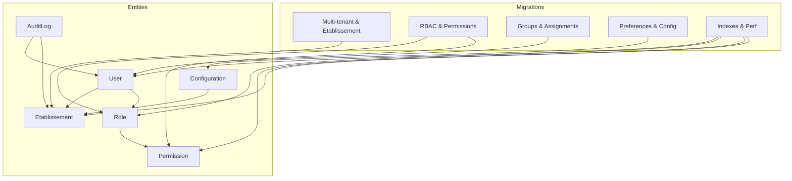
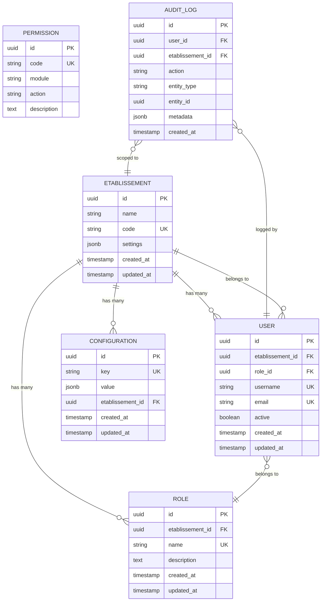
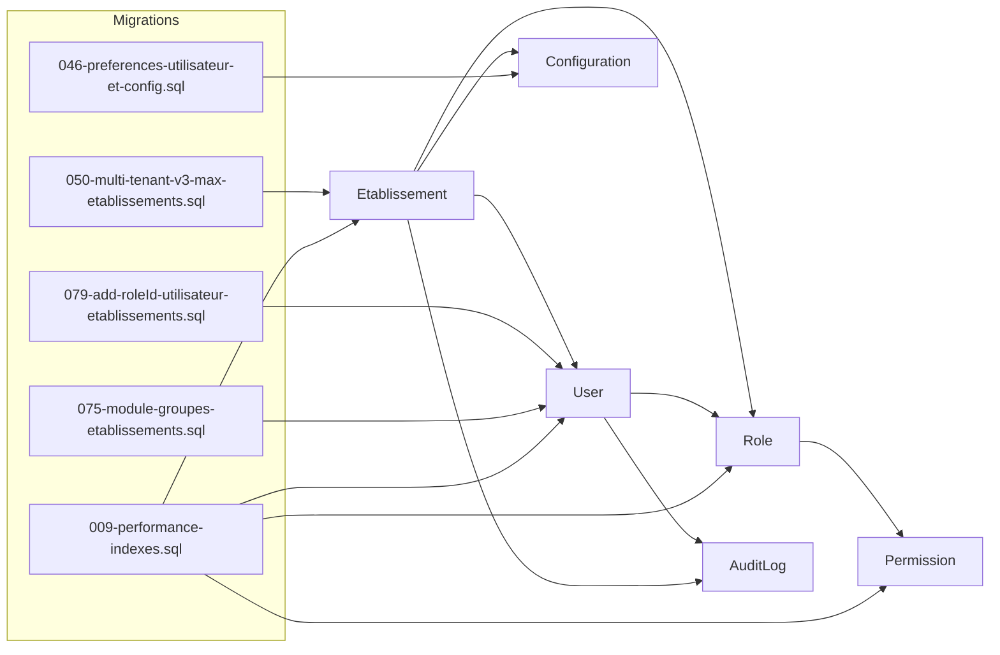

# Core Entities

<cite>
**Referenced Files in This Document**
- [database/migrations/050-multi-tenant-v3-max-etablissements.sql](file://backend/database/migrations/050-multi-tenant-v3-max-etablissements.sql)
- [database/migrations/079-add-roleId-utilisateur-etablissements.sql](file://backend/database/migrations/079-add-roleId-utilisateur-etablissements.sql)
- [database/migrations/080-preferences-utilisateur-multi-tenant.sql](file://backend/database/migrations/080-preferences-utilisateur-multi-tenant.sql)
- [database/migrations/046-preferences-globales.sql](file://backend/database/migrations/046-preferences-globales.sql)
- [database/migrations/046-preferences-utilisateur-et-config.sql](file://backend/database/migrations/046-preferences-utilisateur-et-config.sql)
- [database/migrations/082-fix-contrainte-unique-preferences.sql](file://backend/database/migrations/082-fix-contrainte-unique-preferences.sql)
- [database/migrations/083-fix-contrainte-unique-parametres.sql](file://backend/database/migrations/083-fix-contrainte-unique-parametres.sql)
- [database/migrations/016-module-personnel-rh-phase1.sql](file://backend/database/migrations/016-module-personnel-rh-phase1.sql)
- [database/migrations/021-module-personnel-rh-permissions-attribution.sql](file://backend/database/migrations/021-module-personnel-rh-permissions-attribution.sql)
- [database/migrations/033-workflow-permissions-nouveaux-modules.sql](file://backend/database/migrations/033-workflow-permissions-nouveaux-modules.sql)
- [database/migrations/040-reset-capabilities.sql](file://backend/database/migrations/040-reset-capabilities.sql)
- [database/migrations/043-permissions-critiques-manquantes.sql](file://backend/database/migrations/043-permissions-critiques-manquantes.sql)
- [database/migrations/069-fix-super-admin-permissions.sql](file://backend/database/migrations/069-fix-super-admin-permissions.sql)
- [database/migrations/070-fix-super-admin-all-permission.sql](file://backend/database/migrations/070-fix-super-admin-all-permission.sql)
- [database/migrations/075-module-groupes-etablissements.sql](file://backend/database/migrations/075-module-groupes-etablissements.sql)
- [database/migrations/076-permissions-groupes-etablissements.sql](file://backend/database/migrations/076-permissions-groupes-etablissements.sql)
- [database/migrations/077-update-permissions-groupes.sql](file://backend/database/migrations/077-update-permissions-groupes.sql)
- [database/migrations/078-utilisateur-test-groupes.sql](file://backend/database/migrations/078-utilisateur-test-groupes.sql)
- [database/migrations/079-correction-permissions-groupes.sql](file://backend/database/migrations/079-correction-permissions-groupes.sql)
- [database/migrations/099-add-monitoring-params.sql](file://backend/database/migrations/099-add-monitoring-params.sql)
- [database/migrations/009-performance-indexes.sql](file://backend/database/migrations/009-performance-indexes.sql)
- [database/migrations/047-optimisations-performance-v3.1.sql](file://backend/database/migrations/047-optimisations-performance-v3.1.sql)
- [database/migrations/048-notifications-performance-optimizations.sql](file://backend/database/migrations/048-notifications-performance-optimizations.sql)
- [database/migrations/038-index-performance-gamification-suivi.ts](file://backend/database/migrations/038-index-performance-gamification-suivi.ts)
- [src/modules/audit/entities/AuditLog.entity.ts](file://backend/src/modules/audit/entities/AuditLog.entity.ts)
- [src/modules/auth/entities/User.entity.ts](file://backend/src/modules/auth/entities/User.entity.ts)
- [src/modules/rbac/entities/Role.entity.ts](file://backend/src/modules/rbac/entities/Role.entity.ts)
- [src/modules/rbac/entities/Permission.entity.ts](file://backend/src/modules/rbac/entities/Permission.entity.ts)
- [src/modules/etablissement/entities/Etablissement.entity.ts](file://backend/src/modules/etablissement/entities/Etablissement.entity.ts)
- [src/modules/configuration/entities/Configuration.entity.ts](file://backend/src/modules/configuration/entities/Configuration.entity.ts)
</cite>

## Table of Contents
1. [Introduction](#introduction)
2. [Project Structure](#project-structure)
3. [Core Components](#core-components)
4. [Architecture Overview](#architecture-overview)
5. [Detailed Component Analysis](#detailed-component-analysis)
6. [Dependency Analysis](#dependency-analysis)
7. [Performance Considerations](#performance-considerations)
8. [Troubleshooting Guide](#troubleshooting-guide)
9. [Conclusion](#conclusion)

## Introduction
This document describes the foundational data model for eLISAschool, focusing on core entities that underpin multi-tenant operations and role-based access control (RBAC). It covers User, Role, Permission, Etablissement (Institution), and Configuration, including field semantics, constraints, relationships, tenant isolation patterns, primary key strategies, indexes, and performance considerations. It also explains group-based access patterns, audit trail storage, and system configuration persistence.

## Project Structure
The core entities are implemented as TypeORM entities within their respective modules and are initialized by database migrations. The most relevant locations are:
- Entity definitions under src/modules/*/entities
- Database schema migrations under backend/database/migrations
- Performance index migrations under backend/database/migrations

**Diagram sources**
- [database/migrations/050-multi-tenant-v3-max-etablissements.sql](file://backend/database/migrations/050-multi-tenant-v3-max-etablissements.sql)
- [database/migrations/079-add-roleId-utilisateur-etablissements.sql](file://backend/database/migrations/079-add-roleId-utilisateur-etablissements.sql)
- [database/migrations/075-module-groupes-etablissements.sql](file://backend/database/migrations/075-module-groupes-etablissements.sql)
- [database/migrations/046-preferences-utilisateur-et-config.sql](file://backend/database/migrations/046-preferences-utilisateur-et-config.sql)
- [database/migrations/009-performance-indexes.sql](file://backend/database/migrations/009-performance-indexes.sql)
- [src/modules/auth/entities/User.entity.ts](file://backend/src/modules/auth/entities/User.entity.ts)
- [src/modules/rbac/entities/Role.entity.ts](file://backend/src/modules/rbac/entities/Role.entity.ts)
- [src/modules/rbac/entities/Permission.entity.ts](file://backend/src/modules/rbac/entities/Permission.entity.ts)
- [src/modules/etablissement/entities/Etablissement.entity.ts](file://backend/src/modules/etablissement/entities/Etablissement.entity.ts)
- [src/modules/configuration/entities/Configuration.entity.ts](file://backend/src/modules/configuration/entities/Configuration.entity.ts)
- [src/modules/audit/entities/AuditLog.entity.ts](file://backend/src/modules/audit/entities/AuditLog.entity.ts)

**Section sources**
- [database/migrations/050-multi-tenant-v3-max-etablissements.sql](file://backend/database/migrations/050-multi-tenant-v3-max-etablissements.sql)
- [database/migrations/079-add-roleId-utilisateur-etablissements.sql](file://backend/database/migrations/079-add-roleId-utilisateur-etablissements.sql)
- [database/migrations/075-module-groupes-etablissements.sql](file://backend/database/migrations/075-module-groupes-etablissements.sql)
- [database/migrations/046-preferences-utilisateur-et-config.sql](file://backend/database/migrations/046-preferences-utilisateur-et-config.sql)
- [database/migrations/009-performance-indexes.sql](file://backend/database/migrations/009-performance-indexes.sql)
- [src/modules/auth/entities/User.entity.ts](file://backend/src/modules/auth/entities/User.entity.ts)
- [src/modules/rbac/entities/Role.entity.ts](file://backend/src/modules/rbac/entities/Role.entity.ts)
- [src/modules/rbac/entities/Permission.entity.ts](file://backend/src/modules/rbac/entities/Permission.entity.ts)
- [src/modules/etablissement/entities/Etablissement.entity.ts](file://backend/src/modules/etablissement/entities/Etablissement.entity.ts)
- [src/modules/configuration/entities/Configuration.entity.ts](file://backend/src/modules/configuration/entities/Configuration.entity.ts)
- [src/modules/audit/entities/AuditLog.entity.ts](file://backend/src/modules/audit/entities/AuditLog.entity.ts)

## Core Components
This section summarizes the core entities and their responsibilities:
- Etablissement: Represents a school or institution; serves as the tenant boundary.
- User: System user with authentication and profile data; scoped to an Etablissement.
- Role: Defines a set of permissions assigned to users within a tenant context.
- Permission: Fine-grained capability identifiers used by RBAC.
- Configuration: Stores application and tenant-scoped settings.
- AuditLog: Records user actions for compliance and troubleshooting.

Key design principles:
- Multi-tenancy via Etablissement foreign keys on core tables.
- RBAC with permission inheritance through roles and optional group-based assignments.
- Global and tenant-scoped configuration using unique constraints to avoid duplicates.
- Indexing strategy optimized for common queries and tenant scoping.

**Section sources**
- [database/migrations/050-multi-tenant-v3-max-etablissements.sql](file://backend/database/migrations/050-multi-tenant-v3-max-etablissements.sql)
- [database/migrations/079-add-roleId-utilisateur-etablissements.sql](file://backend/database/migrations/079-add-roleId-utilisateur-etablissements.sql)
- [database/migrations/046-preferences-utilisateur-et-config.sql](file://backend/database/migrations/046-preferences-utilisateur-et-config.sql)
- [database/migrations/075-module-groupes-etablissements.sql](file://backend/database/migrations/075-module-groupes-etablissements.sql)
- [src/modules/etablissement/entities/Etablissement.entity.ts](file://backend/src/modules/etablissement/entities/Etablissement.entity.ts)
- [src/modules/auth/entities/User.entity.ts](file://backend/src/modules/auth/entities/User.entity.ts)
- [src/modules/rbac/entities/Role.entity.ts](file://backend/src/modules/rbac/entities/Role.entity.ts)
- [src/modules/rbac/entities/Permission.entity.ts](file://backend/src/modules/rbac/entities/Permission.entity.ts)
- [src/modules/configuration/entities/Configuration.entity.ts](file://backend/src/modules/configuration/entities/Configuration.entity.ts)
- [src/modules/audit/entities/AuditLog.entity.ts](file://backend/src/modules/audit/entities/AuditLog.entity.ts)

## Architecture Overview
The following diagram shows how core entities relate to each other and how multi-tenancy is enforced at the data layer.

**Diagram sources**
- [database/migrations/050-multi-tenant-v3-max-etablissements.sql](file://backend/database/migrations/050-multi-tenant-v3-max-etablissements.sql)
- [database/migrations/079-add-roleId-utilisateur-etablissements.sql](file://backend/database/migrations/079-add-roleId-utilisateur-etablissements.sql)
- [database/migrations/046-preferences-utilisateur-et-config.sql](file://backend/database/migrations/046-preferences-utilisateur-et-config.sql)
- [src/modules/etablissement/entities/Etablissement.entity.ts](file://backend/src/modules/etablissement/entities/Etablissement.entity.ts)
- [src/modules/auth/entities/User.entity.ts](file://backend/src/modules/auth/entities/User.entity.ts)
- [src/modules/rbac/entities/Role.entity.ts](file://backend/src/modules/rbac/entities/Role.entity.ts)
- [src/modules/rbac/entities/Permission.entity.ts](file://backend/src/modules/rbac/entities/Permission.entity.ts)
- [src/modules/configuration/entities/Configuration.entity.ts](file://backend/src/modules/configuration/entities/Configuration.entity.ts)
- [src/modules/audit/entities/AuditLog.entity.ts](file://backend/src/modules/audit/entities/AuditLog.entity.ts)

## Detailed Component Analysis

### Etablissement (Institution)
- Purpose: Tenant root representing a school or institution.
- Primary Key: UUID-based identifier.
- Key Fields:
  - name: Human-readable institution name.
  - code: Unique short code for the institution.
  - settings: JSONB container for tenant-specific options.
  - Timestamps: created_at, updated_at.
- Constraints:
  - Unique constraint on code to prevent duplicate institutions.
- Relationships:
  - One-to-many with User, Role, Configuration.
  - Referenced by AuditLog for tenant-scoped auditing.
- Multi-tenancy:
  - All tenant-scoped entities include etablissement_id foreign key.
- Indexes:
  - Typically indexed on code for lookups; additional indexes may be added based on query patterns.

**Section sources**
- [database/migrations/050-multi-tenant-v3-max-etablissements.sql](file://backend/database/migrations/050-multi-tenant-v3-max-etablissements.sql)
- [src/modules/etablissement/entities/Etablissement.entity.ts](file://backend/src/modules/etablissement/entities/Etablissement.entity.ts)

### User
- Purpose: Authentication and identity for individuals within a tenant.
- Primary Key: UUID-based identifier.
- Key Fields:
  - etablissement_id: Foreign key to Etablissement (tenant scope).
  - role_id: Foreign key to Role (role assignment per tenant).
  - username: Unique login identifier.
  - email: Unique contact address.
  - active: Boolean flag for account status.
  - Timestamps: created_at, updated_at.
- Constraints:
  - Unique constraints on username and email.
  - Not-null constraints on essential fields.
- Relationships:
  - Belongs to one Etablissement and one Role.
  - Referenced by AuditLog for action attribution.
- Multi-tenancy:
  - Queries must filter by etablissement_id to ensure isolation.
- Indexes:
  - Indexes on username, email, and etablissement_id for fast lookups and tenant-scoped queries.

**Section sources**
- [database/migrations/079-add-roleId-utilisateur-etablissements.sql](file://backend/database/migrations/079-add-roleId-utilisateur-etablissements.sql)
- [src/modules/auth/entities/User.entity.ts](file://backend/src/modules/auth/entities/User.entity.ts)

### Role
- Purpose: Group of permissions assigned to users within a tenant.
- Primary Key: UUID-based identifier.
- Key Fields:
  - etablissement_id: Foreign key to Etablissement (tenant scope).
  - name: Unique role name within the tenant.
  - description: Optional human-readable description.
  - Timestamps: created_at, updated_at.
- Constraints:
  - Unique constraint on name per tenant (enforced via composite uniqueness if applicable).
- Relationships:
  - Belongs to one Etablissement.
  - Many Users can belong to one Role.
- RBAC Integration:
  - Roles aggregate Permissions; permission checks resolve through Role membership.

**Section sources**
- [database/migrations/016-module-personnel-rh-phase1.sql](file://backend/database/migrations/016-module-personnel-rh-phase1.sql)
- [src/modules/rbac/entities/Role.entity.ts](file://backend/src/modules/rbac/entities/Role.entity.ts)

### Permission
- Purpose: Atomic capabilities identified by codes, optionally grouped by module/action.
- Primary Key: UUID-based identifier.
- Key Fields:
  - code: Unique permission code.
  - module: Logical grouping (e.g., “users”, “finances”).
  - action: Specific operation (e.g., “create”, “read”, “update”, “delete”).
  - description: Optional explanation.
- Constraints:
  - Unique constraint on code to prevent duplication.
- Relationships:
  - Aggregated by Roles; no direct tenant foreign key (permissions are global catalog entries).
- Inheritance Pattern:
  - Roles inherit permissions; higher-level roles may include all permissions of lower-level roles.

**Section sources**
- [database/migrations/033-workflow-permissions-nouveaux-modules.sql](file://backend/database/migrations/033-workflow-permissions-nouveaux-modules.sql)
- [database/migrations/040-reset-capabilities.sql](file://backend/database/migrations/040-reset-capabilities.sql)
- [database/migrations/043-permissions-critiques-manquantes.sql](file://backend/database/migrations/043-permissions-critiques-manquantes.sql)
- [database/migrations/069-fix-super-admin-permissions.sql](file://backend/database/migrations/069-fix-super-admin-permissions.sql)
- [database/migrations/070-fix-super-admin-all-permission.sql](file://backend/database/migrations/070-fix-super-admin-all-permission.sql)
- [src/modules/rbac/entities/Permission.entity.ts](file://backend/src/modules/rbac/entities/Permission.entity.ts)

### Configuration
- Purpose: Application and tenant-scoped settings stored as key-value pairs.
- Primary Key: UUID-based identifier.
- Key Fields:
  - key: Unique setting key.
  - value: JSONB payload for flexible configuration values.
  - etablissement_id: Nullable; when present, scopes the setting to a specific tenant.
  - Timestamps: created_at, updated_at.
- Constraints:
  - Unique constraint on key globally or per tenant depending on migration version.
  - Fixes applied to ensure uniqueness and avoid conflicts.
- Usage Patterns:
  - Global defaults when etablissement_id is null.
  - Tenant overrides when etablissement_id is set.

**Section sources**
- [database/migrations/046-preferences-globales.sql](file://backend/database/migrations/046-preferences-globales.sql)
- [database/migrations/046-preferences-utilisateur-et-config.sql](file://backend/database/migrations/046-preferences-utilisateur-et-config.sql)
- [database/migrations/082-fix-contrainte-unique-preferences.sql](file://backend/database/migrations/082-fix-contrainte-unique-preferences.sql)
- [database/migrations/083-fix-contrainte-unique-parametres.sql](file://backend/database/migrations/083-fix-contrainte-unique-parametres.sql)
- [src/modules/configuration/entities/Configuration.entity.ts](file://backend/src/modules/configuration/entities/Configuration.entity.ts)

### AuditLog
- Purpose: Immutable record of significant actions for compliance and debugging.
- Primary Key: UUID-based identifier.
- Key Fields:
  - user_id: Reference to the actor.
  - etablissement_id: Tenant scope of the action.
  - action: Description of the performed action.
  - entity_type: Targeted domain entity type.
  - entity_id: Identifier of the affected entity.
  - metadata: JSONB for contextual details.
  - created_at: Timestamp of the event.
- Relationships:
  - Belongs to User and Etablissement.
- Use Cases:
  - Security monitoring, change tracking, and operational diagnostics.

**Section sources**
- [src/modules/audit/entities/AuditLog.entity.ts](file://backend/src/modules/audit/entities/AuditLog.entity.ts)

### Group-Based Access Patterns
- Groups provide an additional layer for assigning permissions across multiple users within a tenant.
- Core elements:
  - Group entity linked to Etablissement.
  - Group-to-Permission assignments.
  - User-to-Group memberships.
- Benefits:
  - Simplifies permission management for teams or departments.
  - Enables dynamic updates without modifying individual user roles.

**Section sources**
- [database/migrations/075-module-groupes-etablissements.sql](file://backend/database/migrations/075-module-groupes-etablissements.sql)
- [database/migrations/076-permissions-groupes-etablissements.sql](file://backend/database/migrations/076-permissions-groupes-etablissements.sql)
- [database/migrations/077-update-permissions-groupes.sql](file://backend/database/migrations/077-update-permissions-groupes.sql)
- [database/migrations/078-utilisateur-test-groupes.sql](file://backend/database/migrations/078-utilisateur-test-groupes.sql)
- [database/migrations/079-correction-permissions-groupes.sql](file://backend/database/migrations/079-correction-permissions-groupes.sql)

## Dependency Analysis
The following diagram illustrates dependency relationships among core entities and related migrations.

**Diagram sources**
- [database/migrations/050-multi-tenant-v3-max-etablissements.sql](file://backend/database/migrations/050-multi-tenant-v3-max-etablissements.sql)
- [database/migrations/079-add-roleId-utilisateur-etablissements.sql](file://backend/database/migrations/079-add-roleId-utilisateur-etablissements.sql)
- [database/migrations/075-module-groupes-etablissements.sql](file://backend/database/migrations/075-module-groupes-etablissements.sql)
- [database/migrations/046-preferences-utilisateur-et-config.sql](file://backend/database/migrations/046-preferences-utilisateur-et-config.sql)
- [database/migrations/009-performance-indexes.sql](file://backend/database/migrations/009-performance-indexes.sql)

**Section sources**
- [database/migrations/050-multi-tenant-v3-max-etablissements.sql](file://backend/database/migrations/050-multi-tenant-v3-max-etablissements.sql)
- [database/migrations/079-add-roleId-utilisateur-etablissements.sql](file://backend/database/migrations/079-add-roleId-utilisateur-etablissements.sql)
- [database/migrations/075-module-groupes-etablissements.sql](file://backend/database/migrations/075-module-groupes-etablissements.sql)
- [database/migrations/046-preferences-utilisateur-et-config.sql](file://backend/database/migrations/046-preferences-utilisateur-et-config.sql)
- [database/migrations/009-performance-indexes.sql](file://backend/database/migrations/009-performance-indexes.sql)

## Performance Considerations
- Index Strategy:
  - Composite indexes on tenant-scoped foreign keys (e.g., etablissement_id) improve filtering and joins.
  - Unique indexes on natural keys (username, email, code, key) enforce integrity and accelerate lookups.
- Query Patterns:
  - Always include etablissement_id in WHERE clauses for tenant isolation.
  - Prefer covering indexes for frequent read paths (e.g., user lookup by username + tenant).
- Bulk Operations:
  - Batch inserts for seeding roles and permissions reduce transaction overhead.
- Monitoring:
  - Additional parameters and metrics introduced in later migrations support observability.

**Section sources**
- [database/migrations/009-performance-indexes.sql](file://backend/database/migrations/009-performance-indexes.sql)
- [database/migrations/047-optimisations-performance-v3.1.sql](file://backend/database/migrations/047-optimisations-performance-v3.1.sql)
- [database/migrations/048-notifications-performance-optimizations.sql](file://backend/database/migrations/048-notifications-performance-optimizations.sql)
- [database/migrations/038-index-performance-gamification-suivi.ts](file://backend/database/migrations/038-index-performance-gamification-suivi.ts)
- [database/migrations/099-add-monitoring-params.sql](file://backend/database/migrations/099-add-monitoring-params.sql)

## Troubleshooting Guide
Common issues and resolutions:
- Duplicate Keys:
  - Ensure unique constraints on usernames, emails, institution codes, and configuration keys are respected during inserts.
  - Apply fixes from migrations addressing unique constraints for preferences and parameters.
- Missing Permissions:
  - Validate super-admin and critical permissions are seeded correctly.
  - Re-run permission reset and fix scripts if inconsistencies arise.
- Tenant Isolation Failures:
  - Verify all queries include etablissement_id filters.
  - Check foreign key references and cascade behaviors for deleted tenants.
- Performance Degradation:
  - Review missing indexes on frequently filtered columns.
  - Analyze slow queries and add composite indexes where appropriate.

**Section sources**
- [database/migrations/082-fix-contrainte-unique-preferences.sql](file://backend/database/migrations/082-fix-contrainte-unique-preferences.sql)
- [database/migrations/083-fix-contrainte-unique-parametres.sql](file://backend/database/migrations/083-fix-contrainte-unique-parametres.sql)
- [database/migrations/043-permissions-critiques-manquantes.sql](file://backend/database/migrations/043-permissions-critiques-manquantes.sql)
- [database/migrations/069-fix-super-admin-permissions.sql](file://backend/database/migrations/069-fix-super-admin-permissions.sql)
- [database/migrations/070-fix-super-admin-all-permission.sql](file://backend/database/migrations/070-fix-super-admin-all-permission.sql)
- [database/migrations/009-performance-indexes.sql](file://backend/database/migrations/009-performance-indexes.sql)

## Conclusion
The eLISAschool core data model centers on Etablissement as the tenant boundary, with User, Role, Permission, Configuration, and AuditLog forming a robust foundation for multi-tenant operations and fine-grained access control. Proper use of foreign keys, unique constraints, and indexes ensures data integrity and performance. Group-based assignments complement RBAC for scalable permission management. Adhering to tenant-scoped queries and leveraging configuration overrides enables flexible, secure, and efficient application behavior.