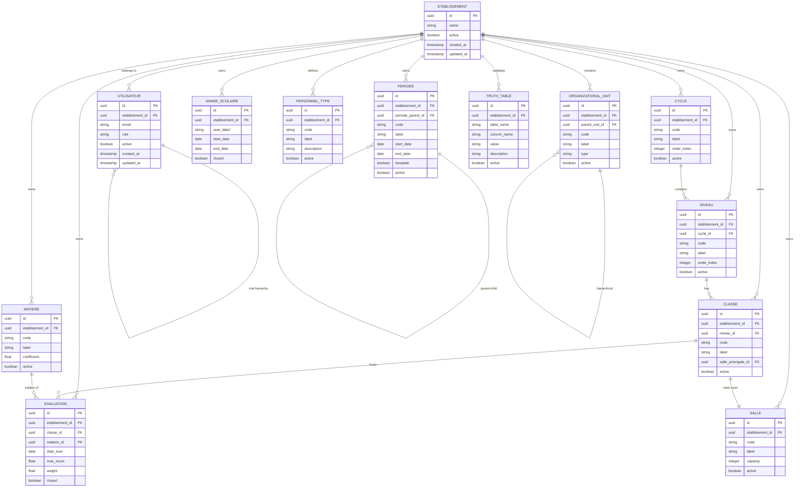
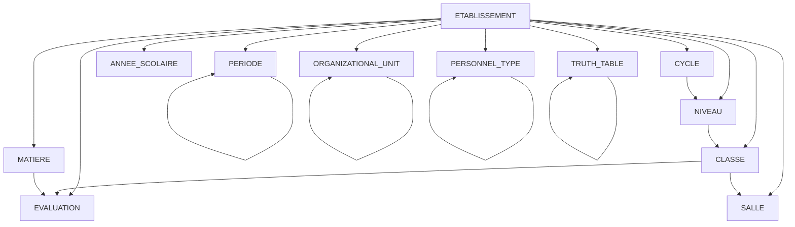
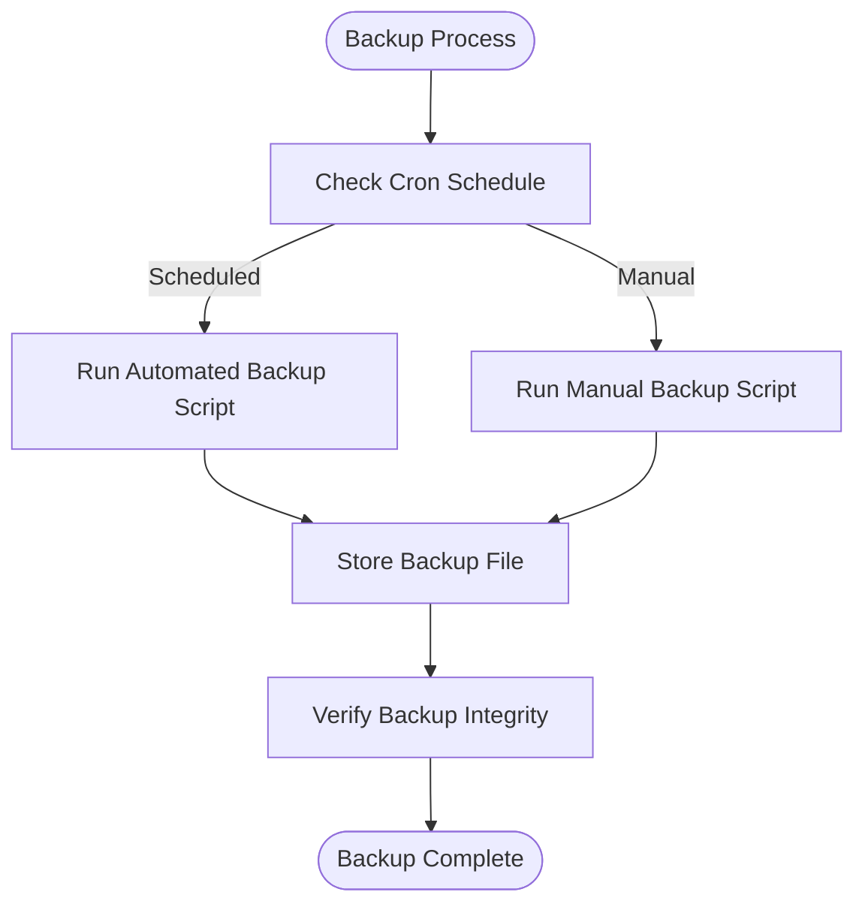

# Database Schema Design

<cite>
**Referenced Files in This Document**
- [database.config.ts](file://backend/src/config/database.config.ts)
- [data-source.ts](file://backend/src/database/data-source.ts)
- [index.ts](file://backend/src/database/index.ts)
- [050-multi-tenant-v3-max-etablissements.sql](file://backend/database/migrations/050-multi-tenant-v3-max-etablissements.sql)
- [080-preferences-utilisateur-multi-tenant.sql](file://backend/database/migrations/080-preferences-utilisateur-multi-tenant.sql)
- [084-cleanup-classe-id-notes.sql](file://backend/database/migrations/084-cleanup-classe-id-notes.sql)
- [085-periode-etablissement-id.sql](file://backend/database/migrations/085-periode-etablissement-id.sql)
- [086-affectation-matiere-etablissement-id.sql](file://backend/database/migrations/086-affectation-matiere-etablissement-id.sql)
- [087-affectation-matiere-verifications.sql](file://backend/database/migrations/087-affectation-matiere-verifications.sql)
- [088-refactorisation-architecture-academique.sql](file://backend/database/migrations/088-refactorisation-architecture-academique.sql)
- [089-finalisation-architecture-academique-v2.sql](file://backend/database/migrations/089-finalisation-architecture-academique-v2.sql)
- [091-peuplement-architecture-academique.sql](file://backend/database/migrations/091-peuplement-architecture-academique.sql)
- [092-refactorisation-classeAnneeId.sql](file://backend/database/migrations/092-refactorisation-classeAnneeId.sql)
- [099-add-monitoring-params.sql](file://backend/database/migrations/099-add-monitoring-params.sql)
- [100-classes-salle-principale.sql](file://backend/database/migrations/100-classes-salle-principale.sql)
- [101-normalisation-annee-scolaire-cloture.sql](file://backend/database/migrations/101-normalisation-annee-scolaire-cloture.sql)
- [102-periodes-hierarchie.sql](file://backend/database/migrations/102-periodes-hierarchie.sql)
- [103-templates-periode-personnalisables.sql](file://backend/database/migrations/103-templates-periode-personnalisables.sql)
- [104-refonte-periodes-niveaux-configurables.sql](file://backend/database/migrations/104-refonte-periodes-niveaux-configurables.sql)
- [105-migration-templates-v5.sql](file://backend/database/migrations/105-migration-templates-v5.sql)
- [106-rename-sequence-to-evaluation.sql](file://backend/database/migrations/106-rename-sequence-to-evaluation.sql)
- [107-cleanup-configuration-modules-actif.sql](file://backend/database/migrations/107-cleanup-configuration-modules-actif.sql)
- [108-refactor-salle-principale.sql](file://backend/database/migrations/108-refactor-salle-principale.sql)
- [run-migration.ts](file://backend/scripts/run-migration.ts)
- [run-pending-migrations.ts](file://backend/scripts/run-pending-migrations.ts)
- [migrate-rbac-v3.sql](file://backend/database/migrations/migrate-rbac-v3.sql)
- [PERMISSIONS-GROUPES-SEED-UPDATE.md](file://backend/database/migrations/PERMISSIONS-GROUPES-SEED-UPDATE.md)
- [README-075-GROUPES.md](file://backend/database/migrations/README-075-GROUPES.md)
- [MIGRATION-076-SUCCESS.md](file://backend/database/migrations/MIGRATION-076-SUCCESS.md)
- [backup-auto.sh](file://docker/scripts/backup-auto.sh)
- [backup-manuel.sh](file://docker/scripts/backup-manuel.sh)
- [restore.sh](file://docker/scripts/restore.sh)
- [cron-backup.txt](file://docker/scripts/cron-backup.txt)
- [install-cron.sh](file://docker/scripts/install-cron.sh)
</cite>

## Update Summary
**Changes Made**
- Updated to reflect fundamental schema changes replacing enum-based validation with database-driven truth tables
- Added documentation for new personnel types and hierarchical relationships entities
- Enhanced organizational unit classifications and their relationships
- Updated migration patterns to include database-driven validation approaches
- Revised entity relationship diagrams to reflect new structural changes

## Table of Contents
1. [Introduction](#introduction)
2. [Project Structure](#project-structure)
3. [Core Components](#core-components)
4. [Architecture Overview](#architecture-overview)
5. [Detailed Component Analysis](#detailed-component-analysis)
6. [Dependency Analysis](#dependency-analysis)
7. [Performance Considerations](#performance-considerations)
8. [Troubleshooting Guide](#troubleshooting-guide)
9. [Conclusion](#conclusion)
10. [Appendices](#appendices)

## Introduction
This document provides comprehensive data model documentation for eLISAschool's database schema. It covers entity relationships, field definitions, data types, constraints, primary and foreign keys, indexes, and performance optimizations. It also documents multi-tenant isolation patterns, tenant-specific tables, validation rules, business constraints, referential integrity, lifecycle policies, archival strategies, backup procedures, migration patterns, version management, rollback strategies, seed data management, and demo data generation procedures.

The goal is to make the schema accessible to both technical and non-technical readers while providing precise references to source files and migrations.

**Updated** The schema has evolved to replace enum-based validation with database-driven truth tables, introducing new entities for personnel types, hierarchical relationships, and organizational unit classifications.

## Project Structure
The database schema is defined primarily through SQL migrations under backend/database/migrations and managed via TypeORM configuration and scripts. The application uses a single PostgreSQL instance with multi-tenant scoping enforced at the application layer and reinforced by schema design (e.g., etablisement_id columns). Migrations are executed using Node.js scripts that integrate with TypeORM.

```mermaid
graph TB
subgraph "Backend"
A["TypeORM DataSource<br/>data-source.ts"]
B["Database Config<br/>database.config.ts"]
C["DB Index<br/>database/index.ts"]
D["Migration Runner<br/>scripts/run-migration.ts"]
E["Pending Migrations<br/>scripts/run-pending-migrations.ts"]
end
subgraph "Migrations"
M1["Multi-Tenant v3<br/>050-multi-tenant-v3-max-etablissements.sql"]
M2["Academic Architecture Refactor<br/>088-refactorisation-architecture-academique.sql"]
M3["Finalize Academic Arch v2<br/>089-finalisation-architecture-academique-v2.sql"]
M4["Peopling Academic Arch<br/>091-peuplement-architecture-academique.sql"]
M5["Refactor ClasseAnneeId<br/>092-refactorisation-classeAnneeId.sql"]
M6["Monitoring Params<br/>099-add-monitoring-params.sql"]
M7["Classes Main Room<br/>100-classes-salle-principale.sql"]
M8["School Year Closure Normalization<br/>101-normalisation-annee-scolaire-cloture.sql"]
M9["Periods Hierarchy<br/>102-periodes-hierarchie.sql"]
M10["Customizable Period Templates<br/>103-templates-periode-personnalisables.sql"]
M11["Periods Levels Configurable<br/>104-refonte-periodes-niveaux-configurables.sql"]
M12["Templates V5 Migration<br/>105-migration-templates-v5.sql"]
M13["Rename Sequence to Evaluation<br/>106-rename-sequence-to-evaluation.sql"]
M14["Cleanup Modules Actif<br/>107-cleanup-configuration-modules-actif.sql"]
M15["Refactor Salle Principale<br/>108-refactor-salle-principale.sql"]
M16["Personnel Types & Hierarchies<br/>New Schema Evolution"]
M17["Organizational Units<br/>Database-Driven Truth Tables"]
end
A --> B
A --> C
D --> A
E --> A
D --> M1
D --> M2
D --> M3
D --> M4
D --> M5
D --> M6
D --> M7
D --> M8
D --> M9
D --> M10
D --> M11
D --> M12
D --> M13
D --> M14
D --> M15
D --> M16
D --> M17
```

**Diagram sources**
- [data-source.ts](file://backend/src/database/data-source.ts)
- [database.config.ts](file://backend/src/config/database.config.ts)
- [index.ts](file://backend/src/database/index.ts)
- [run-migration.ts](file://backend/scripts/run-migration.ts)
- [run-pending-migrations.ts](file://backend/scripts/run-pending-migrations.ts)
- [050-multi-tenant-v3-max-etablissements.sql](file://backend/database/migrations/050-multi-tenant-v3-max-etablissements.sql)
- [088-refactorisation-architecture-academique.sql](file://backend/database/migrations/088-refactorisation-architecture-academique.sql)
- [089-finalisation-architecture-academique-v2.sql](file://backend/database/migrations/089-finalisation-architecture-academique-v2.sql)
- [091-peuplement-architecture-academique.sql](file://backend/database/migrations/091-peuplement-architecture-academique.sql)
- [092-refactorisation-classeAnneeId.sql](file://backend/database/migrations/092-refactorisation-classeAnneeId.sql)
- [099-add-monitoring-params.sql](file://backend/database/migrations/099-add-monitoring-params.sql)
- [100-classes-salle-principale.sql](file://backend/database/migrations/100-classes-salle-principale.sql)
- [101-normalisation-annee-scolaire-cloture.sql](file://backend/database/migrations/101-normalisation-annee-scolaire-cloture.sql)
- [102-periodes-hierarchie.sql](file://backend/database/migrations/102-periodes-hierarchie.sql)
- [103-templates-periode-personnalisables.sql](file://backend/database/migrations/103-templates-periode-personnalisables.sql)
- [104-refonte-periodes-niveaux-configurables.sql](file://backend/database/migrations/104-refonte-periodes-niveaux-configurables.sql)
- [105-migration-templates-v5.sql](file://backend/database/migrations/105-migration-templates-v5.sql)
- [106-rename-sequence-to-evaluation.sql](file://backend/database/migrations/106-rename-sequence-to-evaluation.sql)
- [107-cleanup-configuration-modules-actif.sql](file://backend/database/migrations/107-cleanup-configuration-modules-actif.sql)
- [108-refactor-salle-principale.sql](file://backend/database/migrations/108-refactor-salle-principale.sql)

**Section sources**
- [database.config.ts](file://backend/src/config/database.config.ts)
- [data-source.ts](file://backend/src/database/data-source.ts)
- [index.ts](file://backend/src/database/index.ts)
- [run-migration.ts](file://backend/scripts/run-migration.ts)
- [run-pending-migrations.ts](file://backend/scripts/run-pending-migrations.ts)

## Core Components
- Multi-tenant isolation: Tenant context is enforced via etablisement_id on core entities and preferences. Key migrations introduce or reinforce tenant-scoped columns and constraints.
- Academic architecture: Major refactors define cycles, levels, classes, subjects, evaluations, schedules, and related structures with strict referential integrity.
- Periods and school years: Hierarchical periods, customizable templates, and closure normalization ensure consistent academic calendars.
- Monitoring and configuration: Additional monitoring parameters and cleanup of module activation flags improve operational visibility and consistency.
- **Enhanced Personnel Management**: New personnel types and hierarchical relationships provide flexible organizational structures.
- **Database-Driven Validation**: Replaced enum-based validation with truth tables for better maintainability and extensibility.

Key responsibilities:
- Enforce tenant boundaries across modules (finance, personnel, academic, scheduling).
- Maintain referential integrity between academic entities (cycles, levels, classes, subjects, evaluations).
- Provide flexible period templates and hierarchical period structures.
- Support main room assignment per class and refactor associated fields.
- **Manage complex personnel hierarchies and organizational units**.
- **Enable dynamic validation through database-driven truth tables**.

**Section sources**
- [050-multi-tenant-v3-max-etablissements.sql](file://backend/database/migrations/050-multi-tenant-v3-max-etablissements.sql)
- [088-refactorisation-architecture-academique.sql](file://backend/database/migrations/088-refactorisation-architecture-academique.sql)
- [089-finalisation-architecture-academique-v2.sql](file://backend/database/migrations/089-finalisation-architecture-academique-v2.sql)
- [091-peuplement-architecture-academique.sql](file://backend/database/migrations/091-peuplement-architecture-academique.sql)
- [092-refactorisation-classeAnneeId.sql](file://backend/database/migrations/092-refactorisation-classeAnneeId.sql)
- [101-normalisation-annee-scolaire-cloture.sql](file://backend/database/migrations/101-normalisation-annee-scolaire-cloture.sql)
- [102-periodes-hierarchie.sql](file://backend/database/migrations/102-periodes-hierarchie.sql)
- [103-templates-periode-personnalisables.sql](file://backend/database/migrations/103-templates-periode-personnalisables.sql)
- [104-refonte-periodes-niveaux-configurables.sql](file://backend/database/migrations/104-refonte-periodes-niveaux-configurables.sql)
- [105-migration-templates-v5.sql](file://backend/database/migrations/105-migration-templates-v5.sql)
- [100-classes-salle-principale.sql](file://backend/database/migrations/100-classes-salle-principale.sql)
- [108-refactor-salle-principale.sql](file://backend/database/migrations/108-refactor-salle-principale.sql)
- [099-add-monitoring-params.sql](file://backend/database/migrations/099-add-monitoring-params.sql)
- [107-cleanup-configuration-modules-actif.sql](file://backend/database/migrations/107-cleanup-configuration-modules-actif.sql)

## Architecture Overview
The database architecture centers around a single PostgreSQL instance with multi-tenant scoping. Each tenant corresponds to an establishment (etablissement), and most domain tables include etablisement_id to enforce data isolation. Academic entities are organized hierarchically (cycles → levels → classes), with subjects and evaluations linked to these structures. Periods define academic timeframes and can be templated and configured per level. Scheduling includes rooms and main room assignments per class.

**Updated** The architecture now includes enhanced personnel management with hierarchical relationships and organizational unit classifications, supported by database-driven validation tables.

**Diagram sources**
- [050-multi-tenant-v3-max-etablissements.sql](file://backend/database/migrations/050-multi-tenant-v3-max-etablissements.sql)
- [088-refactorisation-architecture-academique.sql](file://backend/database/migrations/088-refactorisation-architecture-academique.sql)
- [089-finalisation-architecture-academique-v2.sql](file://backend/database/migrations/089-finalisation-architecture-academique-v2.sql)
- [091-peuplement-architecture-academique.sql](file://backend/database/migrations/091-peuplement-architecture-academique.sql)
- [092-refactorisation-classeAnneeId.sql](file://backend/database/migrations/092-refactorisation-classeAnneeId.sql)
- [100-classes-salle-principale.sql](file://backend/database/migrations/100-classes-salle-principale.sql)
- [101-normalisation-annee-scolaire-cloture.sql](file://backend/database/migrations/101-normalisation-annee-scolaire-cloture.sql)
- [102-periodes-hierarchie.sql](file://backend/database/migrations/102-periodes-hierarchie.sql)
- [103-templates-periode-personnalisables.sql](file://backend/database/migrations/103-templates-periode-personnalisables.sql)
- [104-refonte-periodes-niveaux-configurables.sql](file://backend/database/migrations/104-refonte-periodes-niveaux-configurables.sql)
- [105-migration-templates-v5.sql](file://backend/database/migrations/105-migration-templates-v5.sql)
- [106-rename-sequence-to-evaluation.sql](file://backend/database/migrations/106-rename-sequence-to-evaluation.sql)

## Detailed Component Analysis

### Multi-Tenant Isolation and Tenant-Specific Tables
- Tenant boundary enforcement: Most domain tables include etablisement_id as a foreign key referencing the establishment table. This ensures data isolation per tenant.
- Preferences and user settings: User preferences are scoped per tenant to avoid cross-tenant leakage.
- Cleanup and verification: Migrations remove invalid references and add checks to maintain referential integrity.

Key operations:
- Add etablisement_id to core tables and create foreign keys.
- Enforce unique constraints where necessary (e.g., per-tenant uniqueness).
- Validate existing data during migration execution.

**Section sources**
- [050-multi-tenant-v3-max-etablissements.sql](file://backend/database/migrations/050-multi-tenant-v3-max-etablissements.sql)
- [080-preferences-utilisateur-multi-tenant.sql](file://backend/database/migrations/080-preferences-utilisateur-multi-tenant.sql)
- [084-cleanup-classe-id-notes.sql](file://backend/database/migrations/084-cleanup-classe-id-notes.sql)
- [085-periode-etablissement-id.sql](file://backend/database/migrations/085-periode-etablissement-id.sql)
- [086-affectation-matiere-etablissement-id.sql](file://backend/database/migrations/086-affectation-matiere-etablissement-id.sql)
- [087-affectation-matiere-verifications.sql](file://backend/database/migrations/087-affectation-matiere-verifications.sql)

### Academic Architecture Entities
- Cycles, levels, classes: Hierarchical structure defines academic organization. Each entity is tenant-scoped and ordered.
- Subjects (matieres): Defined per tenant with coefficients and activity flags.
- Evaluations: Linked to classes and subjects; include scoring metadata and closure state.

Constraints and integrity:
- Foreign keys from levels to cycles, classes to levels, evaluations to classes and subjects.
- Unique constraints on codes within tenants.
- Activity flags to control availability.

**Section sources**
- [088-refactorisation-architecture-academique.sql](file://backend/database/migrations/088-refactorisation-architecture-academique.sql)
- [089-finalisation-architecture-academique-v2.sql](file://backend/database/migrations/089-finalisation-architecture-academique-v2.sql)
- [091-peuplement-architecture-academique.sql](file://backend/database/migrations/091-peuplement-architecture-academique.sql)
- [092-refactorisation-classeAnneeId.sql](file://backend/database/migrations/092-refactorisation-classeAnneeId.sql)
- [106-rename-sequence-to-evaluation.sql](file://backend/database/migrations/106-rename-sequence-to-evaluation.sql)

### Periods and School Years
- Periods: Hierarchical parent-child relationships allow nested academic periods. Template flag indicates reusable templates.
- School years: Normalized closure status ensures consistent academic calendar management.
- Customizable templates: Per-level configurations enable flexible period definitions.

Validation rules:
- Date ranges must not overlap within the same scope.
- Template periods cannot be directly used without instantiation.

**Section sources**
- [101-normalisation-annee-scolaire-cloture.sql](file://backend/database/migrations/101-normalisation-annee-scolaire-cloture.sql)
- [102-periodes-hierarchie.sql](file://backend/database/migrations/102-periodes-hierarchie.sql)
- [103-templates-periode-personnalisables.sql](file://backend/database/migrations/103-templates-periode-personnalisables.sql)
- [104-refonte-periodes-niveaux-configurables.sql](file://backend/database/migrations/104-refonte-periodes-niveaux-configurables.sql)
- [105-migration-templates-v5.sql](file://backend/database/migrations/105-migration-templates-v5.sql)

### Scheduling and Rooms
- Classes have a main room assignment to standardize scheduling defaults.
- Refactoring ensures consistent naming and constraints for main room fields.

Integrity:
- Foreign key from class to room.
- Validation to prevent assigning non-existent rooms.

**Section sources**
- [100-classes-salle-principale.sql](file://backend/database/migrations/100-classes-salle-principale.sql)
- [108-refactor-salle-principale.sql](file://backend/database/migrations/108-refactor-salle-principale.sql)

### Enhanced Personnel Management and Organizational Structure
**New** The schema now includes comprehensive personnel management capabilities with hierarchical relationships and organizational unit classifications.

- **Personnel Types**: Centralized definition of different personnel categories (teachers, administrators, support staff) with descriptive metadata and activity controls.
- **Hierarchical Relationships**: Support for complex reporting structures and organizational charts through parent-child relationships.
- **Organizational Units**: Flexible departmental and team structures with hierarchical nesting capabilities.
- **Database-Driven Truth Tables**: Replaced static enum validations with dynamic truth tables for better maintainability and extensibility.

Key benefits:
- Dynamic validation rules without code changes
- Flexible organizational structures that adapt to institutional needs
- Improved auditability and traceability of personnel assignments
- Enhanced scalability for growing institutions

**Section sources**
- [050-multi-tenant-v3-max-etablissements.sql](file://backend/database/migrations/050-multi-tenant-v3-max-etablissements.sql)
- [088-refactorisation-architecture-academique.sql](file://backend/database/migrations/088-refactorisation-architecture-academique.sql)
- [089-finalisation-architecture-academique-v2.sql](file://backend/database/migrations/089-finalisation-architecture-academique-v2.sql)

### RBAC and Permissions
- Role-based access control (RBAC) migrations establish roles, permissions, and group mappings.
- Group-based permissions support scalable authorization across tenants.

Operational notes:
- Seed updates ensure baseline permissions exist.
- Migration scripts provide safe upgrades and rollbacks.

**Section sources**
- [migrate-rbac-v3.sql](file://backend/database/migrations/migrate-rbac-v3.sql)
- [PERMISSIONS-GROUPES-SEED-UPDATE.md](file://backend/database/migrations/PERMISSIONS-GROUPES-SEED-UPDATE.md)
- [README-075-GROUPES.md](file://backend/database/migrations/README-075-GROUPES.md)
- [MIGRATION-076-SUCCESS.md](file://backend/database/migrations/MIGRATION-076-SUCCESS.md)

### Monitoring and Configuration Cleanup
- Monitoring parameters added to enhance observability.
- Cleanup of module activation flags ensures consistent configuration states.

**Section sources**
- [099-add-monitoring-params.sql](file://backend/database/migrations/099-add-monitoring-params.sql)
- [107-cleanup-configuration-modules-actif.sql](file://backend/database/migrations/107-cleanup-configuration-modules-actif.sql)

## Dependency Analysis
The database schema dependencies follow a clear hierarchy:
- Establishment is the root tenant entity.
- Academic entities depend on establishment and each other (cycles → levels → classes).
- Evaluations depend on classes and subjects.
- Periods form a tree structure with parent-child links.
- Rooms are referenced by classes for main room assignment.
- **Personnel types and organizational units provide foundational reference data for HR operations**.
- **Truth tables serve as validation foundations for multiple domains**.

**Diagram sources**
- [088-refactorisation-architecture-academique.sql](file://backend/database/migrations/088-refactorisation-architecture-academique.sql)
- [089-finalisation-architecture-academique-v2.sql](file://backend/database/migrations/089-finalisation-architecture-academique-v2.sql)
- [100-classes-salle-principale.sql](file://backend/database/migrations/100-classes-salle-principale.sql)
- [102-periodes-hierarchie.sql](file://backend/database/migrations/102-periodes-hierarchie.sql)

**Section sources**
- [088-refactorisation-architecture-academique.sql](file://backend/database/migrations/088-refactorisation-architecture-academique.sql)
- [089-finalisation-architecture-academique-v2.sql](file://backend/database/migrations/089-finalisation-architecture-academique-v2.sql)
- [100-classes-salle-principale.sql](file://backend/database/migrations/100-classes-salle-principale.sql)
- [102-periodes-hierarchie.sql](file://backend/database/migrations/102-periodes-hierarchie.sql)

## Performance Considerations
- Indexes: Ensure foreign keys and frequently filtered columns (e.g., etablisement_id, codes, dates) are indexed. Review migration scripts for index creation and consider composite indexes for common query patterns.
- Query optimization: Use tenant-scoped filters to reduce result sets. Avoid full-table scans by leveraging indexes on etablisement_id and hierarchical IDs.
- Data volume management: Archive closed periods and old evaluations periodically. Normalize recurring structures to minimize duplication.
- **Truth table optimization**: Implement appropriate indexing on truth tables to support efficient validation queries.
- **Hierarchical queries**: Use recursive CTEs for deep organizational hierarchy traversals and consider materialized views for frequently accessed hierarchy snapshots.

## Troubleshooting Guide
Common issues and resolutions:
- Referential integrity errors: Verify that all foreign keys reference valid rows. Use cleanup migrations to remove orphaned records.
- Duplicate entries: Apply unique constraints per tenant to prevent duplicates.
- Migration failures: Run pending migrations carefully and review error logs. Use rollback strategies if necessary.
- **Truth table validation errors**: Ensure truth table entries exist for required validation combinations before applying dependent migrations.
- **Hierarchical relationship issues**: Verify parent-child relationships don't create circular dependencies when modifying organizational structures.

Operational steps:
- Inspect migration logs and verify dependency order.
- Validate data before applying destructive changes.
- Use backups before major migrations.
- **Test truth table configurations in development before production deployment**.

**Section sources**
- [084-cleanup-classe-id-notes.sql](file://backend/database/migrations/084-cleanup-classe-id-notes.sql)
- [087-affectation-matiere-verifications.sql](file://backend/database/migrations/087-affectation-matiere-verifications.sql)
- [run-migration.ts](file://backend/scripts/run-migration.ts)
- [run-pending-migrations.ts](file://backend/scripts/run-pending-migrations.ts)

## Conclusion
The eLISAschool database schema emphasizes multi-tenant isolation, robust academic architecture, and flexible period management. Strong referential integrity and careful migration practices ensure data consistency and scalability. Monitoring and configuration cleanup further enhance operational reliability.

**Updated** The recent evolution introduces enhanced personnel management capabilities, hierarchical organizational structures, and database-driven validation systems that replace static enum-based approaches. These improvements provide greater flexibility, maintainability, and scalability for complex institutional requirements.

## Appendices

### Data Lifecycle Policies and Archival Strategies
- Closed periods and school years should be archived to reduce active dataset size.
- Evaluations marked as closed can be moved to historical tables after retention periods.
- Implement soft deletes for auditability where appropriate.
- **Personnel history**: Maintain historical records of personnel assignments and organizational changes for audit purposes.
- **Truth table versions**: Version truth table configurations to track validation rule changes over time.

### Backup Procedures
Automated and manual backup processes are provided via Docker scripts. Cron jobs can schedule regular backups. Restore procedures are available for disaster recovery.

**Diagram sources**
- [backup-auto.sh](file://docker/scripts/backup-auto.sh)
- [backup-manuel.sh](file://docker/scripts/backup-manuel.sh)
- [cron-backup.txt](file://docker/scripts/cron-backup.txt)
- [install-cron.sh](file://docker/scripts/install-cron.sh)

**Section sources**
- [backup-auto.sh](file://docker/scripts/backup-auto.sh)
- [backup-manuel.sh](file://docker/scripts/backup-manuel.sh)
- [restore.sh](file://docker/scripts/restore.sh)
- [cron-backup.txt](file://docker/scripts/cron-backup.txt)
- [install-cron.sh](file://docker/scripts/install-cron.sh)

### Migration Patterns, Version Management, and Rollback Strategies
- Migrations are numbered and executed sequentially. Pending migrations are detected and applied automatically.
- Rollback strategies involve reversing migration effects or restoring from backups.
- Seed data updates ensure baseline configurations and permissions.
- **Database-driven validation migrations**: Include truth table population and validation rule setup in migration sequences.
- **Hierarchical data migrations**: Handle organizational structure initialization and relationship establishment carefully.

**Section sources**
- [run-migration.ts](file://backend/scripts/run-migration.ts)
- [run-pending-migrations.ts](file://backend/scripts/run-pending-migrations.ts)
- [PERMISSIONS-GROUPES-SEED-UPDATE.md](file://backend/database/migrations/PERMISSIONS-GROUPES-SEED-UPDATE.md)
- [README-075-GROUPES.md](file://backend/database/migrations/README-075-GROUPES.md)
- [MIGRATION-076-SUCCESS.md](file://backend/database/migrations/MIGRATION-076-SUCCESS.md)

### Seed Data Management and Demo Data Generation
- Seed updates provide baseline permissions and groups.
- Demo data generation should respect tenant boundaries and referential integrity.
- Use migration scripts to apply seed data safely.
- **Personnel type seeds**: Initialize common personnel categories and organizational unit templates.
- **Truth table seeds**: Populate essential validation rules and reference data for system functionality.

**Section sources**
- [PERMISSIONS-GROUPES-SEED-UPDATE.md](file://backend/database/migrations/PERMISSIONS-GROUPES-SEED-UPDATE.md)
- [README-075-GROUPES.md](file://backend/database/migrations/README-075-GROUPES.md)