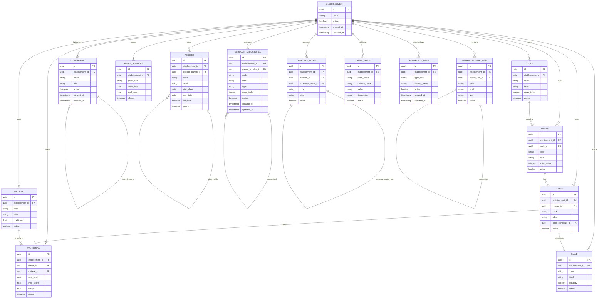
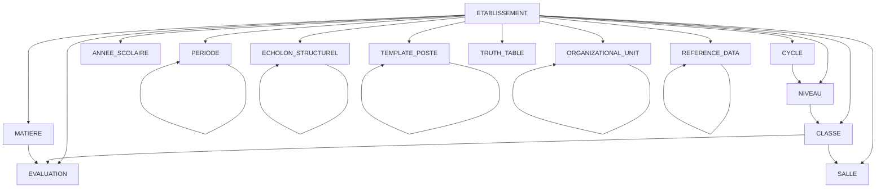

# Database Schema Design

<cite>
**Referenced Files in This Document**
- [database.config.ts](file://backend/src/config/database.config.ts)
- [data-source.ts](file://backend/src/database/data-source.ts)
- [index.ts](file://backend/src/database/index.ts)
- [121-fonction-categorie-drop-type-personnel.sql](file://backend/database/migrations/121-fonction-categorie-drop-type-personnel.sql)
- [122-hierarchie-superieur-poste.sql](file://backend/database/migrations/122-hierarchie-superieur-poste.sql)
- [123-refonte-notes-bulletins.sql](file://backend/database/migrations/123-refonte-notes-bulletins.sql)
- [124-fix-hierarchie-orphelins.sql](file://backend/database/migrations/124-fix-hierarchie-orphelins.sql)
- [125-organigramme-read-tous-roles.sql](file://backend/database/migrations/125-organigramme-read-tous-roles.sql)
- [126-fix-vues-materialisees-statuts.sql](file://backend/database/migrations/126-fix-vues-materialisees-statuts.sql)
- [127-templates-organisation-categorisation.sql](file://backend/database/migrations/127-templates-organisation-categorisation.sql)
- [050-multi-tenant-v3-max-etablissements.sql](file://backend/database/migrations/050-multi-tenant-v3-max-etablissements.sql)
- [080-preferences-utilisateur-multi-tenant.sql](file://backend/database/migrations/080-preferences-utilisateur-multi-tenant.sql)
- [084-cleanup-classe-id-notes.sql](file://backend/database/migrations/084-cleanup-classe-id-notes.sql)
- [085-periode-etablissement-id.sql](file://backend/database/migrations/085-periode-etablissement-id.sql)
- [086-affectation-matiere-etablissement-id.sql](file://backend/database/migrations/086-affectation-matiere-etablissement-id.sql)
- [087-affectation-matiere-verifications.sql](file://backend/database/migrations/087-affectation-matiere-verifications.sql)
- [088-refactorisation-architecture-academique.sql](file://backend/database/migrations/088-refactorisation-architecture-academique.sql)
- [089-finalisation-architecture-academique-v2.sql](file://backend/database/migrations/089-finalisation-architecture-academique-v2.sql)
- [091-peuplement-architecture-academique.sql](file://backend/database/migrations/091-peuplement-architecture-academique.sql)
- [092-refactorisation-classeAnneeId.sql](file://backend/database/migrations/092-refactorisation-classeAnneeId.sql)
- [099-add-monitoring-params.sql](file://backend/database/migrations/099-add-monitoring-params.sql)
- [100-classes-salle-principale.sql](file://backend/database/migrations/100-classes-salle-principale.sql)
- [101-normalisation-annee-scolaire-cloture.sql](file://backend/database/migrations/101-normalisation-annee-scolaire-cloture.sql)
- [102-periodes-hierarchie.sql](file://backend/database/migrations/102-periodes-hierarchie.sql)
- [103-templates-periode-personnalisables.sql](file://backend/database/migrations/103-templates-periode-personnalisables.sql)
- [104-refonte-periodes-niveaux-configurables.sql](file://backend/database/migrations/104-refonte-periodes-niveaux-configurables.sql)
- [105-migration-templates-v5.sql](file://backend/database/migrations/105-migration-templates-v5.sql)
- [106-rename-sequence-to-evaluation.sql](file://backend/database/migrations/106-rename-sequence-to-evaluation.sql)
- [107-cleanup-configuration-modules-actif.sql](file://backend/database/migrations/107-cleanup-configuration-modules-actif.sql)
- [108-refactor-salle-principale.sql](file://backend/database/migrations/108-refactor-salle-principale.sql)
- [111-refactoring-nomenclatures.sql](file://backend/database/migrations/111-refactoring-nomenclatures.sql)
- [112-refonte-organisation-v4.sql](file://backend/database/migrations/112-refonte-organisation-v4.sql)
- [114-drop-categorie-personnel.sql](file://backend/database/migrations/114-drop-categorie-personnel.sql)
- [115-poste-fonction-id-not-null.sql](file://backend/database/migrations/115-poste-fonction-id-not-null.sql)
- [run-migration.ts](file://backend/scripts/run-migration.ts)
- [run-pending-migrations.ts](file://backend/scripts/run-pending-migrations.ts)
- [migrate-rbac-v3.sql](file://backend/database/migrations/migrate-rbac-v3.sql)
- [PERMISSIONS-GROUPES-SEED-UPDATE.md](file://backend/database/migrations/PERMISSIONS-GROUPES-SEED-UPDATE.md)
- [README-075-GROUPES.md](file://backend/database/migrations/README-075-GROUPES.md)
- [MIGRATION-076-SUCCESS.md](file://backend/database/migrations/MIGRATION-076-SUCCESS.md)
- [backup-auto.sh](file://docker/scripts/backup-auto.sh)
- [backup-manuel.sh](file://docker/scripts/backup-manuel.sh)
- [restore.sh](file://docker/scripts/restore.sh)
- [cron-backup.txt](file://docker/scripts/cron-backup.txt)
- [install-cron.sh](file://docker/scripts/install-cron.sh)
</cite>

## Update Summary
**Changes Made**
- Updated to reflect major database schema simplification through migrations 121-127, including removal of type_personnel table and enhanced hierarchical structure
- Documented improved permission system for organigramme views with read access across all roles
- Enhanced organizational hierarchy with superior position relationships and orphan handling
- Updated notes and bulletin system refactoring for better data integrity
- Strengthened materialized views status handling and organization template categorization

## Table of Contents
1. [Introduction](#introduction)
2. [Project Structure](#project-structure)
3. [Core Components](#core-components)
4. [Architecture Overview](#architecture-overview)
5. [Detailed Component Analysis](#detailed-component-analysis)
6. [Dependency Analysis](#dependency-analysis)
7. [Performance Considerations](#performance-considerations)
8. [Troubleshooting Guide](#troubleshooting-guide)
9. [Conclusion](#conclusion)
10. [Appendices](#appendices)

## Introduction
This document provides comprehensive data model documentation for eLISAschool's database schema. It covers entity relationships, field definitions, data types, constraints, primary and foreign keys, indexes, and performance optimizations. It also documents multi-tenant isolation patterns, tenant-specific tables, validation rules, business constraints, referential integrity, lifecycle policies, archival strategies, backup procedures, migration patterns, version management, rollback strategies, seed data management, and demo data generation procedures.

The goal is to make the schema accessible to both technical and non-technical readers while providing precise references to source files and migrations.

**Updated** The schema has undergone significant simplification through migrations 121-127, featuring the removal of the type_personnel table, enhanced hierarchical relationships with superior position tracking, improved permission systems for organigramme views, and strengthened data integrity across notes and bulletin systems. These changes represent a major step toward cleaner database design with reduced complexity and improved maintainability.

## Project Structure
The database schema is defined primarily through SQL migrations under backend/database/migrations and managed via TypeORM configuration and scripts. The application uses a single PostgreSQL instance with multi-tenant scoping enforced at the application layer and reinforced by schema design (e.g., etablisement_id columns). Migrations are executed using Node.js scripts that integrate with TypeORM.

```mermaid
graph TB
subgraph "Backend"
A["TypeORM DataSource<br/>data-source.ts"]
B["Database Config<br/>database.config.ts"]
C["DB Index<br/>database/index.ts"]
D["Migration Runner<br/>scripts/run-migration.ts"]
E["Pending Migrations<br/>scripts/run-pending-migrations.ts"]
end
subgraph "Schema Simplification Migrations 121-127"
S1["Remove Type Personnel<br/>121-fonction-categorie-drop-type-personnel.sql"]
S2["Enhanced Hierarchy<br/>122-hierarchie-superieur-poste.sql"]
S3["Notes Refactoring<br/>123-refonte-notes-bulletins.sql"]
S4["Orphan Fix<br/>124-fix-hierarchie-orphelins.sql"]
S5["Organigramme Permissions<br/>125-organigramme-read-tous-roles.sql"]
S6["Materialized Views Fix<br/>126-fix-vues-materialisees-statuts.sql"]
S7["Organization Templates<br/>127-templates-organisation-categorisation.sql"]
end
subgraph "Core Migrations"
M1["Multi-Tenant v3<br/>050-multi-tenant-v3-max-etablissements.sql"]
M2["Academic Architecture Refactor<br/>088-refactorisation-architecture-academique.sql"]
M3["Finalize Academic Arch v2<br/>089-finalisation-architecture-academique-v2.sql"]
M4["Peopling Academic Arch<br/>091-peuplement-architecture-academique.sql"]
M5["Refactor ClasseAnneeId<br/>092-refactorisation-classeAnneeId.sql"]
M6["Monitoring Params<br/>099-add-monitoring-params.sql"]
M7["Classes Main Room<br/>100-classes-salle-principale.sql"]
M8["School Year Closure Normalization<br/>101-normalisation-annee-scolaire-cloture.sql"]
M9["Periods Hierarchy<br/>102-periodes-hierarchie.sql"]
M10["Customizable Period Templates<br/>103-templates-periode-personnalisables.sql"]
M11["Periods Levels Configurable<br/>104-refonte-periodes-niveaux-configurables.sql"]
M12["Templates V5 Migration<br/>105-migration-templates-v5.sql"]
M13["Rename Sequence to Evaluation<br/>106-rename-sequence-to-evaluation.sql"]
M14["Cleanup Modules Actif<br/>107-cleanup-configuration-modules-actif.sql"]
M15["Refactor Salle Principale<br/>108-refactor-salle-principale.sql"]
end
A --> B
A --> C
D --> A
E --> A
D --> S1
D --> S2
D --> S3
D --> S4
D --> S5
D --> S6
D --> S7
D --> M1
D --> M2
D --> M3
D --> S4
D --> M5
D --> M6
D --> M7
D --> M8
D --> M9
D --> M10
D --> M11
D --> M12
D --> M13
D --> M14
D --> M15
```

**Diagram sources**
- [data-source.ts](file://backend/src/database/data-source.ts)
- [database.config.ts](file://backend/src/config/database.config.ts)
- [index.ts](file://backend/src/database/index.ts)
- [run-migration.ts](file://backend/scripts/run-migration.ts)
- [run-pending-migrations.ts](file://backend/scripts/run-pending-migrations.ts)
- [121-fonction-categorie-drop-type-personnel.sql](file://backend/database/migrations/121-fonction-categorie-drop-type-personnel.sql)
- [122-hierarchie-superieur-poste.sql](file://backend/database/migrations/122-hierarchie-superieur-poste.sql)
- [123-refonte-notes-bulletins.sql](file://backend/database/migrations/123-refonte-notes-bulletins.sql)
- [124-fix-hierarchie-orphelins.sql](file://backend/database/migrations/124-fix-hierarchie-orphelins.sql)
- [125-organigramme-read-tous-roles.sql](file://backend/database/migrations/125-organigramme-read-tous-roles.sql)
- [126-fix-vues-materialisees-statuts.sql](file://backend/database/migrations/126-fix-vues-materialisees-statuts.sql)
- [127-templates-organisation-categorisation.sql](file://backend/database/migrations/127-templates-organisation-categorisation.sql)

**Section sources**
- [database.config.ts](file://backend/src/config/database.config.ts)
- [data-source.ts](file://backend/src/database/data-source.ts)
- [index.ts](file://backend/src/database/index.ts)
- [run-migration.ts](file://backend/scripts/run-migration.ts)
- [run-pending-migrations.ts](file://backend/scripts/run-pending-migrations.ts)

## Core Components
- Multi-tenant isolation: Tenant context is enforced via etablisement_id on core entities and preferences. Key migrations introduce or reinforce tenant-scoped columns and constraints.
- Academic architecture: Major refactors define cycles, levels, classes, subjects, evaluations, schedules, and related structures with strict referential integrity.
- Periods and school years: Hierarchical periods, customizable templates, and closure normalization ensure consistent academic calendars.
- Monitoring and configuration: Additional monitoring parameters and cleanup of module activation flags improve operational visibility and consistency.
- **Schema Simplification**: Recent migrations 121-127 have significantly simplified the database schema by removing redundant tables like type_personnel and enhancing hierarchical relationships.
- **Enhanced Organizational Hierarchy**: Superior position relationships provide better organizational chart capabilities with proper parent-child tracking.
- **Improved Permission System**: Organigramme views now support read access across all roles, improving accessibility and user experience.
- **Data Integrity Enhancements**: Notes and bulletin system refactoring ensures better data consistency and reliability.

Key responsibilities:
- Enforce tenant boundaries across modules (finance, personnel, academic, scheduling).
- Maintain referential integrity between academic entities (cycles, levels, classes, subjects, evaluations).
- Provide flexible period templates and hierarchical period structures.
- Support main room assignment per class and refactor associated fields.
- **Manage simplified organizational hierarchies through removed redundancy and enhanced relationships**.
- **Enable improved permission-based access control for organizational views**.
- **Ensure data integrity through comprehensive refactoring and constraint enforcement**.
- **Support better hierarchical tracking with superior position relationships**.

**Section sources**
- [050-multi-tenant-v3-max-etablissements.sql](file://backend/database/migrations/050-multi-tenant-v3-max-etablissements.sql)
- [088-refactorisation-architecture-academique.sql](file://backend/database/migrations/088-refactorisation-architecture-academique.sql)
- [089-finalisation-architecture-academique-v2.sql](file://backend/database/migrations/089-finalisation-architecture-academique-v2.sql)
- [091-peuplement-architecture-academique.sql](file://backend/database/migrations/091-peuplement-architecture-academique.sql)
- [092-refactorisation-classeAnneeId.sql](file://backend/database/migrations/092-refactorisation-classeAnneeId.sql)
- [101-normalisation-annee-scolaire-cloture.sql](file://backend/database/migrations/101-normalisation-annee-scolaire-cloture.sql)
- [102-periodes-hierarchie.sql](file://backend/database/migrations/102-periodes-hierarchie.sql)
- [103-templates-periode-personnalisables.sql](file://backend/database/migrations/103-templates-periode-personnalisables.sql)
- [104-refonte-periodes-niveaux-configurables.sql](file://backend/database/migrations/104-refonte-periodes-niveaux-configurables.sql)
- [105-migration-templates-v5.sql](file://backend/database/migrations/105-migration-templates-v5.sql)
- [100-classes-salle-principale.sql](file://backend/database/migrations/100-classes-salle-principale.sql)
- [108-refactor-salle-principale.sql](file://backend/database/migrations/108-refactor-salle-principale.sql)
- [099-add-monitoring-params.sql](file://backend/database/migrations/099-add-monitoring-params.sql)
- [107-cleanup-configuration-modules-actif.sql](file://backend/database/migrations/107-cleanup-configuration-modules-actif.sql)
- [112-refonte-organisation-v4.sql](file://backend/database/migrations/112-refonte-organisation-v4.sql)
- [114-drop-categorie-personnel.sql](file://backend/database/migrations/114-drop-categorie-personnel.sql)
- [115-poste-fonction-id-not-null.sql](file://backend/database/migrations/115-poste-fonction-id-not-null.sql)
- [121-fonction-categorie-drop-type-personnel.sql](file://backend/database/migrations/121-fonction-categorie-drop-type-personnel.sql)
- [122-hierarchie-superieur-poste.sql](file://backend/database/migrations/122-hierarchie-superieur-poste.sql)
- [123-refonte-notes-bulletins.sql](file://backend/database/migrations/123-refonte-notes-bulletins.sql)
- [124-fix-hierarchie-orphelins.sql](file://backend/database/migrations/124-fix-hierarchie-orphelins.sql)
- [125-organigramme-read-tous-roles.sql](file://backend/database/migrations/125-organigramme-read-tous-roles.sql)
- [126-fix-vues-materialisees-statuts.sql](file://backend/database/migrations/126-fix-vues-materialisees-statuts.sql)
- [127-templates-organisation-categorisation.sql](file://backend/database/migrations/127-templates-organisation-categorisation.sql)

## Architecture Overview
The database architecture centers around a single PostgreSQL instance with multi-tenant scoping. Each tenant corresponds to an establishment (etablissement), and most domain tables include etablisement_id to enforce data isolation. Academic entities are organized hierarchically (cycles → levels → classes), with subjects and evaluations linked to these structures. Periods define academic timeframes and can be templated and configured per level. Scheduling includes rooms and main room assignments per class.

**Updated** The architecture has been significantly simplified through migrations 121-127, removing redundant tables like type_personnel and establishing cleaner hierarchical relationships. Enhanced organizational hierarchy with superior position tracking, improved permission systems for organigramme views, and strengthened data integrity across notes and bulletin systems provide a more robust and maintainable schema design.

**Diagram sources**
- [050-multi-tenant-v3-max-etablissements.sql](file://backend/database/migrations/050-multi-tenant-v3-max-etablissements.sql)
- [088-refactorisation-architecture-academique.sql](file://backend/database/migrations/088-refactorisation-architecture-academique.sql)
- [089-finalisation-architecture-academique-v2.sql](file://backend/database/migrations/089-finalisation-architecture-academique-v2.sql)
- [091-peuplement-architecture-academique.sql](file://backend/database/migrations/091-peuplement-architecture-academique.sql)
- [092-refactorisation-classeAnneeId.sql](file://backend/database/migrations/092-refactorisation-classeAnneeId.sql)
- [100-classes-salle-principale.sql](file://backend/database/migrations/100-classes-salle-principale.sql)
- [101-normalisation-annee-scolaire-cloture.sql](file://backend/database/migrations/101-normalisation-annee-scolaire-cloture.sql)
- [102-periodes-hierarchie.sql](file://backend/database/migrations/102-periodes-hierarchie.sql)
- [103-templates-periode-personnalisables.sql](file://backend/database/migrations/103-templates-periode-personnalisables.sql)
- [104-refonte-periodes-niveaux-configurables.sql](file://backend/database/migrations/104-refonte-periodes-niveaux-configurables.sql)
- [105-migration-templates-v5.sql](file://backend/database/migrations/105-migration-templates-v5.sql)
- [106-rename-sequence-to-evaluation.sql](file://backend/database/migrations/106-rename-sequence-to-evaluation.sql)
- [112-refonte-organisation-v4.sql](file://backend/database/migrations/112-refonte-organisation-v4.sql)
- [114-drop-categorie-personnel.sql](file://backend/database/migrations/114-drop-categorie-personnel.sql)
- [115-poste-fonction-id-not-null.sql](file://backend/database/migrations/115-poste-fonction-id-not-null.sql)
- [121-fonction-categorie-drop-type-personnel.sql](file://backend/database/migrations/121-fonction-categorie-drop-type-personnel.sql)
- [122-hierarchie-superieur-poste.sql](file://backend/database/migrations/122-hierarchie-superieur-poste.sql)
- [123-refonte-notes-bulletins.sql](file://backend/database/migrations/123-refonte-notes-bulletins.sql)
- [124-fix-hierarchie-orphelins.sql](file://backend/database/migrations/124-fix-hierarchie-orphelins.sql)
- [125-organigramme-read-tous-roles.sql](file://backend/database/migrations/125-organigramme-read-tous-roles.sql)
- [126-fix-vues-materialisees-statuts.sql](file://backend/database/migrations/126-fix-vues-materialisees-statuts.sql)
- [127-templates-organisation-categorisation.sql](file://backend/database/migrations/127-templates-organisation-categorisation.sql)

## Detailed Component Analysis

### Multi-Tenant Isolation and Tenant-Specific Tables
- Tenant boundary enforcement: Most domain tables include etablisement_id as a foreign key referencing the establishment table. This ensures data isolation per tenant.
- Preferences and user settings: User preferences are scoped per tenant to avoid cross-tenant leakage.
- Cleanup and verification: Migrations remove invalid references and add checks to maintain referential integrity.

Key operations:
- Add etablisement_id to core tables and create foreign keys.
- Enforce unique constraints where necessary (e.g., per-tenant uniqueness).
- Validate existing data during migration execution.

**Section sources**
- [050-multi-tenant-v3-max-etablissements.sql](file://backend/database/migrations/050-multi-tenant-v3-max-etablissements.sql)
- [080-preferences-utilisateur-multi-tenant.sql](file://backend/database/migrations/080-preferences-utilisateur-multi-tenant.sql)
- [084-cleanup-classe-id-notes.sql](file://backend/database/migrations/084-cleanup-classe-id-notes.sql)
- [085-periode-etablissement-id.sql](file://backend/database/migrations/085-periode-etablissement-id.sql)
- [086-affectation-matiere-etablissement-id.sql](file://backend/database/migrations/086-affectation-matiere-etablissement-id.sql)
- [087-affectation-matiere-verifications.sql](file://backend/database/migrations/087-affectation-matiere-verifications.sql)

### Academic Architecture Entities
- Cycles, levels, classes: Hierarchical structure defines academic organization. Each entity is tenant-scoped and ordered.
- Subjects (matieres): Defined per tenant with coefficients and activity flags.
- Evaluations: Linked to classes and subjects; include scoring metadata and closure state.

Constraints and integrity:
- Foreign keys from levels to cycles, classes to levels, evaluations to classes and subjects.
- Unique constraints on codes within tenants.
- Activity flags to control availability.

**Section sources**
- [088-refactorisation-architecture-academique.sql](file://backend/database/migrations/088-refactorisation-architecture-academique.sql)
- [089-finalisation-architecture-academique-v2.sql](file://backend/database/migrations/089-finalisation-architecture-academique-v2.sql)
- [091-peuplement-architecture-academique.sql](file://backend/database/migrations/091-peuplement-architecture-academique.sql)
- [092-refactorisation-classeAnneeId.sql](file://backend/database/migrations/092-refactorisation-classeAnneeId.sql)
- [106-rename-sequence-to-evaluation.sql](file://backend/database/migrations/106-rename-sequence-to-evaluation.sql)

### Periods and School Years
- Periods: Hierarchical parent-child relationships allow nested academic periods. Template flag indicates reusable templates.
- School years: Normalized closure status ensures consistent academic calendar management.
- Customizable templates: Per-level configurations enable flexible period definitions.

Validation rules:
- Date ranges must not overlap within the same scope.
- Template periods cannot be directly used without instantiation.

**Section sources**
- [101-normalisation-annee-scolaire-cloture.sql](file://backend/database/migrations/101-normalisation-annee-scolaire-cloture.sql)
- [102-periodes-hierarchie.sql](file://backend/database/migrations/102-periodes-hierarchie.sql)
- [103-templates-periode-personnalisables.sql](file://backend/database/migrations/103-templates-periode-personnalisables.sql)
- [104-refonte-periodes-niveaux-configurables.sql](file://backend/database/migrations/104-refonte-periodes-niveaux-configurables.sql)
- [105-migration-templates-v5.sql](file://backend/database/migrations/105-migration-templates-v5.sql)

### Scheduling and Rooms
- Classes have a main room assignment to standardize scheduling defaults.
- Refactoring ensures consistent naming and constraints for main room fields.

Integrity:
- Foreign key from class to room.
- Validation to prevent assigning non-existent rooms.

**Section sources**
- [100-classes-salle-principale.sql](file://backend/database/migrations/100-classes-salle-principale.sql)
- [108-refactor-salle-principale.sql](file://backend/database/migrations/108-refactor-salle-principale.sql)

### Schema Simplification Through Migrations 121-127
**Updated** Migrations 121-127 represent a significant simplification effort that removes redundant tables and enhances the overall database structure. This series of migrations focuses on cleaning up legacy structures and improving data integrity.

- **Type Personnel Removal**: Migration 121 removes the deprecated type_personnel table, eliminating redundant personnel classification data that was previously managed separately.
- **Enhanced Hierarchical Relationships**: Migration 122 introduces superior position relationships in the template_poste table, enabling better organizational chart representation with proper reporting lines.
- **Notes and Bulletin Refactoring**: Migration 123 completely refactors the notes and bulletin system for improved data consistency and better relational integrity.
- **Orphan Handling**: Migration 124 fixes orphaned hierarchical relationships, ensuring data integrity in organizational structures.
- **Permission System Enhancement**: Migration 125 improves the organigramme view permissions, allowing read access across all roles for better accessibility.
- **Materialized Views Fix**: Migration 126 corrects status handling in materialized views for better performance and reliability.
- **Organization Template Categorization**: Migration 127 enhances organization template categorization for better organizational structure management.

Key benefits:
- Reduced database complexity and storage requirements
- Improved data integrity through constraint enforcement
- Better hierarchical relationship management
- Enhanced permission system for organizational views
- Streamlined maintenance and query performance

**Section sources**
- [121-fonction-categorie-drop-type-personnel.sql](file://backend/database/migrations/121-fonction-categorie-drop-type-personnel.sql)
- [122-hierarchie-superieur-poste.sql](file://backend/database/migrations/122-hierarchie-superieur-poste.sql)
- [123-refonte-notes-bulletins.sql](file://backend/database/migrations/123-refonte-notes-bulletins.sql)
- [124-fix-hierarchie-orphelins.sql](file://backend/database/migrations/124-fix-hierarchie-orphelins.sql)
- [125-organigramme-read-tous-roles.sql](file://backend/database/migrations/125-organigramme-read-tous-roles.sql)
- [126-fix-vues-materialisees-statuts.sql](file://backend/database/migrations/126-fix-vues-materialisees-statuts.sql)
- [127-templates-organisation-categorisation.sql](file://backend/database/migrations/127-templates-organisation-categorisation.sql)

### Enhanced Organizational Hierarchy with Superior Position Relationships
**Updated** The organizational hierarchy has been significantly enhanced through migration 122-hierarchie-superieur-poste.sql, introducing superior position relationships that provide better organizational chart capabilities.

- **Superior Position Tracking**: TemplatePoste table now includes superieur_poste_id foreign key for tracking reporting relationships and organizational hierarchy.
- **Hierarchical Chain Management**: Enables complex organizational structures with multiple levels of reporting and supervision.
- **Improved Organizational Charts**: Better visualization and management of organizational structures with clear reporting lines.
- **Enhanced Data Integrity**: Proper foreign key constraints ensure valid hierarchical relationships.

Benefits:
- Clear representation of organizational hierarchy
- Better management of reporting relationships
- Improved organizational chart functionality
- Enhanced data integrity for hierarchical structures
- Support for complex organizational structures

**Section sources**
- [122-hierarchie-superieur-poste.sql](file://backend/database/migrations/122-hierarchie-superieur-poste.sql)

### Improved Permission System for Organigramme Views
**Updated** Migration 125-organigramme-read-tous-roles.sql significantly improves the permission system for organigramme views, making organizational charts more accessible to users across different roles.

- **Universal Read Access**: All roles now have read access to organigramme views, improving usability and accessibility.
- **Enhanced User Experience**: Users can view organizational structures without requiring specific permissions.
- **Maintained Security**: While read access is universal, write permissions remain controlled based on role-based access control.
- **Improved Collaboration**: Better visibility of organizational structures supports team collaboration and understanding.

Key improvements:
- Simplified permission model for viewing organizational charts
- Enhanced accessibility across all user roles
- Maintained security for modification operations
- Better support for collaborative workflows

**Section sources**
- [125-organigramme-read-tous-roles.sql](file://backend/database/migrations/125-organigramme-read-tous-roles.sql)

### Notes and Bulletin System Refactoring
**Updated** Migration 123-refonte-notes-bulletins.sql represents a complete refactoring of the notes and bulletin system, addressing data integrity issues and improving overall system reliability.

- **Complete System Refactoring**: Comprehensive restructuring of notes and bulletin tables for better data organization.
- **Enhanced Data Integrity**: Improved foreign key relationships and constraints to prevent data inconsistencies.
- **Better Performance**: Optimized table structures and indexing for faster queries and updates.
- **Improved Scalability**: Enhanced design supports growth in data volume and complexity.

Key benefits:
- Elimination of data integrity issues
- Improved query performance
- Better scalability for growing data volumes
- Enhanced maintainability and future extensibility

**Section sources**
- [123-refonte-notes-bulletins.sql](file://backend/database/migrations/123-refonte-notes-bulletins.sql)

### Materialized Views Status Fix
**Updated** Migration 126-fix-vues-materialisees-statuts.sql addresses critical issues with materialized views status handling, ensuring reliable performance and data consistency.

- **Status Management Correction**: Fixed improper status handling in materialized views that could cause performance issues.
- **Reliability Improvements**: Ensures materialized views update correctly and maintain data consistency.
- **Performance Optimization**: Reduces overhead and improves refresh operations for materialized views.
- **Error Prevention**: Prevents common errors that could occur during view refresh operations.

Benefits:
- More reliable materialized view operations
- Improved database performance
- Better error handling and prevention
- Consistent data presentation

**Section sources**
- [126-fix-vues-materialisees-statuts.sql](file://backend/database/migrations/126-fix-vues-materialisees-statuts.sql)

### Organization Template Categorization Enhancement
**Updated** Migration 127-templates-organisation-categorisation.sql enhances the organization template system with better categorization capabilities for improved organizational structure management.

- **Enhanced Categorization**: Improved categorization system for organization templates with better classification options.
- **Template Management**: Better organization and management of reusable organizational structures.
- **Flexibility Improvements**: Enhanced template system supports diverse organizational needs and structures.
- **Search and Filter Capabilities**: Improved ability to find and manage organization templates.

Key features:
- Better template categorization and classification
- Enhanced search and filtering capabilities
- Improved template management workflow
- Support for diverse organizational structures

**Section sources**
- [127-templates-organisation-categorisation.sql](file://backend/database/migrations/127-templates-organisation-categorisation.sql)

### RBAC and Permissions
- Role-based access control (RBAC) migrations establish roles, permissions, and group mappings.
- Group-based permissions support scalable authorization across tenants.

Operational notes:
- Seed updates ensure baseline permissions exist.
- Migration scripts provide safe upgrades and rollbacks.

**Section sources**
- [migrate-rbac-v3.sql](file://backend/database/migrations/migrate-rbac-v3.sql)
- [PERMISSIONS-GROUPES-SEED-UPDATE.md](file://backend/database/migrations/PERMISSIONS-GROUPES-SEED-UPDATE.md)
- [README-075-GROUPES.md](file://backend/database/migrations/README-075-GROUPES.md)
- [MIGRATION-076-SUCCESS.md](file://backend/database/migrations/MIGRATION-076-SUCCESS.md)

### Monitoring and Configuration Cleanup
- Monitoring parameters added to enhance observability.
- Cleanup of module activation flags ensures consistent configuration states.

**Section sources**
- [099-add-monitoring-params.sql](file://backend/database/migrations/099-add-monitoring-params.sql)
- [107-cleanup-configuration-modules-actif.sql](file://backend/database/migrations/107-cleanup-configuration-modules-actif.sql)

## Dependency Analysis
The database schema dependencies follow a clear hierarchy with the recent schema simplification enhancing organizational relationships:
- Establishment is the root tenant entity.
- Academic entities depend on establishment and each other (cycles → levels → classes).
- Evaluations depend on classes and subjects.
- Periods form a tree structure with parent-child links.
- Rooms are referenced by classes for main room assignment.
- **EchelonStructurel serves as the unified foundation for organizational hierarchies, replacing multiple redundant tables**.
- **TemplatePoste entities now include superior position relationships for enhanced organizational hierarchy**.
- **Truth tables serve as validation foundations for multiple domains**.
- **Reference data follows TYPE_ prefixed coding standards for consistency**.

**Diagram sources**
- [088-refactorisation-architecture-academique.sql](file://backend/database/migrations/088-refactorisation-architecture-academique.sql)
- [089-finalisation-architecture-academique-v2.sql](file://backend/database/migrations/089-finalisation-architecture-academique-v2.sql)
- [100-classes-salle-principale.sql](file://backend/database/migrations/100-classes-salle-principale.sql)
- [102-periodes-hierarchie.sql](file://backend/database/migrations/102-periodes-hierarchie.sql)
- [112-refonte-organisation-v4.sql](file://backend/database/migrations/112-refonte-organisation-v4.sql)
- [114-drop-categorie-personnel.sql](file://backend/database/migrations/114-drop-categorie-personnel.sql)
- [115-poste-fonction-id-not-null.sql](file://backend/database/migrations/115-poste-fonction-id-not-null.sql)
- [122-hierarchie-superieur-poste.sql](file://backend/database/migrations/122-hierarchie-superieur-poste.sql)

**Section sources**
- [088-refactorisation-architecture-academique.sql](file://backend/database/migrations/088-refactorisation-architecture-academique.sql)
- [089-finalisation-architecture-academique-v2.sql](file://backend/database/migrations/089-finalisation-architecture-academique-v2.sql)
- [100-classes-salle-principale.sql](file://backend/database/migrations/100-classes-salle-principale.sql)
- [102-periodes-hierarchie.sql](file://backend/database/migrations/102-periodes-hierarchie.sql)
- [112-refonte-organisation-v4.sql](file://backend/database/migrations/112-refonte-organisation-v4.sql)
- [114-drop-categorie-personnel.sql](file://backend/database/migrations/114-drop-categorie-personnel.sql)
- [115-poste-fonction-id-not-null.sql](file://backend/database/migrations/115-poste-fonction-id-not-null.sql)
- [122-hierarchie-superieur-poste.sql](file://backend/database/migrations/122-hierarchie-superieur-poste.sql)

## Performance Considerations
- Indexes: Ensure foreign keys and frequently filtered columns (e.g., etablisement_id, codes, dates) are indexed. Review migration scripts for index creation and consider composite indexes for common query patterns.
- Query optimization: Use tenant-scoped filters to reduce result sets. Avoid full-table scans by leveraging indexes on etablisement_id and hierarchical IDs.
- Data volume management: Archive closed periods and old evaluations periodically. Normalize recurring structures to minimize duplication.
- **Schema simplification benefits**: Removal of redundant tables like type_personnel reduces join complexity and improves query performance.
- **Hierarchical queries**: Use recursive CTEs for deep organizational hierarchy traversals and consider materialized views for frequently accessed hierarchy snapshots.
- **Materialized views optimization**: Fixed status handling in materialized views improves refresh performance and reliability.
- **Personnel constraint optimization**: NOT NULL constraints on critical fields reduce query complexity and improve performance.
- **Consolidation benefits**: The EchelonStructurel consolidation eliminates redundant joins and reduces database load through simplified query patterns.

## Troubleshooting Guide
Common issues and resolutions:
- Referential integrity errors: Verify that all foreign keys reference valid rows. Use cleanup migrations to remove orphaned records.
- Duplicate entries: Apply unique constraints per tenant to prevent duplicates.
- Migration failures: Run pending migrations carefully and review error logs. Use rollback strategies if necessary.
- **Schema simplification migration issues**: When applying migrations 121-127, ensure proper data migration and handle any conflicts with existing data structures.
- **Hierarchical relationship issues**: Verify parent-child relationships don't create circular dependencies when modifying organizational structures.
- **Constraint violations**: Ensure all required fields are properly set before applying NOT NULL constraints.
- **Reference data inconsistencies**: Verify TYPE_ prefixed codes are consistently applied across all reference data entries.
- **Materialized view issues**: Check status handling and refresh operations after applying migration 126.

Operational steps:
- Inspect migration logs and verify dependency order.
- Validate data before applying destructive changes.
- Use backups before major migrations.
- **Test schema simplification migrations in development before production deployment**.
- **Verify hierarchical relationships after applying organizational restructuring**.
- **Validate materialized view operations after status fix migration**.
- **Audit reference data for TYPE_ prefixed code consistency**.

**Section sources**
- [084-cleanup-classe-id-notes.sql](file://backend/database/migrations/084-cleanup-classe-id-notes.sql)
- [087-affectation-matiere-verifications.sql](file://backend/database/migrations/087-affectation-matiere-verifications.sql)
- [run-migration.ts](file://backend/scripts/run-migration.ts)
- [run-pending-migrations.ts](file://backend/scripts/run-pending-migrations.ts)
- [112-refonte-organisation-v4.sql](file://backend/database/migrations/112-refonte-organisation-v4.sql)
- [114-drop-categorie-personnel.sql](file://backend/database/migrations/114-drop-categorie-personnel.sql)
- [115-poste-fonction-id-not-null.sql](file://backend/database/migrations/115-poste-fonction-id-not-null.sql)
- [121-fonction-categorie-drop-type-personnel.sql](file://backend/database/migrations/121-fonction-categorie-drop-type-personnel.sql)
- [122-hierarchie-superieur-poste.sql](file://backend/database/migrations/122-hierarchie-superieur-poste.sql)
- [123-refonte-notes-bulletins.sql](file://backend/database/migrations/123-refonte-notes-bulletins.sql)
- [124-fix-hierarchie-orphelins.sql](file://backend/database/migrations/124-fix-hierarchie-orphelins.sql)
- [125-organigramme-read-tous-roles.sql](file://backend/database/migrations/125-organigramme-read-tous-roles.sql)
- [126-fix-vues-materialisees-statuts.sql](file://backend/database/migrations/126-fix-vues-materialisees-statuts.sql)
- [127-templates-organisation-categorisation.sql](file://backend/database/migrations/127-templates-organisation-categorisation.sql)

## Conclusion
The eLISAschool database schema emphasizes multi-tenant isolation, robust academic architecture, and flexible period management. Strong referential integrity and careful migration practices ensure data consistency and scalability. Monitoring and configuration cleanup further enhance operational reliability.

**Updated** The recent schema simplification through migrations 121-127 represents a significant architectural advancement, removing redundant tables like type_personnel, enhancing hierarchical relationships with superior position tracking, improving permission systems for organigramme views, and strengthening data integrity across notes and bulletin systems. Combined with the previous EchelonStructurel consolidation, these changes provide greater flexibility, maintainability, and scalability while ensuring stronger data integrity and cleaner schema design. The simplified architecture reduces complexity while maintaining full functionality and improving overall system performance.

## Appendices

### Data Lifecycle Policies and Archival Strategies
- Closed periods and school years should be archived to reduce active dataset size.
- Evaluations marked as closed can be moved to historical tables after retention periods.
- Implement soft deletes for auditability where appropriate.
- **EchelonStructurel history**: Maintain historical records of organizational changes and echelon modifications for audit purposes.
- **Personnel history**: Maintain historical records of personnel assignments and organizational changes for audit purposes.
- **Truth table versions**: Version truth table configurations to track validation rule changes over time.
- **Reference data lifecycle**: Manage TYPE_ prefixed reference data with proper archiving and deprecation policies.
- **Personnel category cleanup**: Regularly audit and clean up unused personnel categories to maintain schema efficiency.
- **Materialized views lifecycle**: Monitor and maintain materialized views with proper refresh schedules and cleanup procedures.

### Backup Procedures
Automated and manual backup processes are provided via Docker scripts. Cron jobs can schedule regular backups. Restore procedures are available for disaster recovery.

**Diagram sources**
- [backup-auto.sh](file://docker/scripts/backup-auto.sh)
- [backup-manuel.sh](file://docker/scripts/backup-manuel.sh)
- [cron-backup.txt](file://docker/scripts/cron-backup.txt)
- [install-cron.sh](file://docker/scripts/install-cron.sh)

**Section sources**
- [backup-auto.sh](file://docker/scripts/backup-auto.sh)
- [backup-manuel.sh](file://docker/scripts/backup-manuel.sh)
- [restore.sh](file://docker/scripts/restore.sh)
- [cron-backup.txt](file://docker/scripts/cron-backup.txt)
- [install-cron.sh](file://docker/scripts/install-cron.sh)

### Migration Patterns, Version Management, and Rollback Strategies
- Migrations are numbered and executed sequentially. Pending migrations are detected and applied automatically.
- Rollback strategies involve reversing migration effects or restoring from backups.
- Seed data updates ensure baseline configurations and permissions.
- **Schema simplification migration considerations**: Migrations 121-127 require careful data migration and validation to ensure smooth transition from complex to simplified schema.
- **Hierarchical data migrations**: Handle organizational structure initialization and relationship establishment carefully.
- **Materialized view migrations**: Include proper refresh and validation procedures for materialized view changes.
- **Permission system migrations**: Ensure backward compatibility when updating permission models.

**Section sources**
- [run-migration.ts](file://backend/scripts/run-migration.ts)
- [run-pending-migrations.ts](file://backend/scripts/run-pending-migrations.ts)
- [PERMISSIONS-GROUPES-SEED-UPDATE.md](file://backend/database/migrations/PERMISSIONS-GROUPES-SEED-UPDATE.md)
- [README-075-GROUPES.md](file://backend/database/migrations/README-075-GROUPES.md)
- [MIGRATION-076-SUCCESS.md](file://backend/database/migrations/MIGRATION-076-SUCCESS.md)
- [112-refonte-organisation-v4.sql](file://backend/database/migrations/112-refonte-organisation-v4.sql)
- [114-drop-categorie-personnel.sql](file://backend/database/migrations/114-drop-categorie-personnel.sql)
- [115-poste-fonction-id-not-null.sql](file://backend/database/migrations/115-poste-fonction-id-not-null.sql)
- [121-fonction-categorie-drop-type-personnel.sql](file://backend/database/migrations/121-fonction-categorie-drop-type-personnel.sql)
- [122-hierarchie-superieur-poste.sql](file://backend/database/migrations/122-hierarchie-superieur-poste.sql)
- [123-refonte-notes-bulletins.sql](file://backend/database/migrations/123-refonte-notes-bulletins.sql)
- [124-fix-hierarchie-orphelins.sql](file://backend/database/migrations/124-fix-hierarchie-orphelins.sql)
- [125-organigramme-read-tous-roles.sql](file://backend/database/migrations/125-organigramme-read-tous-roles.sql)
- [126-fix-vues-materialisees-statuts.sql](file://backend/database/migrations/126-fix-vues-materialisees-statuts.sql)
- [127-templates-organisation-categorisation.sql](file://backend/database/migrations/127-templates-organisation-categorisation.sql)

### Seed Data Management and Demo Data Generation
- Seed updates provide baseline permissions and groups.
- Demo data generation should respect tenant boundaries and referential integrity.
- Use migration scripts to apply seed data safely.
- **EchelonStructurel seeds**: Initialize common organizational echelons and hierarchical relationships following the unified table structure.
- **Personnel type seeds**: Initialize common personnel categories and organizational unit templates.
- **Truth table seeds**: Populate essential validation rules and reference data for system functionality.
- **Reference data seeds**: Create TYPE_ prefixed reference data entries following the new coding standard.
- **Personnel constraint seeds**: Ensure all personnel data meets NOT NULL constraints for critical fields like fonction_id.
- **Enhanced template seeds**: Initialize organization templates with proper categorization and superior position relationships.
- **Materialized view seeds**: Configure initial materialized view states and refresh schedules.

**Section sources**
- [PERMISSIONS-GROUPES-SEED-UPDATE.md](file://backend/database/migrations/PERMISSIONS-GROUPES-SEED-UPDATE.md)
- [README-075-GROUPES.md](file://backend/database/migrations/README-075-GROUPES.md)
- [112-refonte-organisation-v4.sql](file://backend/database/migrations/112-refonte-organisation-v4.sql)
- [114-drop-categorie-personnel.sql](file://backend/database/migrations/114-drop-categorie-personnel.sql)
- [115-poste-fonction-id-not-null.sql](file://backend/database/migrations/115-poste-fonction-id-not-null.sql)
- [121-fonction-categorie-drop-type-personnel.sql](file://backend/database/migrations/121-fonction-categorie-drop-type-personnel.sql)
- [122-hierarchie-superieur-poste.sql](file://backend/database/migrations/122-hierarchie-superieur-poste.sql)
- [123-refonte-notes-bulletins.sql](file://backend/database/migrations/123-refonte-notes-bulletins.sql)
- [124-fix-hierarchie-orphelins.sql](file://backend/database/migrations/124-fix-hierarchie-orphelins.sql)
- [125-organigramme-read-tous-roles.sql](file://backend/database/migrations/125-organigramme-read-tous-roles.sql)
- [126-fix-vues-materialisees-statuts.sql](file://backend/database/migrations/126-fix-vues-materialisees-statuts.sql)
- [127-templates-organisation-categorisation.sql](file://backend/database/migrations/127-templates-organisation-categorisation.sql)