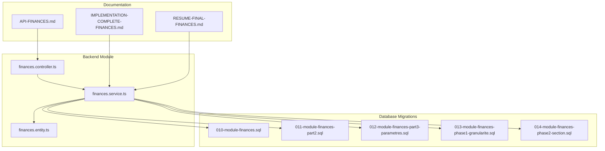
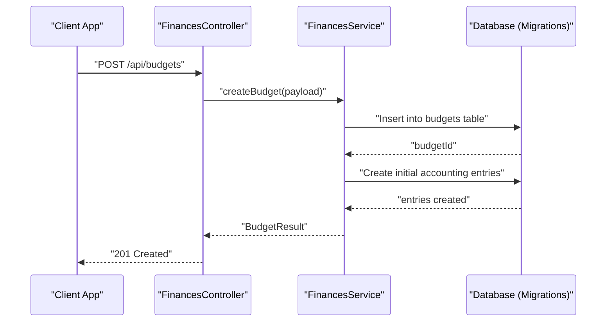
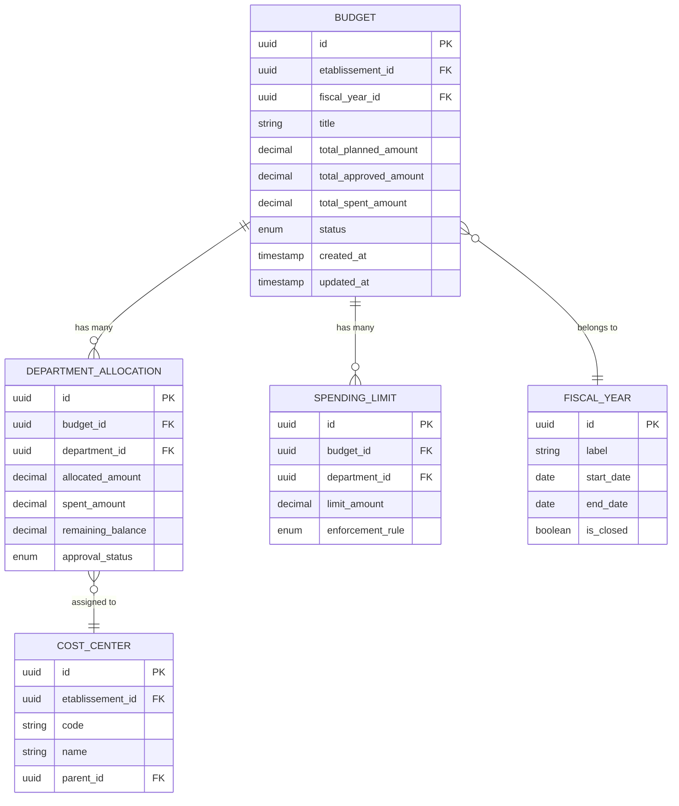
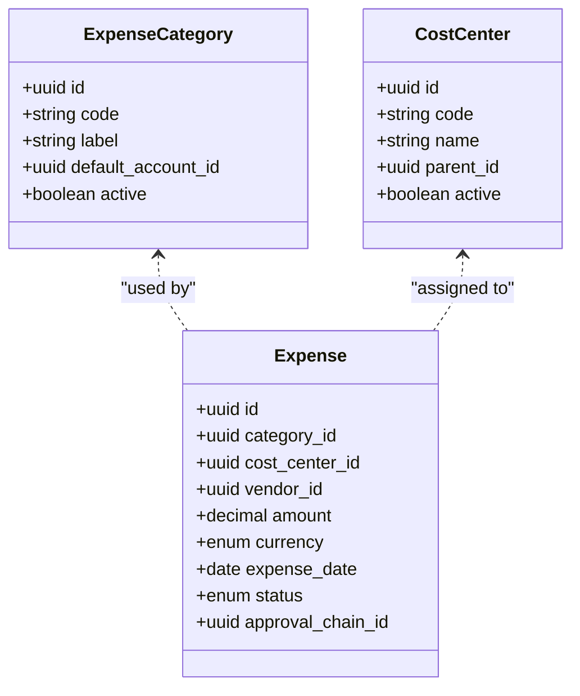
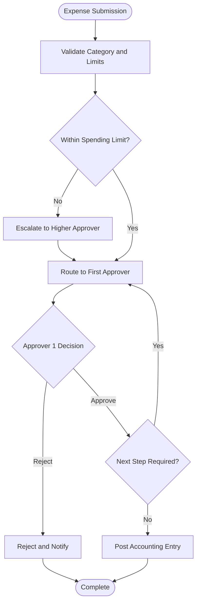
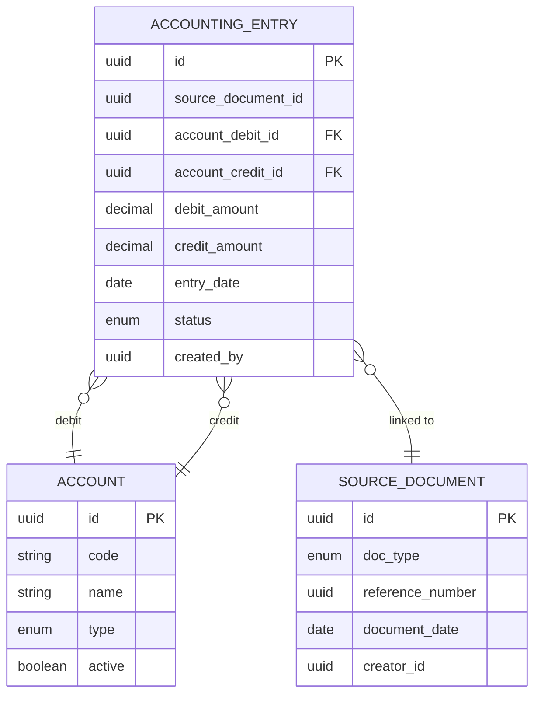
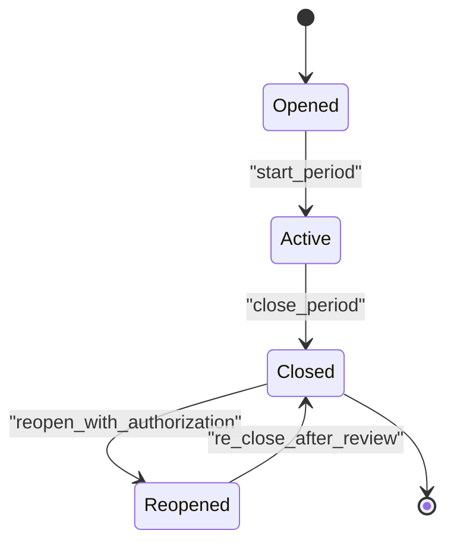
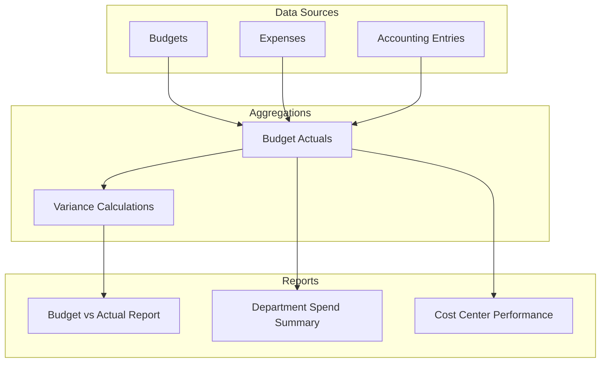
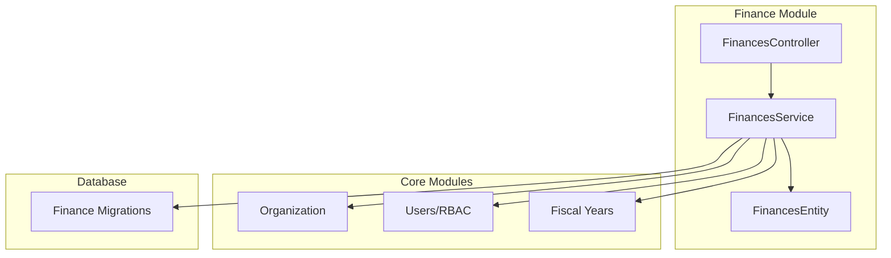

# Budget & Expense Tracking

<cite>
**Referenced Files in This Document**
- [010-module-finances.sql](file://backend/database/migrations/010-module-finances.sql)
- [011-module-finances-part2.sql](file://backend/database/migrations/011-module-finances-part2.sql)
- [012-module-finances-part3-parametres.sql](file://backend/database/migrations/012-module-finances-part3-parametres.sql)
- [013-module-finances-phase1-granularite.sql](file://backend/database/migrations/013-module-finances-phase1-granularite.sql)
- [014-module-finances-phase2-section.sql](file://backend/database/migrations/014-module-finances-phase2-section.sql)
- [finances.controller.ts](file://backend/src/modules/finances/controllers/finances.controller.ts)
- [finances.service.ts](file://backend/src/modules/finances/services/finances.service.ts)
- [finances.entity.ts](file://backend/src/modules/finances/entities/finances.entity.ts)
- [API-FINANCES.md](file://docs/API-FINANCES.md)
- [IMPLEMENTATION-COMPLETE-FINANCES.md](file://docs/implementations/IMPLEMENTATION-COMPLETE-FINANCES.md)
- [RESUME-FINAL-FINANCES.md](file://docs/resumes/RESUME-FINAL-FINANCES.md)
</cite>

## Table of Contents
1. [Introduction](#introduction)
2. [Project Structure](#project-structure)
3. [Core Components](#core-components)
4. [Architecture Overview](#architecture-overview)
5. [Detailed Component Analysis](#detailed-component-analysis)
6. [Dependency Analysis](#dependency-analysis)
7. [Performance Considerations](#performance-considerations)
8. [Troubleshooting Guide](#troubleshooting-guide)
9. [Conclusion](#conclusion)
10. [Appendices](#appendices)

## Introduction
This document provides comprehensive data model documentation for eLISAschool’s budget and expense tracking system. It focuses on the financial module’s entities, relationships, workflows, and reporting structures, including:
- Budget entity with annual planning, department allocations, and spending limits
- Expense categories, approval workflows, and cost center management
- Accounting entries (comptabilité) following double-entry bookkeeping principles
- Financial reporting structures, variance analysis, and budget vs actual comparisons
- Expense approval chains, vendor management, and procurement workflows
- Fiscal year management, carry-over balances, and financial period closing procedures

The content synthesizes database schema migrations, service/controller logic, and implementation notes to present a clear, accessible view of the financial data model and processes.

## Project Structure
The finance module is implemented under backend/src/modules/finances and persisted via SQL migrations in backend/database/migrations. Key artifacts include:
- Database schema definitions for budgets, expenses, accounting entries, vendors, and configuration
- Controller and service layers exposing APIs and business logic
- Documentation describing API contracts and implementation details



**Diagram sources**
- [010-module-finances.sql](file://backend/database/migrations/010-module-finances.sql)
- [011-module-finances-part2.sql](file://backend/database/migrations/011-module-finances-part2.sql)
- [012-module-finances-part3-parametres.sql](file://backend/database/migrations/012-module-finances-part3-parametres.sql)
- [013-module-finances-phase1-granularite.sql](file://backend/database/migrations/013-module-finances-phase1-granularite.sql)
- [014-module-finances-phase2-section.sql](file://backend/database/migrations/014-module-finances-phase2-section.sql)
- [finances.controller.ts](file://backend/src/modules/finances/controllers/finances.controller.ts)
- [finances.service.ts](file://backend/src/modules/finances/services/finances.service.ts)
- [finances.entity.ts](file://backend/src/modules/finances/entities/finances.entity.ts)
- [API-FINANCES.md](file://docs/API-FINANCES.md)
- [IMPLEMENTATION-COMPLETE-FINANCES.md](file://docs/implementations/IMPLEMENTATION-COMPLETE-FINANCES.md)
- [RESUME-FINAL-FINANCES.md](file://docs/resumes/RESUME-FINAL-FINANCES.md)

**Section sources**
- [010-module-finances.sql](file://backend/database/migrations/010-module-finances.sql)
- [011-module-finances-part2.sql](file://backend/database/migrations/011-module-finances-part2.sql)
- [012-module-finances-part3-parametres.sql](file://backend/database/migrations/012-module-finances-part3-parametres.sql)
- [013-module-finances-phase1-granularite.sql](file://backend/database/migrations/013-module-finances-phase1-granularite.sql)
- [014-module-finances-phase2-section.sql](file://backend/database/migrations/014-module-finances-phase2-section.sql)
- [finances.controller.ts](file://backend/src/modules/finances/controllers/finances.controller.ts)
- [finances.service.ts](file://backend/src/modules/finances/services/finances.service.ts)
- [finances.entity.ts](file://backend/src/modules/finances/entities/finances.entity.ts)
- [API-FINANCES.md](file://docs/API-FINANCES.md)
- [IMPLEMENTATION-COMPLETE-FINANCES.md](file://docs/implementations/IMPLEMENTATION-COMPLETE-FINANCES.md)
- [RESUME-FINAL-FINANCES.md](file://docs/resumes/RESUME-FINAL-FINANCES.md)

## Core Components
This section outlines the primary data entities and their responsibilities within the budget and expense tracking system.

- Budget Entity
  - Represents annual budget plans per establishment and fiscal year
  - Supports department-level allocations and spending limits
  - Tracks planned amounts, approved amounts, and remaining balances
  - Links to fiscal periods and cost centers for granular control

- Expense Categories
  - Standardized classification of expenditures (e.g., supplies, services, capital)
  - Enables consistent reporting and aggregation across departments
  - Associated with default accounts for automatic accounting entry generation

- Cost Centers
  - Organizational units responsible for incurring costs
  - Used to attribute expenses and compare against budget allocations
  - Hierarchical or flat structures depending on institutional needs

- Accounting Entries (Comptabilité)
  - Double-entry bookkeeping records capturing debits and credits
  - Each transaction posts balanced entries to relevant accounts
  - Linked to source documents (invoices, purchase orders, approvals)

- Approval Workflows
  - Configurable multi-step approval chains for expenses and purchases
  - Enforces spending limits and policy compliance before posting
  - Maintains audit trails with timestamps and approver identities

- Vendor Management
  - Central registry of suppliers and service providers
  - Stores contact, tax, and payment terms information
  - Integrates with procurement and invoice processing

- Procurement Workflows
  - Purchase requisitions to purchase orders to goods receipt and invoicing
  - Ensures three-way matching and budget checks prior to payment

- Fiscal Year and Periods
  - Annual fiscal calendars with defined opening/closing windows
  - Carry-over rules for unspent balances and rollover policies
  - Closing procedures lock periods and generate summary reports

**Section sources**
- [010-module-finances.sql](file://backend/database/migrations/010-module-finances.sql)
- [011-module-finances-part2.sql](file://backend/database/migrations/011-module-finances-part2.sql)
- [012-module-finances-part3-parametres.sql](file://backend/database/migrations/012-module-finances-part3-parametres.sql)
- [013-module-finances-phase1-granularite.sql](file://backend/database/migrations/013-module-finances-phase1-granularite.sql)
- [014-module-finances-phase2-section.sql](file://backend/database/migrations/014-module-finances-phase2-section.sql)
- [finances.entity.ts](file://backend/src/modules/finances/entities/finances.entity.ts)
- [API-FINANCES.md](file://docs/API-FINANCES.md)
- [IMPLEMENTATION-COMPLETE-FINANCES.md](file://docs/implementations/IMPLEMENTATION-COMPLETE-FINANCES.md)
- [RESUME-FINAL-FINANCES.md](file://docs/resumes/RESUME-FINAL-FINANCES.md)

## Architecture Overview
The finance module follows a layered architecture:
- Controllers expose REST endpoints for budget and expense operations
- Services implement business rules, validations, and workflow orchestration
- Entities map to database tables defined by migrations
- Migrations define schema evolution for budgets, expenses, accounts, and related entities



**Diagram sources**
- [finances.controller.ts](file://backend/src/modules/finances/controllers/finances.controller.ts)
- [finances.service.ts](file://backend/src/modules/finances/services/finances.service.ts)
- [010-module-finances.sql](file://backend/database/migrations/010-module-finances.sql)

**Section sources**
- [finances.controller.ts](file://backend/src/modules/finances/controllers/finances.controller.ts)
- [finances.service.ts](file://backend/src/modules/finances/services/finances.service.ts)
- [010-module-finances.sql](file://backend/database/migrations/010-module-finances.sql)

## Detailed Component Analysis

### Budget Data Model
The budget data model supports annual planning and departmental allocation with spending controls.



**Diagram sources**
- [010-module-finances.sql](file://backend/database/migrations/010-module-finances.sql)
- [013-module-finances-phase1-granularite.sql](file://backend/database/migrations/013-module-finances-phase1-granularite.sql)
- [014-module-finances-phase2-section.sql](file://backend/database/migrations/014-module-finances-phase2-section.sql)

**Section sources**
- [010-module-finances.sql](file://backend/database/migrations/010-module-finances.sql)
- [013-module-finances-phase1-granularite.sql](file://backend/database/migrations/013-module-finances-phase1-granularite.sql)
- [014-module-finances-phase2-section.sql](file://backend/database/migrations/014-module-finances-phase2-section.sql)

### Expense Categories and Cost Center Management
Expenses are categorized and attributed to cost centers to enable accurate reporting and budget monitoring.



**Diagram sources**
- [011-module-finances-part2.sql](file://backend/database/migrations/011-module-finances-part2.sql)
- [013-module-finances-phase1-granularite.sql](file://backend/database/migrations/013-module-finances-phase1-granularite.sql)

**Section sources**
- [011-module-finances-part2.sql](file://backend/database/migrations/011-module-finances-part2.sql)
- [013-module-finances-phase1-granularite.sql](file://backend/database/migrations/013-module-finances-phase1-granularite.sql)

### Approval Workflows and Procurement Chains
Approval workflows enforce policy compliance and spending limits before transactions are posted.



**Diagram sources**
- [012-module-finances-part3-parametres.sql](file://backend/database/migrations/012-module-finances-part3-parametres.sql)
- [finances.service.ts](file://backend/src/modules/finances/services/finances.service.ts)

**Section sources**
- [012-module-finances-part3-parametres.sql](file://backend/database/migrations/012-module-finances-part3-parametres.sql)
- [finances.service.ts](file://backend/src/modules/finances/services/finances.service.ts)

### Accounting Entries (Double-Entry Bookkeeping)
Accounting entries ensure every transaction has balanced debits and credits linked to source documents.



**Diagram sources**
- [010-module-finances.sql](file://backend/database/migrations/010-module-finances.sql)
- [011-module-finances-part2.sql](file://backend/database/migrations/011-module-finances-part2.sql)

**Section sources**
- [010-module-finances.sql](file://backend/database/migrations/010-module-finances.sql)
- [011-module-finances-part2.sql](file://backend/database/migrations/011-module-finances-part2.sql)

### Vendor Management and Procurement Integration
Vendors are managed centrally and integrated with procurement workflows for purchases and invoices.

```mermaid
classDiagram
class Vendor {
+uuid id
+string legal_name
+string tax_id
+string contact_email
+string phone
+address billing_address
+payment_terms
+boolean active
}
class PurchaseOrder {
+uuid id
+uuid vendor_id
+uuid requester_id
+decimal total_amount
+enum status
+date order_date
}
class Invoice {
+uuid id
+uuid vendor_id
+uuid purchase_order_id
+decimal amount
+date invoice_date
+enum status
}
Vendor ||--o{ PurchaseOrder : "receives"
Vendor ||--o{ Invoice : "issues"
PurchaseOrder ||--o{ Invoice : "referenced by"
```

**Diagram sources**
- [011-module-finances-part2.sql](file://backend/database/migrations/011-module-finances-part2.sql)
- [013-module-finances-phase1-granularite.sql](file://backend/database/migrations/013-module-finances-phase1-granularite.sql)

**Section sources**
- [011-module-finances-part2.sql](file://backend/database/migrations/011-module-finances-part2.sql)
- [013-module-finances-phase1-granularite.sql](file://backend/database/migrations/013-module-finances-phase1-granularite.sql)

### Fiscal Year Management and Period Closing
Fiscal years define accounting periods with closing procedures that lock data and generate summaries.



**Diagram sources**
- [012-module-finances-part3-parametres.sql](file://backend/database/migrations/012-module-finances-part3-parametres.sql)
- [014-module-finances-phase2-section.sql](file://backend/database/migrations/014-module-finances-phase2-section.sql)

**Section sources**
- [012-module-finances-part3-parametres.sql](file://backend/database/migrations/012-module-finances-part3-parametres.sql)
- [014-module-finances-phase2-section.sql](file://backend/database/migrations/014-module-finances-phase2-section.sql)

### Financial Reporting and Variance Analysis
Reporting structures support budget vs actual comparisons and variance analysis at multiple levels.



**Diagram sources**
- [010-module-finances.sql](file://backend/database/migrations/010-module-finances.sql)
- [013-module-finances-phase1-granularite.sql](file://backend/database/migrations/013-module-finances-phase1-granularite.sql)
- [API-FINANCES.md](file://docs/API-FINANCES.md)

**Section sources**
- [010-module-finances.sql](file://backend/database/migrations/010-module-finances.sql)
- [013-module-finances-phase1-granularite.sql](file://backend/database/migrations/013-module-finances-phase1-granularite.sql)
- [API-FINANCES.md](file://docs/API-FINANCES.md)

## Dependency Analysis
The finance module depends on core organizational entities (establishments, departments, users) and integrates with RBAC for permissions.



**Diagram sources**
- [finances.controller.ts](file://backend/src/modules/finances/controllers/finances.controller.ts)
- [finances.service.ts](file://backend/src/modules/finances/services/finances.service.ts)
- [010-module-finances.sql](file://backend/database/migrations/010-module-finances.sql)

**Section sources**
- [finances.controller.ts](file://backend/src/modules/finances/controllers/finances.controller.ts)
- [finances.service.ts](file://backend/src/modules/finances/services/finances.service.ts)
- [010-module-finances.sql](file://backend/database/migrations/010-module-finances.sql)

## Performance Considerations
- Indexing strategies for frequently queried fields (dates, IDs, codes)
- Batch operations for bulk budget updates and accounting postings
- Pagination and filtering for large report datasets
- Caching of reference data (categories, cost centers, vendors)
- Transaction boundaries to ensure consistency during multi-step workflows

[No sources needed since this section provides general guidance]

## Troubleshooting Guide
Common issues and resolutions:
- Approval workflow failures due to missing permissions or invalid approvers
- Budget limit violations causing transaction rejections
- Accounting entry imbalance errors requiring manual correction
- Fiscal period closure conflicts preventing new postings
- Vendor data inconsistencies affecting invoice processing

Recommended steps:
- Review audit logs for approval chain decisions
- Validate budget allocations and spending limits before submission
- Ensure debits equal credits in accounting entries
- Verify fiscal period status and authorization for reopen operations
- Cleanse vendor master data and validate tax identifiers

**Section sources**
- [finances.service.ts](file://backend/src/modules/finances/services/finances.service.ts)
- [API-FINANCES.md](file://docs/API-FINANCES.md)
- [IMPLEMENTATION-COMPLETE-FINANCES.md](file://docs/implementations/IMPLEMENTATION-COMPLETE-FINANCES.md)

## Conclusion
The eLISAschool budget and expense tracking system provides a robust financial data model supporting annual planning, departmental allocations, controlled spending, and compliant accounting practices. The integration of approval workflows, vendor management, and fiscal period controls ensures operational integrity and transparency. Reporting capabilities enable effective variance analysis and decision-making across the institution.

[No sources needed since this section summarizes without analyzing specific files]

## Appendices

### API Reference Summary
Key endpoints for budget and expense operations are documented in the API specification.

**Section sources**
- [API-FINANCES.md](file://docs/API-FINANCES.md)

### Implementation Notes
Implementation details cover migration phases, feature rollouts, and integration points.

**Section sources**
- [IMPLEMENTATION-COMPLETE-FINANCES.md](file://docs/implementations/IMPLEMENTATION-COMPLETE-FINANCES.md)
- [RESUME-FINAL-FINANCES.md](file://docs/resumes/RESUME-FINAL-FINANCES.md)