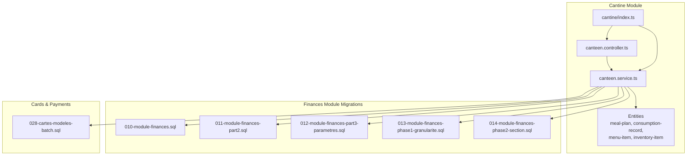
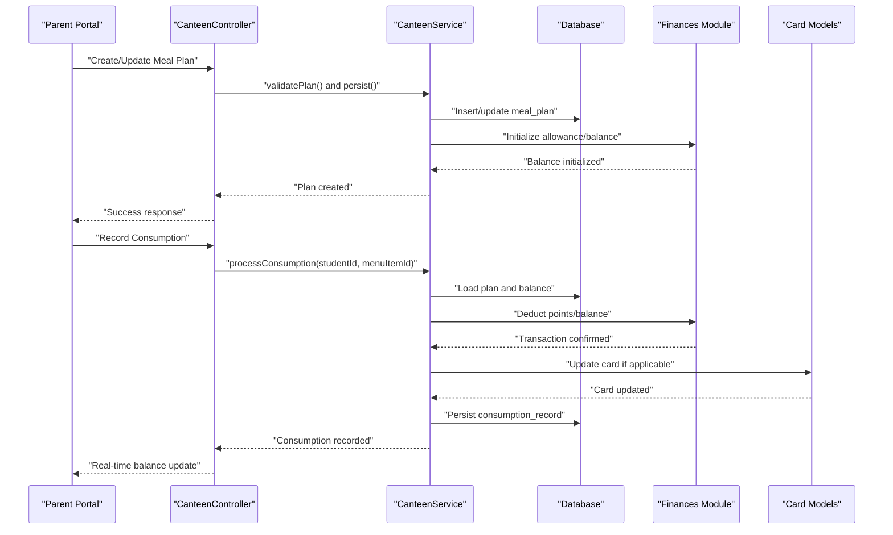
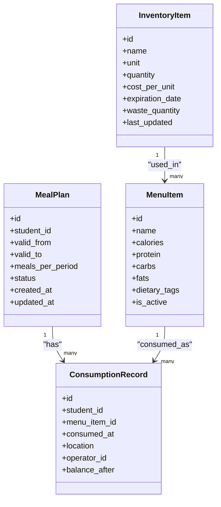
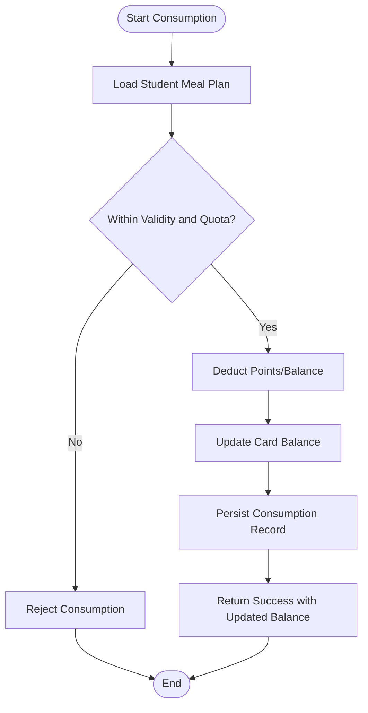
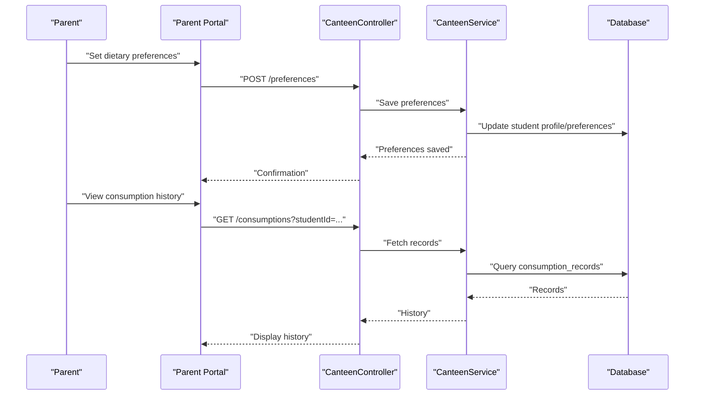
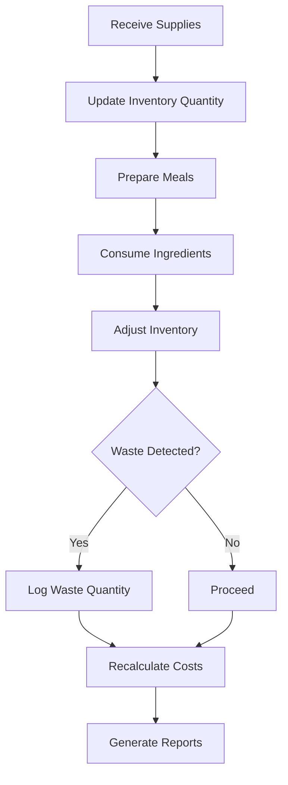
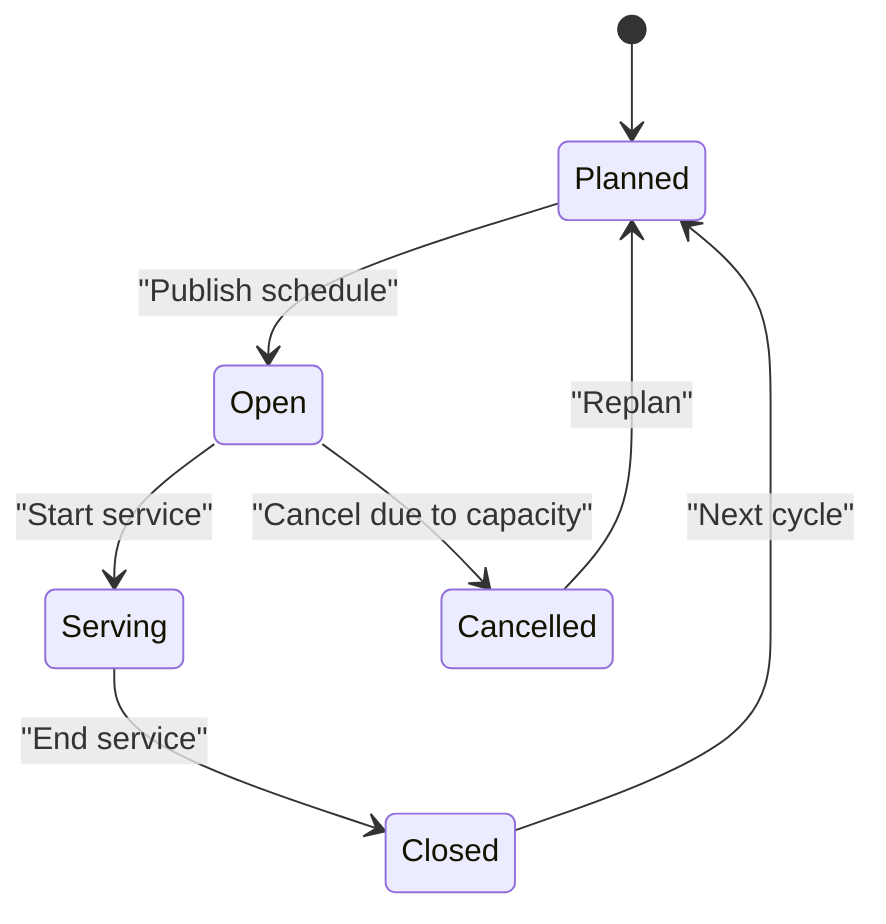
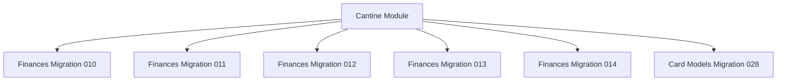

# Cafeteria Management

<cite>
**Referenced Files in This Document**
- [backend/src/modules/cantine/index.ts](file://backend/src/modules/cantine/index.ts)
- [backend/src/modules/cantine/entities/meal-plan.entity.ts](file://backend/src/modules/cantine/entities/meal-plan.entity.ts)
- [backend/src/modules/cantine/entities/consumption-record.entity.ts](file://backend/src/modules/cantine/entities/consumption-record.entity.ts)
- [backend/src/modules/cantine/entities/menu-item.entity.ts](file://backend/src/modules/cantine/entities/menu-item.entity.ts)
- [backend/src/modules/cantine/entities/inventory-item.entity.ts](file://backend/src/modules/cantine/entities/inventory-item.entity.ts)
- [backend/src/modules/cantine/controllers/canteen.controller.ts](file://backend/src/modules/cantine/controllers/canteen.controller.ts)
- [backend/src/modules/cantine/services/canteen.service.ts](file://backend/src/modules/cantine/services/canteen.service.ts)
- [backend/database/migrations/028-cartes-modeles-batch.sql](file://backend/database/migrations/028-cartes-modeles-batch.sql)
- [backend/database/migrations/010-module-finances.sql](file://backend/database/migrations/010-module-finances.sql)
- [backend/database/migrations/011-module-finances-part2.sql](file://backend/database/migrations/011-module-finances-part2.sql)
- [backend/database/migrations/012-module-finances-part3-parametres.sql](file://backend/database/migrations/012-module-finances-part3-parametres.sql)
- [backend/database/migrations/013-module-finances-phase1-granularite.sql](file://backend/database/migrations/013-module-finances-phase1-granularite.sql)
- [backend/database/migrations/014-module-finances-phase2-section.sql](file://backend/database/migrations/014-module-finances-phase2-section.sql)
</cite>

## Table of Contents
1. [Introduction](#introduction)
2. [Project Structure](#project-structure)
3. [Core Components](#core-components)
4. [Architecture Overview](#architecture-overview)
5. [Detailed Component Analysis](#detailed-component-analysis)
6. [Dependency Analysis](#dependency-analysis)
7. [Performance Considerations](#performance-considerations)
8. [Troubleshooting Guide](#troubleshooting-guide)
9. [Conclusion](#conclusion)

## Introduction
This document provides comprehensive data model documentation for the eLISAschool cafeteria (cantine) management system. It focuses on meal plan entities with subscription management, balance tracking, and consumption records; menu planning with nutritional information and dietary restrictions; point-based meal systems and cashless payment integration with real-time balance updates; parent-student communication for allowances and consumption monitoring; inventory management including food supplies, waste tracking, and cost calculations; and meal scheduling with capacity management and special dietary accommodations.

The documentation is grounded in the backend module structure and database migrations related to the cantine and finance modules, ensuring traceability from business concepts to implementation artifacts.

## Project Structure
The cantine feature is implemented as a dedicated module under the backend source tree. The module exposes controllers and services that orchestrate business logic and interact with the database layer. Related financial operations (points, balances, transactions) are supported by the finances module and its migrations.

**Diagram sources**
- [backend/src/modules/cantine/index.ts](file://backend/src/modules/cantine/index.ts)
- [backend/src/modules/cantine/controllers/canteen.controller.ts](file://backend/src/modules/cantine/controllers/canteen.controller.ts)
- [backend/src/modules/cantine/services/canteen.service.ts](file://backend/src/modules/cantine/services/canteen.service.ts)
- [backend/database/migrations/010-module-finances.sql](file://backend/database/migrations/010-module-finances.sql)
- [backend/database/migrations/011-module-finances-part2.sql](file://backend/database/migrations/011-module-finances-part2.sql)
- [backend/database/migrations/012-module-finances-part3-parametres.sql](file://backend/database/migrations/012-module-finances-part3-parametres.sql)
- [backend/database/migrations/013-module-finances-phase1-granularite.sql](file://backend/database/migrations/013-module-finances-phase1-granularite.sql)
- [backend/database/migrations/014-module-finances-phase2-section.sql](file://backend/database/migrations/014-module-finances-phase2-section.sql)
- [backend/database/migrations/028-cartes-modeles-batch.sql](file://backend/database/migrations/028-cartes-modeles-batch.sql)

**Section sources**
- [backend/src/modules/cantine/index.ts](file://backend/src/modules/cantine/index.ts)
- [backend/src/modules/cantine/controllers/canteen.controller.ts](file://backend/src/modules/cantine/controllers/canteen.controller.ts)
- [backend/src/modules/cantine/services/canteen.service.ts](file://backend/src/modules/cantine/services/canteen.service.ts)
- [backend/database/migrations/010-module-finances.sql](file://backend/database/migrations/010-module-finances.sql)
- [backend/database/migrations/011-module-finances-part2.sql](file://backend/database/migrations/011-module-finances-part2.sql)
- [backend/database/migrations/012-module-finances-part3-parametres.sql](file://backend/database/migrations/012-module-finances-part3-parametres.sql)
- [backend/database/migrations/013-module-finances-phase1-granularite.sql](file://backend/database/migrations/013-module-finances-phase1-granularite.sql)
- [backend/database/migrations/014-module-finances-phase2-section.sql](file://backend/database/migrations/014-module-finances-phase2-section.sql)
- [backend/database/migrations/028-cartes-modeles-batch.sql](file://backend/database/migrations/028-cartes-modeles-batch.sql)

## Core Components
This section outlines the primary data entities and their responsibilities within the cafeteria domain:

- Meal Plan
  - Represents a student’s subscription to a cafeteria plan (e.g., weekly or monthly).
  - Tracks validity periods, allowed meals per period, and associated pricing or points allocation.
  - Links to student profiles and optionally to responsible parties for allowance management.

- Consumption Record
  - Captures each meal consumed by a student at a specific time and location.
  - Associates with a menu item and deducts from the student’s available balance or points.
  - Supports auditability via timestamps and operator references.

- Menu Item
  - Defines dishes served in the cafeteria with descriptive metadata.
  - Includes nutritional information fields (e.g., calories, macronutrients) and tags for dietary restrictions (e.g., vegetarian, gluten-free).
  - May be linked to scheduled menus for specific days or sessions.

- Inventory Item
  - Models food supplies and ingredients used to prepare menu items.
  - Tracks quantities, units, costs, and expiration dates.
  - Supports waste logging and cost calculations based on usage and spoilage.

These components collectively enable subscription lifecycle management, real-time balance updates upon consumption, and operational oversight of menu and inventory.

**Section sources**
- [backend/src/modules/cantine/entities/meal-plan.entity.ts](file://backend/src/modules/cantine/entities/meal-plan.entity.ts)
- [backend/src/modules/cantine/entities/consumption-record.entity.ts](file://backend/src/modules/cantine/entities/consumption-record.entity.ts)
- [backend/src/modules/cantine/entities/menu-item.entity.ts](file://backend/src/modules/cantine/entities/menu-item.entity.ts)
- [backend/src/modules/cantine/entities/inventory-item.entity.ts](file://backend/src/modules/cantine/entities/inventory-item.entity.ts)

## Architecture Overview
The cafeteria system integrates with the finances module to support point-based meal systems and cashless payments. Key interactions include:

- Subscription Management: Creating and validating meal plans for students.
- Balance Tracking: Maintaining real-time balances and applying deductions during consumption.
- Payment Integration: Using card models and financial transactions to process payments and refunds.
- Reporting and Auditing: Recording consumption events and inventory changes for analytics and compliance.

**Diagram sources**
- [backend/src/modules/cantine/controllers/canteen.controller.ts](file://backend/src/modules/cantine/controllers/canteen.controller.ts)
- [backend/src/modules/cantine/services/canteen.service.ts](file://backend/src/modules/cantine/services/canteen.service.ts)
- [backend/database/migrations/010-module-finances.sql](file://backend/database/migrations/010-module-finances.sql)
- [backend/database/migrations/011-module-finances-part2.sql](file://backend/database/migrations/011-module-finances-part2.sql)
- [backend/database/migrations/012-module-finances-part3-parametres.sql](file://backend/database/migrations/012-module-finances-part3-parametres.sql)
- [backend/database/migrations/013-module-finances-phase1-granularite.sql](file://backend/database/migrations/013-module-finances-phase1-granularite.sql)
- [backend/database/migrations/014-module-finances-phase2-section.sql](file://backend/database/migrations/014-module-finances-phase2-section.sql)
- [backend/database/migrations/028-cartes-modeles-batch.sql](file://backend/database/migrations/028-cartes-modeles-batch.sql)

## Detailed Component Analysis

### Data Model Entities
The following class diagram maps core entities and their relationships:

**Diagram sources**
- [backend/src/modules/cantine/entities/meal-plan.entity.ts](file://backend/src/modules/cantine/entities/meal-plan.entity.ts)
- [backend/src/modules/cantine/entities/consumption-record.entity.ts](file://backend/src/modules/cantine/entities/consumption-record.entity.ts)
- [backend/src/modules/cantine/entities/menu-item.entity.ts](file://backend/src/modules/cantine/entities/menu-item.entity.ts)
- [backend/src/modules/cantine/entities/inventory-item.entity.ts](file://backend/src/modules/cantine/entities/inventory-item.entity.ts)

#### Meal Plan Entity
- Purpose: Encapsulates subscription details for a student, including validity windows and entitlements.
- Key attributes: identifiers, date ranges, meal quotas, status flags, timestamps.
- Relationships: One-to-many with consumption records; links to student and responsible party contexts.

**Section sources**
- [backend/src/modules/cantine/entities/meal-plan.entity.ts](file://backend/src/modules/cantine/entities/meal-plan.entity.ts)

#### Consumption Record Entity
- Purpose: Records each meal event, enabling balance deduction and reporting.
- Key attributes: student reference, menu item reference, timestamp, location, operator, post-deduction balance.
- Relationships: Many-to-one with meal plan context; many-to-one with menu item.

**Section sources**
- [backend/src/modules/cantine/entities/consumption-record.entity.ts](file://backend/src/modules/cantine/entities/consumption-record.entity.ts)

#### Menu Item Entity
- Purpose: Describes dishes with nutritional metadata and dietary tags.
- Key attributes: name, nutritional values (calories, protein, carbs, fats), dietary tags, active flag.
- Relationships: Used by consumption records; composed from inventory items.

**Section sources**
- [backend/src/modules/cantine/entities/menu-item.entity.ts](file://backend/src/modules/cantine/entities/menu-item.entity.ts)

#### Inventory Item Entity
- Purpose: Manages food supplies, costs, and waste.
- Key attributes: unit type, quantity, cost per unit, expiration date, waste quantity, last updated timestamp.
- Relationships: Supplies menu items; supports cost calculations and waste tracking.

**Section sources**
- [backend/src/modules/cantine/entities/inventory-item.entity.ts](file://backend/src/modules/cantine/entities/inventory-item.entity.ts)

### Point-Based Meal System and Cashless Payments
The system supports point-based meal plans integrated with financial transactions and card models:

- Points Allocation: Meal plans allocate points per period; consumption deducts points accordingly.
- Real-Time Balance Updates: Deductions are applied atomically with consumption recording.
- Card Integration: Card models facilitate cashless payments and balance synchronization.

**Diagram sources**
- [backend/src/modules/cantine/services/canteen.service.ts](file://backend/src/modules/cantine/services/canteen.service.ts)
- [backend/database/migrations/010-module-finances.sql](file://backend/database/migrations/010-module-finances.sql)
- [backend/database/migrations/011-module-finances-part2.sql](file://backend/database/migrations/011-module-finances-part2.sql)
- [backend/database/migrations/012-module-finances-part3-parametres.sql](file://backend/database/migrations/012-module-finances-part3-parametres.sql)
- [backend/database/migrations/013-module-finances-phase1-granularite.sql](file://backend/database/migrations/013-module-finances-phase1-granularite.sql)
- [backend/database/migrations/014-module-finances-phase2-section.sql](file://backend/database/migrations/014-module-finances-phase2-section.sql)
- [backend/database/migrations/028-cartes-modeles-batch.sql](file://backend/database/migrations/028-cartes-modeles-batch.sql)

### Parent-Student Communication
Parents can manage allowances and monitor consumption through the portal:

- Allowance Management: Parents adjust allowances tied to meal plans.
- Consumption Monitoring: Real-time notifications and dashboards show recent meals and remaining balances.
- Dietary Preferences: Parents can set preferences and restrictions for students.

[No sources needed since this diagram shows conceptual workflow, not actual code structure]

### Inventory Management and Cost Calculations
Inventory tracks supplies, waste, and costs:

- Supply Tracking: Quantities and units for ingredients.
- Waste Logging: Spoilage and discard events reduce available stock.
- Cost Calculation: Aggregated costs based on usage and waste inform budgeting and pricing.

[No sources needed since this diagram shows conceptual workflow, not actual code structure]

### Meal Scheduling and Capacity Management
Meal scheduling aligns menu items with service times and locations:

- Scheduling: Assign menu items to specific days and sessions.
- Capacity Limits: Enforce maximum servings per session to avoid overbooking.
- Special Accommodations: Honor dietary restrictions and alternative menus.

[No sources needed since this diagram shows conceptual workflow, not actual code structure]

## Dependency Analysis
The cantine module depends on the finances module for transactional integrity and on card models for cashless payments. Database migrations define schemas for financial granularity, sections, parameters, and card templates.

**Diagram sources**
- [backend/database/migrations/010-module-finances.sql](file://backend/database/migrations/010-module-finances.sql)
- [backend/database/migrations/011-module-finances-part2.sql](file://backend/database/migrations/011-module-finances-part2.sql)
- [backend/database/migrations/012-module-finances-part3-parametres.sql](file://backend/database/migrations/012-module-finances-part3-parametres.sql)
- [backend/database/migrations/013-module-finances-phase1-granularite.sql](file://backend/database/migrations/013-module-finances-phase1-granularite.sql)
- [backend/database/migrations/014-module-finances-phase2-section.sql](file://backend/database/migrations/014-module-finances-phase2-section.sql)
- [backend/database/migrations/028-cartes-modeles-batch.sql](file://backend/database/migrations/028-cartes-modeles-batch.sql)

**Section sources**
- [backend/database/migrations/010-module-finances.sql](file://backend/database/migrations/010-module-finances.sql)
- [backend/database/migrations/011-module-finances-part2.sql](file://backend/database/migrations/011-module-finances-part2.sql)
- [backend/database/migrations/012-module-finances-part3-parametres.sql](file://backend/database/migrations/012-module-finances-part3-parametres.sql)
- [backend/database/migrations/013-module-finances-phase1-granularite.sql](file://backend/database/migrations/013-module-finances-phase1-granularite.sql)
- [backend/database/migrations/014-module-finances-phase2-section.sql](file://backend/database/migrations/014-module-finances-phase2-section.sql)
- [backend/database/migrations/028-cartes-modeles-batch.sql](file://backend/database/migrations/028-cartes-modeles-batch.sql)

## Performance Considerations
- Indexing: Ensure indexes on frequently queried fields such as student_id, consumed_at, and menu_item_id to optimize consumption history retrieval.
- Transactions: Wrap balance deductions and record persistence in atomic transactions to prevent inconsistent states.
- Batch Operations: Use batch inserts for bulk consumption events (e.g., end-of-day processing) to reduce database round-trips.
- Caching: Cache menu items and dietary tags to minimize repeated reads during peak hours.
- Audit Trails: Maintain lightweight audit logs to support performance while preserving traceability.

[No sources needed since this section provides general guidance]

## Troubleshooting Guide
Common issues and resolutions:

- Balance Deduction Failures
  - Verify meal plan validity and quota availability before processing consumption.
  - Check financial transaction logs for failed deductions and reconcile with consumption records.

- Card Sync Errors
  - Confirm card model configuration and connectivity.
  - Retry failed card updates with idempotency keys to avoid duplicate charges.

- Inventory Discrepancies
  - Reconcile waste logs with inventory adjustments.
  - Validate cost calculations against purchase orders and supplier invoices.

- Dietary Restriction Conflicts
  - Cross-check menu item tags with student preferences.
  - Provide fallback menu options when conflicts arise.

**Section sources**
- [backend/src/modules/cantine/services/canteen.service.ts](file://backend/src/modules/cantine/services/canteen.service.ts)
- [backend/src/modules/cantine/controllers/canteen.controller.ts](file://backend/src/modules/cantine/controllers/canteen.controller.ts)
- [backend/database/migrations/010-module-finances.sql](file://backend/database/migrations/010-module-finances.sql)
- [backend/database/migrations/028-cartes-modeles-batch.sql](file://backend/database/migrations/028-cartes-modeles-batch.sql)

## Conclusion
The eLISAschool cafeteria management system provides a robust data model and integration framework for managing meal subscriptions, consumption, nutrition, inventory, and payments. By leveraging the finances module and card models, it ensures accurate balance tracking and real-time updates. The documented entities and workflows support scalable operations, parental engagement, and informed decision-making through reporting and audits.

[No sources needed since this section summarizes without analyzing specific files]