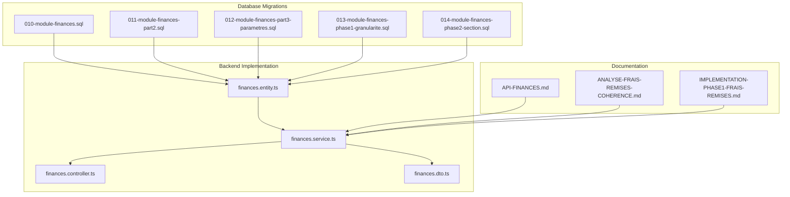
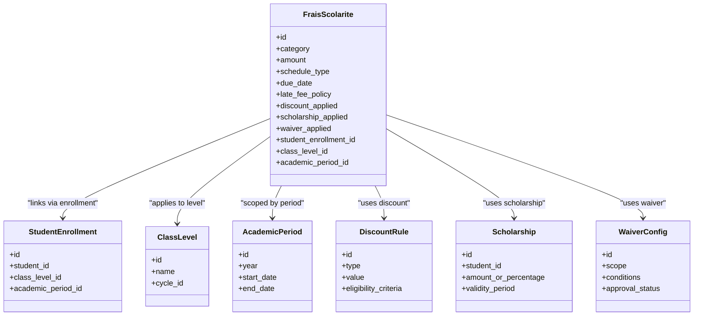
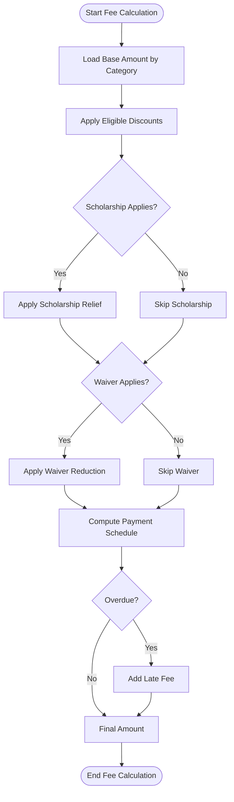

# Fee Structure Management

<cite>
**Referenced Files in This Document**
- [010-module-finances.sql](file://backend/database/migrations/010-module-finances.sql)
- [011-module-finances-part2.sql](file://backend/database/migrations/011-module-finances-part2.sql)
- [012-module-finances-part3-parametres.sql](file://backend/database/migrations/012-module-finances-part3-parametres.sql)
- [013-module-finances-phase1-granularite.sql](file://backend/database/migrations/013-module-finances-phase1-granularite.sql)
- [014-module-finances-phase2-section.sql](file://backend/database/migrations/014-module-finances-phase2-section.sql)
- [finances.service.ts](file://backend/src/modules/finances/services/finances.service.ts)
- [finances.controller.ts](file://backend/src/modules/finances/controllers/finances.controller.ts)
- [finances.dto.ts](file://backend/src/modules/finances/dto/finances.dto.ts)
- [finances.entity.ts](file://backend/src/modules/finances/entities/finances.entity.ts)
- [API-FINANCES.md](file://docs/API-FINANCES.md)
- [ANALYSE-FRAIS-REMISES-COHERENCE.md](file://docs/analyses/ANALYSE-FRAIS-REMISES-COHERENCE.md)
- [IMPLEMENTATION-PHASE1-FRAIS-REMISES.md](file://docs/implementations/IMPLEMENTATION-PHASE1-FRAIS-REMISES.md)
</cite>

## Table of Contents
1. [Introduction](#introduction)
2. [Project Structure](#project-structure)
3. [Core Components](#core-components)
4. [Architecture Overview](#architecture-overview)
5. [Detailed Component Analysis](#detailed-component-analysis)
6. [Dependency Analysis](#dependency-analysis)
7. [Performance Considerations](#performance-considerations)
8. [Troubleshooting Guide](#troubleshooting-guide)
9. [Conclusion](#conclusion)
10. [Appendices](#appendices)

## Introduction
This document provides comprehensive data model documentation for eLISAschool’s fee structure management system, focusing on the frais_scolarite entity and related financial constructs. It explains tuition fee categories, payment schedules, discount systems, scholarships, waivers, late fees, installment plans, partial payments, and relationships with student enrollment, class levels, and academic periods. The goal is to enable both technical and non-technical stakeholders to understand how fees are modeled, calculated, scheduled, and enforced across different educational levels and scenarios.

## Project Structure
The fee structure management spans database migrations (schema), backend services/controllers/dtos/entities, and documentation. Key areas include:
- Database schema definitions for finances module and parameters
- Backend implementation for fee calculations, discounts, scholarships, and scheduling
- API documentation and analysis documents describing behavior and coherence

**Diagram sources**
- [010-module-finances.sql](file://backend/database/migrations/010-module-finances.sql)
- [011-module-finances-part2.sql](file://backend/database/migrations/011-module-finances-part2.sql)
- [012-module-finances-part3-parametres.sql](file://backend/database/migrations/012-module-finances-part3-parametres.sql)
- [013-module-finances-phase1-granularite.sql](file://backend/database/migrations/013-module-finances-phase1-granularite.sql)
- [014-module-finances-phase2-section.sql](file://backend/database/migrations/014-module-finances-phase2-section.sql)
- [finances.entity.ts](file://backend/src/modules/finances/entities/finances.entity.ts)
- [finances.service.ts](file://backend/src/modules/finances/services/finances.service.ts)
- [finances.controller.ts](file://backend/src/modules/finances/controllers/finances.controller.ts)
- [finances.dto.ts](file://backend/src/modules/finances/dto/finances.dto.ts)
- [API-FINANCES.md](file://docs/API-FINANCES.md)
- [ANALYSE-FRAIS-REMISES-COHERENCE.md](file://docs/analyses/ANALYSE-FRAIS-REMISES-COHERENCE.md)
- [IMPLEMENTATION-PHASE1-FRAIS-REMISES.md](file://docs/implementations/IMPLEMENTATION-PHASE1-FRAIS-REMISES.md)

**Section sources**
- [010-module-finances.sql](file://backend/database/migrations/010-module-finances.sql)
- [011-module-finances-part2.sql](file://backend/database/migrations/011-module-finances-part2.sql)
- [012-module-finances-part3-parametres.sql](file://backend/database/migrations/012-module-finances-part3-parametres.sql)
- [013-module-finances-phase1-granularite.sql](file://backend/database/migrations/013-module-finances-phase1-granularite.sql)
- [014-module-finances-phase2-section.sql](file://backend/database/migrations/014-module-finances-phase2-section.sql)
- [finances.entity.ts](file://backend/src/modules/finances/entities/finances.entity.ts)
- [finances.service.ts](file://backend/src/modules/finances/services/finances.service.ts)
- [finances.controller.ts](file://backend/src/modules/finances/controllers/finances.controller.ts)
- [finances.dto.ts](file://backend/src/modules/finances/dto/finances.dto.ts)
- [API-FINANCES.md](file://docs/API-FINANCES.md)
- [ANALYSE-FRAIS-REMISES-COHERENCE.md](file://docs/analyses/ANALYSE-FRAIS-REMISES-COHERENCE.md)
- [IMPLEMENTATION-PHASE1-FRAIS-REMISES.md](file://docs/implementations/IMPLEMENTATION-PHASE1-FRAIS-REMISES.md)

## Core Components
This section outlines the primary entities and concepts that underpin the fee structure management system:
- frais_scolarite: Represents a school fee line item with category, amount, schedule, and applicability rules.
- Fee types: Tuition, registration, library, extracurricular activities, and other configurable types.
- Payment schedules: Installment plans, due dates, grace periods, and late fee policies.
- Discounts and promotions: Percentage or fixed reductions applied based on eligibility criteria.
- Scholarships and waivers: Partial or full fee relief tied to student profiles or administrative decisions.
- Relationships: Links to student enrollment, class levels, and academic periods.

Key responsibilities:
- Define fee categories and their base amounts.
- Apply calculation rules including discounts, scholarships, and waivers.
- Generate payment schedules and enforce late fee policies.
- Support partial payments and track outstanding balances.

**Section sources**
- [010-module-finances.sql](file://backend/database/migrations/010-module-finances.sql)
- [011-module-finances-part2.sql](file://backend/database/migrations/011-module-finances-part2.sql)
- [012-module-finances-part3-parametres.sql](file://backend/database/migrations/012-module-finances-part3-parametres.sql)
- [013-module-finances-phase1-granularite.sql](file://backend/database/migrations/013-module-finances-phase1-granularite.sql)
- [014-module-finances-phase2-section.sql](file://backend/database/migrations/014-module-finances-phase2-section.sql)
- [finances.entity.ts](file://backend/src/modules/finances/entities/finances.entity.ts)
- [finances.service.ts](file://backend/src/modules/finances/services/finances.service.ts)
- [finances.controller.ts](file://backend/src/modules/finances/controllers/finances.controller.ts)
- [finances.dto.ts](file://backend/src/modules/finances/dto/finances.dto.ts)
- [API-FINANCES.md](file://docs/API-FINANCES.md)
- [ANALYSE-FRAIS-REMISES-COHERENCE.md](file://docs/analyses/ANALYSE-FRAIS-REMISES-COHERENCE.md)
- [IMPLEMENTATION-PHASE1-FRAIS-REMISES.md](file://docs/implementations/IMPLEMENTATION-PHASE1-FRAIS-REMISES.md)

## Architecture Overview
The fee structure management architecture integrates database schema, service logic, and controller endpoints to provide a cohesive system for defining, calculating, and managing school fees.

**Diagram sources**
- [010-module-finances.sql](file://backend/database/migrations/010-module-finances.sql)
- [011-module-finances-part2.sql](file://backend/database/migrations/011-module-finances-part2.sql)
- [012-module-finances-part3-parametres.sql](file://backend/database/migrations/012-module-finances-part3-parametres.sql)
- [013-module-finances-phase1-granularite.sql](file://backend/database/migrations/013-module-finances-phase1-granularite.sql)
- [014-module-finances-phase2-section.sql](file://backend/database/migrations/014/module-finances-phase2-section.sql)
- [finances.entity.ts](file://backend/src/modules/finances/entities/finances.entity.ts)

## Detailed Component Analysis

### Data Model: frais_scolarite Entity
The frais_scolarite entity models individual fee items with attributes for categorization, monetary values, scheduling, and policy application. It connects to enrollment, class level, and academic period contexts to scope applicability.

Key aspects:
- Category: Defines fee type such as tuition, registration, library, extracurricular.
- Amount: Base fee value before discounts/scholarships/waivers.
- Schedule type: Supports lump sum, installments, or custom plans.
- Due date and late fee policy: Enforces deadlines and penalties.
- Discount/scholarship/waiver flags: Indicate applied reductions and relief.
- Contextual links: Enrollment, class level, academic period.

Complexity considerations:
- Calculation order matters: base amount → discounts → scholarships → waivers → late fees.
- Partial payments reduce outstanding balance per schedule entry.
- Multi-period scoping ensures fees apply only within valid academic windows.

**Section sources**
- [010-module-finances.sql](file://backend/database/migrations/010-module-finances.sql)
- [011-module-finances-part2.sql](file://backend/database/migrations/011-module-finances-part2.sql)
- [012-module-finances-part3-parametres.sql](file://backend/database/migrations/012-module-finances-part3-parametres.sql)
- [013-module-finances-phase1-granularite.sql](file://backend/database/migrations/013-module-finances-phase1-granularite.sql)
- [014-module-finances-phase2-section.sql](file://backend/database/migrations/014/module-finances-phase2-section.sql)
- [finances.entity.ts](file://backend/src/modules/finances/entities/finances.entity.ts)

### Fee Types and Categories
Supported fee types include:
- Tuition: Core instructional costs, often varying by level or specialization.
- Registration: One-time enrollment or re-enrollment charges.
- Library fees: Access to resources and materials.
- Extracurricular activities: Clubs, sports, arts, and optional programs.

Rules:
- Each type can have distinct base amounts and applicable periods.
- Some types may be mandatory; others optional depending on program selection.
- Type-specific policies can define late fees and installment allowances.

**Section sources**
- [010-module-finances.sql](file://backend/database/migrations/010-module-finances.sql)
- [011-module-finances-part2.sql](file://backend/database/migrations/011-module-finances-part2.sql)
- [API-FINANCES.md](file://docs/API-FINANCES.md)

### Payment Schedules and Installment Plans
Payment schedules govern when and how much must be paid:
- Lump sum: Single due date for full amount.
- Installments: Multiple due dates with defined portions.
- Custom plans: Configurable intervals and amounts.

Late fee policies:
- Grace period: Days after due date before penalty applies.
- Penalty rate: Fixed amount or percentage per overdue installment.
- Enforcement: Blocks certain privileges until balance cleared.

Partial payments:
- Allowed per schedule entry if configured.
- Reduces outstanding balance proportionally.
- Tracks payment history and remaining obligations.

**Section sources**
- [013-module-finances-phase1-granularite.sql](file://backend/database/migrations/013-module-finances-phase1-granularite.sql)
- [014-module-finances-phase2-section.sql](file://backend/database/migrations/014/module-finances-phase2-section.sql)
- [finances.service.ts](file://backend/src/modules/finances/services/finances.service.ts)
- [API-FINANCES.md](file://docs/API-FINANCES.md)

### Discount Systems
Discounts reduce the base amount:
- Percentage-based: Applied as a proportion of the fee.
- Fixed amount: Direct subtraction from the fee.
- Eligibility criteria: Based on enrollment status, family size, early payment, etc.

Calculation flow:
- Determine eligible discounts.
- Apply highest priority discount first.
- Prevent double-counting overlapping discounts unless explicitly allowed.

**Section sources**
- [ANALYSE-FRAIS-REMISES-COHERENCE.md](file://docs/analyses/ANALYSE-FRAIS-REMISES-COHERENCE.md)
- [IMPLEMENTATION-PHASE1-FRAIS-REMISES.md](file://docs/implementations/IMPLEMENTATION-PHASE1-FRAIS-REMISES.md)
- [finances.service.ts](file://backend/src/modules/finances/services/finances.service.ts)

### Scholarship Management
Scholarships provide partial or full relief:
- Scope: Per-student or group-based.
- Validity: Time-bound within academic periods.
- Amount: Fixed or percentage-based.

Integration:
- Applied after discounts.
- May override certain fee types entirely.
- Requires approval workflow and audit trail.

**Section sources**
- [012-module-finances-part3-parametres.sql](file://backend/database/migrations/012-module-finances-part3-parametres.sql)
- [finances.service.ts](file://backend/src/modules/finances/services/finances.service.ts)
- [API-FINANCES.md](file://docs/API-FINANCES.md)

### Waiver Configurations
Waivers allow administrative exceptions:
- Scope: Specific students, groups, or conditions.
- Conditions: Financial hardship, special circumstances.
- Approval status: Pending, approved, rejected.

Effect:
- Can fully waive specific fee lines.
- Must be documented and auditable.
- Interacts with scholarships and discounts without duplication.

**Section sources**
- [012-module-finances-part3-parametres.sql](file://backend/database/migrations/012-module-finances-part3-parametres.sql)
- [finances.service.ts](file://backend/src/modules/finances/services/finances.service.ts)

### Late Fee Policies
Late fees incentivize timely payment:
- Triggered after grace period expires.
- Calculated per overdue installment or total outstanding.
- Accumulate until balance settled.

Policy configuration:
- Global defaults and per-fee-type overrides.
- Notification reminders before penalties apply.

**Section sources**
- [013-module-finances-phase1-granularite.sql](file://backend/database/migrations/013-module-finances-phase1-granularite.sql)
- [finances.service.ts](file://backend/src/modules/finances/services/finances.service.ts)

### Partial Payment Handling
Partial payments support flexible financing:
- Allowed per schedule entry if enabled.
- Recorded with timestamps and reference IDs.
- Outstanding balance recalculated after each payment.

Validation:
- Cannot exceed due amount for the installment.
- Must respect minimum payment thresholds if configured.

**Section sources**
- [014-module-finances-phase2-section.sql](file://backend/database/migrations/014/module-finances-phase2-section.sql)
- [finances.service.ts](file://backend/src/modules/finances/services/finances.service.ts)

### Relationship with Student Enrollment, Class Levels, and Academic Periods
Fees are scoped to:
- Student enrollment: Ensures fees apply to active enrollments.
- Class level: Differentiates amounts by educational stage.
- Academic period: Limits applicability to valid years/terms.

Constraints:
- Fees cannot be created outside valid period ranges.
- Changes in enrollment or level trigger recalculation.

**Section sources**
- [010-module-finances.sql](file://backend/database/migrations/010-module-finances.sql)
- [011-module-finances-part2.sql](file://backend/database/migrations/011-module-finances-part2.sql)
- [finances.entity.ts](file://backend/src/modules/finances/entities/finances.entity.ts)

### Examples of Complex Fee Structures
Scenarios:
- Primary education: Lower tuition, mandatory registration, optional library fee, no extracurricular surcharge.
- Secondary education: Higher tuition, exam-related fees, extracurricular options with separate billing.
- Special programs: Additional specialized fees, scholarship eligibility, customized installment plans.

Configuration tips:
- Use class-level templates to standardize fee sets.
- Apply conditional discounts for early payers or siblings.
- Enable late fee policies selectively per program.

**Section sources**
- [API-FINANCES.md](file://docs/API-FINANCES.md)
- [IMPLEMENTATION-PHASE1-FRAIS-REMISES.md](file://docs/implementations/IMPLEMENTATION-PHASE1-FRAIS-REMISES.md)

## Dependency Analysis
Fee calculation depends on multiple entities and policies. The following diagram illustrates key dependencies:

**Diagram sources**
- [finances.service.ts](file://backend/src/modules/finances/services/finances.service.ts)
- [013-module-finances-phase1-granularite.sql](file://backend/database/migrations/013-module-finances-phase1-granularite.sql)
- [014-module-finances-phase2-section.sql](file://backend/database/migrations/014/module-finances-phase2-section.sql)

**Section sources**
- [finances.service.ts](file://backend/src/modules/finances/services/finances.service.ts)
- [013-module-finances-phase1-granularite.sql](file://backend/database/migrations/013-module-finances-phase1-granularite.sql)
- [014-module-finances-phase2-section.sql](file://backend/database/migrations/014/module-finances-phase2-section.sql)

## Performance Considerations
- Indexing: Ensure indexes on foreign keys linking to enrollment, class level, and academic period for efficient queries.
- Batch operations: Use batch updates for generating schedules across many students.
- Caching: Cache frequently accessed fee templates and discount rules.
- Validation: Perform lightweight validation at API layer to avoid expensive DB calls.

[No sources needed since this section provides general guidance]

## Troubleshooting Guide
Common issues and resolutions:
- Duplicate discounts: Verify eligibility criteria and priority rules to prevent overlapping applications.
- Missing scholarships: Confirm validity periods and approval statuses.
- Late fee miscalculations: Review grace period settings and overdue detection logic.
- Partial payment errors: Ensure payment amounts do not exceed due limits and thresholds are respected.

Debugging steps:
- Inspect fee calculation logs in the service layer.
- Validate entity relationships and referential integrity.
- Cross-check configuration parameters for late fees and discounts.

**Section sources**
- [ANALYSE-FRAIS-REMISES-COHERENCE.md](file://docs/analyses/ANALYSE-FRAIS-REMISES-COHERENCE.md)
- [finances.service.ts](file://backend/src/modules/finances/services/finances.service.ts)

## Conclusion
The fee structure management system in eLISAschool provides a robust framework for modeling and enforcing school fees across diverse educational contexts. By leveraging clear data models, configurable policies, and well-defined calculation flows, it supports complex scenarios including discounts, scholarships, waivers, installment plans, and late fees. Proper configuration and adherence to best practices ensure accurate billing, compliance, and a positive user experience.

[No sources needed since this section summarizes without analyzing specific files]

## Appendices

### API Reference Summary
- Endpoints for creating, updating, and querying fee structures.
- Operations for applying discounts, scholarships, and waivers.
- Scheduling and payment tracking APIs.

**Section sources**
- [API-FINANCES.md](file://docs/API-FINANCES.md)
- [finances.controller.ts](file://backend/src/modules/finances/controllers/finances.controller.ts)
- [finances.dto.ts](file://backend/src/modules/finances/dto/finances.dto.ts)