# Financial Parameters & Configuration

<cite>
**Referenced Files in This Document**
- [010-module-finances.sql](file://backend/database/migrations/010-module-finances.sql)
- [011-module-finances-part2.sql](file://backend/database/migrations/011-module-finances-part2.sql)
- [012-module-finances-part3-parametres.sql](file://backend/database/migrations/012-module-finances-part3-parametres.sql)
- [013-module-finances-phase1-granularite.sql](file://backend/database/migrations/013-module-finances-phase1-granularite.sql)
- [014-module-finances-phase2-section.sql](file://backend/database/migrations/014-module-finances-phase2-section.sql)
- [finances.service.ts](file://backend/src/modules/finances/services/finances.service.ts)
- [finances.controller.ts](file://backend/src/modules/finances/controllers/finances.controller.ts)
- [finances.dto.ts](file://backend/src/modules/finances/dto/finances.dto.ts)
- [finances.entity.ts](file://backend/src/modules/finances/entities/finances.entity.ts)
- [audit-trail.md](file://backend/docs/audit-trail.md)
- [IMPLEMENTATION-COMPLETE-FINANCES.md](file://docs/implementations/IMPLEMENTATION-COMPLETE-FINANCES.md)
- [ANALYSE-GESTION-FINANCIERE.md](file://docs/analyses/ANALYSE-GESTION-FINANCIERE.md)
- [backup-auto.sh](file://docker/scripts/backup-auto.sh)
- [backup-manuel.sh](file://docker/scripts/backup-manuel.sh)
- [restore.sh](file://docker/scripts/restore.sh)
</cite>

## Table of Contents
1. [Introduction](#introduction)
2. [Project Structure](#project-structure)
3. [Core Components](#core-components)
4. [Architecture Overview](#architecture-overview)
5. [Detailed Component Analysis](#detailed-component-analysis)
6. [Dependency Analysis](#dependency-analysis)
7. [Performance Considerations](#performance-considerations)
8. [Troubleshooting Guide](#troubleshooting-guide)
9. [Conclusion](#conclusion)
10. [Appendices](#appendices)

## Introduction
This document provides comprehensive data model documentation for eLISAschool’s financial parameters and configuration system. It covers currency settings, tax configurations, regional financial regulations, late fee calculation rules, interest rate configurations, penalty structures, notification templates for payment reminders, invoice formats, receipt layouts, financial reporting parameters, audit trail configurations, compliance settings, multi-currency support with exchange rate management, internationalization features, backup configurations for financial data, and security settings for sensitive financial information. The content is grounded in the repository’s database migrations, service/controller implementations, DTOs, entities, and operational scripts.

## Project Structure
The financial module spans database schema definitions (migrations), backend services/controllers, DTOs, entities, and supporting documentation. Migrations define core tables and configuration structures; services implement business logic such as fee calculations and notifications; controllers expose APIs; DTOs enforce input validation; entities represent persistent models. Operational scripts manage backups and restores for financial data.

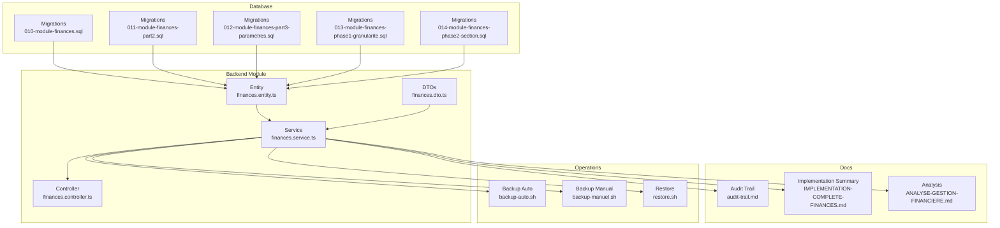

**Diagram sources**
- [010-module-finances.sql](file://backend/database/migrations/010-module-finances.sql)
- [011-module-finances-part2.sql](file://backend/database/migrations/011-module-finances-part2.sql)
- [012-module-finances-part3-parametres.sql](file://backend/database/migrations/012-module-finances-part3-parametres.sql)
- [013-module-finances-phase1-granularite.sql](file://backend/database/migrations/013-module-finances-phase1-granularite.sql)
- [014-module-finances-phase2-section.sql](file://backend/database/migrations/014-module-finances-phase2-section.sql)
- [finances.service.ts](file://backend/src/modules/finances/services/finances.service.ts)
- [finances.controller.ts](file://backend/src/modules/finances/controllers/finances.controller.ts)
- [finances.dto.ts](file://backend/src/modules/finances/dto/finances.dto.ts)
- [finances.entity.ts](file://backend/src/modules/finances/entities/finances.entity.ts)
- [audit-trail.md](file://backend/docs/audit-trail.md)
- [IMPLEMENTATION-COMPLETE-FINANCES.md](file://docs/implementations/IMPLEMENTATION-COMPLETE-FINANCES.md)
- [ANALYSE-GESTION-FINANCIERE.md](file://docs/analyses/ANALYSE-GESTION-FINANCIERE.md)
- [backup-auto.sh](file://docker/scripts/backup-auto.sh)
- [backup-manuel.sh](file://docker/scripts/backup-manuel.sh)
- [restore.sh](file://docker/scripts/restore.sh)

**Section sources**
- [010-module-finances.sql](file://backend/database/migrations/010-module-finances.sql)
- [011-module-finances-part2.sql](file://backend/database/migrations/011-module-finances-part2.sql)
- [012-module-finances-part3-parametres.sql](file://backend/database/migrations/012-module-finances-part3-parametres.sql)
- [013-module-finances-phase1-granularite.sql](file://backend/database/migrations/013-module-finances-phase1-granularite.sql)
- [014-module-finances-phase2-section.sql](file://backend/database/migrations/014-module-finances-phase2-section.sql)
- [finances.service.ts](file://backend/src/modules/finances/services/finances.service.ts)
- [finances.controller.ts](file://backend/src/modules/finances/controllers/finances.controller.ts)
- [finances.dto.ts](file://backend/src/modules/finances/dto/finances.dto.ts)
- [finances.entity.ts](file://backend/src/modules/finances/entities/finances.entity.ts)
- [audit-trail.md](file://backend/docs/audit-trail.md)
- [IMPLEMENTATION-COMPLETE-FINANCES.md](file://docs/implementations/IMPLEMENTATION-COMPLETE-FINANCES.md)
- [ANALYSE-GESTION-FINANCIERE.md](file://docs/analyses/ANALYSE-GESTION-FINANCIERE.md)
- [backup-auto.sh](file://docker/scripts/backup-auto.sh)
- [backup-manuel.sh](file://docker/scripts/backup-manuel.sh)
- [restore.sh](file://docker/scripts/restore.sh)

## Core Components
- Currency Settings: Defined via configuration tables and parameters to specify base currency, symbol, formatting, and decimal precision. These settings drive display and rounding behavior across invoices and receipts.
- Tax Configurations: Tables store tax types, rates, applicability rules, and jurisdictional constraints. Taxes can be applied per line or total based on configurable rules.
- Regional Financial Regulations: Parameters capture region-specific compliance flags, tax codes, and reporting requirements.
- Late Fee Calculation Rules: Configurable thresholds (grace period), flat fees, and percentage-based penalties are stored and computed by the service layer.
- Interest Rate Configurations: Annualized or periodic rates, compounding frequency, and accrual start dates are modeled for overdue balances.
- Penalty Structures: Additional charges for specific violations or non-compliance scenarios, with caps and exemptions.
- Notification Templates: Payment reminder templates with placeholders for dynamic fields (e.g., due date, amount, reference).
- Invoice Formats and Receipt Layouts: Template definitions control layout, branding, and field visibility for generated documents.
- Financial Reporting Parameters: Aggregation windows, grouping keys, and export formats for statements and summaries.
- Audit Trail Configurations: Event logging for financial operations, including who changed what and when.
- Compliance Settings: Flags for regulatory reporting, retention policies, and data masking.
- Multi-Currency Support and Exchange Rates: Currency catalog, conversion factors, effective dates, and source providers.
- Internationalization Features: Locale-aware formatting for amounts, dates, and labels.
- Backup and Security: Automated/manual backup scripts and security controls for sensitive financial data.

**Section sources**
- [010-module-finances.sql](file://backend/database/migrations/010-module-finances.sql)
- [011-module-finances-part2.sql](file://backend/database/migrations/011-module-finances-part2.sql)
- [012-module-finances-part3-parametres.sql](file://backend/database/migrations/012-module-finances-part3-parametres.sql)
- [013-module-finances-phase1-granularite.sql](file://backend/database/migrations/013-module-finances-phase1-granularite.sql)
- [014-module-finances-phase2-section.sql](file://backend/database/migrations/014-module-finances-phase2-section.sql)
- [finances.service.ts](file://backend/src/modules/finances/services/finances.service.ts)
- [finances.controller.ts](file://backend/src/modules/finances/controllers/finances.controller.ts)
- [finances.dto.ts](file://backend/src/modules/finances/dto/finances.dto.ts)
- [finances.entity.ts](file://backend/src/modules/finances/entities/finances.entity.ts)
- [audit-trail.md](file://backend/docs/audit-trail.md)
- [IMPLEMENTATION-COMPLETE-FINANCES.md](file://docs/implementations/IMPLEMENTATION-COMPLETE-FINANCES.md)
- [ANALYSE-GESTION-FINANCIERE.md](file://docs/analyses/ANALYSE-GESTION-FINANCIERE.md)
- [backup-auto.sh](file://docker/scripts/backup-auto.sh)
- [backup-manuel.sh](file://docker/scripts/backup-manuel.sh)
- [restore.sh](file://docker/scripts/restore.sh)

## Architecture Overview
The financial subsystem follows a layered architecture:
- Data Layer: Database migrations define schemas for currencies, taxes, fees, penalties, templates, reports, and audit logs.
- Service Layer: Business logic computes totals, applies taxes, calculates late fees and interest, and orchestrates notifications and document generation.
- Controller Layer: REST endpoints accept validated requests (via DTOs) and delegate to services.
- Entity Layer: ORM entities map to database tables and encapsulate domain behavior.
- Operations Layer: Scripts handle backups and restores for financial data integrity.

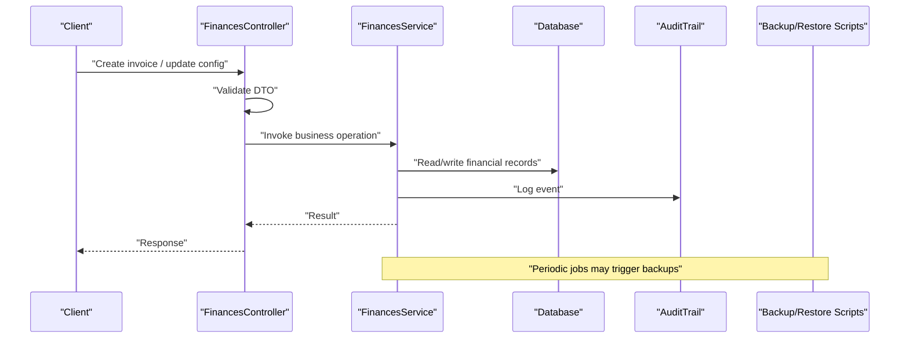

**Diagram sources**
- [finances.controller.ts](file://backend/src/modules/finances/controllers/finances.controller.ts)
- [finances.service.ts](file://backend/src/modules/finances/services/finances.service.ts)
- [finances.dto.ts](file://backend/src/modules/finances/dto/finances.dto.ts)
- [finances.entity.ts](file://backend/src/modules/finances/entities/finances.entity.ts)
- [audit-trail.md](file://backend/docs/audit-trail.md)
- [backup-auto.sh](file://docker/scripts/backup-auto.sh)
- [backup-manuel.sh](file://docker/scripts/backup-manuel.sh)
- [restore.sh](file://docker/scripts/restore.sh)

## Detailed Component Analysis

### Currency Settings and Multi-Currency Support
- Base currency and symbols are configured at the institution level, with formatting options for decimals and separators.
- Multi-currency support includes a currency catalog, exchange rates with effective dates, and conversion utilities used during invoicing and reporting.
- Internationalization leverages locale settings to format amounts and dates consistently.

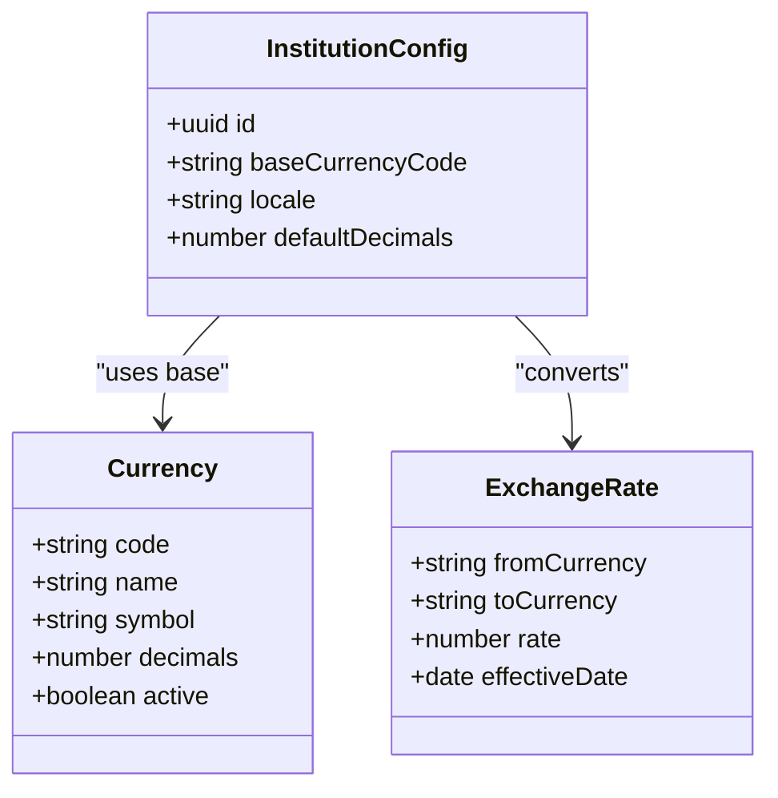

**Diagram sources**
- [010-module-finances.sql](file://backend/database/migrations/010-module-finances.sql)
- [012-module-finances-part3-parametres.sql](file://backend/database/migrations/012-module-finances-part3-parametres.sql)
- [finances.entity.ts](file://backend/src/modules/finances/entities/finances.entity.ts)

**Section sources**
- [010-module-finances.sql](file://backend/database/migrations/010-module-finances.sql)
- [012-module-finances-part3-parametres.sql](file://backend/database/migrations/012-module-finances-part3-parametres.sql)
- [finances.entity.ts](file://backend/src/modules/finances/entities/finances.entity.ts)

### Tax Configurations and Regional Regulations
- Tax types include standard, reduced, and exempt categories with applicable jurisdictions.
- Regional regulations are captured via parameters that enable/disable certain taxes and set reporting flags.
- Application rules determine whether taxes apply per line item or on totals.

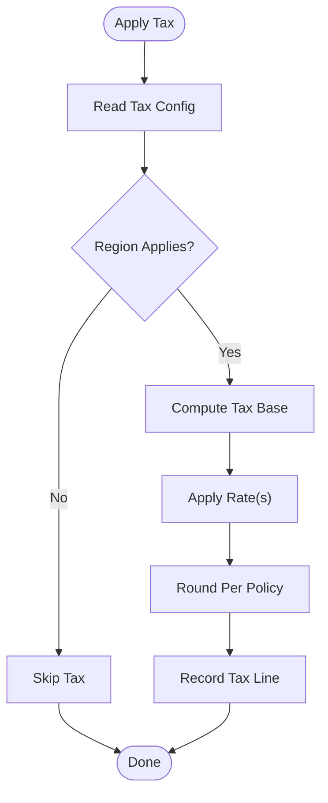

**Diagram sources**
- [011-module-finances-part2.sql](file://backend/database/migrations/011-module-finances-part2.sql)
- [012-module-finances-part3-parametres.sql](file://backend/database/migrations/012-module-finances-part3-parametres.sql)
- [finances.service.ts](file://backend/src/modules/finances/services/finances.service.ts)

**Section sources**
- [011-module-finances-part2.sql](file://backend/database/migrations/011-module-finances-part2.sql)
- [012-module-finances-part3-parametres.sql](file://backend/database/migrations/012-module-finances-part3-parametres.sql)
- [finances.service.ts](file://backend/src/modules/finances/services/finances.service.ts)

### Late Fee Calculation Rules and Interest Rates
- Late fees are triggered after a grace period; they can be flat or percentage-based, with caps and exemptions.
- Interest accrues on overdue balances using configured annualized or periodic rates and compounding frequency.
- Calculations are performed by the service layer and recorded in audit trails.

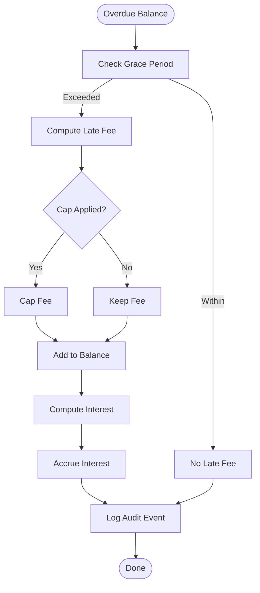

**Diagram sources**
- [013-module-finances-phase1-granularite.sql](file://backend/database/migrations/013-module-finances-phase1-granularite.sql)
- [finances.service.ts](file://backend/src/modules/finances/services/finances.service.ts)
- [audit-trail.md](file://backend/docs/audit-trail.md)

**Section sources**
- [013-module-finances-phase1-granularite.sql](file://backend/database/migrations/013-module-finances-phase1-granularite.sql)
- [finances.service.ts](file://backend/src/modules/finances/services/finances.service.ts)
- [audit-trail.md](file://backend/docs/audit-trail.md)

### Penalty Structures
- Penalties are defined for specific violations or non-compliance events, with conditions and maximum limits.
- They are applied independently of late fees and interest, and can be toggled per institution.

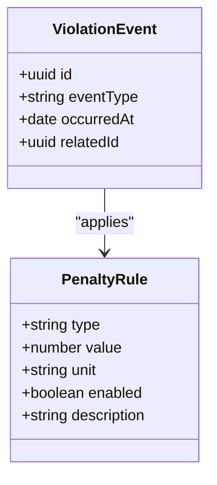

**Diagram sources**
- [014-module-finances-phase2-section.sql](file://backend/database/migrations/014-module-finances-phase2-section.sql)
- [finances.entity.ts](file://backend/src/modules/finances/entities/finances.entity.ts)

**Section sources**
- [014-module-finances-phase2-section.sql](file://backend/database/migrations/014-module-finances-phase2-section.sql)
- [finances.entity.ts](file://backend/src/modules/finances/entities/finances.entity.ts)

### Notification Templates for Payment Reminders
- Templates contain placeholders for dynamic fields such as due date, amount due, and reference numbers.
- The service layer renders templates and dispatches notifications through configured channels.

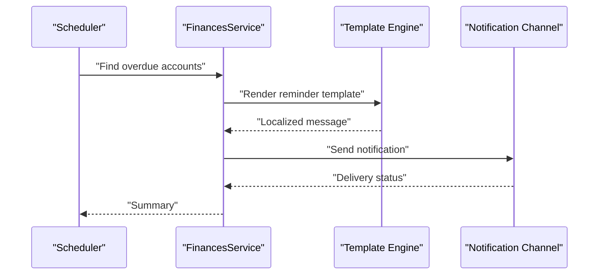

**Diagram sources**
- [finances.service.ts](file://backend/src/modules/finances/services/finances.service.ts)
- [IMPLEMENTATION-COMPLETE-FINANCES.md](file://docs/implementations/IMPLEMENTATION-COMPLETE-FINANCES.md)

**Section sources**
- [finances.service.ts](file://backend/src/modules/finances/services/finances.service.ts)
- [IMPLEMENTATION-COMPLETE-FINANCES.md](file://docs/implementations/IMPLEMENTATION-COMPLETE-FINANCES.md)

### Invoice Formats and Receipt Layouts
- Invoice and receipt formats are controlled by template definitions specifying layout sections, branding, and field visibility.
- Generated documents respect locale and currency settings.

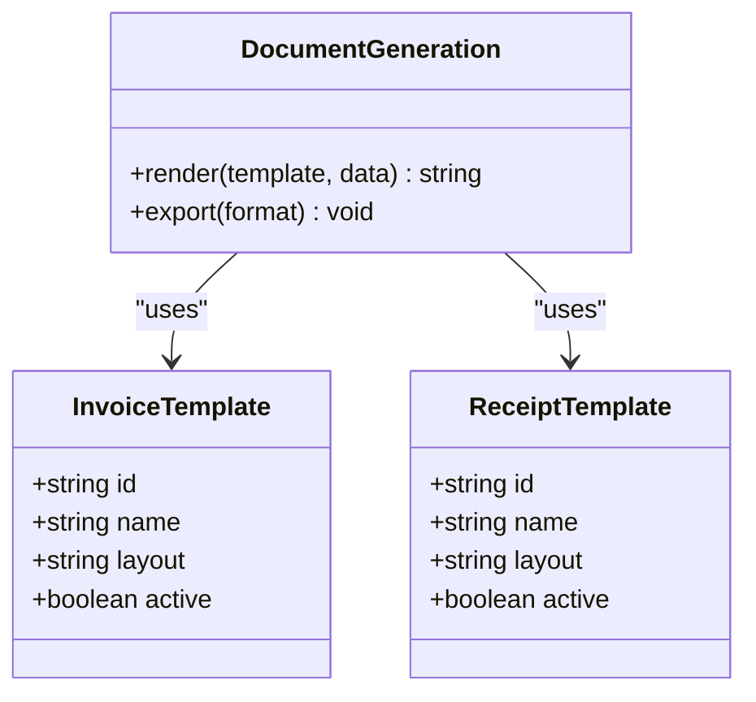

**Diagram sources**
- [012-module-finances-part3-parametres.sql](file://backend/database/migrations/012-module-finances-part3-parametres.sql)
- [finances.service.ts](file://backend/src/modules/finances/services/finances.service.ts)

**Section sources**
- [012-module-finances-part3-parametres.sql](file://backend/database/migrations/012-module-finances-part3-parametres.sql)
- [finances.service.ts](file://backend/src/modules/finances/services/finances.service.ts)

### Financial Reporting Parameters
- Reporting parameters define aggregation windows, grouping keys, and export formats for statements and summaries.
- Reports leverage configured currencies and locales for consistent presentation.

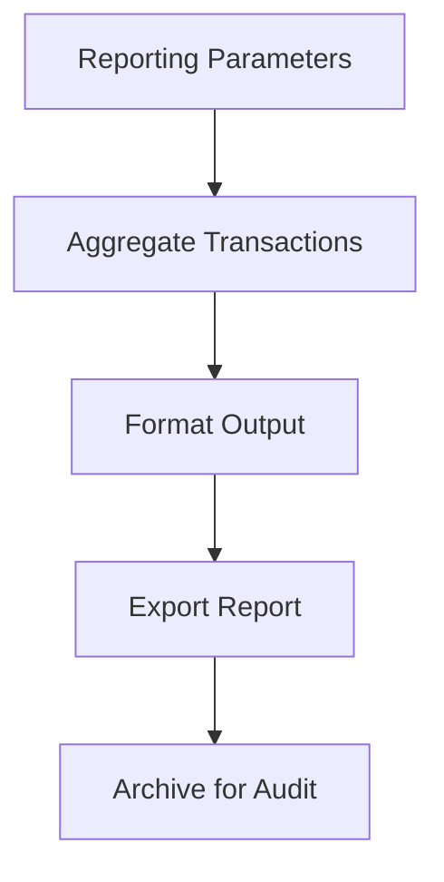

**Diagram sources**
- [010-module-finances.sql](file://backend/database/migrations/010-module-finances.sql)
- [finances.service.ts](file://backend/src/modules/finances/services/finances.service.ts)

**Section sources**
- [010-module-finances.sql](file://backend/database/migrations/010-module-finances.sql)
- [finances.service.ts](file://backend/src/modules/finances/services/finances.service.ts)

### Audit Trail Configurations and Compliance Settings
- Audit trails log all financial operations with timestamps, actors, and changes.
- Compliance settings include retention policies, data masking, and regulatory flags.

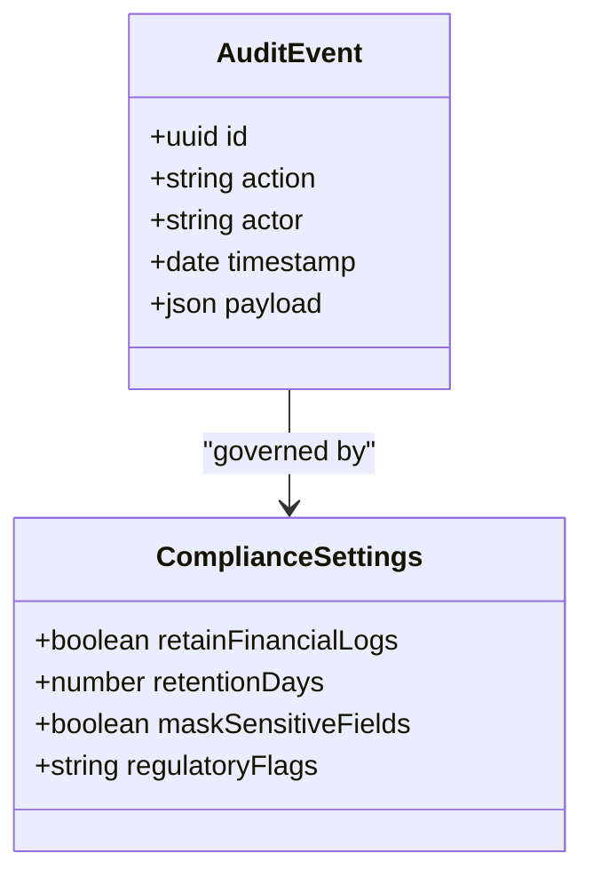

**Diagram sources**
- [audit-trail.md](file://backend/docs/audit-trail.md)
- [012-module-finances-part3-parametres.sql](file://backend/database/migrations/012-module-finances-part3-parametres.sql)

**Section sources**
- [audit-trail.md](file://backend/docs/audit-trail.md)
- [012-module-finances-part3-parametres.sql](file://backend/database/migrations/012-module-finances-part3-parametres.sql)

### Backup Configurations for Financial Data and Security Settings
- Automated and manual backup scripts ensure financial data integrity and recovery.
- Security settings protect sensitive financial information through access controls and encryption where applicable.

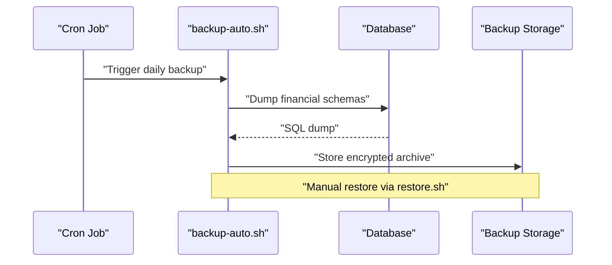

**Diagram sources**
- [backup-auto.sh](file://docker/scripts/backup-auto.sh)
- [backup-manuel.sh](file://docker/scripts/backup-manuel.sh)
- [restore.sh](file://docker/scripts/restore.sh)

**Section sources**
- [backup-auto.sh](file://docker/scripts/backup-auto.sh)
- [backup-manuel.sh](file://docker/scripts/backup-manuel.sh)
- [restore.sh](file://docker/scripts/restore.sh)

## Dependency Analysis
The financial module depends on database migrations for schema, service layer for business logic, controller for API exposure, DTOs for validation, and entities for persistence. Documentation and scripts provide operational context and safety nets.

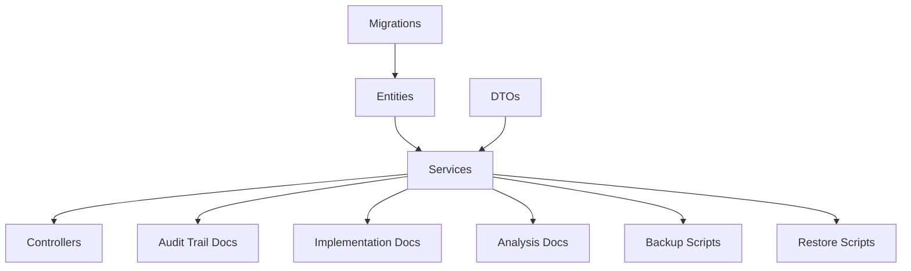

**Diagram sources**
- [010-module-finances.sql](file://backend/database/migrations/010-module-finances.sql)
- [011-module-finances-part2.sql](file://backend/database/migrations/011-module-finances-part2.sql)
- [012-module-finances-part3-parametres.sql](file://backend/database/migrations/012-module-finances-part3-parametres.sql)
- [013-module-finances-phase1-granularite.sql](file://backend/database/migrations/013-module-finances-phase1-granularite.sql)
- [014-module-finances-phase2-section.sql](file://backend/database/migrations/014-module-finances-phase2-section.sql)
- [finances.entity.ts](file://backend/src/modules/finances/entities/finances.entity.ts)
- [finances.service.ts](file://backend/src/modules/finances/services/finances.service.ts)
- [finances.dto.ts](file://backend/src/modules/finances/dto/finances.dto.ts)
- [finances.controller.ts](file://backend/src/modules/finances/controllers/finances.controller.ts)
- [audit-trail.md](file://backend/docs/audit-trail.md)
- [IMPLEMENTATION-COMPLETE-FINANCES.md](file://docs/implementations/IMPLEMENTATION-COMPLETE-FINANCES.md)
- [ANALYSE-GESTION-FINANCIERE.md](file://docs/analyses/ANALYSE-GESTION-FINANCIERE.md)
- [backup-auto.sh](file://docker/scripts/backup-auto.sh)
- [backup-manuel.sh](file://docker/scripts/backup-manuel.sh)
- [restore.sh](file://docker/scripts/restore.sh)

**Section sources**
- [010-module-finances.sql](file://backend/database/migrations/010-module-finances.sql)
- [011-module-finances-part2.sql](file://backend/database/migrations/011-module-finances-part2.sql)
- [012-module-finances-part3-parametres.sql](file://backend/database/migrations/012-module-finances-part3-parametres.sql)
- [013-module-finances-phase1-granularite.sql](file://backend/database/migrations/013-module-finances-phase1-granularite.sql)
- [014-module-finances-phase2-section.sql](file://backend/database/migrations/014-module-finances-phase2-section.sql)
- [finances.entity.ts](file://backend/src/modules/finances/entities/finances.entity.ts)
- [finances.service.ts](file://backend/src/modules/finances/services/finances.service.ts)
- [finances.dto.ts](file://backend/src/modules/finances/dto/finances.dto.ts)
- [finances.controller.ts](file://backend/src/modules/finances/controllers/finances.controller.ts)
- [audit-trail.md](file://backend/docs/audit-trail.md)
- [IMPLEMENTATION-COMPLETE-FINANCES.md](file://docs/implementations/IMPLEMENTATION-COMPLETE-FINANCES.md)
- [ANALYSE-GESTION-FINANCIERE.md](file://docs/analyses/ANALYSE-GESTION-FINANCIERE.md)
- [backup-auto.sh](file://docker/scripts/backup-auto.sh)
- [backup-manuel.sh](file://docker/scripts/backup-manuel.sh)
- [restore.sh](file://docker/scripts/restore.sh)

## Performance Considerations
- Indexing strategies in migrations improve query performance for financial transactions and reporting.
- Batch processing for late fee and interest calculations reduces overhead during high-volume periods.
- Caching exchange rates minimizes external calls and improves responsiveness.

[No sources needed since this section provides general guidance]

## Troubleshooting Guide
- Validate DTO inputs to prevent invalid financial operations.
- Review audit trail entries to trace discrepancies in calculations or configurations.
- Use backup and restore scripts to recover from data corruption or misconfigurations.
- Consult implementation and analysis docs for common pitfalls and best practices.

**Section sources**
- [finances.dto.ts](file://backend/src/modules/finances/dto/finances.dto.ts)
- [audit-trail.md](file://backend/docs/audit-trail.md)
- [backup-auto.sh](file://docker/scripts/backup-auto.sh)
- [backup-manuel.sh](file://docker/scripts/backup-manuel.sh)
- [restore.sh](file://docker/scripts/restore.sh)
- [IMPLEMENTATION-COMPLETE-FINANCES.md](file://docs/implementations/IMPLEMENTATION-COMPLETE-FINANCES.md)
- [ANALYSE-GESTION-FINANCIERE.md](file://docs/analyses/ANALYSE-GESTION-FINANCIERE.md)

## Conclusion
The eLISAschool financial parameters and configuration system provides a robust foundation for managing currencies, taxes, fees, penalties, notifications, documents, reporting, audits, compliance, multi-currency support, internationalization, backups, and security. The layered architecture ensures clear separation of concerns, while migrations, services, controllers, DTOs, and entities maintain consistency and extensibility. Operational scripts safeguard data integrity and facilitate recovery.

[No sources needed since this section summarizes without analyzing specific files]

## Appendices
- API Finances Reference: See API documentation for endpoints and payloads.
- Implementation Summary: Comprehensive overview of financial module capabilities.
- Analysis Report: In-depth examination of financial management design and decisions.

**Section sources**
- [API-FINANCES.md](file://docs/API-FINANCES.md)
- [IMPLEMENTATION-COMPLETE-FINANCES.md](file://docs/implementations/IMPLEMENTATION-COMPLETE-FINANCES.md)
- [ANALYSE-GESTION-FINANCIERE.md](file://docs/analyses/ANALYSE-GESTION-FINANCIERE.md)