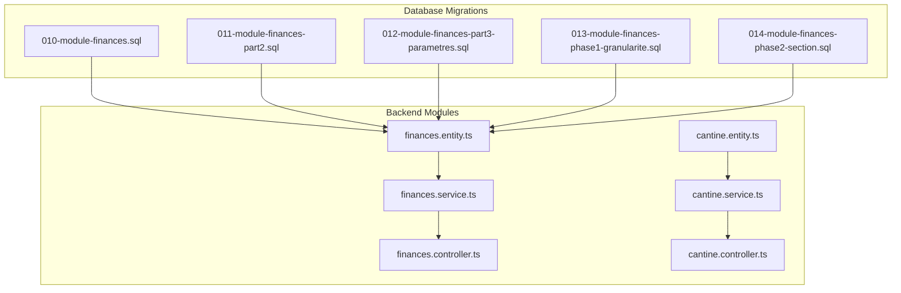
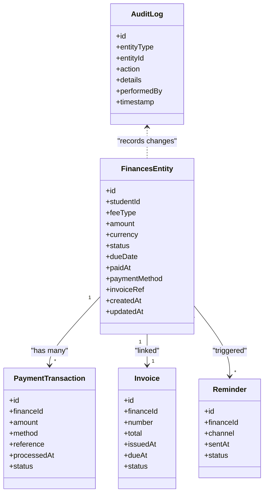
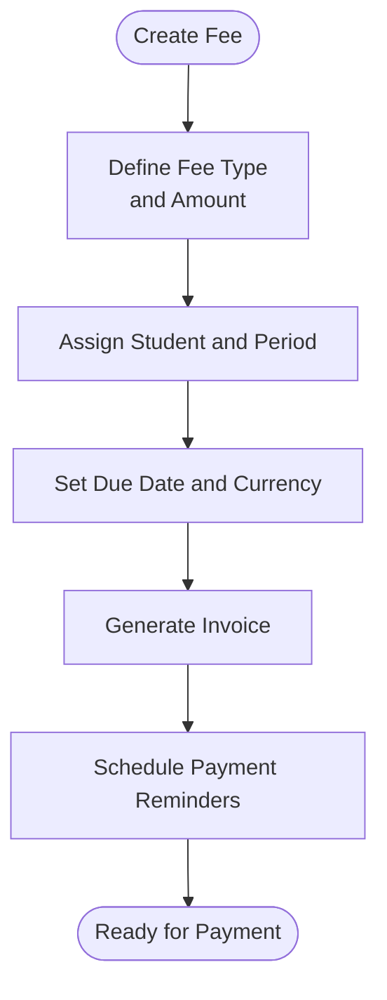
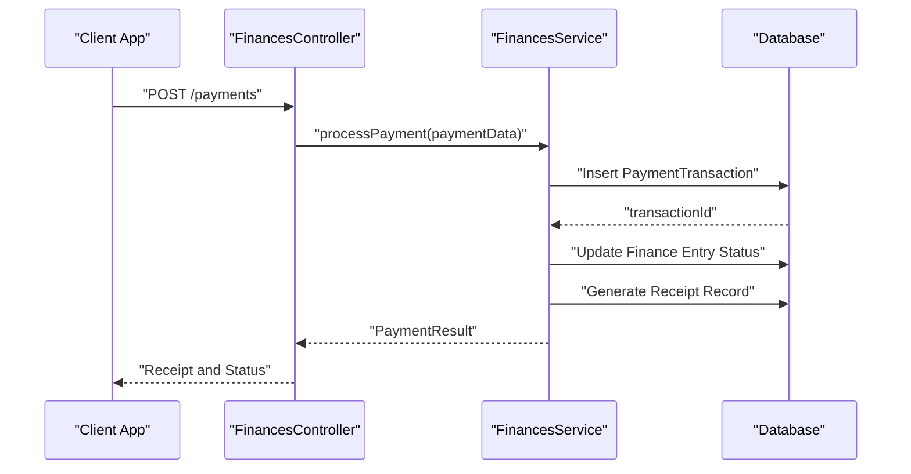
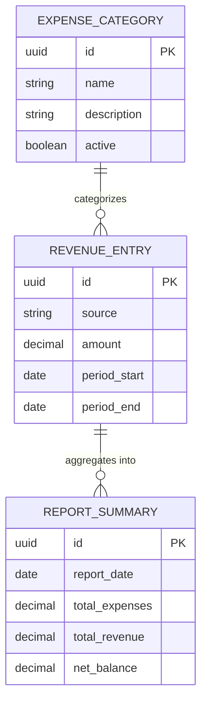
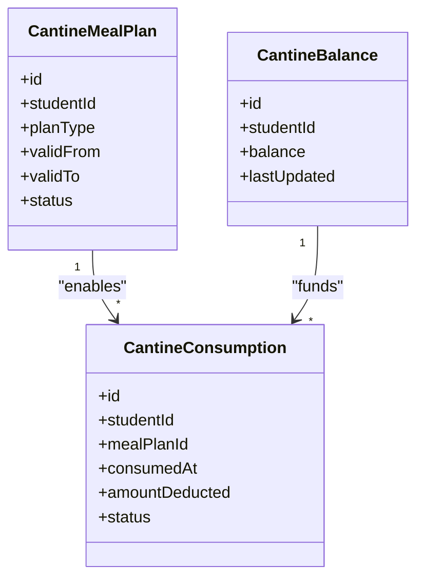
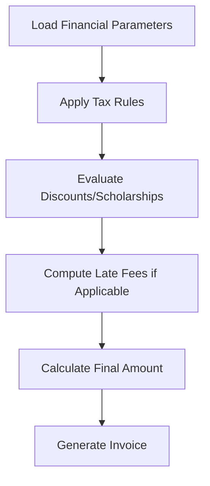
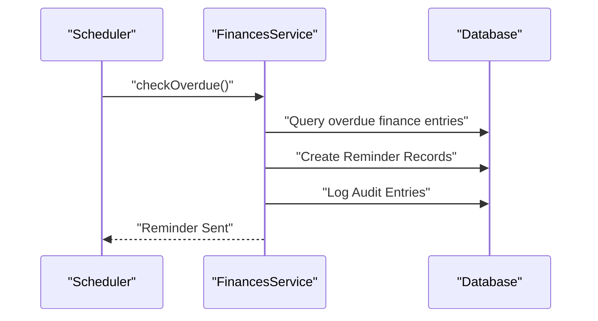
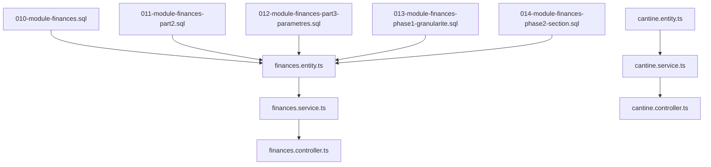

# Financial Schema

<cite>
**Referenced Files in This Document**
- [010-module-finances.sql](file://backend/database/migrations/010-module-finances.sql)
- [011-module-finances-part2.sql](file://backend/database/migrations/011-module-finances-part2.sql)
- [012-module-finances-part3-parametres.sql](file://backend/database/migrations/012-module-finances-part3-parametres.sql)
- [013-module-finances-phase1-granularite.sql](file://backend/database/migrations/013-module-finances-phase1-granularite.sql)
- [014-module-finances-phase2-section.sql](file://backend/database/migrations/014-module-finances-phase2-section.sql)
- [finances.service.ts](file://backend/src/modules/finances/services/finances.service.ts)
- [finances.controller.ts](file://backend/src/modules/finances/controllers/finances.controller.ts)
- [finances.entity.ts](file://backend/src/modules/finances/entities/finances.entity.ts)
- [cantine.service.ts](file://backend/src/modules/cantine/services/cantine.service.ts)
- [cantine.controller.ts](file://backend/src/modules/cantine/controllers/cantine.controller.ts)
- [cantine.entity.ts](file://backend/src/modules/cantine/entities/cantine.entity.ts)
- [IMPLEMENTATION-COMPLETE-FINANCES.md](file://docs/implementations/IMPLEMENTATION-COMPLETE-FINANCES.md)
- [ANALYSE-GESTION-FINANCIERE.md](file://docs/analyses/ANALYSE-GESTION-FINANCIERE.md)
</cite>

## Table of Contents
1. [Introduction](#introduction)
2. [Project Structure](#project-structure)
3. [Core Components](#core-components)
4. [Architecture Overview](#architecture-overview)
5. [Detailed Component Analysis](#detailed-component-analysis)
6. [Dependency Analysis](#dependency-analysis)
7. [Performance Considerations](#performance-considerations)
8. [Troubleshooting Guide](#troubleshooting-guide)
9. [Conclusion](#conclusion)
10. [Appendices](#appendices)

## Introduction
This document provides comprehensive data model documentation for eLISAschool’s financial management schema. It covers fee structure management (tuition fees, additional charges, payment plans), payment processing (transactions, receipts, payment methods), budgeting (expense categories, revenue tracking, reporting structures), cantine (cafeteria) management (meal plans, balance tracking, consumption records), and financial parameters (tax configurations, currency settings). It also addresses late fee policies, discount systems, scholarship management, invoice generation, payment reminders, and audit trails. The goal is to present the complete financial workflow from fee setup through payment completion and reporting, with entity relationships and code-level diagrams where applicable.

## Project Structure
The financial module is implemented across database migrations and backend modules:
- Database schema definitions are defined in a series of migrations under backend/database/migrations.
- Backend implementation resides under backend/src/modules/finances and backend/src/modules/cantine.
- Documentation and analysis reside under docs/implementations and docs/analyses.

**Diagram sources**
- [010-module-finances.sql](file://backend/database/migrations/010-module-finances.sql)
- [011-module-finances-part2.sql](file://backend/database/migrations/011-module-finances-part2.sql)
- [012-module-finances-part3-parametres.sql](file://backend/database/migrations/012-module-finances-part3-parametres.sql)
- [013-module-finances-phase1-granularite.sql](file://backend/database/migrations/013-module-finances-phase1-granularite.sql)
- [014-module-finances-phase2-section.sql](file://backend/database/migrations/014-module-finances-phase2-section.sql)
- [finances.entity.ts](file://backend/src/modules/finances/entities/finances.entity.ts)
- [finances.service.ts](file://backend/src/modules/finances/services/finances.service.ts)
- [finances.controller.ts](file://backend/src/modules/finances/controllers/finances.controller.ts)
- [cantine.entity.ts](file://backend/src/modules/cantine/entities/cantine.entity.ts)
- [cantine.service.ts](file://backend/src/modules/cantine/services/cantine.service.ts)
- [cantine.controller.ts](file://backend/src/modules/cantine/controllers/cantine.controller.ts)

**Section sources**
- [010-module-finances.sql](file://backend/database/migrations/010-module-finances.sql)
- [011-module-finances-part2.sql](file://backend/database/migrations/011-module-finances-part2.sql)
- [012-module-finances-part3-parametres.sql](file://backend/database/migrations/012-module-finances-part3-parametres.sql)
- [013-module-finances-phase1-granularite.sql](file://backend/database/migrations/013-module-finances-phase1-granularite.sql)
- [014-module-finances-phase2-section.sql](file://backend/database/migrations/014-module-finances-phase2-section.sql)
- [finances.entity.ts](file://backend/src/modules/finances/entities/finances.entity.ts)
- [finances.service.ts](file://backend/src/modules/finances/services/finances.service.ts)
- [finances.controller.ts](file://backend/src/modules/finances/controllers/finances.controller.ts)
- [cantine.entity.ts](file://backend/src/modules/cantine/entities/cantine.entity.ts)
- [cantine.service.ts](file://backend/src/modules/cantine/services/cantine.service.ts)
- [cantine.controller.ts](file://backend/src/modules/cantine/controllers/cantine.controller.ts)

## Core Components
This section summarizes the primary entities and responsibilities within the financial schema:
- Fee Structures: tuition fees, additional charges, and payment plans.
- Payments: transaction tracking, receipt generation, and payment method handling.
- Budget Management: expense categories, revenue tracking, and reporting structures.
- Cantine Management: meal plans, balance tracking, and consumption records.
- Financial Parameters: tax configurations, currency settings, late fee policies, discounts, scholarships, invoices, reminders, and audit trails.

Key implementation anchors:
- Entity definitions and core relationships are primarily defined in the finances entity file and migrations.
- Service layer encapsulates business logic for payments, invoicing, reminders, and reporting.
- Controller exposes API endpoints for frontend integration.
- Cantine module defines cafeteria-specific entities and services.

**Section sources**
- [finances.entity.ts](file://backend/src/modules/finances/entities/finances.entity.ts)
- [finances.service.ts](file://backend/src/modules/finances/services/finances.service.ts)
- [finances.controller.ts](file://backend/src/modules/finances/controllers/finances.controller.ts)
- [cantine.entity.ts](file://backend/src/modules/cantine/entities/cantine.entity.ts)
- [cantine.service.ts](file://backend/src/modules/cantine/services/cantine.service.ts)
- [cantine.controller.ts](file://backend/src/modules/cantine/controllers/cantine.controller.ts)

## Architecture Overview
The financial architecture integrates database schema, service layer, and controller layer to support end-to-end financial workflows:
- Data persistence via relational tables created by migrations.
- Business logic in services for transactions, invoicing, reminders, and reporting.
- API exposure via controllers for client applications.

**Diagram sources**
- [finances.entity.ts](file://backend/src/modules/finances/entities/finances.entity.ts)
- [finances.service.ts](file://backend/src/modules/finances/services/finances.service.ts)
- [finances.controller.ts](file://backend/src/modules/finances/controllers/finances.controller.ts)

## Detailed Component Analysis

### Fee Structure Management
Fee structures include tuition fees, additional charges, and payment plans. These are modeled as financial entries linked to students and periods, with attributes for amounts, currencies, due dates, and statuses.

**Diagram sources**
- [010-module-finances.sql](file://backend/database/migrations/010-module-finances.sql)
- [011-module-finances-part2.sql](file://backend/database/migrations/011-module-finances-part2.sql)
- [013-module-finances-phase1-granularite.sql](file://backend/database/migrations/013-module-finances-phase1-granularite.sql)
- [014-module-finances-phase2-section.sql](file://backend/database/migrations/014-module-finances-phase2-section.sql)
- [finances.entity.ts](file://backend/src/modules/finances/entities/finances.entity.ts)

**Section sources**
- [010-module-finances.sql](file://backend/database/migrations/010-module-finances.sql)
- [011-module-finances-part2.sql](file://backend/database/migrations/011-module-finances-part2.sql)
- [013-module-finances-phase1-granularite.sql](file://backend/database/migrations/013-module-finances-phase1-granularite.sql)
- [014-module-finances-phase2-section.sql](file://backend/database/migrations/014-module-finances-phase2-section.sql)
- [finances.entity.ts](file://backend/src/modules/finances/entities/finances.entity.ts)

### Payment Processing Entities
Payment processing tracks transactions, generates receipts, and handles multiple payment methods. Transactions are linked to finance entries and include references, processed timestamps, and status.

**Diagram sources**
- [finances.controller.ts](file://backend/src/modules/finances/controllers/finances.controller.ts)
- [finances.service.ts](file://backend/src/modules/finances/services/finances.service.ts)
- [finances.entity.ts](file://backend/src/modules/finances/entities/finances.entity.ts)

**Section sources**
- [finances.controller.ts](file://backend/src/modules/finances/controllers/finances.controller.ts)
- [finances.service.ts](file://backend/src/modules/finances/services/finances.service.ts)
- [finances.entity.ts](file://backend/src/modules/finances/entities/finances.entity.ts)

### Budget Management
Budget management includes expense categories, revenue tracking, and reporting structures. While specific table names vary by migration, the conceptual model supports categorization and aggregation for financial reports.

[No diagram sources since this diagram shows conceptual structure without direct mapping to specific files]

**Section sources**
- [012-module-finances-part3-parametres.sql](file://backend/database/migrations/012-module-finances-part3-parametres.sql)
- [ANALYSE-GESTION-FINANCIERE.md](file://docs/analyses/ANALYSE-GESTION-FINANCIERE.md)

### Cantine (Cafeteria) Management
Cantine management encompasses meal plans, balance tracking, and consumption records. Entities link students to meal plans and track balances and consumption events.

**Diagram sources**
- [cantine.entity.ts](file://backend/src/modules/cantine/entities/cantine.entity.ts)
- [cantine.service.ts](file://backend/src/modules/cantine/services/cantine.service.ts)
- [cantine.controller.ts](file://backend/src/modules/cantine/controllers/cantine.controller.ts)

**Section sources**
- [cantine.entity.ts](file://backend/src/modules/cantine/entities/cantine.entity.ts)
- [cantine.service.ts](file://backend/src/modules/cantine/services/cantine.service.ts)
- [cantine.controller.ts](file://backend/src/modules/cantine/controllers/cantine.controller.ts)

### Financial Parameters, Taxes, Currency Settings
Financial parameters include tax configurations, currency settings, late fee policies, discount systems, and scholarship management. These are typically stored in configuration or parameter tables and referenced during fee calculation and payment processing.

**Diagram sources**
- [012-module-finances-part3-parametres.sql](file://backend/database/migrations/012-module-finances-part3-parametres.sql)
- [finances.service.ts](file://backend/src/modules/finances/services/finances.service.ts)

**Section sources**
- [012-module-finances-part3-parametres.sql](file://backend/database/migrations/012-module-finances-part3-parametres.sql)
- [finances.service.ts](file://backend/src/modules/finances/services/finances.service.ts)

### Invoicing, Payment Reminders, and Audit Trails
Invoices are generated per finance entry, reminders are scheduled based on due dates, and audit logs record all critical actions for compliance and traceability.

**Diagram sources**
- [finances.service.ts](file://backend/src/modules/finances/services/finances.service.ts)
- [finances.controller.ts](file://backend/src/modules/finances/controllers/finances.controller.ts)

**Section sources**
- [finances.service.ts](file://backend/src/modules/finances/services/finances.service.ts)
- [finances.controller.ts](file://backend/src/modules/finances/controllers/finances.controller.ts)

## Dependency Analysis
The financial module depends on database migrations for schema definition and uses service/controller layers for business logic and API exposure. The cantine module is independent but may reference student identifiers consistent with the broader system.

**Diagram sources**
- [010-module-finances.sql](file://backend/database/migrations/010-module-finances.sql)
- [011-module-finances-part2.sql](file://backend/database/migrations/011-module-finances-part2.sql)
- [012-module-finances-part3-parametres.sql](file://backend/database/migrations/012-module-finances-part3-parametres.sql)
- [013-module-finances-phase1-granularite.sql](file://backend/database/migrations/013-module-finances-phase1-granularite.sql)
- [014-module-finances-phase2-section.sql](file://backend/database/migrations/014-module-finances-phase2-section.sql)
- [finances.entity.ts](file://backend/src/modules/finances/entities/finances.entity.ts)
- [finances.service.ts](file://backend/src/modules/finances/services/finances.service.ts)
- [finances.controller.ts](file://backend/src/modules/finances/controllers/finances.controller.ts)
- [cantine.entity.ts](file://backend/src/modules/cantine/entities/cantine.entity.ts)
- [cantine.service.ts](file://backend/src/modules/cantine/services/cantine.service.ts)
- [cantine.controller.ts](file://backend/src/modules/cantine/controllers/cantine.controller.ts)

**Section sources**
- [010-module-finances.sql](file://backend/database/migrations/010-module-finances.sql)
- [011-module-finances-part2.sql](file://backend/database/migrations/011-module-finances-part2.sql)
- [012-module-finances-part3-parametres.sql](file://backend/database/migrations/012-module-finances-part3-parametres.sql)
- [013-module-finances-phase1-granularite.sql](file://backend/database/migrations/013-module-finances-phase1-granularite.sql)
- [014-module-finances-phase2-section.sql](file://backend/database/migrations/014-module-finances-phase2-section.sql)
- [finances.entity.ts](file://backend/src/modules/finances/entities/finances.entity.ts)
- [finances.service.ts](file://backend/src/modules/finances/services/finances.service.ts)
- [finances.controller.ts](file://backend/src/modules/finances/controllers/finances.controller.ts)
- [cantine.entity.ts](file://backend/src/modules/cantine/entities/cantine.entity.ts)
- [cantine.service.ts](file://backend/src/modules/cantine/services/cantine.service.ts)
- [cantine.controller.ts](file://backend/src/modules/cantine/controllers/cantine.controller.ts)

## Performance Considerations
- Indexing: Ensure indexes on frequently queried columns such as studentId, dueDate, and status to optimize lookups and reporting queries.
- Batch Operations: Use batch inserts/updates for bulk fee creation and payment processing to reduce round trips.
- Caching: Cache financial parameters and tax rules to avoid repeated reads during calculations.
- Pagination: Implement pagination for large lists of transactions and invoices to improve UI responsiveness.
- Concurrency: Apply optimistic locking or version fields to prevent race conditions during concurrent payment updates.

[No sources needed since this section provides general guidance]

## Troubleshooting Guide
Common issues and resolutions:
- Missing foreign keys: Verify that student and period references exist before creating finance entries.
- Duplicate transactions: Enforce unique constraints on payment references and implement idempotency checks.
- Incorrect totals: Validate tax and discount calculations against configured parameters; log discrepancies for audit.
- Reminder failures: Check scheduler logs and ensure reminder channels are properly configured.
- Audit gaps: Confirm that audit logging is enabled for all write operations and that performedBy fields are populated.

**Section sources**
- [finances.service.ts](file://backend/src/modules/finances/services/finances.service.ts)
- [finances.controller.ts](file://backend/src/modules/finances/controllers/finances.controller.ts)

## Conclusion
The eLISAschool financial schema provides a robust foundation for managing fees, payments, budgets, and cafeteria services. With clear entity relationships, well-defined service logic, and comprehensive audit capabilities, it supports accurate financial operations and reporting. Continuous attention to performance, concurrency, and error handling will ensure reliability at scale.

[No sources needed since this section summarizes without analyzing specific files]

## Appendices
- Implementation summary and detailed feature coverage can be found in the implementation documents.
- Analytical insights and recommendations are available in the analysis documents.

**Section sources**
- [IMPLEMENTATION-COMPLETE-FINANCES.md](file://docs/implementations/IMPLEMENTATION-COMPLETE-FINANCES.md)
- [ANALYSE-GESTION-FINANCIERE.md](file://docs/analyses/ANALYSE-GESTION-FINANCIERE.md)