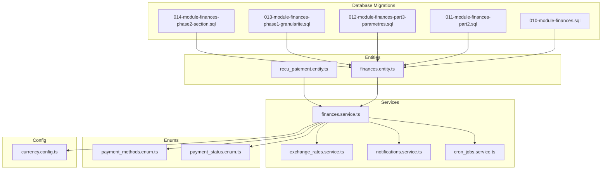
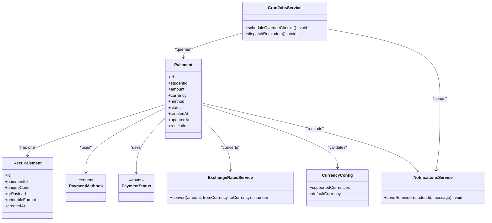
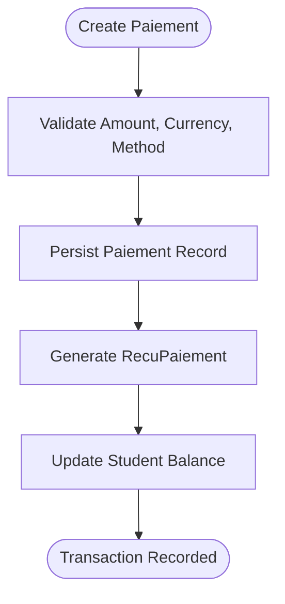
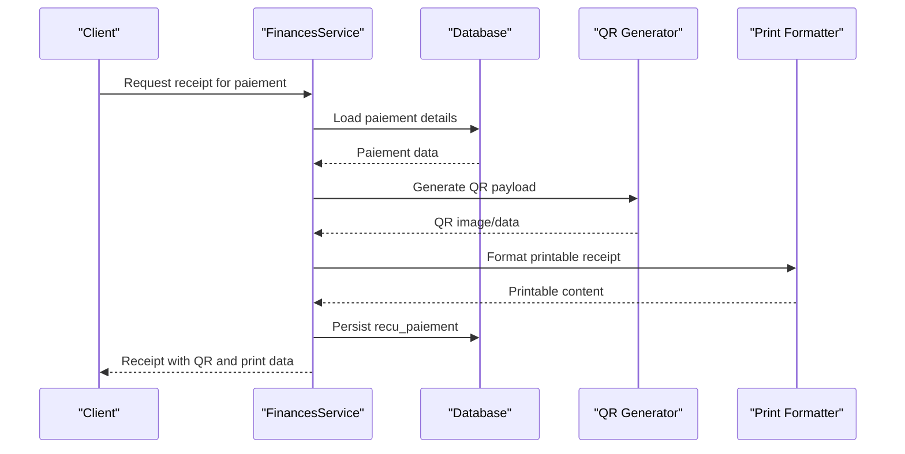
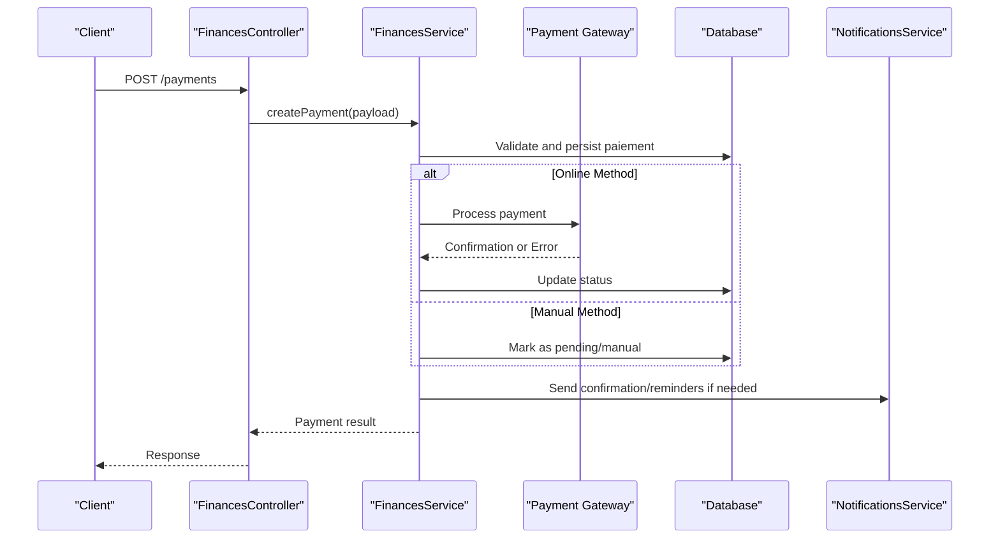
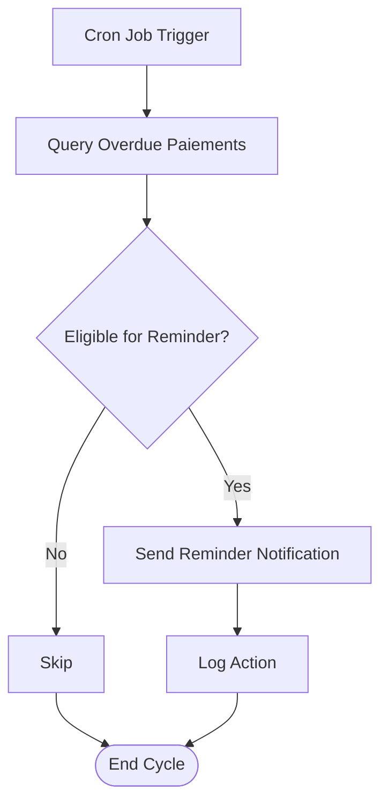
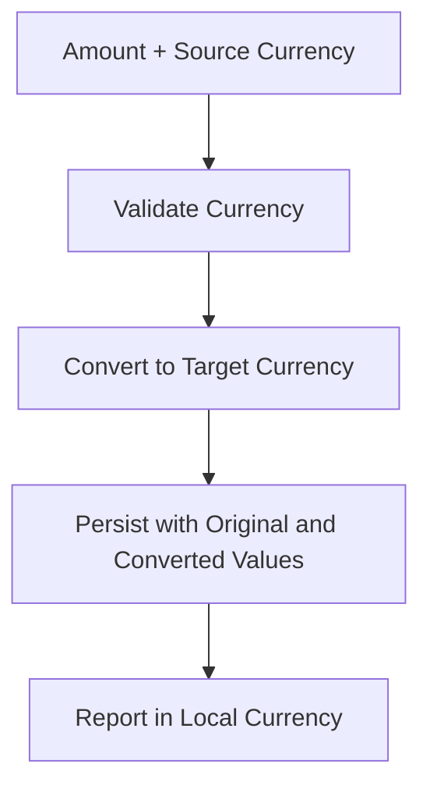
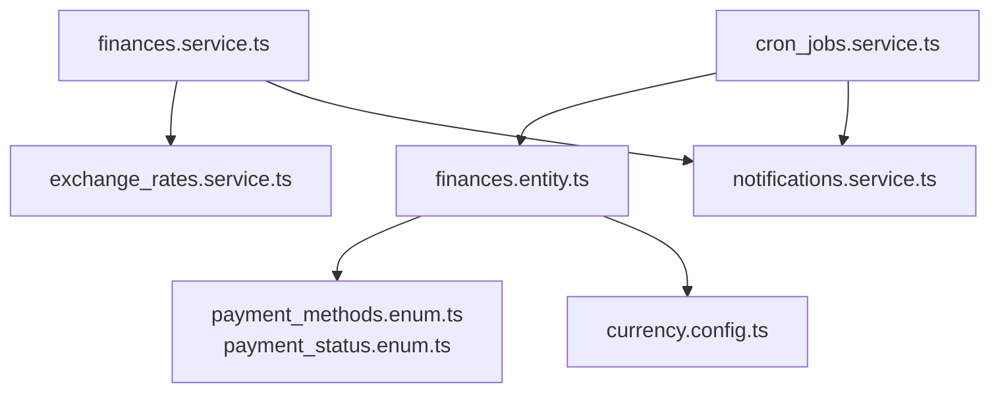

# Payment Processing

<cite>
**Referenced Files in This Document**
- [010-module-finances.sql](file://backend/database/migrations/010-module-finances.sql)
- [011-module-finances-part2.sql](file://backend/database/migrations/011-module-finances-part2.sql)
- [012-module-finances-part3-parametres.sql](file://backend/database/migrations/012-module-finances-part3-parametres.sql)
- [013-module-finances-phase1-granularite.sql](file://backend/database/migrations/013-module-finances-phase1-granularite.sql)
- [014-module-finances-phase2-section.sql](file://backend/database/migrations/014-module-finances-phase2-section.sql)
- [finances.controller.ts](file://backend/src/modules/finances/controllers/finances.controller.ts)
- [finances.service.ts](file://backend/src/modules/finances/services/finances.service.ts)
- [finances.entity.ts](file://backend/src/modules/finances/entities/finances.entity.ts)
- [recu_paiement.entity.ts](file://backend/src/modules/finances/entities/recu_paiement.entity.ts)
- [payment_methods.enum.ts](file://shared/src/enums/payment_methods.enum.ts)
- [payment_status.enum.ts](file://shared/src/enums/payment_status.enum.ts)
- [currency.config.ts](file://backend/src/config/currency.config.ts)
- [exchange_rates.service.ts](file://backend/src/modules/finances/services/exchange_rates.service.ts)
- [notifications.service.ts](file://backend/src/modules/notifications/services/notifications.service.ts)
- [cron_jobs.service.ts](file://backend/src/modules/monitoring/services/cron_jobs.service.ts)
</cite>

## Table of Contents
1. [Introduction](#introduction)
2. [Project Structure](#project-structure)
3. [Core Components](#core-components)
4. [Architecture Overview](#architecture-overview)
5. [Detailed Component Analysis](#detailed-component-analysis)
6. [Dependency Analysis](#dependency-analysis)
7. [Performance Considerations](#performance-considerations)
8. [Troubleshooting Guide](#troubleshooting-guide)
9. [Conclusion](#conclusion)
10. [Appendices](#appendices)

## Introduction
This document provides comprehensive data model documentation for eLISAschool’s payment processing system. It focuses on the paiement entity with transaction tracking, payment methods, and status management; receipt generation (recu_paiement) including unique identifiers, QR codes, and printable formats; end-to-end payment workflows (initiation to completion), partial payments, refunds, and cancellations; integration with external payment gateways and manual payment processing; reminders, overdue tracking, and automated follow-ups; and multi-currency support with exchange rates and international considerations.

The content is derived from database migrations, entities, services, enums, and configuration files within the repository.

## Project Structure
The payment system spans multiple layers:
- Database schema defined by finance-related migrations
- Entities representing core financial objects
- Services implementing business logic and integrations
- Enums defining shared types such as payment methods and statuses
- Configuration for currencies and exchange rates
- Notifications and monitoring for reminders and automation



**Diagram sources**
- [010-module-finances.sql](file://backend/database/migrations/010-module-finances.sql)
- [011-module-finances-part2.sql](file://backend/database/migrations/011-module-finances-part2.sql)
- [012-module-finances-part3-parametres.sql](file://backend/database/migrations/012-module-finances-part3-parametres.sql)
- [013-module-finances-phase1-granularite.sql](file://backend/database/migrations/013-module-finances-phase1-granularite.sql)
- [014-module-finances-phase2-section.sql](file://backend/database/migrations/014-module-finances-phase2-section.sql)
- [finances.entity.ts](file://backend/src/modules/finances/entities/finances.entity.ts)
- [recu_paiement.entity.ts](file://backend/src/modules/finances/entities/recu_paiement.entity.ts)
- [finances.service.ts](file://backend/src/modules/finances/services/finances.service.ts)
- [exchange_rates.service.ts](file://backend/src/modules/finances/services/exchange_rates.service.ts)
- [notifications.service.ts](file://backend/src/modules/notifications/services/notifications.service.ts)
- [cron_jobs.service.ts](file://backend/src/modules/monitoring/services/cron_jobs.service.ts)
- [payment_methods.enum.ts](file://shared/src/enums/payment_methods.enum.ts)
- [payment_status.enum.ts](file://shared/src/enums/payment_status.enum.ts)
- [currency.config.ts](file://backend/src/config/currency.config.ts)

**Section sources**
- [010-module-finances.sql](file://backend/database/migrations/010-module-finances.sql)
- [011-module-finances-part2.sql](file://backend/database/migrations/011-module-finances-part2.sql)
- [012-module-finances-part3-parametres.sql](file://backend/database/migrations/012-module-finances-part3-parametres.sql)
- [013-module-finances-phase1-granularite.sql](file://backend/database/migrations/013-module-finances-phase1-granularite.sql)
- [014-module-finances-phase2-section.sql](file://backend/database/migrations/014-module-finances-phase2-section.sql)
- [finances.entity.ts](file://backend/src/modules/finances/entities/finances.entity.ts)
- [recu_paiement.entity.ts](file://backend/src/modules/finances/entities/recu_paiement.entity.ts)
- [finances.service.ts](file://backend/src/modules/finances/services/finances.service.ts)
- [exchange_rates.service.ts](file://backend/src/modules/finances/services/exchange_rates.service.ts)
- [notifications.service.ts](file://backend/src/modules/notifications/services/notifications.service.ts)
- [cron_jobs.service.ts](file://backend/src/modules/monitoring/services/cron_jobs.service.ts)
- [payment_methods.enum.ts](file://shared/src/enums/payment_methods.enum.ts)
- [payment_status.enum.ts](file://shared/src/enums/payment_status.enum.ts)
- [currency.config.ts](file://backend/src/config/currency.config.ts)

## Core Components
- Paiement Entity
  - Represents a single payment transaction linked to a student or account.
  - Tracks amount, currency, method, status, timestamps, and references to receipts and invoices.
  - Supports partial payments and cumulative totals via related records.
- Receipt Entity (recu_paiement)
  - Generates unique receipt identifiers and supports QR code payloads for verification.
  - Stores printable metadata and links back to the corresponding paiement record.
- Payment Methods Enum
  - Defines supported payment channels (e.g., cash, bank transfer, online gateway).
- Payment Status Enum
  - Captures lifecycle states such as pending, confirmed, refunded, cancelled.
- Exchange Rates Service
  - Provides conversion between currencies using configured rates.
- Currency Configuration
  - Centralizes supported currencies and default settings.
- Notifications Service
  - Sends reminders for upcoming or overdue payments.
- Cron Jobs Service
  - Orchestrates scheduled tasks like overdue checks and reminder dispatch.

**Section sources**
- [finances.entity.ts](file://backend/src/modules/finances/entities/finances.entity.ts)
- [recu_paiement.entity.ts](file://backend/src/modules/finances/entities/recu_paiement.entity.ts)
- [payment_methods.enum.ts](file://shared/src/enums/payment_methods.enum.ts)
- [payment_status.enum.ts](file://shared/src/enums/payment_status.enum.ts)
- [exchange_rates.service.ts](file://backend/src/modules/finances/services/exchange_rates.service.ts)
- [currency.config.ts](file://backend/src/config/currency.config.ts)
- [notifications.service.ts](file://backend/src/modules/notifications/services/notifications.service.ts)
- [cron_jobs.service.ts](file://backend/src/modules/monitoring/services/cron_jobs.service.ts)

## Architecture Overview
The payment architecture integrates database-backed entities with service-layer orchestration, enums for consistent typing, and external integrations for gateways and notifications.



**Diagram sources**
- [finances.entity.ts](file://backend/src/modules/finances/entities/finances.entity.ts)
- [recu_paiement.entity.ts](file://backend/src/modules/finances/entities/recu_paiement.entity.ts)
- [payment_methods.enum.ts](file://shared/src/enums/payment_methods.enum.ts)
- [payment_status.enum.ts](file://shared/src/enums/payment_status.enum.ts)
- [exchange_rates.service.ts](file://backend/src/modules/finances/services/exchange_rates.service.ts)
- [currency.config.ts](file://backend/src/config/currency.config.ts)
- [notifications.service.ts](file://backend/src/modules/notifications/services/notifications.service.ts)
- [cron_jobs.service.ts](file://backend/src/modules/monitoring/services/cron_jobs.service.ts)

## Detailed Component Analysis

### Paiement Entity and Transaction Tracking
- Purpose: Model each payment transaction with fields for amount, currency, method, status, and timestamps.
- Relationships:
  - One-to-one with recu_paiement for receipt linkage.
  - References to student/account context for billing aggregation.
- Partial Payments:
  - Multiple paiements can be associated with a single invoice or fee schedule.
  - Cumulative totals are computed by summing amounts across related records.
- Status Management:
  - Transitions governed by PaymentStatus enum values.
  - Enforced by service-layer validation before persistence.



**Diagram sources**
- [finances.entity.ts](file://backend/src/modules/finances/entities/finances.entity.ts)
- [recu_paiement.entity.ts](file://backend/src/modules/finances/entities/recu_paiement.entity.ts)
- [finances.service.ts](file://backend/src/modules/finances/services/finances.service.ts)

**Section sources**
- [finances.entity.ts](file://backend/src/modules/finances/entities/finances.entity.ts)
- [finances.service.ts](file://backend/src/modules/finances/services/finances.service.ts)

### Receipt Generation (recu_paiement)
- Unique Identifiers:
  - Each receipt has a distinct ID and an additional unique code for human-readable references.
- QR Codes:
  - Payload includes verifiable information (e.g., paiement id, amount, date) encoded into QR format.
- Printable Formats:
  - Metadata indicates printable layout options and rendering parameters.
- Linkage:
  - Foreign key ties receipt to its originating paiement for auditability.



**Diagram sources**
- [recu_paiement.entity.ts](file://backend/src/modules/finances/entities/recu_paiement.entity.ts)
- [finances.service.ts](file://backend/src/modules/finances/services/finances.service.ts)

**Section sources**
- [recu_paiement.entity.ts](file://backend/src/modules/finances/entities/recu_paiement.entity.ts)
- [finances.service.ts](file://backend/src/modules/finances/services/finances.service.ts)

### Payment Workflows: Initiation to Completion
- Initiation:
  - Client creates a paiement request with amount, currency, and method.
  - Service validates against currency config and payment methods enum.
- External Gateway Integration:
  - For online methods, service calls gateway APIs and updates status based on responses.
- Manual Processing:
  - Cash or bank transfers require manual confirmation by staff.
- Partial Payments:
  - Multiple paiements accumulate toward a target balance; service tracks remaining due.
- Refunds:
  - Refund transactions create negative amounts and update status accordingly.
- Cancellations:
  - Cancelled payments revert balances and mark status as cancelled.



**Diagram sources**
- [finances.controller.ts](file://backend/src/modules/finances/controllers/finances.controller.ts)
- [finances.service.ts](file://backend/src/modules/finances/services/finances.service.ts)
- [payment_methods.enum.ts](file://shared/src/enums/payment_methods.enum.ts)
- [payment_status.enum.ts](file://shared/src/enums/payment_status.enum.ts)
- [notifications.service.ts](file://backend/src/modules/notifications/services/notifications.service.ts)

**Section sources**
- [finances.controller.ts](file://backend/src/modules/finances/controllers/finances.controller.ts)
- [finances.service.ts](file://backend/src/modules/finances/services/finances.service.ts)
- [payment_methods.enum.ts](file://shared/src/enums/payment_methods.enum.ts)
- [payment_status.enum.ts](file://shared/src/enums/payment_status.enum.ts)
- [notifications.service.ts](file://backend/src/modules/notifications/services/notifications.service.ts)

### Overdue Tracking and Automated Follow-up
- Overdue Detection:
  - Cron jobs query unpaid or past-due paiements based on deadlines and status.
- Reminders:
  - Notifications service sends reminders via configured channels.
- Escalation:
  - Repeated non-payment triggers higher-priority alerts and potential administrative actions.



**Diagram sources**
- [cron_jobs.service.ts](file://backend/src/modules/monitoring/services/cron_jobs.service.ts)
- [notifications.service.ts](file://backend/src/modules/notifications/services/notifications.service.ts)
- [finances.entity.ts](file://backend/src/modules/finances/entities/finances.entity.ts)

**Section sources**
- [cron_jobs.service.ts](file://backend/src/modules/monitoring/services/cron_jobs.service.ts)
- [notifications.service.ts](file://backend/src/modules/notifications/services/notifications.service.ts)
- [finances.entity.ts](file://backend/src/modules/finances/entities/finances.entity.ts)

### Multi-Currency Support and International Considerations
- Supported Currencies:
  - Defined in currency configuration with defaults and allowed sets.
- Exchange Rates:
  - Exchange rates service converts amounts between currencies using latest rates.
- International Payments:
  - Validation ensures method compatibility per region and currency.
  - Audit trails capture original and converted amounts for compliance.



**Diagram sources**
- [currency.config.ts](file://backend/src/config/currency.config.ts)
- [exchange_rates.service.ts](file://backend/src/modules/finances/services/exchange_rates.service.ts)
- [finances.service.ts](file://backend/src/modules/finances/services/finances.service.ts)

**Section sources**
- [currency.config.ts](file://backend/src/config/currency.config.ts)
- [exchange_rates.service.ts](file://backend/src/modules/finances/services/exchange_rates.service.ts)
- [finances.service.ts](file://backend/src/modules/finances/services/finances.service.ts)

## Dependency Analysis
The payment module depends on shared enums, configuration, and cross-cutting services for notifications and scheduling.



**Diagram sources**
- [finances.entity.ts](file://backend/src/modules/finances/entities/finances.entity.ts)
- [payment_methods.enum.ts](file://shared/src/enums/payment_methods.enum.ts)
- [payment_status.enum.ts](file://shared/src/enums/payment_status.enum.ts)
- [currency.config.ts](file://backend/src/config/currency.config.ts)
- [finances.service.ts](file://backend/src/modules/finances/services/finances.service.ts)
- [exchange_rates.service.ts](file://backend/src/modules/finances/services/exchange_rates.service.ts)
- [notifications.service.ts](file://backend/src/modules/notifications/services/notifications.service.ts)
- [cron_jobs.service.ts](file://backend/src/modules/monitoring/services/cron_jobs.service.ts)

**Section sources**
- [finances.entity.ts](file://backend/src/modules/finances/entities/finances.entity.ts)
- [payment_methods.enum.ts](file://shared/src/enums/payment_methods.enum.ts)
- [payment_status.enum.ts](file://shared/src/enums/payment_status.enum.ts)
- [currency.config.ts](file://backend/src/config/currency.config.ts)
- [finances.service.ts](file://backend/src/modules/finances/services/finances.service.ts)
- [exchange_rates.service.ts](file://backend/src/modules/finances/services/exchange_rates.service.ts)
- [notifications.service.ts](file://backend/src/modules/notifications/services/notifications.service.ts)
- [cron_jobs.service.ts](file://backend/src/modules/monitoring/services/cron_jobs.service.ts)

## Performance Considerations
- Indexing:
  - Ensure indexes on frequently queried fields such as studentId, status, and createdAt to optimize overdue detection and reporting.
- Batch Operations:
  - Use batched updates for bulk reminder dispatch and status transitions.
- Caching:
  - Cache exchange rates for short durations to reduce external API calls.
- Pagination:
  - Implement pagination for large payment lists and reports.

[No sources needed since this section provides general guidance]

## Troubleshooting Guide
- Common Issues:
  - Invalid currency or unsupported method: Validate against configuration and enums before processing.
  - Gateway timeouts: Implement retries and fallback to manual confirmation.
  - Duplicate receipts: Enforce unique constraints on receipt identifiers.
- Diagnostics:
  - Check logs around payment creation, gateway callbacks, and cron job executions.
  - Verify exchange rate availability and currency conversions.

**Section sources**
- [finances.service.ts](file://backend/src/modules/finances/services/finances.service.ts)
- [exchange_rates.service.ts](file://backend/src/modules/finances/services/exchange_rates.service.ts)
- [cron_jobs.service.ts](file://backend/src/modules/monitoring/services/cron_jobs.service.ts)

## Conclusion
The eLISAschool payment processing system models payments and receipts robustly, supports partial payments, refunds, and cancellations, and integrates with external gateways while enabling manual processing. Overdue tracking and automated reminders ensure timely follow-ups, and multi-currency capabilities facilitate international operations. The architecture emphasizes clear separation of concerns, strong typing via enums, and extensibility through services and configuration.

[No sources needed since this section summarizes without analyzing specific files]

## Appendices

### Data Model Diagram
```mermaid
erDiagram
PAIEMENT {
uuid id PK
uuid student_id FK
decimal amount
string currency
enum method
enum status
timestamp created_at
timestamp updated_at
}
RECEU_PAIEMENT {
uuid id PK
uuid paiement_id FK
string unique_code
text qr_payload
json printable_format
timestamp created_at
}
EXCHANGE_RATES {
uuid id PK
string from_currency
string to_currency
decimal rate
timestamp updated_at
}
NOTIFICATIONS {
uuid id PK
uuid student_id FK
text message
enum channel
timestamp sent_at
}
PAIEMENT ||--o{ RECEU_PAIEMENT : "generates"
PAIEMENT ||--o{ NOTIFICATIONS : "triggers"
EXCHANGE_RATES ..> PAIEMENT : "used for conversion"
```

**Diagram sources**
- [finances.entity.ts](file://backend/src/modules/finances/entities/finances.entity.ts)
- [recu_paiement.entity.ts](file://backend/src/modules/finances/entities/recu_paiement.entity.ts)
- [exchange_rates.service.ts](file://backend/src/modules/finances/services/exchange_rates.service.ts)
- [notifications.service.ts](file://backend/src/modules/notifications/services/notifications.service.ts)