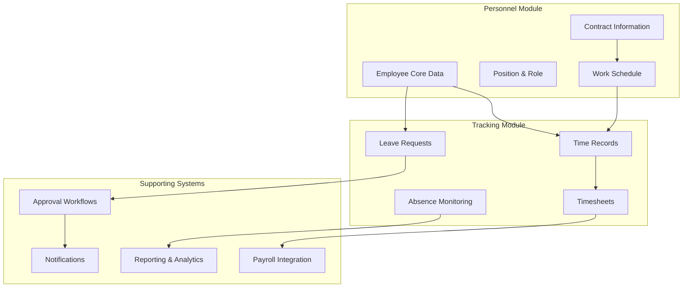
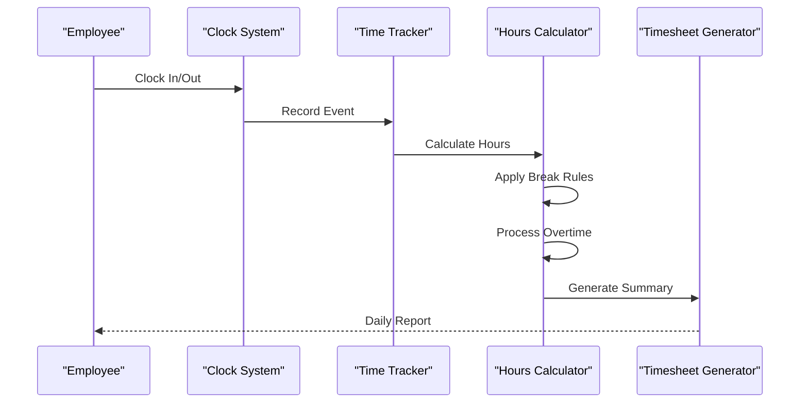
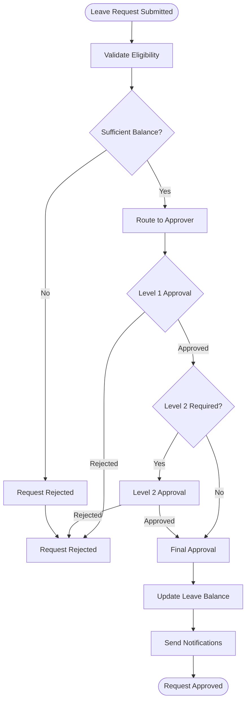
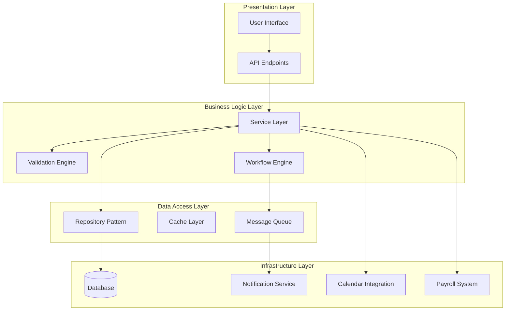
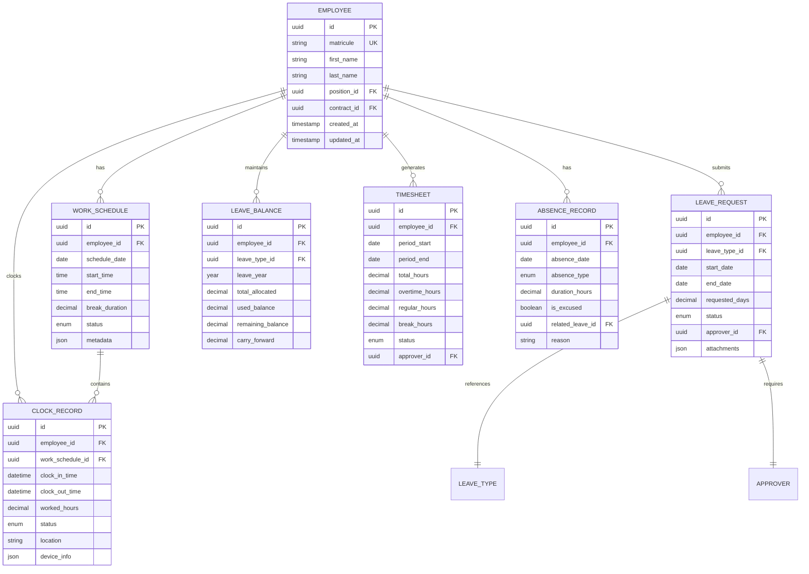
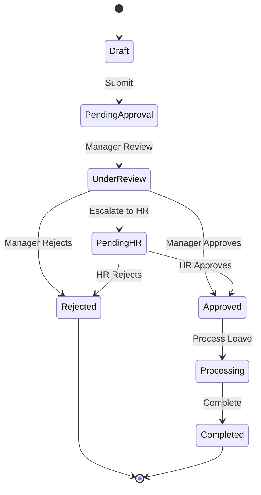
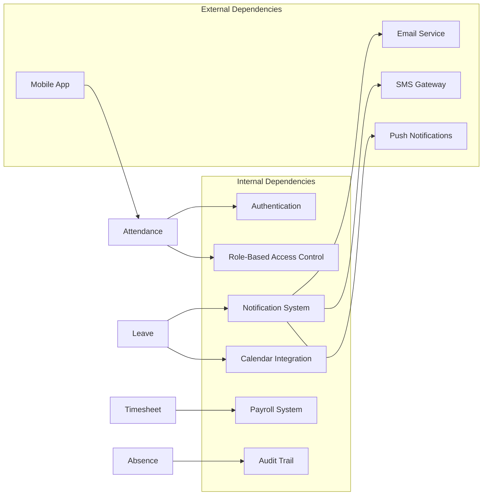

# Attendance & Leave Management Entities

<cite>
**Referenced Files in This Document**
- [backend/src/modules/personnel/index.ts](file://backend/src/modules/personnel/index.ts)
- [backend/database/migrations/016-module-personnel-rh-phase1.sql](file://backend/database/migrations/016-module-personnel-rh-phase1.sql)
- [backend/database/migrations/017-module-personnel-rh-phase2.sql](file://backend/database/migrations/017-module-personnel-rh-phase2.sql)
- [backend/database/migrations/018-module-personnel-rh-phase3.sql](file://backend/database/migrations/018-module-personnel-rh-phase3.sql)
- [backend/database/migrations/019-module-personnel-rh-phase4.sql](file://backend/database/migrations/019-module-personnel-rh-phase4.sql)
- [backend/database/migrations/020-module-personnel-rh-phase5.sql](file://backend/database/migrations/020-module-personnel-rh-phase5.sql)
- [backend/database/migrations/022-module-personnel-rh-complete.sql](file://backend/database/migrations/022-module-personnel-rh-complete.sql)
- [backend/src/modules/suivi-personnel/index.ts](file://backend/src/modules/suivi-personnel/index.ts)
- [backend/database/migrations/031-suivi-personnel.sql](file://backend/database/migrations/031-suivi-personnel.sql)
- [backend/src/shared/constants/personnel.constants.ts](file://backend/src/shared/constants/personnel.constants.ts)
</cite>

## Table of Contents
1. [Introduction](#introduction)
2. [Project Structure](#project-structure)
3. [Core Components](#core-components)
4. [Architecture Overview](#architecture-overview)
5. [Detailed Component Analysis](#detailed-component-analysis)
6. [Dependency Analysis](#dependency-analysis)
7. [Performance Considerations](#performance-considerations)
8. [Troubleshooting Guide](#troubleshooting-guide)
9. [Conclusion](#conclusion)
10. [Appendices](#appendices)

## Introduction

This document provides comprehensive data model documentation for eLISAschool's attendance and leave management system. The system manages time tracking, leave requests, absence monitoring, and related workflows for school personnel including teachers, administrative staff, and support personnel.

The attendance and leave management module is a critical component of the Human Resources (HR) system, providing comprehensive tracking of employee working hours, leave balances, approval workflows, and compliance reporting.

## Project Structure

The attendance and leave management functionality is primarily implemented within the Personnel module (`personnel`) and the Personnel Tracking module (`suivi-personnel`). The system follows a modular architecture with clear separation between core HR entities and specialized tracking functionality.

**Diagram sources**
- [backend/src/modules/personnel/index.ts](file://backend/src/modules/personnel/index.ts)
- [backend/src/modules/suivi-personnel/index.ts](file://backend/src/modules/suivi-personnel/index.ts)

## Core Components

### Time Tracking System

The time tracking system captures clock-in/clock-out records, calculates work hours, and generates timesheets for payroll processing.

#### Key Entities:
- **ClockInRecord**: Individual time entry events
- **WorkDay**: Aggregated daily work summary
- **Timesheet**: Periodic work hour compilation
- **WorkSchedule**: Standard working hours configuration

#### Data Flow:

**Diagram sources**
- [backend/database/migrations/016-module-personnel-rh-phase1.sql](file://backend/database/migrations/016-module-personnel-rh-phase1.sql)
- [backend/database/migrations/031-suivi-personnel.sql](file://backend/database/migrations/031-suivi-personnel.sql)

### Leave Management System

The leave management system handles various types of leave requests, approval workflows, and balance tracking.

#### Leave Types Supported:
- Annual Leave (Vacation)
- Sick Leave
- Maternity/Paternity Leave
- Personal Leave
- Unpaid Leave
- Training Leave

#### Approval Workflow:

**Diagram sources**
- [backend/database/migrations/017-module-personnel-rh-phase2.sql](file://backend/database/migrations/017-module-personnel-rh-phase2.sql)
- [backend/database/migrations/018-module-personnel-rh-phase3.sql](file://backend/database/migrations/018-module-personnel-rh-phase3.sql)

### Absence Monitoring System

The absence monitoring system tracks unexcused absences, generates automatic notifications, and analyzes productivity impact.

#### Monitoring Features:
- Real-time absence detection
- Automatic notification generation
- Coverage planning alerts
- Productivity impact analysis
- Compliance violation tracking

## Architecture Overview

The attendance and leave management system follows a layered architecture with clear separation of concerns:

**Diagram sources**
- [backend/src/modules/personnel/index.ts](file://backend/src/modules/personnel/index.ts)
- [backend/src/modules/suivi-personnel/index.ts](file://backend/src/modules/suivi-personnel/index.ts)

## Detailed Component Analysis

### Time Entry and Clock Management

The time entry system handles real-time clock-in/clock-out operations with validation and conflict resolution.

#### Entity Relationships:

**Diagram sources**
- [backend/database/migrations/016-module-personnel-rh-phase1.sql](file://backend/database/migrations/016-module-personnel-rh-phase1.sql)
- [backend/database/migrations/017-module-personnel-rh-phase2.sql](file://backend/database/migrations/017-module-personnel-rh-phase2.sql)
- [backend/database/migrations/018-module-personnel-rh-phase3.sql](file://backend/database/migrations/018-module-personnel-rh-phase3.sql)
- [backend/database/migrations/019-module-personnel-rh-phase4.sql](file://backend/database/migrations/019-module-personnel-rh-phase4.sql)
- [backend/database/migrations/020-module-personnel-rh-phase5.sql](file://backend/database/migrations/020-module-personnel-rh-phase5.sql)
- [backend/database/migrations/022-module-personnel-rh-complete.sql](file://backend/database/migrations/022-module-personnel-rh-complete.sql)
- [backend/database/migrations/031-suivi-personnel.sql](file://backend/database/migrations/031-suivi-personnel.sql)

### Leave Type Configuration and Policies

The system supports configurable leave types with specific policies and rules.

#### Leave Type Categories:
- **Paid Leave**: Annual, sick, maternity/paternity
- **Unpaid Leave**: Personal, sabbatical, unpaid training
- **Special Leave**: Jury duty, bereavement, civic duties
- **Compensatory Leave**: Overtime compensation, holiday make-up

#### Policy Rules:
- Minimum notice periods
- Maximum consecutive days
- Carry-forward limits
- Pro-rated calculations
- Special conditions for different employment types

### Approval Workflow Engine

Multi-level approval workflows ensure proper authorization and compliance.

#### Workflow Configuration:

**Diagram sources**
- [backend/database/migrations/018-module-personnel-rh-phase3.sql](file://backend/database/migrations/018-module-personnel-rh-phase3.sql)
- [backend/database/migrations/019-module-personnel-rh-phase4.sql](file://backend/database/migrations/019-module-personnel-rh-phase4.sql)

### Attendance Policies and Rules

Working hours, break rules, and overtime regulations are configurable per organization or position.

#### Working Hour Policies:
- Standard working week (40 hours)
- Flexible working arrangements
- Shift-based schedules
- Part-time configurations
- Seasonal variations

#### Break Rules:
- Mandatory lunch breaks
- Rest period requirements
- Break duration calculations
- Overtime eligibility thresholds

### Reporting and Analytics

Comprehensive reporting capabilities for compliance, payroll, and operational insights.

#### Key Reports:
- Daily attendance summaries
- Monthly leave utilization
- Overtime analysis
- Absenteeism trends
- Compliance violations
- Payroll integration data

## Dependency Analysis

The attendance and leave management system has several key dependencies:

**Diagram sources**
- [backend/src/modules/personnel/index.ts](file://backend/src/modules/personnel/index.ts)
- [backend/src/modules/suivi-personnel/index.ts](file://backend/src/modules/suivi-personnel/index.ts)

## Performance Considerations

### Database Optimization
- Indexed queries for time range lookups
- Partitioned tables for large datasets
- Materialized views for reporting
- Connection pooling for high concurrency

### Caching Strategies
- Session-based clock state caching
- Leave balance cache invalidation
- Scheduled report pre-computation
- Hot path optimization for clock operations

### Scalability Patterns
- Horizontal scaling for clock services
- Message queue for async processing
- Read replicas for reporting queries
- CDN for static attendance data

## Troubleshooting Guide

### Common Issues and Solutions

#### Time Entry Problems
- **Duplicate clock entries**: Implement deduplication logic
- **Time zone conflicts**: Use UTC storage with local display
- **Network connectivity**: Offline mode with sync capability
- **Device synchronization**: Conflict resolution algorithms

#### Leave Request Issues
- **Balance calculation errors**: Recalculation triggers
- **Approval routing failures**: Fallback approver assignment
- **Policy validation conflicts**: Rule engine debugging
- **Integration failures**: Retry mechanisms with logging

#### Performance Bottlenecks
- **Slow report generation**: Query optimization and indexing
- **High database load**: Connection pooling and query caching
- **Memory leaks**: Proper resource cleanup and monitoring
- **API response times**: Response compression and pagination

### Monitoring and Alerting
- Real-time system health checks
- Error rate monitoring
- Performance metric collection
- Business rule violation alerts

## Conclusion

The eLISAschool attendance and leave management system provides a comprehensive solution for managing employee time tracking, leave administration, and absence monitoring. The modular architecture ensures scalability and maintainability while supporting complex business rules and workflows.

Key strengths include:
- Flexible leave type configuration
- Multi-level approval workflows
- Comprehensive reporting capabilities
- Integration with payroll and calendar systems
- Robust audit trail and compliance features

Future enhancements may include mobile app integration, advanced analytics, predictive absence modeling, and enhanced automation capabilities.

## Appendices

### API Endpoints Reference

#### Time Tracking Endpoints
- `POST /api/attendance/clock-in` - Clock in operation
- `POST /api/attendance/clock-out` - Clock out operation  
- `GET /api/attendance/timesheet/{period}` - Get timesheet data
- `PUT /api/attendance/clock-record/{id}` - Edit clock record

#### Leave Management Endpoints
- `POST /api/leave/request` - Submit leave request
- `GET /api/leave/balance/{employee-id}` - Get leave balance
- `PUT /api/leave/approve/{request-id}` - Approve/reject request
- `GET /api/leave/calendar/{month}` - View leave calendar

#### Reporting Endpoints
- `GET /api/reports/attendance/monthly` - Monthly attendance report
- `GET /api/reports/leave/utilization` - Leave utilization report
- `GET /api/reports/absence/trends` - Absence trend analysis

### Data Migration Notes

All database migrations follow semantic versioning and include rollback capabilities. Migration files are organized by phase and feature area to ensure clean deployment and easy troubleshooting.