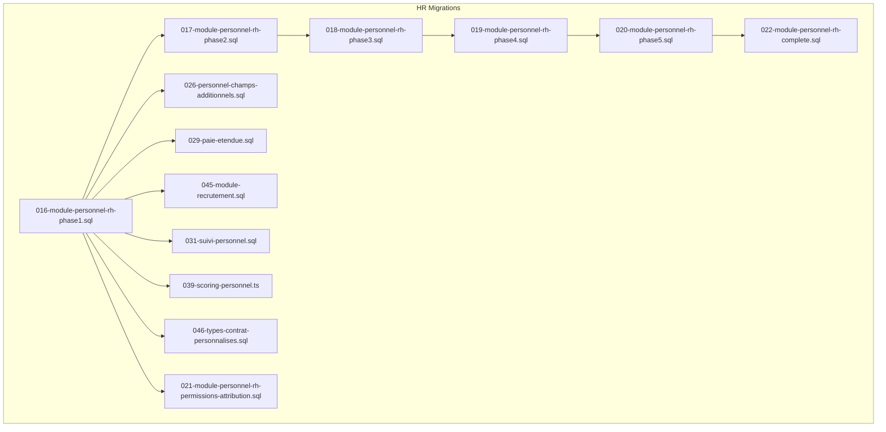
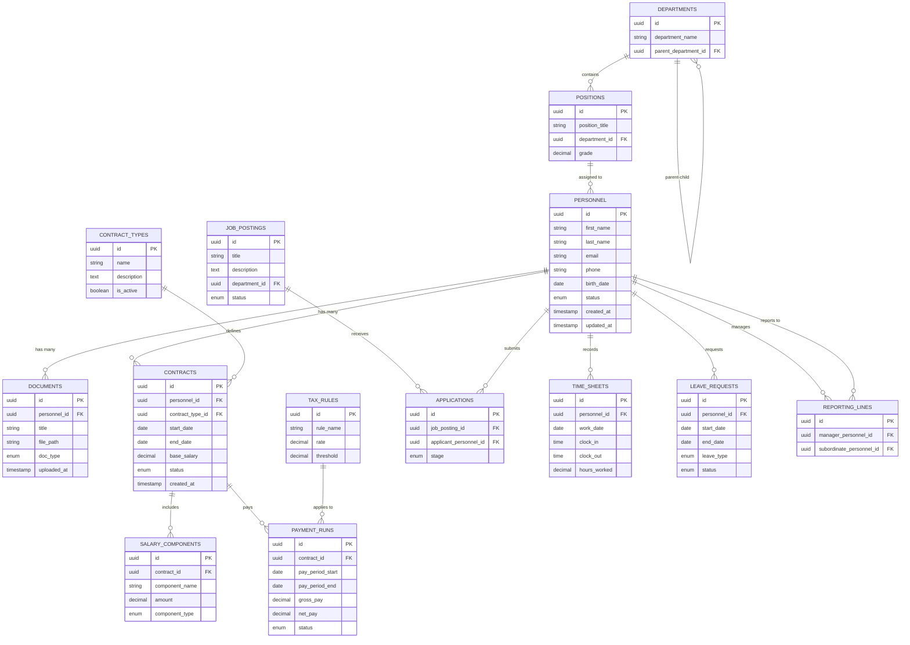
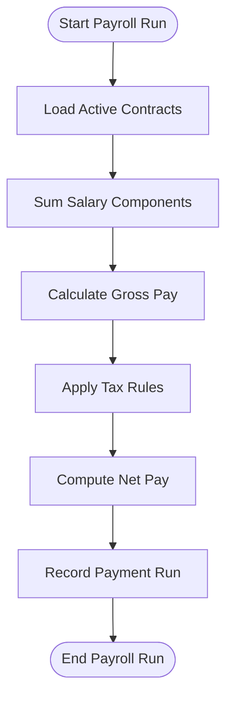
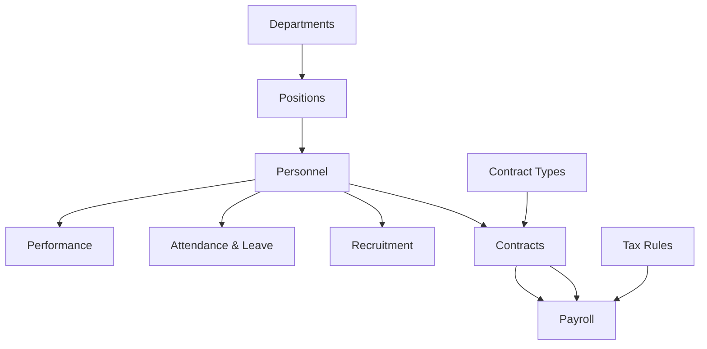

# Human Resources Schema

<cite>
**Referenced Files in This Document**
- [016-module-personnel-rh-phase1.sql](file://backend/database/migrations/016-module-personnel-rh-phase1.sql)
- [017-module-personnel-rh-phase2.sql](file://backend/database/migrations/017-module-personnel-rh-phase2.sql)
- [018-module-personnel-rh-phase3.sql](file://backend/database/migrations/018-module-personnel-rh-phase3.sql)
- [019-module-personnel-rh-phase4.sql](file://backend/database/migrations/019-module-personnel-rh-phase4.sql)
- [020-module-personnel-rh-phase5.sql](file://backend/database/migrations/020-module-personnel-rh-phase5.sql)
- [021-module-personnel-rh-permissions-attribution.sql](file://backend/database/migrations/021-module-personnel-rh-permissions-attribution.sql)
- [022-module-personnel-rh-complete.sql](file://backend/database/migrations/022-module-personnel-rh-complete.sql)
- [026-personnel-champs-additionnels.sql](file://backend/database/migrations/026-personnel-champs-additionnels.sql)
- [029-paie-etendue.sql](file://backend/database/migrations/029-paie-etendue.sql)
- [031-suivi-personnel.sql](file://backend/database/migrations/031-suivi-personnel.sql)
- [045-module-recrutement.sql](file://backend/database/migrations/045-module-recrutement.sql)
- [046-types-contrat-personnalises.sql](file://backend/database/migrations/046-types-contrat-personnalises.sql)
- [039-scoring-personnel.ts](file://backend/database/migrations/039-scoring-personnel.ts)
- [personnel.constants.ts](file://backend/src/shared/constants/personnel.constants.ts)
</cite>

## Table of Contents
1. [Introduction](#introduction)
2. [Project Structure](#project-structure)
3. [Core Components](#core-components)
4. [Architecture Overview](#architecture-overview)
5. [Detailed Component Analysis](#detailed-component-analysis)
6. [Dependency Analysis](#dependency-analysis)
7. [Performance Considerations](#performance-considerations)
8. [Troubleshooting Guide](#troubleshooting-guide)
9. [Conclusion](#conclusion)

## Introduction
This document provides a comprehensive data model for eLISAschool’s human resources module. It covers personnel administration, contract management, payroll processing, recruitment workflow, attendance and leave tracking, performance evaluation, training and certifications, organizational structure, and the end-to-end HR lifecycle from recruitment to retirement. The schema is implemented across multiple database migrations that progressively add entities, relationships, and constraints.

## Project Structure
The HR data model is defined primarily through SQL migrations under backend/database/migrations. Key phases include:
- Personnel core (profiles, documents, contracts)
- Payroll extensions (salary structures, taxes, payments)
- Recruitment module (job postings to onboarding)
- Attendance and follow-up (time sheets, leaves, absences)
- Performance scoring and career progression
- Organizational structure (positions, departments, hierarchies)
- Contract type customization and permissions

**Diagram sources**
- [016-module-personnel-rh-phase1.sql](file://backend/database/migrations/016-module-personnel-rh-phase1.sql)
- [017-module-personnel-rh-phase2.sql](file://backend/database/migrations/017-module-personnel-rh-phase2.sql)
- [018-module-personnel-rh-phase3.sql](file://backend/database/migrations/018-module-personnel-rh-phase3.sql)
- [019-module-personnel-rh-phase4.sql](file://backend/database/migrations/019-module-personnel-rh-phase4.sql)
- [020-module-personnel-rh-phase5.sql](file://backend/database/migrations/020-module-personnel-rh-phase5.sql)
- [022-module-personnel-rh-complete.sql](file://backend/database/migrations/022-module-personnel-rh-complete.sql)
- [021-module-personnel-rh-permissions-attribution.sql](file://backend/database/migrations/021-module-personnel-rh-permissions-attribution.sql)
- [026-personnel-champs-additionnels.sql](file://backend/database/migrations/026-personnel-champs-additionnels.sql)
- [029-paie-etendue.sql](file://backend/database/migrations/029-paie-etendue.sql)
- [045-module-recrutement.sql](file://backend/database/migrations/045-module-recrutement.sql)
- [046-types-contrat-personnalises.sql](file://backend/database/migrations/046-types-contrat-personnalises.sql)
- [031-suivi-personnel.sql](file://backend/database/migrations/031-suivi-personnel.sql)
- [039-scoring-personnel.ts](file://backend/database/migrations/039-scoring-personnel.ts)

**Section sources**
- [016-module-personnel-rh-phase1.sql](file://backend/database/migrations/016-module-personnel-rh-phase1.sql)
- [022-module-personnel-rh-complete.sql](file://backend/database/migrations/022-module-personnel-rh-complete.sql)

## Core Components
- Personnel Profiles: Core identity, personal details, contact information, and status.
- Documents: Attachments and records linked to personnel profiles.
- Contracts: Employment terms, types, validity periods, and customizations.
- Payroll: Salary components, tax rules, allowances, deductions, and payment runs.
- Recruitment: Job postings, applications, interviews, offers, and onboarding.
- Attendance & Leave: Time sheets, leave requests, approvals, and absence monitoring.
- Performance & Career: Scoring, reviews, competencies, and progression paths.
- Organization: Positions, departments, reporting lines, and hierarchies.
- Permissions: Role-based access control for HR operations.

**Section sources**
- [016-module-personnel-rh-phase1.sql](file://backend/database/migrations/016-module-personnel-rh-phase1.sql)
- [022-module-personnel-rh-complete.sql](file://backend/database/migrations/022-module-personnel-rh-complete.sql)
- [029-paie-etendue.sql](file://backend/database/migrations/029-paie-etendue.sql)
- [045-module-recrutement.sql](file://backend/database/migrations/045-module-recrutement.sql)
- [031-suivi-personnel.sql](file://backend/database/migrations/031-suivi-personnel.sql)
- [039-scoring-personnel.ts](file://backend/database/migrations/039-scoring-personnel.ts)
- [046-types-contrat-personnalises.sql](file://backend/database/migrations/046-types-contrat-personnalises.sql)
- [021-module-personnel-rh-permissions-attribution.sql](file://backend/database/migrations/021-module-personnel-rh-permissions-attribution.sql)

## Architecture Overview
The HR data architecture follows a layered approach:
- Foundational tables established in phase1 define core entities and relationships.
- Subsequent phases extend functionality with payroll, recruitment, attendance, performance, and organization.
- A complete consolidation migration ensures referential integrity and finalizes indexes/constraints.
- Custom contract types and additional fields enhance flexibility.
- Permissions are attributed to support RBAC for HR workflows.

**Diagram sources**
- [016-module-personnel-rh-phase1.sql](file://backend/database/migrations/016-module-personnel-rh-phase1.sql)
- [022-module-personnel-rh-complete.sql](file://backend/database/migrations/022-module-personnel-rh-complete.sql)
- [029-paie-etendue.sql](file://backend/database/migrations/029-paie-etendue.sql)
- [045-module-recrutement.sql](file://backend/database/migrations/045-module-recrutement.sql)
- [031-suivi-personnel.sql](file://backend/database/migrations/031-suivi-personnel.sql)
- [046-types-contrat-personnalises.sql](file://backend/database/migrations/046-types-contrat-personnalises.sql)

## Detailed Component Analysis

### Personnel Administration
- Profiles store core identity and contact details, including status for active/inactive states.
- Documents attach files or references to personnel records, enabling centralized document handling.
- Additional fields can be added via extension migrations to accommodate local requirements.

Key responsibilities:
- Maintain accurate personal data and lifecycle status.
- Manage attachments securely and link them to personnel IDs.
- Support multi-tenant scoping where applicable.

**Section sources**
- [016-module-personnel-rh-phase1.sql](file://backend/database/migrations/016-module-personnel-rh-phase1.sql)
- [026-personnel-champs-additionnels.sql](file://backend/database/migrations/026-personnel-champs-additionnels.sql)

### Contract Management
- Contracts capture employment terms, validity periods, and base salary.
- Contract types allow customization and categorization of roles and agreements.
- Status tracking supports draft, active, suspended, and terminated states.

Key responsibilities:
- Link contracts to personnel and contract types.
- Enforce date ranges and status transitions.
- Provide foundation for payroll calculations.

**Section sources**
- [016-module-personnel-rh-phase1.sql](file://backend/database/migrations/016-module-personnel-rh-phase1.sql)
- [046-types-contrat-personnalises.sql](file://backend/database/migrations/046-types-contrat-personnalises.sql)

### Payroll Processing
- Salary components define earnings and deductions per contract.
- Tax rules specify rates and thresholds applied during payment runs.
- Payment runs aggregate gross and net pay for a period and track status.

Processing logic:
- Compute gross pay by summing salary components.
- Apply tax rules based on thresholds and rates.
- Derive net pay and record payment run results.

**Diagram sources**
- [029-paie-etendue.sql](file://backend/database/migrations/029-paie-etendue.sql)

**Section sources**
- [029-paie-etendue.sql](file://backend/database/migrations/029-paie-etendue.sql)

### Recruitment Workflow
- Job postings describe open positions and eligibility criteria.
- Applications link candidates (often existing personnel or external applicants) to postings.
- Stages manage progression from application to offer and onboarding.

Workflow highlights:
- Create and publish job postings.
- Receive and evaluate applications.
- Transition stages upon decisions (shortlist, interview, offer).
- Onboard successful candidates into personnel and contracts.

**Section sources**
- [045-module-recrutement.sql](file://backend/database/migrations/045-module-recrutement.sql)

### Attendance Tracking and Leave Management
- Time sheets record daily attendance, clock-in/out times, and hours worked.
- Leave requests capture planned absences with types and statuses.
- Absence monitoring aggregates time sheets and leave records for compliance and reporting.

Operational flow:
- Employees log time entries per day.
- Managers approve leave requests within policy limits.
- System calculates total hours and flags anomalies or excessive absences.

**Section sources**
- [031-suivi-personnel.sql](file://backend/database/migrations/031-suivi-personnel.sql)

### Performance Evaluation and Career Progression
- Scoring system tracks evaluations, competencies, and career milestones.
- Reviews can be periodic or event-driven, linking to personnel and positions.
- Progression pathways inform promotions and role changes.

Evaluation process:
- Define review cycles and criteria.
- Capture scores and comments.
- Update career progression records accordingly.

**Section sources**
- [039-scoring-personnel.ts](file://backend/database/migrations/039-scoring-personnel.ts)

### Training Management and Certifications
- Training modules and certifications can be associated with personnel and positions.
- Compliance requirements ensure mandatory trainings are completed.
- Records track completion dates, validity, and renewals.

Note: While specific training tables may be introduced in later migrations, the HR schema supports linking training and certification records to personnel and positions for compliance tracking.

[No sources needed since this section provides general guidance]

### Organizational Structure
- Departments form hierarchical units with parent-child relationships.
- Positions define roles within departments, including grades and responsibilities.
- Reporting lines establish manager-subordinate relationships among personnel.

Structural benefits:
- Clear reporting chains for approvals and accountability.
- Departmental budgeting and headcount planning.
- Position-based assignment to personnel and contracts.

**Section sources**
- [016-module-personnel-rh-phase1.sql](file://backend/database/migrations/016-module-personnel-rh-phase1.sql)
- [022-module-personnel-rh-complete.sql](file://backend/database/migrations/022-module-personnel-rh-complete.sql)

### Permissions and Access Control
- HR-specific permissions enable role-based access to sensitive operations.
- Attribution migrations assign capabilities to roles and groups.
- Ensures secure handling of personnel data and payroll information.

**Section sources**
- [021-module-personnel-rh-permissions-attribution.sql](file://backend/database/migrations/021-module-personnel-rh-permissions-attribution.sql)

## Dependency Analysis
The HR schema exhibits clear dependency patterns:
- Core personnel tables are foundational; all other modules depend on them.
- Contracts depend on personnel and contract types.
- Payroll depends on contracts, salary components, and tax rules.
- Recruitment links to personnel and departments.
- Attendance and leave depend on personnel and organizational context.
- Performance scoring depends on personnel and positions.

**Diagram sources**
- [016-module-personnel-rh-phase1.sql](file://backend/database/migrations/016-module-personnel-rh-phase1.sql)
- [029-paie-etendue.sql](file://backend/database/migrations/029-paie-etendue.sql)
- [045-module-recrutement.sql](file://backend/database/migrations/045-module-recrutement.sql)
- [031-suivi-personnel.sql](file://backend/database/migrations/031-suivi-personnel.sql)
- [039-scoring-personnel.ts](file://backend/database/migrations/039-scoring-personnel.ts)

**Section sources**
- [016-module-personnel-rh-phase1.sql](file://backend/database/migrations/016-module-personnel-rh-phase1.sql)
- [022-module-personnel-rh-complete.sql](file://backend/database/migrations/022-module-personnel-rh-complete.sql)

## Performance Considerations
- Indexes on frequently queried columns (e.g., personnel_id, contract_id, work_date) improve retrieval speed.
- Partitioning large tables like time sheets and payment runs by date ranges can optimize analytics queries.
- Avoid over-normalization where read-heavy reports require denormalized views.
- Use materialized views for complex payroll summaries and performance dashboards.

[No sources needed since this section provides general guidance]

## Troubleshooting Guide
Common issues and resolutions:
- Missing foreign key constraints: Ensure all dependent tables exist before inserting related records.
- Invalid contract dates: Validate start/end dates and status transitions during updates.
- Payroll calculation errors: Verify tax rules and salary components are correctly assigned to contracts.
- Duplicate applications: Enforce unique constraints on candidate-posting combinations.
- Unauthorized access: Confirm RBAC permissions are properly attributed to roles.

**Section sources**
- [022-module-personnel-rh-complete.sql](file://backend/database/migrations/022-module-personnel-rh-complete.sql)
- [021-module-personnel-rh-permissions-attribution.sql](file://backend/database/migrations/021-module-personnel-rh-permissions-attribution.sql)

## Conclusion
The eLISAschool HR schema provides a robust, extensible foundation for managing the full employee lifecycle. Through phased migrations, it integrates personnel administration, contracts, payroll, recruitment, attendance, performance, and organizational structure. The design emphasizes clarity, scalability, and security, supporting both operational needs and strategic HR analytics.