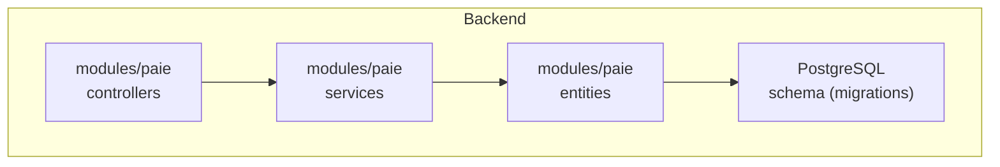
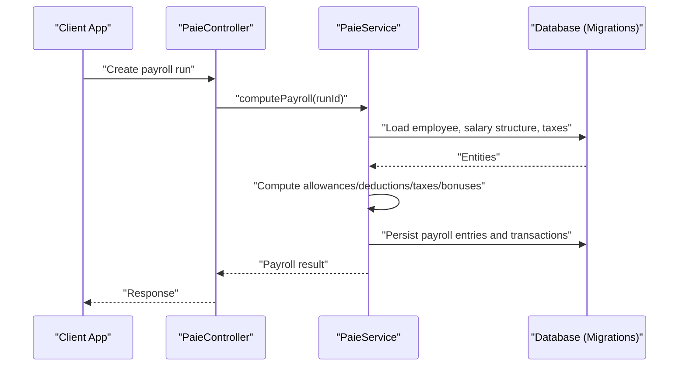
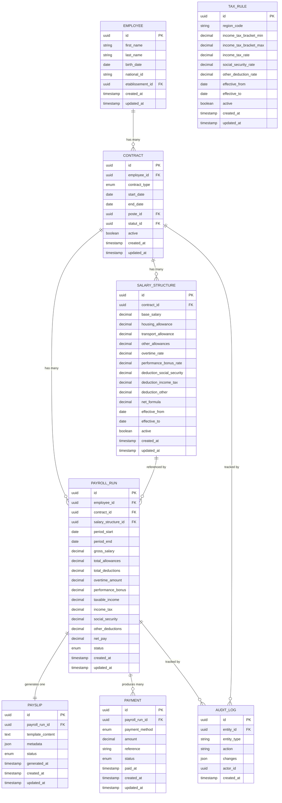
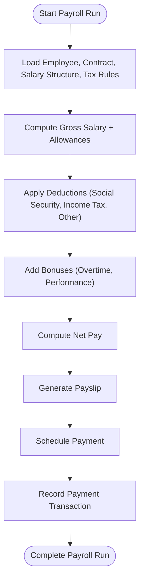
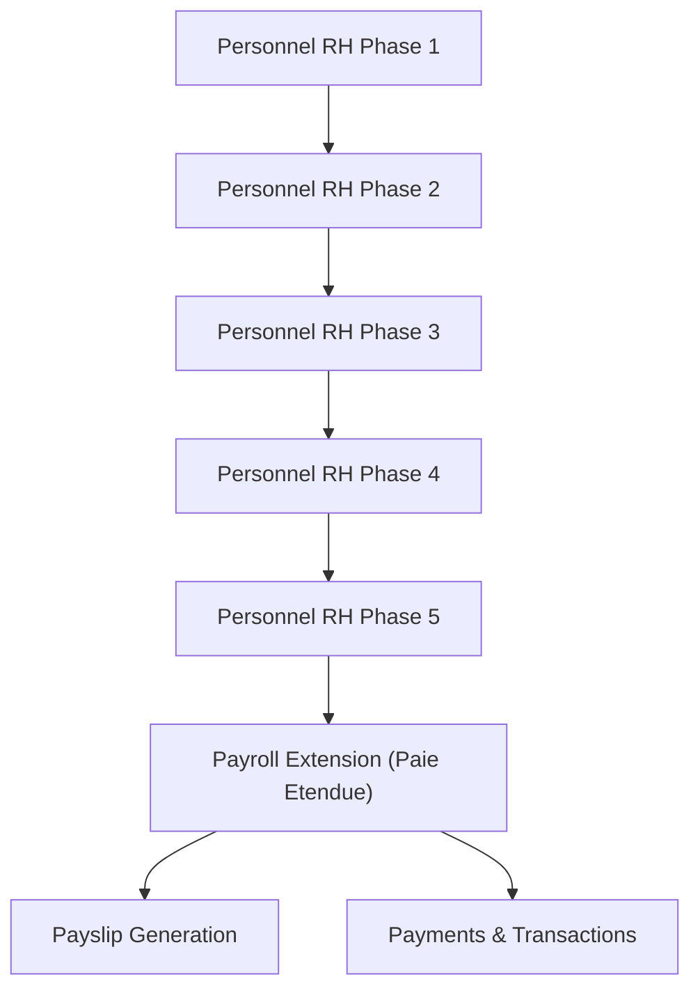
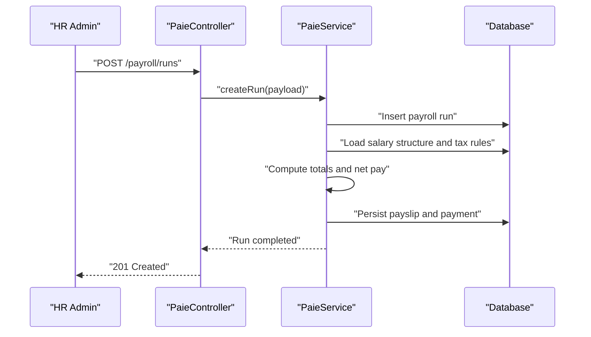

# Payroll Processing Entities

<cite>
**Referenced Files in This Document**
- [029-paie-etendue.sql](file://backend/database/migrations/029-paie-etendue.sql)
- [16-module-personnel-rh-phase1.sql](file://backend/database/migrations/16-module-personnel-rh-phase1.sql)
- [17-module-personnel-rh-phase2.sql](file://backend/database/migrations/17-module-personnel-rh-phase2.sql)
- [18-module-personnel-rh-phase3.sql](file://backend/database/migrations/18-module-personnel-rh-phase3.sql)
- [19-module-personnel-rh-phase4.sql](file://backend/database/migrations/19-module-personnel-rh-phase4.sql)
- [20-module-personnel-rh-phase5.sql](file://backend/database/migrations/20-module-personnel-rh-phase5.sql)
- [paie.controller.ts](file://backend/src/modules/paie/controllers/paie.controller.ts)
- [paie.service.ts](file://backend/src/modules/paie/services/paie.service.ts)
- [paie.entity.ts](file://backend/src/modules/paie/entities/paie.entity.ts)
</cite>

## Table of Contents
1. [Introduction](#introduction)
2. [Project Structure](#project-structure)
3. [Core Components](#core-components)
4. [Architecture Overview](#architecture-overview)
5. [Detailed Component Analysis](#detailed-component-analysis)
6. [Dependency Analysis](#dependency-analysis)
7. [Performance Considerations](#performance-considerations)
8. [Troubleshooting Guide](#troubleshooting-guide)
9. [Conclusion](#conclusion)
10. [Appendices](#appendices)

## Introduction
This document provides comprehensive data model documentation for eLISAschool’s payroll processing entities. It covers salary structure configuration (base salaries, allowances, deductions, bonuses), tax calculations with statutory and regional considerations, payment processing across multiple methods and schedules, transaction tracking, and pay slip generation. It also explains overtime, leave deductions, performance bonuses, payroll history, year-end processing, and financial reporting. Entity relationships are mapped to illustrate the end-to-end payroll calculation flow from salary structures to final payments.

## Project Structure
The payroll domain is implemented as a dedicated module within the backend application:
- Database schema definitions are provided via SQL migrations under database/migrations.
- The runtime implementation resides under modules/paie with controllers, services, and entities.

[No sources needed since this diagram shows conceptual workflow, not actual code structure]

## Core Components
The payroll system centers around the following core components:
- Salary structure configuration: base salary, allowances, deductions, and bonus rules.
- Tax engine: statutory rates, regional variations, and automated computations.
- Payment processor: multiple payment methods, schedules, and transaction records.
- Payroll components: overtime, leave deductions, performance bonuses.
- Pay slips: customizable templates and legal requirements.
- History and reporting: payroll history, year-end processing, and financial reports.

Key implementation references:
- Controller layer for payroll operations: [paie.controller.ts](file://backend/src/modules/paie/controllers/paie.controller.ts)
- Service layer orchestrating calculations and workflows: [paie.service.ts](file://backend/src/modules/paie/services/paie.service.ts)
- Entity definitions for persistence: [paie.entity.ts](file://backend/src/modules/paie/entities/paie.entity.ts)

**Section sources**
- [paie.controller.ts](file://backend/src/modules/paie/controllers/paie.controller.ts)
- [paie.service.ts](file://backend/src/modules/paie/services/paie.service.ts)
- [paie.entity.ts](file://backend/src/modules/paie/entities/paie.entity.ts)

## Architecture Overview
The payroll architecture follows a layered approach:
- Controllers expose REST endpoints for payroll operations.
- Services implement business logic for salary computation, tax calculations, and payment processing.
- Entities map to database tables defined by migrations.
- Migrations define the canonical schema for payroll entities and relationships.

**Diagram sources**
- [paie.controller.ts](file://backend/src/modules/paie/controllers/paie.controller.ts)
- [paie.service.ts](file://backend/src/modules/paie/services/paie.service.ts)
- [029-paie-etendue.sql](file://backend/database/migrations/029-paie-etendue.sql)

**Section sources**
- [paie.controller.ts](file://backend/src/modules/paie/controllers/paie.controller.ts)
- [paie.service.ts](file://backend/src/modules/paie/services/paie.service.ts)
- [029-paie-etendue.sql](file://backend/database/migrations/029-paie-etendue.sql)

## Detailed Component Analysis

### Data Model Overview
The payroll data model includes entities for employees, contracts, salary structures, allowances, deductions, tax rules, payroll runs, payslips, payments, and related audit/history records. Relationships connect employees to contracts and salary structures; payroll runs aggregate computed line items; payments link to payroll runs and track method and schedule.

**Diagram sources**
- [16-module-personnel-rh-phase1.sql](file://backend/database/migrations/16-module-personnel-rh-phase1.sql)
- [17-module-personnel-rh-phase2.sql](file://backend/database/migrations/17-module-personnel-rh-phase2.sql)
- [18-module-personnel-rh-phase3.sql](file://backend/database/migrations/18-module-personnel-rh-phase3.sql)
- [19-module-personnel-rh-phase4.sql](file://backend/database/migrations/19-module-personnel-rh-phase4.sql)
- [20-module-personnel-rh-phase5.sql](file://backend/database/migrations/20-module-personnel-rh-phase5.sql)
- [029-paie-etendue.sql](file://backend/database/migrations/029-paie-etendue.sql)

**Section sources**
- [16-module-personnel-rh-phase1.sql](file://backend/database/migrations/16-module-personnel-rh-phase1.sql)
- [17-module-personnel-rh-phase2.sql](file://backend/database/migrations/17-module-personnel-rh-phase2.sql)
- [18-module-personnel-rh-phase3.sql](file://backend/database/migrations/18-module-personnel-rh-phase3.sql)
- [19-module-personnel-rh-phase4.sql](file://backend/database/migrations/19-module-personnel-rh-phase4.sql)
- [20-module-personnel-rh-phase5.sql](file://backend/database/migrations/20-module-personnel-rh-phase5.sql)
- [029-paie-etendue.sql](file://backend/database/migrations/029-paie-etendue.sql)

### Salary Structure Configuration
Salary structures encapsulate:
- Base salary and periodic adjustments.
- Allowances: housing, transport, and others.
- Deductions: social security, income tax, and other statutory or company-specific deductions.
- Bonus parameters: overtime rate and performance bonus rate.
- Effective periods and activation flags to manage historical accuracy.

Implementation references:
- Entity fields and relationships: [paie.entity.ts](file://backend/src/modules/paie/entities/paie.entity.ts)
- Schema definitions for salary-related tables: [029-paie-etendue.sql](file://backend/database/migrations/029-paie-etendue.sql)

**Section sources**
- [paie.entity.ts](file://backend/src/modules/paie/entities/paie.entity.ts)
- [029-paie-etendue.sql](file://backend/database/migrations/029-paie-etendue.sql)

### Tax Calculations
Tax calculations incorporate:
- Statutory income tax brackets and rates per region.
- Social security contributions and other mandatory deductions.
- Regional variations via region codes and effective periods.
- Automated computation integrated into payroll runs.

Implementation references:
- Tax rule schema and effective periods: [029-paie-etendue.sql](file://backend/database/migrations/029-paie-etendue.sql)
- Calculation orchestration: [paie.service.ts](file://backend/src/modules/paie/services/paie.service.ts)

**Section sources**
- [029-paie-etendue.sql](file://backend/database/migrations/029-paie-etendue.sql)
- [paie.service.ts](file://backend/src/modules/paie/services/paie.service.ts)

### Payment Processing
Payment processing supports:
- Multiple payment methods (e.g., bank transfer, cash, mobile money).
- Scheduling based on payroll run status and period.
- Transaction tracking with references and timestamps.
- Status management for reconciliation and auditing.

Implementation references:
- Payment entity and lifecycle: [paie.entity.ts](file://backend/src/modules/paie/entities/paie.entity.ts)
- Payment creation and updates: [paie.controller.ts](file://backend/src/modules/paie/controllers/paie.controller.ts)
- Payment schema: [029-paie-etendue.sql](file://backend/database/migrations/029-paie-etendue.sql)

**Section sources**
- [paie.entity.ts](file://backend/src/modules/paie/entities/paie.entity.ts)
- [paie.controller.ts](file://backend/src/modules/paie/controllers/paie.controller.ts)
- [029-paie-etendue.sql](file://backend/database/migrations/029-paie-etendue.sql)

### Payroll Components
Additional payroll components include:
- Overtime: tracked via hours worked and overtime rate applied to gross salary.
- Leave deductions: absence days converted to monetary deductions based on policy.
- Performance bonuses: calculated using performance metrics and bonus rate.

Implementation references:
- Payroll run aggregation fields: [paie.entity.ts](file://backend/src/modules/paie/entities/paie.entity.ts)
- Computation logic integration: [paie.service.ts](file://backend/src/modules/paie/services/paie.service.ts)

**Section sources**
- [paie.entity.ts](file://backend/src/modules/paie/entities/paie.entity.ts)
- [paie.service.ts](file://backend/src/modules/paie/services/paie.service.ts)

### Pay Slip Generation
Pay slip generation produces:
- Customizable templates with dynamic content.
- Legal requirement compliance through standardized fields and disclosures.
- Metadata for versioning and auditability.

Implementation references:
- Payslip entity and template storage: [paie.entity.ts](file://backend/src/modules/paie/entities/paie.entity.ts)
- Generation workflow: [paie.service.ts](file://backend/src/modules/paie/services/paie.service.ts)

**Section sources**
- [paie.entity.ts](file://backend/src/modules/paie/entities/paie.entity.ts)
- [paie.service.ts](file://backend/src/modules/paie/services/paie.service.ts)

### Payroll History, Year-End Processing, and Financial Reporting
- Payroll history: persisted payroll runs and associated documents for retrieval and analysis.
- Year-end processing: closing periods, recalculations, and adjustments for compliance.
- Financial reporting: aggregations of gross, allowances, deductions, taxes, and net pay for accounting.

Implementation references:
- Audit log and history tracking: [paie.entity.ts](file://backend/src/modules/paie/entities/paie.entity.ts)
- Reporting queries and summaries: [paie.service.ts](file://backend/src/modules/paie/services/paie.service.ts)

**Section sources**
- [paie.entity.ts](file://backend/src/modules/paie/entities/paie.entity.ts)
- [paie.service.ts](file://backend/src/modules/paie/services/paie.service.ts)

### End-to-End Payroll Calculation Flow
The payroll calculation flow integrates inputs from contracts, salary structures, and tax rules to produce finalized payroll runs, payslips, and payments.

**Diagram sources**
- [paie.service.ts](file://backend/src/modules/paie/services/paie.service.ts)
- [029-paie-etendue.sql](file://backend/database/migrations/029-paie-etendue.sql)

**Section sources**
- [paie.service.ts](file://backend/src/modules/paie/services/paie.service.ts)
- [029-paie-etendue.sql](file://backend/database/migrations/029-paie-etendue.sql)

## Dependency Analysis
The payroll module depends on personnel and HR entities for employee and contract data, and on finance-related schemas for payment and reporting. Migrations define the canonical relationships that enforce referential integrity across the payroll domain.

**Diagram sources**
- [16-module-personnel-rh-phase1.sql](file://backend/database/migrations/16-module-personnel-rh-phase1.sql)
- [17-module-personnel-rh-phase2.sql](file://backend/database/migrations/17-module-personnel-rh-phase2.sql)
- [18-module-personnel-rh-phase3.sql](file://backend/database/migrations/18-module-personnel-rh-phase3.sql)
- [19-module-personnel-rh-phase4.sql](file://backend/database/migrations/19-module-personnel-rh-phase4.sql)
- [20-module-personnel-rh-phase5.sql](file://backend/database/migrations/20-module-personnel-rh-phase5.sql)
- [029-paie-etendue.sql](file://backend/database/migrations/029-paie-etendue.sql)

**Section sources**
- [16-module-personnel-rh-phase1.sql](file://backend/database/migrations/16-module-personnel-rh-phase1.sql)
- [17-module-personnel-rh-phase2.sql](file://backend/database/migrations/17-module-personnel-rh-phase2.sql)
- [18-module-personnel-rh-phase3.sql](file://backend/database/migrations/18-module-personnel-rh-phase3.sql)
- [19-module-personnel-rh-phase4.sql](file://backend/database/migrations/19-module-personnel-rh-phase4.sql)
- [20-module-personnel-rh-phase5.sql](file://backend/database/migrations/20-module-personnel-rh-phase5.sql)
- [029-paie-etendue.sql](file://backend/database/migrations/029-paie-etendue.sql)

## Performance Considerations
- Indexing strategy: ensure indexes on foreign keys (employee_id, contract_id, salary_structure_id) and query filters (period_start, period_end, status).
- Batch processing: compute payroll runs in batches to reduce memory pressure and improve throughput.
- Caching tax rules: cache frequently accessed tax rules by region and effective period to minimize repeated lookups.
- Idempotency: design payroll computation to be idempotent to safely retry failed runs.
- Audit logging: keep audit logs lightweight and asynchronous to avoid blocking critical paths.

[No sources needed since this section provides general guidance]

## Troubleshooting Guide
Common issues and resolutions:
- Missing salary structure: verify effective periods and active flags; ensure the latest structure is assigned to the contract.
- Incorrect tax calculation: validate region code and bracket ranges; confirm effective dates align with payroll period.
- Payment failures: check payment method configuration and reference uniqueness; review status transitions and error logs.
- Payslip generation errors: inspect template content and metadata; ensure required fields are present in payroll run.

Operational references:
- Controller endpoints for diagnostics and retries: [paie.controller.ts](file://backend/src/modules/paie/controllers/paie.controller.ts)
- Service-level error handling and validation: [paie.service.ts](file://backend/src/modules/paie/services/paie.service.ts)
- Schema constraints and enums: [029-paie-etendue.sql](file://backend/database/migrations/029-paie-etendue.sql)

**Section sources**
- [paie.controller.ts](file://backend/src/modules/paie/controllers/paie.controller.ts)
- [paie.service.ts](file://backend/src/modules/paie/services/paie.service.ts)
- [029-paie-etendue.sql](file://backend/database/migrations/029-paie-etendue.sql)

## Conclusion
The eLISAschool payroll system provides a robust, extensible data model supporting comprehensive salary configuration, statutory tax computations, multi-method payments, and detailed reporting. The layered architecture ensures clear separation of concerns, while migrations enforce referential integrity and support regional variations. By adhering to best practices in indexing, batch processing, and idempotency, the system can scale effectively and maintain compliance over time.

[No sources needed since this section summarizes without analyzing specific files]

## Appendices

### API Workflows for Payroll Operations

**Diagram sources**
- [paie.controller.ts](file://backend/src/modules/paie/controllers/paie.controller.ts)
- [paie.service.ts](file://backend/src/modules/paie/services/paie.service.ts)
- [029-paie-etendue.sql](file://backend/database/migrations/029-paie-etendue.sql)

**Section sources**
- [paie.controller.ts](file://backend/src/modules/paie/controllers/paie.controller.ts)
- [paie.service.ts](file://backend/src/modules/paie/services/paie.service.ts)
- [029-paie-etendue.sql](file://backend/database/migrations/029-paie-etendue.sql)