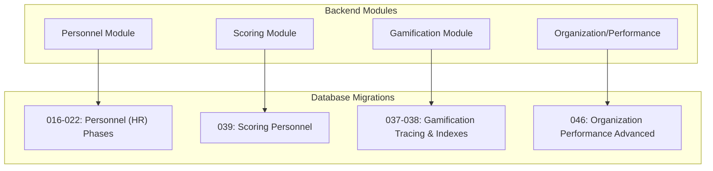
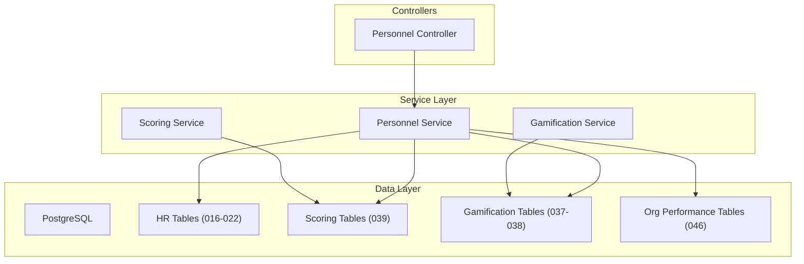
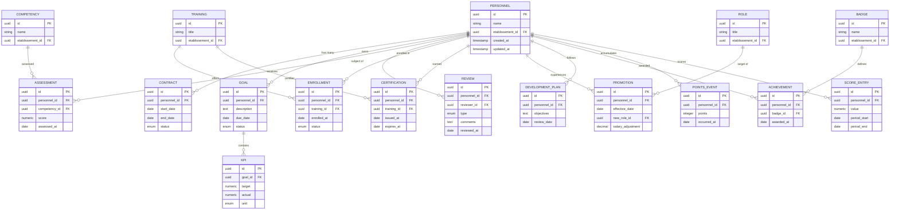
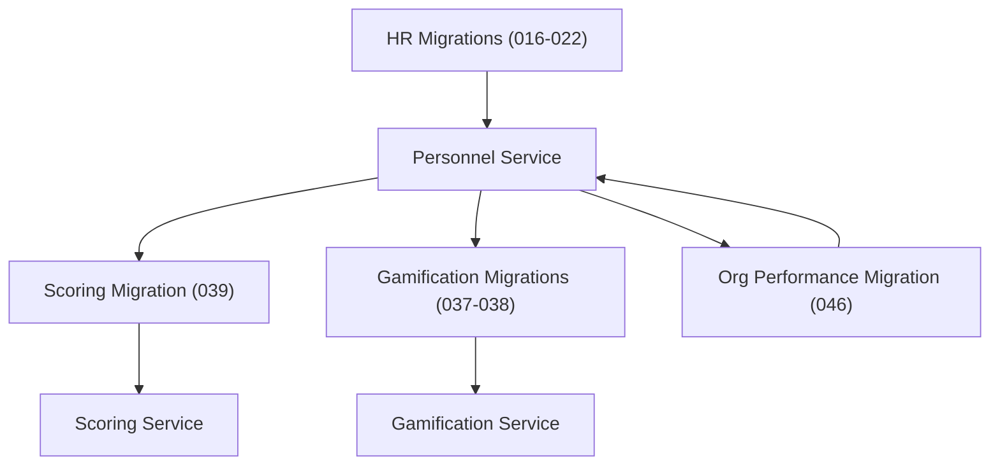
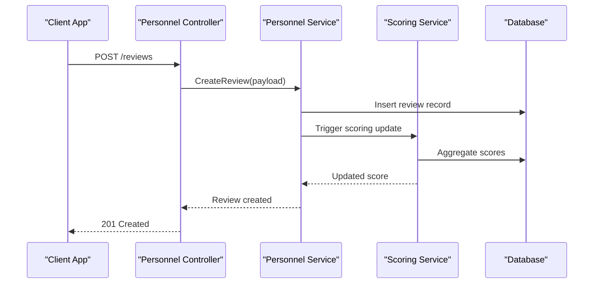

# Performance Evaluation & Career Progression Entities

<cite>
**Referenced Files in This Document**
- [016-module-personnel-rh-phase1.sql](file://backend/database/migrations/016-module-personnel-rh-phase1.sql)
- [017-module-personnel-rh-phase2.sql](file://backend/database/migrations/017-module-personnel-rh-phase2.sql)
- [018-module-personnel-rh-phase3.sql](file://backend/database/migrations/018-module-personnel-rh-phase3.sql)
- [019-module-personnel-rh-phase4.sql](file://backend/database/migrations/019-module-personnel-rh-phase4.sql)
- [020-module-personnel-rh-phase5.sql](file://backend/database/migrations/020-module-personnel-rh-phase5.sql)
- [021-module-personnel-rh-permissions-attribution.sql](file://backend/database/migrations/021-module-personnel-rh-permissions-attribution.sql)
- [022-module-personnel-rh-complete.sql](file://backend/database/migrations/022-module-personnel-rh-complete.sql)
- [037-gamification-tracabilite.ts](file://backend/database/migrations/037-gamification-tracabilite.ts)
- [038-index-performance-gamification-suivi.ts](file://backend/database/migrations/038-index-performance-gamification-suivi.ts)
- [039-scoring-personnel.ts](file://backend/database/migrations/039-scoring-personnel.ts)
- [046-organisation-performance-avancee.sql](file://backend/database/migrations/046-organisation-performance-avancee.sql)
- [personnel.service.ts](file://backend/src/modules/personnel/services/personnel.service.ts)
- [personnel.controller.ts](file://backend/src/modules/personnel/controllers/personnel.controller.ts)
- [gamification.service.ts](file://backend/src/modules/gamification/services/gamification.service.ts)
- [scoring.service.ts](file://backend/src/modules/scoring/services/scoring.service.ts)
</cite>

## Table of Contents
1. [Introduction](#introduction)
2. [Project Structure](#project-structure)
3. [Core Components](#core-components)
4. [Architecture Overview](#architecture-overview)
5. [Detailed Component Analysis](#detailed-component-analysis)
6. [Dependency Analysis](#dependency-analysis)
7. [Performance Considerations](#performance-considerations)
8. [Troubleshooting Guide](#troubleshooting-guide)
9. [Conclusion](#conclusion)
10. [Appendices](#appendices)

## Introduction
This document provides comprehensive data model documentation for eLISAschool’s performance evaluation and career progression entities. It covers:
- Performance metrics collection with KPIs, competency assessments, and goal tracking
- Review workflows including self-assessments, manager evaluations, and peer reviews
- Career progression tracking with promotion criteria, salary adjustments, and development plans
- Training management with course enrollment, certification tracking, and skill development
- Gamification elements with achievement badges, points systems, and recognition programs
- Performance analytics, trend analysis, and succession planning
- Entity relationships showing the complete performance management lifecycle from goal setting to career advancement

The content is grounded in the repository’s database migrations and backend modules related to personnel (HR), gamification, scoring, and advanced organization/performance features.

## Project Structure
The performance and career progression capabilities are implemented across several backend modules and database migrations:
- Personnel (HR) module migrations define core HR entities and relationships
- Scoring module implements personnel scoring logic
- Gamification module adds badges, points, and recognition
- Advanced organization/performance migration introduces performance-related structures and indexes

**Diagram sources**
- [016-module-personnel-rh-phase1.sql](file://backend/database/migrations/016-module-personnel-rh-phase1.sql)
- [017-module-personnel-rh-phase2.sql](file://backend/database/migrations/017-module-personnel-rh-phase2.sql)
- [018-module-personnel-rh-phase3.sql](file://backend/database/migrations/018-module-personnel-rh-phase3.sql)
- [019-module-personnel-rh-phase4.sql](file://backend/database/migrations/019-module-personnel-rh-phase4.sql)
- [020-module-personnel-rh-phase5.sql](file://backend/database/migrations/020-module-personnel-rh-phase5.sql)
- [021-module-personnel-rh-permissions-attribution.sql](file://backend/database/migrations/021-module-personnel-rh-permissions-attribution.sql)
- [022-module-personnel-rh-complete.sql](file://backend/database/migrations/022-module-personnel-rh-complete.sql)
- [037-gamification-tracabilite.ts](file://backend/database/migrations/037-gamification-tracabilite.ts)
- [038-index-performance-gamification-suivi.ts](file://backend/database/migrations/038-index-performance-gamification-suivi.ts)
- [039-scoring-personnel.ts](file://backend/database/migrations/039-scoring-personnel.ts)
- [046-organisation-performance-avancee.sql](file://backend/database/migrations/046-organisation-performance-avancee.sql)

**Section sources**
- [016-module-personnel-rh-phase1.sql](file://backend/database/migrations/016-module-personnel-rh-phase1.sql)
- [017-module-personnel-rh-phase2.sql](file://backend/database/migrations/017-module-personnel-rh-phase2.sql)
- [018-module-personnel-rh-phase3.sql](file://backend/database/migrations/018-module-personnel-rh-phase3.sql)
- [019-module-personnel-rh-phase4.sql](file://backend/database/migrations/019-module-personnel-rh-phase4.sql)
- [020-module-personnel-rh-phase5.sql](file://backend/database/migrations/020-module-personnel-rh-phase5.sql)
- [021-module-personnel-rh-permissions-attribution.sql](file://backend/database/migrations/021-module-personnel-rh-permissions-attribution.sql)
- [022-module-personnel-rh-complete.sql](file://backend/database/migrations/022-module-personnel-rh-complete.sql)
- [037-gamification-tracabilite.ts](file://backend/database/migrations/037-gamification-tracabilite.ts)
- [038-index-performance-gamification-suivi.ts](file://backend/database/migrations/038-index-performance-gamification-suivi.ts)
- [039-scoring-personnel.ts](file://backend/database/migrations/039-scoring-personnel.ts)
- [046-organisation-performance-avancee.sql](file://backend/database/migrations/046-organisation-performance-avancee.sql)

## Core Components
This section outlines the primary data model components that support performance evaluation and career progression:

- Personnel and HR entities: foundational records for staff, roles, contracts, and organizational assignments
- Performance goals and KPIs: structured objectives linked to individuals or teams
- Competency assessments: evaluations tied to skills and competencies
- Review workflows: multi-party evaluations (self, manager, peer)
- Career progression: promotions, salary adjustments, and development plans
- Training management: courses, enrollments, certifications, and skill development
- Gamification: badges, points, and recognition events
- Scoring and analytics: aggregated scores, trends, and succession indicators

These components are defined and extended through a series of phased migrations and supported by services in the backend modules.

**Section sources**
- [016-module-personnel-rh-phase1.sql](file://backend/database/migrations/016-module-personnel-rh-phase1.sql)
- [017-module-personnel-rh-phase2.sql](file://backend/database/migrations/017-module-personnel-rh-phase2.sql)
- [018-module-personnel-rh-phase3.sql](file://backend/database/migrations/018-module-personnel-rh-phase3.sql)
- [019-module-personnel-rh-phase4.sql](file://backend/database/migrations/019-module-personnel-rh-phase4.sql)
- [020-module-personnel-rh-phase5.sql](file://backend/database/migrations/020-module-personnel-rh-phase5.sql)
- [021-module-personnel-rh-permissions-attribution.sql](file://backend/database/migrations/021-module-personnel-rh-permissions-attribution.sql)
- [022-module-personnel-rh-complete.sql](file://backend/database/migrations/022-module-personnel-rh-complete.sql)
- [037-gamification-tracabilite.ts](file://backend/database/migrations/037-gamification-tracabilite.ts)
- [038-index-performance-gamification-suivi.ts](file://backend/database/migrations/038-index-performance-gamification-suivi.ts)
- [039-scoring-personnel.ts](file://backend/database/migrations/039-scoring-personnel.ts)
- [046-organisation-performance-avancee.sql](file://backend/database/migrations/046-organisation-performance-avancee.sql)

## Architecture Overview
The performance and career progression architecture integrates personnel data with scoring, gamification, and advanced organization/performance features. The following diagram maps key modules and their interactions:

**Diagram sources**
- [016-module-personnel-rh-phase1.sql](file://backend/database/migrations/016-module-personnel-rh-phase1.sql)
- [017-module-personnel-rh-phase2.sql](file://backend/database/migrations/017-module-personnel-rh-phase2.sql)
- [018-module-personnel-rh-phase3.sql](file://backend/database/migrations/018-module-personnel-rh-phase3.sql)
- [019-module-personnel-rh-phase4.sql](file://backend/database/migrations/019-module-personnel-rh-phase4.sql)
- [020-module-personnel-rh-phase5.sql](file://backend/database/migrations/020-module-personnel-rh-phase5.sql)
- [021-module-personnel-rh-permissions-attribution.sql](file://backend/database/migrations/021-module-personnel-rh-permissions-attribution.sql)
- [022-module-personnel-rh-complete.sql](file://backend/database/migrations/022-module-personnel-rh-complete.sql)
- [037-gamification-tracabilite.ts](file://backend/database/migrations/037-gamification-tracabilite.ts)
- [038-index-performance-gamification-suivi.ts](file://backend/database/migrations/038-index-performance-gamification-suivi.ts)
- [039-scoring-personnel.ts](file://backend/database/migrations/039-scoring-personnel.ts)
- [046-organisation-performance-avancee.sql](file://backend/database/migrations/046-organisation-performance-avancee.sql)
- [personnel.service.ts](file://backend/src/modules/personnel/services/personnel.service.ts)
- [personnel.controller.ts](file://backend/src/modules/personnel/controllers/personnel.controller.ts)
- [scoring.service.ts](file://backend/src/modules/scoring/services/scoring.service.ts)
- [gamification.service.ts](file://backend/src/modules/gamification/services/gamification.service.ts)

## Detailed Component Analysis

### Performance Metrics Collection (KPIs, Competency Assessments, Goal Tracking)
- KPIs and goals are modeled as structured entities linked to personnel and timeframes, enabling periodic measurement and progress tracking.
- Competency assessments capture skill levels and evaluation outcomes, often associated with training and development activities.
- Goal tracking supports multiple review cycles and ties into performance scoring and career progression decisions.

Key implementation references:
- HR phase migrations define base entities and relationships used by performance constructs
- Scoring migration introduces personnel scoring tables and aggregation logic
- Advanced organization/performance migration extends performance-related structures and indexing

**Section sources**
- [016-module-personnel-rh-phase1.sql](file://backend/database/migrations/016-module-personnel-rh-phase1.sql)
- [017-module-personnel-rh-phase2.sql](file://backend/database/migrations/017-module-personnel-rh-phase2.sql)
- [018-module-personnel-rh-phase3.sql](file://backend/database/migrations/018-module-personnel-rh-phase3.sql)
- [019-module-personnel-rh-phase4.sql](file://backend/database/migrations/019-module-personnel-rh-phase4.sql)
- [020-module-personnel-rh-phase5.sql](file://backend/database/migrations/020-module-personnel-rh-phase5.sql)
- [039-scoring-personnel.ts](file://backend/database/migrations/039-scoring-personnel.ts)
- [046-organisation-performance-avancee.sql](file://backend/database/migrations/046-organisation-performance-avancee.sql)

### Review Workflows (Self-Assessments, Manager Evaluations, Peer Reviews)
- Multi-party review workflows allow individuals to submit self-assessments, managers to evaluate direct reports, and peers to provide feedback.
- These evaluations feed into scoring and can influence career progression and recognition.
- Permissions and attribution ensure appropriate access control during the review process.

Implementation anchors:
- HR permissions and attribution migrations govern who can create, view, and approve reviews
- Scoring service aggregates inputs from different reviewers
- Personnel controller orchestrates workflow endpoints

**Section sources**
- [021-module-personnel-rh-permissions-attribution.sql](file://backend/database/migrations/021-module-personnel-rh-permissions-attribution.sql)
- [022-module-personnel-rh-complete.sql](file://backend/database/migrations/022-module-personnel-rh-complete.sql)
- [scoring.service.ts](file://backend/src/modules/scoring/services/scoring.service.ts)
- [personnel.controller.ts](file://backend/src/modules/personnel/controllers/personnel.controller.ts)

### Career Progression Tracking (Promotions, Salary Adjustments, Development Plans)
- Career progression tracks promotions, role changes, and salary adjustments over time.
- Development plans align with competency gaps identified via assessments and training outcomes.
- Succession planning leverages performance trends and readiness indicators.

Relevant structure:
- HR phases introduce personnel lifecycle fields and historical records
- Advanced organization/performance migration includes performance indicators supporting succession planning

**Section sources**
- [016-module-personnel-rh-phase1.sql](file://backend/database/migrations/016-module-personnel-rh-phase1.sql)
- [017-module-personnel-rh-phase2.sql](file://backend/database/migrations/017-module-personnel-rh-phase2.sql)
- [018-module-personnel-rh-phase3.sql](file://backend/database/migrations/018-module-personnel-rh-phase3.sql)
- [019-module-personnel-rh-phase4.sql](file://backend/database/migrations/019-module-personnel-rh-phase4.sql)
- [020-module-personnel-rh-phase5.sql](file://backend/database/migrations/020-module-personnel-rh-phase5.sql)
- [046-organisation-performance-avancee.sql](file://backend/database/migrations/046-organisation-performance-avancee.sql)

### Training Management (Course Enrollment, Certification Tracking, Skill Development)
- Training management links courses to personnel, tracks enrollments, and records certifications earned.
- Skill development outcomes inform competency assessments and performance scoring.
- Gamification may reward training completion and certification achievements.

Supporting artifacts:
- HR migrations include training and certification-related tables
- Gamification tracing captures recognition events tied to training milestones

**Section sources**
- [016-module-personnel-rh-phase1.sql](file://backend/database/migrations/016-module-personnel-rh-phase1.sql)
- [017-module-personnel-rh-phase2.sql](file://backend/database/migrations/017-module-personnel-rh-phase2.sql)
- [018-module-personnel-rh-phase3.sql](file://backend/database/migrations/018-module-personnel-rh-phase3.sql)
- [019-module-personnel-rh-phase4.sql](file://backend/database/migrations/019-module-personnel-rh-phase4.sql)
- [020-module-personnel-rh-phase5.sql](file://backend/database/migrations/020-module-personnel-rh-phase5.sql)
- [037-gamification-tracabilite.ts](file://backend/database/migrations/037-gamification-tracabilite.ts)

### Gamification Elements (Achievement Badges, Points Systems, Recognition Programs)
- Achievement badges and points are awarded for performance milestones, training completions, and positive behaviors.
- Recognition programs formalize acknowledgment of outstanding contributions.
- Indexes optimize queries for leaderboards and recognition dashboards.

Implementation details:
- Gamification tracing migration defines event logging and badge issuance
- Performance and gamification indexes improve query efficiency for analytics and UI rendering

**Section sources**
- [037-gamification-tracabilite.ts](file://backend/database/migrations/037-gamification-tracabilite.ts)
- [038-index-performance-gamification-suivi.ts](file://backend/database/migrations/038-index-performance-gamification-suivi.ts)
- [gamification.service.ts](file://backend/src/modules/gamification/services/gamification.service.ts)

### Performance Analytics, Trend Analysis, and Succession Planning
- Aggregated scoring and performance indicators enable trend analysis across periods and cohorts.
- Succession planning uses readiness scores, competency profiles, and historical performance to identify high-potential candidates.
- Advanced organization/performance structures provide additional dimensions for analytics and reporting.

Key references:
- Scoring migration establishes personnel scoring models and aggregations
- Advanced organization/performance migration enhances performance data availability and indexing

**Section sources**
- [039-scoring-personnel.ts](file://backend/database/migrations/039-scoring-personnel.ts)
- [046-organisation-performance-avancee.sql](file://backend/database/migrations/046-organisation-performance-avancee.sql)

### Entity Relationships: Complete Performance Management Lifecycle
The following entity relationship diagram illustrates the core entities involved in the performance management lifecycle, from goal setting to career advancement:

[No sources needed since this diagram shows conceptual workflow, not actual code structure]

## Dependency Analysis
The performance and career progression system depends on cohesive integration between HR, scoring, gamification, and organization/performance layers. The following dependency diagram highlights these relationships:

**Diagram sources**
- [016-module-personnel-rh-phase1.sql](file://backend/database/migrations/016-module-personnel-rh-phase1.sql)
- [017-module-personnel-rh-phase2.sql](file://backend/database/migrations/017-module-personnel-rh-phase2.sql)
- [018-module-personnel-rh-phase3.sql](file://backend/database/migrations/018-module-personnel-rh-phase3.sql)
- [019-module-personnel-rh-phase4.sql](file://backend/database/migrations/019-module-personnel-rh-phase4.sql)
- [020-module-personnel-rh-phase5.sql](file://backend/database/migrations/020-module-personnel-rh-phase5.sql)
- [021-module-personnel-rh-permissions-attribution.sql](file://backend/database/migrations/021-module-personnel-rh-permissions-attribution.sql)
- [022-module-personnel-rh-complete.sql](file://backend/database/migrations/022-module-personnel-rh-complete.sql)
- [037-gamification-tracabilite.ts](file://backend/database/migrations/037-gamification-tracabilite.ts)
- [038-index-performance-gamification-suivi.ts](file://backend/database/migrations/038-index-performance-gamification-suivi.ts)
- [039-scoring-personnel.ts](file://backend/database/migrations/039-scoring-personnel.ts)
- [046-organisation-performance-avancee.sql](file://backend/database/migrations/046-organisation-performance-avancee.sql)
- [personnel.service.ts](file://backend/src/modules/personnel/services/personnel.service.ts)
- [scoring.service.ts](file://backend/src/modules/scoring/services/scoring.service.ts)
- [gamification.service.ts](file://backend/src/modules/gamification/services/gamification.service.ts)

**Section sources**
- [016-module-personnel-rh-phase1.sql](file://backend/database/migrations/016-module-personnel-rh-phase1.sql)
- [017-module-personnel-rh-phase2.sql](file://backend/database/migrations/017-module-personnel-rh-phase2.sql)
- [018-module-personnel-rh-phase3.sql](file://backend/database/migrations/018-module-personnel-rh-phase3.sql)
- [019-module-personnel-rh-phase4.sql](file://backend/database/migrations/019-module-personnel-rh-phase4.sql)
- [020-module-personnel-rh-phase5.sql](file://backend/database/migrations/020-module-personnel-rh-phase5.sql)
- [021-module-personnel-rh-permissions-attribution.sql](file://backend/database/migrations/021-module-personnel-rh-permissions-attribution.sql)
- [022-module-personnel-rh-complete.sql](file://backend/database/migrations/022-module-personnel-rh-complete.sql)
- [037-gamification-tracabilite.ts](file://backend/database/migrations/037-gamification-tracabilite.ts)
- [038-index-performance-gamification-suivi.ts](file://backend/database/migrations/038-index-performance-gamification-suivi.ts)
- [039-scoring-personnel.ts](file://backend/database/migrations/039-scoring-personnel.ts)
- [046-organisation-performance-avancee.sql](file://backend/database/migrations/046-organisation-performance-avancee.sql)
- [personnel.service.ts](file://backend/src/modules/personnel/services/personnel.service.ts)
- [scoring.service.ts](file://backend/src/modules/scoring/services/scoring.service.ts)
- [gamification.service.ts](file://backend/src/modules/gamification/services/gamification.service.ts)

## Performance Considerations
- Indexing strategy: Performance and gamification indexes improve query times for leaderboards, dashboards, and analytics.
- Aggregation patterns: Scoring services should batch computations and cache results where appropriate to reduce database load.
- Data partitioning: Time-bound entities (goals, assessments, reviews, scores) benefit from partitioning by period for efficient trend analysis.
- Read/write separation: Heavy read operations (analytics, reporting) should leverage read replicas or materialized views.

[No sources needed since this section provides general guidance]

## Troubleshooting Guide
Common issues and resolutions:
- Missing indexes: Ensure performance and gamification indexes are applied; verify migration execution logs.
- Permission errors: Confirm personnel permissions and attribution rules are correctly configured before initiating reviews.
- Scoring inconsistencies: Validate input data quality and ensure scoring service runs post-review completion.
- Gamification events: Check tracing logs for missed or duplicate events; reconcile points and badges against source actions.

**Section sources**
- [038-index-performance-gamification-suivi.ts](file://backend/database/migrations/038-index-performance-gamification-suivi.ts)
- [021-module-personnel-rh-permissions-attribution.sql](file://backend/database/migrations/021-module-personnel-rh-permissions-attribution.sql)
- [039-scoring-personnel.ts](file://backend/database/migrations/039-scoring-personnel.ts)
- [037-gamification-tracabilite.ts](file://backend/database/migrations/037-gamification-tracabilite.ts)

## Conclusion
eLISAschool’s performance evaluation and career progression framework integrates HR foundations with scoring, gamification, and advanced organization/performance capabilities. The data model supports end-to-end lifecycle management—from goal setting and competency assessment to reviews, training, recognition, promotions, and succession planning. Proper indexing, permission controls, and service orchestration ensure scalability and reliability for analytics and user-facing features.

[No sources needed since this section summarizes without analyzing specific files]

## Appendices

### API Workflow: Creating a Performance Review

**Diagram sources**
- [personnel.controller.ts](file://backend/src/modules/personnel/controllers/personnel.controller.ts)
- [personnel.service.ts](file://backend/src/modules/personnel/services/personnel.service.ts)
- [scoring.service.ts](file://backend/src/modules/scoring/services/scoring.service.ts)