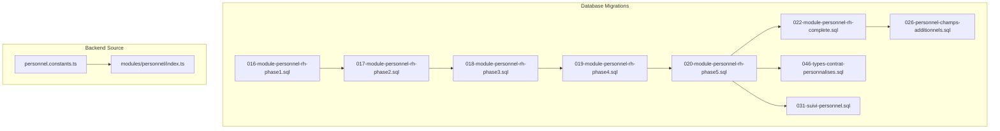
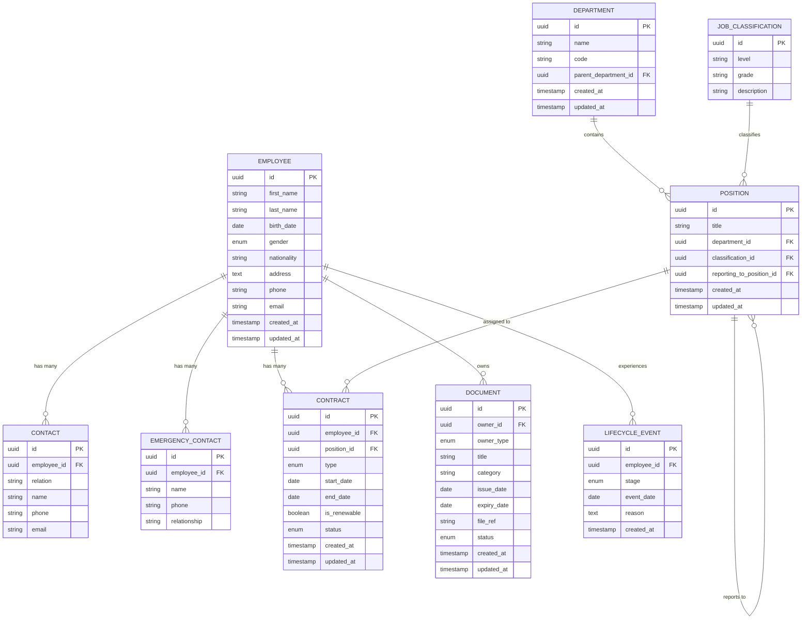
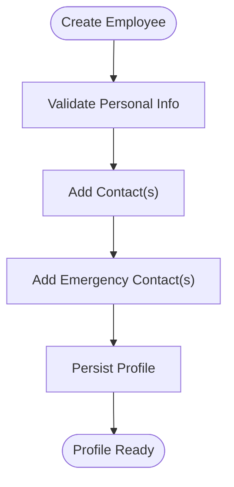
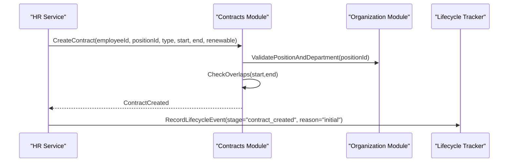
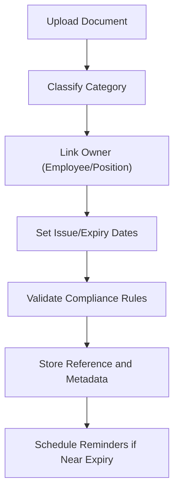
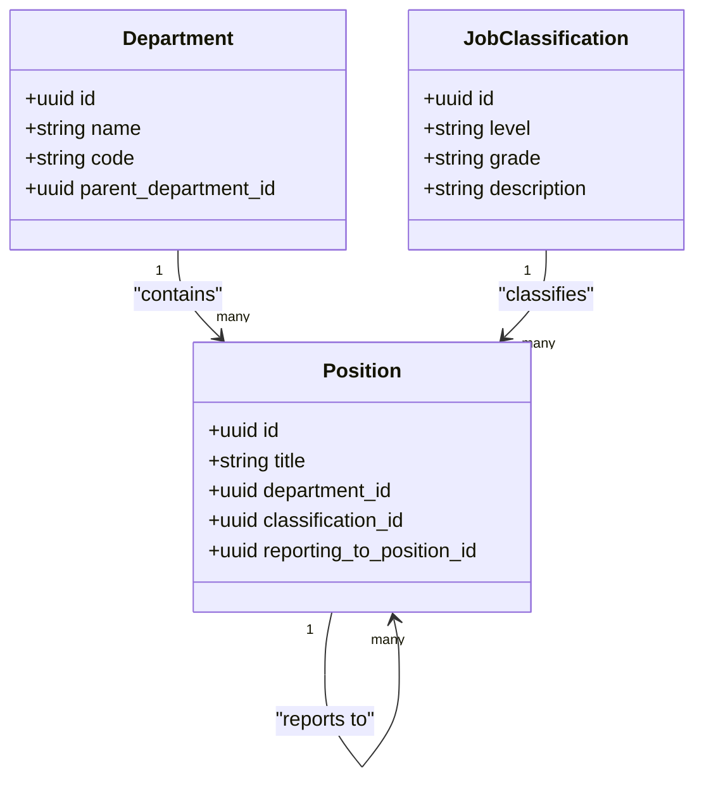
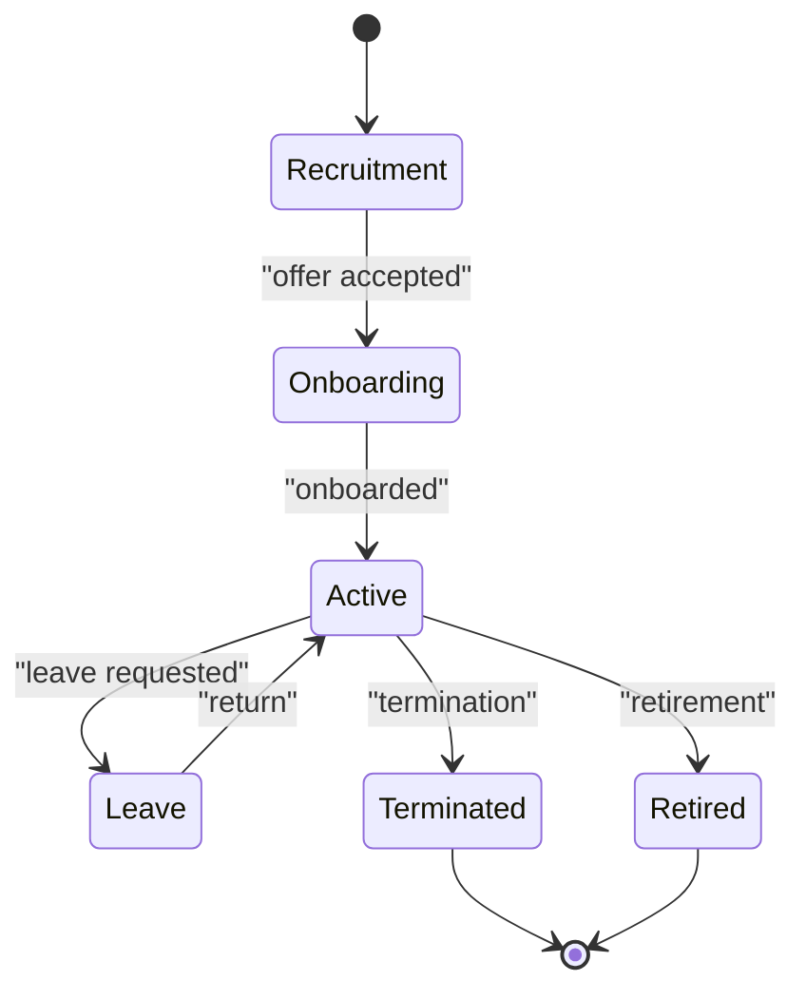
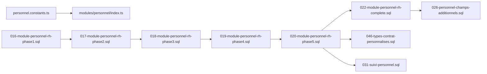

# Personnel Administration Entities

<cite>
**Referenced Files in This Document**
- [016-module-personnel-rh-phase1.sql](file://backend/database/migrations/016-module-personnel-rh-phase1.sql)
- [017-module-personnel-rh-phase2.sql](file://backend/database/migrations/017-module-personnel-rh-phase2.sql)
- [018-module-personnel-rh-phase3.sql](file://backend/database/migrations/018-module-personnel-rh-phase3.sql)
- [019-module-personnel-rh-phase4.sql](file://backend/database/migrations/019-module-personnel-rh-phase4.sql)
- [020-module-personnel-rh-phase5.sql](file://backend/database/migrations/020-module-personnel-rh-phase5.sql)
- [022-module-personnel-rh-complete.sql](file://backend/database/migrations/022-module-personnel-rh-complete.sql)
- [026-personnel-champs-additionnels.sql](file://backend/database/migrations/026-personnel-champs-additionnels.sql)
- [046-types-contrat-personnalises.sql](file://backend/database/migrations/046-types-contrat-personnalises.sql)
- [031-suivi-personnel.sql](file://backend/database/migrations/031-suivi-personnel.sql)
- [personnel.constants.ts](file://backend/src/shared/constants/personnel.constants.ts)
- [index.ts](file://backend/src/modules/personnel/index.ts)
</cite>

## Table of Contents
1. [Introduction](#introduction)
2. [Project Structure](#project-structure)
3. [Core Components](#core-components)
4. [Architecture Overview](#architecture-overview)
5. [Detailed Component Analysis](#detailed-component-analysis)
6. [Dependency Analysis](#dependency-analysis)
7. [Performance Considerations](#performance-considerations)
8. [Troubleshooting Guide](#troubleshooting-guide)
9. [Conclusion](#conclusion)
10. [Appendices](#appendices)

## Introduction
This document provides a comprehensive data model for eLISAschool’s personnel administration entities. It covers employee profiles (personal information, contact details, emergency contacts), contract management (employment types, periods, renewals), document handling (certificates, licenses, compliance), organizational structure (positions, departments, reporting hierarchies, job classifications), and the employee lifecycle from recruitment to retirement with status tracking and workflow support. It also maps relationships between personnel records, contracts, documents, and organizational units, and includes entity diagrams illustrating the complete employee data model and business rules.

## Project Structure
The personnel module is implemented across multiple database migrations that progressively define tables, constraints, indexes, and relationships. Supporting TypeScript constants provide shared enumerations and defaults used by services and controllers. The module entry point aggregates routes and services for the personnel domain.

**Diagram sources**
- [016-module-personnel-rh-phase1.sql](file://backend/database/migrations/016-module-personnel-rh-phase1.sql)
- [017-module-personnel-rh-phase2.sql](file://backend/database/migrations/017-module-personnel-rh-phase2.sql)
- [018-module-personnel-rh-phase3.sql](file://backend/database/migrations/018-module-personnel-rh-phase3.sql)
- [019-module-personnel-rh-phase4.sql](file://backend/database/migrations/019-module-personnel-rh-phase4.sql)
- [020-module-personnel-rh-phase5.sql](file://backend/database/migrations/020-module-personnel-rh-phase5.sql)
- [022-module-personnel-rh-complete.sql](file://backend/database/migrations/022-module-personnel-rh-complete.sql)
- [026-personnel-champs-additionnels.sql](file://backend/database/migrations/026-personnel-champs-additionnels.sql)
- [046-types-contrat-personnalises.sql](file://backend/database/migrations/046-types-contrat-personnalises.sql)
- [031-suivi-personnel.sql](file://backend/database/migrations/031-suivi-personnel.sql)
- [personnel.constants.ts](file://backend/src/shared/constants/personnel.constants.ts)
- [index.ts](file://backend/src/modules/personnel/index.ts)

**Section sources**
- [016-module-personnel-rh-phase1.sql](file://backend/database/migrations/016-module-personnel-rh-phase1.sql)
- [017-module-personnel-rh-phase2.sql](file://backend/database/migrations/017-module-personnel-rh-phase2.sql)
- [018-module-personnel-rh-phase3.sql](file://backend/database/migrations/018-module-personnel-rh-phase3.sql)
- [019-module-personnel-rh-phase4.sql](file://backend/database/migrations/019-module-personnel-rh-phase4.sql)
- [020-module-personnel-rh-phase5.sql](file://backend/database/migrations/020-module-personnel-rh-phase5.sql)
- [022-module-personnel-rh-complete.sql](file://backend/database/migrations/022-module-personnel-rh-complete.sql)
- [026-personnel-champs-additionnels.sql](file://backend/database/migrations/026-personnel-champs-additionnels.sql)
- [046-types-contrat-personnalises.sql](file://backend/database/migrations/046-types-contrat-personnalises.sql)
- [031-suivi-personnel.sql](file://backend/database/migrations/031-suivi-personnel.sql)
- [personnel.constants.ts](file://backend/src/shared/constants/personnel.constants.ts)
- [index.ts](file://backend/src/modules/personnel/index.ts)

## Core Components
- Employee Profile: Stores personal identification, demographic attributes, contact details, and emergency contacts. Includes fields such as full name, date of birth, gender, nationality, address, phone, email, and emergency contact information.
- Contract Management: Tracks employment contracts with type, start/end dates, renewal flags, and status. Supports custom contract types via configuration.
- Document Handling: Manages certificates, licenses, and compliance files linked to employees or positions, including metadata like validity dates and attachment references.
- Organizational Structure: Defines departments, positions, job classifications, and reporting hierarchies. Employees are assigned to positions within departments, enabling clear reporting lines.
- Lifecycle Tracking: Records recruitment stages, onboarding, active service, leave, termination, and retirement events with timestamps and reasons.

Key responsibilities:
- Maintain authoritative employee master data.
- Enforce contract period integrity and renewal workflows.
- Ensure document validity and compliance checks.
- Support hierarchical reporting and position-based permissions.
- Provide auditability across lifecycle transitions.

**Section sources**
- [016-module-personnel-rh-phase1.sql](file://backend/database/migrations/016-module-personnel-rh-phase1.sql)
- [017-module-personnel-rh-phase2.sql](file://backend/database/migrations/017-module-personnel-rh-phase2.sql)
- [018-module-personnel-rh-phase3.sql](file://backend/database/migrations/018-module-personnel-rh-phase3.sql)
- [019-module-personnel-rh-phase4.sql](file://backend/database/migrations/019-module-personnel-rh-phase4.sql)
- [020-module-personnel-rh-phase5.sql](file://backend/database/migrations/020-module-personnel-rh-phase5.sql)
- [022-module-personnel-rh-complete.sql](file://backend/database/migrations/022-module-personnel-rh-complete.sql)
- [026-personnel-champs-additionnels.sql](file://backend/database/migrations/026-personnel-champs-additionnels.sql)
- [046-types-contrat-personnalises.sql](file://backend/database/migrations/046-types-contrat-personnalises.sql)
- [031-suivi-personnel.sql](file://backend/database/migrations/031-suivi-personnel.sql)

## Architecture Overview
The personnel data model spans several interconnected entities:
- Employee: Central identity and profile record.
- Contact and EmergencyContact: Linked to Employee for communication and safety.
- Contract: Employment terms tied to Employee and Position.
- Document: Certificates/licenses/compliance artifacts linked to Employee or Position.
- Department, Position, JobClassification: Organizational constructs defining roles and reporting.
- LifecycleEvent: Audit trail of recruitment, onboarding, active, leave, termination, retirement.

**Diagram sources**
- [016-module-personnel-rh-phase1.sql](file://backend/database/migrations/016-module-personnel-rh-phase1.sql)
- [017-module-personnel-rh-phase2.sql](file://backend/database/migrations/017-module-personnel-rh-phase2.sql)
- [018-module-personnel-rh-phase3.sql](file://backend/database/migrations/018-module-personnel-rh-phase3.sql)
- [019-module-personnel-rh-phase4.sql](file://backend/database/migrations/019-module-personnel-rh-phase4.sql)
- [020-module-personnel-rh-phase5.sql](file://backend/database/migrations/020-module-personnel-rh-phase5.sql)
- [022-module-personnel-rh-complete.sql](file://backend/database/migrations/022-module-personnel-rh-complete.sql)
- [026-personnel-champs-additionnels.sql](file://backend/database/migrations/026-personnel-champs-additionnels.sql)
- [046-types-contrat-personnalises.sql](file://backend/database/migrations/046-types-contrat-personnalises.sql)
- [031-suivi-personnel.sql](file://backend/database/migrations/031-suivi-personnel.sql)

## Detailed Component Analysis

### Employee Profile Management
- Personal Information: Unique identifier, names, date of birth, gender, nationality, and address. These fields form the core identity and are referenced by other modules.
- Contact Details: Separate table for flexible multi-value contact entries (e.g., mobile, home, work) with relation labels.
- Emergency Contacts: Dedicated table for immediate family or designated persons, ensuring quick access during incidents.

Business rules:
- Each employee must have at least one primary contact method.
- Emergency contact phone numbers should be validated for format.
- Duplicate contact entries per relation type should be prevented.

**Section sources**
- [016-module-personnel-rh-phase1.sql](file://backend/database/migrations/016-module-personnel-rh-phase1.sql)
- [017-module-personnel-rh-phase2.sql](file://backend/database/migrations/017-module-personnel-rh-phase2.sql)
- [026-personnel-champs-additionnels.sql](file://backend/database/migrations/026-personnel-champs-additionnels.sql)

### Contract Management
- Contract Types: Enumerated base types with extensibility for custom types via configuration migration.
- Periods: Start and end dates enforce temporal validity; overlapping contracts for the same employee-position pair are constrained.
- Renewal Tracking: Boolean flag indicates renewability; lifecycle events capture renewal actions and approvals.

Business rules:
- A contract cannot end before it starts.
- Active contracts must not overlap unless explicitly allowed by policy.
- Renewal requires an approval event recorded in lifecycle tracking.

**Diagram sources**
- [019-module-personnel-rh-phase4.sql](file://backend/database/migrations/019-module-personnel-rh-phase4.sql)
- [020-module-personnel-rh-phase5.sql](file://backend/database/migrations/020-module-personnel-rh-phase5.sql)
- [046-types-contrat-personnalises.sql](file://backend/database/migrations/046-types-contrat-personnalises.sql)
- [031-suivi-personnel.sql](file://backend/database/migrations/031-suivi-personnel.sql)

**Section sources**
- [019-module-personnel-rh-phase4.sql](file://backend/database/migrations/019-module-personnel-rh-phase4.sql)
- [020-module-personnel-rh-phase5.sql](file://backend/database/migrations/020-module-personnel-rh-phase5.sql)
- [046-types-contrat-personnalises.sql](file://backend/database/migrations/046-types-contrat-personnalises.sql)
- [031-suivi-personnel.sql](file://backend/database/migrations/031-suivi-personnel.sql)

### Document Handling
- Categories: Certificates, licenses, compliance files, and training records.
- Ownership: Documents can be owned by an employee or a position (for role-specific requirements).
- Validity: Issue and expiry dates enable automated reminders and compliance checks.

Business rules:
- Expiry dates must be after issue dates.
- Compliance documents require mandatory status updates upon renewal.
- File references should be immutable once attached; replacements create new versions.

**Section sources**
- [018-module-personnel-rh-phase3.sql](file://backend/database/migrations/018-module-personnel-rh-phase3.sql)
- [022-module-personnel-rh-complete.sql](file://backend/database/migrations/022-module-personnel-rh-complete.sql)

### Organizational Structure
- Departments: Hierarchical organization units with optional parent-child relationships.
- Positions: Role definitions within departments, classified by job classification levels.
- Reporting Hierarchy: Positions can report to other positions, forming chains of command.
- Job Classifications: Standardized levels and grades to align compensation and career paths.

Business rules:
- Circular reporting must be prevented.
- A position belongs to exactly one department.
- Job classification levels should be consistent across departments.

**Diagram sources**
- [016-module-personnel-rh-phase1.sql](file://backend/database/migrations/016-module-personnel-rh-phase1.sql)
- [017-module-personnel-rh-phase2.sql](file://backend/database/migrations/017-module-personnel-rh-phase2.sql)
- [022-module-personnel-rh-complete.sql](file://backend/database/migrations/022-module-personnel-rh-complete.sql)

**Section sources**
- [016-module-personnel-rh-phase1.sql](file://backend/database/migrations/016-module-personnel-rh-phase1.sql)
- [017-module-personnel-rh-phase2.sql](file://backend/database/migrations/017-module-personnel-rh-phase2.sql)
- [022-module-personnel-rh-complete.sql](file://backend/database/migrations/022-module-personnel-rh-complete.sql)

### Employee Lifecycle
Stages include recruitment, onboarding, active service, leave, termination, and retirement. Each transition is recorded with timestamps and reasons for auditability.

**Diagram sources**
- [031-suivi-personnel.sql](file://backend/database/migrations/031-suivi-personnel.sql)

**Section sources**
- [031-suivi-personnel.sql](file://backend/database/migrations/031-suivi-personnel.sql)

## Dependency Analysis
The personnel data model depends on shared constants for enums and defaults, and the module index aggregates endpoints and services. Migrations build incrementally, with later phases adding constraints and relationships.

**Diagram sources**
- [personnel.constants.ts](file://backend/src/shared/constants/personnel.constants.ts)
- [index.ts](file://backend/src/modules/personnel/index.ts)
- [016-module-personnel-rh-phase1.sql](file://backend/database/migrations/016-module-personnel-rh-phase1.sql)
- [017-module-personnel-rh-phase2.sql](file://backend/database/migrations/017-module-personnel-rh-phase2.sql)
- [018-module-personnel-rh-phase3.sql](file://backend/database/migrations/018-module-personnel-rh-phase3.sql)
- [019-module-personnel-rh-phase4.sql](file://backend/database/migrations/019-module-personnel-rh-phase4.sql)
- [020-module-personnel-rh-phase5.sql](file://backend/database/migrations/020-module-personnel-rh-phase5.sql)
- [022-module-personnel-rh-complete.sql](file://backend/database/migrations/022-module-personnel-rh-complete.sql)
- [026-personnel-champs-additionnels.sql](file://backend/database/migrations/026-personnel-champs-additionnels.sql)
- [046-types-contrat-personnalises.sql](file://backend/database/migrations/046-types-contrat-personnalises.sql)
- [031-suivi-personnel.sql](file://backend/database/migrations/031-suivi-personnel.sql)

**Section sources**
- [personnel.constants.ts](file://backend/src/shared/constants/personnel.constants.ts)
- [index.ts](file://backend/src/modules/personnel/index.ts)
- [016-module-personnel-rh-phase1.sql](file://backend/database/migrations/016-module-personnel-rh-phase1.sql)
- [017-module-personnel-rh-phase2.sql](file://backend/database/migrations/017-module-personnel-rh-phase2.sql)
- [018-module-personnel-rh-phase3.sql](file://backend/database/migrations/018-module-personnel-rh-phase3.sql)
- [019-module-personnel-rh-phase4.sql](file://backend/database/migrations/019-module-personnel-rh-phase4.sql)
- [020-module-personnel-rh-phase5.sql](file://backend/database/migrations/020-module-personnel-rh-phase5.sql)
- [022-module-personnel-rh-complete.sql](file://backend/database/migrations/022-module-personnel-rh-complete.sql)
- [026-personnel-champs-additionnels.sql](file://backend/database/migrations/026-personnel-champs-additionnels.sql)
- [046-types-contrat-personnalises.sql](file://backend/database/migrations/046-types-contrat-personnalises.sql)
- [031-suivi-personnel.sql](file://backend/database/migrations/031-suivi-personnel.sql)

## Performance Considerations
- Indexing: Ensure foreign keys and frequently filtered columns (e.g., contract status, document expiry, lifecycle stage) are indexed to optimize queries.
- Partitioning: For large datasets, consider partitioning lifecycle events and documents by date ranges.
- Caching: Cache organizational hierarchy lookups and job classifications to reduce repeated joins.
- Validation: Perform server-side validation early to avoid expensive operations on invalid inputs.

[No sources needed since this section provides general guidance]

## Troubleshooting Guide
Common issues and resolutions:
- Overlapping Contracts: Validate start/end dates and enforce non-overlap constraints. Review contract creation logs and adjust policies if exceptions are required.
- Missing Reports: Verify reporting hierarchy does not contain cycles; use traversal checks when assigning reporting positions.
- Expired Documents: Implement scheduled jobs to scan for near-expiry documents and trigger notifications.
- Lifecycle Inconsistencies: Ensure every state transition records a corresponding lifecycle event with reason and timestamp.

**Section sources**
- [019-module-personnel-rh-phase4.sql](file://backend/database/migrations/019-module-personnel-rh-phase4.sql)
- [020-module-personnel-rh-phase5.sql](file://backend/database/migrations/020-module-personnel-rh-phase5.sql)
- [031-suivi-personnel.sql](file://backend/database/migrations/031-suivi-personnel.sql)

## Conclusion
The personnel administration data model in eLISAschool provides a robust foundation for managing employee profiles, contracts, documents, and organizational structures while supporting lifecycle tracking and compliance. The incremental migration strategy ensures clarity and maintainability, and the relationships defined across entities enable complex reporting and workflow automation. Adhering to the business rules outlined here will help maintain data integrity and operational efficiency.

[No sources needed since this section summarizes without analyzing specific files]

## Appendices
- Shared Constants: Refer to personnel constants for enumerations and default values used across services.
- Module Entry Point: The personnel module index aggregates routes and services for cohesive API exposure.

**Section sources**
- [personnel.constants.ts](file://backend/src/shared/constants/personnel.constants.ts)
- [index.ts](file://backend/src/modules/personnel/index.ts)