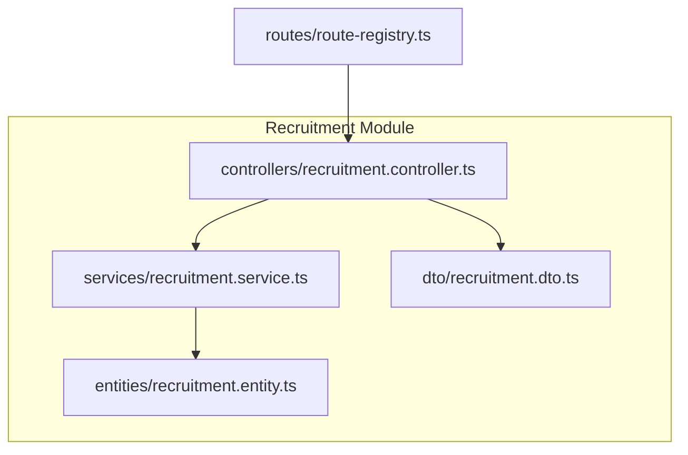
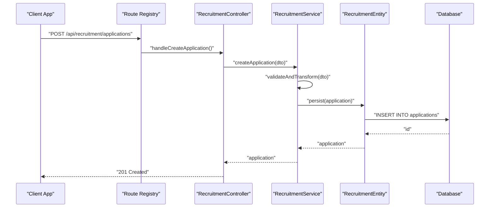
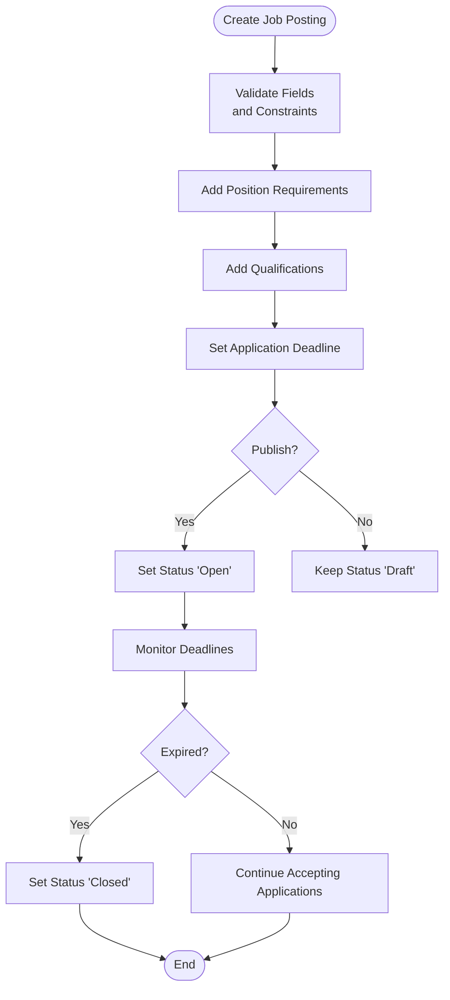
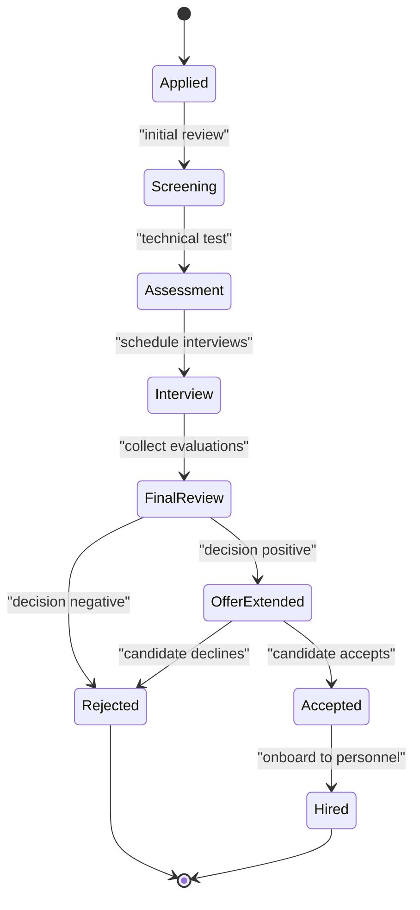
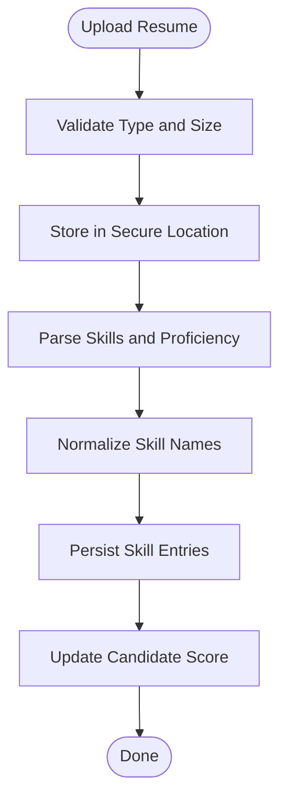
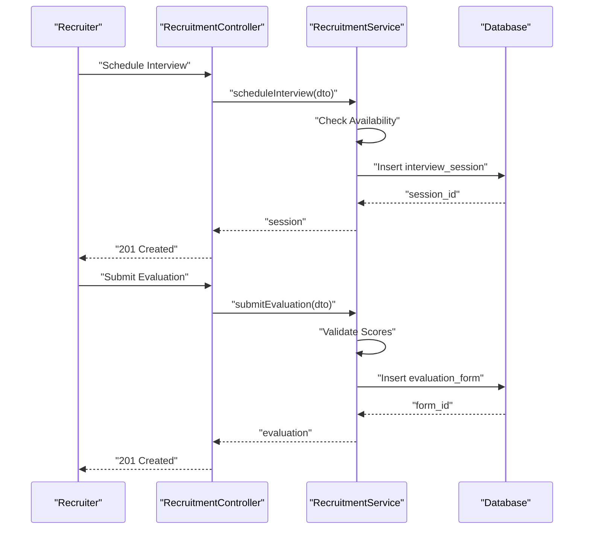
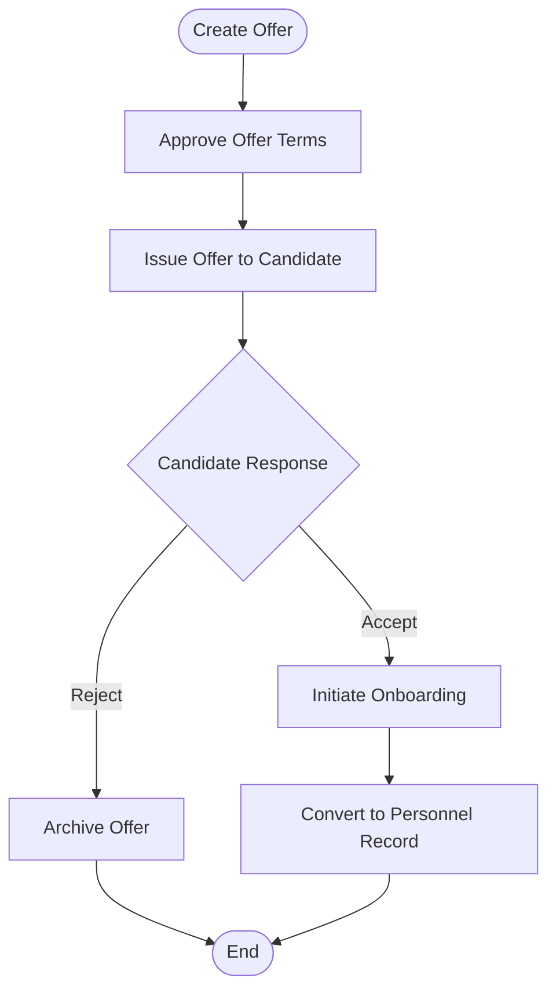
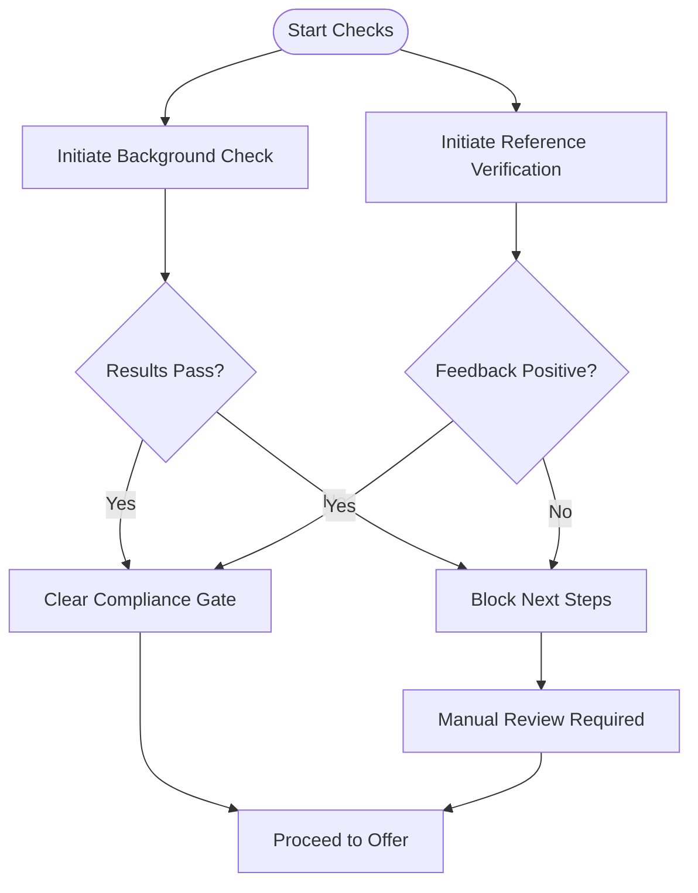
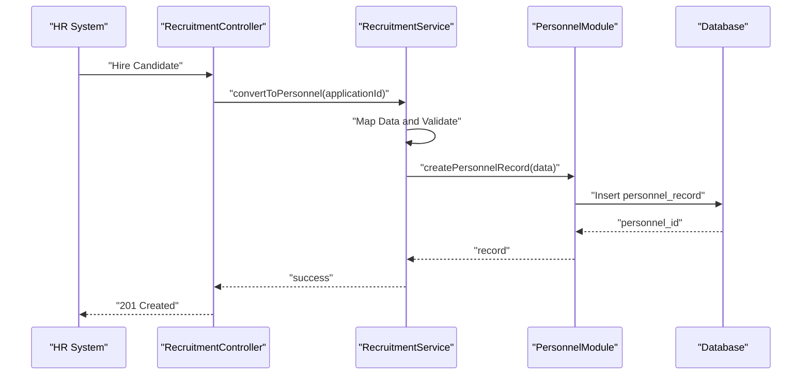
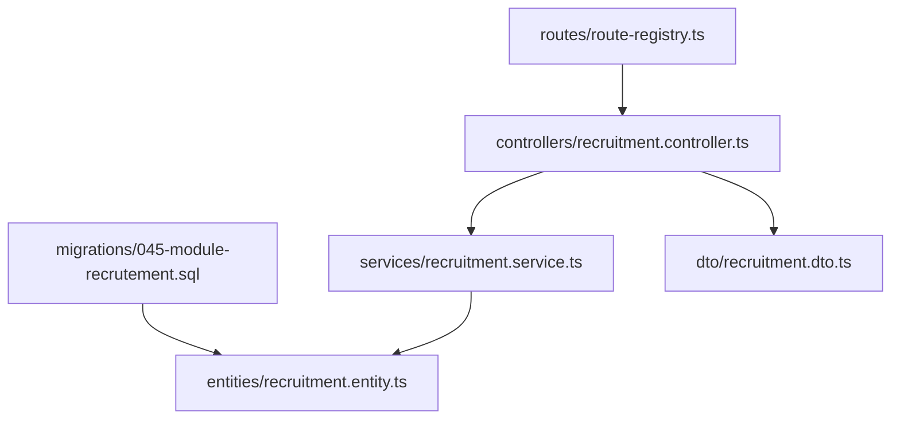

# Recruitment Workflow Entities

<cite>
**Referenced Files in This Document**
- [045-module-recrutement.sql](file://backend/database/migrations/045-module-recrutement.sql)
- [recruitment.controller.ts](file://backend/src/modules/recrutement/controllers/recruitment.controller.ts)
- [recruitment.service.ts](file://backend/src/modules/recrutement/services/recruitment.service.ts)
- [recruitment.entity.ts](file://backend/src/modules/recrutement/entities/recruitment.entity.ts)
- [recruitment.dto.ts](file://backend/src/modules/recrutement/dto/recruitment.dto.ts)
- [route-registry.ts](file://backend/src/routes/route-registry.ts)
</cite>

## Table of Contents
1. [Introduction](#introduction)
2. [Project Structure](#project-structure)
3. [Core Components](#core-components)
4. [Architecture Overview](#architecture-overview)
5. [Detailed Component Analysis](#detailed-component-analysis)
6. [Dependency Analysis](#dependency-analysis)
7. [Performance Considerations](#performance-considerations)
8. [Troubleshooting Guide](#troubleshooting-guide)
9. [Conclusion](#conclusion)

## Introduction
This document provides comprehensive data model documentation for eLISAschool’s recruitment workflow entities. It covers job posting management, candidate tracking through the hiring pipeline, resume management with document storage and scoring, interview scheduling and evaluations, offer management including compensation and acceptance/rejection handling, background checks and reference verification, and compliance requirements. It also maps entity relationships across the complete lifecycle from job posting to successful hire integration into personnel records.

## Project Structure
The recruitment module is implemented as a feature module under backend/src/modules/recrutement with standard layers: controllers, services, entities, DTOs, and routes. The database schema is defined by a dedicated migration file. Routes are registered centrally.



**Diagram sources**
- [recruitment.controller.ts](file://backend/src/modules/recrutement/controllers/recruitment.controller.ts)
- [recruitment.service.ts](file://backend/src/modules/recrutement/services/recruitment.service.ts)
- [recruitment.entity.ts](file://backend/src/modules/recrutement/entities/recruitment.entity.ts)
- [recruitment.dto.ts](file://backend/src/modules/recrutement/dto/recruitment.dto.ts)
- [route-registry.ts](file://backend/src/routes/route-registry.ts)

**Section sources**
- [045-module-recrutement.sql](file://backend/database/migrations/045-module-recrutement.sql)
- [recruitment.controller.ts](file://backend/src/modules/recrutement/controllers/recruitment.controller.ts)
- [recruitment.service.ts](file://backend/src/modules/recrutement/services/recruitment.service.ts)
- [recruitment.entity.ts](file://backend/src/modules/recrutement/entities/recruitment.entity.ts)
- [recruitment.dto.ts](file://backend/src/modules/recrutement/dto/recruitment.dto.ts)
- [route-registry.ts](file://backend/src/routes/route-registry.ts)

## Core Components
- Job Posting Management
  - Position requirements, qualifications, application deadlines, status transitions, and approval workflows.
- Candidate Tracking
  - Application intake, stage progression (screening, interviews, assessments), notes, and audit trail.
- Resume Management
  - Document storage references, skill parsing metadata, and candidate scoring inputs.
- Interview Scheduling and Evaluation
  - Interview sessions, participants, schedules, evaluation forms, and outcomes.
- Offer Management
  - Compensation packages, terms, acceptance/rejection decisions, and countersignatures.
- Background Checks and References
  - Verification tasks, results, and compliance flags.
- Integration with Personnel
  - Conversion of hired candidates into personnel records with role assignment and onboarding steps.

**Section sources**
- [045-module-recrutement.sql](file://backend/database/migrations/045-module-recrutement.sql)
- [recruitment.entity.ts](file://backend/src/modules/recrutement/entities/recruitment.entity.ts)
- [recruitment.service.ts](file://backend/src/modules/recrutement/services/recruitment.service.ts)

## Architecture Overview
The recruitment workflow follows a layered architecture:
- Controllers expose REST endpoints for job postings, applications, interviews, offers, and related operations.
- Services encapsulate business logic, orchestrate state transitions, and enforce validation and compliance rules.
- Entities define the persistent data model aligned with the database schema.
- DTOs validate and transform request/response payloads.
- Routes register endpoints centrally.



**Diagram sources**
- [route-registry.ts](file://backend/src/routes/route-registry.ts)
- [recruitment.controller.ts](file://backend/src/modules/recrutement/controllers/recruitment.controller.ts)
- [recruitment.service.ts](file://backend/src/modules/recrutement/services/recruitment.service.ts)
- [recruitment.entity.ts](file://backend/src/modules/recrutement/entities/recruitment.entity.ts)
- [045-module-recrutement.sql](file://backend/database/migrations/045-module-recrutement.sql)

## Detailed Component Analysis

### Data Model Overview
The recruitment data model centers around job postings, applications, resumes, interviews, evaluations, offers, background checks, and references. These entities support the full lifecycle from requisition to hire.

```mermaid
erDiagram
JOB_POSTING {
uuid id PK
string title
text description
enum status
date deadline
uuid department_id FK
timestamp created_at
timestamp updated_at
}
POSITION_REQUIREMENT {
uuid id PK
uuid job_posting_id FK
text requirement
enum priority
}
QUALIFICATION {
uuid id PK
uuid job_posting_id FK
text qualification
enum level
}
APPLICATION {
uuid id PK
uuid job_posting_id FK
uuid candidate_id FK
enum status
jsonb skills
decimal score
timestamp applied_at
timestamp updated_at
}
RESUME_DOCUMENT {
uuid id PK
uuid application_id FK
string filename
string storage_path
string mime_type
int size_bytes
timestamp uploaded_at
}
SKILL_ENTRY {
uuid id PK
uuid application_id FK
string name
enum proficiency
timestamp parsed_at
}
INTERVIEW_SESSION {
uuid id PK
uuid application_id FK
datetime scheduled_at
enum status
uuid interviewer_id FK
}
EVALUATION_FORM {
uuid id PK
uuid interview_session_id FK
jsonb scores
text comments
timestamp evaluated_at
}
OFFER {
uuid id PK
uuid application_id FK
enum status
jsonb compensation
text terms
timestamp issued_at
timestamp accepted_at
timestamp rejected_at
}
BACKGROUND_CHECK {
uuid id PK
uuid application_id FK
enum type
enum status
jsonb results
timestamp completed_at
}
REFERENCE_VERIFICATION {
uuid id PK
uuid application_id FK
string contact_name
string contact_email
enum status
jsonb feedback
timestamp verified_at
}
PERSONNEL_RECORD {
uuid id PK
uuid candidate_id FK
string employee_code
enum employment_status
timestamp hired_at
}
JOB_POSTING ||--o{ POSITION_REQUIREMENT : "has many"
JOB_POSTING ||--o{ QUALIFICATION : "has many"
JOB_POSTING ||--o{ APPLICATION : "receives"
APPLICATION ||--o{ RESUME_DOCUMENT : "includes"
APPLICATION ||--o{ SKILL_ENTRY : "parsed"
APPLICATION ||--o{ INTERVIEW_SESSION : "scheduled"
INTERVIEW_SESSION ||--o{ EVALUATION_FORM : "evaluated"
APPLICATION ||--o{ OFFER : "issued"
APPLICATION ||--o{ BACKGROUND_CHECK : "required"
APPLICATION ||--o{ REFERENCE_VERIFICATION : "verified"
APPLICATION --|| PERSONNEL_RECORD : "converted upon hire"
```

**Diagram sources**
- [045-module-recrutement.sql](file://backend/database/migrations/045-module-recrutement.sql)

**Section sources**
- [045-module-recrutement.sql](file://backend/database/migrations/045-module-recrutement.sql)

### Job Posting Management
- Responsibilities
  - Create, update, publish, and archive job postings.
  - Manage position requirements and qualifications linked to each posting.
  - Enforce application deadlines and status transitions (draft, open, closed).
- Key Entities
  - job_posting, position_requirement, qualification.
- Processing Logic
  - Validation of required fields and constraints.
  - Deadline enforcement and automatic status updates when expired.
  - Approval workflow hooks before publishing.



**Diagram sources**
- [recruitment.service.ts](file://backend/src/modules/recrutement/services/recruitment.service.ts)
- [recruitment.entity.ts](file://backend/src/modules/recrutement/entities/recruitment.entity.ts)
- [045-module-recrutement.sql](file://backend/database/migrations/045-module-recrutement.sql)

**Section sources**
- [recruitment.controller.ts](file://backend/src/modules/recrutement/controllers/recruitment.controller.ts)
- [recruitment.service.ts](file://backend/src/modules/recrutement/services/recruitment.service.ts)
- [recruitment.entity.ts](file://backend/src/modules/recrutement/entities/recruitment.entity.ts)
- [045-module-recrutement.sql](file://backend/database/migrations/045-module-recrutement.sql)

### Candidate Tracking Through Hiring Pipeline
- Responsibilities
  - Intake applications, assign stages, track progress, and maintain notes.
  - Support multi-stage pipelines: screening, technical assessment, interviews, final review.
- Key Entities
  - application with status and score fields; optional notes and audit entries.
- Processing Logic
  - Stage transitions validated against allowed moves.
  - Score aggregation from evaluations and skill parsing.
  - Audit logging for compliance.



**Diagram sources**
- [recruitment.service.ts](file://backend/src/modules/recrutement/services/recruitment.service.ts)
- [recruitment.entity.ts](file://backend/src/modules/recrutement/entities/recruitment.entity.ts)
- [045-module-recrutement.sql](file://backend/database/migrations/045-module-recrutement.sql)

**Section sources**
- [recruitment.controller.ts](file://backend/src/modules/recrutement/controllers/recruitment.controller.ts)
- [recruitment.service.ts](file://backend/src/modules/recrutement/services/recruitment.service.ts)
- [recruitment.entity.ts](file://backend/src/modules/recrutement/entities/recruitment.entity.ts)
- [045-module-recrutement.sql](file://backend/database/migrations/045-module-recrutement.sql)

### Resume Management: Storage, Skill Parsing, Scoring
- Responsibilities
  - Upload and store resume documents with metadata.
  - Parse skills and proficiency levels from resumes.
  - Compute or aggregate candidate scores based on parsed skills and evaluations.
- Key Entities
  - resume_document, skill_entry, application.score.
- Processing Logic
  - File validation (type, size), secure storage path generation.
  - Skill extraction via parser service; normalization of skill names.
  - Scoring rules combining parsed skills and interview evaluations.



**Diagram sources**
- [recruitment.service.ts](file://backend/src/modules/recrutement/services/recruitment.service.ts)
- [recruitment.entity.ts](file://backend/src/modules/recrutement/entities/recruitment.entity.ts)
- [045-module-recrutement.sql](file://backend/database/migrations/045-module-recrutement.sql)

**Section sources**
- [recruitment.controller.ts](file://backend/src/modules/recrutement/controllers/recruitment.controller.ts)
- [recruitment.service.ts](file://backend/src/modules/recrutement/services/recruitment.service.ts)
- [recruitment.entity.ts](file://backend/src/modules/recrutement/entities/recruitment.entity.ts)
- [045-module-recrutement.sql](file://backend/database/migrations/045-module-recrutement.sql)

### Interview Scheduling and Evaluation Forms
- Responsibilities
  - Schedule interviews with interviewers and time slots.
  - Capture structured evaluation forms with scores and comments.
  - Aggregate evaluation outcomes to inform decision-making.
- Key Entities
  - interview_session, evaluation_form.
- Processing Logic
  - Conflict detection for interviewer availability.
  - Form validation and mandatory fields enforcement.
  - Decision thresholds based on evaluation scores.



**Diagram sources**
- [recruitment.controller.ts](file://backend/src/modules/recrutement/controllers/recruitment.controller.ts)
- [recruitment.service.ts](file://backend/src/modules/recrutement/services/recruitment.service.ts)
- [recruitment.entity.ts](file://backend/src/modules/recrutement/entities/recruitment.entity.ts)
- [045-module-recrutement.sql](file://backend/database/migrations/045-module-recrutement.sql)

**Section sources**
- [recruitment.controller.ts](file://backend/src/modules/recrutement/controllers/recruitment.controller.ts)
- [recruitment.service.ts](file://backend/src/modules/recrutement/services/recruitment.service.ts)
- [recruitment.entity.ts](file://backend/src/modules/recrutement/entities/recruitment.entity.ts)
- [045-module-recrutement.sql](file://backend/database/migrations/045-module-recrutement.sql)

### Offer Management: Compensation, Acceptance, Rejection
- Responsibilities
  - Generate offers with compensation details and terms.
  - Track acceptance or rejection responses.
  - Trigger onboarding workflows upon acceptance.
- Key Entities
  - offer with status, compensation JSON, timestamps for issuance/acceptance/rejection.
- Processing Logic
  - Offer approval workflow before issuance.
  - Conditional branching on candidate response.
  - Integration with personnel module to create records upon acceptance.



**Diagram sources**
- [recruitment.service.ts](file://backend/src/modules/recrutement/services/recruitment.service.ts)
- [recruitment.entity.ts](file://backend/src/modules/recrutement/entities/recruitment.entity.ts)
- [045-module-recrutement.sql](file://backend/database/migrations/045-module-recrutement.sql)

**Section sources**
- [recruitment.controller.ts](file://backend/src/modules/recrutement/controllers/recruitment.controller.ts)
- [recruitment.service.ts](file://backend/src/modules/recrutement/services/recruitment.service.ts)
- [recruitment.entity.ts](file://backend/src/modules/recrutement/entities/recruitment.entity.ts)
- [045-module-recrutement.sql](file://backend/database/migrations/045-module-recrutement.sql)

### Background Checks and Reference Verification
- Responsibilities
  - Initiate and manage background checks and reference verifications.
  - Record results and compliance flags.
  - Block offer issuance until checks pass.
- Key Entities
  - background_check, reference_verification.
- Processing Logic
  - Task creation and status tracking.
  - Result validation and compliance checks.
  - Dependency gates preventing next workflow steps until completion.



**Diagram sources**
- [recruitment.service.ts](file://backend/src/modules/recrutement/services/recruitment.service.ts)
- [recruitment.entity.ts](file://backend/src/modules/recrutement/entities/recruitment.entity.ts)
- [045-module-recrutement.sql](file://backend/database/migrations/045-module-recrutement.sql)

**Section sources**
- [recruitment.controller.ts](file://backend/src/modules/recrutement/controllers/recruitment.controller.ts)
- [recruitment.service.ts](file://backend/src/modules/recrutement/services/recruitment.service.ts)
- [recruitment.entity.ts](file://backend/src/modules/recrutement/entities/recruitment.entity.ts)
- [045-module-recrutement.sql](file://backend/database/migrations/045-module-recrutement.sql)

### Integration with Personnel Records
- Responsibilities
  - Convert accepted candidates into personnel records.
  - Assign roles and departments based on job posting.
  - Initialize onboarding tasks and access provisioning.
- Key Entities
  - personnel_record linked to candidate and job context.
- Processing Logic
  - Data mapping from application and offer to personnel fields.
  - Role assignment and permission initialization.
  - Audit logging for traceability.



**Diagram sources**
- [recruitment.controller.ts](file://backend/src/modules/recrutement/controllers/recruitment.controller.ts)
- [recruitment.service.ts](file://backend/src/modules/recrutement/services/recruitment.service.ts)
- [recruitment.entity.ts](file://backend/src/modules/recrutement/entities/recruitment.entity.ts)
- [045-module-recrutement.sql](file://backend/database/migrations/045-module-recrutement.sql)

**Section sources**
- [recruitment.controller.ts](file://backend/src/modules/recrutement/controllers/recruitment.controller.ts)
- [recruitment.service.ts](file://backend/src/modules/recrutement/services/recruitment.service.ts)
- [recruitment.entity.ts](file://backend/src/modules/recrutement/entities/recruitment.entity.ts)
- [045-module-recrutement.sql](file://backend/database/migrations/045-module-recrutement.sql)

## Dependency Analysis
The recruitment module depends on:
- Database schema defined by the recruitment migration.
- Central route registry for endpoint exposure.
- Shared types and constants if used by DTOs and services.



**Diagram sources**
- [045-module-recrutement.sql](file://backend/database/migrations/045-module-recrutement.sql)
- [recruitment.controller.ts](file://backend/src/modules/recrutement/controllers/recruitment.controller.ts)
- [recruitment.service.ts](file://backend/src/modules/recrutement/services/recruitment.service.ts)
- [recruitment.entity.ts](file://backend/src/modules/recrutement/entities/recruitment.entity.ts)
- [recruitment.dto.ts](file://backend/src/modules/recrutement/dto/recruitment.dto.ts)
- [route-registry.ts](file://backend/src/routes/route-registry.ts)

**Section sources**
- [045-module-recrutement.sql](file://backend/database/migrations/045-module-recrutement.sql)
- [route-registry.ts](file://backend/src/routes/route-registry.ts)
- [recruitment.controller.ts](file://backend/src/modules/recrutement/controllers/recruitment.controller.ts)
- [recruitment.service.ts](file://backend/src/modules/recrutement/services/recruitment.service.ts)
- [recruitment.entity.ts](file://backend/src/modules/recrutement/entities/recruitment.entity.ts)
- [recruitment.dto.ts](file://backend/src/modules/recrutement/dto/recruitment.dto.ts)

## Performance Considerations
- Indexing
  - Ensure indexes on foreign keys (job_posting_id, candidate_id, application_id) and frequently filtered columns (status, deadline).
- Query Optimization
  - Use pagination and selective field retrieval for listing applications and interviews.
- File Handling
  - Stream uploads and avoid loading large files into memory; store only metadata in DB.
- Scoring Computation
  - Cache computed scores and recompute incrementally on new evaluations or skill updates.
- Concurrency
  - Apply optimistic locking or versioning for concurrent updates to applications and offers.

[No sources needed since this section provides general guidance]

## Troubleshooting Guide
Common issues and resolutions:
- Missing Foreign Keys
  - Verify that all referenced IDs exist before creating dependent records (e.g., application.job_posting_id).
- Invalid State Transitions
  - Check allowed transitions in service logic; log detailed errors when invalid moves occur.
- File Upload Failures
  - Validate MIME types and sizes; ensure storage paths are writable and accessible.
- Evaluation Incompleteness
  - Enforce mandatory fields in evaluation forms; provide clear error messages.
- Compliance Blocks
  - Inspect background check and reference verification statuses; surface blockers in UI.

**Section sources**
- [recruitment.service.ts](file://backend/src/modules/recrutement/services/recruitment.service.ts)
- [recruitment.entity.ts](file://backend/src/modules/recrutement/entities/recruitment.entity.ts)
- [045-module-recrutement.sql](file://backend/database/migrations/045-module-recrutement.sql)

## Conclusion
The recruitment workflow in eLISAschool is modeled around robust entities supporting the entire hiring lifecycle. The layered architecture ensures clear separation of concerns, while the data model captures essential information for job postings, applications, resumes, interviews, offers, and compliance checks. Proper indexing, validation, and integration points enable efficient processing and reliable conversion to personnel records upon successful hires.