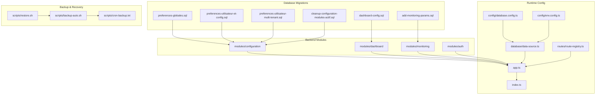
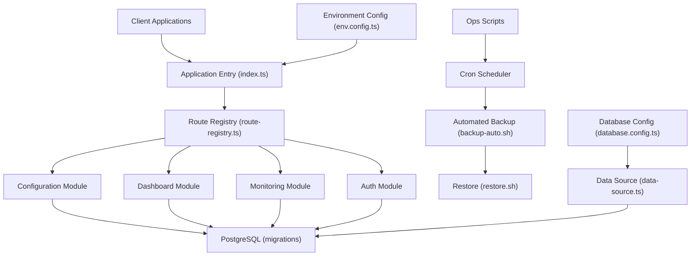
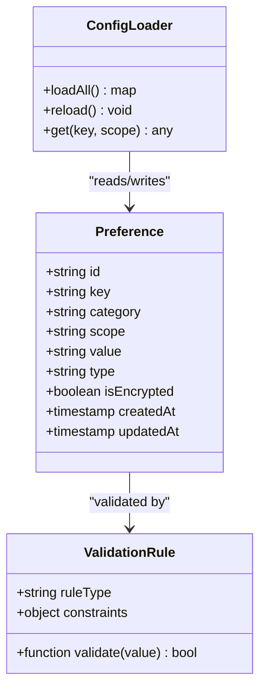
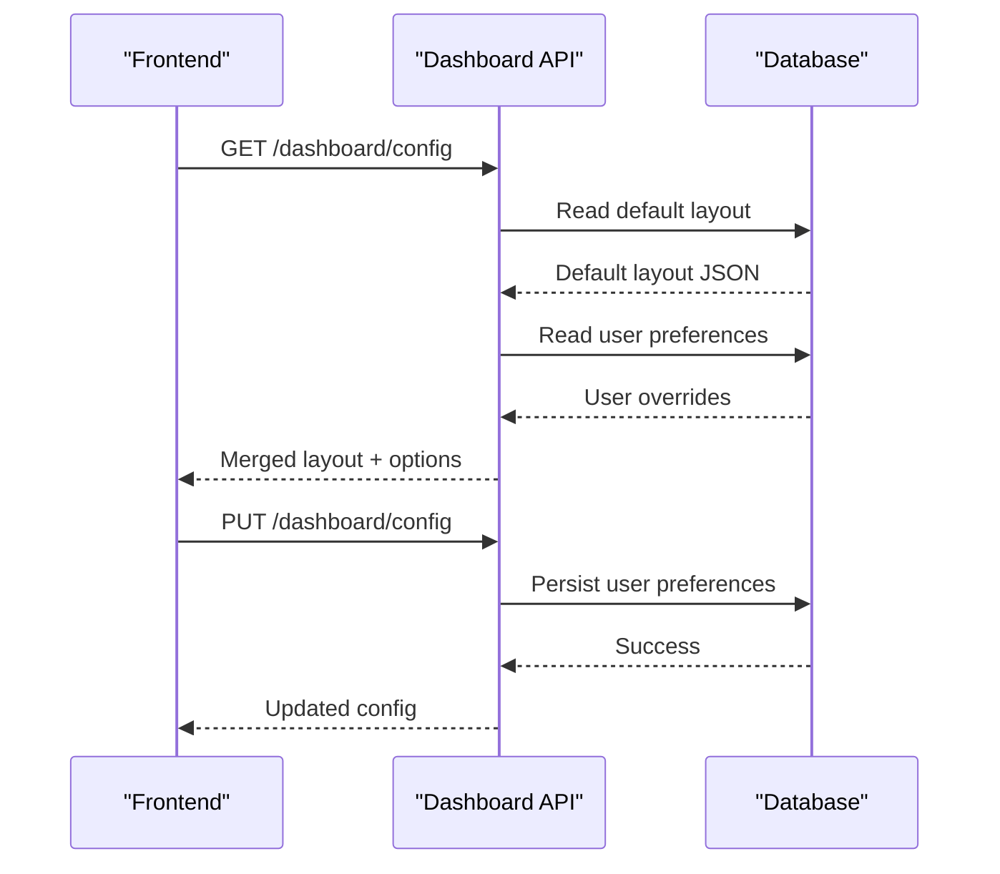
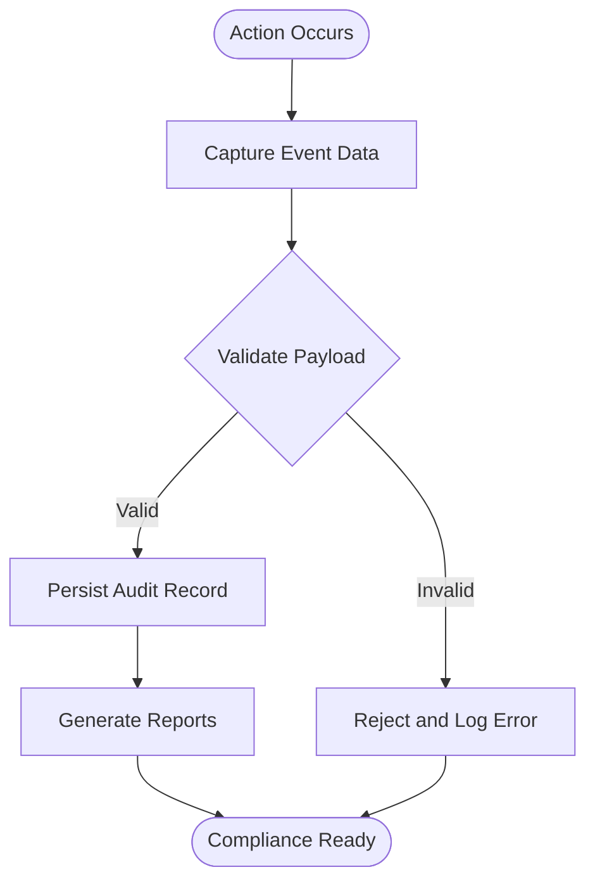
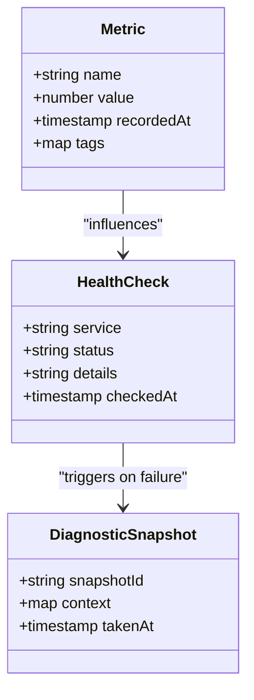
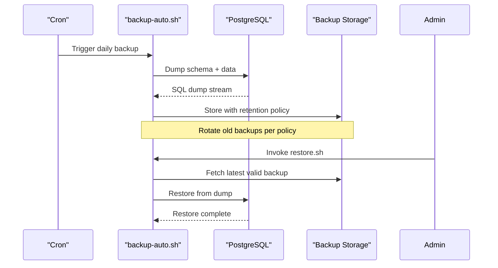
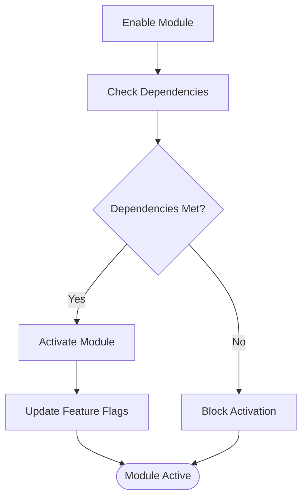
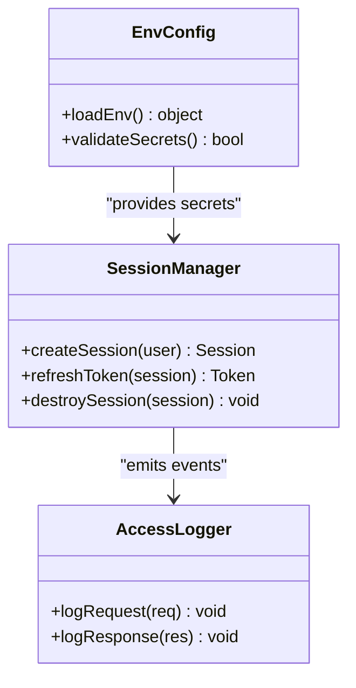
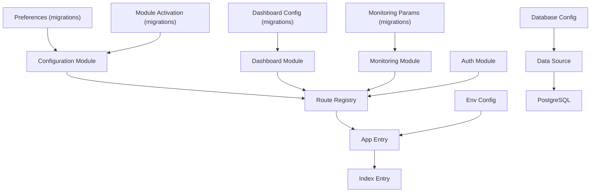

# System Configuration & Audit Schema

<cite>
**Referenced Files in This Document**
- [044-preferences-globales.sql](file://backend/database/migrations/044-preferences-globales.sql)
- [046-dashboard-config.sql](file://backend/database/migrations/046-dashboard-config.sql)
- [046-preferences-utilisateur-et-config.sql](file://backend/database/migrations/046-preferences-utilisateur-et-config.sql)
- [080-preferences-utilisateur-multi-tenant.sql](file://backend/database/migrations/080-preferences-utilisateur-multi-tenant.sql)
- [099-add-monitoring-params.sql](file://backend/database/migrations/099-add-monitoring-params.sql)
- [107-cleanup-configuration-modules-actif.sql](file://backend/database/migrations/107-cleanup-configuration-modules-actif.sql)
- [audit-trail.md](file://backend/docs/audit-trail.md)
- [IMPLEMENTATION-AUDIT-TRAIL.md](file://docs/implementations/IMPLEMENTATION-AUDIT-TRAIL.md)
- [DASHBOARD-SYSTEM.md](file://backend/docs/DASHBOARD-SYSTEM.md)
- [DASHBOARD-FRONTEND-INTEGRATION.md](file://backend/docs/DASHBOARD-FRONTEND-INTEGRATION.md)
- [DASHBOARD-IMPLEMENTATION-SUMMARY.md](file://backend/docs/DASHBOARD-IMPLEMENTATION-SUMMARY.md)
- [backup-auto.sh](file://docker/scripts/backup-auto.sh)
- [restore.sh](file://docker/scripts/restore.sh)
- [cron-backup.txt](file://docker/scripts/cron-backup.txt)
- [AUDIT-FINAL.md](file://docker/AUDIT-FINAL.md)
- [app.ts](file://backend/src/app.ts)
- [index.ts](file://backend/src/index.ts)
- [route-registry.ts](file://backend/src/routes/route-registry.ts)
- [database.config.ts](file://backend/src/config/database.config.ts)
- [env.config.ts](file://backend/src/config/env.config.ts)
- [data-source.ts](file://backend/src/database/data-source.ts)
- [modules/configuration](file://backend/src/modules/configuration)
- [modules/dashboard](file://backend/src/modules/dashboard)
- [modules/monitoring](file://backend/src/modules/monitoring)
- [modules/auth](file://backend/src/modules/auth)
</cite>

## Table of Contents
1. [Introduction](#introduction)
2. [Project Structure](#project-structure)
3. [Core Components](#core-components)
4. [Architecture Overview](#architecture-overview)
5. [Detailed Component Analysis](#detailed-component-analysis)
6. [Dependency Analysis](#dependency-analysis)
7. [Performance Considerations](#performance-considerations)
8. [Troubleshooting Guide](#troubleshooting-guide)
9. [Conclusion](#conclusion)
10. [Appendices](#appendices)

## Introduction
This document provides comprehensive data model documentation for eLISAschool’s system configuration and audit schema. It covers global preferences management with parameter categorization, validation rules, and dynamic configuration loading; dashboard configuration including widget layouts, user preferences, and customization options; audit trail implementation with action logging, change tracking, and compliance reporting; monitoring entities for performance metrics, health checks, and diagnostics; backup and recovery configuration with retention policies and automated procedures; module activation system with feature flags and dependency management; security configuration, session management, and access logging; and entity relationships that tie together system administration, monitoring, and compliance workflows.

## Project Structure
The configuration and audit-related functionality spans database migrations, backend modules, scripts, and documentation:
- Database migrations define the core schema for preferences, dashboard configuration, monitoring parameters, and module activation.
- Backend modules implement runtime behavior for configuration, dashboard, monitoring, and authentication.
- Scripts automate backups, restores, and cron scheduling.
- Documentation describes dashboards and audit trails.

**Diagram sources**
- [044-preferences-globales.sql](file://backend/database/migrations/044-preferences-globales.sql)
- [046-dashboard-config.sql](file://backend/database/migrations/046-dashboard-config.sql)
- [046-preferences-utilisateur-et-config.sql](file://backend/database/migrations/046-preferences-utilisateur-et-config.sql)
- [080-preferences-utilisateur-multi-tenant.sql](file://backend/database/migrations/080-preferences-utilisateur-multi-tenant.sql)
- [099-add-monitoring-params.sql](file://backend/database/migrations/099-add-monitoring-params.sql)
- [107-cleanup-configuration-modules-actif.sql](file://backend/database/migrations/107-cleanup-configuration-modules-actif.sql)
- [database.config.ts](file://backend/src/config/database.config.ts)
- [env.config.ts](file://backend/src/config/env.config.ts)
- [data-source.ts](file://backend/src/database/data-source.ts)
- [route-registry.ts](file://backend/src/routes/route-registry.ts)
- [app.ts](file://backend/src/app.ts)
- [index.ts](file://backend/src/index.ts)
- [backup-auto.sh](file://docker/scripts/backup-auto.sh)
- [restore.sh](file://docker/scripts/restore.sh)
- [cron-backup.txt](file://docker/scripts/cron-backup.txt)

**Section sources**
- [044-preferences-globales.sql](file://backend/database/migrations/044-preferences-globales.sql)
- [046-dashboard-config.sql](file://backend/database/migrations/046-dashboard-config.sql)
- [046-preferences-utilisateur-et-config.sql](file://backend/database/migrations/046-preferences-utilisateur-et-config.sql)
- [080-preferences-utilisateur-multi-tenant.sql](file://backend/database/migrations/080-preferences-utilisateur-multi-tenant.sql)
- [099-add-monitoring-params.sql](file://backend/database/migrations/099-add-monitoring-params.sql)
- [107-cleanup-configuration-modules-actif.sql](file://backend/database/migrations/107-cleanup-configuration-modules-actif.sql)
- [database.config.ts](file://backend/src/config/database.config.ts)
- [env.config.ts](file://backend/src/config/env.config.ts)
- [data-source.ts](file://backend/src/database/data-source.ts)
- [route-registry.ts](file://backend/src/routes/route-registry.ts)
- [app.ts](file://backend/src/app.ts)
- [index.ts](file://backend/src/index.ts)
- [backup-auto.sh](file://docker/scripts/backup-auto.sh)
- [restore.sh](file://docker/scripts/restore.sh)
- [cron-backup.txt](file://docker/scripts/cron-backup.txt)

## Core Components
- Global Preferences Management: Centralized key-value configuration with categories, scopes (global, establishment, tenant), and validation rules. Supports dynamic reloading at runtime.
- Dashboard Configuration: Widget layout definitions, per-user preferences, and customization options persisted to the database.
- Audit Trail: Action logging, change tracking, and compliance reporting with structured events and metadata.
- Monitoring Entities: Performance metrics, health checks, and diagnostic snapshots stored and exposed via APIs.
- Backup and Recovery: Automated backups with retention policies and restore procedures orchestrated by scripts.
- Module Activation: Feature flags and dependency management controlling module availability across tenants.
- Security Configuration: Session management, access logging, and environment-driven settings.

**Section sources**
- [044-preferences-globales.sql](file://backend/database/migrations/044-preferences-globales.sql)
- [046-dashboard-config.sql](file://backend/database/migrations/046-dashboard-config.sql)
- [046-preferences-utilisateur-et-config.sql](file://backend/database/migrations/046-preferences-utilisateur-et-config.sql)
- [080-preferences-utilisateur-multi-tenant.sql](file://backend/database/migrations/080-preferences-utilisateur-multi-tenant.sql)
- [099-add-monitoring-params.sql](file://backend/database/migrations/099-add-monitoring-params.sql)
- [107-cleanup-configuration-modules-actif.sql](file://backend/database/migrations/107-cleanup-configuration-modules-actif.sql)
- [audit-trail.md](file://backend/docs/audit-trail.md)
- [IMPLEMENTATION-AUDIT-TRAIL.md](file://docs/implementations/IMPLEMENTATION-AUDIT-TRAIL.md)
- [DASHBOARD-SYSTEM.md](file://backend/docs/DASHBOARD-SYSTEM.md)
- [DASHBOARD-FRONTEND-INTEGRATION.md](file://backend/docs/DASHBOARD-FRONTEND-INTEGRATION.md)
- [DASHBOARD-IMPLEMENTATION-SUMMARY.md](file://backend/docs/DASHBOARD-IMPLEMENTATION-SUMMARY.md)
- [backup-auto.sh](file://docker/scripts/backup-auto.sh)
- [restore.sh](file://docker/scripts/restore.sh)
- [cron-backup.txt](file://docker/scripts/cron-backup.txt)

## Architecture Overview
The configuration and audit architecture integrates database-backed schemas with backend modules and operational scripts. The application bootstraps configuration from environment variables and database sources, exposes APIs through route registration, and persists audit and monitoring data.

**Diagram sources**
- [index.ts](file://backend/src/index.ts)
- [route-registry.ts](file://backend/src/routes/route-registry.ts)
- [app.ts](file://backend/src/app.ts)
- [env.config.ts](file://backend/src/config/env.config.ts)
- [database.config.ts](file://backend/src/config/database.config.ts)
- [data-source.ts](file://backend/src/database/data-source.ts)
- [backup-auto.sh](file://docker/scripts/backup-auto.sh)
- [restore.sh](file://docker/scripts/restore.sh)
- [cron-backup.txt](file://docker/scripts/cron-backup.txt)

## Detailed Component Analysis

### Global Preferences Management
Global preferences are modeled as a centralized key-value store with categorization and scoping. Key aspects include:
- Parameter Categorization: Parameters grouped by functional areas (e.g., system, UI, integrations).
- Validation Rules: Type constraints, allowed values, and range checks enforced at write time.
- Dynamic Loading: Runtime refresh without restarts, enabling hot updates to configuration.
- Multi-Tenant Scoping: Preferences scoped globally or per establishment/tenant.

**Diagram sources**
- [044-preferences-globales.sql](file://backend/database/migrations/044-preferences-globales.sql)
- [046-preferences-utilisateur-et-config.sql](file://backend/database/migrations/046-preferences-utilisateur-et-config.sql)
- [080-preferences-utilisateur-multi-tenant.sql](file://backend/database/migrations/080-preferences-utilisateur-multi-tenant.sql)

**Section sources**
- [044-preferences-globales.sql](file://backend/database/migrations/044-preferences-globales.sql)
- [046-preferences-utilisateur-et-config.sql](file://backend/database/migrations/046-preferences-utilisateur-et-config.sql)
- [080-preferences-utilisateur-multi-tenant.sql](file://backend/database/migrations/080-preferences-utilisateur-multi-tenant.sql)

### Dashboard Configuration
Dashboard configuration supports widget layouts, user-specific preferences, and customization options:
- Widget Layouts: Ordered lists of widgets with positions and visibility toggles.
- User Preferences: Per-user overrides for default layouts and theme settings.
- Customization Options: Theme colors, fonts, and branding elements persisted alongside configurations.

**Diagram sources**
- [046-dashboard-config.sql](file://backend/database/migrations/046-dashboard-config.sql)
- [DASHBOARD-SYSTEM.md](file://backend/docs/DASHBOARD-SYSTEM.md)
- [DASHBOARD-FRONTEND-INTEGRATION.md](file://backend/docs/DASHBOARD-FRONTEND-INTEGRATION.md)
- [DASHBOARD-IMPLEMENTATION-SUMMARY.md](file://backend/docs/DASHBOARD-IMPLEMENTATION-SUMMARY.md)

**Section sources**
- [046-dashboard-config.sql](file://backend/database/migrations/046-dashboard-config.sql)
- [DASHBOARD-SYSTEM.md](file://backend/docs/DASHBOARD-SYSTEM.md)
- [DASHBOARD-FRONTEND-INTEGRATION.md](file://backend/docs/DASHBOARD-FRONTEND-INTEGRATION.md)
- [DASHBOARD-IMPLEMENTATION-SUMMARY.md](file://backend/docs/DASHBOARD-IMPLEMENTATION-SUMMARY.md)

### Audit Trail Implementation
Audit trail captures actions, changes, and compliance events:
- Action Logging: Structured entries with actor, target, action type, and timestamp.
- Change Tracking: Before/after snapshots for critical updates.
- Compliance Reporting: Aggregated logs filtered by date ranges, actors, and modules.

**Diagram sources**
- [audit-trail.md](file://backend/docs/audit-trail.md)
- [IMPLEMENTATION-AUDIT-TRAIL.md](file://docs/implementations/IMPLEMENTATION-AUDIT-TRAIL.md)

**Section sources**
- [audit-trail.md](file://backend/docs/audit-trail.md)
- [IMPLEMENTATION-AUDIT-TRAIL.md](file://docs/implementations/IMPLEMENTATION-AUDIT-TRAIL.md)

### Monitoring Entities
Monitoring entities track performance metrics, health checks, and diagnostics:
- Metrics: CPU, memory, request latency, error rates.
- Health Checks: Service readiness and liveness probes.
- Diagnostics: Snapshotting of runtime state for troubleshooting.

**Diagram sources**
- [099-add-monitoring-params.sql](file://backend/database/migrations/099-add-monitoring-params.sql)

**Section sources**
- [099-add-monitoring-params.sql](file://backend/database/migrations/099-add-monitoring-params.sql)

### Backup and Recovery Configuration
Backup and recovery are automated via scripts and cron:
- Retention Policies: Daily, weekly, monthly rotations managed by scripts.
- Automated Procedures: Scheduled backups and integrity checks.
- Restore Process: Point-in-time restoration using generated SQL dumps.

**Diagram sources**
- [backup-auto.sh](file://docker/scripts/backup-auto.sh)
- [restore.sh](file://docker/scripts/restore.sh)
- [cron-backup.txt](file://docker/scripts/cron-backup.txt)
- [AUDIT-FINAL.md](file://docker/AUDIT-FINAL.md)

**Section sources**
- [backup-auto.sh](file://docker/scripts/backup-auto.sh)
- [restore.sh](file://docker/scripts/restore.sh)
- [cron-backup.txt](file://docker/scripts/cron-backup.txt)
- [AUDIT-FINAL.md](file://docker/AUDIT-FINAL.md)

### Module Activation System
Module activation uses feature flags and dependency management:
- Feature Flags: Boolean switches per module and tenant.
- Dependency Management: Ensures required modules are active before enabling dependent ones.
- Cleanup: Migration ensures consistent activation states.

**Diagram sources**
- [107-cleanup-configuration-modules-actif.sql](file://backend/database/migrations/107-cleanup-configuration-modules-actif.sql)

**Section sources**
- [107-cleanup-configuration-modules-actif.sql](file://backend/database/migrations/107-cleanup-configuration-modules-actif.sql)

### Security Configuration, Session Management, and Access Logging
Security configuration includes environment-driven settings, session handling, and access logging:
- Environment Settings: Secrets, tokens, and endpoints configured via env.config.ts.
- Session Management: Secure session lifecycle and token rotation.
- Access Logging: Request/response metadata captured for auditing.

**Diagram sources**
- [env.config.ts](file://backend/src/config/env.config.ts)
- [app.ts](file://backend/src/app.ts)
- [index.ts](file://backend/src/index.ts)

**Section sources**
- [env.config.ts](file://backend/src/config/env.config.ts)
- [app.ts](file://backend/src/app.ts)
- [index.ts](file://backend/src/index.ts)

## Dependency Analysis
The following diagram maps dependencies among configuration, dashboard, monitoring, auth, and operational components:

**Diagram sources**
- [044-preferences-globales.sql](file://backend/database/migrations/044-preferences-globales.sql)
- [046-dashboard-config.sql](file://backend/database/migrations/046-dashboard-config.sql)
- [099-add-monitoring-params.sql](file://backend/database/migrations/099-add-monitoring-params.sql)
- [107-cleanup-configuration-modules-actif.sql](file://backend/database/migrations/107-cleanup-configuration-modules-actif.sql)
- [route-registry.ts](file://backend/src/routes/route-registry.ts)
- [app.ts](file://backend/src/app.ts)
- [index.ts](file://backend/src/index.ts)
- [env.config.ts](file://backend/src/config/env.config.ts)
- [database.config.ts](file://backend/src/config/database.config.ts)
- [data-source.ts](file://backend/src/database/data-source.ts)

**Section sources**
- [044-preferences-globales.sql](file://backend/database/migrations/044-preferences-globales.sql)
- [046-dashboard-config.sql](file://backend/database/migrations/046-dashboard-config.sql)
- [099-add-monitoring-params.sql](file://backend/database/migrations/099-add-monitoring-params.sql)
- [107-cleanup-configuration-modules-actif.sql](file://backend/database/migrations/107-cleanup-configuration-modules-actif.sql)
- [route-registry.ts](file://backend/src/routes/route-registry.ts)
- [app.ts](file://backend/src/app.ts)
- [index.ts](file://backend/src/index.ts)
- [env.config.ts](file://backend/src/config/env.config.ts)
- [database.config.ts](file://backend/src/config/database.config.ts)
- [data-source.ts](file://backend/src/database/data-source.ts)

## Performance Considerations
- Prefer indexed queries on frequently accessed preference keys and dashboard configs.
- Cache validated configuration at startup and invalidate on reload events.
- Batch audit writes during high-throughput operations to reduce DB pressure.
- Use connection pooling and read replicas for monitoring metric ingestion.

[No sources needed since this section provides general guidance]

## Troubleshooting Guide
- Configuration Reload Failures: Verify validation rules and ensure environment variables are present.
- Dashboard Layout Not Applying: Check user preference overrides and default layout consistency.
- Audit Logs Missing: Confirm middleware integration and persistence layer connectivity.
- Monitoring Metrics Gaps: Inspect health check intervals and storage quotas.
- Backup Integrity Issues: Validate cron execution and storage permissions; review restore logs.

**Section sources**
- [044-preferences-globales.sql](file://backend/database/migrations/044-preferences-globales.sql)
- [046-dashboard-config.sql](file://backend/database/migrations/046-dashboard-config.sql)
- [audit-trail.md](file://backend/docs/audit-trail.md)
- [099-add-monitoring-params.sql](file://backend/database/migrations/099-add-monitoring-params.sql)
- [backup-auto.sh](file://docker/scripts/backup-auto.sh)
- [restore.sh](file://docker/scripts/restore.sh)

## Conclusion
eLISAschool’s configuration and audit schema provide a robust foundation for system administration, monitoring, and compliance. The database-backed preferences and dashboard configurations enable flexible customization, while the audit trail and monitoring entities support observability and accountability. Automated backup and recovery processes ensure resilience, and the module activation system allows controlled feature rollout. Together, these components form a cohesive platform for secure, scalable school management.

[No sources needed since this section summarizes without analyzing specific files]

## Appendices
- Entity Relationships Overview:
  - Preferences relate to categories and scopes, supporting multi-tenant isolation.
  - Dashboard configurations link to users and themes, allowing personalized layouts.
  - Audit records connect to actors, targets, and modules for traceability.
  - Monitoring metrics and health checks feed into diagnostic snapshots.
  - Module activation flags depend on prerequisite modules and tenant contexts.

[No sources needed since this section doesn't analyze specific files]